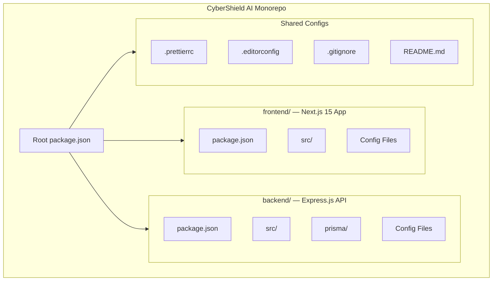
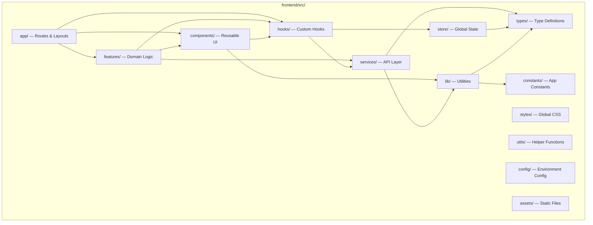
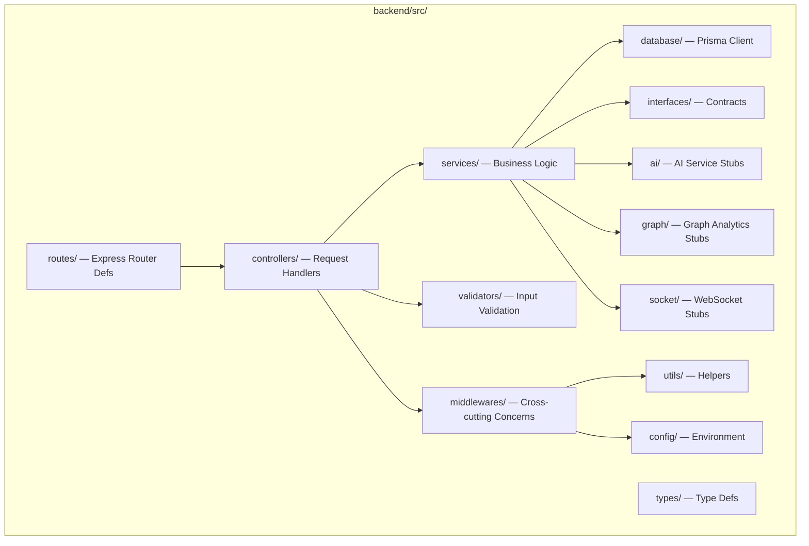
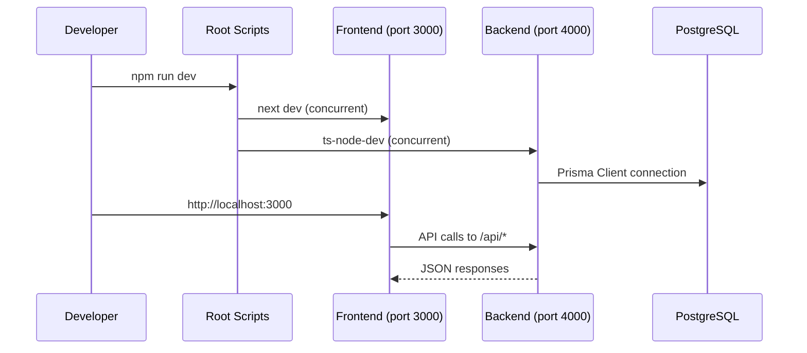
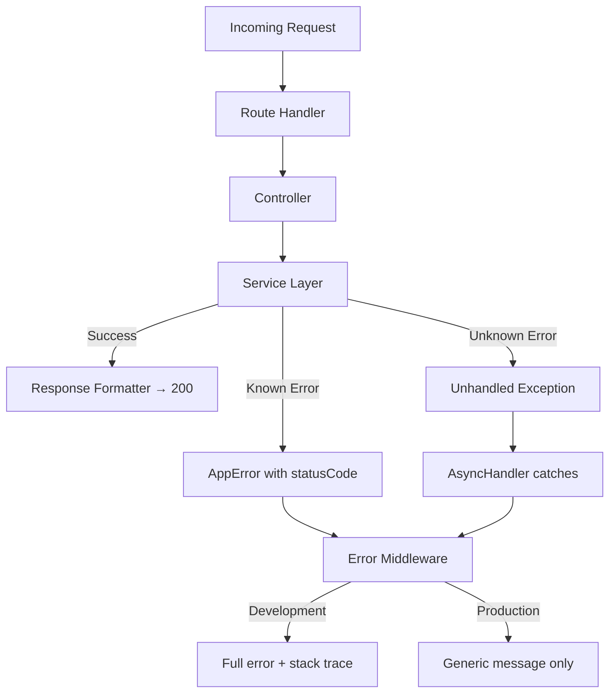

# Design Document: CyberShield AI — Engineering Foundation

## Overview

This design document specifies the complete engineering foundation for CyberShield AI — an AI-Powered Digital Public Safety Intelligence Platform. The foundation establishes a monorepo architecture containing a Next.js 15 frontend application and an Express.js backend server, both with TypeScript, along with all necessary tooling, configuration, and utility scaffolding.

The scope is exclusively project setup and scaffolding — no feature logic, UI components, or pages are implemented. The output is a production-quality skeleton that future developers extend to build the 8-portal, 69-screen platform defined in the Information Architecture spec.

### Design Goals

1. **Type Safety First** — Strict TypeScript everywhere with no `any` escape hatches
2. **Predictable Structure** — Feature-based folder organization matching the Frontend Architecture spec (P09)
3. **Zero-Config DX** — Developers clone, install, and start working immediately
4. **Separation of Concerns** — Clean architecture layers in the backend, import rules in the frontend
5. **Scalability** — Folder structure accommodates 8 portals, 69+ screens, and future service expansions

### Technology Decisions

| Layer | Technology | Rationale |
|-------|-----------|-----------|
| Frontend Framework | Next.js 15 (App Router) | Server Components, streaming SSR, file-based routing |
| UI Styling | Tailwind CSS v4 | Utility-first, tree-shakeable, design token compatible |
| Component Library | Shadcn UI + Lucide Icons | Composable, accessible primitives without lock-in |
| 3D Visualization | React Three Fiber + Drei + Three.js | Declarative Three.js with React lifecycle integration |
| Animation | Framer Motion + GSAP | Layout animations (FM) + complex timelines (GSAP) |
| Backend Runtime | Node.js + Express.js | Lightweight, middleware-composable, mature ecosystem |
| ORM | Prisma | Type-safe database access, schema-as-code, migrations |
| Database | PostgreSQL | Relational, JSONB support, full-text search, PostGIS-ready |
| Linting | ESLint + Prettier | Consistent code style, auto-fixable |

---

## Architecture

### High-Level Repository Architecture



### Frontend Source Architecture



### Backend Clean Architecture Layers



### Development Workflow



---

## Components and Interfaces

### Repository Root Structure

```
cybershield-ai/
├── frontend/                    # Next.js 15 application
│   ├── public/                  # Static assets served at /
│   ├── src/                     # Application source code
│   │   ├── app/                 # Next.js App Router pages & layouts
│   │   ├── components/          # Reusable component library
│   │   │   ├── shared/          # Cross-portal shared components
│   │   │   ├── layout/          # Shell/layout components
│   │   │   ├── ui/              # Shadcn UI primitives
│   │   │   ├── three/           # Three.js scene components
│   │   │   ├── animations/      # Animation wrappers
│   │   │   └── navigation/      # Nav components
│   │   ├── features/            # Domain feature modules
│   │   │   ├── _template/       # Reference template for new features
│   │   │   ├── citizen/         # Citizen portal features
│   │   │   ├── police/          # Police command center features
│   │   │   └── analytics/       # Analytics features
│   │   ├── hooks/               # Custom React hooks
│   │   ├── lib/                 # Library utilities (API client, cn, etc.)
│   │   ├── services/            # API service layer
│   │   ├── store/               # Zustand state stores
│   │   ├── styles/              # Global stylesheets
│   │   ├── types/               # TypeScript type definitions
│   │   ├── utils/               # Generic utility functions
│   │   ├── constants/           # Application constants
│   │   ├── config/              # Environment-aware configuration
│   │   └── assets/              # Static assets (3D models, icons)
│   ├── components.json          # Shadcn UI configuration
│   ├── next.config.ts           # Next.js configuration
│   ├── tailwind.config.ts       # Tailwind CSS configuration
│   ├── tsconfig.json            # TypeScript configuration
│   ├── .eslintrc.json           # ESLint configuration
│   ├── .env.example             # Environment variable template
│   └── package.json             # Frontend dependencies & scripts
├── backend/                     # Express.js API server
│   ├── prisma/                  # Database layer
│   │   ├── schema.prisma        # Prisma schema definition
│   │   └── migrations/          # Database migrations
│   ├── src/                     # Server source code
│   │   ├── controllers/         # Request handlers
│   │   ├── routes/              # Express route definitions
│   │   ├── services/            # Business logic layer
│   │   ├── middlewares/         # Express middlewares
│   │   ├── config/              # Server configuration
│   │   ├── database/            # Prisma client setup
│   │   ├── utils/               # Server utilities
│   │   ├── types/               # Server type definitions
│   │   ├── interfaces/          # Interface contracts
│   │   ├── validators/          # Input validation schemas
│   │   ├── ai/                  # AI service stubs
│   │   ├── graph/               # Graph analytics stubs
│   │   ├── socket/              # WebSocket stubs
│   │   └── index.ts             # Server entry point
│   ├── tsconfig.json            # Backend TypeScript config
│   ├── .eslintrc.json           # Backend ESLint config
│   ├── .env.example             # Backend env template
│   └── package.json             # Backend dependencies & scripts
├── .prettierrc                  # Shared Prettier config
├── .editorconfig                # Editor configuration
├── .gitignore                   # Git ignore rules
├── package.json                 # Root workspace scripts
└── README.md                    # Project documentation
```

### Frontend Configuration Interfaces

```typescript
// next.config.ts
import type { NextConfig } from 'next';

const nextConfig: NextConfig = {
  reactStrictMode: true,
  experimental: {
    typedRoutes: true,
  },
};

export default nextConfig;
```

```typescript
// tsconfig.json — Frontend
{
  "compilerOptions": {
    "target": "ES2017",
    "lib": ["dom", "dom.iterable", "esnext"],
    "allowJs": true,
    "skipLibCheck": true,
    "strict": true,
    "noUncheckedIndexedAccess": true,
    "noImplicitReturns": true,
    "exactOptionalPropertyTypes": true,
    "forceConsistentCasingInFileNames": true,
    "noEmit": true,
    "esModuleInterop": true,
    "module": "esnext",
    "moduleResolution": "bundler",
    "resolveJsonModule": true,
    "isolatedModules": true,
    "jsx": "preserve",
    "incremental": true,
    "plugins": [{ "name": "next" }],
    "baseUrl": ".",
    "paths": {
      "@/*": ["./src/*"],
      "@/components/*": ["./src/components/*"],
      "@/features/*": ["./src/features/*"],
      "@/hooks/*": ["./src/hooks/*"],
      "@/lib/*": ["./src/lib/*"],
      "@/services/*": ["./src/services/*"],
      "@/store/*": ["./src/store/*"],
      "@/types/*": ["./src/types/*"],
      "@/utils/*": ["./src/utils/*"],
      "@/constants/*": ["./src/constants/*"],
      "@/config/*": ["./src/config/*"]
    }
  },
  "include": ["next-env.d.ts", "**/*.ts", "**/*.tsx", ".next/types/**/*.ts"],
  "exclude": ["node_modules"]
}
```

```typescript
// tailwind.config.ts
import type { Config } from 'tailwindcss';

const config: Config = {
  content: [
    './src/app/**/*.{ts,tsx,css}',
    './src/components/**/*.{ts,tsx,css}',
    './src/features/**/*.{ts,tsx,css}',
    './src/hooks/**/*.{ts,tsx,css}',
    './src/lib/**/*.{ts,tsx,css}',
    './src/services/**/*.{ts,tsx,css}',
    './src/store/**/*.{ts,tsx,css}',
    './src/styles/**/*.{ts,tsx,css}',
    './src/types/**/*.{ts,tsx,css}',
    './src/utils/**/*.{ts,tsx,css}',
    './src/constants/**/*.{ts,tsx,css}',
    './src/config/**/*.{ts,tsx,css}',
  ],
  theme: {
    extend: {},
  },
  plugins: [],
};

export default config;
```

### Backend Configuration Interfaces

```typescript
// backend/tsconfig.json
{
  "compilerOptions": {
    "target": "ES2020",
    "module": "commonjs",
    "lib": ["ES2020"],
    "outDir": "./dist",
    "rootDir": "./src",
    "strict": true,
    "noUncheckedIndexedAccess": true,
    "noImplicitReturns": true,
    "esModuleInterop": true,
    "skipLibCheck": true,
    "forceConsistentCasingInFileNames": true,
    "resolveJsonModule": true,
    "declaration": true,
    "declarationMap": true,
    "sourceMap": true,
    "baseUrl": ".",
    "paths": {
      "@/*": ["./src/*"]
    }
  },
  "include": ["src/**/*"],
  "exclude": ["node_modules", "dist"]
}
```

```prisma
// backend/prisma/schema.prisma
generator client {
  provider = "prisma-client-js"
}

datasource db {
  provider = "postgresql"
  url      = env("DATABASE_URL")
}

model Placeholder {
  id        String   @id @default(uuid())
  createdAt DateTime @default(now())
  updatedAt DateTime @updatedAt
  name      String
}
```

### Middleware Layer Interfaces

```typescript
// Error handling middleware interface
interface ErrorResponse {
  success: boolean;
  message: string;
  statusCode: number;
  stack?: string; // Only in development mode
}

// Request logger output format
interface RequestLogEntry {
  method: string;    // HTTP method (GET, POST, etc.)
  path: string;      // URL path
  statusCode: number; // Response status code
  responseTime: number; // Duration in milliseconds
  timestamp: string;  // ISO 8601 timestamp
}

// CORS configuration interface
interface CorsConfig {
  origin: string | string[]; // From CORS_ORIGINS env var
  credentials: boolean;
  methods: string[];
  allowedHeaders: string[];
}

// Health check response
interface HealthCheckResponse {
  status: 'ok';
  timestamp: string; // ISO 8601
}
```

### Utility Module Interfaces

```typescript
// Frontend — API Client (src/lib/api-client.ts)
interface ApiClient {
  baseURL: string;
  defaultHeaders: Record<string, string>;
  get<T>(url: string, config?: RequestConfig): Promise<T>;
  post<T>(url: string, data?: unknown, config?: RequestConfig): Promise<T>;
  put<T>(url: string, data?: unknown, config?: RequestConfig): Promise<T>;
  delete<T>(url: string, config?: RequestConfig): Promise<T>;
}

// Frontend — cn utility (src/lib/cn.ts)
type ClassValue = string | undefined | null | false;
function cn(...inputs: ClassValue[]): string;

// Frontend — Date formatting (src/lib/date.ts)
function formatDate(date: Date, format?: string): string;
function formatRelativeTime(date: Date): string;

// Backend — Response formatter (backend/src/utils/response.ts)
interface ApiResponse<T = unknown> {
  success: boolean;
  data: T;
  message?: string;
}
function formatResponse<T>(data: T, message?: string): ApiResponse<T>;
function formatError(message: string, statusCode?: number): ErrorResponse;

// Backend — Async handler (backend/src/utils/async-handler.ts)
type AsyncRouteHandler = (
  req: Request,
  res: Response,
  next: NextFunction
) => Promise<void>;
function asyncHandler(fn: AsyncRouteHandler): RequestHandler;

// Backend — Validation helpers (backend/src/utils/validation.ts)
function isNonEmptyString(value: unknown): value is string;
function isValidEmail(value: string): boolean;
function isValidUUID(value: string): boolean;
```

### Environment Configuration Interface

```typescript
// Frontend environment variables (src/types/env.d.ts)
declare namespace NodeJS {
  interface ProcessEnv {
    NEXT_PUBLIC_API_URL: string;
    NEXT_PUBLIC_APP_NAME: string;
    NEXT_PUBLIC_APP_VERSION: string;
    NODE_ENV: 'development' | 'production' | 'test';
  }
}

// Backend environment variables
interface BackendEnv {
  PORT: number;
  NODE_ENV: 'development' | 'production' | 'test';
  DATABASE_URL: string;
  CORS_ORIGINS: string;
  JWT_SECRET: string;
  LOG_LEVEL: 'debug' | 'info' | 'warn' | 'error';
}

// Environment validation — validates on startup, throws listing missing vars
function validateEnv(required: string[]): void;
```

### Constants Registry Interface

```typescript
// frontend/src/constants/routes.ts
const ROUTES = {
  HOME: '/',
  DASHBOARD: '/dashboard',
  LOGIN: '/login',
  REGISTER: '/register',
  SCANNER: '/scanner',
  REPORTS: '/reports',
} as const;

// frontend/src/constants/api.ts
const API_ENDPOINTS = {
  HEALTH: '/api/health',
  AUTH: '/api/auth',
  SCANS: '/api/scans',
  REPORTS: '/api/reports',
  USERS: '/api/users',
} as const;

// frontend/src/constants/config.ts
const APP_CONFIG = {
  APP_NAME: 'CyberShield AI',
  VERSION: '1.0.0',
  DEFAULT_PAGE_SIZE: 20,
  MAX_FILE_SIZE: 10 * 1024 * 1024, // 10MB
} as const;
```

### Package Scripts Specification

```json
// frontend/package.json scripts
{
  "dev": "next dev",
  "build": "next build",
  "start": "next start",
  "lint": "eslint . --ext .ts,.tsx",
  "lint:fix": "eslint . --ext .ts,.tsx --fix",
  "format": "prettier --write \"src/**/*.{ts,tsx,css}\"",
  "format:check": "prettier --check \"src/**/*.{ts,tsx,css}\"",
  "type-check": "tsc --noEmit"
}

// backend/package.json scripts
{
  "dev": "ts-node-dev --respawn --transpile-only src/index.ts",
  "build": "tsc",
  "start": "node dist/index.js",
  "lint": "eslint . --ext .ts",
  "lint:fix": "eslint . --ext .ts --fix",
  "format": "prettier --write \"src/**/*.ts\"",
  "format:check": "prettier --check \"src/**/*.ts\"",
  "db:generate": "prisma generate",
  "db:migrate": "prisma migrate dev",
  "db:studio": "prisma studio"
}

// root package.json scripts
{
  "dev": "concurrently \"npm run dev --prefix frontend\" \"npm run dev --prefix backend\"",
  "build": "npm run build --prefix frontend && npm run build --prefix backend",
  "lint": "npm run lint --prefix frontend && npm run lint --prefix backend",
  "format": "npm run format --prefix frontend && npm run format --prefix backend"
}
```

### Code Quality Configuration

```json
// .prettierrc (shared root)
{
  "semi": true,
  "singleQuote": true,
  "tabWidth": 2,
  "trailingComma": "es5",
  "printWidth": 100
}
```

```ini
# .editorconfig (shared root)
root = true

[*]
indent_style = space
indent_size = 2
charset = utf-8
end_of_line = lf
trim_trailing_whitespace = true
insert_final_newline = true

[*.md]
trim_trailing_whitespace = false
```

```json
// frontend/.eslintrc.json
{
  "extends": [
    "next/core-web-vitals",
    "plugin:@typescript-eslint/recommended"
  ],
  "parser": "@typescript-eslint/parser",
  "plugins": ["@typescript-eslint"],
  "rules": {
    "@typescript-eslint/no-unused-vars": ["error", { "argsIgnorePattern": "^_" }],
    "@typescript-eslint/no-explicit-any": "error"
  }
}
```

```json
// backend/.eslintrc.json
{
  "extends": [
    "plugin:@typescript-eslint/recommended"
  ],
  "parser": "@typescript-eslint/parser",
  "plugins": ["@typescript-eslint"],
  "env": {
    "node": true,
    "es2020": true
  },
  "rules": {
    "@typescript-eslint/no-unused-vars": ["error", { "argsIgnorePattern": "^_" }],
    "@typescript-eslint/no-explicit-any": "error"
  }
}
```

### Git Configuration

```gitignore
# .gitignore
# Dependencies
node_modules/

# Build outputs
.next/
dist/
out/

# Environment files
.env
.env.local
.env.development
.env.production

# Keep example env files
!.env.example

# Logs
*.log
npm-debug.log*

# OS files
.DS_Store
Thumbs.db

# IDE files
.idea/
.vscode/
!.vscode/settings.json
!.vscode/extensions.json

# Testing
coverage/

# Prisma
prisma/*.db

# Misc
*.tsbuildinfo
```

---

## Data Models

### Frontend Type Definitions

```typescript
// src/types/common.ts
export interface BaseEntity {
  id: string;
  createdAt: string;
  updatedAt: string;
}

export interface PaginatedResponse<T> {
  data: T[];
  total: number;
  page: number;
  pageSize: number;
  totalPages: number;
}

export type Nullable<T> = T | null;
export type Optional<T> = T | undefined;
```

```typescript
// src/types/api.ts
export interface ApiSuccessResponse<T = unknown> {
  success: true;
  data: T;
  message?: string;
}

export interface ApiErrorResponse {
  success: false;
  message: string;
  statusCode: number;
  errors?: Record<string, string[]>;
}

export type ApiResponse<T = unknown> = ApiSuccessResponse<T> | ApiErrorResponse;

export interface RequestConfig {
  headers?: Record<string, string>;
  params?: Record<string, string | number | boolean>;
  signal?: AbortSignal;
}
```

```typescript
// src/types/env.d.ts
declare namespace NodeJS {
  interface ProcessEnv {
    NEXT_PUBLIC_API_URL: string;
    NEXT_PUBLIC_APP_NAME: string;
    NEXT_PUBLIC_APP_VERSION: string;
    NODE_ENV: 'development' | 'production' | 'test';
  }
}
```

### Backend Type Definitions

```typescript
// backend/src/types/index.ts
export interface ServiceConfig {
  name: string;
  version: string;
  port: number;
  env: 'development' | 'production' | 'test';
}

export interface AppError extends Error {
  statusCode: number;
  isOperational: boolean;
}
```

```typescript
// backend/src/interfaces/index.ts
export interface IBaseService {
  initialize(): Promise<void>;
  shutdown(): Promise<void>;
}

export interface IController {
  path: string;
  initializeRoutes(): void;
}
```

### Prisma Schema (Database Layer)

```prisma
generator client {
  provider = "prisma-client-js"
}

datasource db {
  provider = "postgresql"
  url      = env("DATABASE_URL")
}

model Placeholder {
  id        String   @id @default(uuid())
  createdAt DateTime @default(now())
  updatedAt DateTime @updatedAt
  name      String
}
```

---


## Correctness Properties

*A property is a characteristic or behavior that should hold true across all valid executions of a system — essentially, a formal statement about what the system should do. Properties serve as the bridge between human-readable specifications and machine-verifiable correctness guarantees.*

While this foundation spec is primarily scaffolding (directory structure, config files, dependency installation), several utility and middleware modules contain testable logic with meaningful input variation. The following properties cover those modules.

### Property 1: Error response structure invariant

*For any* error passed to the global error handling middleware, the JSON response SHALL always contain exactly three fields: `success` (boolean, always false), `message` (non-empty string), and `statusCode` (number between 100 and 599), regardless of the error type, message content, or runtime environment.

**Validates: Requirements 7.1**

### Property 2: Error detail visibility by environment

*For any* error processed by the global error handling middleware, the response SHALL include the `stack` field if and only if `NODE_ENV` equals `'development'`. In production mode, the response SHALL never contain `stack` or the original error's internal message when it differs from the generic category message.

**Validates: Requirements 7.4, 7.5**

### Property 3: Request logging completeness

*For any* HTTP request processed by the logging middleware with any valid HTTP method and any URL path, the resulting log entry SHALL contain the request method (string), URL path (string), response status code (number), and response time in milliseconds (non-negative number).

**Validates: Requirements 7.2**

### Property 4: CORS origin enforcement

*For any* request origin string and any set of allowed origins configured via environment variable, the CORS middleware SHALL include the `Access-Control-Allow-Origin` header with the request origin if and only if the origin appears in the allowed origins set.

**Validates: Requirements 7.3**

### Property 5: Environment variable precedence

*For any* environment variable key defined in multiple `.env` files, the resolved value SHALL equal the value from the highest-precedence file in the order: `.env.local` > `.env.{NODE_ENV}` > `.env`.

**Validates: Requirements 8.1**

### Property 6: Required variable validation completeness

*For any* set of required environment variable names where one or more variables are missing from the environment, the validation function SHALL throw an error whose message contains every missing variable name. No missing variable shall be omitted from the error message, and no present variable shall be falsely reported as missing.

**Validates: Requirements 8.2**

### Property 7: Class name merge utility (cn)

*For any* array of inputs where each element is a string, undefined, null, or false, the `cn` utility SHALL return a single string that contains no `undefined`, `null`, or `false` literals, contains all non-empty input strings separated by spaces, and has no leading or trailing whitespace.

**Validates: Requirements 10.1**

### Property 8: Response formatter structure

*For any* data value of any type passed to the response formatter, the returned object SHALL always contain `success: true` and a `data` field equal to the original input value. If an optional message is provided, it SHALL appear in the `message` field; otherwise `message` SHALL be absent or undefined.

**Validates: Requirements 10.2**

### Property 9: Async handler error forwarding

*For any* async route handler function that rejects with an error, the `asyncHandler` wrapper SHALL invoke the Express `next` function with that exact error, ensuring no unhandled promise rejection occurs and the error propagates to the error handling middleware.

**Validates: Requirements 10.2**

---

## Error Handling

### Frontend Error Handling Strategy

| Layer | Strategy | Implementation |
|-------|----------|----------------|
| Route Level | Next.js `error.tsx` boundary | Catches unhandled errors per route segment |
| Global | Root `error.tsx` in `app/` | Catches errors that escape route boundaries |
| API Calls | Try/catch in service layer | API client interceptors handle HTTP errors |
| Type Safety | Strict TypeScript | Prevents null/undefined access at compile time |

### Backend Error Handling Strategy



### Error Categories

| Status Code | Category | Production Message |
|-------------|----------|-------------------|
| 400 | Validation Error | "Invalid request parameters" |
| 401 | Authentication Error | "Authentication required" |
| 403 | Authorization Error | "Insufficient permissions" |
| 404 | Not Found | "Resource not found" |
| 409 | Conflict | "Resource conflict" |
| 422 | Unprocessable | "Unable to process request" |
| 429 | Rate Limited | "Too many requests" |
| 500 | Internal Error | "Internal server error" |

### Error Response Shape

```typescript
// All error responses follow this structure
interface ErrorResponse {
  success: false;
  message: string;       // Human-readable category message
  statusCode: number;    // HTTP status code
  stack?: string;        // Only present in development
  errors?: Record<string, string[]>; // Optional validation details
}
```

---

## Testing Strategy

### Testing Approach

This foundation spec uses a **dual testing approach**:

1. **Smoke Tests** — Verify project scaffolding (files exist, configs correct, directories present)
2. **Property-Based Tests** — Verify utility/middleware logic holds universally across inputs
3. **Integration Tests** — Verify builds compile, servers start, and commands execute

### Property-Based Testing Configuration

**Library**: [fast-check](https://github.com/dubzzz/fast-check) (TypeScript-native PBT library)

**Configuration**:
- Minimum 100 iterations per property test
- Each test tagged with design property reference
- Tag format: `Feature: cybershield-ai-foundation, Property {N}: {title}`

### Test Categories by Requirement

| Requirement | Test Type | What's Verified |
|-------------|-----------|-----------------|
| R1: Frontend Init | Smoke + Integration | Config files exist, dev server starts |
| R2: Directory Structure | Smoke | All directories and barrel exports exist |
| R3: Dependencies | Smoke | package.json contains all deps |
| R4: TypeScript/Paths | Smoke + Integration | tsconfig correct, tsc --noEmit passes |
| R5: Backend Init | Smoke + Integration | Files exist, server starts, health check works |
| R6: Backend Structure | Smoke | Directories and barrel exports exist |
| R7: Middleware | **Property-Based** + Example | Error handler, logger, CORS (Properties 1-4) |
| R8: Environment | **Property-Based** + Example | Precedence, validation (Properties 5-6) |
| R9: Constants | Smoke | Files export frozen objects with required keys |
| R10: Utilities | **Property-Based** + Smoke | cn, formatter, asyncHandler (Properties 7-9) |
| R11: Scripts | Integration | All scripts execute without errors |
| R12: Code Quality | Smoke + Integration | Config files correct, lint passes clean |

### Property Test Implementation Plan

```typescript
// Example property test structure
import fc from 'fast-check';

describe('Feature: cybershield-ai-foundation', () => {
  // Property 1: Error response structure invariant
  it('Property 1: Error response structure invariant', () => {
    fc.assert(
      fc.property(
        fc.record({
          message: fc.string({ minLength: 1 }),
          statusCode: fc.integer({ min: 100, max: 599 }),
        }),
        (errorInput) => {
          const response = errorMiddleware(errorInput);
          expect(response.success).toBe(false);
          expect(typeof response.message).toBe('string');
          expect(response.message.length).toBeGreaterThan(0);
          expect(response.statusCode).toBeGreaterThanOrEqual(100);
          expect(response.statusCode).toBeLessThanOrEqual(599);
        }
      ),
      { numRuns: 100 }
    );
  });

  // Property 7: cn utility
  it('Property 7: Class name merge utility', () => {
    fc.assert(
      fc.property(
        fc.array(fc.oneof(fc.string(), fc.constant(undefined), fc.constant(null), fc.constant(false))),
        (inputs) => {
          const result = cn(...inputs);
          expect(result).not.toContain('undefined');
          expect(result).not.toContain('null');
          expect(result).not.toContain('false');
          expect(result).toBe(result.trim());
        }
      ),
      { numRuns: 100 }
    );
  });
});
```

### Unit Test Coverage (Example-Based)

- Environment config: missing file doesn't crash (8.3)
- Environment-aware config: dev vs prod base URLs (9.4)
- Custom hook: returns correct type, uses React hooks
- Base service: accepts config via constructor

### Integration Test Coverage

- `npm run dev` starts frontend on port 3000
- `npm run dev` starts backend on port 4000
- `GET /api/health` returns `{ status: "ok", timestamp: "..." }`
- `npm run build` produces `.next/` and `dist/`
- `npm run lint` exits with code 0
- `tsc --noEmit` passes with path alias imports

### Test Runner Configuration

- **Frontend**: Vitest (fast, ESM-native, integrates with Next.js)
- **Backend**: Vitest (consistent tooling across monorepo)
- **Property Testing**: fast-check (works seamlessly with Vitest)
- **Coverage**: Istanbul via Vitest built-in coverage

---

## Appendix: Requirements Traceability Matrix

| Requirement | Design Section | Properties | Test Type |
|-------------|---------------|------------|-----------|
| R1: Frontend Project Init | Components & Interfaces: Frontend Config | — | Smoke, Integration |
| R2: Frontend Directory Structure | Architecture: Frontend Source | — | Smoke |
| R3: Frontend Dependencies | Components & Interfaces: Code Quality | — | Smoke |
| R4: TypeScript and Path Config | Components & Interfaces: Frontend Config | — | Smoke, Integration |
| R5: Backend Project Init | Components & Interfaces: Backend Config | — | Smoke, Integration |
| R6: Backend Directory Structure | Architecture: Backend Clean Architecture | — | Smoke |
| R7: Middleware and Error Handling | Components & Interfaces: Middleware Layer | P1, P2, P3, P4 | Property, Example |
| R8: Environment Configuration | Components & Interfaces: Environment Config | P5, P6 | Property, Example |
| R9: Constants and Shared Config | Data Models: Constants Registry | — | Smoke |
| R10: Utility and Library Foundation | Components & Interfaces: Utility Modules | P7, P8, P9 | Property, Smoke |
| R11: Package Scripts and DX | Components & Interfaces: Package Scripts | — | Integration |
| R12: Git and Code Quality | Components & Interfaces: Code Quality Config | — | Smoke, Integration |
