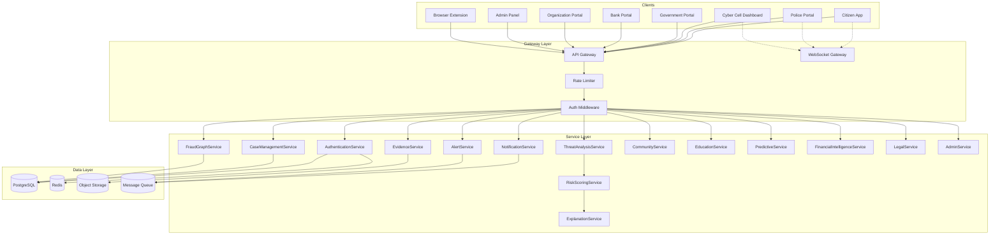
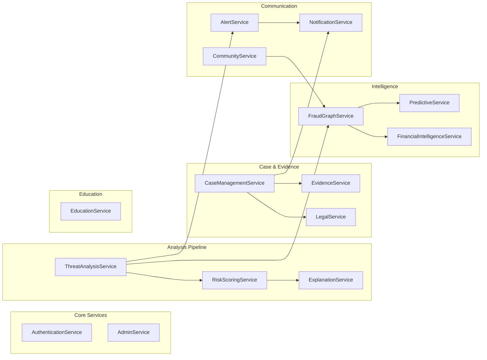
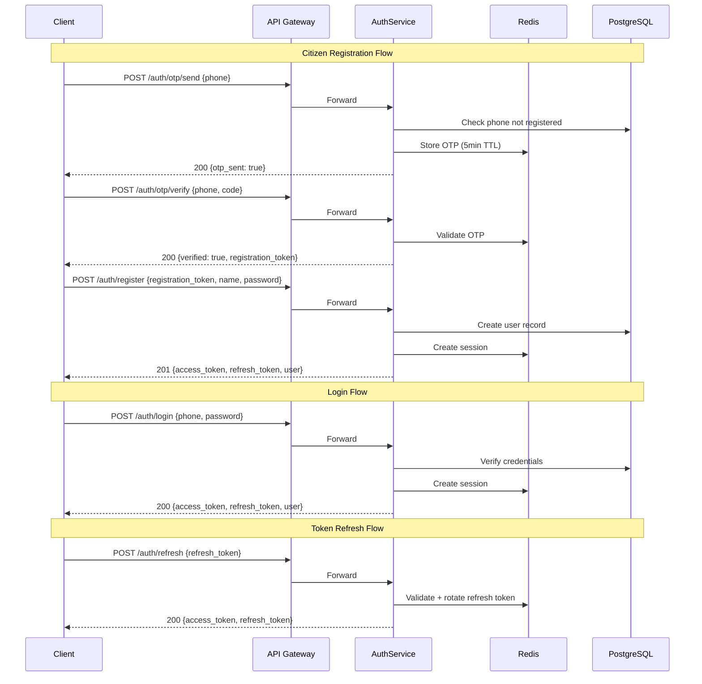
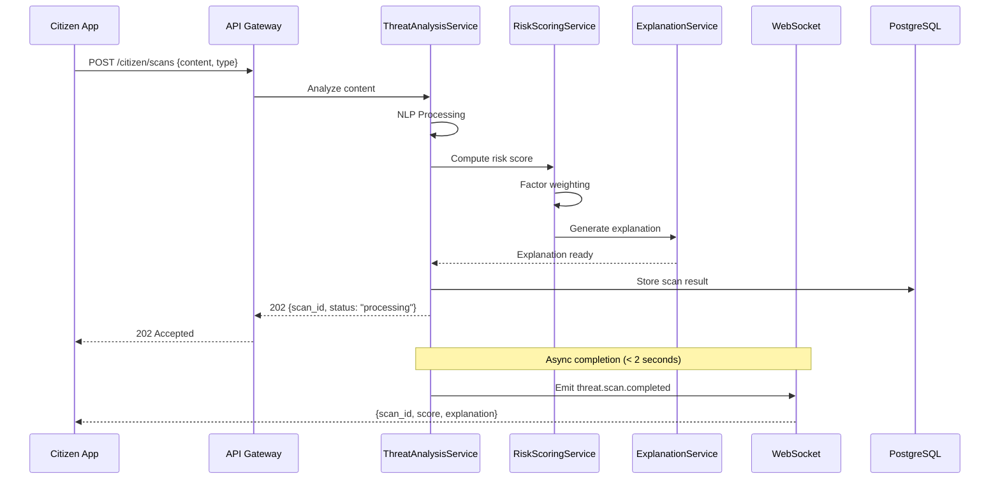
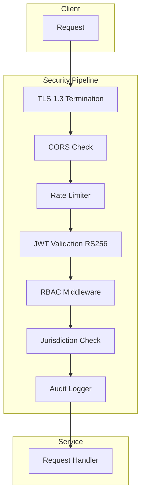
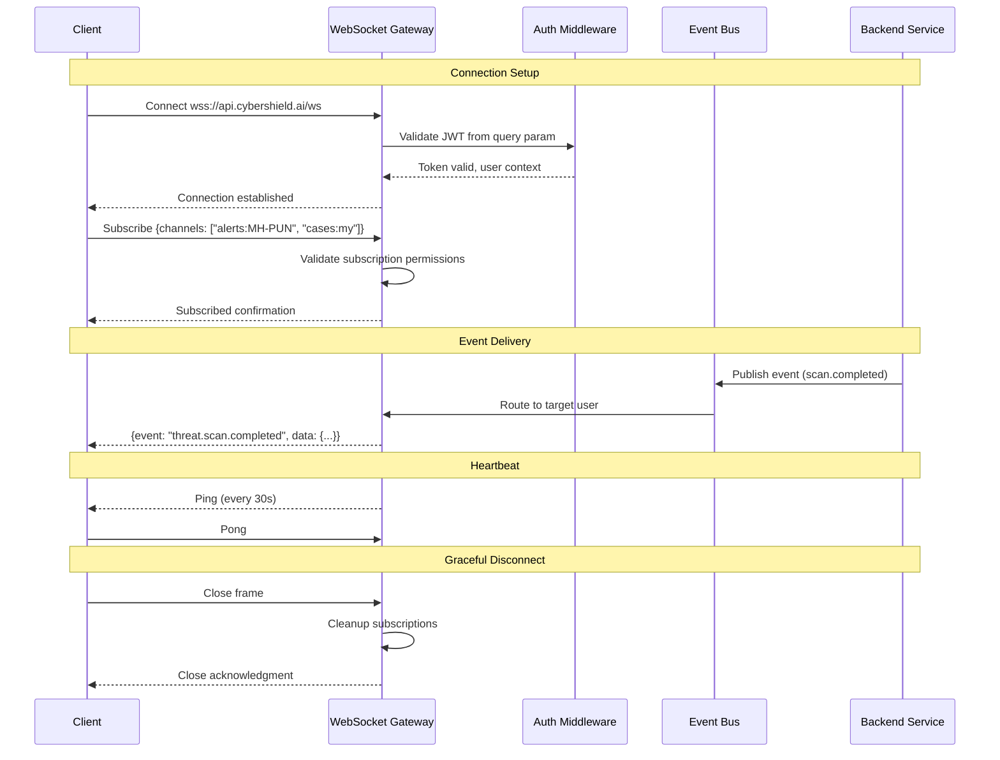

# Design Document: CyberShield API Architecture

## Overview

CyberShield AI's API Contract & Backend Service Architecture defines the complete communication layer between all frontend portals (8 portals, 69 screens) and the backend domain services (15 bounded contexts, 35+ entities). This document establishes the API topology, endpoint contracts, authentication flows, real-time communication, and service orchestration patterns that unify the platform.

The architecture follows a resource-oriented REST design with WebSocket channels for real-time events, serving 7 distinct user roles (Citizen, Police, CyberCell, Government, Bank, Organization, Platform Admin) through a single API gateway with role-based routing. Every endpoint maps directly to the previously defined Domain Model aggregates and Database Architecture schemas, ensuring traceability from UI action → API call → service → domain → persistence.

This is a design-level specification — it defines WHAT endpoints exist, WHAT data flows through them, and HOW services coordinate. It does not prescribe implementation frameworks or deployment infrastructure.

## Architecture

### API Topology



### Service Dependency Graph



## Components and Interfaces

### API Gateway

**Purpose**: Single entry point for all client requests. Handles TLS termination, request routing, rate limiting, and authentication validation before forwarding to backend services.

**Interface**:
```pascal
COMPONENT APIGateway
  EXPOSES:
    -- All REST endpoints under /api/v1/*
    -- Routes requests to appropriate backend service based on URL prefix
  
  RESPONSIBILITIES:
    - TLS 1.3 termination
    - CORS enforcement
    - Rate limiting (sliding window per role/IP)
    - JWT validation and token extraction
    - Request ID generation/propagation
    - Response envelope standardization
    - API versioning via URL path routing
    - Request/response logging

  EVENTS_CONSUMED: none (ingress only)
  EVENTS_PUBLISHED: request.received, request.completed (to audit/metrics)
END COMPONENT
```

### WebSocket Gateway

**Purpose**: Manages persistent bidirectional connections for real-time event delivery to clients. Handles authentication, channel subscriptions, heartbeats, and graceful degradation to SSE/long-polling.

**Interface**:
```pascal
COMPONENT WebSocketGateway
  EXPOSES:
    -- wss://api.cybershield.ai/ws (WebSocket)
    -- /api/v1/events/stream (SSE fallback)
  
  RESPONSIBILITIES:
    - JWT validation on connection (query param)
    - Channel subscription management
    - Heartbeat/ping-pong (30s interval)
    - Event routing from backend services to connected clients
    - Max 3 connections per user (multi-device)
    - Reconnection support with exponential backoff

  EVENTS_CONSUMED:
    - threat.scan.completed
    - alert.new
    - case.status.changed
    - case.assigned
    - notification.new
    - graph.cluster.detected
    - mule.flagged

  EVENTS_PUBLISHED: none (egress to clients only)
END COMPONENT
```

### AuthenticationService

**Purpose**: Manages identity lifecycle — registration, login, OTP, token issuance/refresh, session tracking, and MFA.

**Interface**:
```pascal
COMPONENT AuthenticationService
  EXPOSES: /api/v1/auth/*
  ENDPOINTS:
    POST /auth/register            -- Citizen registration
    POST /auth/login               -- Login (all roles)
    POST /auth/otp/send            -- Send OTP
    POST /auth/otp/verify          -- Verify OTP
    POST /auth/refresh             -- Refresh access token
    POST /auth/logout              -- Revoke session
    GET  /auth/me                  -- Current user profile
    PATCH /auth/me                 -- Update profile
    POST /auth/mfa/enable          -- Enable MFA
    POST /auth/mfa/verify          -- Verify MFA challenge

  EVENTS_PUBLISHED: user.registered, user.login, session.revoked
  EVENTS_CONSUMED: none
END COMPONENT
```

### ThreatAnalysisService

**Purpose**: Orchestrates scan requests through the NLP pipeline, URL analysis, and voice transcription. Coordinates with RiskScoringService and ExplanationService to produce final scan results.

**Interface**:
```pascal
COMPONENT ThreatAnalysisService
  EXPOSES: /api/v1/citizen/scans
  ENDPOINTS:
    POST /citizen/scans            -- Submit new scan
    GET  /citizen/scans/{id}       -- Get scan result
    GET  /citizen/scans            -- List scan history

  EVENTS_PUBLISHED: threat.scan.completed
  EVENTS_CONSUMED: none (internal pipeline)
END COMPONENT
```

### RiskScoringService

**Purpose**: Deterministic score computation using factor weighting and template matching. Internal service called only by ThreatAnalysisService.

**Interface**:
```pascal
COMPONENT RiskScoringService
  EXPOSES: Internal only (no public endpoints)
  INTERNAL_API:
    computeScore(analysis_result) → {score: Integer, factors: Array<RiskFactor>}
    applyWeights(raw_factors) → WeightedFactors
    matchTemplates(content) → Array<MatchedTemplate>

  EVENTS_PUBLISHED: none
  EVENTS_CONSUMED: none
END COMPONENT
```

### ExplanationService

**Purpose**: Generates plain-language explanations of risk scores in the user's preferred language. Internal service called by ThreatAnalysisService.

**Interface**:
```pascal
COMPONENT ExplanationService
  EXPOSES: Internal only (no public endpoints)
  INTERNAL_API:
    generateExplanation(score, factors, language) → String
    translateExplanation(text, target_language) → String

  EVENTS_PUBLISHED: none
  EVENTS_CONSUMED: none
END COMPONENT
```

### CaseManagementService

**Purpose**: Manages the full case lifecycle — creation from accepted reports, status transitions, officer assignment, escalation, investigation notes, and timeline generation.

**Interface**:
```pascal
COMPONENT CaseManagementService
  EXPOSES: /api/v1/police/cases/*, /api/v1/police/cases/{id}/notes
  ENDPOINTS:
    GET  /police/cases             -- List cases (filterable)
    GET  /police/cases/{id}        -- Case detail with AI summary
    PATCH /police/cases/{id}/status -- Update status
    POST /police/cases/{id}/assign -- Assign officer
    POST /police/cases/{id}/escalate -- Escalate to cyber cell
    POST /police/cases/{id}/link   -- Link related cases
    GET  /police/cases/queue       -- Unassigned cases
    POST /police/cases/{id}/notes  -- Add note
    GET  /police/cases/{id}/notes  -- List notes
    GET  /police/cases/{id}/timeline -- Case timeline

  EVENTS_PUBLISHED: case.status.changed, case.assigned
  EVENTS_CONSUMED: report.accepted (to create case)
END COMPONENT
```

### EvidenceService

**Purpose**: Handles evidence upload, hash computation for integrity, custody chain tracking, and access logging for forensic auditability.

**Interface**:
```pascal
COMPONENT EvidenceService
  EXPOSES: /api/v1/citizen/reports/{id}/evidence, /api/v1/police/cases/{id}/evidence
  ENDPOINTS:
    POST /citizen/reports/{reportId}/evidence       -- Upload evidence
    GET  /citizen/evidence                          -- List my evidence
    GET  /citizen/evidence/{id}                     -- Evidence metadata
    GET  /police/cases/{id}/evidence                -- List case evidence
    GET  /police/cases/{id}/evidence/{evidenceId}   -- Access evidence (logged)

  EVENTS_PUBLISHED: evidence.uploaded, evidence.accessed
  EVENTS_CONSUMED: none
END COMPONENT
```

### FraudGraphService

**Purpose**: Manages entity graph — phones, emails, accounts, devices — with connection tracking, strength calculation, and automated cluster detection for fraud network identification.

**Interface**:
```pascal
COMPONENT FraudGraphService
  EXPOSES: /api/v1/cybercell/graph/*
  ENDPOINTS:
    GET  /cybercell/graph/entities              -- List entities
    GET  /cybercell/graph/entities/{id}         -- Entity detail
    GET  /cybercell/graph/entities/{id}/connections -- Connections (1-2 hop)
    POST /cybercell/graph/entities              -- Register entity
    POST /cybercell/graph/connections           -- Add connection
    GET  /cybercell/graph/clusters              -- List clusters
    GET  /cybercell/graph/clusters/{id}         -- Cluster detail
    POST /cybercell/graph/clusters/{id}/confirm -- Confirm cluster

  EVENTS_PUBLISHED: graph.cluster.detected
  EVENTS_CONSUMED: threat.scan.completed (high-risk entity extraction)
END COMPONENT
```

### AlertService

**Purpose**: Detects fraud campaigns, generates alerts, and broadcasts them to targeted regions via WebSocket and NotificationService.

**Interface**:
```pascal
COMPONENT AlertService
  EXPOSES: /api/v1/police/alerts, WebSocket events
  ENDPOINTS:
    POST /police/alerts            -- Create and broadcast alert
    GET  /police/alerts            -- List alerts
    PATCH /police/alerts/{id}      -- Update active alert

  EVENTS_PUBLISHED: alert.new
  EVENTS_CONSUMED: threat patterns from analysis pipeline
END COMPONENT
```

### NotificationService

**Purpose**: Multi-channel notification delivery (push, SMS, email, in-app) with user preference management and retry logic for failed deliveries.

**Interface**:
```pascal
COMPONENT NotificationService
  EXPOSES: /api/v1/citizen/notifications
  ENDPOINTS:
    GET  /citizen/notifications                    -- List notifications
    PATCH /citizen/notifications/{id}/read         -- Mark as read
    PATCH /citizen/notifications/read-all          -- Mark all read
    GET  /citizen/notifications/preferences        -- Get preferences
    PUT  /citizen/notifications/preferences        -- Update preferences

  EVENTS_PUBLISHED: notification.new
  EVENTS_CONSUMED: case.status.changed, case.assigned, alert.new, evidence.uploaded
END COMPONENT
```

### CommunityService

**Purpose**: Manages anonymized community threat contributions, trending threat analysis by region, and community statistics aggregation.

**Interface**:
```pascal
COMPONENT CommunityService
  EXPOSES: /api/v1/citizen/community/*
  ENDPOINTS:
    POST /citizen/community/contributions   -- Submit anonymized report
    GET  /citizen/community/trending        -- Trending threats in region
    GET  /citizen/community/stats           -- Community statistics

  EVENTS_PUBLISHED: none
  EVENTS_CONSUMED: none (queries FraudGraphService)
END COMPONENT
```

### EducationService

**Purpose**: Manages cyber safety education modules, quiz scoring, progress tracking, and safety score computation based on learning completion.

**Interface**:
```pascal
COMPONENT EducationService
  EXPOSES: /api/v1/citizen/education/*
  ENDPOINTS:
    GET  /citizen/education/modules              -- List modules
    GET  /citizen/education/modules/{id}         -- Module content
    POST /citizen/education/modules/{id}/complete -- Mark completed
    POST /citizen/education/quizzes/{id}/submit  -- Submit quiz
    GET  /citizen/education/progress             -- Learning progress
    GET  /citizen/education/safety-score         -- Safety score breakdown

  EVENTS_PUBLISHED: none
  EVENTS_CONSUMED: none
END COMPONENT
```

### PredictiveService

**Purpose**: Generates fraud trend predictions based on historical graph data and pattern analysis. Tracks prediction accuracy over time.

**Interface**:
```pascal
COMPONENT PredictiveService
  EXPOSES: /api/v1/cybercell/predictions
  ENDPOINTS:
    GET /cybercell/predictions              -- List predictions (current week)
    GET /cybercell/predictions/{id}         -- Prediction detail
    GET /cybercell/predictions/accuracy     -- Historical accuracy

  EVENTS_PUBLISHED: none
  EVENTS_CONSUMED: graph data changes (background processing)
END COMPONENT
```

### FinancialIntelligenceService

**Purpose**: Traces money flow chains across accounts, scores account risk, and detects mule account patterns for financial fraud investigation.

**Interface**:
```pascal
COMPONENT FinancialIntelligenceService
  EXPOSES: /api/v1/cybercell/finance/*
  ENDPOINTS:
    GET  /cybercell/finance/flows           -- List money flow chains
    GET  /cybercell/finance/flows/{id}      -- Flow chain detail
    GET  /cybercell/finance/mules           -- List flagged mule accounts
    POST /cybercell/finance/mules/{id}/confirm -- Confirm mule account

  EVENTS_PUBLISHED: mule.flagged
  EVENTS_CONSUMED: graph entity/connection updates
END COMPONENT
```

### LegalService

**Purpose**: AI-powered FIR draft generation with automatic legal section mapping based on fraud type and case details.

**Interface**:
```pascal
COMPONENT LegalService
  EXPOSES: /api/v1/citizen/fir-drafts
  ENDPOINTS:
    POST /citizen/fir-drafts               -- Generate FIR draft
    GET  /citizen/fir-drafts/{id}          -- Get FIR draft
    POST /citizen/fir-drafts/{id}/approve  -- Approve for filing

  EVENTS_PUBLISHED: none
  EVENTS_CONSUMED: none
END COMPONENT
```

### AdminService

**Purpose**: Platform administration — user management, role/permission configuration, feature flags, system health monitoring, AI model management, and audit log queries.

**Interface**:
```pascal
COMPONENT AdminService
  EXPOSES: /api/v1/admin/*
  ENDPOINTS:
    GET  /admin/users                      -- List users
    PATCH /admin/users/{id}/status         -- Activate/suspend
    PATCH /admin/users/{id}/role           -- Change role
    GET  /admin/roles                      -- List roles
    PATCH /admin/roles/{id}/permissions    -- Update permissions
    GET  /admin/config                     -- System config
    PATCH /admin/config/{key}             -- Update config
    GET  /admin/feature-flags             -- List flags
    PATCH /admin/feature-flags/{id}       -- Toggle flag
    GET  /admin/audit-logs                -- Audit entries
    GET  /admin/health                    -- System health
    GET  /admin/ai/models                 -- AI model versions

  EVENTS_PUBLISHED: config.changed, feature_flag.toggled
  EVENTS_CONSUMED: none
END COMPONENT
```

## Data Models

### Standard Response Envelope

All API responses follow a consistent envelope structure:

```pascal
STRUCTURE SuccessEnvelope<T>
  success: Boolean = TRUE
  data: T                       -- single resource or array
  meta: ResponseMeta
END STRUCTURE

STRUCTURE PaginatedEnvelope<T>
  success: Boolean = TRUE
  data: Array<T>
  meta: PaginatedMeta
END STRUCTURE

STRUCTURE ErrorEnvelope
  success: Boolean = FALSE
  error: ErrorDetail
  meta: ResponseMeta
END STRUCTURE

STRUCTURE ResponseMeta
  requestId: UUID               -- unique per request, for tracing
  timestamp: Timestamp          -- ISO 8601 UTC
  apiVersion: String            -- e.g., "1.2.0"
END STRUCTURE

STRUCTURE PaginatedMeta
  requestId: UUID
  timestamp: Timestamp
  pagination: PaginationInfo
END STRUCTURE

STRUCTURE PaginationInfo
  total: Integer
  page: Integer                 -- 1-indexed
  pageSize: Integer
  totalPages: Integer
  hasNext: Boolean
  hasPrevious: Boolean
END STRUCTURE
```

### Key DTOs — Threat Analysis

```pascal
STRUCTURE ScanRequest
  content: String               -- text/URL/voice content to analyze
  content_type: Enum[SMS, WHATSAPP, EMAIL, URL, VOICE]
  source_channel: Enum[MOBILE_APP, WEB, BROWSER_EXT]
  language: String              -- ISO 639-1 (auto-detected if null)
  metadata: Object              -- optional sender info, timestamps
END STRUCTURE

STRUCTURE ScanResult
  id: UUID
  user_id: UUID
  content_type: String
  threat_score: Integer         -- 0 to 100
  risk_level: Enum[SAFE, LOW, MEDIUM, HIGH, CRITICAL]
  explanation: String           -- plain-language explanation
  factors: Array<RiskFactor>
  recommendations: Array<String>
  analyzed_at: Timestamp
  processing_time_ms: Integer
END STRUCTURE

STRUCTURE RiskFactor
  name: String                  -- e.g., "Urgency Language", "Suspicious URL"
  weight: Float                 -- contribution to total score
  description: String           -- why this factor was triggered
END STRUCTURE
```

### Key DTOs — Case Management

```pascal
STRUCTURE CaseDetail
  id: UUID
  case_number: String           -- human-readable (e.g., "CS-MH-PUN-2024-00142")
  status: Enum[NEW, ASSIGNED, IN_PROGRESS, ESCALATED, RESOLVED, CLOSED]
  priority: Enum[LOW, MEDIUM, HIGH, CRITICAL]
  fraud_type: FraudTypeEnum
  jurisdiction: JurisdictionCode
  assigned_officer_id: UUID
  reporter_id: UUID
  description: String
  ai_summary: String            -- AI-generated investigation summary
  financial_loss: MoneyAmount
  evidence_count: Integer
  linked_case_ids: Array<UUID>
  created_at: Timestamp
  updated_at: Timestamp
  resolved_at: Timestamp
END STRUCTURE

STRUCTURE InvestigationNote
  id: UUID
  case_id: UUID
  author_id: UUID
  content: String
  note_type: Enum[OBSERVATION, LEAD, INTERVIEW, FORENSIC, GENERAL]
  visibility: Enum[INTERNAL, SHARED]
  created_at: Timestamp
END STRUCTURE
```

### Key DTOs — Fraud Graph

```pascal
STRUCTURE GraphEntity
  id: UUID
  entity_type: Enum[PHONE, EMAIL, BANK_ACCOUNT, UPI_ID, IP_ADDRESS, DEVICE, PERSON]
  identifier: String            -- the actual phone/email/account number
  risk_score: Integer           -- 0 to 100
  risk_level: Enum[LOW, MEDIUM, HIGH, CRITICAL]
  first_seen: Timestamp
  last_seen: Timestamp
  report_count: Integer
  connection_count: Integer
  confirmed_fraudulent: Boolean
  metadata: Object
END STRUCTURE

STRUCTURE EntityConnection
  id: UUID
  source_entity_id: UUID
  target_entity_id: UUID
  connection_type: Enum[TRANSACTED_WITH, CALLED, MESSAGED, SHARES_DEVICE, SAME_OWNER, CO_REPORTED]
  strength: Float               -- 0.0 to 1.0
  evidence_count: Integer
  first_observed: Timestamp
  last_observed: Timestamp
END STRUCTURE

STRUCTURE FraudCluster
  id: UUID
  name: String
  status: Enum[DETECTED, CONFIRMED, ACTIVE_INVESTIGATION, DISMANTLED]
  member_count: Integer
  total_financial_impact: MoneyAmount
  detection_method: Enum[AI_PATTERN, MANUAL, CROSS_CASE]
  confidence: Float             -- 0.0 to 1.0
  detected_at: Timestamp
  confirmed_by: UUID
  confirmed_at: Timestamp
END STRUCTURE
```

### Key DTOs — Financial Intelligence

```pascal
STRUCTURE MoneyFlowChain
  id: UUID
  chain_length: Integer         -- number of hops
  total_amount: MoneyAmount
  source_account: AccountRef
  destination_accounts: Array<AccountRef>
  intermediate_accounts: Array<AccountRef>
  time_span: Duration
  risk_indicators: Array<String>
  status: Enum[DETECTED, UNDER_REVIEW, CONFIRMED_FRAUDULENT, FALSE_POSITIVE]
END STRUCTURE

STRUCTURE AccountRef
  account_type: Enum[BANK_ACCOUNT, UPI_ID, WALLET]
  identifier: String            -- masked for display (e.g., "XXXX1234")
  bank_name: String
  holder_name: String           -- if known
END STRUCTURE
```

### Key DTOs — Reports & Evidence

```pascal
STRUCTURE FraudReport
  id: UUID
  reporter_id: UUID
  status: Enum[DRAFT, SUBMITTED, UNDER_REVIEW, ACCEPTED, REJECTED]
  fraud_type: Enum[UPI_FRAUD, PHISHING, IMPERSONATION, INVESTMENT_SCAM, LOAN_FRAUD, OTHER]
  description: String
  incident_date: Date
  financial_loss: MoneyAmount
  suspect_info: SuspectInfo
  evidence_ids: Array<UUID>
  submitted_at: Timestamp
  case_id: UUID                 -- assigned after acceptance
END STRUCTURE

STRUCTURE EvidenceRecord
  id: UUID
  report_id: UUID
  file_type: Enum[IMAGE, VIDEO, AUDIO, DOCUMENT, TEXT]
  mime_type: String
  file_size: Integer            -- bytes
  hash_sha256: String           -- integrity verification
  storage_url: String           -- encrypted object storage path
  uploaded_at: Timestamp
  uploaded_by: UUID
  access_log: Array<AccessEntry>
END STRUCTURE
```

### Key DTOs — Administration

```pascal
STRUCTURE AuditLogEntry
  id: UUID
  actor_id: UUID
  actor_role: RoleEnum
  action: String                -- e.g., "USER_SUSPENDED", "CONFIG_UPDATED"
  resource_type: String
  resource_id: UUID
  changes: Object               -- before/after values
  ip_address: String
  user_agent: String
  outcome: Enum[SUCCESS, FAILURE, DENIED]
  timestamp: Timestamp
END STRUCTURE

STRUCTURE FeatureFlag
  id: UUID
  key: String                   -- e.g., "voice_analysis_enabled"
  name: String
  description: String
  enabled: Boolean
  targeting: TargetingRules
  created_at: Timestamp
  updated_at: Timestamp
END STRUCTURE

STRUCTURE SystemHealth
  overall_status: Enum[HEALTHY, DEGRADED, UNHEALTHY]
  services: Array<ServiceHealth>
  uptime_percentage: Float
  active_users: Integer
  requests_per_minute: Integer
  error_rate: Float
END STRUCTURE
```

### Common Patterns

```pascal
-- Monetary values always include currency
STRUCTURE MoneyAmount
  amount: Float                 -- in smallest unit (paise for INR)
  currency: String              -- ISO 4217 (default: "INR")
END STRUCTURE

-- All identifiers use time-ordered UUIDs
TYPE UUID = UUID_v7             -- time-ordered for indexing efficiency

-- All timestamps are ISO 8601 UTC
TYPE Timestamp = String         -- "2024-03-15T10:30:00.000Z"

-- Jurisdiction codes follow hierarchical format
TYPE JurisdictionCode = String  -- "{state}-{district}-{zone}" e.g., "MH-PUN-01"

-- Enum values are UPPER_SNAKE_CASE strings
TYPE RoleEnum = Enum[CITIZEN, POLICE, CYBER_CELL, GOVERNMENT, BANK, ORGANIZATION, ADMIN, SUPER_ADMIN]
TYPE FraudTypeEnum = Enum[UPI_FRAUD, PHISHING, IMPERSONATION, INVESTMENT_SCAM, LOAN_FRAUD, JOB_FRAUD, ROMANCE_SCAM, OTHER]
```

## Section 1: API Design Philosophy

### Versioning Strategy

- URL path versioning: `/api/v1/...`
- Major version in URL path, minor/patch versions communicated via `X-API-Version` response header
- Breaking changes require new major version (`/api/v2/...`)
- Additive changes (new fields, new endpoints) are backward-compatible within same major version
- Deprecation headers: `X-API-Deprecated: true`, `X-API-Sunset: 2025-06-01`

### Naming Conventions

- Resource-based URLs using plural nouns: `/api/v1/cases`, `/api/v1/scans`
- Kebab-case for multi-word resources: `/api/v1/fraud-reports`, `/api/v1/safety-scores`
- Actions as sub-resources: `/api/v1/scans/{id}/analyze`, `/api/v1/cases/{id}/escalate`
- Query parameters for filtering: `?status=open&jurisdiction=MH-PUN-01`
- Nested resources for ownership: `/api/v1/citizen/reports/{reportId}/evidence`

### Consistency Rules

- All timestamps: ISO 8601 UTC (`2024-03-15T10:30:00.000Z`)
- All identifiers: UUID v7 strings (time-ordered)
- All monetary values: `{ amount: number, currency: "INR" }`
- All paginated lists: `{ data: [], meta: { total, page, pageSize, totalPages } }`
- All enum values: UPPER_SNAKE_CASE strings
- All boolean fields: prefixed with `is_` or `has_` where ambiguous

### Error Handling Philosophy

```pascal
STRUCTURE ErrorEnvelope
  success: Boolean = FALSE
  error: ErrorDetail
  meta: RequestMeta
END STRUCTURE

STRUCTURE ErrorDetail
  code: ErrorCode
  message: String
  details: Array<FieldError>  -- optional, for validation errors
END STRUCTURE

STRUCTURE FieldError
  field: String
  message: String
  code: String
END STRUCTURE
```

**HTTP Status Code Mapping:**

| Status | Usage | Error Code |
|--------|-------|------------|
| 400 | Validation failure | VALIDATION_ERROR |
| 401 | Missing/invalid token | UNAUTHORIZED |
| 403 | Insufficient permissions | FORBIDDEN |
| 404 | Resource not found | NOT_FOUND |
| 409 | State conflict | CONFLICT |
| 429 | Rate limit exceeded | RATE_LIMITED |
| 500 | Internal server error | INTERNAL_ERROR |
| 503 | Service unavailable | SERVICE_UNAVAILABLE |

### Pagination Philosophy

**Cursor-based** (for feeds/timelines):
- Used for: notifications, scan history, activity feeds
- Parameters: `?cursor=<opaque_token>&limit=20`
- Response includes: `{ next_cursor, has_more }`

**Offset-based** (for filterable/searchable lists):
- Used for: cases, evidence, users, reports
- Parameters: `?page=1&pageSize=20`
- Response includes: `{ total, page, pageSize, totalPages, hasNext, hasPrevious }`
- Default pageSize: 20, maximum: 100

### Filtering, Sorting, Searching

- Filtering: query parameters `?status=open&severity=critical&region=MH`
- Sorting: `?sort=created_at&order=desc` (default: `created_at` descending)
- Full-text search: `?q=search+term`
- Date ranges: `?from=2024-01-01T00:00:00Z&to=2024-12-31T23:59:59Z`
- Multi-value filters: `?status=open,in_progress` (comma-separated)

## Section 2: Authentication APIs

### Auth Flow Sequence



### Endpoints

**Base path:** `/api/v1/auth`

| Method | Endpoint | Purpose | Auth Required |
|--------|----------|---------|---------------|
| POST | `/auth/register` | Citizen registration | No (registration_token) |
| POST | `/auth/login` | Login (all roles) | No |
| POST | `/auth/otp/send` | Send OTP to phone | No |
| POST | `/auth/otp/verify` | Verify OTP code | No |
| POST | `/auth/refresh` | Refresh access token | No (refresh_token) |
| POST | `/auth/logout` | Revoke session | Yes |
| POST | `/auth/password/reset-request` | Request password reset | No |
| POST | `/auth/password/reset` | Execute password reset | No (reset_token) |
| GET | `/auth/me` | Get current user profile | Yes |
| PATCH | `/auth/me` | Update current user profile | Yes |
| POST | `/auth/mfa/enable` | Enable MFA | Yes |
| POST | `/auth/mfa/verify` | Verify MFA challenge | Partial (pre-MFA) |

### Token Strategy

```pascal
STRUCTURE AccessToken
  type: "JWT"
  algorithm: "RS256"
  expiry: 900  -- 15 minutes in seconds
  payload:
    sub: UUID           -- user ID
    role: RoleEnum      -- CITIZEN, POLICE, CYBER_CELL, GOVERNMENT, BANK, ORGANIZATION, ADMIN
    jurisdiction: String -- jurisdiction code (e.g., "MH-PUN-01")
    permissions: Array<String>  -- resolved permissions
    iat: Timestamp
    exp: Timestamp
END STRUCTURE

STRUCTURE RefreshToken
  type: "Opaque"
  expiry: 604800  -- 7 days in seconds
  storage: "Server-side (Redis)"
  rotation: TRUE  -- single-use, new token on each refresh
  family_id: UUID  -- for detecting token reuse attacks
END STRUCTURE

STRUCTURE Session
  storage: "Redis"
  tracks: [device_info, ip_address, last_active, created_at]
  max_concurrent: 5  -- per user
  idle_timeout: 1800  -- 30 minutes
END STRUCTURE
```

### Auth Flows per Role

```pascal
PROCEDURE citizenRegistration(phone, name, password)
  INPUT: phone (Indian mobile), name, password
  OUTPUT: AuthTokenPair + UserProfile
  
  SEQUENCE
    -- Step 1: Phone verification
    otp ← generateOTP(6 digits)
    STORE otp IN Redis WITH key="otp:{phone}" TTL=300
    SEND otp VIA SMS to phone
    
    -- Step 2: OTP verification (separate request)
    IF verifyOTP(phone, submitted_code) = TRUE THEN
      registration_token ← generateToken(phone, expiry=600)
      RETURN {verified: true, registration_token}
    END IF
    
    -- Step 3: Complete registration (separate request)
    VALIDATE registration_token
    user ← CREATE User(phone, name, hash(password), role=CITIZEN)
    tokens ← issueTokenPair(user)
    RETURN {tokens, user}
  END SEQUENCE
END PROCEDURE

PROCEDURE policeLogin(badge_id, department_code, password)
  INPUT: badge_id, department_code, password
  OUTPUT: AuthTokenPair + OfficerProfile
  
  SEQUENCE
    officer ← FIND User WHERE badge_id AND department_code
    IF officer IS NULL THEN RETURN Error("UNAUTHORIZED")
    IF verify(password, officer.password_hash) = FALSE THEN RETURN Error("UNAUTHORIZED")
    IF officer.status ≠ ACTIVE THEN RETURN Error("FORBIDDEN", "Account suspended")
    
    tokens ← issueTokenPair(officer)
    LOG audit_entry(officer.id, "LOGIN", "SUCCESS")
    RETURN {tokens, officer}
  END SEQUENCE
END PROCEDURE

PROCEDURE adminLogin(email, password, mfa_code)
  INPUT: email, password, mfa_code
  OUTPUT: AuthTokenPair + AdminProfile
  
  SEQUENCE
    admin ← FIND User WHERE email AND role=ADMIN
    IF admin IS NULL THEN RETURN Error("UNAUTHORIZED")
    IF verify(password, admin.password_hash) = FALSE THEN RETURN Error("UNAUTHORIZED")
    
    -- MFA is REQUIRED for admin
    IF admin.mfa_enabled = FALSE THEN RETURN Error("FORBIDDEN", "MFA setup required")
    IF verifyMFA(admin.mfa_secret, mfa_code) = FALSE THEN RETURN Error("UNAUTHORIZED", "Invalid MFA")
    
    tokens ← issueTokenPair(admin)
    LOG audit_entry(admin.id, "LOGIN", "SUCCESS", {mfa: true})
    RETURN {tokens, admin}
  END SEQUENCE
END PROCEDURE
```

## Section 3: Citizen APIs

### Scan Submission Flow



### Endpoints

**Base path:** `/api/v1/citizen`

**Dashboard:**

| Method | Endpoint | Purpose |
|--------|----------|---------|
| GET | `/citizen/dashboard` | Aggregated dashboard (safety score, recent scans, alerts) |

**Threat Scanner:**

| Method | Endpoint | Purpose |
|--------|----------|---------|
| POST | `/citizen/scans` | Submit new scan (text/URL/voice) |
| GET | `/citizen/scans/{id}` | Get scan result |
| GET | `/citizen/scans` | List scan history (cursor-paginated) |

**Reports:**

| Method | Endpoint | Purpose |
|--------|----------|---------|
| POST | `/citizen/reports` | Submit fraud report |
| GET | `/citizen/reports` | List my reports (offset-paginated) |
| GET | `/citizen/reports/{id}` | Get report detail + status |
| PATCH | `/citizen/reports/{id}` | Update draft report |
| DELETE | `/citizen/reports/{id}` | Delete draft report |

**Evidence:**

| Method | Endpoint | Purpose |
|--------|----------|---------|
| POST | `/citizen/reports/{reportId}/evidence` | Upload evidence |
| GET | `/citizen/evidence` | List my evidence items |
| GET | `/citizen/evidence/{id}` | Get evidence metadata |

**Education:**

| Method | Endpoint | Purpose |
|--------|----------|---------|
| GET | `/citizen/education/modules` | List modules (filterable) |
| GET | `/citizen/education/modules/{id}` | Get module content |
| POST | `/citizen/education/modules/{id}/complete` | Mark completed |
| POST | `/citizen/education/quizzes/{id}/submit` | Submit quiz answers |
| GET | `/citizen/education/progress` | Learning progress |
| GET | `/citizen/education/safety-score` | Safety score breakdown |

**Community Shield:**

| Method | Endpoint | Purpose |
|--------|----------|---------|
| POST | `/citizen/community/contributions` | Submit anonymized threat report |
| GET | `/citizen/community/trending` | Trending threats in region |
| GET | `/citizen/community/stats` | Community statistics |

**Notifications:**

| Method | Endpoint | Purpose |
|--------|----------|---------|
| GET | `/citizen/notifications` | List notifications (cursor-paginated) |
| PATCH | `/citizen/notifications/{id}/read` | Mark as read |
| PATCH | `/citizen/notifications/read-all` | Mark all as read |
| GET | `/citizen/notifications/preferences` | Get preferences |
| PUT | `/citizen/notifications/preferences` | Update preferences |

**AI Legal Assistant:**

| Method | Endpoint | Purpose |
|--------|----------|---------|
| POST | `/citizen/fir-drafts` | Generate FIR draft |
| GET | `/citizen/fir-drafts/{id}` | Get FIR draft |
| POST | `/citizen/fir-drafts/{id}/approve` | Approve for filing |

**Settings:**

| Method | Endpoint | Purpose |
|--------|----------|---------|
| GET | `/citizen/settings` | Get account settings |
| PUT | `/citizen/settings/language` | Update language |
| PUT | `/citizen/settings/profile` | Update profile |


### Key Data Structures

```pascal
STRUCTURE ScanRequest
  content: String           -- text content to analyze
  content_type: Enum[SMS, WHATSAPP, EMAIL, URL, VOICE]
  source_channel: Enum[MOBILE_APP, WEB, BROWSER_EXT]
  language: String          -- ISO 639-1 code (auto-detected if null)
  metadata: Object          -- optional sender info, timestamps
END STRUCTURE

STRUCTURE ScanResult
  id: UUID
  user_id: UUID
  content_type: String
  threat_score: Integer     -- 0 to 100
  risk_level: Enum[SAFE, LOW, MEDIUM, HIGH, CRITICAL]
  explanation: String       -- plain-language explanation
  factors: Array<RiskFactor>
  recommendations: Array<String>
  analyzed_at: Timestamp
  processing_time_ms: Integer
END STRUCTURE

STRUCTURE RiskFactor
  name: String              -- e.g., "Urgency Language", "Suspicious URL"
  weight: Float             -- contribution to total score
  description: String       -- why this factor was triggered
END STRUCTURE

STRUCTURE FraudReport
  id: UUID
  reporter_id: UUID
  status: Enum[DRAFT, SUBMITTED, UNDER_REVIEW, ACCEPTED, REJECTED]
  fraud_type: Enum[UPI_FRAUD, PHISHING, IMPERSONATION, INVESTMENT_SCAM, LOAN_FRAUD, OTHER]
  description: String
  incident_date: Date
  financial_loss: MoneyAmount
  suspect_info: SuspectInfo
  evidence_ids: Array<UUID>
  submitted_at: Timestamp
  case_id: UUID             -- assigned after acceptance
END STRUCTURE

STRUCTURE DashboardResponse
  safety_score: SafetyScore
  recent_scans: Array<ScanSummary>  -- last 5
  active_alerts: Array<AlertSummary>  -- for user's region
  active_reports: Integer   -- count of non-closed reports
  unread_notifications: Integer
END STRUCTURE
```

## Section 4: Police APIs

### Case Lifecycle Flow

```mermaid
sequenceDiagram
    participant OFF as Police Officer
    participant GW as API Gateway
    participant CMS as CaseManagementService
    participant EVS as EvidenceService
    participant NS as NotificationService
    participant WS as WebSocket

    Note over OFF,WS: Case Assignment
    OFF->>GW: GET /police/cases/queue
    GW->>CMS: Get unassigned cases for jurisdiction
    CMS-->>OFF: Cases list

    OFF->>GW: POST /police/cases/{id}/assign {officer_id}
    GW->>CMS: Assign case
    CMS->>NS: Notify citizen of assignment
    CMS->>WS: Emit case.assigned
    CMS-->>OFF: 200 {case with assignment}

    Note over OFF,WS: Investigation
    OFF->>GW: GET /police/cases/{id}/evidence
    GW->>EVS: List evidence (access logged)
    EVS-->>OFF: Evidence items

    OFF->>GW: POST /police/cases/{id}/notes {content}
    GW->>CMS: Add investigation note
    CMS-->>OFF: 201 {note}

    Note over OFF,WS: Escalation
    OFF->>GW: POST /police/cases/{id}/escalate {reason, priority}
    GW->>CMS: Escalate to cyber cell
    CMS->>NS: Notify cyber cell
    CMS->>WS: Emit case.status.changed
    CMS-->>OFF: 200 {case with escalated status}
```

### Endpoints

**Base path:** `/api/v1/police`

**Case Management:**

| Method | Endpoint | Purpose |
|--------|----------|---------|
| GET | `/police/cases` | List cases (filterable by status, priority, jurisdiction) |
| GET | `/police/cases/{id}` | Get case detail with AI summary |
| PATCH | `/police/cases/{id}/status` | Update case status |
| POST | `/police/cases/{id}/assign` | Assign/reassign officer |
| POST | `/police/cases/{id}/escalate` | Escalate to cyber cell |
| POST | `/police/cases/{id}/link` | Link related cases |
| GET | `/police/cases/queue` | Unassigned cases for jurisdiction |

**Investigation:**

| Method | Endpoint | Purpose |
|--------|----------|---------|
| GET | `/police/cases/{id}/evidence` | List case evidence |
| GET | `/police/cases/{id}/evidence/{evidenceId}` | Access evidence (logged) |
| POST | `/police/cases/{id}/notes` | Add investigation note |
| GET | `/police/cases/{id}/notes` | List case notes |
| GET | `/police/cases/{id}/timeline` | Get case timeline |
| GET | `/police/cases/{id}/ai-summary` | AI-generated case summary |

**Intelligence Search:**

| Method | Endpoint | Purpose |
|--------|----------|---------|
| POST | `/police/search/entities` | Search by phone/email/account/IP |
| GET | `/police/search/entities/{id}/connections` | Entity connections |
| GET | `/police/search/cross-case` | Cross-case correlation |

**Analytics:**

| Method | Endpoint | Purpose |
|--------|----------|---------|
| GET | `/police/analytics/overview` | Jurisdiction analytics |
| GET | `/police/analytics/cases-by-type` | Cases by fraud type |
| GET | `/police/analytics/resolution-time` | Average resolution time |

**Alert Broadcasting:**

| Method | Endpoint | Purpose |
|--------|----------|---------|
| POST | `/police/alerts` | Create and broadcast alert |
| GET | `/police/alerts` | List my alerts |
| PATCH | `/police/alerts/{id}` | Update active alert |

### Key Data Structures

```pascal
STRUCTURE CaseDetail
  id: UUID
  case_number: String       -- human-readable (e.g., "CS-MH-PUN-2024-00142")
  status: Enum[NEW, ASSIGNED, IN_PROGRESS, ESCALATED, RESOLVED, CLOSED]
  priority: Enum[LOW, MEDIUM, HIGH, CRITICAL]
  fraud_type: FraudTypeEnum
  jurisdiction: JurisdictionCode
  assigned_officer_id: UUID
  reporter_id: UUID
  description: String
  ai_summary: String        -- AI-generated investigation summary
  financial_loss: MoneyAmount
  evidence_count: Integer
  linked_case_ids: Array<UUID>
  created_at: Timestamp
  updated_at: Timestamp
  resolved_at: Timestamp
END STRUCTURE

STRUCTURE CaseStatusTransition
  from: CaseStatus
  to: CaseStatus
  valid_transitions:
    NEW → [ASSIGNED]
    ASSIGNED → [IN_PROGRESS, ESCALATED]
    IN_PROGRESS → [ESCALATED, RESOLVED]
    ESCALATED → [IN_PROGRESS, RESOLVED]
    RESOLVED → [CLOSED]
    CLOSED → []  -- terminal state
END STRUCTURE

STRUCTURE InvestigationNote
  id: UUID
  case_id: UUID
  author_id: UUID
  content: String
  note_type: Enum[OBSERVATION, LEAD, INTERVIEW, FORENSIC, GENERAL]
  visibility: Enum[INTERNAL, SHARED]  -- shared = visible to cyber cell
  created_at: Timestamp
END STRUCTURE
```

## Section 5: Cyber Cell APIs

### Endpoints

**Base path:** `/api/v1/cybercell`

**Fraud Graph:**

| Method | Endpoint | Purpose |
|--------|----------|---------|
| GET | `/cybercell/graph/entities` | List entities (filterable by type, risk) |
| GET | `/cybercell/graph/entities/{id}` | Entity deep dive |
| GET | `/cybercell/graph/entities/{id}/connections` | Entity connections (1-2 hop) |
| POST | `/cybercell/graph/entities` | Register entity manually |
| POST | `/cybercell/graph/connections` | Add connection manually |

**Clusters:**

| Method | Endpoint | Purpose |
|--------|----------|---------|
| GET | `/cybercell/graph/clusters` | List detected clusters |
| GET | `/cybercell/graph/clusters/{id}` | Cluster detail + members |
| POST | `/cybercell/graph/clusters/{id}/confirm` | Confirm cluster |
| GET | `/cybercell/graph/clusters/{id}/export` | Export cluster (PDF/CSV) |

**Predictions:**

| Method | Endpoint | Purpose |
|--------|----------|---------|
| GET | `/cybercell/predictions` | List predictions (current week) |
| GET | `/cybercell/predictions/{id}` | Prediction detail |
| GET | `/cybercell/predictions/accuracy` | Historical accuracy metrics |

**Money Flow:**

| Method | Endpoint | Purpose |
|--------|----------|---------|
| GET | `/cybercell/finance/flows` | List money flow chains |
| GET | `/cybercell/finance/flows/{id}` | Flow chain detail |
| GET | `/cybercell/finance/mules` | List flagged mule accounts |
| POST | `/cybercell/finance/mules/{id}/confirm` | Confirm mule account |

**AI Audit:**

| Method | Endpoint | Purpose |
|--------|----------|---------|
| GET | `/cybercell/ai/audit` | AI decision audit trail |
| GET | `/cybercell/ai/audit/{scanId}` | Specific scan AI reasoning |

### Key Data Structures

```pascal
STRUCTURE GraphEntity
  id: UUID
  entity_type: Enum[PHONE, EMAIL, BANK_ACCOUNT, UPI_ID, IP_ADDRESS, DEVICE, PERSON]
  identifier: String        -- the actual phone/email/account number
  risk_score: Integer       -- 0 to 100
  risk_level: Enum[LOW, MEDIUM, HIGH, CRITICAL]
  first_seen: Timestamp
  last_seen: Timestamp
  report_count: Integer     -- times reported across cases
  connection_count: Integer
  confirmed_fraudulent: Boolean
  metadata: Object          -- type-specific extra data
END STRUCTURE

STRUCTURE EntityConnection
  id: UUID
  source_entity_id: UUID
  target_entity_id: UUID
  connection_type: Enum[TRANSACTED_WITH, CALLED, MESSAGED, SHARES_DEVICE, SAME_OWNER, CO_REPORTED]
  strength: Float           -- 0.0 to 1.0
  evidence_count: Integer
  first_observed: Timestamp
  last_observed: Timestamp
END STRUCTURE

STRUCTURE FraudCluster
  id: UUID
  name: String              -- auto-generated or analyst-assigned
  status: Enum[DETECTED, CONFIRMED, ACTIVE_INVESTIGATION, DISMANTLED]
  member_count: Integer
  total_financial_impact: MoneyAmount
  detection_method: Enum[AI_PATTERN, MANUAL, CROSS_CASE]
  confidence: Float         -- 0.0 to 1.0
  detected_at: Timestamp
  confirmed_by: UUID        -- analyst who confirmed
  confirmed_at: Timestamp
END STRUCTURE

STRUCTURE MoneyFlowChain
  id: UUID
  chain_length: Integer     -- number of hops
  total_amount: MoneyAmount
  source_account: AccountRef
  destination_accounts: Array<AccountRef>
  intermediate_accounts: Array<AccountRef>
  time_span: Duration       -- from first to last transaction
  risk_indicators: Array<String>
  status: Enum[DETECTED, UNDER_REVIEW, CONFIRMED_FRAUDULENT, FALSE_POSITIVE]
END STRUCTURE
```

## Section 6: Administration APIs

### Endpoints

**Base path:** `/api/v1/admin`

**Users:**

| Method | Endpoint | Purpose |
|--------|----------|---------|
| GET | `/admin/users` | List all users (paginated, filterable) |
| GET | `/admin/users/{id}` | Get user detail |
| PATCH | `/admin/users/{id}/status` | Activate/suspend/deactivate |
| PATCH | `/admin/users/{id}/role` | Change user role |

**Roles & Permissions:**

| Method | Endpoint | Purpose |
|--------|----------|---------|
| GET | `/admin/roles` | List roles |
| GET | `/admin/roles/{id}/permissions` | Get role permissions |
| PATCH | `/admin/roles/{id}/permissions` | Update permissions |

**Configuration:**

| Method | Endpoint | Purpose |
|--------|----------|---------|
| GET | `/admin/config` | List system configuration |
| PATCH | `/admin/config/{key}` | Update config value |

**Feature Flags:**

| Method | Endpoint | Purpose |
|--------|----------|---------|
| GET | `/admin/feature-flags` | List all flags |
| PATCH | `/admin/feature-flags/{id}` | Toggle/update flag |

**Audit Logs:**

| Method | Endpoint | Purpose |
|--------|----------|---------|
| GET | `/admin/audit-logs` | List audit entries (filterable) |
| GET | `/admin/audit-logs/{id}` | Audit entry detail |

**System Health:**

| Method | Endpoint | Purpose |
|--------|----------|---------|
| GET | `/admin/health` | System health dashboard data |
| GET | `/admin/health/services` | Individual service health |

**AI Model Management:**

| Method | Endpoint | Purpose |
|--------|----------|---------|
| GET | `/admin/ai/models` | List AI model versions |
| PATCH | `/admin/ai/models/{id}/status` | Enable/disable model |

### Key Data Structures

```pascal
STRUCTURE AuditLogEntry
  id: UUID
  actor_id: UUID
  actor_role: RoleEnum
  action: String            -- e.g., "USER_SUSPENDED", "CONFIG_UPDATED"
  resource_type: String     -- e.g., "User", "Config", "FeatureFlag"
  resource_id: UUID
  changes: Object           -- before/after values
  ip_address: String
  user_agent: String
  outcome: Enum[SUCCESS, FAILURE, DENIED]
  timestamp: Timestamp
END STRUCTURE

STRUCTURE FeatureFlag
  id: UUID
  key: String               -- e.g., "voice_analysis_enabled"
  name: String              -- human-readable name
  description: String
  enabled: Boolean
  targeting: TargetingRules
  created_at: Timestamp
  updated_at: Timestamp
END STRUCTURE

STRUCTURE TargetingRules
  default_value: Boolean
  rules: Array<TargetingRule>
END STRUCTURE

STRUCTURE TargetingRule
  attribute: String         -- e.g., "role", "jurisdiction", "user_id"
  operator: Enum[EQUALS, IN, NOT_IN, CONTAINS]
  value: Any
  result: Boolean
END STRUCTURE

STRUCTURE SystemHealth
  overall_status: Enum[HEALTHY, DEGRADED, UNHEALTHY]
  services: Array<ServiceHealth>
  uptime_percentage: Float  -- last 30 days
  active_users: Integer     -- current
  requests_per_minute: Integer
  error_rate: Float         -- percentage
END STRUCTURE
```

## Section 7: Service Layer Architecture

### Service Definitions

```pascal
SERVICE AuthenticationService
  OWNS: login, registration, OTP management, token lifecycle, session management
  SCHEMA: identity
  DEPENDENCIES: [Redis (sessions/OTP), PostgreSQL (users)]
  EXPOSES: /api/v1/auth/*
  
  INTERNAL_OPERATIONS:
    issueTokenPair(user) → {access_token, refresh_token}
    validateToken(token) → TokenPayload | Error
    revokeSession(session_id) → void
    rotateRefreshToken(old_token) → {new_access, new_refresh}
END SERVICE

SERVICE ThreatAnalysisService
  OWNS: scan orchestration, NLP pipeline, URL analysis, voice transcription
  SCHEMA: threat
  DEPENDENCIES: [AI Models, RiskScoringService, PostgreSQL]
  EXPOSES: /api/v1/citizen/scans
  
  INTERNAL_OPERATIONS:
    analyzeText(content, language) → AnalysisResult
    analyzeURL(url) → URLAnalysisResult
    transcribeVoice(audio_file) → TranscriptionResult
    orchestrateScan(request) → ScanResult
END SERVICE

SERVICE RiskScoringService
  OWNS: deterministic score computation, factor weighting, template matching
  SCHEMA: threat (scores sub-domain)
  DEPENDENCIES: [ThreatAnalysisService output]
  EXPOSES: Internal only (called by ThreatAnalysisService)
  
  INTERNAL_OPERATIONS:
    computeScore(analysis_result) → {score, factors}
    applyWeights(raw_factors) → WeightedFactors
    matchTemplates(content) → Array<MatchedTemplate>
END SERVICE

SERVICE ExplanationService
  OWNS: plain-language explanation generation, multi-language output
  SCHEMA: threat (explanations sub-domain)
  DEPENDENCIES: [RiskScoringService output, language packs]
  EXPOSES: Internal only (called by ThreatAnalysisService)
  
  INTERNAL_OPERATIONS:
    generateExplanation(score, factors, language) → String
    translateExplanation(text, target_language) → String
END SERVICE

SERVICE CaseManagementService
  OWNS: case lifecycle, status transitions, assignments, notes, timeline
  SCHEMA: cases
  DEPENDENCIES: [PostgreSQL, EvidenceService, NotificationService]
  EXPOSES: /api/v1/police/cases/*, /api/v1/police/cases/{id}/notes
  
  INTERNAL_OPERATIONS:
    createCase(report) → Case
    transitionStatus(case_id, new_status, actor) → Case | Error
    assignOfficer(case_id, officer_id) → Case
    escalateCase(case_id, reason) → Case
    generateTimeline(case_id) → Array<TimelineEvent>
END SERVICE

SERVICE EvidenceService
  OWNS: evidence upload, hash computation, custody chain, integrity verification
  SCHEMA: evidence
  DEPENDENCIES: [Object Storage, PostgreSQL]
  EXPOSES: /api/v1/citizen/reports/{id}/evidence, /api/v1/police/cases/{id}/evidence
  
  INTERNAL_OPERATIONS:
    uploadEvidence(file, report_id) → EvidenceRecord
    computeHash(file) → SHA256_Hash
    verifyIntegrity(evidence_id) → IntegrityResult
    recordAccess(evidence_id, accessor_id, purpose) → void
END SERVICE

SERVICE FraudGraphService
  OWNS: entity management, connection tracking, strength calculation, cluster detection
  SCHEMA: graph
  DEPENDENCIES: [PostgreSQL, Background Workers]
  EXPOSES: /api/v1/cybercell/graph/*
  
  INTERNAL_OPERATIONS:
    addEntity(type, identifier, metadata) → GraphEntity
    addConnection(source, target, type, evidence) → EntityConnection
    detectClusters() → Array<FraudCluster>
    computeConnectionStrength(connection_id) → Float
    traverseConnections(entity_id, hops) → SubGraph
END SERVICE

SERVICE AlertService
  OWNS: campaign detection, alert generation, broadcasting
  SCHEMA: alerts
  DEPENDENCIES: [Redis (queues), NotificationService, WebSocket]
  EXPOSES: /api/v1/police/alerts, WebSocket events
  
  INTERNAL_OPERATIONS:
    detectCampaign(pattern) → CampaignAlert
    broadcastAlert(alert, target_regions) → void
    scheduleAlert(alert, delivery_time) → void
END SERVICE

SERVICE NotificationService
  OWNS: multi-channel delivery, preference management, retry logic
  SCHEMA: notifications
  DEPENDENCIES: [Redis (queues), Push/SMS/Email providers]
  EXPOSES: /api/v1/citizen/notifications
  
  INTERNAL_OPERATIONS:
    dispatch(user_id, notification) → DeliveryResult
    checkPreferences(user_id, notification_type) → ChannelList
    retryFailed(notification_id) → void
    markRead(notification_id, user_id) → void
END SERVICE

SERVICE CommunityService
  OWNS: anonymization, contribution management, trending analysis
  SCHEMA: community
  DEPENDENCIES: [PostgreSQL, FraudGraphService]
  EXPOSES: /api/v1/citizen/community/*
  
  INTERNAL_OPERATIONS:
    anonymizeContribution(report, user_id) → AnonymizedReport
    computeTrending(region, timeframe) → Array<TrendingThreat>
    aggregateStats(region) → CommunityStats
END SERVICE

SERVICE EducationService
  OWNS: module management, quiz scoring, progress tracking, safety score
  SCHEMA: education
  DEPENDENCIES: [PostgreSQL]
  EXPOSES: /api/v1/citizen/education/*
  
  INTERNAL_OPERATIONS:
    scoreQuiz(answers, quiz_id) → QuizResult
    updateProgress(user_id, module_id, status) → Progress
    computeSafetyScore(user_id) → SafetyScoreBreakdown
END SERVICE

SERVICE PredictiveService
  OWNS: pattern analysis, prediction generation, accuracy tracking
  SCHEMA: predictions (within graph schema)
  DEPENDENCIES: [Graph Schema, Historical Data, Background Workers]
  EXPOSES: /api/v1/cybercell/predictions
  
  INTERNAL_OPERATIONS:
    generatePredictions(timeframe) → Array<Prediction>
    trackAccuracy(prediction_id, actual_outcome) → void
    computeAccuracyMetrics() → AccuracyReport
END SERVICE

SERVICE FinancialIntelligenceService
  OWNS: transaction chain analysis, account risk scoring, mule detection
  SCHEMA: financial
  DEPENDENCIES: [Graph Schema, Background Workers]
  EXPOSES: /api/v1/cybercell/finance/*
  
  INTERNAL_OPERATIONS:
    traceFlowChain(account_id) → MoneyFlowChain
    scoreAccountRisk(account_id) → RiskScore
    detectMulePatterns() → Array<MuleCandidate>
END SERVICE

SERVICE LegalService
  OWNS: FIR draft generation, legal section mapping
  SCHEMA: legal
  DEPENDENCIES: [AI Models, CaseManagementService]
  EXPOSES: /api/v1/citizen/fir-drafts
  
  INTERNAL_OPERATIONS:
    generateFIRDraft(report) → FIRDraft
    mapLegalSections(fraud_type, details) → Array<LegalSection>
    validateDraft(draft_id) → ValidationResult
END SERVICE

SERVICE AdminService
  OWNS: user management, role management, config, feature flags, audit
  SCHEMA: admin, identity
  DEPENDENCIES: [PostgreSQL, Redis]
  EXPOSES: /api/v1/admin/*
  
  INTERNAL_OPERATIONS:
    updateUserStatus(user_id, status, reason) → User
    toggleFeatureFlag(flag_id, enabled, targeting) → FeatureFlag
    queryAuditLogs(filters) → PaginatedResult<AuditLogEntry>
    getSystemHealth() → SystemHealth
END SERVICE
```


## Section 8: Request/Response Standards

### Success Response Envelope

```pascal
STRUCTURE SuccessResponse
  success: Boolean = TRUE
  data: Any                 -- resource or resource array
  meta: ResponseMeta
END STRUCTURE

STRUCTURE ResponseMeta
  requestId: UUID           -- unique per request, for tracing
  timestamp: Timestamp      -- server time of response
  apiVersion: String        -- e.g., "1.2.0"
END STRUCTURE
```

### Paginated Response Envelope

```pascal
STRUCTURE PaginatedResponse
  success: Boolean = TRUE
  data: Array<Any>
  meta: PaginatedMeta
END STRUCTURE

STRUCTURE PaginatedMeta
  requestId: UUID
  timestamp: Timestamp
  pagination: PaginationInfo
END STRUCTURE

STRUCTURE PaginationInfo
  total: Integer            -- total matching records
  page: Integer             -- current page (1-indexed)
  pageSize: Integer         -- items per page
  totalPages: Integer       -- ceil(total / pageSize)
  hasNext: Boolean
  hasPrevious: Boolean
END STRUCTURE
```

### Cursor-Paginated Response Envelope

```pascal
STRUCTURE CursorPaginatedResponse
  success: Boolean = TRUE
  data: Array<Any>
  meta: CursorMeta
END STRUCTURE

STRUCTURE CursorMeta
  requestId: UUID
  timestamp: Timestamp
  cursor: CursorInfo
END STRUCTURE

STRUCTURE CursorInfo
  next_cursor: String       -- opaque token, null if no more
  has_more: Boolean
  limit: Integer            -- items returned
END STRUCTURE
```


### Error Response Envelope

```pascal
STRUCTURE ErrorResponse
  success: Boolean = FALSE
  error: ErrorDetail
  meta: ResponseMeta
END STRUCTURE

STRUCTURE ErrorDetail
  code: ErrorCode           -- machine-readable
  message: String           -- human-readable summary
  details: Array<FieldError>  -- optional, for validation
END STRUCTURE

STRUCTURE FieldError
  field: String             -- dot-notation path (e.g., "phone")
  message: String           -- human-readable field error
  code: String              -- field-level code (e.g., "INVALID_FORMAT")
END STRUCTURE
```

### Standard Error Codes

```pascal
ENUMERATION ErrorCode
  VALIDATION_ERROR          -- 400: Request body/params failed validation
  UNAUTHORIZED              -- 401: Missing or invalid authentication
  FORBIDDEN                 -- 403: Authenticated but insufficient permissions
  NOT_FOUND                 -- 404: Resource does not exist
  CONFLICT                  -- 409: State conflict (e.g., duplicate, invalid transition)
  RATE_LIMITED              -- 429: Too many requests
  INTERNAL_ERROR            -- 500: Unexpected server error
  SERVICE_UNAVAILABLE       -- 503: Dependent service down
END ENUMERATION
```

### Standard HTTP Headers

**Request Headers:**
- `Authorization: Bearer <access_token>` — JWT authentication
- `X-Request-ID: <uuid>` — Client-generated request ID (echoed in response)
- `X-Jurisdiction: <code>` — Jurisdiction context (for police/cybercell)
- `Accept-Language: <lang>` — Preferred response language
- `Content-Type: application/json` — Request body format

**Response Headers:**
- `X-Request-ID: <uuid>` — Echoed or generated request ID
- `X-API-Version: 1.2.0` — Current API version (minor/patch)
- `X-RateLimit-Limit: 100` — Rate limit ceiling
- `X-RateLimit-Remaining: 87` — Remaining requests
- `X-RateLimit-Reset: 1710500000` — Unix timestamp of reset
- `X-API-Deprecated: true` — If endpoint is deprecated
- `X-API-Sunset: 2025-06-01` — Removal date for deprecated endpoints


## Section 9: Validation Strategy

### Validation Pipeline

```pascal
PROCEDURE validateRequest(request)
  INPUT: raw HTTP request
  OUTPUT: validated request body OR Error

  SEQUENCE
    -- Layer 1: Schema Validation (structural)
    schema_result ← validateSchema(request.body, endpoint_schema)
    IF schema_result.valid = FALSE THEN
      RETURN Error(400, "VALIDATION_ERROR", schema_result.errors)
    END IF

    -- Layer 2: Business Validation (domain rules)
    business_result ← validateBusinessRules(request.body, context)
    IF business_result.valid = FALSE THEN
      RETURN Error(400, "VALIDATION_ERROR", business_result.errors)
    END IF

    -- Layer 3: Security Validation (sanitization)
    sanitized ← sanitizeInput(request.body)
    IF sanitized.rejected = TRUE THEN
      RETURN Error(400, "VALIDATION_ERROR", "Potentially malicious content")
    END IF

    RETURN sanitized.body
  END SEQUENCE
END PROCEDURE
```

### Schema Validation Rules

```pascal
STRUCTURE ValidationRules
  -- String fields
  string_max_length: 10000         -- general text
  string_min_length: 1             -- non-empty strings
  phone_format: "+91XXXXXXXXXX"    -- Indian phone with country code
  email_format: RFC 5322
  uuid_format: UUID v7 string

  -- Numeric fields
  threat_score_range: [0, 100]
  page_range: [1, MAX_INT]
  pageSize_range: [1, 100]

  -- Date fields
  date_format: "ISO 8601 UTC"
  date_range: [platform_launch_date, now + 1 year]

  -- Array fields
  max_array_length: 1000
  evidence_max_count_per_report: 20
END STRUCTURE
```

### Business Validation Rules

```pascal
STRUCTURE BusinessRules
  -- Case status transitions
  case_transition:
    VALIDATE new_status IN allowed_transitions[current_status]
    VALIDATE actor HAS permission FOR transition

  -- Jurisdiction matching
  jurisdiction_access:
    VALIDATE officer.jurisdiction MATCHES case.jurisdiction
    VALIDATE escalation target IS higher_jurisdiction

  -- Report submission
  report_rules:
    VALIDATE report.status = DRAFT FOR updates
    VALIDATE evidence EXISTS FOR submission
    VALIDATE financial_loss.amount >= 0

  -- Scan rate limiting
  scan_limits:
    citizen: 50 scans per 24 hours
    VALIDATE user.daily_scan_count < limit
END STRUCTURE
```

### Security Validation

```pascal
PROCEDURE sanitizeInput(body)
  INPUT: request body (any structure)
  OUTPUT: sanitized body

  SEQUENCE
    -- XSS Prevention
    FOR each string_field IN body DO
      field ← stripHTMLTags(field)
      field ← encodeSpecialCharacters(field)
    END FOR

    -- SQL Injection Prevention
    -- Handled by parameterized queries at data layer (not input)

    -- File Upload Validation
    IF body CONTAINS file THEN
      VALIDATE file.type IN allowed_types
      VALIDATE file.size <= size_limit_for_type
      SCAN file FOR viruses
      VALIDATE file.extension MATCHES file.mime_type
    END IF

    RETURN sanitized_body
  END SEQUENCE
END PROCEDURE
```

### Rate Limiting Strategy

```pascal
STRUCTURE RateLimits
  -- Per-role limits (requests per minute)
  citizen: 100 req/min
  police: 200 req/min
  cyber_cell: 300 req/min
  admin: 500 req/min

  -- Per-endpoint limits
  scan_submission: 50/day per user (citizen)
  otp_send: 5/hour per phone
  login_attempts: 5/15min per account (then lockout)
  file_upload: 10/hour per user

  -- Global limits
  per_ip: 1000 req/min (across all users)
  
  -- Enforcement
  algorithm: "Sliding Window Counter"
  storage: "Redis sorted sets"
  response_on_limit: 429 + Retry-After header
END STRUCTURE
```

### File Validation Rules

```pascal
STRUCTURE FileValidation
  -- Evidence files
  evidence_allowed_types: [
    "image/jpeg", "image/png", "image/gif",
    "video/mp4", "video/webm",
    "audio/mp3", "audio/wav", "audio/ogg",
    "application/pdf",
    "text/plain"
  ]
  evidence_max_size: 100MB
  
  -- Voice scan files
  voice_allowed_types: ["audio/mp3", "audio/wav", "audio/ogg", "audio/webm"]
  voice_max_size: 50MB
  voice_max_duration: 300 seconds  -- 5 minutes

  -- Processing pipeline
  pipeline:
    1. Check file extension matches Content-Type header
    2. Verify magic bytes match claimed type
    3. Scan for viruses/malware
    4. Check file is not password-protected (for analysis)
    5. Generate SHA-256 hash for integrity
    6. Store encrypted in object storage
END STRUCTURE
```


## Section 10: API Security

### Security Architecture



### JWT Configuration

```pascal
STRUCTURE JWTConfig
  algorithm: "RS256"                -- asymmetric (private key signs, public key verifies)
  issuer: "cybershield.ai"
  audience: "cybershield-api"
  access_token_expiry: 900          -- 15 minutes
  key_rotation: "90 days"
  key_storage: "HSM or Vault"
  
  claims:
    sub: UUID                       -- user ID
    role: RoleEnum
    jurisdiction: JurisdictionCode  -- null for citizens
    permissions: Array<String>      -- resolved permissions list
    session_id: UUID                -- for session tracking
    iat: Timestamp
    exp: Timestamp
    jti: UUID                       -- JWT ID for revocation
END STRUCTURE
```

### RBAC Permission Model

```pascal
STRUCTURE PermissionModel
  -- Role hierarchy
  roles:
    CITIZEN: [scan, report, view_own, education, community]
    POLICE: [view_jurisdiction_cases, investigate, assign, escalate, broadcast_alert]
    CYBER_CELL: [view_all_cases, graph_access, predictions, finance, ai_audit]
    GOVERNMENT: [view_analytics, view_aggregated, export_reports]
    BANK: [view_flagged_accounts, report_suspicious, view_flows]
    ORGANIZATION: [manage_employees, view_org_reports, training]
    ADMIN: [manage_users, manage_roles, manage_config, view_audit, manage_ai_models]
    SUPER_ADMIN: [ALL]

  -- Permission check
  PROCEDURE checkPermission(user, resource, action)
    permissions ← resolvePermissions(user.role)
    required ← getRequiredPermission(resource, action)
    IF required NOT IN permissions THEN
      RETURN Error(403, "FORBIDDEN")
    END IF
  END PROCEDURE

  -- Jurisdiction enforcement
  PROCEDURE checkJurisdiction(user, resource)
    IF user.role IN [POLICE, CYBER_CELL] THEN
      IF resource.jurisdiction NOT IN user.accessible_jurisdictions THEN
        RETURN Error(403, "FORBIDDEN", "Outside jurisdiction")
      END IF
    END IF
  END PROCEDURE
END STRUCTURE
```

### Refresh Token Security

```pascal
PROCEDURE refreshTokenRotation(old_refresh_token)
  INPUT: refresh token from client
  OUTPUT: new token pair OR Error

  SEQUENCE
    token_record ← FIND RefreshToken WHERE token = old_refresh_token
    
    IF token_record IS NULL THEN
      RETURN Error(401, "UNAUTHORIZED", "Invalid refresh token")
    END IF
    
    IF token_record.used = TRUE THEN
      -- Token reuse detected: possible theft
      REVOKE all tokens in token_record.family_id
      LOG security_event("TOKEN_REUSE_DETECTED", token_record.user_id)
      RETURN Error(401, "UNAUTHORIZED", "Session compromised")
    END IF
    
    IF token_record.expires_at < NOW THEN
      RETURN Error(401, "UNAUTHORIZED", "Refresh token expired")
    END IF
    
    -- Mark old token as used
    token_record.used ← TRUE
    SAVE token_record
    
    -- Issue new pair
    new_access ← generateAccessToken(token_record.user_id)
    new_refresh ← generateRefreshToken(token_record.user_id, token_record.family_id)
    
    RETURN {access_token: new_access, refresh_token: new_refresh}
  END SEQUENCE
END PROCEDURE
```

### Additional Security Measures

```pascal
STRUCTURE SecurityConfig
  -- Transport
  tls_version: "1.3"
  hsts: "max-age=31536000; includeSubDomains"
  no_mixed_content: TRUE
  
  -- CORS
  cors_origins: environment_specific  -- whitelist per deployment
  cors_methods: ["GET", "POST", "PATCH", "PUT", "DELETE", "OPTIONS"]
  cors_headers: ["Authorization", "Content-Type", "X-Request-ID"]
  cors_credentials: TRUE
  cors_max_age: 86400

  -- Request Signing (for bank/telecom partners)
  partner_signing:
    algorithm: "HMAC-SHA256"
    timestamp_tolerance: 300  -- 5 minutes
    nonce_required: TRUE
    signature_header: "X-Signature"
  
  -- Evidence encryption
  evidence_encryption:
    at_rest: "AES-256-GCM"
    in_transit: "TLS 1.3"
    key_management: "Envelope encryption with KMS"
  
  -- Session security
  session_config:
    concurrent_limit: 5
    idle_timeout: 1800          -- 30 minutes
    absolute_timeout: 86400     -- 24 hours
    fingerprint: [ip_range, user_agent_family]
END STRUCTURE
```

## Section 11: Real-Time Communication (WebSocket)

### WebSocket Event Flow



### WebSocket Configuration

```pascal
STRUCTURE WebSocketConfig
  endpoint: "wss://api.cybershield.ai/ws"
  auth_method: "JWT in connection query param (?token=<jwt>)"
  heartbeat_interval: 30 seconds
  heartbeat_timeout: 10 seconds    -- pong must arrive within
  max_payload_size: 64KB
  max_connections_per_user: 3      -- multiple devices
  reconnect_strategy: "Exponential backoff (1s, 2s, 4s, 8s, max 30s)"
  fallback: "Server-Sent Events (SSE) at /api/v1/events/stream"
END STRUCTURE
```

### Event Definitions

```pascal
STRUCTURE WebSocketEvent
  event: String             -- event type identifier
  data: Object              -- event payload
  timestamp: Timestamp      -- server timestamp of event
  id: UUID                  -- unique event ID (for deduplication)
END STRUCTURE

-- Event catalog
EVENTS:
  threat.scan.completed
    target: submitting citizen (user_id)
    data: {scan_id, threat_score, risk_level, explanation}
    
  alert.new
    target: all citizens in affected region
    data: {alert_id, title, severity, region, fraud_type}
    
  case.status.changed
    target: assigned officer + reporting citizen
    data: {case_id, case_number, old_status, new_status, changed_by}
    
  case.assigned
    target: assigned officer
    data: {case_id, case_number, priority, fraud_type, brief}
    
  notification.new
    target: specific user
    data: {notification_id, type, title, preview}
    
  graph.cluster.detected
    target: cyber cell analysts (role-based)
    data: {cluster_id, member_count, confidence, estimated_impact}
    
  mule.flagged
    target: bank analysts (role-based)
    data: {account_ref, risk_score, detection_reason, flow_chain_id}
```

### Channel Subscription Model

```pascal
STRUCTURE ChannelModel
  -- Channel types
  personal: "user:{user_id}"           -- personal notifications
  role: "role:{role_name}"             -- role-wide broadcasts
  region: "alerts:{jurisdiction_code}" -- regional alerts
  case: "case:{case_id}"              -- case-specific updates
  
  -- Subscription rules per role
  CITIZEN:
    auto_subscribe: ["user:{self}", "alerts:{self.region}"]
    can_subscribe: []  -- no additional channels
    
  POLICE:
    auto_subscribe: ["user:{self}", "role:police", "alerts:{self.jurisdiction}"]
    can_subscribe: ["case:{assigned_cases}"]
    
  CYBER_CELL:
    auto_subscribe: ["user:{self}", "role:cybercell"]
    can_subscribe: ["case:{any}", "alerts:{any_region}"]
    
  BANK:
    auto_subscribe: ["user:{self}", "role:bank"]
    can_subscribe: []
    
  ADMIN:
    auto_subscribe: ["user:{self}", "role:admin"]
    can_subscribe: ["*"]  -- can monitor any channel
END STRUCTURE
```

### Graceful Degradation

```pascal
PROCEDURE handleConnectionFailure(client)
  INPUT: client attempting WebSocket connection
  OUTPUT: connection OR fallback

  SEQUENCE
    -- Attempt 1: WebSocket
    ws_result ← attemptWebSocket(client)
    IF ws_result.success THEN
      RETURN ws_result.connection
    END IF

    -- Attempt 2: Server-Sent Events (SSE)
    sse_result ← attemptSSE(client)
    IF sse_result.success THEN
      RETURN sse_result.connection
    END IF

    -- Attempt 3: Long Polling (last resort)
    RETURN enableLongPolling(client, interval=5000)
  END SEQUENCE
END PROCEDURE
```


## Section 12: Future APIs

### Planned Integration Endpoints

```pascal
STRUCTURE FutureAPIs
  -- Bank Integration
  bank_base: "/api/v1/integrations/bank/"
  bank_endpoints:
    POST /integrations/bank/transactions/feed    -- Ingest transaction feed
    GET  /integrations/bank/accounts/{id}/risk   -- Query account risk
    POST /integrations/bank/webhooks             -- Register webhook
    POST /integrations/bank/freeze-request       -- Request account freeze
  bank_auth: "Mutual TLS + API Key + Request Signing"

  -- NPCI Integration
  npci_base: "/api/v1/integrations/npci/"
  npci_endpoints:
    GET  /integrations/npci/disputes             -- UPI dispute data feed
    GET  /integrations/npci/merchants/{id}/risk  -- Merchant risk query
    POST /integrations/npci/alerts               -- Push alert to NPCI
  npci_auth: "Mutual TLS + NPCI certificate"

  -- CERT-In Integration
  certin_base: "/api/v1/integrations/cert-in/"
  certin_endpoints:
    GET  /integrations/cert-in/advisories        -- Advisory feeds
    POST /integrations/cert-in/ioc               -- Ingest IOC data
    POST /integrations/cert-in/incidents         -- Report incidents
  certin_auth: "Government PKI certificate"

  -- Browser Extension
  browser_extension:
    uses: "/api/v1/citizen/scans" (same endpoint)
    differentiation: "source_channel: BROWSER_EXT in request body"
    additional: "X-Extension-Version header for compatibility"

  -- Mobile (Android/iOS)
  mobile:
    uses: "Same API layer as web"
    additions:
      POST /api/v1/devices/register              -- Register device for push
      DELETE /api/v1/devices/{id}                 -- Unregister device
      GET /api/v1/devices                        -- List registered devices

  -- Public API (v2)
  public_api:
    base: "/api/v2/public/"
    auth: "API Key + Rate Limiting"
    endpoints:
      GET /api/v2/public/threats/lookup          -- Threat lookup by indicator
      GET /api/v2/public/stats/regional          -- Regional stats (anonymized)
      GET /api/v2/public/alerts/active           -- Active alerts feed
    limits: "100 req/hour per API key"
    requires: "Application registration + approval"
END STRUCTURE
```

## Algorithmic Pseudocode — Key Functions with Formal Specifications

### Function: orchestrateScan

```pascal
PROCEDURE orchestrateScan(request, user_context)
  INPUT: ScanRequest, UserContext (from JWT)
  OUTPUT: ScanResult (async via WebSocket)

  PRECONDITIONS:
    - request.content IS NOT empty
    - request.content.length <= 10000 characters
    - request.content_type IN [SMS, WHATSAPP, EMAIL, URL, VOICE]
    - user_context.daily_scan_count < 50 (citizen limit)
    - user_context.role = CITIZEN

  POSTCONDITIONS:
    - scan record EXISTS in database with status IN [PROCESSING, COMPLETED, FAILED]
    - IF completed: threat_score IN [0, 100]
    - IF completed: explanation IS NOT empty
    - IF completed: WebSocket event emitted to user
    - user_context.daily_scan_count incremented by 1
    - processing_time < 2000ms (target SLA)

  SEQUENCE
    -- Step 1: Create scan record
    scan_id ← generateUUIDv7()
    scan_record ← CREATE Scan(
      id: scan_id,
      user_id: user_context.sub,
      content: request.content,
      content_type: request.content_type,
      status: PROCESSING,
      submitted_at: NOW
    )
    
    -- Step 2: Dispatch to analysis pipeline (async)
    DISPATCH TO analysis_queue:
      IF request.content_type = URL THEN
        analysis ← analyzeURL(request.content)
      ELSE IF request.content_type = VOICE THEN
        transcription ← transcribeVoice(request.content)
        analysis ← analyzeText(transcription, detected_language)
      ELSE
        analysis ← analyzeText(request.content, request.language)
      END IF
    
    -- Step 3: Score and explain
    score_result ← computeScore(analysis)
    explanation ← generateExplanation(score_result, user_context.language)
    
    -- Step 4: Store result
    UPDATE scan_record SET
      status: COMPLETED,
      threat_score: score_result.score,
      risk_level: mapScoreToLevel(score_result.score),
      factors: score_result.factors,
      explanation: explanation,
      completed_at: NOW,
      processing_time_ms: NOW - scan_record.submitted_at
    
    -- Step 5: Notify user
    EMIT WebSocket event "threat.scan.completed" TO user_context.sub
      WITH data: {scan_id, threat_score, risk_level, explanation}
    
    -- Step 6: Feed to fraud graph (if high risk)
    IF score_result.score >= 70 THEN
      DISPATCH TO graph_ingestion_queue:
        extractEntities(request.content) → FraudGraphService
    END IF
    
    RETURN {scan_id, status: PROCESSING}  -- immediate 202 response
  END SEQUENCE
END PROCEDURE
```

**Loop Invariants:** N/A (no loops in main flow)

### Function: transitionCaseStatus

```pascal
PROCEDURE transitionCaseStatus(case_id, new_status, actor)
  INPUT: case UUID, target CaseStatus, actor UserContext
  OUTPUT: updated Case OR Error

  PRECONDITIONS:
    - case_id refers to existing case
    - actor.role IN [POLICE, CYBER_CELL, ADMIN]
    - actor has jurisdiction access to case
    - new_status IN valid_transitions[case.current_status]

  POSTCONDITIONS:
    - case.status = new_status
    - timeline_event recorded with actor, timestamp, reason
    - notification dispatched to relevant parties
    - audit_log entry created
    - IF new_status = RESOLVED: resolution_time computed and stored

  SEQUENCE
    case ← FIND Case WHERE id = case_id
    IF case IS NULL THEN
      RETURN Error(404, "NOT_FOUND")
    END IF
    
    -- Validate jurisdiction
    IF actor.jurisdiction NOT IN case.accessible_jurisdictions THEN
      RETURN Error(403, "FORBIDDEN", "Outside jurisdiction")
    END IF
    
    -- Validate transition
    allowed ← VALID_TRANSITIONS[case.status]
    IF new_status NOT IN allowed THEN
      RETURN Error(409, "CONFLICT", 
        "Cannot transition from {case.status} to {new_status}")
    END IF
    
    -- Execute transition
    old_status ← case.status
    case.status ← new_status
    case.updated_at ← NOW
    
    IF new_status = RESOLVED THEN
      case.resolved_at ← NOW
      case.resolution_time ← NOW - case.created_at
    END IF
    
    SAVE case
    
    -- Record timeline event
    CREATE TimelineEvent(
      case_id: case_id,
      event_type: STATUS_CHANGE,
      actor_id: actor.sub,
      data: {from: old_status, to: new_status},
      timestamp: NOW
    )
    
    -- Audit log
    LOG audit_entry(actor.sub, "CASE_STATUS_CHANGED", case_id, 
      {from: old_status, to: new_status})
    
    -- Notify relevant parties
    DISPATCH notifications:
      IF case.reporter_id THEN
        NOTIFY case.reporter_id: "Your case status updated to {new_status}"
      END IF
      IF case.assigned_officer_id AND actor.sub ≠ case.assigned_officer_id THEN
        NOTIFY case.assigned_officer_id: "Case {case.case_number} status changed"
      END IF
    
    -- WebSocket event
    EMIT "case.status.changed" TO [case.assigned_officer_id, case.reporter_id]
      WITH data: {case_id, case.case_number, old_status, new_status, actor.sub}
    
    RETURN case
  END SEQUENCE
END PROCEDURE
```

**Loop Invariants:** N/A (no loops in main flow)

### Function: detectFraudClusters

```pascal
PROCEDURE detectFraudClusters()
  INPUT: none (scheduled job)
  OUTPUT: Array<FraudCluster> (newly detected)

  PRECONDITIONS:
    - Graph database contains entities and connections
    - Previous cluster detection completed (no concurrent runs)

  POSTCONDITIONS:
    - All new clusters with confidence > 0.7 are stored
    - Each cluster has unique member set (no overlap with existing confirmed clusters)
    - WebSocket event emitted for each new cluster to cyber cell
    - Cluster members have updated risk scores

  SEQUENCE
    new_clusters ← EMPTY Array
    
    -- Step 1: Get unvisited high-risk entities
    seed_entities ← FIND GraphEntity 
      WHERE risk_score > 60 
      AND NOT IN any confirmed_cluster
      AND connection_count > 2
    
    -- Step 2: For each seed, attempt cluster expansion
    FOR each seed IN seed_entities DO
      -- LOOP INVARIANT: all previously processed seeds have been 
      -- either added to a cluster or marked as non-clusterable
      
      IF seed.already_clustered = TRUE THEN
        CONTINUE
      END IF
      
      -- BFS expansion from seed
      cluster_members ← expandCluster(seed, max_hops=3, min_strength=0.4)
      
      IF cluster_members.size >= 3 THEN  -- minimum cluster size
        confidence ← computeClusterConfidence(cluster_members)
        
        IF confidence > 0.7 THEN
          cluster ← CREATE FraudCluster(
            members: cluster_members,
            confidence: confidence,
            detection_method: AI_PATTERN,
            total_financial_impact: sumImpact(cluster_members),
            detected_at: NOW
          )
          
          -- Mark members as clustered
          FOR each member IN cluster_members DO
            member.already_clustered ← TRUE
            member.risk_score ← MAX(member.risk_score, 80)
          END FOR
          
          new_clusters.add(cluster)
        END IF
      END IF
    END FOR
    
    -- Step 3: Emit events
    FOR each cluster IN new_clusters DO
      EMIT "graph.cluster.detected" TO role:cybercell
        WITH data: {cluster.id, cluster.member_count, cluster.confidence}
    END FOR
    
    RETURN new_clusters
  END SEQUENCE
END PROCEDURE
```

**Loop Invariants:**
- Outer loop: All previously processed seed entities have been evaluated and either included in a cluster or determined non-clusterable
- Inner member loop: All marked members belong to exactly one cluster

### Function: refreshTokenRotation

```pascal
PROCEDURE refreshTokenRotation(old_token_string)
  INPUT: opaque refresh token string from client
  OUTPUT: new {access_token, refresh_token} pair OR Error

  PRECONDITIONS:
    - old_token_string is non-empty string
    - Request is over HTTPS

  POSTCONDITIONS:
    - IF successful: old token marked as used (cannot be reused)
    - IF successful: new token pair issued in same family
    - IF token reuse detected: ALL tokens in family revoked
    - IF expired: appropriate error returned, no state change

  SEQUENCE
    token_record ← FIND RefreshToken WHERE token_hash = hash(old_token_string)
    
    -- Token not found
    IF token_record IS NULL THEN
      RETURN Error(401, "UNAUTHORIZED", "Invalid refresh token")
    END IF
    
    -- Token already used (reuse attack detection)
    IF token_record.used = TRUE THEN
      -- SECURITY: Token theft detected
      REVOKE ALL RefreshTokens WHERE family_id = token_record.family_id
      REVOKE ALL Sessions WHERE user_id = token_record.user_id
      LOG security_event("TOKEN_REUSE_ATTACK", {
        user_id: token_record.user_id,
        family_id: token_record.family_id,
        ip: request.ip
      })
      NOTIFY token_record.user_id: "Security alert: suspicious activity detected"
      RETURN Error(401, "UNAUTHORIZED", "Session compromised, please login again")
    END IF
    
    -- Token expired
    IF token_record.expires_at < NOW THEN
      DELETE token_record
      RETURN Error(401, "UNAUTHORIZED", "Refresh token expired")
    END IF
    
    -- Valid: rotate
    token_record.used ← TRUE
    SAVE token_record
    
    user ← FIND User WHERE id = token_record.user_id
    new_access ← generateAccessToken(user)
    new_refresh ← generateRefreshToken(user.id, token_record.family_id)
    
    RETURN {access_token: new_access, refresh_token: new_refresh}
  END SEQUENCE
END PROCEDURE
```

**Loop Invariants:** N/A (no loops)


## Example Usage

### Example 1: Citizen Scans a Suspicious SMS

```pascal
SEQUENCE
  -- Citizen opens app and submits suspicious message
  request ← {
    content: "Dear customer, your SBI account will be blocked. Click here to verify: http://sbi-verify.xyz/login",
    content_type: SMS,
    source_channel: MOBILE_APP
  }
  
  response ← POST "/api/v1/citizen/scans" WITH body=request, auth=citizen_token
  -- Response: 202 {success: true, data: {scan_id: "uuid-here", status: "PROCESSING"}}
  
  -- Within 2 seconds, WebSocket delivers:
  ws_event ← {
    event: "threat.scan.completed",
    data: {
      scan_id: "uuid-here",
      threat_score: 92,
      risk_level: "CRITICAL",
      explanation: "This message contains a fraudulent URL impersonating State Bank of India. The domain 'sbi-verify.xyz' is not an official SBI domain. The urgency language ('will be blocked') is a common phishing tactic."
    }
  }
END SEQUENCE
```

### Example 2: Police Officer Escalates a Case

```pascal
SEQUENCE
  -- Officer views their case queue
  cases ← GET "/api/v1/police/cases?status=IN_PROGRESS&priority=HIGH"
  -- Returns paginated list of high-priority active cases
  
  -- Officer reviews case and decides to escalate
  escalation ← POST "/api/v1/police/cases/{case_id}/escalate"
    WITH body={
      reason: "Organized network detected spanning multiple jurisdictions",
      priority: CRITICAL,
      target_unit: "MH-CYBERCELL"
    }
  -- Response: 200 {success: true, data: {case with status=ESCALATED}}
  
  -- Cyber cell analyst receives WebSocket event
  ws_event ← {
    event: "case.assigned",
    data: {case_id, case_number: "CS-MH-PUN-2024-00142", priority: "CRITICAL"}
  }
END SEQUENCE
```

### Example 3: Error Handling — Rate Limited

```pascal
SEQUENCE
  -- Citizen has already submitted 50 scans today
  response ← POST "/api/v1/citizen/scans" WITH body=scan_request
  -- Response: 429
  -- {
  --   success: false,
  --   error: {
  --     code: "RATE_LIMITED",
  --     message: "Daily scan limit reached. You can submit 50 scans per day.",
  --     details: [{field: "daily_limit", message: "50/50 used", code: "LIMIT_EXCEEDED"}]
  --   },
  --   meta: {requestId: "uuid", timestamp: "2024-03-15T10:30:00Z"}
  -- }
  -- Headers: Retry-After: 43200 (seconds until midnight reset)
END SEQUENCE
```

### Example 4: Token Refresh Flow

```pascal
SEQUENCE
  -- Access token expired (401 received on any request)
  refresh_response ← POST "/api/v1/auth/refresh"
    WITH body={refresh_token: "opaque-token-string"}
  
  -- Success: 200
  -- {
  --   success: true,
  --   data: {
  --     access_token: "new-jwt-here",
  --     refresh_token: "new-opaque-token",
  --     expires_in: 900
  --   }
  -- }
  
  -- Client stores new tokens, retries original request
  -- Old refresh token is now invalidated (single-use rotation)
END SEQUENCE
```

## Correctness Properties

The following properties MUST hold across all API interactions. These are universal quantification statements that define system invariants.

### Property 1: Response Envelope Consistency

```pascal
FOR ALL requests R to any endpoint:
  response(R).success = TRUE ⟹ response(R).data IS DEFINED
  response(R).success = FALSE ⟹ response(R).error IS DEFINED
  response(R).meta.requestId IS DEFINED AND IS UUID
  response(R).meta.timestamp IS DEFINED AND IS ISO8601
```

### Property 2: Authentication Invariant

```pascal
FOR ALL requests R to protected endpoints:
  R.headers.Authorization IS MISSING OR INVALID 
    ⟹ response(R).status = 401 AND response(R).error.code = "UNAUTHORIZED"
  
FOR ALL access tokens T:
  T.exp < NOW ⟹ any request using T returns 401
  T.algorithm = "RS256"
  T.payload.sub IS UUID
  T.payload.role IN valid_roles
```

### Property 3: RBAC Enforcement

```pascal
FOR ALL requests R to role-restricted endpoints:
  LET user = authenticate(R)
  LET required_perms = permissions_for(R.endpoint, R.method)
  
  user.permissions ∩ required_perms = ∅
    ⟹ response(R).status = 403 AND response(R).error.code = "FORBIDDEN"
```

### Property 4: Jurisdiction Isolation

```pascal
FOR ALL police/cybercell users U accessing case C:
  U.jurisdiction NOT IN C.accessible_jurisdictions
    ⟹ response = 403 "FORBIDDEN"
  
FOR ALL cases C:
  C.data IS ONLY accessible BY users WHERE 
    user.jurisdiction OVERLAPS C.accessible_jurisdictions
    OR user.role = ADMIN
```

### Property 5: Pagination Bounds

```pascal
FOR ALL paginated responses P:
  P.meta.pagination.page >= 1
  P.meta.pagination.pageSize IN [1, 100]
  P.meta.pagination.totalPages = CEIL(P.meta.pagination.total / P.meta.pagination.pageSize)
  P.data.length <= P.meta.pagination.pageSize
  P.meta.pagination.hasNext = (P.meta.pagination.page < P.meta.pagination.totalPages)
  P.meta.pagination.hasPrevious = (P.meta.pagination.page > 1)
```

### Property 6: Case Status Transition Validity

```pascal
FOR ALL case status transitions (from_status → to_status):
  to_status MUST BE IN VALID_TRANSITIONS[from_status]
  
  WHERE VALID_TRANSITIONS = {
    NEW: [ASSIGNED],
    ASSIGNED: [IN_PROGRESS, ESCALATED],
    IN_PROGRESS: [ESCALATED, RESOLVED],
    ESCALATED: [IN_PROGRESS, RESOLVED],
    RESOLVED: [CLOSED],
    CLOSED: []
  }
  
  ANY attempt to transition to invalid state ⟹ 409 CONFLICT
```

### Property 7: Scan Processing SLA

```pascal
FOR ALL scan requests S:
  S.submitted_at IS DEFINED
  S.completed_at IS DEFINED (eventually)
  S.completed_at - S.submitted_at <= 2000ms (target, 95th percentile)
  S.threat_score IN [0, 100]
  S.risk_level = mapScoreToLevel(S.threat_score)
    WHERE mapScoreToLevel:
      [0, 20] → SAFE
      [21, 40] → LOW
      [41, 60] → MEDIUM
      [61, 80] → HIGH
      [81, 100] → CRITICAL
```

### Property 8: Refresh Token Security

```pascal
FOR ALL refresh tokens T:
  T.used_count <= 1  -- single use
  T.used = TRUE AND second_use_attempted
    ⟹ ALL tokens in T.family_id ARE REVOKED
    AND security_event IS LOGGED
  
FOR ALL token families F:
  AT MOST ONE active (unused, unexpired) refresh token EXISTS in F at any time
```

### Property 9: Evidence Chain of Custody

```pascal
FOR ALL evidence items E:
  E.hash = SHA256(E.content) -- integrity always verifiable
  E.created_at <= E.last_accessed_at
  
FOR ALL evidence access events A:
  A.accessor_id IS DEFINED
  A.purpose IS DEFINED
  A.timestamp IS DEFINED
  A IS LOGGED in audit trail
  
FOR ALL evidence E attached to case C:
  C.status = CLOSED ⟹ E IS read-only (no modifications allowed)
```

### Property 10: Rate Limit Fairness

```pascal
FOR ALL users U within time window W:
  requests_count(U, W) > rate_limit(U.role)
    ⟹ subsequent requests return 429 WITH Retry-After header
  
FOR ALL rate limit responses:
  Retry-After header IS DEFINED AND IS positive integer
  X-RateLimit-Remaining = 0
  X-RateLimit-Reset IS future Unix timestamp
```

### Property 11: Audit Log Completeness

```pascal
FOR ALL state-changing requests R (POST, PATCH, PUT, DELETE) that succeed:
  EXISTS audit_entry A WHERE:
    A.actor_id = R.authenticated_user.id
    A.action CORRESPONDS TO R.endpoint + R.method
    A.resource_id = affected_resource.id
    A.timestamp WITHIN 1 second OF R.timestamp
    A.outcome = SUCCESS
```

### Property 12: WebSocket Event Delivery

```pascal
FOR ALL WebSocket events E targeting user U:
  U.connection.state = CONNECTED
    ⟹ E IS delivered to U within 500ms of emission
  
  U.connection.state = DISCONNECTED
    ⟹ E IS queued (max 100 events, 24h retention)
    AND delivered on reconnection (ordered by timestamp)

FOR ALL WebSocket connections C:
  C.last_pong > NOW - 60 seconds  -- connection considered alive
  C.last_pong <= NOW - 60 seconds ⟹ C IS terminated (stale)
```

### Property 13: ID Uniqueness and Format

```pascal
FOR ALL IDs generated by the system:
  id IS UUID v7 format
  id IS globally unique across all tables
  id IS time-ordered (UUIDv7 embeds timestamp)
  
FOR ALL case_numbers:
  format = "CS-{state}-{district}-{year}-{sequence}"
  case_number IS unique within jurisdiction + year
```

### Property 14: Monetary Value Consistency

```pascal
FOR ALL monetary values M in the system:
  M.amount IS numeric (no string representation)
  M.amount >= 0 (non-negative)
  M.currency = "INR" (single currency system)
  M.amount IS stored with precision of 2 decimal places
  
FOR ALL aggregated monetary values (sums, totals):
  aggregate = SUM(individual_values) -- no floating point drift
```

## Error Handling

### Error Scenario 1: Service Unavailable (Downstream Failure)

**Condition:** A backend service (e.g., ThreatAnalysisService) is unreachable or timing out
**Response:** 503 SERVICE_UNAVAILABLE with `Retry-After` header
**Recovery:** 
- Circuit breaker opens after 5 consecutive failures
- Requests return 503 immediately (fail fast)
- Circuit breaker half-opens after 30 seconds
- Single probe request tests recovery
- Full recovery restores normal operation

### Error Scenario 2: Token Reuse Attack

**Condition:** A refresh token that was already used is presented again
**Response:** 401 UNAUTHORIZED, all tokens in family revoked
**Recovery:**
- User must re-authenticate from login
- Security event logged with IP, user-agent, timestamp
- Optional: notification to user about suspicious activity
- Admin alert if pattern detected across multiple users

### Error Scenario 3: Jurisdiction Mismatch

**Condition:** Police officer attempts to access case outside their jurisdiction
**Response:** 403 FORBIDDEN with message "Outside jurisdiction"
**Recovery:**
- Request denied, no data exposed
- Audit log records the attempt
- Repeated attempts trigger admin alert
- Officer can request jurisdiction expansion through admin

### Error Scenario 4: Invalid Case Status Transition

**Condition:** Attempt to transition case to invalid state (e.g., NEW → RESOLVED)
**Response:** 409 CONFLICT with current status and allowed transitions
**Recovery:**
- Response includes `allowed_transitions` array
- Client can present valid options to user
- No state change occurs

## Testing Strategy

### Unit Testing Approach

- Test each service's internal operations in isolation
- Mock external dependencies (database, Redis, object storage)
- Test validation logic for each endpoint's input schema
- Test RBAC permission resolution for all role/endpoint combinations
- Test case status transition state machine exhaustively
- Test rate limiting logic with various edge cases

### Property-Based Testing Approach

**Property Test Library:** fast-check (JavaScript/TypeScript ecosystem)

Key properties to test:
1. Response envelope always matches schema regardless of input
2. Pagination math is always consistent (total, pages, hasNext)
3. Case status transitions never allow invalid paths
4. Rate limiter never allows more than limit+1 requests (race condition tolerance)
5. Token rotation always invalidates old token after use
6. Risk score always maps to correct risk level
7. Audit logs always created for state-changing operations

### Integration Testing Approach

- End-to-end auth flow: register → login → access → refresh → logout
- Scan lifecycle: submit → process → complete → notify
- Case lifecycle: create → assign → investigate → escalate → resolve → close
- Evidence chain: upload → hash → access (logged) → verify integrity
- WebSocket: connect → subscribe → receive events → disconnect → reconnect

## Performance Considerations

- **Scan SLA:** 95th percentile response within 2 seconds
- **API Response:** All non-scan endpoints respond within 200ms (p95)
- **WebSocket Event Delivery:** Within 500ms of generation
- **Pagination:** Database queries use indexed columns for sort/filter
- **Caching:** Redis caching for dashboard aggregates (30s TTL), user permissions (5min TTL)
- **Connection Pooling:** PostgreSQL connection pool per service (min 5, max 50)
- **Bulk Operations:** No bulk endpoints exceed 100 items per request
- **Search:** Full-text search uses dedicated search index, not LIKE queries

## Security Considerations

- **Data Classification:** PII encrypted at rest, evidence double-encrypted
- **Access Logging:** Every evidence access creates immutable audit record
- **IP Allowlisting:** Admin endpoints restricted to VPN/office IPs in production
- **Penetration Testing:** Quarterly pen tests on all API surfaces
- **Dependency Scanning:** Automated vulnerability scanning on all dependencies
- **Secret Management:** No secrets in code, all via environment/vault
- **Input Sanitization:** All user input sanitized before storage and rendering
- **SQL Injection:** Prevented via parameterized queries (enforced by ORM)
- **CSRF:** Not applicable (JWT-based, no cookies for auth)
- **Clickjacking:** X-Frame-Options: DENY on all responses

## Dependencies

### External Services

| Service | Purpose | Criticality |
|---------|---------|-------------|
| PostgreSQL | Primary data store | Critical |
| Redis | Sessions, caching, rate limits, queues | Critical |
| Object Storage (S3-compatible) | Evidence files, voice recordings | High |
| Message Queue (SQS/RabbitMQ) | Async processing, event distribution | High |
| SMS Provider (MSG91/Twilio) | OTP delivery, notifications | High |
| Email Provider (SES/SendGrid) | Email notifications | Medium |
| Push Notification (FCM/APNs) | Mobile push notifications | Medium |
| AI Model Server | NLP, risk scoring, explanation generation | Critical |
| KMS (Key Management) | Encryption key management | Critical |
| Virus Scanner (ClamAV) | File upload scanning | High |

### Internal Dependencies (Service-to-Service)

- ThreatAnalysisService → RiskScoringService → ExplanationService (pipeline)
- CaseManagementService → EvidenceService (evidence access)
- CaseManagementService → NotificationService (status updates)
- FraudGraphService → PredictiveService (pattern data)
- FraudGraphService → FinancialIntelligenceService (flow data)
- AlertService → NotificationService (delivery)
- All Services → AuthenticationService (token validation via middleware)
- All State-Changing Operations → AdminService (audit logging)
