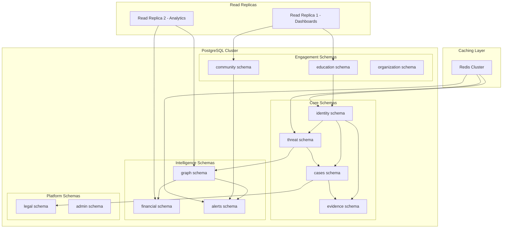
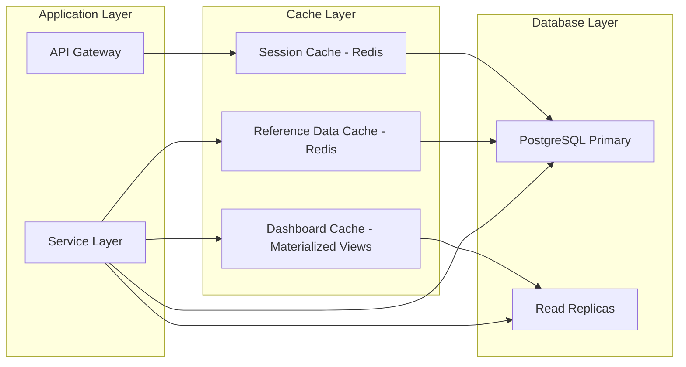
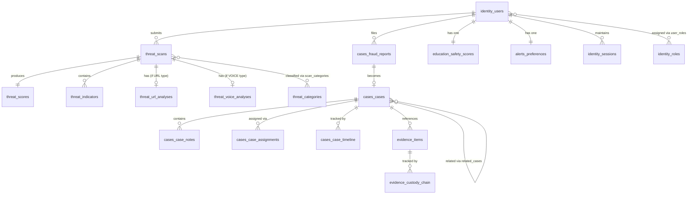
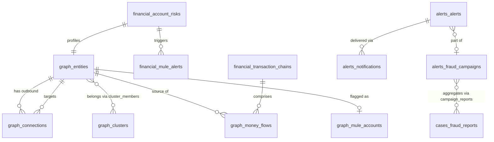
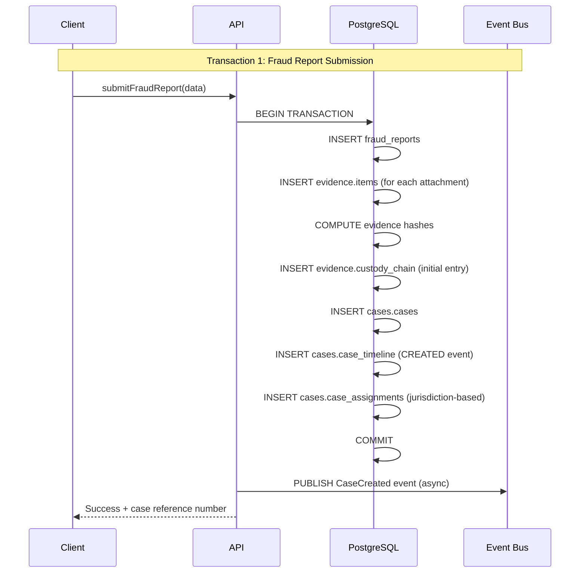
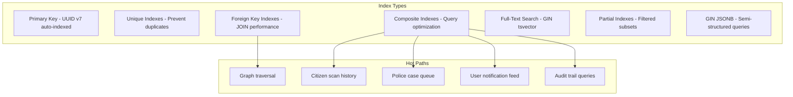
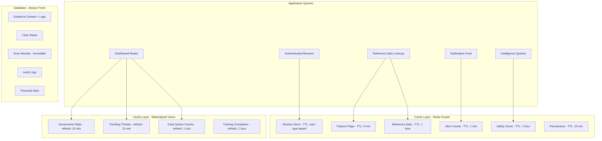
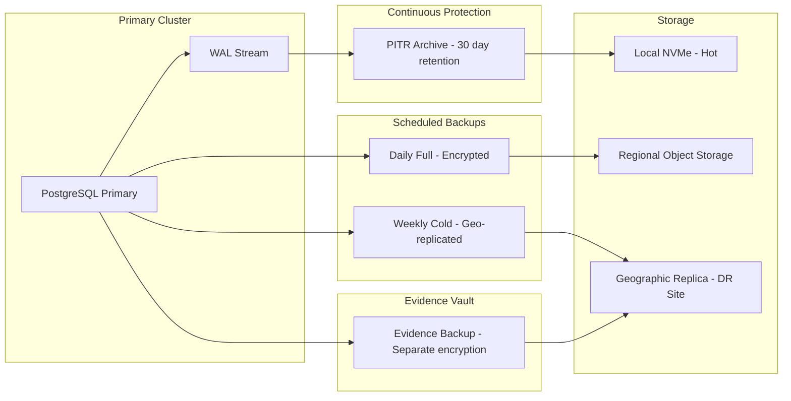

# Design Document: CyberShield AI — Logical Database Architecture

## Overview

This document defines the logical database architecture for CyberShield AI, mapping the Domain-Driven Design (DDD) model (15 bounded contexts, 35+ entities, 10 aggregates, 19 value objects) to PostgreSQL logical database structures. The architecture establishes schema boundaries, table definitions, relationship mappings, transaction boundaries, indexing strategies, partitioning plans, caching layers, retention policies, backup strategies, and future expansion patterns.

This is a logical architecture document — it defines WHAT the database stores and HOW data relates, not implementation-level SQL, migrations, or ORM configurations. All structures derive directly from the previously defined domain model (P05), ensuring consistency between business concepts and data persistence.

The architecture supports CyberShield AI's target of 1M+ concurrent users across six user types (Citizens, Police, CyberCell, Government, Banks, Organizations), with ACID guarantees for evidence integrity and case management, eventual consistency for analytics and community intelligence, and horizontal read scaling via replicas.

---

## Architecture

### Database Schema Topology



### Caching Layer Architecture



---

## Components and Interfaces

The database architecture comprises 12 PostgreSQL schemas, each mapping to a bounded context from the domain model. Each schema is an isolated component with defined table interfaces, domain events, and cross-schema reference contracts.

### Component 1: `identity` Schema

**Purpose**: Manages user identity, authentication, sessions, and role-based access control for all six user types.

**Tables Exposed**:
- `identity.users` — Base user entity (PK referenced by nearly all other schemas)
- `identity.sessions` — Active session tracking with TTL
- `identity.roles` — System-defined role definitions
- `identity.permissions` — Granular permission definitions
- `identity.role_permissions` — Role-to-permission mappings (M:N)
- `identity.user_roles` — User-to-role assignments (M:N)
- `identity.user_preferences` — Per-user JSONB preferences

**Events Produced**: `UserCreated`, `UserSuspended`, `UserDeactivated`, `SessionCreated`, `SessionRevoked`

**Events Consumed**: None (root identity provider)

**Cross-Schema References**: `identity.users.id` is referenced as FK by `threat`, `cases`, `evidence`, `alerts`, `community`, `education`, `organization`, `admin` schemas.

---

### Component 2: `threat` Schema

**Purpose**: Stores threat scan requests, AI analysis results, scores, indicators, and category taxonomy.

**Tables Exposed**:
- `threat.scans` — Scan submissions (partitioned monthly)
- `threat.scores` — Immutable threat scores (append-only)
- `threat.indicators` — Detected fraud signals per scan
- `threat.categories` — Hierarchical threat taxonomy
- `threat.scan_categories` — Scan-to-category junction (M:N)
- `threat.url_analyses` — URL-specific analysis (1:1 with URL scans)
- `threat.voice_analyses` — Voice-specific analysis (1:1 with voice scans)

**Events Produced**: `ScanCompleted`, `ThreatScored`, `HighThreatDetected`

**Events Consumed**: `UserCreated` (for citizen scan quota initialization)

**Cross-Schema References**: References `identity.users.id` for `citizen_id`. Referenced by `cases.fraud_reports.scan_ids` and `graph` schema for threat correlation.

---

### Component 3: `cases` Schema

**Purpose**: Manages fraud reports, formal investigation cases, timeline events, notes, and case assignments.

**Tables Exposed**:
- `cases.fraud_reports` — Initial citizen fraud reports
- `cases.cases` — Formal investigation records with state machine lifecycle
- `cases.case_notes` — Append-only investigation notes
- `cases.case_assignments` — Officer-to-case assignments
- `cases.case_timeline` — Chronological event log (partitioned monthly)
- `cases.related_cases` — Self-referential case linkage (M:N)

**Events Produced**: `CaseCreated`, `CaseStatusChanged`, `CaseEscalated`, `CaseClosed`

**Events Consumed**: `ScanCompleted` (auto-link scans to reports), `EvidenceUploaded` (timeline entry)

**Cross-Schema References**: References `identity.users.id` for officers/citizens. Referenced by `evidence.items.case_id` and `legal.fir_drafts`.

---

### Component 4: `evidence` Schema

**Purpose**: Stores digital evidence metadata with cryptographic integrity and immutable chain-of-custody records.

**Tables Exposed**:
- `evidence.items` — Evidence artifacts with SHA-256 hashes
- `evidence.custody_chain` — Append-only, cryptographically linked custody log

**Events Produced**: `EvidenceUploaded`, `EvidenceVerified`, `EvidenceCompromised`

**Events Consumed**: `CaseCreated` (prepare evidence container), `CaseClosed` (set retention dates)

**Cross-Schema References**: References `cases.cases.id` and `identity.users.id`. No outbound FK to other schemas.

---

### Component 5: `graph` Schema

**Purpose**: Fraud intelligence graph storing entities (nodes), connections (edges), clusters, money flows, and mule accounts.

**Tables Exposed**:
- `graph.entities` — Graph nodes (partitioned by entity_type)
- `graph.connections` — Edges linking entities
- `graph.clusters` — Detected fraud networks
- `graph.cluster_members` — Entity-to-cluster membership (M:N)
- `graph.money_flows` — Directional financial flows
- `graph.mule_accounts` — Flagged accounts with lifecycle state

**Events Produced**: `GraphEntityRegistered`, `ClusterDetected`, `MuleAccountFlagged`

**Events Consumed**: `ScanCompleted`, `FraudReportSubmitted` (extract entities for graph ingestion)

**Cross-Schema References**: References `identity.users.id` indirectly via entity identifiers. Feeds into `financial` and `alerts` schemas via events.

---

### Component 6: `financial` Schema

**Purpose**: Tracks transaction chains, account risk profiles, and mule alerts to banking partners.

**Tables Exposed**:
- `financial.transaction_chains` — Sequential transaction records
- `financial.account_risks` — Per-account risk profiles
- `financial.mule_alerts` — Alerts dispatched to bank partners

**Events Produced**: `MuleAlertDispatched`, `AccountRiskElevated`

**Events Consumed**: `MuleAccountFlagged`, `ClusterDetected` (from `graph` schema)

**Cross-Schema References**: References `graph.entities.id` for account linkage. Referenced by `alerts` schema for notification triggers.

---

### Component 7: `alerts` Schema

**Purpose**: Manages alerts, fraud campaign tracking, notification delivery, and user alert preferences.

**Tables Exposed**:
- `alerts.alerts` — Severity-classified alerts
- `alerts.fraud_campaigns` — Campaign metadata
- `alerts.campaign_reports` — Campaign-to-report junction (M:N)
- `alerts.notifications` — Delivery records (partitioned monthly)
- `alerts.preferences` — Per-user notification channel config

**Events Produced**: `AlertCreated`, `NotificationDispatched`, `CampaignDetected`

**Events Consumed**: `HighThreatDetected`, `ClusterDetected`, `MuleAlertDispatched`, `CommunityTrendConfirmed`

**Cross-Schema References**: References `identity.users.id` for notification targeting. References `cases.fraud_reports` via campaign linkage.

---

### Component 8: `community` Schema

**Purpose**: Stores anonymized community contributions, trending threats, and verification votes.

**Tables Exposed**:
- `community.contributions` — Anonymized community reports
- `community.trending_threats` — Aggregated trend records
- `community.verifications` — Verification votes on contributions

**Events Produced**: `CommunityTrendConfirmed`, `ContributionVerified`

**Events Consumed**: `ScanCompleted` (aggregate patterns for trending detection)

**Cross-Schema References**: References `identity.users.id` (anonymized contributor tracking). Feeds `alerts` schema via events.

---

### Component 9: `education` Schema

**Purpose**: Manages learning modules, quizzes, citizen progress, and safety scores.

**Tables Exposed**:
- `education.modules` — Multilingual learning content
- `education.quizzes` — Quizzes linked to modules
- `education.quiz_questions` — Randomizable question pool
- `education.progress` — Per-citizen per-module tracking
- `education.safety_scores` — Daily recalculated citizen safety scores

**Events Produced**: `ModuleCompleted`, `SafetyScoreUpdated`

**Events Consumed**: `UserCreated` (initialize safety score baseline)

**Cross-Schema References**: References `identity.users.id` for citizen progress tracking.

---

### Component 10: `organization` Schema

**Purpose**: Supports organizational training programs, phishing simulations, and employee tracking.

**Tables Exposed**:
- `organization.training_programs` — Training program definitions
- `organization.phishing_simulations` — Simulation exercises
- `organization.employee_records` — Per-employee per-program tracking
- `organization.simulation_results` — Simulation outcomes

**Events Produced**: `SimulationCompleted`, `TrainingProgramCompleted`

**Events Consumed**: `UserCreated` (for organization user onboarding)

**Cross-Schema References**: References `identity.users.id` for employee/admin linkage.

---

### Component 11: `legal` Schema

**Purpose**: Manages AI-generated FIR drafts and legal section references (IPC/IT Act).

**Tables Exposed**:
- `legal.fir_drafts` — AI-generated FIR drafts requiring human approval
- `legal.sections` — Reference table of legal code sections
- `legal.draft_sections` — Draft-to-section junction (M:N)

**Events Produced**: `FIRDraftGenerated`, `FIRDraftApproved`

**Events Consumed**: `CaseEscalated` (trigger FIR draft generation)

**Cross-Schema References**: References `cases.cases.id` for case linkage. References `identity.users.id` for approver tracking.

---

### Component 12: `admin` Schema

**Purpose**: Platform administration — immutable audit logs, feature flags, and system configuration.

**Tables Exposed**:
- `admin.audit_logs` — Append-only, partitioned, immutable audit trail
- `admin.feature_flags` — Feature toggle configuration
- `admin.system_config` — Key-value platform settings

**Events Produced**: `FeatureFlagToggled`, `ConfigChanged`

**Events Consumed**: All domain events (written to audit log for compliance)

**Cross-Schema References**: References `identity.users.id` for actor attribution. No outbound references — consumes events from all schemas.

---

## Data Models

This section summarizes the key data model patterns used across the 12 schemas.

### Aggregate Table Structures

Each aggregate root table follows a consistent pattern:

| Pattern Element | Implementation |
|---|---|
| Primary Key | UUID v7 (time-sortable, globally unique) |
| Optimistic Concurrency | `version INTEGER NOT NULL DEFAULT 1` |
| Soft Delete | `deleted_at TIMESTAMPTZ NULL` (where applicable) |
| Audit Columns | `created_at`, `updated_at`, `created_by` |
| State Machine | `status ENUM` with defined transitions |

**Aggregate Roots** (transaction boundaries):
- `identity.users` — User lifecycle and access
- `threat.scans` — Scan submission through scoring
- `cases.cases` — Case lifecycle (OPEN → INVESTIGATING → ESCALATED → CLOSED)
- `evidence.items` — Evidence integrity and custody
- `graph.entities` — Graph node with connections
- `graph.clusters` — Cluster detection and membership
- `alerts.alerts` — Alert creation and delivery
- `education.modules` — Learning content management
- `organization.training_programs` — Training lifecycle

### Relationship Types

The architecture uses four relationship patterns:

**1. One-to-One (1:1)** — Implemented via UNIQUE FK constraint
- `threat.url_analyses.scan_id` → `threat.scans.id` (UNIQUE)
- `threat.voice_analyses.scan_id` → `threat.scans.id` (UNIQUE)
- `education.safety_scores.citizen_id` → `identity.users.id` (UNIQUE)

**2. One-to-Many (1:N)** — Standard FK constraint
- `threat.scans.citizen_id` → `identity.users.id`
- `cases.case_notes.case_id` → `cases.cases.id`
- `evidence.items.case_id` → `cases.cases.id`
- `evidence.custody_chain.evidence_id` → `evidence.items.id`
- `alerts.notifications.alert_id` → `alerts.alerts.id`

**3. Many-to-Many (M:N)** — Junction tables with composite uniqueness
- `identity.role_permissions` — role ↔ permission
- `identity.user_roles` — user ↔ role
- `threat.scan_categories` — scan ↔ category
- `graph.cluster_members` — entity ↔ cluster
- `alerts.campaign_reports` — campaign ↔ fraud_report
- `legal.draft_sections` — draft ↔ legal_section
- `cases.related_cases` — case ↔ case (self-referential)

**4. Cross-Schema References** — FK to `identity.users.id` only
- All schemas reference `identity.users.id` for actor attribution
- No direct cross-schema JOINs in application code — event-driven communication instead
- `cases` ↔ `evidence` is the one exception: `evidence.items.case_id` directly references `cases.cases.id` (same transactional boundary for evidence upload)

### Value Object Column Patterns

Value objects from the domain model are embedded directly as columns or JSONB rather than separate tables:

**Embedded as Typed Columns**:
- `EvidenceHash` → `hash_algorithm VARCHAR(10)`, `hash_value VARCHAR(64)`, `hash_computed_at TIMESTAMPTZ` on `evidence.items`
- `ThreatScore` → `score INTEGER`, `classification ENUM`, `confidence DECIMAL` on `threat.scores`
- `Money` → `fraud_amount DECIMAL(12,2)`, `currency VARCHAR(3)` on `cases.fraud_reports`
- `JurisdictionCode` → `jurisdiction_code VARCHAR(20)` on `identity.users`, `cases.fraud_reports`, `cases.cases`
- `ConnectionStrength` → `strength DECIMAL(3,2)` with CHECK(0.01-1.00) on `graph.connections`

**Embedded as JSONB**:
- `AnalysisResult` → `analysis_result JSONB` on `threat.scans` (flexible AI output structure)
- `DeviceInfo` → `device_info JSONB` on `identity.sessions`
- `SuspectContact` → `suspect_contact JSONB` on `cases.fraud_reports` (phone/email/UPI)
- `RiskSignals` → `risk_signals JSONB` on `threat.url_analyses`
- `SpeechPatterns` → `speech_patterns JSONB` on `threat.voice_analyses`
- `ContributingFactors` → `contributing_factors JSONB` on `threat.scores`
- `TargetingRules` → `targeting_rules JSONB` on `admin.feature_flags`
- `UserPreferences` → JSONB column on `identity.user_preferences`

**JSONB Design Rationale**: Semi-structured data that varies by context (AI outputs, device metadata, flexible config) uses JSONB with GIN indexes for queryability. Structured, frequently-queried value objects use dedicated typed columns for type safety and indexing efficiency.

---

## SECTION 1: Database Design Philosophy

### Why PostgreSQL

| Requirement | PostgreSQL Capability |
|---|---|
| Evidence integrity, case management | ACID compliance with full transaction support |
| Flexible threat indicator storage, AI analysis results | Native JSON/JSONB with indexing (GIN indexes) |
| Investigation queries across cases/evidence | Full-text search with ts_vector and ts_query |
| Jurisdiction-based access control | Row-Level Security (RLS) policies |
| Proven at scale | Stripe, Instagram, Reddit — proven at 1M+ users |
| Geographic queries for regional alerts | PostGIS extension |
| Fuzzy search for entity matching | pg_trgm extension for trigram similarity |

### Normalization Strategy

- **3NF (Third Normal Form)** as default for all transactional tables (scans, reports, evidence, cases)
- **Selective denormalization** for read-heavy analytics via materialized views (dashboard stats, trending threats)
- **JSONB columns** for semi-structured data: AI analysis results, threat indicator metadata, flexible configuration
- **Separate schemas per bounded context** for isolation, enabling independent evolution and future microservice extraction

### Performance Philosophy

- **Write-optimized** for core transaction tables: scans, reports, evidence, audit logs (sequential writes, minimal indexes on write path)
- **Read-optimized** for dashboards via materialized views, denormalized aggregates, and Redis caching
- **Time-based partitioning** for high-volume time-series data: scans, audit logs, notifications, timeline entries
- **Connection pooling** (PgBouncer) for concurrent access supporting 1M+ users target
- **Prepared statements** for hot-path queries (scan submission, case lookup, notification fetch)

### Scalability Philosophy

- **Horizontal read scaling** via read replicas (separate replicas for dashboards vs. analytics)
- **Vertical scaling for writes** — single primary per context, optimized for write throughput
- **Table partitioning** for data growth management (monthly partitions for time-series)
- **Archival strategy** for data beyond retention window (compressed, read-only partitions)
- **Schema-per-context** enables future microservice extraction with minimal coupling
- **Event-driven cross-schema communication** — no direct cross-schema JOINs in application code

### Primary Key Strategy

- **UUID v7** for all primary keys: time-sortable, globally unique, no coordination needed
- Time-sortable property enables efficient range queries on creation time
- 128-bit UUIDs avoid sequence contention under high concurrency
- Compatible with distributed systems if contexts are later split into separate databases

### Soft Delete Strategy

- **`deleted_at` TIMESTAMP NULL** column on all user-facing entities
- `NULL` = active record, non-NULL = soft-deleted
- Partial indexes exclude soft-deleted records from query paths
- Hard deletion only via scheduled retention jobs (after retention window)

### Audit Column Standard

Every table includes:
- `created_at TIMESTAMPTZ NOT NULL DEFAULT NOW()` — immutable creation time
- `updated_at TIMESTAMPTZ NOT NULL DEFAULT NOW()` — last modification time (trigger-updated)
- `created_by UUID REFERENCES identity.users(id)` — actor who created the record
- `version INTEGER NOT NULL DEFAULT 1` — optimistic concurrency control

---

## SECTION 2: Entity-to-Database Mapping

### Mapping Principles

Each bounded context from the domain model maps to a dedicated PostgreSQL schema. Entities map to tables, value objects embed as columns or JSONB, and aggregates define transaction boundaries.

### Identity & Access Context → `identity` schema

| Domain Entity | Database Table | Notes |
|---|---|---|
| User | `identity.users` | Base table with STI via `user_type` discriminator column |
| Session | `identity.sessions` | FK to users, TTL-based lifecycle |
| Role | `identity.roles` | Reference table, seeded |
| Permission | `identity.permissions` | Reference table, seeded |
| RolePermission | `identity.role_permissions` | Junction table (role ↔ permission M:N) |
| UserRole | `identity.user_roles` | Junction table (user ↔ role M:N, one primary) |
| Preference | `identity.user_preferences` | One row per user, JSONB for flexible preferences |

### Threat Intelligence Context → `threat` schema

| Domain Entity | Database Table | Notes |
|---|---|---|
| ThreatScan | `threat.scans` | Aggregate root, partitioned by month |
| ThreatResult | Embedded in `threat.scans` | 1:1, stored as JSONB column `analysis_result` |
| ThreatScore | `threat.scores` | Immutable, append-only, FK to scan |
| ThreatIndicator | `threat.indicators` | Many per scan, FK to scan |
| ThreatCategory | `threat.categories` | Reference/lookup table, hierarchical |
| ScanCategory | `threat.scan_categories` | Junction table (scan ↔ category M:N) |
| URLAnalysis | `threat.url_analyses` | 1:1 with scan (when scan_type = URL) |
| VoiceAnalysis | `threat.voice_analyses` | 1:1 with scan (when scan_type = VOICE) |

### Case Management Context → `cases` schema

| Domain Entity | Database Table | Notes |
|---|---|---|
| FraudReport | `cases.fraud_reports` | Triggers case creation |
| Case | `cases.cases` | Aggregate root, state machine lifecycle |
| CaseNote | `cases.case_notes` | Append-only, FK to case |
| CaseAssignment | `cases.case_assignments` | FK to case and user (officer) |
| CaseTimeline | `cases.case_timeline` | Append-only, partitioned by month |
| RelatedCase | `cases.related_cases` | Self-referential junction (case ↔ case M:N) |

### Evidence Management Context → `evidence` schema

| Domain Entity | Database Table | Notes |
|---|---|---|
| Evidence | `evidence.items` | Aggregate root, includes hash columns |
| EvidenceChain | `evidence.custody_chain` | Append-only, cryptographically linked entries |
| EvidenceHash | Embedded in `evidence.items` | Dedicated columns: `hash_algorithm`, `hash_value`, `hash_computed_at` |

### Fraud Intelligence Context → `graph` schema

| Domain Entity | Database Table | Notes |
|---|---|---|
| GraphEntity | `graph.entities` | Aggregate root, list-partitioned by entity_type |
| GraphConnection | `graph.connections` | Edge table, FK to source and target entity |
| FraudCluster | `graph.clusters` | Cluster metadata and metrics |
| ClusterMembership | `graph.cluster_members` | Junction (entity ↔ cluster M:N) |
| MoneyFlow | `graph.money_flows` | Directional flow records |
| MuleAccount | `graph.mule_accounts` | Flagged accounts with lifecycle state |

### Alert & Communication Context → `alerts` schema

| Domain Entity | Database Table | Notes |
|---|---|---|
| Alert | `alerts.alerts` | Aggregate root, severity-classified |
| FraudCampaign | `alerts.fraud_campaigns` | Campaign metadata |
| CampaignReport | `alerts.campaign_reports` | Junction (campaign ↔ fraud_report M:N) |
| Notification | `alerts.notifications` | Delivery records, partitioned by month |
| AlertPreference | `alerts.preferences` | One per user, JSONB for channel config |

### Community Intelligence Context → `community` schema

| Domain Entity | Database Table | Notes |
|---|---|---|
| CommunityContribution | `community.contributions` | Anonymized reports |
| TrendingThreat | `community.trending_threats` | Aggregated trend records |
| ContributionVerification | `community.verifications` | Verification votes on contributions |

### Education & Awareness Context → `education` schema

| Domain Entity | Database Table | Notes |
|---|---|---|
| LearningModule | `education.modules` | Aggregate root, multilingual content |
| Quiz | `education.quizzes` | FK to module |
| QuizQuestion | `education.quiz_questions` | FK to quiz, randomizable pool |
| LearningProgress | `education.progress` | Per-citizen per-module tracking |
| SafetyScore | `education.safety_scores` | One per citizen, daily recalculated |

### Financial Intelligence Context → `financial` schema

| Domain Entity | Database Table | Notes |
|---|---|---|
| TransactionChain | `financial.transaction_chains` | Sequential transaction records |
| AccountRisk | `financial.account_risks` | Risk profile per account |
| MuleAlert | `financial.mule_alerts` | Alert to bank partners |

### Legal Services Context → `legal` schema

| Domain Entity | Database Table | Notes |
|---|---|---|
| FIRDraft | `legal.fir_drafts` | AI-generated, requires human approval |
| LegalSection | `legal.sections` | Reference table (IPC/IT Act sections) |
| DraftSection | `legal.draft_sections` | Junction (draft ↔ section M:N) |

### Organization Management Context → `organization` schema

| Domain Entity | Database Table | Notes |
|---|---|---|
| TrainingProgram | `organization.training_programs` | Aggregate root |
| PhishingSimulation | `organization.phishing_simulations` | FK to training program |
| EmployeeTrainingRecord | `organization.employee_records` | Per-employee per-program tracking |
| SimulationResult | `organization.simulation_results` | Per-employee simulation outcomes |

### Platform Administration Context → `admin` schema

| Domain Entity | Database Table | Notes |
|---|---|---|
| AuditLog | `admin.audit_logs` | Append-only, partitioned by month, immutable |
| FeatureFlag | `admin.feature_flags` | Configuration with targeting rules |
| SystemConfig | `admin.system_config` | Key-value platform configuration |

---

## SECTION 3: Table Planning

### Key Table Definitions

Each table definition includes: purpose, primary key strategy, soft delete applicability, audit columns, and key relationships.

---

### `identity.users`

**Purpose**: Base user identity for all platform participants.

| Column | Type | Constraints | Notes |
|---|---|---|---|
| id | UUID v7 | PK | Time-sortable primary key |
| user_type | ENUM | NOT NULL | CITIZEN, POLICE, CYBERCELL, GOVERNMENT, BANK, ORGANIZATION, ADMIN |
| phone_number | VARCHAR(15) | UNIQUE, NOT NULL | Primary identifier for Indian users |
| email | VARCHAR(254) | UNIQUE, NULL | Optional secondary identifier |
| display_name | VARCHAR(100) | NOT NULL | User-facing name |
| password_hash | VARCHAR(255) | NOT NULL | Bcrypt/Argon2 hash |
| phone_verified | BOOLEAN | NOT NULL DEFAULT FALSE | Phone verification status |
| email_verified | BOOLEAN | NOT NULL DEFAULT FALSE | Email verification status |
| status | ENUM | NOT NULL DEFAULT 'PENDING' | PENDING, ACTIVE, SUSPENDED, DEACTIVATED |
| jurisdiction_code | VARCHAR(20) | NULL | For police/cybercell: state+district+station |
| organization_id | UUID | NULL, FK | For org users: link to organization |
| mfa_enabled | BOOLEAN | NOT NULL DEFAULT FALSE | Multi-factor auth flag |
| failed_login_attempts | INTEGER | NOT NULL DEFAULT 0 | Lockout counter |
| locked_until | TIMESTAMPTZ | NULL | Temporary lockout expiry |
| last_login_at | TIMESTAMPTZ | NULL | Last successful login |
| deleted_at | TIMESTAMPTZ | NULL | Soft delete marker |
| created_at | TIMESTAMPTZ | NOT NULL DEFAULT NOW() | Audit |
| updated_at | TIMESTAMPTZ | NOT NULL DEFAULT NOW() | Audit |
| created_by | UUID | NULL, FK | System for self-registration |
| version | INTEGER | NOT NULL DEFAULT 1 | Optimistic concurrency |

---

### `identity.sessions`

**Purpose**: Active user sessions with TTL-based expiry.

| Column | Type | Constraints | Notes |
|---|---|---|---|
| id | UUID v7 | PK | Session identifier |
| user_id | UUID | NOT NULL, FK → identity.users | Session owner |
| token_hash | VARCHAR(255) | NOT NULL, UNIQUE | Hashed session token |
| device_info | JSONB | NULL | Device metadata |
| ip_address | INET | NULL | Login IP |
| expires_at | TIMESTAMPTZ | NOT NULL | TTL: 24h citizen, 8h officer, 4h admin |
| created_at | TIMESTAMPTZ | NOT NULL DEFAULT NOW() | Session start |
| revoked_at | TIMESTAMPTZ | NULL | Explicit logout/revocation |

---

### `identity.roles`

**Purpose**: System-defined roles controlling access levels.

| Column | Type | Constraints | Notes |
|---|---|---|---|
| id | UUID v7 | PK | Role identifier |
| name | VARCHAR(50) | UNIQUE, NOT NULL | CITIZEN, POLICE_OFFICER, CYBERCELL_OFFICER, GOVT_OFFICIAL, BANK_ANALYST, ORG_ADMIN, PLATFORM_ADMIN |
| description | TEXT | NULL | Role description |
| is_system | BOOLEAN | NOT NULL DEFAULT TRUE | System roles cannot be deleted |
| created_at | TIMESTAMPTZ | NOT NULL DEFAULT NOW() | Audit |

---

### `threat.scans`

**Purpose**: Record of every threat analysis request submitted by users. High-volume, partitioned by month.

| Column | Type | Constraints | Notes |
|---|---|---|---|
| id | UUID v7 | PK | Scan identifier |
| citizen_id | UUID | NOT NULL, FK → identity.users | Submitting user |
| scan_type | ENUM | NOT NULL | MESSAGE, URL, VOICE, EMAIL |
| source_channel | VARCHAR(20) | NOT NULL | SMS, WHATSAPP, EMAIL, WEB, BROWSER_EXT, MOBILE |
| input_content | TEXT | NULL | Text input (encrypted at rest) |
| input_url | VARCHAR(2048) | NULL | URL input |
| audio_reference | VARCHAR(500) | NULL | Voice file storage reference |
| status | ENUM | NOT NULL DEFAULT 'SUBMITTED' | SUBMITTED, PROCESSING, ANALYZED, SCORED, FAILED |
| analysis_result | JSONB | NULL | Full NLP/analysis output |
| processing_duration_ms | INTEGER | NULL | SLA tracking |
| created_at | TIMESTAMPTZ | NOT NULL DEFAULT NOW() | Submission time (partition key) |
| updated_at | TIMESTAMPTZ | NOT NULL DEFAULT NOW() | Last status change |
| created_by | UUID | NOT NULL, FK | = citizen_id |
| version | INTEGER | NOT NULL DEFAULT 1 | Optimistic concurrency |

**Partition**: RANGE on `created_at` (monthly)

---

### `threat.scores`

**Purpose**: Immutable threat score records. Append-only, never modified.

| Column | Type | Constraints | Notes |
|---|---|---|---|
| id | UUID v7 | PK | Score identifier |
| scan_id | UUID | NOT NULL, FK → threat.scans | Parent scan |
| score | INTEGER | NOT NULL, CHECK(0-100) | Numeric risk rating |
| classification | ENUM | NOT NULL | SAFE, CAUTION, DANGER |
| confidence | DECIMAL(3,2) | NOT NULL, CHECK(0-1) | Confidence level |
| contributing_factors | JSONB | NOT NULL | Factor weights and explanations |
| created_at | TIMESTAMPTZ | NOT NULL DEFAULT NOW() | Score generation time |

**Immutability**: No UPDATE or DELETE operations permitted (enforced by trigger/policy).

---

### `threat.indicators`

**Purpose**: Individual fraud signals detected during scan analysis.

| Column | Type | Constraints | Notes |
|---|---|---|---|
| id | UUID v7 | PK | Indicator instance ID |
| scan_id | UUID | NOT NULL, FK → threat.scans | Parent scan |
| indicator_type | VARCHAR(50) | NOT NULL | URGENCY_LANGUAGE, SUSPICIOUS_URL, IMPERSONATION, etc. |
| value | TEXT | NOT NULL | Detected indicator value |
| severity_weight | DECIMAL(3,2) | NOT NULL, CHECK(0-1) | Contribution to score |
| metadata | JSONB | NULL | Additional context |
| created_at | TIMESTAMPTZ | NOT NULL DEFAULT NOW() | Detection time |

---

### `threat.categories`

**Purpose**: Hierarchical taxonomy of threat types.

| Column | Type | Constraints | Notes |
|---|---|---|---|
| id | UUID v7 | PK | Category identifier |
| name | VARCHAR(50) | UNIQUE, NOT NULL | PHISHING, VISHING, SMISHING, etc. |
| parent_id | UUID | NULL, FK → self | Hierarchical parent (max 3 levels) |
| description | TEXT | NULL | Category description |
| status | ENUM | NOT NULL DEFAULT 'ACTIVE' | ACTIVE, DEPRECATED |
| created_at | TIMESTAMPTZ | NOT NULL DEFAULT NOW() | Audit |

---

### `threat.url_analyses`

**Purpose**: Specialized URL analysis results (1:1 with URL-type scans).

| Column | Type | Constraints | Notes |
|---|---|---|---|
| id | UUID v7 | PK | Analysis identifier |
| scan_id | UUID | NOT NULL, UNIQUE, FK → threat.scans | Parent scan (1:1) |
| original_url | VARCHAR(2048) | NOT NULL | Submitted URL |
| resolved_url | VARCHAR(2048) | NULL | After redirect resolution |
| domain | VARCHAR(255) | NOT NULL | Extracted domain |
| domain_age_days | INTEGER | NULL | Domain registration age |
| ssl_valid | BOOLEAN | NULL | SSL certificate validity |
| redirect_count | INTEGER | NOT NULL DEFAULT 0 | Redirect hop count |
| risk_signals | JSONB | NOT NULL | Detailed risk indicators |
| created_at | TIMESTAMPTZ | NOT NULL DEFAULT NOW() | Analysis time |

---

### `threat.voice_analyses`

**Purpose**: Voice/audio analysis results (1:1 with VOICE-type scans).

| Column | Type | Constraints | Notes |
|---|---|---|---|
| id | UUID v7 | PK | Analysis identifier |
| scan_id | UUID | NOT NULL, UNIQUE, FK → threat.scans | Parent scan (1:1) |
| duration_seconds | INTEGER | NOT NULL, CHECK(<=300) | Audio length (max 5 min) |
| transcript | TEXT | NULL | Generated transcript |
| deepfake_probability | DECIMAL(3,2) | NOT NULL, CHECK(0-1) | Synthetic voice confidence |
| speech_patterns | JSONB | NOT NULL | Urgency, authority claims, etc. |
| timestamp_markers | JSONB | NULL | Key moment timestamps |
| created_at | TIMESTAMPTZ | NOT NULL DEFAULT NOW() | Analysis time |

---

### `cases.fraud_reports`

**Purpose**: Initial fraud reports filed by citizens before case creation.

| Column | Type | Constraints | Notes |
|---|---|---|---|
| id | UUID v7 | PK | Report identifier |
| citizen_id | UUID | NOT NULL, FK → identity.users | Reporting citizen |
| description | TEXT | NOT NULL | Incident description |
| suspect_contact | JSONB | NOT NULL | Phone/email/UPI of suspect |
| incident_date | DATE | NOT NULL | When fraud occurred |
| fraud_amount | DECIMAL(12,2) | NULL | Financial loss if applicable |
| currency | VARCHAR(3) | NOT NULL DEFAULT 'INR' | ISO 4217 |
| jurisdiction_code | VARCHAR(20) | NOT NULL | Determined from location/suspect |
| status | ENUM | NOT NULL DEFAULT 'SUBMITTED' | SUBMITTED, VALIDATED, CASE_CREATED, REJECTED |
| rejection_reason | TEXT | NULL | Required if REJECTED |
| scan_ids | UUID[] | NULL | Related threat scans |
| deleted_at | TIMESTAMPTZ | NULL | Soft delete |
| created_at | TIMESTAMPTZ | NOT NULL DEFAULT NOW() | Submission time |
| updated_at | TIMESTAMPTZ | NOT NULL DEFAULT NOW() | Last change |
| created_by | UUID | NOT NULL, FK | = citizen_id |
| version | INTEGER | NOT NULL DEFAULT 1 | OCC |

---

### `cases.cases`

**Purpose**: Formal investigation records with state machine lifecycle.

| Column | Type | Constraints | Notes |
|---|---|---|---|
| id | UUID v7 | PK | Case identifier |
| reference_number | VARCHAR(15) | UNIQUE, NOT NULL | Format: FR-YYYY-NNNNN |
| fraud_report_id | UUID | NOT NULL, FK → cases.fraud_reports | Originating report |
| status | ENUM | NOT NULL DEFAULT 'OPEN' | OPEN, INVESTIGATING, ESCALATED, CLOSED |
| assigned_officer_id | UUID | NOT NULL, FK → identity.users | Primary investigator |
| jurisdiction_code | VARCHAR(20) | NOT NULL | Jurisdictional assignment |
| priority | ENUM | NOT NULL DEFAULT 'MEDIUM' | LOW, MEDIUM, HIGH, CRITICAL |
| resolution_summary | TEXT | NULL | Required for CLOSED status |
| escalation_reason | TEXT | NULL | Required for ESCALATED status |
| closed_at | TIMESTAMPTZ | NULL | Case closure timestamp |
| deleted_at | TIMESTAMPTZ | NULL | Soft delete |
| created_at | TIMESTAMPTZ | NOT NULL DEFAULT NOW() | Case creation time |
| updated_at | TIMESTAMPTZ | NOT NULL DEFAULT NOW() | Last modification |
| created_by | UUID | NOT NULL, FK | System or officer |
| version | INTEGER | NOT NULL DEFAULT 1 | OCC |

**Partition**: LIST on `jurisdiction_code` (state-level)

---

### `cases.case_notes`

**Purpose**: Append-only investigation notes attached to cases.

| Column | Type | Constraints | Notes |
|---|---|---|---|
| id | UUID v7 | PK | Note identifier |
| case_id | UUID | NOT NULL, FK → cases.cases | Parent case |
| author_id | UUID | NOT NULL, FK → identity.users | Note author |
| content | TEXT | NOT NULL, CHECK(length >= 10) | Note content (min 10 chars) |
| is_restricted | BOOLEAN | NOT NULL DEFAULT FALSE | Restricted access flag |
| created_at | TIMESTAMPTZ | NOT NULL DEFAULT NOW() | Creation time (immutable) |

**Immutability**: No UPDATE or DELETE permitted. Append-only.

---

### `cases.case_timeline`

**Purpose**: Chronological event log for case lifecycle. Append-only, partitioned.

| Column | Type | Constraints | Notes |
|---|---|---|---|
| id | UUID v7 | PK | Entry identifier |
| case_id | UUID | NOT NULL, FK → cases.cases | Parent case |
| event_type | VARCHAR(50) | NOT NULL | STATUS_CHANGE, ASSIGNMENT, EVIDENCE_ADDED, NOTE_ADDED, ESCALATION |
| actor_id | UUID | NOT NULL, FK → identity.users | Who performed action |
| description | TEXT | NOT NULL | Event description |
| metadata | JSONB | NULL | Event-specific data |
| is_system_generated | BOOLEAN | NOT NULL DEFAULT FALSE | System vs manual |
| created_at | TIMESTAMPTZ | NOT NULL DEFAULT NOW() | Event time (partition key) |

**Partition**: RANGE on `created_at` (monthly). **Immutability**: Append-only.

---

### `evidence.items`

**Purpose**: Digital evidence artifacts with cryptographic integrity tracking.

| Column | Type | Constraints | Notes |
|---|---|---|---|
| id | UUID v7 | PK | Evidence identifier |
| case_id | UUID | NOT NULL, FK → cases.cases | Parent case |
| evidence_type | ENUM | NOT NULL | SCREENSHOT, DOCUMENT, AUDIO, VIDEO, TRANSACTION_RECORD |
| file_reference | VARCHAR(500) | NOT NULL | Encrypted storage path/key |
| file_size_bytes | BIGINT | NOT NULL, CHECK(<=104857600) | Max 100MB |
| mime_type | VARCHAR(100) | NOT NULL | Content type |
| hash_algorithm | VARCHAR(10) | NOT NULL DEFAULT 'SHA-256' | Hash algorithm used |
| hash_value | VARCHAR(64) | NOT NULL | SHA-256 hex string |
| hash_computed_at | TIMESTAMPTZ | NOT NULL | When hash was computed |
| status | ENUM | NOT NULL DEFAULT 'UPLOADED' | UPLOADED, VERIFIED, ACTIVE, COMPROMISED, DESTROYED |
| retention_until | DATE | NOT NULL | Calculated from case closure + 7 years |
| uploaded_by | UUID | NOT NULL, FK → identity.users | Uploader |
| created_at | TIMESTAMPTZ | NOT NULL DEFAULT NOW() | Upload time |
| updated_at | TIMESTAMPTZ | NOT NULL DEFAULT NOW() | Last status change |
| version | INTEGER | NOT NULL DEFAULT 1 | OCC |

---

### `evidence.custody_chain`

**Purpose**: Immutable chain-of-custody log for evidence handling.

| Column | Type | Constraints | Notes |
|---|---|---|---|
| id | UUID v7 | PK | Chain entry ID |
| evidence_id | UUID | NOT NULL, FK → evidence.items | Parent evidence |
| action | ENUM | NOT NULL | UPLOADED, ACCESSED, TRANSFERRED, VERIFIED, SEALED |
| actor_id | UUID | NOT NULL, FK → identity.users | Who performed action |
| from_officer_id | UUID | NULL, FK | Transfer source |
| to_officer_id | UUID | NULL, FK | Transfer destination |
| reason | TEXT | NULL | Reason for action |
| previous_entry_hash | VARCHAR(64) | NULL | Cryptographic link to previous entry |
| created_at | TIMESTAMPTZ | NOT NULL DEFAULT NOW() | Action time |

**Immutability**: Append-only. Cryptographic linking via `previous_entry_hash` ensures tamper detection.

---

### `graph.entities`

**Purpose**: Nodes in the fraud intelligence graph representing real-world actors/identifiers.

| Column | Type | Constraints | Notes |
|---|---|---|---|
| id | UUID v7 | PK | Entity identifier |
| entity_type | ENUM | NOT NULL | PHONE, BANK_ACCOUNT, PERSON, UPI_ID, EMAIL, DEVICE, IP_ADDRESS |
| identifier | VARCHAR(255) | NOT NULL | Type-specific value (phone number, account, etc.) |
| risk_score | INTEGER | NOT NULL DEFAULT 0, CHECK(0-100) | Computed from connections |
| status | ENUM | NOT NULL DEFAULT 'ACTIVE' | ACTIVE, FLAGGED, DORMANT, ARCHIVED |
| metadata | JSONB | NULL | Type-specific additional data |
| first_seen_at | TIMESTAMPTZ | NOT NULL DEFAULT NOW() | First detection |
| last_activity_at | TIMESTAMPTZ | NOT NULL DEFAULT NOW() | Last connection/activity |
| created_at | TIMESTAMPTZ | NOT NULL DEFAULT NOW() | Registration time |
| updated_at | TIMESTAMPTZ | NOT NULL DEFAULT NOW() | Last modification |
| version | INTEGER | NOT NULL DEFAULT 1 | OCC |

**Partition**: LIST on `entity_type`. **Unique**: (`entity_type`, `identifier`).

---

### `graph.connections`

**Purpose**: Edges in the fraud graph linking two entities.

| Column | Type | Constraints | Notes |
|---|---|---|---|
| id | UUID v7 | PK | Connection identifier |
| source_entity_id | UUID | NOT NULL, FK → graph.entities | Source node |
| target_entity_id | UUID | NOT NULL, FK → graph.entities | Target node |
| connection_type | ENUM | NOT NULL | CONTACTED, TRANSACTED, SHARED_DEVICE, SAME_NETWORK, REPORTED_TOGETHER, MONEY_FLOW |
| strength | DECIMAL(3,2) | NOT NULL, CHECK(0.01-1.00) | Connection strength (min 0.01) |
| evidence_count | INTEGER | NOT NULL DEFAULT 1 | Supporting evidence count |
| first_seen_at | TIMESTAMPTZ | NOT NULL DEFAULT NOW() | First detection |
| last_reinforced_at | TIMESTAMPTZ | NOT NULL DEFAULT NOW() | Last evidence addition |
| created_at | TIMESTAMPTZ | NOT NULL DEFAULT NOW() | Creation time |
| updated_at | TIMESTAMPTZ | NOT NULL DEFAULT NOW() | Last update |

---

### `graph.clusters`

**Purpose**: Detected fraud networks grouping interconnected entities.

| Column | Type | Constraints | Notes |
|---|---|---|---|
| id | UUID v7 | PK | Cluster identifier |
| name | VARCHAR(100) | NULL | Human-readable cluster name |
| member_count | INTEGER | NOT NULL, CHECK(>=3) | Minimum 3 entities |
| average_strength | DECIMAL(3,2) | NOT NULL, CHECK(>0.5) | Must exceed 0.5 threshold |
| risk_score | INTEGER | NOT NULL, CHECK(0-100) | Weighted average of members |
| status | ENUM | NOT NULL DEFAULT 'DETECTED' | DETECTED, CONFIRMED, ACTIVE, DISMANTLED, ARCHIVED |
| detection_method | VARCHAR(50) | NOT NULL | Algorithm that detected it |
| created_at | TIMESTAMPTZ | NOT NULL DEFAULT NOW() | Detection time |
| updated_at | TIMESTAMPTZ | NOT NULL DEFAULT NOW() | Last re-evaluation |
| version | INTEGER | NOT NULL DEFAULT 1 | OCC |

---

### `graph.cluster_members`

**Purpose**: Junction table linking entities to clusters (M:N).

| Column | Type | Constraints | Notes |
|---|---|---|---|
| id | UUID v7 | PK | Membership identifier |
| cluster_id | UUID | NOT NULL, FK → graph.clusters | Parent cluster |
| entity_id | UUID | NOT NULL, FK → graph.entities | Member entity |
| joined_at | TIMESTAMPTZ | NOT NULL DEFAULT NOW() | When entity joined cluster |
| role_in_cluster | VARCHAR(30) | NULL | LEADER, MULE, RECRUITER, etc. |

**Unique**: (`cluster_id`, `entity_id`)

---

### `graph.money_flows`

**Purpose**: Directional money movement records revealing laundering patterns.

| Column | Type | Constraints | Notes |
|---|---|---|---|
| id | UUID v7 | PK | Flow identifier |
| source_entity_id | UUID | NOT NULL, FK → graph.entities | Source account/entity |
| target_entity_id | UUID | NOT NULL, FK → graph.entities | Destination account/entity |
| amount | DECIMAL(15,2) | NOT NULL, CHECK(>0) | Transaction amount |
| currency | VARCHAR(3) | NOT NULL DEFAULT 'INR' | ISO 4217 |
| transaction_time | TIMESTAMPTZ | NOT NULL | When transaction occurred |
| chain_id | UUID | NULL | Links flows in same chain |
| hop_number | INTEGER | NULL | Position in chain |
| created_at | TIMESTAMPTZ | NOT NULL DEFAULT NOW() | Record creation |

---

### `alerts.alerts`

**Purpose**: System-generated threat warnings with severity classification.

| Column | Type | Constraints | Notes |
|---|---|---|---|
| id | UUID v7 | PK | Alert identifier |
| severity | ENUM | NOT NULL | CRITICAL, HIGH, MEDIUM, LOW |
| title | VARCHAR(200) | NOT NULL | Alert headline |
| description | TEXT | NOT NULL | Alert details |
| alert_type | VARCHAR(50) | NOT NULL | THREAT_DETECTED, MULE_FLAGGED, CAMPAIGN_DETECTED, PATTERN_EMERGING |
| region | VARCHAR(20) | NULL | Geographic region affected |
| source_event_id | UUID | NULL | Triggering domain event |
| campaign_id | UUID | NULL, FK → alerts.fraud_campaigns | If part of campaign |
| status | ENUM | NOT NULL DEFAULT 'GENERATED' | GENERATED, QUEUED, DELIVERED, ACKNOWLEDGED, EXPIRED |
| expires_at | TIMESTAMPTZ | NOT NULL | Auto-expiry timestamp |
| acknowledged_at | TIMESTAMPTZ | NULL | When acknowledged |
| created_at | TIMESTAMPTZ | NOT NULL DEFAULT NOW() | Generation time |
| updated_at | TIMESTAMPTZ | NOT NULL DEFAULT NOW() | Last status change |

---

### `alerts.notifications`

**Purpose**: Individual delivery records for alerts to specific users.

| Column | Type | Constraints | Notes |
|---|---|---|---|
| id | UUID v7 | PK | Notification identifier |
| alert_id | UUID | NOT NULL, FK → alerts.alerts | Parent alert |
| user_id | UUID | NOT NULL, FK → identity.users | Recipient |
| channel | ENUM | NOT NULL | PUSH, SMS, EMAIL, IN_APP |
| status | ENUM | NOT NULL DEFAULT 'CREATED' | CREATED, SENT, DELIVERED, READ, FAILED |
| retry_count | INTEGER | NOT NULL DEFAULT 0 | Delivery attempts (max 3) |
| delivered_at | TIMESTAMPTZ | NULL | Delivery confirmation time |
| read_at | TIMESTAMPTZ | NULL | User read time |
| created_at | TIMESTAMPTZ | NOT NULL DEFAULT NOW() | Creation time (partition key) |

**Partition**: RANGE on `created_at` (monthly)

---

### `alerts.preferences`

**Purpose**: Per-user alert channel and frequency preferences.

| Column | Type | Constraints | Notes |
|---|---|---|---|
| id | UUID v7 | PK | Preference identifier |
| user_id | UUID | NOT NULL, UNIQUE, FK → identity.users | One per user |
| channels | JSONB | NOT NULL | Per-severity channel config |
| quiet_hours_start | TIME | NULL | Start of quiet period |
| quiet_hours_end | TIME | NULL | End of quiet period |
| max_daily_notifications | INTEGER | NOT NULL DEFAULT 10 | Daily cap (excludes CRITICAL) |
| created_at | TIMESTAMPTZ | NOT NULL DEFAULT NOW() | Audit |
| updated_at | TIMESTAMPTZ | NOT NULL DEFAULT NOW() | Audit |

---

### `community.contributions`

**Purpose**: Anonymized threat reports shared by citizens for community intelligence.

| Column | Type | Constraints | Notes |
|---|---|---|---|
| id | UUID v7 | PK | Contribution identifier |
| contributor_hash | VARCHAR(64) | NOT NULL | Anonymized contributor ID (hashed) |
| region | VARCHAR(20) | NOT NULL | Geographic region |
| threat_description | TEXT | NOT NULL | Anonymized threat description |
| threat_category | VARCHAR(50) | NOT NULL | Category classification |
| verification_status | ENUM | NOT NULL DEFAULT 'PENDING' | PENDING, VERIFIED, DISPUTED |
| verification_count | INTEGER | NOT NULL DEFAULT 0 | Community verifications |
| reputation_score | DECIMAL(3,2) | NOT NULL DEFAULT 0.5 | Contributor reliability |
| created_at | TIMESTAMPTZ | NOT NULL DEFAULT NOW() | Submission time |
| expires_at | TIMESTAMPTZ | NOT NULL | 24-month TTL |

---

### `community.trending_threats`

**Purpose**: Emerging threat patterns aggregated from community reports.

| Column | Type | Constraints | Notes |
|---|---|---|---|
| id | UUID v7 | PK | Trend identifier |
| name | VARCHAR(100) | NOT NULL | Trend name |
| description | TEXT | NOT NULL | Pattern description |
| region | VARCHAR(20) | NOT NULL | Affected region |
| report_count | INTEGER | NOT NULL, CHECK(>=10) | Minimum 10 reports to qualify |
| velocity_score | DECIMAL(5,2) | NOT NULL | Rate of report growth |
| status | ENUM | NOT NULL DEFAULT 'EMERGING' | EMERGING, TRENDING, PEAK, DECLINING, HISTORICAL |
| first_detected_at | TIMESTAMPTZ | NOT NULL | First pattern detection |
| peak_at | TIMESTAMPTZ | NULL | Peak activity time |
| created_at | TIMESTAMPTZ | NOT NULL DEFAULT NOW() | Record creation |
| updated_at | TIMESTAMPTZ | NOT NULL DEFAULT NOW() | Last update |

---

### `education.modules`

**Purpose**: Structured educational units for cyber safety training.

| Column | Type | Constraints | Notes |
|---|---|---|---|
| id | UUID v7 | PK | Module identifier |
| title | VARCHAR(200) | NOT NULL | Module title |
| description | TEXT | NOT NULL | Module description |
| difficulty | ENUM | NOT NULL | BEGINNER, INTERMEDIATE, ADVANCED |
| estimated_minutes | INTEGER | NOT NULL, CHECK(5-30) | Completion time estimate |
| content | JSONB | NOT NULL | Multilingual content (keyed by language code) |
| prerequisite_ids | UUID[] | NULL | Required prior modules |
| status | ENUM | NOT NULL DEFAULT 'DRAFT' | DRAFT, REVIEWED, PUBLISHED, RETIRED |
| available_languages | VARCHAR(5)[] | NOT NULL | Min 2 languages required |
| deleted_at | TIMESTAMPTZ | NULL | Soft delete |
| created_at | TIMESTAMPTZ | NOT NULL DEFAULT NOW() | Audit |
| updated_at | TIMESTAMPTZ | NOT NULL DEFAULT NOW() | Audit |
| created_by | UUID | NOT NULL, FK | Content author |
| version | INTEGER | NOT NULL DEFAULT 1 | OCC |

---

### `education.quizzes`

**Purpose**: Assessment instruments validating learner comprehension.

| Column | Type | Constraints | Notes |
|---|---|---|---|
| id | UUID v7 | PK | Quiz identifier |
| module_id | UUID | NOT NULL, FK → education.modules | Parent module |
| title | VARCHAR(200) | NOT NULL | Quiz title |
| pass_threshold | INTEGER | NOT NULL DEFAULT 70 | Percentage to pass |
| max_attempts_per_day | INTEGER | NOT NULL DEFAULT 3 | Rate limiting |
| status | ENUM | NOT NULL DEFAULT 'ACTIVE' | ACTIVE, RETIRED |
| created_at | TIMESTAMPTZ | NOT NULL DEFAULT NOW() | Audit |
| updated_at | TIMESTAMPTZ | NOT NULL DEFAULT NOW() | Audit |

---

### `education.quiz_questions`

**Purpose**: Question pool for quizzes, enabling randomization per attempt.

| Column | Type | Constraints | Notes |
|---|---|---|---|
| id | UUID v7 | PK | Question identifier |
| quiz_id | UUID | NOT NULL, FK → education.quizzes | Parent quiz |
| question_text | TEXT | NOT NULL | Question content |
| options | JSONB | NOT NULL | Answer options array |
| correct_option_index | INTEGER | NOT NULL | Index of correct answer |
| explanation | TEXT | NULL | Explanation of correct answer |
| language | VARCHAR(5) | NOT NULL | ISO 639-1 code |
| created_at | TIMESTAMPTZ | NOT NULL DEFAULT NOW() | Audit |

---

### `education.progress`

**Purpose**: Per-citizen per-module learning progress tracking.

| Column | Type | Constraints | Notes |
|---|---|---|---|
| id | UUID v7 | PK | Progress identifier |
| citizen_id | UUID | NOT NULL, FK → identity.users | Learner |
| module_id | UUID | NOT NULL, FK → education.modules | Module being tracked |
| status | ENUM | NOT NULL DEFAULT 'STARTED' | STARTED, IN_PROGRESS, COMPLETED |
| quiz_score | INTEGER | NULL | Best quiz score achieved |
| quiz_attempts | INTEGER | NOT NULL DEFAULT 0 | Total attempts |
| completed_at | TIMESTAMPTZ | NULL | Completion timestamp |
| streak_days | INTEGER | NOT NULL DEFAULT 0 | Consecutive learning days |
| created_at | TIMESTAMPTZ | NOT NULL DEFAULT NOW() | Enrollment time |
| updated_at | TIMESTAMPTZ | NOT NULL DEFAULT NOW() | Last activity |

**Unique**: (`citizen_id`, `module_id`)

---

### `education.safety_scores`

**Purpose**: Personal safety metric per citizen, recalculated daily.

| Column | Type | Constraints | Notes |
|---|---|---|---|
| id | UUID v7 | PK | Score identifier |
| citizen_id | UUID | NOT NULL, UNIQUE, FK → identity.users | One per citizen |
| score | INTEGER | NOT NULL, CHECK(10-100) | Floor of 10, ceiling of 100 |
| scan_frequency_factor | DECIMAL(3,2) | NOT NULL | 25% weight |
| learning_factor | DECIMAL(3,2) | NOT NULL | 20% weight |
| clean_history_factor | DECIMAL(3,2) | NOT NULL | 25% weight |
| community_factor | DECIMAL(3,2) | NOT NULL | 15% weight |
| report_filing_factor | DECIMAL(3,2) | NOT NULL | 15% weight |
| badges | VARCHAR(50)[] | NOT NULL DEFAULT '{}' | Earned badges (e.g., CYBER_AWARE) |
| last_computed_at | TIMESTAMPTZ | NOT NULL | Last computation time |
| created_at | TIMESTAMPTZ | NOT NULL DEFAULT NOW() | First computation |
| updated_at | TIMESTAMPTZ | NOT NULL DEFAULT NOW() | Last update |

---

### `financial.transaction_chains`

**Purpose**: Linked sequences of financial transactions indicating money laundering.

| Column | Type | Constraints | Notes |
|---|---|---|---|
| id | UUID v7 | PK | Chain identifier |
| chain_length | INTEGER | NOT NULL, CHECK(>=3) | Minimum 3 hops |
| total_volume | DECIMAL(15,2) | NOT NULL | Cumulative amount |
| currency | VARCHAR(3) | NOT NULL DEFAULT 'INR' | ISO 4217 |
| velocity_per_hour | INTEGER | NOT NULL | Transactions per hour |
| pattern_type | ENUM | NOT NULL | LAYERING, STRUCTURING, CIRCULAR, RAPID_MOVEMENT |
| status | ENUM | NOT NULL DEFAULT 'DETECTED' | DETECTED, TRACKED, FLAGGED, CLEARED |
| created_at | TIMESTAMPTZ | NOT NULL DEFAULT NOW() | Detection time |
| updated_at | TIMESTAMPTZ | NOT NULL DEFAULT NOW() | Last update |

---

### `financial.account_risks`

**Purpose**: Risk profiles for financial accounts under monitoring.

| Column | Type | Constraints | Notes |
|---|---|---|---|
| id | UUID v7 | PK | Risk profile identifier |
| account_entity_id | UUID | NOT NULL, FK → graph.entities | Linked graph entity |
| risk_score | INTEGER | NOT NULL, CHECK(0-100) | Account risk level |
| risk_factors | JSONB | NOT NULL | Contributing factors |
| status | ENUM | NOT NULL DEFAULT 'MONITORED' | MONITORED, FLAGGED, INVESTIGATED, CONFIRMED_MULE, CLEARED |
| last_transaction_at | TIMESTAMPTZ | NULL | Most recent transaction |
| created_at | TIMESTAMPTZ | NOT NULL DEFAULT NOW() | Profile creation |
| updated_at | TIMESTAMPTZ | NOT NULL DEFAULT NOW() | Last recalculation |
| version | INTEGER | NOT NULL DEFAULT 1 | OCC |

---

### `financial.mule_alerts`

**Purpose**: Alerts sent to bank partners when mule accounts are identified.

| Column | Type | Constraints | Notes |
|---|---|---|---|
| id | UUID v7 | PK | Alert identifier |
| account_risk_id | UUID | NOT NULL, FK → financial.account_risks | Triggering risk profile |
| bank_analyst_id | UUID | NULL, FK → identity.users | Assigned analyst |
| evidence_summary | JSONB | NOT NULL | Supporting evidence |
| status | ENUM | NOT NULL DEFAULT 'GENERATED' | GENERATED, SENT, ACKNOWLEDGED, ACTIONED, RESOLVED |
| acknowledged_at | TIMESTAMPTZ | NULL | Bank acknowledgment time |
| resolution | TEXT | NULL | Resolution justification |
| is_false_positive | BOOLEAN | NULL | False positive flag |
| created_at | TIMESTAMPTZ | NOT NULL DEFAULT NOW() | Generation time |
| updated_at | TIMESTAMPTZ | NOT NULL DEFAULT NOW() | Last update |

---

### `legal.fir_drafts`

**Purpose**: AI-generated FIR drafts requiring human review before filing.

| Column | Type | Constraints | Notes |
|---|---|---|---|
| id | UUID v7 | PK | Draft identifier |
| case_id | UUID | NOT NULL, FK → cases.cases | Source case |
| citizen_id | UUID | NOT NULL, FK → identity.users | Draft owner |
| content | TEXT | NOT NULL | Draft body text |
| ai_generated_label | BOOLEAN | NOT NULL DEFAULT TRUE | Must always be TRUE |
| status | ENUM | NOT NULL DEFAULT 'GENERATED' | GENERATED, UNDER_REVIEW, APPROVED, FILED, REJECTED, EXPIRED |
| approved_at | TIMESTAMPTZ | NULL | Citizen approval time |
| filed_at | TIMESTAMPTZ | NULL | Official filing time |
| expires_at | TIMESTAMPTZ | NOT NULL | 7-day expiry from generation |
| created_at | TIMESTAMPTZ | NOT NULL DEFAULT NOW() | Generation time |
| updated_at | TIMESTAMPTZ | NOT NULL DEFAULT NOW() | Last update |

---

### `legal.sections`

**Purpose**: Reference table of applicable IPC/IT Act legal provisions.

| Column | Type | Constraints | Notes |
|---|---|---|---|
| id | UUID v7 | PK | Section identifier |
| code | VARCHAR(20) | UNIQUE, NOT NULL | Section number (e.g., "IPC-420") |
| title | VARCHAR(200) | NOT NULL | Section title |
| description | TEXT | NOT NULL | Full section text |
| plain_language | TEXT | NOT NULL | Citizen-friendly explanation |
| applicable_categories | VARCHAR(50)[] | NOT NULL | Mapped threat categories |
| status | ENUM | NOT NULL DEFAULT 'ACTIVE' | ACTIVE, AMENDED, SUPERSEDED |
| effective_date | DATE | NOT NULL | When section became effective |
| created_at | TIMESTAMPTZ | NOT NULL DEFAULT NOW() | Audit |
| updated_at | TIMESTAMPTZ | NOT NULL DEFAULT NOW() | Audit |

---

### `organization.training_programs`

**Purpose**: Corporate cyber safety training programs.

| Column | Type | Constraints | Notes |
|---|---|---|---|
| id | UUID v7 | PK | Program identifier |
| organization_id | UUID | NOT NULL, FK → identity.users | Org admin's org |
| name | VARCHAR(200) | NOT NULL | Program name |
| description | TEXT | NULL | Program description |
| module_ids | UUID[] | NOT NULL | Minimum 3 modules |
| is_mandatory | BOOLEAN | NOT NULL DEFAULT FALSE | Mandatory enrollment |
| deadline_days | INTEGER | NOT NULL DEFAULT 30 | Days to complete |
| status | ENUM | NOT NULL DEFAULT 'CREATED' | CREATED, PUBLISHED, ACTIVE, COMPLETED, ARCHIVED |
| created_at | TIMESTAMPTZ | NOT NULL DEFAULT NOW() | Audit |
| updated_at | TIMESTAMPTZ | NOT NULL DEFAULT NOW() | Audit |
| created_by | UUID | NOT NULL, FK | Org admin |
| version | INTEGER | NOT NULL DEFAULT 1 | OCC |

---

### `organization.phishing_simulations`

**Purpose**: Controlled phishing exercises for employee awareness testing.

| Column | Type | Constraints | Notes |
|---|---|---|---|
| id | UUID v7 | PK | Simulation identifier |
| program_id | UUID | NOT NULL, FK → organization.training_programs | Parent program |
| template_name | VARCHAR(100) | NOT NULL | Simulation template |
| scheduled_at | TIMESTAMPTZ | NOT NULL | Must be 48+ hours in future |
| started_at | TIMESTAMPTZ | NULL | Actual start time |
| completed_at | TIMESTAMPTZ | NULL | Completion time |
| target_count | INTEGER | NOT NULL | Number of employees targeted |
| click_count | INTEGER | NOT NULL DEFAULT 0 | Employees who clicked |
| report_count | INTEGER | NOT NULL DEFAULT 0 | Employees who reported |
| status | ENUM | NOT NULL DEFAULT 'SCHEDULED' | SCHEDULED, ACTIVE, COMPLETED, REPORTED |
| created_at | TIMESTAMPTZ | NOT NULL DEFAULT NOW() | Audit |
| updated_at | TIMESTAMPTZ | NOT NULL DEFAULT NOW() | Audit |

---

### `organization.employee_records`

**Purpose**: Per-employee training completion and awareness tracking.

| Column | Type | Constraints | Notes |
|---|---|---|---|
| id | UUID v7 | PK | Record identifier |
| user_id | UUID | NOT NULL, FK → identity.users | Employee user |
| program_id | UUID | NOT NULL, FK → organization.training_programs | Training program |
| organization_id | UUID | NOT NULL | Employee's organization |
| completion_status | ENUM | NOT NULL DEFAULT 'ENROLLED' | ENROLLED, IN_PROGRESS, COMPLETED, OVERDUE |
| awareness_score | INTEGER | NULL, CHECK(0-100) | Composite awareness metric |
| modules_completed | INTEGER | NOT NULL DEFAULT 0 | Completed module count |
| simulations_passed | INTEGER | NOT NULL DEFAULT 0 | Simulations where employee reported |
| deadline_at | TIMESTAMPTZ | NOT NULL | Completion deadline |
| completed_at | TIMESTAMPTZ | NULL | Actual completion |
| created_at | TIMESTAMPTZ | NOT NULL DEFAULT NOW() | Enrollment time |
| updated_at | TIMESTAMPTZ | NOT NULL DEFAULT NOW() | Last activity |

**Unique**: (`user_id`, `program_id`)

---

### `admin.audit_logs`

**Purpose**: Immutable, append-only audit trail of all platform actions. Highest-volume table.

| Column | Type | Constraints | Notes |
|---|---|---|---|
| id | UUID v7 | PK | Log entry identifier |
| actor_id | UUID | NOT NULL | Who performed action (user or system) |
| actor_type | ENUM | NOT NULL | USER, SYSTEM, SCHEDULER |
| action | VARCHAR(100) | NOT NULL | Action performed |
| resource_type | VARCHAR(50) | NOT NULL | Target resource type |
| resource_id | UUID | NULL | Target resource ID |
| outcome | ENUM | NOT NULL | SUCCESS, FAILURE, DENIED |
| metadata | JSONB | NULL | Additional context (PII masked) |
| ip_address | INET | NULL | Actor's IP address |
| user_agent | VARCHAR(500) | NULL | Client information |
| created_at | TIMESTAMPTZ | NOT NULL DEFAULT NOW() | Event time (partition key) |

**Partition**: RANGE on `created_at` (monthly). **Immutability**: No UPDATE or DELETE. Append-only.

---

### `admin.feature_flags`

**Purpose**: Runtime feature toggles for controlled rollouts.

| Column | Type | Constraints | Notes |
|---|---|---|---|
| id | UUID v7 | PK | Flag identifier |
| key | VARCHAR(100) | UNIQUE, NOT NULL | Flag lookup key |
| description | TEXT | NULL | Flag purpose |
| enabled | BOOLEAN | NOT NULL DEFAULT FALSE | Global on/off |
| targeting_rules | JSONB | NULL | Percentage, roles, orgs targeting |
| status | ENUM | NOT NULL DEFAULT 'ACTIVE' | ACTIVE, DEPRECATED |
| last_toggled_at | TIMESTAMPTZ | NULL | Last state change |
| last_toggled_by | UUID | NULL, FK → identity.users | Who toggled |
| created_at | TIMESTAMPTZ | NOT NULL DEFAULT NOW() | Audit |
| updated_at | TIMESTAMPTZ | NOT NULL DEFAULT NOW() | Audit |

---

### `admin.system_config`

**Purpose**: Key-value platform configuration store.

| Column | Type | Constraints | Notes |
|---|---|---|---|
| id | UUID v7 | PK | Config entry identifier |
| key | VARCHAR(100) | UNIQUE, NOT NULL | Config key |
| value | JSONB | NOT NULL | Config value (flexible type) |
| description | TEXT | NULL | Config description |
| is_sensitive | BOOLEAN | NOT NULL DEFAULT FALSE | Mask in logs if true |
| last_modified_by | UUID | NULL, FK → identity.users | Last modifier |
| created_at | TIMESTAMPTZ | NOT NULL DEFAULT NOW() | Audit |
| updated_at | TIMESTAMPTZ | NOT NULL DEFAULT NOW() | Audit |

---

## SECTION 4: Relationship Mapping

### Relationship Diagram — Core Contexts



### Relationship Diagram — Intelligence Contexts



### One-to-One Relationships

| Parent Table | Child Table | FK Column | Business Rule |
|---|---|---|---|
| `identity.users` | `education.safety_scores` | `citizen_id` | Every citizen has exactly one safety score |
| `identity.users` | `alerts.preferences` | `user_id` | Each user has one preference set |
| `threat.scans` | `threat.url_analyses` | `scan_id` (UNIQUE) | A URL scan has one URL analysis |
| `threat.scans` | `threat.voice_analyses` | `scan_id` (UNIQUE) | A voice scan has one voice analysis |
| `threat.scans` | `threat.scores` | `scan_id` | Each completed scan has one score |
| `graph.entities` | `graph.mule_accounts` | `entity_id` (UNIQUE) | Entity may be flagged as one mule account |
| `financial.account_risks` | `graph.entities` | `account_entity_id` | One risk profile per account entity |

### One-to-Many Relationships

| Parent (One) | Child (Many) | FK in Child | Notes |
|---|---|---|---|
| `identity.users` | `threat.scans` | `citizen_id` | Citizen submits many scans |
| `identity.users` | `cases.fraud_reports` | `citizen_id` | Citizen files many reports |
| `identity.users` | `identity.sessions` | `user_id` | User has many sessions (max 5 concurrent) |
| `cases.cases` | `cases.case_notes` | `case_id` | Case has many notes |
| `cases.cases` | `evidence.items` | `case_id` | Case references many evidence items |
| `cases.cases` | `cases.case_timeline` | `case_id` | Case has many timeline entries |
| `cases.cases` | `cases.case_assignments` | `case_id` | Case tracks assignment history |
| `alerts.alerts` | `alerts.notifications` | `alert_id` | Alert generates many notifications |
| `education.modules` | `education.quizzes` | `module_id` | Module has many quizzes |
| `education.quizzes` | `education.quiz_questions` | `quiz_id` | Quiz has many questions (min 5) |
| `graph.entities` | `graph.connections` | `source_entity_id` | Entity has many outbound connections |
| `graph.clusters` | `graph.cluster_members` | `cluster_id` | Cluster has many members (min 3) |
| `organization.training_programs` | `organization.phishing_simulations` | `program_id` | Program has many simulations |
| `organization.training_programs` | `organization.employee_records` | `program_id` | Program enrolls many employees |
| `financial.account_risks` | `financial.mule_alerts` | `account_risk_id` | Risk profile triggers many alerts |
| `alerts.fraud_campaigns` | `alerts.alerts` | `campaign_id` | Campaign generates many alerts |

### Many-to-Many Relationships

| Table A | Table B | Junction Table | Notes |
|---|---|---|---|
| `threat.scans` | `threat.categories` | `threat.scan_categories` | Scan classified into multiple categories |
| `cases.cases` | `cases.cases` | `cases.related_cases` | Self-referential: related cases |
| `alerts.fraud_campaigns` | `cases.fraud_reports` | `alerts.campaign_reports` | Campaign aggregates many reports |
| `graph.entities` | `graph.clusters` | `graph.cluster_members` | Entity belongs to multiple clusters |
| `legal.fir_drafts` | `legal.sections` | `legal.draft_sections` | Draft references multiple sections |
| `identity.users` | `identity.roles` | `identity.user_roles` | User has multiple roles (one primary) |
| `identity.roles` | `identity.permissions` | `identity.role_permissions` | Role grants multiple permissions |

### Cross-Schema References

All cross-schema references use UUID foreign keys. No cross-schema JOINs at the application level — data retrieval across schemas uses application-level composition or domain events.

| Source Schema | Target Schema | FK Reference | Direction |
|---|---|---|---|
| `threat.scans` | `identity.users` | `citizen_id` → `identity.users.id` | threat → identity |
| `cases.fraud_reports` | `identity.users` | `citizen_id` → `identity.users.id` | cases → identity |
| `cases.cases` | `identity.users` | `assigned_officer_id` → `identity.users.id` | cases → identity |
| `evidence.items` | `cases.cases` | `case_id` → `cases.cases.id` | evidence → cases |
| `evidence.items` | `identity.users` | `uploaded_by` → `identity.users.id` | evidence → identity |
| `alerts.notifications` | `identity.users` | `user_id` → `identity.users.id` | alerts → identity |
| `education.progress` | `identity.users` | `citizen_id` → `identity.users.id` | education → identity |
| `education.safety_scores` | `identity.users` | `citizen_id` → `identity.users.id` | education → identity |
| `financial.account_risks` | `graph.entities` | `account_entity_id` → `graph.entities.id` | financial → graph |
| `legal.fir_drafts` | `cases.cases` | `case_id` → `cases.cases.id` | legal → cases |
| `organization.employee_records` | `identity.users` | `user_id` → `identity.users.id` | organization → identity |

---

## SECTION 5: Transaction Boundaries

### Transaction Boundary Flow



### Transaction 1: Fraud Report Submission

**Scope**: `cases` schema + `evidence` schema (cross-schema transaction)

**Operations (atomic)**:
1. Validate report data against domain rules
2. INSERT `cases.fraud_reports` record
3. For each evidence attachment:
   - Compute SHA-256 hash
   - INSERT `evidence.items` with hash
   - INSERT `evidence.custody_chain` (UPLOADED entry)
4. INSERT `cases.cases` with reference_number
5. INSERT `cases.case_timeline` (CASE_CREATED event)
6. INSERT `cases.case_assignments` (jurisdiction-matched officer)
7. COMMIT

**Failure behavior**: ALL or NOTHING. Partial report with orphaned evidence is invalid.
**Post-commit**: Publish `CaseCreated` domain event (async, non-transactional).

---

### Transaction 2: Evidence Upload (to existing case)

**Scope**: `evidence` schema + `cases` schema

**Operations (atomic)**:
1. Receive file, validate size (≤100MB) and type
2. Compute SHA-256 hash of file content
3. Store encrypted file to object storage (idempotent reference)
4. INSERT `evidence.items` with hash, file_reference, metadata
5. INSERT `evidence.custody_chain` (UPLOADED, with actor)
6. INSERT `cases.case_timeline` (EVIDENCE_ADDED event)
7. COMMIT

**Failure behavior**: ALL or NOTHING. File in object storage without DB record is garbage-collected.
**Invariant**: Evidence hash computed BEFORE database write — hash mismatch on future reads indicates tampering.

---

### Transaction 3: Case Status Change

**Scope**: `cases` schema only

**Operations (atomic)**:
1. SELECT case with FOR UPDATE (pessimistic lock on hot path)
2. Validate status transition against state machine:
   - OPEN → INVESTIGATING ✓
   - INVESTIGATING → ESCALATED ✓ (requires reason)
   - INVESTIGATING → CLOSED ✓ (requires resolution_summary + at least one note)
   - ESCALATED → CLOSED ✓ (requires resolution_summary)
   - All other transitions → REJECT
3. UPDATE `cases.cases` (status, version++)
4. INSERT `cases.case_timeline` (STATUS_CHANGE event)
5. IF ESCALATED: INSERT new `cases.case_assignments` (cybercell)
6. IF CLOSED: SET `closed_at = NOW()`
7. COMMIT

**Failure behavior**: Invalid transitions rejected with DomainInvariantViolation.
**Concurrency**: Optimistic with version check; pessimistic FOR UPDATE on high-contention cases.

---

### Transaction 4: Threat Scan + Scoring

**Scope**: `threat` schema + `education` schema

**Operations (atomic)**:
1. INSERT `threat.scans` (status = SUBMITTED)
2. Execute analysis pipeline (NLP/URL/Voice) — may be async within SLA
3. UPDATE `threat.scans` (status = ANALYZED, analysis_result JSONB)
4. INSERT `threat.indicators` (one per detected signal)
5. Compute deterministic score from indicators
6. INSERT `threat.scores` (immutable record)
7. UPDATE `threat.scans` (status = SCORED)
8. COMMIT

**Post-commit (async, eventually consistent)**:
- Publish `ThreatScored` domain event
- Trigger safety score recalculation (batched daily or event-driven with debounce)

**Failure behavior**: Failed scans set status = FAILED. Incomplete scans never shown to user.
**SLA**: Entire transaction must complete within 2 seconds.

---

### Transaction 5: Graph Entity Registration

**Scope**: `graph` schema

**Operations (atomic)**:
1. Check for existing entity by (`entity_type`, `identifier`) — UPSERT
2. INSERT `graph.entities` if new (or UPDATE `last_activity_at` if existing)
3. For each discovered connection:
   - INSERT or UPDATE `graph.connections` (increment `evidence_count`, refresh `strength`)
4. Recalculate entity `risk_score` from connection weights
5. UPDATE `graph.entities` with new risk_score
6. COMMIT

**Post-commit (async, eventually consistent)**:
- Publish `GraphEntityRegistered` event
- Trigger cluster re-evaluation (background job)

**Failure behavior**: Entity + immediate connections are atomic. Cluster analysis is async and retryable.

---

### Transaction 6: Alert Generation + Notification Dispatch

**Scope**: `alerts` schema

**Operations (atomic)**:
1. INSERT `alerts.alerts` (from domain event data)
2. Query `alerts.preferences` for affected users
3. For each affected user (respecting preferences):
   - INSERT `alerts.notifications` (one per channel per user)
4. UPDATE `alerts.alerts` (status = QUEUED)
5. COMMIT

**Post-commit (async)**:
- Notification delivery workers pick up CREATED notifications
- Delivery status updated independently (SENT → DELIVERED → READ)

**SLA**: Alert must be QUEUED within 5 minutes of triggering event.

---

### Eventually Consistent Operations (Event-Driven, NOT Transactional)

| Operation | Trigger | Delay Tolerance | Mechanism |
|---|---|---|---|
| Alert generation after threat scan | `ThreatScored` event | ≤5 minutes | Event consumer + retry |
| Government statistics aggregation | Scheduled job | 15 minutes | Materialized view refresh |
| Community trending analysis | Scheduled job | 15 minutes | Batch aggregation |
| Safety score daily recalculation | Scheduled job (daily) | 24 hours | Batch compute + cache invalidation |
| Predictive model updates | Scheduled job (weekly) | 7 days | Offline ML pipeline |
| Connection strength decay | Scheduled job (monthly) | 1 month | Bulk UPDATE with decay formula |
| Cluster re-evaluation | `GraphEntityRegistered` event | ≤1 hour | Background job |

---

## SECTION 6: Index Strategy

### Index Strategy Diagram



### Primary Key Indexes (Automatic)

All tables use UUID v7 primary keys. PostgreSQL automatically creates B-tree indexes on primary key columns. Time-sortable UUID v7 ensures sequential insertion locality.

### Unique Indexes

| Table | Columns | Purpose |
|---|---|---|
| `identity.users` | `(phone_number)` | Prevent duplicate registrations |
| `identity.users` | `(email)` WHERE email IS NOT NULL | Optional unique email |
| `graph.entities` | `(entity_type, identifier)` | Unique entity per type |
| `cases.cases` | `(reference_number)` | Unique case reference |
| `alerts.preferences` | `(user_id)` | One preference set per user |
| `education.safety_scores` | `(citizen_id)` | One score per citizen |
| `education.progress` | `(citizen_id, module_id)` | One progress per citizen per module |
| `organization.employee_records` | `(user_id, program_id)` | One record per employee per program |
| `graph.cluster_members` | `(cluster_id, entity_id)` | No duplicate memberships |
| `admin.feature_flags` | `(key)` | Unique flag keys |
| `admin.system_config` | `(key)` | Unique config keys |
| `legal.sections` | `(code)` | Unique legal section codes |

### Foreign Key Indexes

All foreign key columns receive individual B-tree indexes for JOIN performance:

| Table | FK Column | Enables |
|---|---|---|
| `threat.scans` | `citizen_id` | Citizen scan history queries |
| `threat.indicators` | `scan_id` | Indicators per scan lookup |
| `cases.cases` | `assigned_officer_id` | Officer workload queries |
| `cases.cases` | `fraud_report_id` | Report → case navigation |
| `cases.case_notes` | `case_id` | Notes per case listing |
| `cases.case_timeline` | `case_id` | Timeline per case listing |
| `evidence.items` | `case_id` | Evidence per case listing |
| `evidence.custody_chain` | `evidence_id` | Chain per evidence lookup |
| `alerts.notifications` | `alert_id` | Notifications per alert |
| `alerts.notifications` | `user_id` | User notification feed |
| `graph.connections` | `source_entity_id` | Outbound graph traversal |
| `graph.connections` | `target_entity_id` | Inbound graph traversal |
| `graph.cluster_members` | `cluster_id` | Members per cluster |
| `graph.cluster_members` | `entity_id` | Clusters per entity |
| `financial.mule_alerts` | `account_risk_id` | Alerts per risk profile |
| `education.progress` | `citizen_id` | Progress per citizen |
| `education.quizzes` | `module_id` | Quizzes per module |

### Query-Optimized Composite Indexes

| Table | Columns | Query Pattern | Notes |
|---|---|---|---|
| `threat.scans` | `(citizen_id, created_at DESC)` | Citizen recent scans dashboard | Most-used citizen query |
| `cases.cases` | `(status, jurisdiction_code)` | Police case queue filtering | Primary officer view |
| `cases.cases` | `(status, assigned_officer_id)` | Officer workload view | Workload balancing |
| `cases.cases` | `(jurisdiction_code, created_at DESC)` | Regional case listing | Government view |
| `graph.connections` | `(source_entity_id, connection_type)` | Typed graph traversal | Investigation queries |
| `graph.entities` | `(entity_type, risk_score DESC)` | High-risk entity queries | Intelligence dashboard |
| `alerts.alerts` | `(severity, region, created_at DESC)` | Regional alert feed | Alert broadcasting |
| `alerts.notifications` | `(user_id, created_at DESC)` | User notification feed | Most-used citizen query |
| `admin.audit_logs` | `(actor_id, created_at DESC)` | User activity audit | Compliance queries |
| `admin.audit_logs` | `(resource_type, resource_id)` | Resource audit trail | Investigation |
| `community.contributions` | `(region, created_at DESC)` | Regional trending feed | Community view |
| `community.trending_threats` | `(status, region)` | Active trends by region | Alert generation |
| `education.progress` | `(citizen_id, status)` | Citizen learning dashboard | Education view |
| `financial.account_risks` | `(status, risk_score DESC)` | High-risk account queue | Bank analyst view |

### Full-Text Search Indexes (GIN tsvector)

| Table | Column(s) | Use Case |
|---|---|---|
| `cases.fraud_reports` | `(description)` | Investigation search across reports |
| `cases.case_notes` | `(content)` | Note search within case investigation |
| `education.modules` | `(title, description)` | Module discovery and search |
| `community.contributions` | `(threat_description)` | Community content search |
| `alerts.alerts` | `(title, description)` | Alert search for analysts |

### Partial Indexes

| Table | Condition | Purpose | Benefit |
|---|---|---|---|
| `cases.cases` | `WHERE status != 'CLOSED'` | Active cases only | ~80% smaller than full index |
| `cases.cases` | `WHERE deleted_at IS NULL` | Non-deleted cases | Excludes soft-deleted |
| `graph.entities` | `WHERE status = 'ACTIVE'` | Active graph entities only | Skip dormant/archived |
| `alerts.alerts` | `WHERE expires_at > NOW()` | Unexpired alerts only | Performance for live feed |
| `identity.users` | `WHERE status = 'ACTIVE' AND deleted_at IS NULL` | Active users only | Login/auth path |
| `identity.sessions` | `WHERE revoked_at IS NULL AND expires_at > NOW()` | Valid sessions only | Session validation |
| `threat.scans` | `WHERE status = 'PROCESSING'` | In-flight scans only | SLA monitoring |

### GIN Indexes (JSONB)

| Table | Column | Use Case |
|---|---|---|
| `threat.scans` | `analysis_result` | Querying within AI analysis JSON |
| `threat.indicators` | `metadata` | Indicator metadata filtering |
| `cases.fraud_reports` | `suspect_contact` | Suspect contact search |
| `identity.users` | `(none — no JSONB on hot path)` | — |
| `alerts.preferences` | `channels` | Channel-based preference queries |
| `admin.feature_flags` | `targeting_rules` | Target matching queries |

---

## SECTION 7: Partitioning Strategy

### Partitioning Visualization

```mermaid
graph TD
    subgraph "Time-Based Partitioning (RANGE on created_at)"
        AuditLogs[admin.audit_logs]
        Scans[threat.scans]
        Notifications[alerts.notifications]
        Timeline[cases.case_timeline]
    end

    subgraph "Monthly Partitions"
        AuditLogs --> AL_2024_01[2024-01]
        AuditLogs --> AL_2024_02[2024-02]
        AuditLogs --> AL_2024_N[...]
        Scans --> S_2024_01[2024-01]
        Scans --> S_2024_02[2024-02]
        Scans --> S_2024_N[...]
    end

    subgraph "List Partitioning"
        Entities[graph.entities]
        Cases[cases.cases]
    end

    subgraph "Entity Type Partitions"
        Entities --> E_PHONE[PHONE]
        Entities --> E_BANK[BANK_ACCOUNT]
        Entities --> E_PERSON[PERSON]
        Entities --> E_UPI[UPI_ID]
        Entities --> E_OTHER[EMAIL/DEVICE/IP]
    end

    subgraph "Jurisdiction Partitions"
        Cases --> C_MH[Maharashtra]
        Cases --> C_DL[Delhi]
        Cases --> C_KA[Karnataka]
        Cases --> C_OTHER[Other States...]
    end
```



### Time-Based Partitioning (RANGE)

| Table | Partition Key | Partition Size | Rationale |
|---|---|---|---|
| `admin.audit_logs` | `created_at` | Monthly | Highest write volume, time-based queries, archival after 12 months |
| `threat.scans` | `created_at` | Monthly | High volume (~4M/month Year 1), recent data is hot |
| `alerts.notifications` | `created_at` | Monthly | High volume, short retention (30 days active) |
| `cases.case_timeline` | `created_at` | Monthly | Append-only, time-based access patterns |

**Partition Naming Convention**: `{table}_y{YYYY}_m{MM}` (e.g., `audit_logs_y2024_m06`)

**Auto-creation**: New partitions created 3 months ahead by scheduled job.

**Benefits**:
- Query pruning: queries with `created_at` filter scan only relevant partitions
- Archival: old partitions can be compressed/detached without affecting active data
- Maintenance: VACUUM/ANALYZE per partition, not entire table
- Drop: old partitions can be dropped in O(1) instead of slow DELETE operations

### List Partitioning

| Table | Partition Key | Partition Values | Rationale |
|---|---|---|---|
| `graph.entities` | `entity_type` | PHONE, BANK_ACCOUNT, PERSON, UPI_ID, EMAIL, DEVICE, IP_ADDRESS | Different access patterns per type, type-specific queries dominate |
| `cases.cases` | `jurisdiction_code` (state prefix) | MH, DL, KA, TN, UP, ... (28 states + 8 UTs) | Jurisdictional queries dominate police workflows, RLS alignment |

**Benefits**:
- `graph.entities`: Phone lookups never scan bank account partitions; type-specific analytics isolated
- `cases.cases`: Police officers only query their jurisdiction; partition pruning eliminates 95%+ of data

### Archival Strategy

| Data | Active Window | Archive Trigger | Archive Format | Access After Archive |
|---|---|---|---|---|
| Threat scans | 12 months | `created_at < NOW() - 12 months` | Compressed partition, read-only tablespace | Read-only (investigation queries) |
| Notifications | 30 days | `created_at < NOW() - 30 days` | Compressed then dropped at 90 days | Not accessible |
| Audit logs | 12 months hot | `created_at < NOW() - 12 months` | Cold storage (compressed, separate disk) | Compliance queries (slow) |
| Graph connections | Strength > 0.1 | `strength < 0.1` after decay | Archived partition | Not in active queries |
| Evidence | ALWAYS accessible | NEVER archived while case open | 7 years post-closure → secure destruction | Always accessible within retention |
| Cases | ALWAYS while open | 7 years post-closure | Archive partition (read-only) | Legal reference only |

### Growth Projections

| Metric | Year 1 | Year 3 | Year 5 |
|---|---|---|---|
| Total scans | ~50M | ~500M | ~2B |
| Active cases | ~500K | ~5M | ~20M |
| Audit log entries | ~5M | ~50M | ~200M |
| Graph entities | ~1M | ~10M | ~50M |
| Graph connections | ~5M | ~50M | ~250M |
| Notifications | ~100M | ~1B | ~5B |
| Active users (concurrent) | 100K | 500K | 1M+ |

**Partitioning handles growth** without schema changes — new partitions added automatically, old partitions archived or dropped per retention policy.

---

## SECTION 8: Caching Strategy

### Caching Layer Architecture



### Always Cached (Redis/In-Memory)

| Data | Cache Key Pattern | TTL | Invalidation |
|---|---|---|---|
| User sessions | `session:{token_hash}` | 24h citizen, 8h officer, 4h admin | On logout/revoke |
| Feature flags | `flags:all` | 5 minutes | On toggle event |
| Threat categories | `ref:categories` | 1 hour | On category change |
| Legal sections | `ref:legal_sections` | 1 hour | On section update |
| Jurisdiction lookup | `ref:jurisdictions` | 1 hour | Rarely changes |
| Active alert count per region | `alerts:count:{region}` | 1 minute | On new alert event |
| Safety score | `safety:{citizen_id}` | 1 hour | On score update event |
| User permissions/roles | `perms:{user_id}` | 15 minutes | On role change event |
| Scan rate limit counter | `ratelimit:scan:{citizen_id}` | 24 hours (sliding) | Auto-expire |

### Cached with Materialized Views

| Materialized View | Source Tables | Refresh Interval | Consumers |
|---|---|---|---|
| `mv_government_stats` | `cases.cases`, `threat.scans`, `graph.clusters` | Every 15 minutes | Government dashboard |
| `mv_trending_threats` | `community.contributions`, `community.trending_threats` | Every 15 minutes | Community feed, alert generation |
| `mv_case_queue_counts` | `cases.cases` (grouped by status, jurisdiction) | Every 1 minute | Police dashboard |
| `mv_org_training_rates` | `organization.employee_records` | Every 1 hour | Organization dashboard |
| `mv_regional_risk_map` | `graph.entities`, `alerts.alerts` | Every 15 minutes | Government threat map |

### NEVER Cached (Always Fresh from DB)

| Data | Reason | Access Pattern |
|---|---|---|
| Evidence content and access logs | Legal requirement — every access must be fresh and logged | On-demand, custody chain verified |
| Case status | Must reflect real-time state for investigation coordination | Direct DB read with FOR UPDATE when modifying |
| Threat scan results | Immutable once created — served directly from DB (already fast) | Direct DB read, no cache benefit for immutable data |
| Audit logs | Integrity requirement — must be authoritative source | Direct DB read, append-only write |
| Active investigation data | Real-time accuracy required for officer coordination | Direct DB read |
| Financial transaction data | Regulatory requirement — must reflect current state | Direct DB read |

### Cache Invalidation Patterns

**Event-Driven Invalidation (preferred)**:
- Domain events trigger cache key deletion
- Example: `CaseStatusChanged` event → delete `casequeue:counts:{jurisdiction}` key
- Example: `SafetyScoreUpdated` event → delete `safety:{citizen_id}` key
- Example: `FeatureFlagToggled` event → delete `flags:all` key

**TTL-Based Expiration**:
- Short TTL for eventually consistent data (alert counts: 1 min)
- Medium TTL for reference data (categories: 1 hour)
- Used when stale data is acceptable for brief windows

**Manual Flush**:
- Platform admin can force cache clear via admin panel
- Used for emergency deployments or data corrections
- Logged in audit trail

---

## SECTION 9: Data Retention

| Data Category | Table(s) | Retention Period | After Retention | Justification |
|---|---|---|---|---|
| Citizen account data | `identity.users` | Until deletion request | Anonymize within 30 days | Privacy policy compliance, DPDP Act |
| User sessions | `identity.sessions` | 30 days past expiry | Hard delete | No long-term value, privacy |
| Threat scan results | `threat.scans`, `threat.scores` | 12 months | Archive (compressed, read-only) | Historical analysis value for patterns |
| Threat indicators | `threat.indicators` | 12 months (bound to scan) | Archive with parent scan | Linked to scan lifecycle |
| Fraud reports | `cases.fraud_reports` | 7 years | Archive (read-only, compressed) | Legal retention requirement (IPC) |
| Cases | `cases.cases` | 7 years post-closure | Archive (read-only) | Legal investigation records |
| Case notes | `cases.case_notes` | 7 years post-case-closure | Archive with case | Bound to case lifecycle |
| Case timeline | `cases.case_timeline` | 7 years post-case-closure | Archive with case | Investigation audit trail |
| Evidence items | `evidence.items` | 7 years post-case-closure | Secure destruction (certified) | Legal admissibility window |
| Evidence custody chain | `evidence.custody_chain` | 7 years post-case-closure | Archive with evidence | Chain validity period |
| Audit logs | `admin.audit_logs` | 7 years | Cold storage (compressed, off-primary) | Compliance requirement |
| Notifications | `alerts.notifications` | 30 days active, 90 days total | Hard delete | No long-term value |
| Alert preferences | `alerts.preferences` | Until account deletion | Delete with account | User preference data |
| Safety scores | `education.safety_scores` | Lifetime of account | Delete with account | Personal metric |
| Learning progress | `education.progress` | Lifetime of account | Delete with account | Personal education data |
| Graph entities | `graph.entities` | Indefinite (intelligence value) | Mark DORMANT after 6 months no activity | Fraud patterns persist long-term |
| Graph connections | `graph.connections` | Indefinite (with decay) | Archive when strength < 0.1 | Intelligence value with natural decay |
| Fraud clusters | `graph.clusters` | Indefinite | Archive when DISMANTLED for 12+ months | Historical intelligence value |
| Community contributions | `community.contributions` | 24 months | Aggregate stats → delete individual records | Trending value diminishes |
| Organization training | `organization.employee_records` | 3 years post-employment separation | Hard delete | Compliance window |
| Financial data | `financial.*` | Per RBI guidelines (8 years) | Secure destruction (certified) | Regulatory compliance |
| Feature flags | `admin.feature_flags` | Until deprecated + 90 days | Hard delete | No retention value |
| System config | `admin.system_config` | Indefinite | N/A | Always needed |

### Data Deletion Procedures

**Citizen Account Deletion (Right to be Forgotten)**:
1. Soft-delete `identity.users` record
2. Anonymize all `threat.scans` (remove citizen_id, replace with hash)
3. Anonymize `community.contributions` (already anonymous by design)
4. Delete `education.progress` and `education.safety_scores`
5. Delete `alerts.preferences`
6. Retain `cases.fraud_reports` (legal obligation) but anonymize citizen PII
7. Complete within 30 days of request
8. Log deletion in audit trail (without PII)

**Evidence Secure Destruction**:
1. Verify case closed for 7+ years
2. Verify no pending legal proceedings reference the evidence
3. Overwrite file storage with cryptographic random data (3-pass)
4. Delete `evidence.items` record
5. Retain `evidence.custody_chain` final entry: "DESTROYED" with authorization reference
6. Generate destruction certificate in audit log

---

## SECTION 10: Backup Strategy

### Backup Architecture



### Backup Levels

| Level | Method | Frequency | Retention | Storage |
|---|---|---|---|---|
| Point-in-time Recovery (PITR) | Continuous WAL archiving | Continuous (every committed transaction) | 30 days | Regional object storage |
| Daily Full Backup | pg_basebackup + compression | Daily at 02:00 IST | 30 days | Regional object storage (encrypted) |
| Weekly Cold Backup | Full backup replication | Weekly (Sunday 03:00 IST) | 90 days | Separate geographic region (DR site) |
| Evidence Vault Backup | Separate backup of evidence schema | Daily at 04:00 IST | Duration of evidence retention (7 years) | Geo-replicated with additional encryption layer |

### Recovery Objectives

| Metric | Target | How Achieved |
|---|---|---|
| RPO (Recovery Point Objective) | < 5 minutes | Continuous WAL archiving with synchronous replication to one replica |
| RTO (Recovery Time Objective) | < 30 minutes | Replica promotion for read workloads; WAL replay for full recovery |
| Evidence Recovery | < 1 hour | Dedicated backup set, pre-staged restore scripts |
| Full DR Failover | < 4 hours | Geographic replica with automated failover orchestration |

### Backup Encryption

| Aspect | Specification |
|---|---|
| Algorithm | AES-256 encryption at rest for all backup files |
| Key Storage | Separate from backup data (dedicated KMS) |
| Key Rotation | Quarterly (every 90 days) |
| Key Hierarchy | Master key → per-backup data encryption key |
| Access Control | Backup restore requires 2-person authorization for production |

### Backup Testing

| Test Type | Frequency | Scope | Success Criteria |
|---|---|---|---|
| Random table restore | Monthly | Select random table, restore from backup, verify row counts and checksums | Data matches primary within RPO window |
| Full database restore | Quarterly | Complete database restore to staging environment | All schemas present, referential integrity intact, application smoke test passes |
| Evidence restore | Quarterly | Restore evidence schema, verify hash integrity | All evidence hashes match, custody chains complete |
| Disaster recovery simulation | Annually | Full DR failover to geographic replica | RTO met, application functional, data integrity verified |
| PITR point-specific restore | Monthly | Restore to specific timestamp, verify state | State matches expected for that point in time |

---

## SECTION 11: Future Expansion

### Expansion Architecture

```mermaid
graph TD
    subgraph "Existing Schemas (Stable)"
        identity[identity]
        threat[threat]
        cases[cases]
        evidence[evidence]
        graph_s[graph]
        alerts[alerts]
        community[community]
        education[education]
        financial[financial]
        legal[legal]
        organization[organization]
        admin[admin]
    end

    subgraph "Future Schemas (Additive)"
        banking[banking - Bank API Integration]
        cert_in[cert_in - CERT-In Feed]
        npci[npci - NPCI/UPI Integration]
        insurance[insurance - Insurance Module]
        telecom[telecom - Telecom Integration]
    end

    subgraph "Integration Pattern"
        EVENT[Domain Events]
        UUID_FK[UUID FK References]
    end

    banking -->|UUID FK| graph_s
    banking -->|events| EVENT
    cert_in -->|events| EVENT
    cert_in -->|enriches| alerts
    npci -->|UUID FK| graph_s
    npci -->|events| EVENT
    insurance -->|UUID FK| cases
    insurance -->|events| EVENT
    telecom -->|UUID FK| graph_s
    telecom -->|events| EVENT
```



### Future Module Integration Plans

#### Bank API Integration → New schema: `banking`

**Integration point**: References `graph.entities` by UUID for account entities.
**New tables**: `banking.api_connections`, `banking.transaction_feeds`, `banking.account_mappings`
**Existing schema changes**: NONE. Bank-specific formats handled by adapter tables in `banking` schema.
**Communication**: Publishes `BankTransactionReceived` events consumed by `graph` and `financial` contexts.

#### CERT-In Threat Feed → New schema: `cert_in`

**Integration point**: Feeds into `alerts.alerts` via domain events.
**New tables**: `cert_in.advisories`, `cert_in.iocs`, `cert_in.feed_sync_state`
**Existing schema changes**: NONE. CERT-In data normalized into platform alert format by consumer.
**Communication**: Publishes `CERTInAdvisoryReceived` events consumed by `alerts` context.

#### NPCI/UPI Integration → New schema: `npci`

**Integration point**: Enriches `graph.entities` (UPI_ID type) via JSONB metadata column.
**New tables**: `npci.upi_disputes`, `npci.merchant_risk`, `npci.transaction_monitoring`
**Existing schema changes**: NONE. Metadata enrichment uses existing JSONB `metadata` column on `graph.entities`.
**Communication**: Publishes `UPIDisputeFiled` events consumed by `cases` and `financial` contexts.

#### Browser Extension → No new schema

**Integration point**: Uses existing `threat.scans` with `source_channel = 'BROWSER_EXT'`.
**New tables**: NONE.
**Existing schema changes**: NONE. New enum value added to `source_channel` (additive, non-breaking).
**Communication**: Same scan submission flow as web/mobile.

#### Mobile App → No new schema

**Integration point**: Same API layer, same tables.
**New tables**: NONE.
**Existing schema changes**: New `delivery_channel = 'MOBILE_PUSH'` for `alerts.notifications` (additive).
**Communication**: Same flows, different client.

#### Insurance Module → New schema: `insurance`

**Integration point**: References `cases.cases` by `case_id` UUID FK.
**New tables**: `insurance.policies`, `insurance.claims`, `insurance.premiums`, `insurance.coverage_plans`
**Existing schema changes**: NONE. Insurance context reads case data via application-level queries.
**Communication**: Publishes `ClaimFiled` events; subscribes to `CaseStatusChanged` events.

#### Telecom Integration → New schema: `telecom`

**Integration point**: References `graph.entities` (PHONE type) by UUID FK.
**New tables**: `telecom.caller_reputation`, `telecom.spam_reports`, `telecom.number_portability`, `telecom.carrier_feeds`
**Existing schema changes**: NONE. Telecom data enriches phone entities via metadata.
**Communication**: Publishes `SpamNumberReported` events consumed by `threat` and `alerts` contexts.

### Schema Expansion Principles

1. **New bounded context = new PostgreSQL schema** — always additive
2. **New context NEVER modifies existing schemas** — isolation guaranteed
3. **Cross-schema references use UUID foreign keys only** — no cross-schema JOINs at DB level
4. **Domain events bridge data between schemas** — eventual consistency preferred over coupling
5. **Feature flags control new schema visibility** — gradual rollout via `admin.feature_flags`
6. **New schemas follow same conventions** — UUID v7 PKs, audit columns, soft delete, same naming
7. **Read replicas can be schema-specific** — new context gets its own replica if needed
8. **Partitioning strategy applies to new schemas** — time-series tables partitioned from day one

---

## Key Functions with Formal Specifications

### Function 1: resolveTableForEntity(entity)

```pascal
PROCEDURE resolveTableForEntity(entity)
  INPUT: entity (DomainEntity with context, name, type)
  OUTPUT: TableReference (schema, table_name, partition_strategy)

  SEQUENCE
    schema ← mapContextToSchema(entity.boundedContext)
    tableName ← pluralize(snakeCase(entity.name))
    partitionStrategy ← determinePartition(entity)

    RETURN TableReference(schema, tableName, partitionStrategy)
  END SEQUENCE
END PROCEDURE
```

**Preconditions:**
- `entity.boundedContext` is one of the 15 defined bounded contexts
- `entity.name` is a valid domain entity name from P05

**Postconditions:**
- Returned `schema` is one of: identity, threat, cases, evidence, graph, alerts, community, education, financial, legal, organization, admin
- Returned `table_name` follows snake_case plural naming convention
- Returned `partition_strategy` is NULL, RANGE, or LIST with partition key

**Loop Invariants:** N/A

---

### Function 2: validateStatusTransition(currentStatus, newStatus, caseData)

```pascal
PROCEDURE validateStatusTransition(currentStatus, newStatus, caseData)
  INPUT: currentStatus (CaseStatus), newStatus (CaseStatus), caseData (Case)
  OUTPUT: ValidationResult (valid: Boolean, error: String)

  SEQUENCE
    allowedTransitions ← {
      OPEN → [INVESTIGATING],
      INVESTIGATING → [ESCALATED, CLOSED],
      ESCALATED → [CLOSED]
    }

    IF newStatus NOT IN allowedTransitions[currentStatus] THEN
      RETURN ValidationResult(false, "Invalid transition: " + currentStatus + " → " + newStatus)
    END IF

    IF newStatus = CLOSED THEN
      IF caseData.resolutionSummary IS EMPTY THEN
        RETURN ValidationResult(false, "Resolution summary required for closure")
      END IF
      IF countCaseNotes(caseData.id) = 0 THEN
        RETURN ValidationResult(false, "At least one case note required before closure")
      END IF
    END IF

    IF newStatus = ESCALATED THEN
      IF caseData.escalationReason IS EMPTY THEN
        RETURN ValidationResult(false, "Escalation reason required")
      END IF
    END IF

    RETURN ValidationResult(true, NULL)
  END SEQUENCE
END PROCEDURE
```

**Preconditions:**
- `currentStatus` is a valid CaseStatus enum value
- `newStatus` is a valid CaseStatus enum value
- `caseData` contains the full case record from database

**Postconditions:**
- Returns `valid = true` if and only if transition is permitted AND all preconditions for that transition are met
- Returns descriptive error message when `valid = false`
- No side effects — pure validation function

**Loop Invariants:** N/A

---

### Function 3: computeEntityRiskScore(entityId)

```pascal
PROCEDURE computeEntityRiskScore(entityId)
  INPUT: entityId (UUID)
  OUTPUT: riskScore (Integer 0-100)

  SEQUENCE
    connections ← getActiveConnections(entityId)
    
    IF connections IS EMPTY THEN
      RETURN 0
    END IF

    weightedSum ← 0
    totalWeight ← 0

    FOR EACH connection IN connections DO
      ASSERT connection.strength >= 0.01 AND connection.strength <= 1.00
      
      targetRisk ← getEntityRiskScore(connection.targetEntityId)
      weight ← connection.strength * connection.evidenceCount
      
      weightedSum ← weightedSum + (targetRisk * weight)
      totalWeight ← totalWeight + weight
    END FOR

    rawScore ← weightedSum / totalWeight
    normalizedScore ← CLAMP(ROUND(rawScore), 0, 100)

    RETURN normalizedScore
  END SEQUENCE
END PROCEDURE
```

**Preconditions:**
- `entityId` exists in `graph.entities`
- Entity status is ACTIVE or FLAGGED (not DORMANT/ARCHIVED)

**Postconditions:**
- Returns integer in range [0, 100]
- Score of 0 if entity has no active connections
- Score reflects weighted average of connected entity risks, weighted by connection strength and evidence count

**Loop Invariants:**
- `totalWeight > 0` after at least one iteration (since connections is non-empty)
- `weightedSum / totalWeight` stays within [0, 100] because `targetRisk` is always [0, 100]

---

### Function 4: computeSafetyScore(citizenId)

```pascal
PROCEDURE computeSafetyScore(citizenId)
  INPUT: citizenId (UUID)
  OUTPUT: safetyScore (Integer 10-100)

  SEQUENCE
    window ← LAST 90 DAYS

    scanFrequency ← countScans(citizenId, window) / 90
    scanFactor ← NORMALIZE(scanFrequency, 0, 2) * 0.25

    learningFactor ← (completedModules(citizenId) / totalAvailableModules()) * 0.20

    totalScans ← countScans(citizenId, window)
    cleanScans ← countScansWithScore(citizenId, window, scoreBelow=30)
    cleanFactor ← (cleanScans / MAX(totalScans, 1)) * 0.25

    communityFactor ← NORMALIZE(communityContributions(citizenId, window), 0, 10) * 0.15

    reportFactor ← NORMALIZE(fraudReportsFiled(citizenId, window), 0, 5) * 0.15

    rawScore ← (scanFactor + learningFactor + cleanFactor + communityFactor + reportFactor) * 100
    finalScore ← CLAMP(ROUND(rawScore), 10, 100)

    RETURN finalScore
  END SEQUENCE
END PROCEDURE
```

**Preconditions:**
- `citizenId` exists in `identity.users` with `user_type = CITIZEN`
- Citizen account is ACTIVE

**Postconditions:**
- Returns integer in range [10, 100] (floor of 10 prevents discouragement)
- Score factors sum to 1.0 (0.25 + 0.20 + 0.25 + 0.15 + 0.15)
- Score based on rolling 90-day window only
- New citizens with no activity receive score = 10 (floor)

**Loop Invariants:** N/A

---

### Function 5: verifyEvidenceIntegrity(evidenceId)

```pascal
PROCEDURE verifyEvidenceIntegrity(evidenceId)
  INPUT: evidenceId (UUID)
  OUTPUT: IntegrityResult (valid: Boolean, detail: String)

  SEQUENCE
    evidence ← getEvidence(evidenceId)
    
    IF evidence IS NULL THEN
      RETURN IntegrityResult(false, "Evidence not found")
    END IF

    IF evidence.status = COMPROMISED THEN
      RETURN IntegrityResult(false, "Evidence previously flagged as compromised")
    END IF

    currentHash ← computeSHA256(getFileContent(evidence.fileReference))

    IF currentHash != evidence.hashValue THEN
      markEvidenceCompromised(evidenceId)
      logCustodyChainEntry(evidenceId, "INTEGRITY_VIOLATION", system)
      RETURN IntegrityResult(false, "Hash mismatch: evidence may be tampered")
    END IF

    logCustodyChainEntry(evidenceId, "VERIFIED", currentActor)
    RETURN IntegrityResult(true, "Integrity verified: SHA-256 hash matches")
  END SEQUENCE
END PROCEDURE
```

**Preconditions:**
- `evidenceId` is a valid UUID
- File storage accessible

**Postconditions:**
- If valid: custody chain entry logged as VERIFIED
- If invalid: evidence status changed to COMPROMISED, custody chain entry logged
- Hash comparison uses constant-time comparison (timing-safe)
- Evidence file never modified by this procedure

**Loop Invariants:** N/A

---

### Function 6: decayConnectionStrengths()

```pascal
PROCEDURE decayConnectionStrengths()
  INPUT: none (scheduled batch job)
  OUTPUT: decayReport (connectionsDecayed: Integer, connectionsArchived: Integer)

  SEQUENCE
    decayRate ← 0.10  %% 10% per month
    archiveThreshold ← 0.10
    decayed ← 0
    archived ← 0

    connections ← getAllActiveConnections()
      WHERE lastReinforcedAt < NOW() - 30 DAYS

    FOR EACH connection IN connections DO
      ASSERT connection.strength > 0

      newStrength ← connection.strength * (1 - decayRate)

      IF newStrength < archiveThreshold THEN
        archiveConnection(connection.id)
        archived ← archived + 1
      ELSE
        updateConnectionStrength(connection.id, newStrength)
        decayed ← decayed + 1
      END IF
    END FOR

    RETURN decayReport(decayed, archived)
  END SEQUENCE
END PROCEDURE
```

**Preconditions:**
- Executed by scheduled job (monthly)
- Database available for batch updates

**Postconditions:**
- All connections not reinforced in 30+ days have strength reduced by 10%
- Connections dropping below 0.1 threshold are archived (removed from active queries)
- Entity risk scores requiring recalculation are queued for async update
- Total connections processed = decayed + archived

**Loop Invariants:**
- `newStrength` is always less than `connection.strength` (monotonically decreasing)
- All processed connections have `lastReinforcedAt < NOW() - 30 DAYS`

---

## Correctness Properties

The following properties MUST hold for data integrity across the database architecture. They are expressed as universal quantification statements suitable for property-based testing.

### Property 1: Evidence Hash Immutability

∀ evidence ∈ `evidence.items`:
  evidence.hash_value at time T₁ = evidence.hash_value at time T₂ (for all T₂ > T₁)

**Rationale**: Evidence hashes are computed at upload time and NEVER modified. Any hash mutation indicates data corruption or tampering.

### Property 2: Custody Chain Completeness

∀ evidence ∈ `evidence.items`:
  |custody_chain_entries(evidence.id)| ≥ 1
  AND first_entry(evidence.id).action = 'UPLOADED'
  AND ∀ consecutive entries (e₁, e₂): e₂.created_at > e₁.created_at

**Rationale**: Every evidence item must have at least one custody chain entry (the upload), and entries must be monotonically ordered by time.

### Property 3: Case Status State Machine

∀ case ∈ `cases.cases`, ∀ status_change on case:
  (old_status, new_status) ∈ {(OPEN, INVESTIGATING), (INVESTIGATING, ESCALATED), (INVESTIGATING, CLOSED), (ESCALATED, CLOSED)}

**Rationale**: Cases follow a strict state machine. No backward transitions, no status skipping.

### Property 4: Threat Score Range Invariant

∀ score ∈ `threat.scores`:
  0 ≤ score.score ≤ 100
  AND (score.score ∈ [0,29] ⟹ score.classification = SAFE)
  AND (score.score ∈ [30,69] ⟹ score.classification = CAUTION)
  AND (score.score ∈ [70,100] ⟹ score.classification = DANGER)

**Rationale**: Score value and classification must always be consistent. Classification is deterministic from score value.

### Property 5: Cluster Minimum Size

∀ cluster ∈ `graph.clusters` WHERE status IN (DETECTED, CONFIRMED, ACTIVE):
  |members(cluster.id)| ≥ 3

**Rationale**: A fraud cluster requires minimum 3 entities to be meaningful. Dropping below 3 must dissolve the cluster.

### Property 6: Connection Strength Bounds

∀ connection ∈ `graph.connections`:
  0.01 ≤ connection.strength ≤ 1.00

**Rationale**: Active connections must have measurable strength. Below 0.01 → archived (removed from active set).

### Property 7: Append-Only Table Integrity

∀ table ∈ {audit_logs, case_notes, case_timeline, custody_chain, threat_scores}:
  ∀ record ∈ table: record is never UPDATEd or DELETEd after creation

**Rationale**: Append-only tables provide immutable audit trails. Any modification violates legal and compliance requirements.

### Property 8: Cross-Schema FK Consistency

∀ fk_reference across schemas:
  referenced_id EXISTS in target table
  OR referenced_id is a soft-deleted record (target.deleted_at IS NOT NULL)

**Rationale**: Cross-schema UUID references must point to existing records. Orphaned references indicate data corruption.

### Property 9: Safety Score Floor

∀ safety_score ∈ `education.safety_scores`:
  safety_score.score ≥ 10

**Rationale**: Safety score never drops below 10 to prevent citizen discouragement. This is a business invariant.

### Property 10: Session Concurrency Limit

∀ user ∈ `identity.users`:
  |active_sessions(user.id)| ≤ 5
  WHERE active = (revoked_at IS NULL AND expires_at > NOW())

**Rationale**: Maximum 5 concurrent sessions per user. Exceeding this limit must evict the oldest session.

### Property 11: Partition Key Alignment

∀ partitioned_table, ∀ row in partitioned_table:
  row exists in exactly one partition
  AND partition determined by row's partition key value

**Rationale**: No row may exist in multiple partitions (data duplication) or zero partitions (data loss).

### Property 12: UUID v7 Time Ordering

∀ table with UUID v7 PK:
  IF record A.created_at < record B.created_at
  THEN A.id < B.id (lexicographic UUID comparison)

**Rationale**: UUID v7's time-sortable property means PK ordering approximates creation-time ordering. This enables efficient range scans without secondary indexes on created_at for PK-ordered access.

### Property 13: FIR Draft Labeling

∀ draft ∈ `legal.fir_drafts`:
  draft.ai_generated_label = TRUE

**Rationale**: ALL AI-generated FIR drafts must carry the AI-generated label. This is a legal and ethical requirement — citizens must know content is AI-generated.

### Property 14: Soft Delete Exclusion

∀ query on user-facing tables:
  results EXCLUDE rows WHERE deleted_at IS NOT NULL
  UNLESS query explicitly includes deleted records (admin/audit context)

**Rationale**: Soft-deleted records must be invisible to normal application queries. Only admin and audit contexts may access soft-deleted data.

### Property 15: Scan Rate Limiting

∀ citizen ∈ `identity.users` WHERE user_type = CITIZEN:
  |scans(citizen.id, today)| ≤ 50

**Rationale**: Fair use policy limits citizens to 50 scans per day. Database enforces this via pre-insert check against cached counter.

---

## Error Handling

### Error Scenario 1: Transaction Boundary Violation

**Condition**: A multi-table transaction partially fails (e.g., evidence hash computation succeeds but custody chain INSERT fails due to constraint violation).

**Response**: PostgreSQL ROLLBACK ensures atomic failure. No partial state is persisted. Application receives a transaction failure exception with the specific constraint that was violated.

**Recovery**: Application retries the entire transaction (up to 3 times with exponential backoff). If all retries fail, the operation is logged to a dead-letter queue for manual investigation. User receives a "please try again" message.

### Error Scenario 2: Optimistic Concurrency Conflict

**Condition**: Two officers attempt to update the same case simultaneously (version mismatch detected on UPDATE).

**Response**: The second UPDATE affects 0 rows (WHERE version = expected_version fails). Application detects the empty update result and raises `ConcurrencyConflict` with expected and actual version numbers.

**Recovery**: Client-side retry with fresh data fetch. Maximum 3 automatic retries. If conflict persists (high-contention case), operation is queued for sequential processing. For critical operations (status changes), pessimistic FOR UPDATE lock is used instead.

### Error Scenario 3: Partition Key Mismatch

**Condition**: An INSERT targets a partition that doesn't exist (e.g., inserting a scan for a future month partition not yet created).

**Response**: PostgreSQL raises "no partition of relation found for row" error. Operation fails atomically.

**Recovery**: Auto-partition creation job runs ahead by 3 months. If gap detected, emergency partition creation is triggered before retry. Alert raised to platform admin for investigation of partition creation schedule failure.

### Error Scenario 4: Cross-Schema FK Violation

**Condition**: A record in `cases.fraud_reports` references a `citizen_id` that doesn't exist in `identity.users` (data corruption or race condition).

**Response**: PostgreSQL FK constraint prevents the INSERT. Violation error returned to application.

**Recovery**: Application validates user existence before report submission (defense in depth). If FK violation occurs despite validation, it indicates a race condition (user deleted between check and insert). Operation is retried with fresh validation. If user genuinely doesn't exist, operation is rejected with clear error.

### Error Scenario 5: Evidence Integrity Failure

**Condition**: Hash verification on evidence access detects mismatch (stored hash ≠ computed hash of current file content).

**Response**: Evidence immediately marked as COMPROMISED in `evidence.items.status`. Custody chain entry added: "INTEGRITY_VIOLATION". Alert generated to platform admin and assigned officer. Evidence flagged as inadmissible.

**Recovery**: No automatic recovery — compromised evidence requires forensic investigation. Backup restoration of original file may be attempted. Legal team notified. Incident logged in audit trail with full detail.

---

## Testing Strategy

### Unit Testing Approach

- Test each table's CHECK constraints (score ranges, enum values, string lengths)
- Test FK constraint enforcement (valid and invalid references)
- Test unique constraint enforcement (duplicate prevention)
- Test soft-delete filtering via partial indexes
- Test JSONB schema validation at application level
- Test UUID v7 generation and time-ordering properties

### Property-Based Testing Approach

**Property Test Library**: fast-check (TypeScript) or Hypothesis (Python)

Property tests validate the 15 correctness properties defined above:
- Generate random case status transitions and verify only valid ones succeed
- Generate random threat scores and verify classification consistency
- Generate random cluster member additions/removals and verify minimum size
- Generate random connection strength values and verify bounds
- Generate random concurrent session creations and verify max 5 limit
- Generate random evidence operations and verify custody chain completeness
- Generate random FIR drafts and verify ai_generated_label is always TRUE

### Integration Testing Approach

- Test full transaction boundary scenarios (all 6 defined transactions)
- Test cross-schema FK consistency under concurrent operations
- Test partition pruning effectiveness (queries hit correct partitions)
- Test materialized view refresh accuracy
- Test cache invalidation triggers (domain events → cache delete)
- Test backup restore integrity (hash verification after restore)
- Test connection strength decay batch job correctness
- Test data retention job (archival, compression, deletion)

---

## Performance Considerations

### Write Path Optimization

- Minimal indexes on high-write tables (`threat.scans`, `admin.audit_logs`) — only PK + essential FKs
- Batch INSERT for bulk operations (graph entity registration, notification dispatch)
- Partitioned tables avoid index bloat — each partition has independent indexes
- Connection pooling (PgBouncer, 500+ connections) prevents connection storm

### Read Path Optimization

- Read replicas for all dashboard and analytics queries
- Materialized views for aggregated statistics (refresh intervals defined per view)
- Redis caching for hot data (sessions, feature flags, reference data)
- Composite indexes aligned with actual query patterns (citizen scan history, case queue)
- Partial indexes reduce index size by 80%+ (active records only)

### Connection Pooling

- PgBouncer in transaction mode for web API connections
- Dedicated connection pools per schema (isolation)
- Maximum 500 connections to primary (writes)
- Maximum 1000 connections per read replica (reads)
- Statement-level pooling for simple queries

### Query Performance Targets

| Operation | Target Latency | Approach |
|---|---|---|
| Session validation | < 1ms | Redis cache |
| Threat scan submission | < 50ms DB time | Single partition INSERT |
| Citizen scan history | < 100ms | Composite index + partition pruning |
| Case queue listing | < 200ms | Partial index + partition pruning |
| Graph traversal (1 hop) | < 50ms | FK indexes on connections |
| Notification feed | < 100ms | Composite index (user_id, created_at) |
| Government statistics | < 500ms | Materialized view |
| Full-text search | < 300ms | GIN tsvector index |

---

## Security Considerations

### Row-Level Security (RLS)

- **Cases**: Police officers can only query cases matching their `jurisdiction_code`
- **Evidence**: Only officers assigned to the case (via `case_assignments`) can access evidence
- **Audit logs**: Only platform admins can query audit logs
- **Organization data**: Org admins can only see their own organization's records
- **Bank data**: Bank analysts can only see accounts within their institution

### Encryption

| Layer | Method | Scope |
|---|---|---|
| At rest | AES-256 (tablespace encryption) | All data files and WAL |
| In transit | TLS 1.3 | All connections (app → DB, DB → replicas) |
| Column-level | Application-layer encryption | Evidence file references, PII fields |
| Backups | AES-256 with separate key hierarchy | All backup files |

### Access Control

- Database-level roles per application service (principle of least privilege)
- No direct database access from application — all access through service accounts
- Service accounts have schema-specific permissions only
- Platform admin operations require 2-person authorization for destructive actions
- All DDL operations logged and require change approval

### Audit Trail

- All data modifications captured in `admin.audit_logs` (immutable, append-only)
- Sensitive data masked in audit log entries (PII replaced with hashed identifiers)
- Audit log hash chaining prevents retroactive tampering
- 7-year retention with quarterly integrity verification

---

## Dependencies

### Core Database

- **PostgreSQL 16+**: Primary relational database (ACID, JSONB, RLS, partitioning, full-text search)
- **PgBouncer**: Connection pooling for high-concurrency access
- **pg_cron**: Scheduled job execution (partition maintenance, decay jobs, retention)

### Extensions

- **PostGIS**: Geographic queries for regional alert targeting and jurisdiction mapping
- **pg_trgm**: Trigram-based fuzzy search for entity matching and deduplication
- **uuid-ossp** or **pgcrypto**: UUID v7 generation
- **pg_stat_statements**: Query performance monitoring

### Caching

- **Redis 7+**: Session storage, feature flags, reference data cache, rate limiting counters

### Replication

- **Streaming replication**: Primary → read replicas (synchronous for one replica, async for others)
- **WAL archiving**: Continuous archiving to object storage for PITR

### Monitoring

- **pg_stat_statements**: Slow query identification
- **pg_stat_user_tables**: Table bloat and vacuum monitoring
- **Custom metrics**: Partition growth, cache hit rates, replication lag
