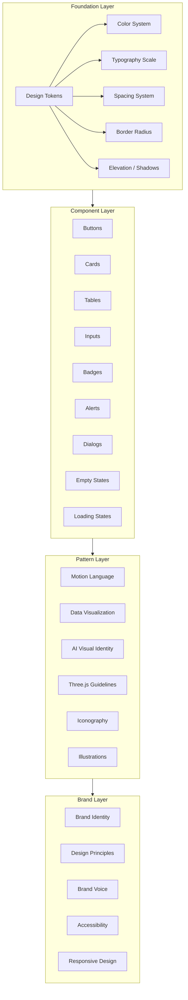
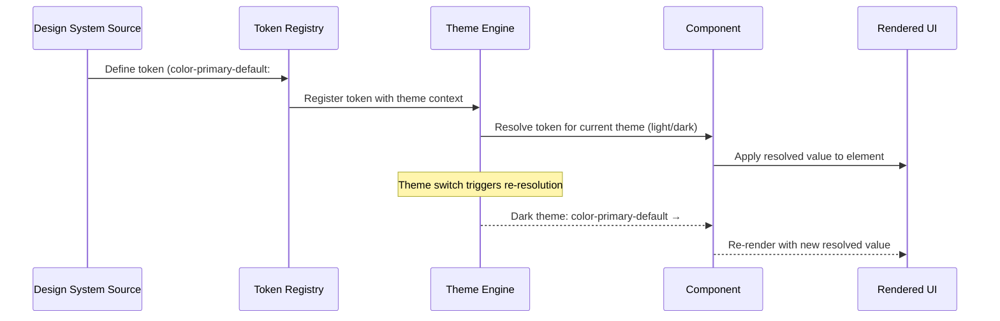
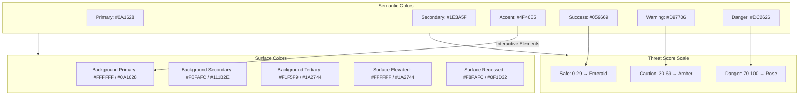
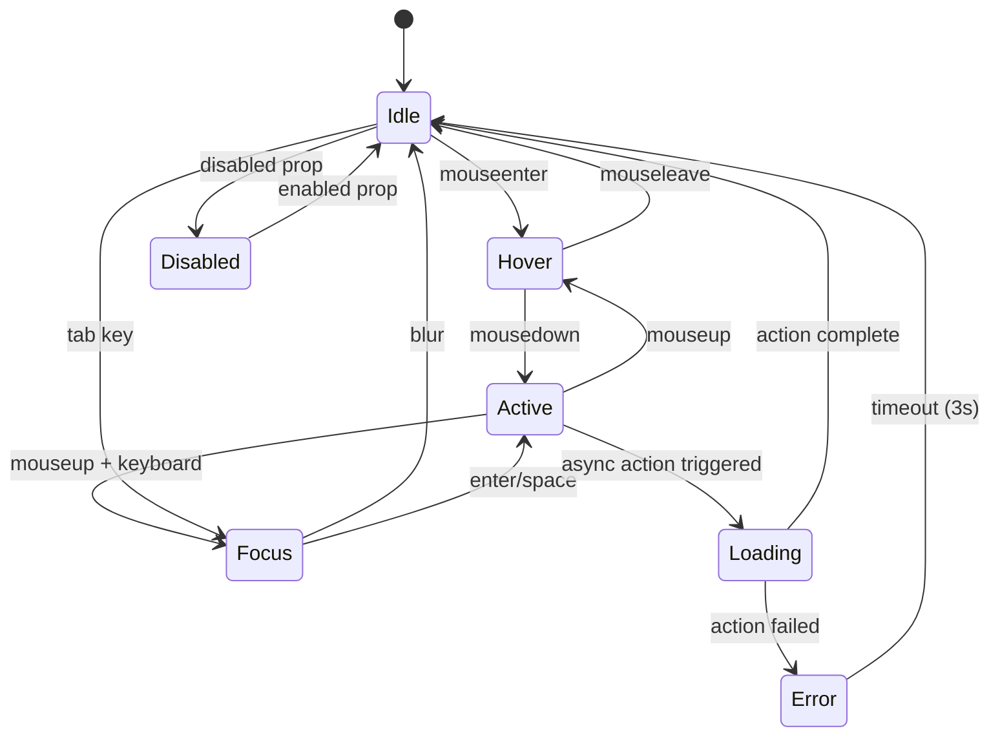
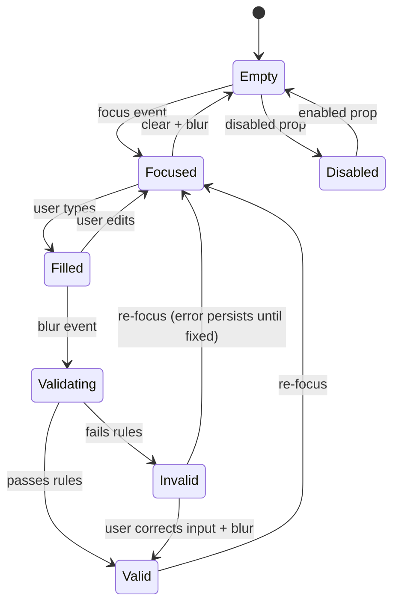
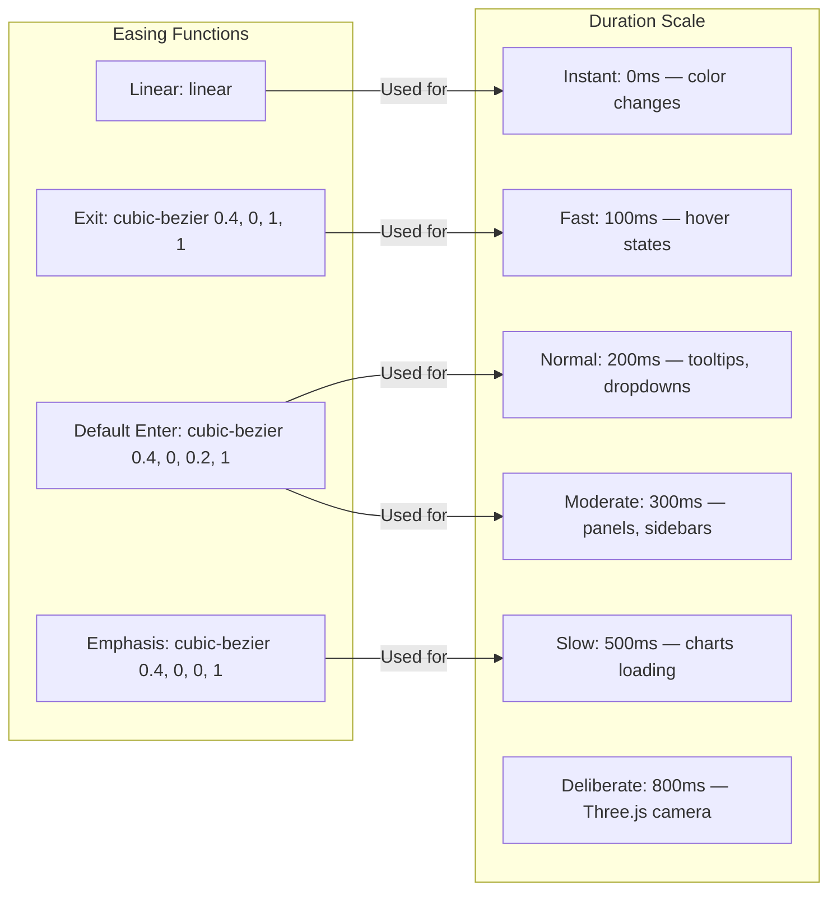
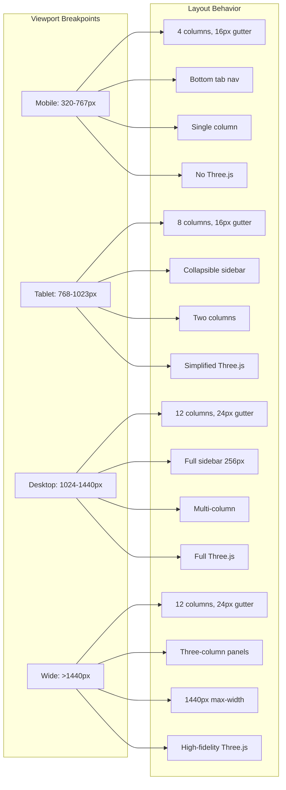
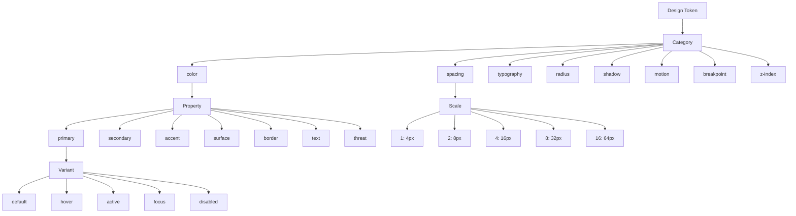

# Design Document: CyberShield AI — Design System & Visual Language

## Overview

CyberShield AI Design System is the single source of truth for all visual decisions across the AI-Powered Digital Public Safety Intelligence Platform. It governs color, typography, spacing, motion, component philosophy, accessibility standards, data visualization patterns, AI visual identity, and brand voice — ensuring every screen across all 8 portals and 69+ screens speaks with one consistent, trustworthy visual language.

This is not implementation code. This is the canonical reference that all designers and developers consult when making visual decisions. The system serves seven user roles — from citizens scanning suspicious messages to government officials reviewing national threat landscapes — and must convey trust, intelligence, and calm confidence at every interaction point.

The design philosophy rejects hacker aesthetics, neon cyberpunk, and Hollywood imagery. CyberShield AI looks like software that governments, banks, and enterprises trust — analytical elegance with clarity, inspired by the precision of Linear and the intelligence of Palantir.

## Architecture

### Design System Layer Architecture



### Token Flow — From Definition to Rendering



### Color System Hierarchy



### Component State Machine — Button States



### Input States



### Motion Timing Curves



### Responsive Breakpoint Architecture



### Token Naming Taxonomy



## Components and Interfaces

### Section 1: Brand Identity

**Mission Through Design**: Protect citizens from cybercrime. The visual language conveys protection, intelligence, and trust through considered use of deep navy authority tones, clean geometric typography, and a restrained color palette that signals government-grade reliability.

**Brand Personality**:
- Authoritative yet approachable
- Technical yet accessible
- Premium yet inclusive

**Visual Tone**: Clean, precise, confident. Analytical elegance with clarity — precision of Linear meets the intelligence of Palantir.

**Emotional Goals by Role**:
- Citizens feel protected and empowered
- Police feel equipped and efficient
- Government feels informed and in control
- Banks feel secure and integrated
- Organizations feel proactive and compliant

### Section 2: Design Principles

**Interface — 7 Core Principles**:

```pascal
STRUCTURE DesignPrinciple
  name: String
  definition: String
  application: String
END STRUCTURE

CONSTANT PRINCIPLES: Array[DesignPrinciple] = [
  {
    name: "Clarity Over Decoration",
    definition: "Every element serves a function. No decorative clutter.",
    application: "Remove any visual element that does not aid comprehension or action."
  },
  {
    name: "Trust Through Consistency",
    definition: "Predictable patterns build confidence. Same action = same behavior everywhere.",
    application: "Identical interactions produce identical visual feedback across all portals."
  },
  {
    name: "Intelligence Made Visible",
    definition: "Complex data becomes understandable through visual hierarchy and progressive disclosure.",
    application: "AI outputs are layered: summary first, detail on demand."
  },
  {
    name: "Calm Confidence",
    definition: "The UI never panics. Even danger states feel controlled and actionable.",
    application: "Danger colors are used with restraint. Alerts always include next-step actions."
  },
  {
    name: "Accessibility as Default",
    definition: "Not an afterthought. Every decision considers the widest possible user base.",
    application: "All color choices meet WCAG AA. All interactions are keyboard-navigable."
  },
  {
    name: "Progressive Complexity",
    definition: "Simple for citizens, powerful for investigators. Same system, different depths.",
    application: "Citizen portal shows summary; Cyber Cell portal shows full graph."
  },
  {
    name: "Motion with Purpose",
    definition: "Every animation communicates meaning. Nothing moves for decoration alone.",
    application: "Animations only appear where they reduce cognitive load or indicate state change."
  }
]
```

### Section 3: Color System

**Interface — Theme Definition**:

```pascal
STRUCTURE ColorTheme
  name: ENUM (Light, Dark)
  background: BackgroundColors
  surface: SurfaceColors
  border: BorderColors
  text: TextColors
  semantic: SemanticColors
  threat: ThreatColors
END STRUCTURE

STRUCTURE BackgroundColors
  primary: HexColor
  secondary: HexColor
  tertiary: HexColor
END STRUCTURE

STRUCTURE SurfaceColors
  elevated: HexColor
  recessed: HexColor
END STRUCTURE

STRUCTURE BorderColors
  default: HexColor
  hover: HexColor
  active: HexColor
END STRUCTURE

STRUCTURE TextColors
  primary: HexColor
  secondary: HexColor
  tertiary: HexColor
END STRUCTURE

STRUCTURE SemanticColors
  primary: HexColor
  secondary: HexColor
  accent: HexColor
  success: HexColor
  warning: HexColor
  danger: HexColor
END STRUCTURE

STRUCTURE ThreatColors
  safe_start: HexColor
  safe_end: HexColor
  caution_start: HexColor
  caution_end: HexColor
  danger_start: HexColor
  danger_end: HexColor
END STRUCTURE
```

**Light Theme Values**:

```pascal
CONSTANT LIGHT_THEME: ColorTheme = {
  name: Light,
  background: {
    primary: "#FFFFFF",
    secondary: "#F8FAFC",
    tertiary: "#F1F5F9"
  },
  surface: {
    elevated: "#FFFFFF",
    recessed: "#F8FAFC"
  },
  border: {
    default: "#E2E8F0",
    hover: "#CBD5E1",
    active: "#94A3B8"
  },
  text: {
    primary: "#0F172A",
    secondary: "#334155",
    tertiary: "#64748B"
  },
  semantic: {
    primary: "#0A1628",
    secondary: "#1E3A5F",
    accent: "#4F46E5",
    success: "#059669",
    warning: "#D97706",
    danger: "#DC2626"
  },
  threat: {
    safe_start: "#059669",
    safe_end: "#10B981",
    caution_start: "#D97706",
    caution_end: "#F59E0B",
    danger_start: "#DC2626",
    danger_end: "#EF4444"
  }
}
```

**Dark Theme Values**:

```pascal
CONSTANT DARK_THEME: ColorTheme = {
  name: Dark,
  background: {
    primary: "#0A1628",
    secondary: "#111B2E",
    tertiary: "#1A2744"
  },
  surface: {
    elevated: "#1A2744",
    recessed: "#0F1D32"
  },
  border: {
    default: "#1E3A5F",
    hover: "#2D4A6F",
    active: "#3D5A8F"
  },
  text: {
    primary: "#F8FAFC",
    secondary: "#CBD5E1",
    tertiary: "#94A3B8"
  },
  semantic: {
    primary: "#0A1628",
    secondary: "#1E3A5F",
    accent: "#4F46E5",
    success: "#059669",
    warning: "#D97706",
    danger: "#DC2626"
  },
  threat: {
    safe_start: "#059669",
    safe_end: "#10B981",
    caution_start: "#D97706",
    caution_end: "#F59E0B",
    danger_start: "#DC2626",
    danger_end: "#EF4444"
  }
}
```

**Glass Effect (Dark Theme Overlays)**:

```pascal
STRUCTURE GlassEffect
  background: "rgba(10, 22, 40, 0.8)"
  backdrop_filter: "blur(12px)"
  border: "1px solid rgba(255, 255, 255, 0.08)"
  allowed_contexts: Array[String] = [
    "overlay panels",
    "command palette",
    "notification center"
  ]
END STRUCTURE
```

### Section 4: Typography

**Interface — Type Scale**:

```pascal
STRUCTURE TypeStyle
  size: Pixels
  line_height: Pixels
  letter_spacing: Em
  weight: Integer
  font_family: String
  transform: ENUM (None, Uppercase)
END STRUCTURE

CONSTANT TYPE_SCALE: Map[String, TypeStyle] = {
  "display":    { size: 48, line_height: 56, letter_spacing: -0.02, weight: 700, font_family: "Inter Display", transform: None },
  "h1":         { size: 36, line_height: 44, letter_spacing: -0.02, weight: 700, font_family: "Inter", transform: None },
  "h2":         { size: 28, line_height: 36, letter_spacing: -0.01, weight: 600, font_family: "Inter", transform: None },
  "h3":         { size: 22, line_height: 30, letter_spacing: -0.01, weight: 600, font_family: "Inter", transform: None },
  "h4":         { size: 18, line_height: 26, letter_spacing: 0,     weight: 500, font_family: "Inter", transform: None },
  "h5":         { size: 16, line_height: 24, letter_spacing: 0,     weight: 500, font_family: "Inter", transform: None },
  "body-lg":    { size: 18, line_height: 28, letter_spacing: 0,     weight: 400, font_family: "Inter", transform: None },
  "body":       { size: 16, line_height: 24, letter_spacing: 0,     weight: 400, font_family: "Inter", transform: None },
  "body-sm":    { size: 14, line_height: 20, letter_spacing: 0,     weight: 400, font_family: "Inter", transform: None },
  "caption":    { size: 12, line_height: 16, letter_spacing: 0.01,  weight: 400, font_family: "Inter", transform: None },
  "overline":   { size: 11, line_height: 16, letter_spacing: 0.05,  weight: 500, font_family: "Inter", transform: Uppercase }
}

CONSTANT FONT_FAMILIES: Map[String, String] = {
  "heading": "Inter",
  "body": "Inter",
  "mono": "JetBrains Mono",
  "display": "Inter Display"
}
```

**Monospace Usage Rules**:
- Evidence IDs (e.g., `EVD-2024-001847`)
- Case reference numbers
- Transaction hashes
- IP addresses and technical identifiers
- Code-like data in investigation panels

### Section 5: Spacing System

**Interface — Spacing Scale (8px base unit)**:

```pascal
CONSTANT SPACING_SCALE: Map[Integer, Pixels] = {
  0:  0,
  1:  4,
  2:  8,
  3:  12,
  4:  16,
  5:  20,
  6:  24,
  8:  32,
  10: 40,
  12: 48,
  16: 64,
  20: 80,
  24: 96
}

STRUCTURE GridSystem
  columns: Map[String, Integer] = {
    "desktop": 12,
    "tablet": 8,
    "mobile": 4
  }
  gutter: Map[String, Pixels] = {
    "desktop": 24,
    "tablet": 16,
    "mobile": 16
  }
  container_max_width: Map[String, Pixels] = {
    "standard": 1280,
    "wide": 1440,
    "narrow": 960
  }
  sidebar_width: Map[String, Pixels] = {
    "expanded": 256,
    "collapsed": 64
  }
END STRUCTURE
```

### Section 6: Border Radius System

```pascal
CONSTANT RADIUS_SCALE: Map[String, Pixels] = {
  "none":    0,
  "sm":      4,
  "default": 6,
  "md":      8,
  "lg":      12,
  "xl":      16,
  "full":    9999
}

// Application mapping
CONSTANT RADIUS_USAGE: Map[String, String] = {
  "none":    "Tables, full-width elements",
  "sm":      "Badges, small pills",
  "default": "Buttons, inputs",
  "md":      "Cards, panels",
  "lg":      "Dialogs, popovers",
  "xl":      "Large cards, feature sections",
  "full":    "Avatar circles, pills"
}
```

### Section 7: Elevation (Shadow System)

```pascal
STRUCTURE Shadow
  offset_x: Pixels
  offset_y: Pixels
  blur: Pixels
  spread: Pixels
  color: RGBAColor
END STRUCTURE

CONSTANT ELEVATION_SCALE: Map[Integer, Array[Shadow]] = {
  0: [],
  1: [{ offset_x: 0, offset_y: 1, blur: 2, spread: 0, color: "rgba(0,0,0,0.05)" }],
  2: [
    { offset_x: 0, offset_y: 4, blur: 6, spread: -1, color: "rgba(0,0,0,0.07)" },
    { offset_x: 0, offset_y: 2, blur: 4, spread: -2, color: "rgba(0,0,0,0.05)" }
  ],
  3: [
    { offset_x: 0, offset_y: 10, blur: 15, spread: -3, color: "rgba(0,0,0,0.08)" },
    { offset_x: 0, offset_y: 4, blur: 6, spread: -4, color: "rgba(0,0,0,0.05)" }
  ],
  4: [
    { offset_x: 0, offset_y: 20, blur: 25, spread: -5, color: "rgba(0,0,0,0.1)" },
    { offset_x: 0, offset_y: 8, blur: 10, spread: -6, color: "rgba(0,0,0,0.05)" }
  ],
  5: [{ offset_x: 0, offset_y: 25, blur: 50, spread: -12, color: "rgba(0,0,0,0.15)" }]
}

// Application mapping
CONSTANT ELEVATION_USAGE: Map[Integer, String] = {
  0: "Flat elements, backgrounds",
  1: "Cards at rest, subtle lift",
  2: "Default cards, interactive surfaces",
  3: "Popovers, dropdowns, menus",
  4: "Dialogs, modals",
  5: "Elevated marketing elements"
}
```

### Section 8: Component Philosophy

**Button Interface**:

```pascal
STRUCTURE Button
  variant: ENUM (Primary, Secondary, Ghost, Danger)
  size: ENUM (SM, Default, LG)
  state: ENUM (Idle, Hover, Active, Focus, Loading, Disabled)
  icon: Optional[Icon]
  label: String
  is_icon_only: Boolean
END STRUCTURE

CONSTANT BUTTON_SIZES: Map[String, Pixels] = {
  "SM": 32,
  "Default": 40,
  "LG": 48
}

CONSTANT BUTTON_VARIANTS: Map[String, ButtonStyle] = {
  "Primary":   { fill: "#4F46E5", text: "#FFFFFF", border: "none", usage: "Main CTAs" },
  "Secondary": { fill: "transparent", text: "#1E3A5F", border: "#1E3A5F", usage: "Secondary actions" },
  "Ghost":     { fill: "transparent", text: "#334155", border: "none", usage: "Tertiary actions, toolbar" },
  "Danger":    { fill: "#DC2626", text: "#FFFFFF", border: "none", usage: "Destructive actions" }
}

// Loading state: spinner replaces text, button width locked to prevent layout shift
// Danger buttons: ALWAYS require confirmation dialog before executing
```

**Card Interface**:

```pascal
STRUCTURE Card
  variant: ENUM (Default, Interactive, Stat, Threat)
  padding: Pixels
  elevation: Integer
  radius: String
  border_accent: Optional[HexColor]
END STRUCTURE

CONSTANT CARD_VARIANTS: Map[String, CardStyle] = {
  "Default":     { padding: 24, elevation: 1, radius: "md", hover_elevation: NULL },
  "Interactive": { padding: 24, elevation: 1, radius: "md", hover_elevation: 2 },
  "Stat":        { padding: 16, elevation: 1, radius: "md", hover_elevation: NULL },
  "Threat":      { padding: 24, elevation: 1, radius: "md", hover_elevation: NULL }
}
// Threat cards: left border colored by threat level, score badge prominent
// Stat cards: icon + value + label layout, compact
```

**Table Interface**:

```pascal
STRUCTURE Table
  header_style: ENUM (Sticky, Static)
  row_style: ENUM (Plain, Alternating)
  cell_padding: { vertical: 12, horizontal: 16 }
  actions_alignment: "right"
  empty_state: EmptyState
END STRUCTURE

// Headers: sticky, uppercase overline text, muted background
// Actions: right-aligned icon buttons per row
// Empty state: full-width centered message with illustration + CTA
```

**Input Interface**:

```pascal
STRUCTURE Input
  size: Pixels = 40
  border_color: HexColor
  radius: String = "default"
  padding_horizontal: Pixels = 12
  state: ENUM (Empty, Focused, Filled, Valid, Invalid, Disabled)
  label_position: "above"
  label_style: { size: "body-sm", weight: 600 }
END STRUCTURE

CONSTANT INPUT_STATES: Map[String, InputVisual] = {
  "default":  { border: "#E2E8F0", glow: "none" },
  "focus":    { border: "#4F46E5", glow: "0 0 0 3px rgba(79,70,229,0.15)" },
  "error":    { border: "#DC2626", glow: "none", message_color: "#DC2626" },
  "disabled": { opacity: 0.5, interaction: "none" }
}
```

**Badge Interface**:

```pascal
STRUCTURE Badge
  variant: ENUM (Safe, Caution, Danger, Info)
  shape: "pill"
  height: Pixels = 24
  radius: "sm"
END STRUCTURE

CONSTANT BADGE_VARIANTS: Map[String, BadgeStyle] = {
  "Safe":    { background: "emerald-100", text: "emerald-800" },
  "Caution": { background: "amber-100", text: "amber-800" },
  "Danger":  { background: "rose-100", text: "rose-800" },
  "Info":    { background: "indigo-100", text: "indigo-800" }
}
```

**Alert Interface**:

```pascal
STRUCTURE Alert
  variant: ENUM (Info, Success, Warning, Error)
  layout: "full-width banner with left colored border"
  components: { icon: Icon, title: String, description: String, action: Optional[Button] }
  dismissible: Boolean = TRUE
  dismiss_animation: { type: "fade-out", duration: 300 }
END STRUCTURE

CONSTANT ALERT_VARIANTS: Map[String, AlertStyle] = {
  "Info":    { border_color: "#4F46E5", icon_color: "#4F46E5" },
  "Success": { border_color: "#059669", icon_color: "#059669" },
  "Warning": { border_color: "#D97706", icon_color: "#D97706" },
  "Error":   { border_color: "#DC2626", icon_color: "#DC2626" }
}
```

**Dialog Interface**:

```pascal
STRUCTURE Dialog
  size: ENUM (Standard, Form, Complex)
  overlay: { color: "rgba(0,0,0,0.5)", blur: "4px" }
  surface: { color: "#FFFFFF", radius: "lg", elevation: 4, padding: 32 }
  entry_animation: { scale: "95% → 100%", opacity: "0 → 1", duration: 200, easing: "ease-out" }
  exit_animation: { opacity: "1 → 0", duration: 150, easing: "ease-in" }
END STRUCTURE

CONSTANT DIALOG_SIZES: Map[String, Pixels] = {
  "Standard": 480,
  "Form": 640,
  "Complex": 800
}
```

**Empty State Interface**:

```pascal
STRUCTURE EmptyState
  layout: "centered within parent"
  illustration: { style: "subtle outlined", colors: "muted" }
  heading: { style: "h4", color: "text-primary" }
  description: { style: "body", color: "text-tertiary" }
  cta: Button  // Primary style
END STRUCTURE
// Rule: NEVER leave a list/table blank without an empty state
```

**Loading State Interface**:

```pascal
STRUCTURE LoadingState
  strategy: ENUM (Skeleton, Spinner, ProgressBar)
  skeleton: { animation: "pulse", color_light: "#E2E8F0", color_dark: "#334155" }
  spinner: { usage: "buttons and small inline only" }
  full_page: "skeleton of actual layout, progressive reveal"
END STRUCTURE
// Rule: NEVER show a blank white page during loading
// Preference: Skeleton screens over spinners (preserves content shape)
```

**Chart Interface**:

```pascal
STRUCTURE Chart
  color_palette: Array[HexColor] = ["#4F46E5", "#0D9488", "#D97706", "#DC2626", "#059669", "#7C3AED"]
  grid_lines: { light: "#E2E8F0", dark: "#334155" }
  labels: { style: "caption", color: "text-tertiary" }
  tooltip: { background: "dark", radius: "default", text: "body-sm" }
  animation: { enter: "from baseline", duration: 500, easing: "ease-out" }
END STRUCTURE
```

### Section 9: Motion Language

**Interface — Animation System**:

```pascal
STRUCTURE MotionToken
  duration: Milliseconds
  easing: CubicBezier
  usage: String
END STRUCTURE

CONSTANT DURATION_SCALE: Map[String, Milliseconds] = {
  "instant":    0,
  "fast":       100,
  "normal":     200,
  "moderate":   300,
  "slow":       500,
  "deliberate": 800
}

CONSTANT EASING_FUNCTIONS: Map[String, CubicBezier] = {
  "default": "cubic-bezier(0.4, 0, 0.2, 1)",
  "exit":    "cubic-bezier(0.4, 0, 1, 1)",
  "emphasis": "cubic-bezier(0.4, 0, 0, 1)",
  "linear":  "linear"
}
```

**Micro-Interactions Specification**:

```pascal
CONSTANT MICRO_INTERACTIONS: Map[String, Animation] = {
  "button-hover": {
    properties: ["background-color", "transform"],
    transform: "translateY(-1px)",
    background: "darken 8%",
    duration: 100,
    easing: "default"
  },
  "button-press": {
    properties: ["transform"],
    transform: "scale(0.98) translateY(0)",
    duration: 50,
    easing: "default"
  },
  "card-hover": {
    properties: ["box-shadow", "border-color"],
    elevation: 2,
    duration: 200,
    easing: "default"
  },
  "toggle-slide": {
    properties: ["transform", "background-color"],
    duration: 200,
    easing: "default"
  },
  "checkbox-check": {
    properties: ["transform"],
    keyframes: ["scale(1.0)", "scale(1.1)", "scale(1.0)"],
    duration: 200,
    easing: "emphasis"
  },
  "badge-count": {
    properties: ["transform"],
    transform: "scale pulse",
    duration: 200,
    easing: "emphasis"
  }
}
```

**Page Transitions Specification**:

```pascal
CONSTANT PAGE_TRANSITIONS: Map[String, Transition] = {
  "route-change": {
    exit: { property: "opacity", from: 1, to: 0, duration: 150 },
    enter: { property: "opacity + translateY", from: "0, 8px", to: "1, 0", duration: 200 }
  },
  "sidebar-nav": {
    animation: "none (instant)"
  },
  "tab-switch": {
    type: "cross-fade",
    duration: 200
  },
  "modal-open": {
    backdrop: { property: "opacity", from: 0, to: 1, duration: 200 },
    dialog: { property: "scale + opacity", from: "0.95, 0", to: "1, 1", duration: 200 }
  },
  "modal-close": {
    dialog: { property: "opacity", from: 1, to: 0, duration: 150 },
    backdrop: { property: "opacity", from: 1, to: 0, duration: 200 }
  }
}
```

**Success/Error Feedback Animations**:

```pascal
CONSTANT FEEDBACK_ANIMATIONS: Map[String, Animation] = {
  "success-checkmark": {
    type: "stroke-dashoffset draw-in",
    duration: 400,
    easing: "default"
  },
  "error-shake": {
    type: "translateX oscillation",
    keyframes: ["0px", "-4px", "4px", "-4px", "4px", "0px"],
    duration: 300,
    easing: "default"
  },
  "score-reveal": {
    type: "number count-up from 0",
    duration: 800,
    easing: "ease-out"
  }
}
```

**Reduced Motion Policy**:

```pascal
PROCEDURE applyReducedMotion()
  INPUT: user_preference (prefers-reduced-motion: reduce)
  OUTPUT: modified animation set

  SEQUENCE
    DISABLE: parallax effects
    DISABLE: Three.js continuous animations (show static frame)
    DISABLE: entrance animations
    DISABLE: number counting animations
    KEEP: instant transitions (opacity toggles)
    KEEP: essential state indicators (focus rings)
    KEEP: progress bars (functional, not decorative)
  END SEQUENCE
END PROCEDURE
```

### Section 10: Three.js Guidelines

**Interface — Three.js Usage Policy**:

```pascal
STRUCTURE ThreeJsPolicy
  allowed_contexts: Array[String]
  forbidden_contexts: Array[String]
  performance_budget: PerformanceBudget
  accessibility: ThreeJsAccessibility
  fallback: FallbackStrategy
END STRUCTURE

CONSTANT THREEJS_ALLOWED: Array[String] = [
  "Landing page hero: animated 3D shield/globe visualization",
  "Intelligence Graph: 3D network visualization for Cyber Cell (10K+ nodes)",
  "National Threat Map: 3D globe with geographic data overlay (Government portal)",
  "Dashboard accent: subtle 3D background on login/onboarding ONLY"
]

CONSTANT THREEJS_FORBIDDEN: Array[String] = [
  "Data entry forms",
  "Table/list views",
  "Settings pages",
  "Mobile-primary screens",
  "Any screen where data readability is primary goal",
  "Evidence viewing",
  "Report writing flows",
  "Any screen loaded on 3G connections"
]

STRUCTURE PerformanceBudget
  max_frame_time: Milliseconds = 16   // 60fps minimum
  max_triangles: Integer = 100000
  max_gpu_memory: Megabytes = 50
  bundle_loading: "lazy-load, never in critical path"
  pixel_ratio_cap: Float = 2.0        // Not 3 for Retina
  fallback_threshold: { fps: 30, duration: "2 seconds" }
END STRUCTURE

STRUCTURE ThreeJsAccessibility
  rule_1: "Visuals are ALWAYS supplementary, never sole information source"
  rule_2: "Provide 2D alternative for every 3D visualization"
  rule_3: "ARIA labels on canvas elements describing the visualization"
  rule_4: "Keyboard controls for camera (arrow keys for orbit)"
  rule_5: "prefers-reduced-motion: pause all continuous animations, show static frame"
END STRUCTURE

STRUCTURE FallbackStrategy
  trigger: "GPU unavailable OR frame rate < 30fps for 2 seconds"
  action: "Automatic fallback to 2D visualization"
  implementation: "Canvas replaced with SVG/HTML equivalent"
END STRUCTURE
```

### Section 11: Iconography

**Interface — Icon System**:

```pascal
STRUCTURE IconSystem
  style: "outlined"
  stroke_weight: Float = 1.5
  caps: "rounded"
  joins: "rounded"
  library: "Lucide Icons"
  sizes: Map[String, Pixels] = {
    "inline": 16,
    "default": 20,
    "emphasized": 24,
    "feature": 32
  }
  color: "inherits text color (default). Semantic color only for status icons."
END STRUCTURE

CONSTANT ICON_RULES: Array[String] = [
  "Every navigation item has an icon",
  "Every empty state has an illustration (not just an icon)",
  "Icons always have text labels (no icon-only buttons except toolbars with tooltips)",
  "Status icons use semantic colors (emerald check, amber warning, rose error)",
  "Never use icons decoratively without semantic meaning"
]
```

### Section 12: Data Visualization

**Interface — Visualization System**:

```pascal
STRUCTURE DataVisualization
  charts: ChartConfig
  maps: MapConfig
  network_graph: NetworkGraphConfig
  heatmaps: HeatmapConfig
END STRUCTURE

STRUCTURE ChartConfig
  style: "clean, minimal, no 3D effects on 2D charts"
  grid: "subtle dotted or solid lines, muted color"
  axes: "clean labels, no excessive tick marks"
  max_series_colors: Integer = 6
  series_palette: Array[HexColor] = ["#4F46E5", "#0D9488", "#D97706", "#DC2626", "#059669", "#7C3AED"]
  responsive: "resize gracefully, simplify labels on mobile"
END STRUCTURE

STRUCTURE MapConfig
  base_style: "minimalist, low-contrast"
  data_overlay_volume: "graduated circles"
  data_overlay_severity: "color intensity"
  india_specifics: {
    state_boundaries: "clearly defined",
    district_drilldown: "supported"
  }
  interaction: "click/hover to reveal data, tooltip with details"
END STRUCTURE

STRUCTURE NetworkGraphConfig
  node_types: Map[String, String] = {
    "person": "circle",
    "account": "diamond",
    "phone": "square",
    "ip_address": "hexagon"
  }
  edge_types: Map[String, String] = {
    "confirmed": "solid line",
    "suspected": "dashed line"
  }
  edge_weight: "line weight proportional to connection strength"
  cluster_highlight: "subtle background shade around detected clusters"
  node_color: "colored by risk level (safe → danger gradient)"
  interaction: {
    single_click: "expand node connections",
    double_click: "deep dive into node details",
    drag: "rearrange layout"
  }
  performance: "LOD rendering — overview shows clusters, zoom reveals individual nodes"
END STRUCTURE

STRUCTURE HeatmapConfig
  scale: "sequential single-hue gradient (light → saturated)"
  color_range: "white → light blue → indigo → deep navy"
  accessibility: "NOT red-green (inaccessible)"
  cell_borders: "subtle to prevent blur-together effect"
  labels: "always present, never rely on color alone"
END STRUCTURE
```

### Section 13: Accessibility

**Interface — Accessibility Standards**:

```pascal
STRUCTURE AccessibilityStandards
  contrast: ContrastRequirements
  keyboard: KeyboardNavigation
  focus: FocusStates
  screen_reader: ScreenReaderSupport
  reduced_motion: ReducedMotionPolicy
END STRUCTURE

STRUCTURE ContrastRequirements
  normal_text: { min_ratio: 4.5, condition: "< 18px" }
  large_text: { min_ratio: 3.0, condition: ">= 18px bold OR >= 24px" }
  interactive: { min_ratio: 3.0, condition: "against adjacent colors" }
  focus_indicator: { min_ratio: 3.0, condition: "against background" }
END STRUCTURE

STRUCTURE KeyboardNavigation
  tab_order: "matches visual order (left-to-right, top-to-bottom)"
  focus_visible: "2px solid accent ring + 2px offset"
  skip_link: "present on every page"
  escape: "closes modals/popovers"
  arrow_keys: "menu/list navigation"
  enter_space: "activation"
END STRUCTURE

STRUCTURE FocusStates
  default: { width: "2px", style: "solid", color: "#4F46E5", offset: "2px", radius: "match element" }
  high_contrast: { width: "3px", style: "solid", color: "currentColor" }
  rule: "NEVER remove focus outline — only restyle it"
END STRUCTURE

STRUCTURE ScreenReaderSupport
  images: "meaningful alt text or aria-hidden"
  threat_scores: "announced as 'Threat level: X out of 100, [Category]'"
  dynamic_content: {
    non_critical: "aria-live='polite'",
    alerts: "aria-live='assertive'"
  }
  form_errors: "linked to inputs via aria-describedby"
  visualizations: "aria-label summaries + linked data tables"
END STRUCTURE
```

### Section 14: Responsive Design Philosophy

**Interface — Responsive Breakpoints**:

```pascal
STRUCTURE ResponsiveConfig
  breakpoints: Map[String, PixelRange]
  layout_rules: Map[String, LayoutBehavior]
END STRUCTURE

CONSTANT BREAKPOINTS: Map[String, PixelRange] = {
  "mobile":  { min: 320, max: 767 },
  "tablet":  { min: 768, max: 1023 },
  "desktop": { min: 1024, max: 1440 },
  "wide":    { min: 1441, max: Infinity }
}

CONSTANT LAYOUT_RULES: Map[String, LayoutBehavior] = {
  "mobile": {
    navigation: "bottom tab (5 items max)",
    layout: "single-column",
    tables: "card stacks",
    threejs: "disabled (2D alternatives only)",
    touch_target: "minimum 48px",
    content_priority: "action-first (scan button prominent)",
    data_density: "reduced, progressive disclosure"
  },
  "tablet": {
    navigation: "collapsible sidebar (hamburger toggle)",
    layout: "two-column where appropriate",
    tables: "horizontal scroll or card-based view",
    threejs: "simplified scenes or 2D fallback",
    touch_target: "minimum 44px"
  },
  "desktop": {
    navigation: "full sidebar (256px)",
    layout: "multi-column",
    tables: "full data tables with all columns",
    threejs: "active",
    hover_states: "available"
  },
  "wide": {
    navigation: "sidebar + content + optional detail panel",
    layout: "three-column for investigations",
    content_max_width: "1440px centered",
    threejs: "higher fidelity scenes"
  }
}
```

### Section 15: AI Visual Identity

**Interface — AI Presentation System**:

```pascal
STRUCTURE AIExplanationCard
  container: { border_left: "3px solid #4F46E5", radius: "md", padding: 24 }
  label: { text: "AI Analysis", style: Badge, variant: "Info" }
  content_format: "bulleted points (never paragraphs)"
  confidence_bar: { height: 4, radius: "full", position: "below content" }
  attribution: { text: "Powered by CyberShield AI", style: "caption", color: "text-tertiary" }
  rule: "Never present AI output as absolute truth — always include confidence context"
END STRUCTURE

STRUCTURE ThreatScoreCard
  shape: "rounded card"
  score_display: { size: 48, color: "matches threat gradient" }
  label: { position: "below score", transform: "uppercase", values: ["SAFE", "CAUTION", "DANGER"] }
  ring: "circular progress ring around score number"
  breakdown: "expandable section showing factor contributions (bar chart)"
  explanation: "plain-language summary below score"
END STRUCTURE

STRUCTURE ConfidenceIndicator
  high: { range: "80-100%", opacity: 1.0, style: "solid", label: NULL }
  medium: { range: "60-79%", opacity: 0.85, style: "solid", label: "advisory" }
  low: { range: "0-59%", opacity: 0.7, style: "dashed outline", label: "Low Confidence warning badge" }
  visual: "thin horizontal bar, fill percentage matches confidence"
END STRUCTURE

CONSTANT THREAT_LEVEL_HIERARCHY: Map[String, ThreatVisual] = {
  "safe": {
    range: "0-29",
    accent: "#059669",
    icon: "shield-check",
    tone: "calm presentation"
  },
  "caution": {
    range: "30-69",
    accent: "#D97706",
    icon: "alert-triangle",
    tone: "informational"
  },
  "danger": {
    range: "70-100",
    accent: "#DC2626",
    icon: "shield-alert",
    tone: "prominent but controlled"
  }
}
```

**Explainable AI Presentation**:

```pascal
STRUCTURE ExplainableAI
  trigger: "'Why this score?' expandable section"
  content: "list of detected indicators with individual confidence"
  indicator_format: { icon: Icon, label: String, confidence_bar: ConfidenceBar }
  rules: [
    "Never show raw model output — always human-readable language",
    "Language matches user's selected language (15 languages)"
  ]
END STRUCTURE
```

### Section 16: Illustration Style

**Interface — Illustration Guidelines**:

```pascal
STRUCTURE IllustrationSystem
  style: "semi-abstract geometric shapes with subtle gradients"
  palette: "muted versions of brand palette (desaturated indigo, slate, accent touches)"
  lines: { weight: "2px", style: "clean, consistent stroke", joins: "rounded" }
  tone: "professional, calm, inclusive"
  diversity: "show diverse people in Indian context (if people depicted)"
  usage: ["empty states", "onboarding", "error pages", "feature explanations"]
END STRUCTURE

CONSTANT ILLUSTRATION_AVOID: Array[String] = [
  "Robots",
  "Skulls",
  "Locks/chains (prison metaphor)",
  "Hollywood hacker imagery",
  "Binary rain / Matrix effects",
  "Hooded figures",
  "Neon cyberpunk aesthetics",
  "Green terminal UI"
]
```

### Section 17: Brand Voice

**Interface — Voice & Tone System**:

```pascal
STRUCTURE BrandVoice
  tone: Array[String] = [
    "Confident but never arrogant",
    "Technical but accessible to non-technical citizens",
    "Urgent when needed but never panic-inducing",
    "Warm and protective (like a trusted advisor)"
  ]
  writing_principles: Array[WritingPrinciple]
  button_text_rules: ButtonTextRules
  empty_state_rules: EmptyStateVoice
  error_message_rules: ErrorMessageVoice
END STRUCTURE

CONSTANT WRITING_PRINCIPLES: Array[WritingPrinciple] = [
  { rule: "Lead with clarity", example: "say what happened, then explain" },
  { rule: "Use plain language", good: "This message is likely a scam", bad: "Threat vector identified" },
  { rule: "Be specific", good: "3 fraud indicators found", bad: "Some issues detected" },
  { rule: "Offer next steps", example: "every message tells the user what to do" },
  { rule: "Respect intelligence", example: "don't over-explain to technical users, don't under-explain to citizens" }
]

STRUCTURE ButtonTextRules
  primary_actions: "verb-first (Scan Now, Report Fraud, View Details)"
  confirmations: "clear outcome (Submit Report, Confirm Flag, Close Case)"
  cancellations: "'Cancel' (never 'No' or 'Dismiss')"
  destructive: "'Delete [thing]' (never just 'Delete')"
END STRUCTURE

STRUCTURE EmptyStateVoice
  tone: "helpful, never blaming"
  good: "No scans yet"
  bad: "You haven't scanned anything"
  structure: "description + what belongs here + how to get started"
  cta: "clear action button to populate the empty state"
END STRUCTURE

STRUCTURE ErrorMessageVoice
  structure: "what went wrong + why (brief) + what to do next"
  tone: "calm and helpful"
  good: "We couldn't submit your report. Check your connection and try again."
  never: ["Error 500", "Something went wrong", "technical jargon"]
  always: "provide retry action or alternative path"
END STRUCTURE
```

### Section 18: Design Tokens (Naming Convention)

**Interface — Token Taxonomy**:

```pascal
STRUCTURE TokenNamingConvention
  format: "{category}-{property}-{variant}-{state}"
  categories: Array[String] = ["color", "spacing", "typography", "radius", "shadow", "motion", "breakpoint"]
  properties: Array[String] = ["primary", "secondary", "accent", "neutral", "surface", "border", "text"]
  variants: Array[String] = ["sm", "md", "lg", "xl", "2xl"]
  states: Array[String] = ["default", "hover", "active", "focus", "disabled"]
END STRUCTURE

CONSTANT Z_INDEX_SCALE: Map[String, Integer] = {
  "base":       0,
  "sticky":     100,
  "dropdown":   200,
  "overlay":    300,
  "modal":      400,
  "toast":      500,
  "threejs":    -1
}

CONSTANT TOKEN_REGISTRY: Map[String, TokenDefinition] = {
  // Color tokens
  "color-primary-default":    { value_light: "#0A1628", value_dark: "#F8FAFC" },
  "color-primary-hover":      { value_light: "#1E3A5F", value_dark: "#E2E8F0" },
  "color-accent-default":     { value_light: "#4F46E5", value_dark: "#4F46E5" },
  "color-danger-default":     { value_light: "#DC2626", value_dark: "#DC2626" },
  "color-surface-primary":    { value_light: "#FFFFFF", value_dark: "#0A1628" },
  "color-surface-secondary":  { value_light: "#F8FAFC", value_dark: "#111B2E" },
  "color-text-primary":       { value_light: "#0F172A", value_dark: "#F8FAFC" },
  "color-text-secondary":     { value_light: "#334155", value_dark: "#CBD5E1" },
  "color-text-muted":         { value_light: "#64748B", value_dark: "#94A3B8" },
  "color-border-default":     { value_light: "#E2E8F0", value_dark: "#1E3A5F" },
  "color-border-hover":       { value_light: "#CBD5E1", value_dark: "#2D4A6F" },
  "color-threat-safe":        { value: "#059669" },
  "color-threat-caution":     { value: "#D97706" },
  "color-threat-danger":      { value: "#DC2626" },

  // Spacing tokens
  "spacing-1": { value: "4px" },
  "spacing-2": { value: "8px" },
  "spacing-4": { value: "16px" },
  "spacing-6": { value: "24px" },
  "spacing-8": { value: "32px" },
  "spacing-12": { value: "48px" },
  "spacing-16": { value: "64px" },
  "spacing-24": { value: "96px" },

  // Radius tokens
  "radius-sm": { value: "4px" },
  "radius-default": { value: "6px" },
  "radius-md": { value: "8px" },
  "radius-lg": { value: "12px" },
  "radius-xl": { value: "16px" },
  "radius-full": { value: "9999px" },

  // Shadow tokens
  "shadow-1": { value: "0 1px 2px rgba(0,0,0,0.05)" },
  "shadow-2": { value: "0 4px 6px -1px rgba(0,0,0,0.07), 0 2px 4px -2px rgba(0,0,0,0.05)" },
  "shadow-3": { value: "0 10px 15px -3px rgba(0,0,0,0.08), 0 4px 6px -4px rgba(0,0,0,0.05)" },
  "shadow-4": { value: "0 20px 25px -5px rgba(0,0,0,0.1), 0 8px 10px -6px rgba(0,0,0,0.05)" },
  "shadow-5": { value: "0 25px 50px -12px rgba(0,0,0,0.15)" },
  "shadow-glass": { value: "inset 0 0 0 1px rgba(255,255,255,0.08)" },

  // Typography tokens
  "font-family-heading": { value: "Inter" },
  "font-family-body": { value: "Inter" },
  "font-family-mono": { value: "JetBrains Mono" },
  "font-size-display": { value: "48px" },
  "font-size-h1": { value: "36px" },
  "font-size-h2": { value: "28px" },
  "font-size-h3": { value: "22px" },
  "font-size-body": { value: "16px" },
  "font-size-caption": { value: "12px" },
  "font-weight-regular": { value: 400 },
  "font-weight-medium": { value: 500 },
  "font-weight-semibold": { value: 600 },
  "font-weight-bold": { value: 700 },
  "line-height-tight": { value: "1.25" },
  "line-height-normal": { value: "1.5" },
  "line-height-relaxed": { value: "1.75" },

  // Motion tokens
  "motion-duration-fast": { value: "100ms" },
  "motion-duration-normal": { value: "200ms" },
  "motion-duration-moderate": { value: "300ms" },
  "motion-duration-slow": { value: "500ms" },
  "motion-easing-default": { value: "cubic-bezier(0.4, 0, 0.2, 1)" },
  "motion-easing-exit": { value: "cubic-bezier(0.4, 0, 1, 1)" },
  "motion-easing-emphasis": { value: "cubic-bezier(0.4, 0, 0, 1)" },

  // Breakpoint tokens
  "breakpoint-mobile": { value: "320px" },
  "breakpoint-tablet": { value: "768px" },
  "breakpoint-desktop": { value: "1024px" },
  "breakpoint-wide": { value: "1441px" },

  // Z-index tokens
  "z-index-base": { value: 0 },
  "z-index-sticky": { value: 100 },
  "z-index-dropdown": { value: 200 },
  "z-index-overlay": { value: 300 },
  "z-index-modal": { value: 400 },
  "z-index-toast": { value: 500 }
}
```

## Data Models

### Theme Configuration Model

```pascal
STRUCTURE ThemeConfiguration
  active_theme: ENUM (Light, Dark, System)
  color_tokens: Map[String, HexColor]
  custom_overrides: Optional[Map[String, String]]
  high_contrast_mode: Boolean
END STRUCTURE
```

### Threat Score Visual Model

```pascal
STRUCTURE ThreatScoreVisual
  score: Integer  // 0-100
  category: ENUM (Safe, Caution, Danger)
  confidence: Float  // 0.0-1.0
  gradient: { start: HexColor, end: HexColor }
  icon: String
  label: String
  explanation: String
  factors: Array[{ name: String, weight: Float, confidence: Float }]
END STRUCTURE
```

### Component State Model

```pascal
STRUCTURE ComponentState
  variant: String
  size: String
  state: String
  theme: ENUM (Light, Dark)
  reduced_motion: Boolean
  high_contrast: Boolean
  resolved_tokens: Map[String, String]
END STRUCTURE
```

## Algorithmic Pseudocode

### Threat Score Color Resolution Algorithm

```pascal
ALGORITHM resolveThreatColor(score, confidence)
INPUT: score (Integer 0-100), confidence (Float 0.0-1.0)
OUTPUT: resolved_color (HexColor with opacity)

BEGIN
  ASSERT score >= 0 AND score <= 100
  ASSERT confidence >= 0.0 AND confidence <= 1.0

  // Step 1: Determine threat category
  IF score >= 0 AND score <= 29 THEN
    gradient_start ← "#059669"
    gradient_end ← "#10B981"
    category ← "Safe"
  ELSE IF score >= 30 AND score <= 69 THEN
    gradient_start ← "#D97706"
    gradient_end ← "#F59E0B"
    category ← "Caution"
  ELSE
    gradient_start ← "#DC2626"
    gradient_end ← "#EF4444"
    category ← "Danger"
  END IF

  // Step 2: Interpolate within gradient based on position in range
  IF category = "Safe" THEN
    position ← score / 29.0
  ELSE IF category = "Caution" THEN
    position ← (score - 30) / 39.0
  ELSE
    position ← (score - 70) / 30.0
  END IF

  base_color ← interpolateColor(gradient_start, gradient_end, position)

  // Step 3: Apply confidence as opacity modifier
  // 100% confidence = full opacity, 60% confidence = 60% opacity
  opacity ← MAX(0.6, confidence)
  resolved_color ← applyOpacity(base_color, opacity)

  ASSERT resolved_color IS valid HexColor with opacity
  RETURN resolved_color
END
```

**Preconditions:**
- score is an integer in range [0, 100]
- confidence is a float in range [0.0, 1.0]

**Postconditions:**
- Returns a valid color with appropriate opacity
- Color falls within the correct gradient for the score range
- Opacity never falls below 0.6 (minimum visibility threshold)

**Loop Invariants:** N/A (no loops)

---

### Token Resolution Algorithm

```pascal
ALGORITHM resolveToken(token_name, theme, high_contrast)
INPUT: token_name (String), theme (Light | Dark), high_contrast (Boolean)
OUTPUT: resolved_value (String)

BEGIN
  ASSERT token_name matches pattern "{category}-{property}-{variant}"
  ASSERT theme IN {Light, Dark}

  // Step 1: Look up token in registry
  token_def ← TOKEN_REGISTRY[token_name]

  IF token_def IS NULL THEN
    RETURN ERROR("Unknown token: " + token_name)
  END IF

  // Step 2: Resolve theme-specific value
  IF token_def HAS value_light AND token_def HAS value_dark THEN
    IF theme = Light THEN
      resolved ← token_def.value_light
    ELSE
      resolved ← token_def.value_dark
    END IF
  ELSE
    resolved ← token_def.value
  END IF

  // Step 3: Apply high-contrast overrides if active
  IF high_contrast = TRUE THEN
    hc_override ← HIGH_CONTRAST_MAP[token_name]
    IF hc_override IS NOT NULL THEN
      resolved ← hc_override
    END IF
  END IF

  ASSERT resolved IS NOT NULL AND resolved IS NOT empty
  RETURN resolved
END
```

**Preconditions:**
- token_name follows the naming convention `{category}-{property}-{variant}`
- theme is a valid enum value (Light or Dark)
- TOKEN_REGISTRY is initialized and populated

**Postconditions:**
- Returns a non-null, non-empty resolved value
- Value is appropriate for the specified theme
- High-contrast overrides are applied when high_contrast is true

**Loop Invariants:** N/A (no loops)

---

### Responsive Layout Resolution Algorithm

```pascal
ALGORITHM resolveLayout(viewport_width)
INPUT: viewport_width (Pixels)
OUTPUT: layout_config (LayoutBehavior)

BEGIN
  ASSERT viewport_width > 0

  // Step 1: Determine breakpoint
  IF viewport_width < 768 THEN
    breakpoint ← "mobile"
  ELSE IF viewport_width < 1024 THEN
    breakpoint ← "tablet"
  ELSE IF viewport_width <= 1440 THEN
    breakpoint ← "desktop"
  ELSE
    breakpoint ← "wide"
  END IF

  // Step 2: Resolve layout rules for breakpoint
  layout_config ← LAYOUT_RULES[breakpoint]

  // Step 3: Apply Three.js policy
  IF breakpoint = "mobile" THEN
    layout_config.threejs_enabled ← FALSE
    layout_config.threejs_fallback ← "2D_ONLY"
  ELSE IF breakpoint = "tablet" THEN
    layout_config.threejs_enabled ← TRUE
    layout_config.threejs_mode ← "SIMPLIFIED"
  ELSE
    layout_config.threejs_enabled ← TRUE
    layout_config.threejs_mode ← "FULL"
  END IF

  // Step 4: Calculate grid
  layout_config.columns ← GRID_SYSTEM.columns[breakpoint]
  layout_config.gutter ← GRID_SYSTEM.gutter[breakpoint]

  ASSERT layout_config.columns > 0
  ASSERT layout_config.gutter > 0
  RETURN layout_config
END
```

**Preconditions:**
- viewport_width is a positive integer representing device width in pixels
- LAYOUT_RULES and GRID_SYSTEM are initialized

**Postconditions:**
- Returns a complete layout configuration for the viewport
- Three.js is disabled on mobile, simplified on tablet, full on desktop+
- Grid columns and gutters are appropriate for the breakpoint

**Loop Invariants:** N/A (no loops)

---

### Animation Resolution Algorithm

```pascal
ALGORITHM resolveAnimation(animation_name, reduced_motion)
INPUT: animation_name (String), reduced_motion (Boolean)
OUTPUT: animation_config (Animation | NULL)

BEGIN
  ASSERT animation_name IS NOT empty

  // Step 1: Check if animation exists
  animation ← MICRO_INTERACTIONS[animation_name]
  IF animation IS NULL THEN
    animation ← PAGE_TRANSITIONS[animation_name]
  END IF
  IF animation IS NULL THEN
    animation ← FEEDBACK_ANIMATIONS[animation_name]
  END IF

  IF animation IS NULL THEN
    RETURN ERROR("Unknown animation: " + animation_name)
  END IF

  // Step 2: Apply reduced motion preference
  IF reduced_motion = TRUE THEN
    IF animation.type IN ["parallax", "continuous", "entrance", "count-up"] THEN
      RETURN NULL  // Disable entirely
    ELSE IF animation.type IN ["state-change", "opacity-toggle"] THEN
      // Keep but make instant
      animation.duration ← 0
      RETURN animation
    END IF
  END IF

  // Step 3: Resolve easing function
  IF animation.easing IS a key in EASING_FUNCTIONS THEN
    animation.resolved_easing ← EASING_FUNCTIONS[animation.easing]
  END IF

  RETURN animation
END
```

**Preconditions:**
- animation_name is a non-empty string
- reduced_motion is a boolean reflecting user preference

**Postconditions:**
- Returns NULL for decorative animations when reduced motion is active
- Essential state indicators remain functional (instant) under reduced motion
- Easing functions are fully resolved to cubic-bezier values

**Loop Invariants:** N/A (no loops)

---

### Three.js Performance Monitor Algorithm

```pascal
ALGORITHM monitorThreeJsPerformance(scene)
INPUT: scene (ThreeJsScene)
OUTPUT: action (ENUM: Continue, Degrade, Fallback)

BEGIN
  ASSERT scene IS active

  // Step 1: Measure current frame time
  frame_times ← collectFrameTimes(last_60_frames)
  avg_frame_time ← AVERAGE(frame_times)
  current_fps ← 1000 / avg_frame_time

  // Step 2: Check against performance budget
  IF current_fps >= 60 THEN
    RETURN Continue
  ELSE IF current_fps >= 30 THEN
    // Degrade quality to maintain performance
    scene.pixel_ratio ← MIN(scene.pixel_ratio, 1.5)
    scene.shadow_quality ← "LOW"
    scene.particle_count ← scene.particle_count * 0.5
    RETURN Degrade
  ELSE
    // FPS below 30 — check duration
    low_fps_duration ← timeSinceFpsDroppedBelow(30)
    IF low_fps_duration >= 2000 THEN  // 2 seconds
      // Trigger fallback to 2D
      destroyScene(scene)
      activateFallback2D(scene.fallback_component)
      RETURN Fallback
    ELSE
      // Give it more time to recover
      scene.pixel_ratio ← 1.0
      scene.lod_level ← "MINIMUM"
      RETURN Degrade
    END IF
  END IF
END
```

**Preconditions:**
- scene is an active Three.js scene currently rendering
- Performance monitoring is initialized with frame time history

**Postconditions:**
- Scene maintains >= 30fps or falls back to 2D
- Quality degradation is progressive (pixel ratio → shadows → particles → LOD)
- Fallback only triggers after sustained poor performance (2 seconds)

**Loop Invariants:**
- Frame time history always contains at most 60 entries
- pixel_ratio never falls below 1.0
- Fallback is irreversible within a session (no re-upgrade to 3D)

---

### Contrast Validation Algorithm

```pascal
ALGORITHM validateContrast(foreground, background, text_size, is_bold)
INPUT: foreground (HexColor), background (HexColor), text_size (Pixels), is_bold (Boolean)
OUTPUT: { passes: Boolean, ratio: Float, required: Float }

BEGIN
  ASSERT foreground IS valid hex color
  ASSERT background IS valid hex color
  ASSERT text_size > 0

  // Step 1: Calculate relative luminance
  lum_fg ← relativeLuminance(foreground)
  lum_bg ← relativeLuminance(background)

  // Step 2: Calculate contrast ratio
  lighter ← MAX(lum_fg, lum_bg)
  darker ← MIN(lum_fg, lum_bg)
  ratio ← (lighter + 0.05) / (darker + 0.05)

  // Step 3: Determine required ratio based on WCAG AA
  IF (text_size >= 24) OR (text_size >= 18 AND is_bold = TRUE) THEN
    required ← 3.0  // Large text
  ELSE
    required ← 4.5  // Normal text
  END IF

  // Step 4: Return result
  passes ← ratio >= required
  RETURN { passes: passes, ratio: ratio, required: required }
END
```

**Preconditions:**
- foreground and background are valid 6-digit hex colors
- text_size is a positive number in pixels

**Postconditions:**
- Returns accurate WCAG AA compliance result
- Ratio is always >= 1.0 (formula guarantees this)
- Required threshold is correctly selected based on text size

**Loop Invariants:** N/A (no loops)

## Key Functions with Formal Specifications

### Function 1: resolveThemeTokens()

```pascal
PROCEDURE resolveThemeTokens(theme, token_list)
  INPUT: theme (Light | Dark), token_list (Array[String])
  OUTPUT: Map[String, String]
```

**Preconditions:**
- `theme` is either Light or Dark
- `token_list` contains only valid token names from TOKEN_REGISTRY
- TOKEN_REGISTRY is fully populated

**Postconditions:**
- Returns a map with an entry for every token in token_list
- All values are resolved for the specified theme
- No NULL values in the returned map
- Map size equals token_list length

**Loop Invariants:**
- For each processed token: resolved value is non-null and theme-appropriate

---

### Function 2: calculateSpacing()

```pascal
PROCEDURE calculateSpacing(scale_key)
  INPUT: scale_key (Integer)
  OUTPUT: Pixels
```

**Preconditions:**
- `scale_key` is a valid key in SPACING_SCALE (0, 1, 2, 3, 4, 5, 6, 8, 10, 12, 16, 20, 24)

**Postconditions:**
- Returns the pixel value corresponding to scale_key
- Value is always a non-negative multiple of 4
- Value equals scale_key * 4 (for standard keys) or custom mapping

---

### Function 3: getComponentStyle()

```pascal
PROCEDURE getComponentStyle(component_type, variant, state, theme)
  INPUT: component_type (String), variant (String), state (String), theme (Light | Dark)
  OUTPUT: ResolvedStyles
```

**Preconditions:**
- `component_type` is a known component (Button, Card, Input, Badge, Alert, Dialog)
- `variant` is valid for the component type
- `state` is valid for the component type
- `theme` is Light or Dark

**Postconditions:**
- Returns complete resolved styles for rendering
- All color tokens are resolved to hex values for the theme
- All spacing tokens are resolved to pixel values
- Shadow values are appropriate for the elevation level
- Result includes all visual properties needed for rendering

---

### Function 4: evaluateThreeJsEligibility()

```pascal
PROCEDURE evaluateThreeJsEligibility(screen_context, device_info)
  INPUT: screen_context (String), device_info (DeviceInfo)
  OUTPUT: { eligible: Boolean, mode: String, reason: String }
```

**Preconditions:**
- `screen_context` identifies the current screen/page
- `device_info` contains viewport width, GPU availability, connection speed

**Postconditions:**
- Returns eligible=FALSE for any screen in THREEJS_FORBIDDEN
- Returns eligible=FALSE for mobile breakpoint (< 768px)
- Returns eligible=FALSE if GPU is unavailable
- Returns eligible=FALSE for 3G connections
- When eligible=TRUE, mode is either "FULL" or "SIMPLIFIED"
- reason explains the decision for debugging

---

### Function 5: formatThreatAnnouncement()

```pascal
PROCEDURE formatThreatAnnouncement(score, category, confidence)
  INPUT: score (Integer), category (String), confidence (Float)
  OUTPUT: aria_announcement (String)
```

**Preconditions:**
- `score` is in range [0, 100]
- `category` is one of "Safe", "Caution", "Danger"
- `confidence` is in range [0.0, 1.0]

**Postconditions:**
- Returns string in format: "Threat level: {score} out of 100, {Category}"
- If confidence < 0.6, appends ", Low confidence assessment"
- Announcement is screen-reader friendly (no special characters)
- Language is plain and accessible to non-technical users

## Example Usage

### Example 1: Rendering a Threat Score Card

```pascal
SEQUENCE
  // Citizen scans a suspicious SMS and receives a threat score
  score ← 78
  confidence ← 0.92

  // Resolve visual presentation
  color ← resolveThreatColor(score, confidence)
  // Result: Rose gradient at 92% opacity

  category ← "Danger"  // score >= 70
  icon ← "shield-alert"
  label ← "DANGER"

  // Build card
  card ← ThreatScoreCard {
    score_display: { value: 78, size: 48, color: color },
    ring: { progress: 78, color: color },
    label: { text: "DANGER", transform: "uppercase" },
    explanation: "This message contains 3 fraud indicators commonly associated with UPI scams.",
    confidence_bar: { fill: 92, color: "#4F46E5" }
  }

  // Accessibility announcement
  aria ← formatThreatAnnouncement(78, "Danger", 0.92)
  // Output: "Threat level: 78 out of 100, Danger"
END SEQUENCE
```

### Example 2: Applying Theme Tokens to a Button

```pascal
SEQUENCE
  // Developer needs to render a primary button in dark theme
  theme ← Dark
  component ← "Button"
  variant ← "Primary"
  state ← "Hover"

  // Resolve tokens
  fill ← resolveToken("color-accent-default", Dark, FALSE)
  // Result: "#4F46E5"

  text_color ← resolveToken("color-text-primary", Dark, FALSE)
  // Result: "#F8FAFC"

  // Apply hover micro-interaction
  animation ← resolveAnimation("button-hover", reduced_motion: FALSE)
  // Result: { background: "darken 8%", transform: "translateY(-1px)", duration: 100 }

  // Render button
  rendered_button ← Button {
    fill: fill,
    text: text_color,
    size: BUTTON_SIZES["Default"],  // 40px
    radius: resolveToken("radius-default", Dark, FALSE),  // "6px"
    hover_animation: animation
  }
END SEQUENCE
```

### Example 3: Responsive Layout Decision

```pascal
SEQUENCE
  // User opens CyberShield on a tablet (iPad)
  viewport_width ← 820

  layout ← resolveLayout(820)
  // Result: tablet breakpoint

  // Navigation becomes collapsible sidebar
  nav_mode ← "hamburger toggle"
  columns ← 8
  gutter ← 16

  // Three.js on Intelligence Graph becomes simplified
  threejs_mode ← "SIMPLIFIED"
  // Reduce node count, disable particle effects, lower triangle budget

  // Tables switch to horizontal scroll
  table_mode ← "horizontal scroll"

  // Touch targets enforced at 44px minimum
  min_touch_target ← 44
END SEQUENCE
```

### Example 4: Accessibility — Reduced Motion Handling

```pascal
SEQUENCE
  // User has prefers-reduced-motion: reduce enabled
  reduced_motion ← TRUE

  // Three.js globe on landing page
  threejs_animation ← resolveAnimation("globe-rotation", reduced_motion)
  // Result: NULL (disabled — show static frame)

  // Score reveal animation
  score_animation ← resolveAnimation("score-reveal", reduced_motion)
  // Result: NULL (count-up disabled — show final number instantly)

  // Button hover (essential state indicator)
  hover_animation ← resolveAnimation("button-hover", reduced_motion)
  // Result: { duration: 0 } (instant state change, no motion)

  // Focus ring (always preserved)
  focus_style ← FocusStates.default
  // Result: 2px solid #4F46E5, 2px offset (unchanged)
END SEQUENCE
```

## Correctness Properties

The following properties MUST hold true across the entire design system implementation. These serve as invariants that can be verified during design reviews and automated testing.

### Property 1: WCAG AA Contrast Compliance

All text-on-background color combinations meet WCAG AA minimum contrast ratios: 4.5:1 for normal text (< 18px) and 3.0:1 for large text (≥ 18px bold or ≥ 24px). Verified by running `validateContrast()` for every token pair in both Light and Dark themes.

### Property 2: Threat Score Color Mapping

For all scores in [0, 100], `resolveThreatColor(score, 1.0)` returns a color within the correct gradient: emerald for 0-29, amber for 30-69, rose for 70-100. No score produces a color outside its designated range.

### Property 3: Theme Token Parity

Every token name in TOKEN_REGISTRY resolves to a non-null value for both Light and Dark themes. No token is defined for one theme and missing from the other.

### Property 4: Confidence Opacity Floor

For all confidence values in [0.0, 1.0], the resolved opacity never drops below 0.6, ensuring minimum visibility for all threat score displays regardless of confidence level.

### Property 5: Spacing Scale Alignment

All values in SPACING_SCALE are non-negative multiples of 4px (the half-unit), maintaining grid alignment throughout the system.

### Property 6: Spacing Monotonicity

The spacing scale is strictly monotonically increasing: for any two keys where key_a < key_b, SPACING_SCALE[key_a] < SPACING_SCALE[key_b].

### Property 7: Button State Completeness

Every button variant (Primary, Secondary, Ghost, Danger) has defined styles for all 6 states (Idle, Hover, Active, Focus, Loading, Disabled). No variant × state combination produces a null or undefined style.

### Property 8: Touch Target Minimum Size

All interactive elements meet minimum touch target sizes: 48px on mobile (< 768px) and 44px on tablet (768-1023px).

### Property 9: Empty State Coverage

Every list or table component that can have zero items defines a complete empty state containing an illustration, heading, description, and CTA button.

### Property 10: No Blank Loading Pages

When any page is in a loading state, it renders either a skeleton screen or a spinner — never a blank white page.

### Property 11: Reduced Motion Compliance

When `prefers-reduced-motion: reduce` is active, all decorative animations (parallax, continuous, entrance, count-up) are disabled while essential state indicators (focus rings, opacity toggles) remain functional.

### Property 12: Animation Duration Cap

No animation in the system exceeds 800ms duration. This ensures the UI always feels responsive and never stalls user flow.

### Property 13: Professional Easing Only

No animation uses "bounce", "elastic", or "spring" easing functions. Only the four defined easing functions (default, exit, emphasis, linear) are permitted.

### Property 14: Three.js Forbidden Screen Enforcement

Three.js canvas elements never render on screens in the THREEJS_FORBIDDEN list (forms, tables, settings, mobile, evidence viewing, report writing, 3G screens).

### Property 15: Three.js 2D Fallback Availability

Every Three.js scene has an accessible 2D alternative. If 3D fails or is unavailable, the fallback provides all information the 3D version conveys.

### Property 16: Three.js Performance Budget

All active Three.js scenes respect: ≤ 100K triangles, ≤ 50MB GPU memory, ≤ 16ms frame time (steady state). Violation triggers automatic degradation or 2D fallback.

### Property 17: Three.js Z-Index Isolation

Three.js canvases always render at z-index -1, guaranteeing they appear behind all UI content layers (base: 0, sticky: 100, dropdown: 200, overlay: 300, modal: 400, toast: 500).

### Property 18: Focus Visibility Guarantee

When any focusable element receives focus, it displays a visible focus indicator with at least 3.0:1 contrast against its background. Focus outlines are never removed, only restyled.

### Property 19: Image Accessibility

All rendered images have either meaningful alt text or `aria-hidden="true"` (for purely decorative images). No image lacks both attributes.

### Property 20: Visualization Text Alternatives

All data visualizations (charts, graphs, maps, heatmaps) have either an `aria-label` summary or a linked data table providing equivalent information in text form.

### Property 21: Dynamic Content Announcements

Dynamic content updates use `aria-live="assertive"` for critical alerts and `aria-live="polite"` for non-critical updates. No dynamic region omits an aria-live attribute.

### Property 22: Token Naming Convention

All tokens in TOKEN_REGISTRY follow the naming pattern `{category}-{property}-{variant}` where category is one of: color, spacing, typography, radius, shadow, motion, breakpoint, font, line, z. Every token name has at least 2 hyphen-separated segments.

### Property 23: Z-Index Strict Ordering

Z-index values are strictly ordered: threejs (-1) < base (0) < sticky (100) < dropdown (200) < overlay (300) < modal (400) < toast (500). This prevents layer conflicts across the system.

### Property 24: Elevation Monotonicity

The elevation scale (levels 0-5) is monotonically increasing in visual weight: each higher level produces a stronger/more visible shadow than the previous level.

### Property 25: Mobile Three.js Bundle Exclusion

When viewport width is below 768px (mobile breakpoint), the Three.js JavaScript bundle is never loaded — not even lazily. This ensures mobile performance budget compliance.

### Property 26: Grid Column Decrease

Grid columns decrease at smaller breakpoints: desktop (12) > tablet (8) > mobile (4), ensuring content density adapts to available space.

### Property 27: Container Width Constraint

No content region ever exceeds the maximum container width of 1440px, regardless of viewport size.

### Property 28: Error Message Quality

Displayed error messages never contain technical jargon ("Error 500", "Exception", "null", "undefined") and always provide a next-step action or alternative path.

### Property 29: Destructive Action Safety

All danger-variant buttons include the target noun in their label (e.g., "Delete Report" not "Delete") and require confirmation dialog before executing.

### Property 30: AI Content Labeling

All AI-generated content displayed to users includes an "AI Analysis" badge, a confidence indicator, and is never presented as absolute truth.


## Error Handling

### Error Scenario 1: Token Resolution Failure

**Condition**: A component references a token name that does not exist in TOKEN_REGISTRY
**Response**: Log a warning, return the nearest fallback value (e.g., default variant if hover variant missing)
**Recovery**: Design system linter flags unknown tokens at build time before reaching production

### Error Scenario 2: Contrast Violation Detected

**Condition**: A color combination fails WCAG AA contrast requirements
**Response**: Design system tooling blocks the combination at design time with a clear error
**Recovery**: Suggest the nearest compliant color from the palette with sufficient contrast

### Error Scenario 3: Three.js Performance Degradation

**Condition**: Frame rate drops below 30fps for 2+ seconds
**Response**: Progressive degradation (reduce pixel ratio → reduce particles → reduce LOD) then automatic fallback to 2D
**Recovery**: 2D fallback activates seamlessly. No data loss. User can still access all information.

### Error Scenario 4: Missing Font Fallback

**Condition**: Inter or JetBrains Mono fails to load
**Response**: System font stack activates (system-ui, -apple-system, sans-serif for body; monospace for code)
**Recovery**: Layout does not shift because fallback fonts are size-matched. User experience is slightly degraded but functional.

### Error Scenario 5: Reduced Motion Not Detected

**Condition**: Browser does not support prefers-reduced-motion media query
**Response**: Treat as reduced-motion: no-preference (animations play normally)
**Recovery**: Provide a manual toggle in accessibility settings panel for users to disable animations

## Testing Strategy

### Unit Testing Approach

- Validate all token values resolve correctly for both Light and Dark themes
- Verify spacing scale produces correct pixel values for all keys
- Test threat score color resolution for boundary values (0, 29, 30, 69, 70, 100)
- Verify contrast ratios pass WCAG AA for all text/background combinations
- Test component style resolution for all variant × state combinations
- Validate border radius, elevation, and z-index values are correctly ordered

### Property-Based Testing Approach

**Property Test Library**: fast-check (for design system validation tooling)

- Generate random threat scores (0-100) and verify color resolution always produces valid gradient colors
- Generate random viewport widths (320-2560) and verify layout always resolves to a valid configuration
- Generate random token names and verify resolution either succeeds or returns a clear error (never crashes)
- Generate random animation names with reduced_motion flag and verify either valid animation or NULL (never undefined)
- Generate random color pairs and verify contrast calculation matches manual WCAG computation

### Integration Testing Approach

- Render components across all breakpoints and verify layout does not overflow or clip
- Test theme switching (Light ↔ Dark) preserves all component states
- Verify Three.js scenes respect performance budget under load
- Test keyboard navigation flow across all interactive components
- Verify screen reader announcements for threat scores and dynamic content
- Test reduced motion setting propagates correctly to all animated elements

## Performance Considerations

- Three.js bundles are always lazy-loaded (never in critical rendering path)
- Font files (Inter, JetBrains Mono) loaded with font-display: swap to prevent invisible text
- Design tokens resolved at build time where possible (static values), runtime only for dynamic theme switching
- Shadow calculations pre-computed (not generated per-frame)
- Animation calculations use GPU-accelerated properties (transform, opacity) exclusively
- Skeleton screens rendered with CSS-only animations (no JavaScript for loading states)
- Icon sprites or inline SVGs preferred over icon font (better rendering, smaller bundle)
- DevicePixelRatio capped at 2 for Three.js canvases (prevents 3x memory usage on Retina)

## Security Considerations

- Design tokens stored in version-controlled source files (auditable changes)
- No external CDN dependencies for fonts in production (self-hosted Inter and JetBrains Mono)
- Three.js WebGL context does not expose user data (renders visual-only content)
- AI Analysis labels prevent social engineering (users always know content is AI-generated)
- Accessibility aria-labels do not expose sensitive data (announce category, not raw score details)
- Color system avoids information-by-color-alone (prevents information leakage to color-blind attackers)

## Dependencies

- **Inter Font Family**: Primary typeface (self-hosted, OFL license)
- **JetBrains Mono**: Monospace typeface for technical identifiers (self-hosted, OFL license)
- **Lucide Icons**: Icon library (MIT license, outlined style, 1.5px stroke)
- **Three.js**: 3D visualization engine (MIT license, lazy-loaded, non-critical path)
- **Mermaid**: Diagram notation for design documentation (documentation-only dependency)
- **WCAG 2.1 AA Standard**: Accessibility compliance target
- **Tailwind Slate Palette**: Reference for neutral color scale values (color values only, not framework dependency)
