# Design Document: CyberShield AI — Domain Model (DDD)

## Overview

CyberShield AI is an AI-Powered Digital Public Safety Intelligence Platform designed to protect Indian citizens from cybercrime through prevention-first intelligence. This domain model defines the business domain in technology-agnostic, Domain-Driven Design (DDD) terms — capturing bounded contexts, aggregates, entities, value objects, domain events, and business rules that form the conceptual foundation of the platform.

The platform connects citizens, police, cyber cells, banks, government bodies, and organizations into a unified threat intelligence ecosystem. The domain model ensures that business logic remains independent of infrastructure concerns, enabling the system to evolve without coupling to specific databases, frameworks, or deployment strategies.

This document serves as the single source of truth for CyberShield AI's business domain, ensuring all development teams share a ubiquitous language and understand aggregate boundaries, invariants, and event flows.

---

## Architecture

The CyberShield AI platform follows a Domain-Driven Design architecture with 15 bounded contexts communicating through an asynchronous event bus. Contexts are organized into upstream (producers) and downstream (consumers) relationships, with anti-corruption layers at context boundaries.

```mermaid
graph TD
    subgraph "Core Contexts"
        TI[Threat Intelligence]
        FI[Fraud Intelligence]
        PA[Predictive Analytics]
    end

    subgraph "Supporting Contexts"
        IA[Identity & Access]
        CM[Case Management]
        EM[Evidence Management]
        AC[Alert & Communication]
        FIN[Financial Intelligence]
    end

    subgraph "Citizen-Facing Contexts"
        CS[Citizen Services]
        CI[Community Intelligence]
        ED[Education & Awareness]
    end

    subgraph "Organizational Contexts"
        OM[Organization Management]
        GI[Government Intelligence]
        LS[Legal Services]
        ADM[Platform Administration]
    end

    subgraph "Integration Layer"
        EB[Event Bus]
    end

    TI -->|ThreatScored| EB
    FI -->|FraudClusterDetected| EB
    PA -->|EmergingPatternDetected| EB
    FIN -->|MuleAccountFlagged| EB
    CM -->|CaseStatusChanged| EB
    EM -->|EvidenceSubmitted| EB
    CI -->|CommunityThreatReported| EB
    IA -->|UserAuthenticated| EB

    EB -->|ThreatScored| CS
    EB -->|ThreatScored| AC
    EB -->|ThreatScored| CM
    EB -->|FraudClusterDetected| AC
    EB -->|FraudClusterDetected| GI
    EB -->|EmergingPatternDetected| AC
    EB -->|EmergingPatternDetected| GI
    EB -->|MuleAccountFlagged| CM
    EB -->|MuleAccountFlagged| AC
    EB -->|CaseStatusChanged| CS
    EB -->|CaseStatusChanged| LS
    EB -->|EvidenceSubmitted| CM
    EB -->|CommunityThreatReported| TI
    EB -->|UserAuthenticated| ADM
```

**Upstream Contexts (Producers):**
- Threat Intelligence — produces threat scores, scan results, NLP analyses
- Fraud Intelligence — produces fraud cluster detections, money flow alerts
- Predictive Analytics — produces emerging pattern predictions
- Financial Intelligence — produces mule account flags, transaction risk scores

**Downstream Contexts (Consumers):**
- Citizen Services — consumes threat scores for safety dashboards
- Alert & Communication — consumes all threat/fraud events for notification dispatch
- Case Management — consumes threat/mule events to create or escalate cases
- Government Intelligence — consumes aggregated threat and fraud data for policy analysis

**Shared Kernel:**
- Identity & Access provides authentication tokens consumed by all contexts
- Platform Administration manages cross-cutting configuration and audit logging

---

## Components and Interfaces

### Component 1: Identity & Access Context

**Public Interface:**
- `AuthenticationService.authenticate(credentials): AuthResult`
- `AuthorizationService.authorize(userId, resource, action): Permission`
- `SessionService.createSession(userId): Session`

**Events Published:** `UserAuthenticated`, `UserRoleChanged`, `SessionExpired`
**Events Subscribed:** None (upstream only)

### Component 2: Threat Intelligence Context

**Public Interface:**
- `ThreatScanService.scanMessage(content, channel): ThreatScore`
- `URLAnalysisService.analyzeURL(url): URLRiskResult`
- `VoiceAnalysisService.analyzeVoiceCall(audioStream): VoiceAnalysisResult`

**Events Published:** `ThreatScored`, `URLFlagged`, `VoicePatternDetected`
**Events Subscribed:** `CommunityThreatReported`

### Component 3: Citizen Services Context

**Public Interface:**
- `SafetyScoreService.computeScore(citizenId): SafetyScore`
- `ScanHistoryService.getHistory(citizenId, filters): ScanHistory`
- `RecommendationService.getRecommendations(citizenId): Recommendation[]`

**Events Published:** `CitizenScoreUpdated`
**Events Subscribed:** `ThreatScored`, `CaseStatusChanged`

### Component 4: Case Management Context

**Public Interface:**
- `CaseService.createCase(report): Case`
- `CaseService.assignOfficer(caseId, officerId): CaseAssignment`
- `CaseService.escalateCase(caseId, reason): Case`
- `CaseService.resolveCase(caseId, resolution): Case`

**Events Published:** `CaseCreated`, `CaseStatusChanged`, `CaseEscalated`
**Events Subscribed:** `ThreatScored`, `MuleAccountFlagged`, `EvidenceSubmitted`

### Component 5: Evidence Management Context

**Public Interface:**
- `EvidenceService.submitEvidence(caseId, artifact): Evidence`
- `CustodyService.transferCustody(evidenceId, toOfficer): CustodyTransfer`
- `IntegrityService.verifyIntegrity(evidenceId): IntegrityResult`

**Events Published:** `EvidenceSubmitted`, `CustodyTransferred`, `IntegrityViolationDetected`
**Events Subscribed:** `CaseCreated`

### Component 6: Fraud Intelligence Context

**Public Interface:**
- `GraphAnalysisService.analyzeEntity(entityId): GraphEntity`
- `ClusterDetectionService.detectClusters(): FraudCluster[]`
- `MoneyFlowService.traceFlow(accountId): MoneyFlow`

**Events Published:** `FraudClusterDetected`, `MoneyFlowTraced`, `MuleAccountIdentified`
**Events Subscribed:** `ThreatScored`, `MuleAccountFlagged`

### Component 7: Alert & Communication Context

**Public Interface:**
- `AlertService.generateAlert(threatEvent): Alert`
- `NotificationService.broadcast(alert, channels): BroadcastResult`
- `PreferenceService.updatePreferences(userId, prefs): AlertPreference`

**Events Published:** `AlertBroadcasted`, `CampaignDetected`
**Events Subscribed:** `ThreatScored`, `FraudClusterDetected`, `EmergingPatternDetected`, `MuleAccountFlagged`

### Component 8: Community Intelligence Context

**Public Interface:**
- `ContributionService.submitReport(citizenId, report): CommunityContribution`
- `TrendingService.getTrendingThreats(region): TrendingThreat[]`
- `AnonymizationService.anonymize(report): AnonymizedReport`

**Events Published:** `CommunityThreatReported`, `TrendingThreatIdentified`
**Events Subscribed:** `ThreatScored`

### Component 9: Predictive Analytics Context

**Public Interface:**
- `PredictionService.predictEmergingPatterns(): EmergingPattern[]`
- `AccuracyService.trackAccuracy(predictionId, outcome): AccuracyMetric`
- `ModelGovernanceService.getModelHealth(): ModelHealth`

**Events Published:** `EmergingPatternDetected`, `ModelAccuracyDegraded`
**Events Subscribed:** `ThreatScored`, `FraudClusterDetected`

### Component 10: Education & Awareness Context

**Public Interface:**
- `LearningService.enrollInModule(citizenId, moduleId): LearningProgress`
- `QuizService.submitQuiz(citizenId, quizId, answers): QuizResult`
- `CertificateService.issueCertificate(citizenId, moduleId): Certificate`

**Events Published:** `ModuleCompleted`, `CertificateIssued`
**Events Subscribed:** `ThreatScored` (to recommend relevant modules)

### Component 11: Financial Intelligence Context

**Public Interface:**
- `TransactionAnalysisService.analyzeChain(accountId): TransactionChain`
- `RiskScoringService.scoreAccount(accountId): AccountRisk`
- `MuleDetectionService.detectMules(transactionPattern): MuleAlert[]`

**Events Published:** `MuleAccountFlagged`, `HighRiskTransactionDetected`
**Events Subscribed:** `FraudClusterDetected`

### Component 12: Legal Services Context

**Public Interface:**
- `FIRDraftService.generateDraft(caseId): FIRDraft`
- `LegalMappingService.mapSections(crimeType): LegalSection[]`
- `ComplianceService.generateDocument(templateId, data): ComplianceDocument`

**Events Published:** `FIRDraftGenerated`, `LegalReviewRequired`
**Events Subscribed:** `CaseStatusChanged`, `EvidenceSubmitted`

### Component 13: Organization Management Context

**Public Interface:**
- `TrainingService.createProgram(orgId, config): TrainingProgram`
- `SimulationService.runPhishingSimulation(orgId, campaign): PhishingSimulation`
- `RiskPostureService.computePosture(orgId): OrgRiskPosture`

**Events Published:** `SimulationCompleted`, `OrgRiskPostureChanged`
**Events Subscribed:** `ThreatScored`, `EmergingPatternDetected`

### Component 14: Government Intelligence Context

**Public Interface:**
- `StatisticsService.getNationalStats(period): NationalStatistic`
- `PolicyImpactService.analyzeImpact(policyId): PolicyImpact`
- `RegionalMapService.getThreatMap(region): RegionalThreatMap`

**Events Published:** `PolicyReportGenerated`
**Events Subscribed:** `FraudClusterDetected`, `EmergingPatternDetected`, `MuleAccountFlagged`

### Component 15: Platform Administration Context

**Public Interface:**
- `UserManagementService.manageUser(userId, action): UserAction`
- `FeatureFlagService.toggleFeature(flagId, state): FeatureFlag`
- `AuditService.logEvent(event): AuditLog`
- `ConfigService.updateConfig(key, value): SystemConfig`

**Events Published:** `FeatureFlagToggled`, `SystemConfigChanged`
**Events Subscribed:** `UserAuthenticated`, all domain events (for audit logging)

---

## Data Models

### Aggregate: ThreatScan (Threat Intelligence Context)

```
ThreatScan (Aggregate Root)
├── ThreatScore (Value Object) — severity, confidence, category
├── ThreatIndicator[] (Entity) — indicator type, value, source
├── URLAnalysis (Value Object) — domain, risk level, phishing signals
├── VoiceAnalysis (Value Object) — voice patterns, deepfake probability
└── NLPResult (Value Object) — sentiment, intent, urgency classification
```

### Aggregate: FraudReport / Case (Case Management Context)

```
Case (Aggregate Root)
├── FraudReport (Entity) — description, evidence refs, reporter
├── CaseAssignment (Entity) — officer, jurisdiction, assigned date
├── CaseNote[] (Entity) — author, content, timestamp
├── CaseTimeline[] (Value Object) — event, timestamp, actor
└── CaseStatus (Value Object) — status enum, transition reason
```

### Aggregate: Evidence (Evidence Management Context)

```
Evidence (Aggregate Root)
├── EvidenceArtifact (Entity) — file reference, type, size
├── EvidenceHash (Value Object) — algorithm, hash value, computed at
├── CustodyChain[] (Entity) — from officer, to officer, timestamp, reason
└── RetentionPolicy (Value Object) — retention period, disposal date
```

### Aggregate: GraphEntity (Fraud Intelligence Context)

```
GraphEntity (Aggregate Root)
├── GraphConnection[] (Entity) — target, connection type, strength, discovered at
├── FraudCluster (Entity) — cluster members, cluster score, detection method
├── MoneyFlow[] (Value Object) — source, destination, amount, timestamp
└── ConnectionStrength (Value Object) — score, evidence count, last updated
```

### Aggregate: Citizen Profile (Citizen Services Context)

```
CitizenProfile (Aggregate Root)
├── SafetyScore (Value Object) — score, computed at, contributing factors
├── ScanHistory[] (Entity) — scan type, result, timestamp
├── Recommendation[] (Value Object) — type, content, priority, expiry
└── AlertPreference (Value Object) — channels, frequency, severity threshold
```

### Value Object Groups

| Group | Value Objects | Context |
|-------|--------------|---------|
| Scoring | ThreatScore, SafetyScore, AccountRisk, ConnectionStrength | Cross-context |
| Identity | UserId, OfficerId, CitizenId, OrgId | Identity & Access |
| Temporal | Timestamp, DateRange, RetentionPeriod, SessionExpiry | Cross-context |
| Financial | TransactionAmount, AccountReference, MoneyFlow | Financial Intelligence |
| Geographic | Jurisdiction, Region, RegionalThreatMap | Government Intelligence |

---

## Error Handling

### Error Scenario 1: Aggregate Invariant Violations

**Condition**: A command attempts to transition an aggregate into an invalid state (e.g., assigning a case to an officer outside the case's jurisdiction, or submitting evidence to a closed case).

**Response**: The aggregate rejects the command and raises a `DomainInvariantViolation` error containing the aggregate ID, violated rule name, and current state. No state change is persisted.

**Recovery**: The calling application service catches the violation, logs it in the audit trail, and returns a descriptive error to the client indicating which business rule was violated and what corrective action is needed.

### Error Scenario 2: Cross-Context Communication Failures

**Condition**: An event published to the event bus fails to be delivered to a downstream consumer (e.g., the Alert & Communication context is unreachable when a `ThreatScored` event is published).

**Response**: The event bus stores the undelivered event in a dead-letter queue with retry metadata (attempt count, last retry timestamp, error reason). The publishing context is not blocked — it continues operating normally.

**Recovery**: An automated retry mechanism attempts redelivery with exponential backoff (1s, 5s, 30s, 5m). After max retries, a `DeliveryFailure` event is raised to Platform Administration for manual intervention. Idempotent event handlers ensure no duplicate processing upon successful retry.

### Error Scenario 3: Domain Validation Errors

**Condition**: A command contains input that fails domain validation rules (e.g., invalid threat score range, malformed URL for analysis, empty FIR draft content, or a citizen ID that doesn't match known formats).

**Response**: The domain service returns a `ValidationError` containing a list of field-level violations, each with a field path, violated constraint, and provided value (sanitized). The command is rejected before reaching the aggregate.

**Recovery**: The application layer surfaces the validation errors to the client with actionable messages. For automated integrations (e.g., event-driven commands), invalid events are logged and routed to a validation failure queue for investigation.

### Error Scenario 4: Concurrency Conflicts

**Condition**: Two commands attempt to modify the same aggregate concurrently (e.g., two officers updating the same case, or simultaneous evidence submissions to the same case).

**Response**: Optimistic concurrency control detects the conflict via version mismatch. The second command receives a `ConcurrencyConflict` error with the expected and actual version numbers.

**Recovery**: The client retries with the latest aggregate version. For automated processes, a retry-with-backoff strategy is applied (up to 3 retries). If the conflict persists, the command is queued for sequential processing.

---

## SECTION 1: Bounded Contexts

CyberShield AI is decomposed into 15 bounded contexts, each owning its own ubiquitous language, entities, and business rules. Contexts communicate through domain events and well-defined interfaces.

### 1.1 Identity & Access Context

**Purpose**: Manages authentication, authorization, user roles, permissions, and session lifecycle.

**Owns**: User identity, credentials, role assignments, permission grants, sessions, multi-factor authentication.

**Language**: User, Role, Permission, Session, Credential, MFA, Token.

### 1.2 Threat Intelligence Context

**Purpose**: Core AI analysis engine — scans digital communications, scores threats, performs NLP, URL analysis, and voice analysis.

**Owns**: Threat scanning workflows, scoring algorithms, threat indicators, analysis results.

**Language**: ThreatScan, ThreatScore, ThreatIndicator, URLAnalysis, VoiceAnalysis, NLPResult.

### 1.3 Citizen Services Context

**Purpose**: Citizen-facing dashboard — personal safety score, scan history, recommendations, and self-service tools.

**Owns**: Citizen dashboard, safety score computation, scan history, personalized recommendations.

**Language**: SafetyScore, ScanHistory, Recommendation, CitizenDashboard.

### 1.4 Case Management Context

**Purpose**: Fraud report lifecycle — creation, assignment, investigation, escalation, and resolution.

**Owns**: Fraud reports, case lifecycle, officer assignments, case timelines, status transitions.

**Language**: FraudReport, Case, CaseNote, CaseAssignment, CaseTimeline, Jurisdiction.

### 1.5 Evidence Management Context

**Purpose**: Secure evidence storage with chain-of-custody tracking and cryptographic integrity verification.

**Owns**: Evidence artifacts, custody chain records, integrity hashes, retention policies.

**Language**: Evidence, EvidenceChain, EvidenceHash, CustodyTransfer, RetentionPolicy.

### 1.6 Fraud Intelligence Context

**Purpose**: Graph-based fraud network analysis — entity relationships, money flows, cluster detection, mule identification.

**Owns**: Fraud graph entities, connections, clusters, money flow tracking, mule account detection.

**Language**: GraphEntity, GraphConnection, FraudCluster, MoneyFlow, MuleAccount, ConnectionStrength.

### 1.7 Alert & Communication Context

**Purpose**: Real-time threat alerts, campaign detection, notification broadcasting, and user preferences.

**Owns**: Alert generation, campaign detection, notification delivery, broadcast channels, preferences.

**Language**: Alert, FraudCampaign, Notification, AlertPreference, Broadcast.

### 1.8 Community Intelligence Context

**Purpose**: Anonymized community threat intelligence sharing and trending threat identification.

**Owns**: Community contributions, anonymization, trending analysis, community reputation.

**Language**: CommunityContribution, TrendingThreat, AnonymizedReport, CommunityReputation.

### 1.9 Predictive Analytics Context

**Purpose**: ML-driven predictions on emerging fraud patterns, accuracy tracking, and model governance.

**Owns**: Predictions, prediction accuracy, model performance tracking, emerging pattern detection.

**Language**: Prediction, AccuracyMetric, EmergingPattern, PredictionModel.

### 1.10 Education & Awareness Context

**Purpose**: Cyber safety training — learning modules, quizzes, progress tracking, and gamification.

**Owns**: Learning content, quiz management, progress tracking, safety score contribution.

**Language**: LearningModule, Quiz, LearningProgress, Certificate, Gamification.


### 1.11 Financial Intelligence Context

**Purpose**: Transaction chain analysis, account risk scoring, money mule detection, and financial pattern recognition.

**Owns**: Transaction chains, account risk profiles, mule alerts, financial patterns.

**Language**: TransactionChain, AccountRisk, MuleAlert, FinancialPattern, RiskProfile.

### 1.12 Legal Services Context

**Purpose**: AI-assisted FIR drafting, legal section mapping, and compliance document generation.

**Owns**: FIR drafts, legal section references, compliance templates, human review workflows.

**Language**: FIRDraft, LegalSection, ComplianceTemplate, ReviewWorkflow.

### 1.13 Organization Management Context

**Purpose**: Corporate cyber safety — employee training programs, phishing simulations, organizational threat posture.

**Owns**: Training programs, phishing simulations, employee records, organizational risk dashboards.

**Language**: TrainingProgram, PhishingSimulation, EmployeeTrainingRecord, OrgRiskPosture.

### 1.14 Government Intelligence Context

**Purpose**: National-level aggregated statistics, policy impact analysis, and inter-agency intelligence sharing.

**Owns**: National statistics, policy impact metrics, regional threat maps, agency reports.

**Language**: NationalStatistic, PolicyImpact, RegionalThreatMap, AgencyReport.

### 1.15 Platform Administration Context

**Purpose**: Platform-wide user management, feature flags, audit logging, and system configuration.

**Owns**: User management operations, feature toggles, audit trail, system health, configuration.

**Language**: AuditLog, FeatureFlag, SystemConfig, PlatformHealth.

---

### Context Map

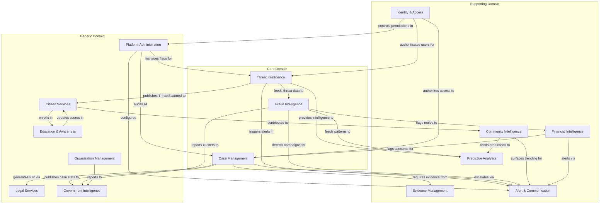

### Context Relationship Types

| Upstream Context | Downstream Context | Relationship Pattern |
|---|---|---|
| Identity & Access | All Contexts | Open Host Service (OHS) |
| Threat Intelligence | Citizen Services | Published Language |
| Threat Intelligence | Fraud Intelligence | Conformist |
| Case Management | Evidence Management | Customer-Supplier |
| Case Management | Legal Services | Customer-Supplier |
| Fraud Intelligence | Alert & Communication | Published Language |
| Fraud Intelligence | Financial Intelligence | Shared Kernel |
| Community Intelligence | Predictive Analytics | Conformist |
| Platform Administration | All Contexts | Anti-Corruption Layer (ACL) |

---

## SECTION 2: Business Entities

### Identity & Access Context Entities

#### Entity: User

**Purpose**: The foundational identity of any person interacting with CyberShield AI.

**Responsibilities**:
- Maintain unique identity and credentials
- Hold role assignments determining system access
- Track session lifecycle and authentication state

**Lifecycle**: Created → Active → Suspended → Deactivated → Archived

**Business Rules**:
- A User MUST have exactly one primary role
- A User MAY have multiple secondary roles
- Email or phone number MUST be verified before activation
- Failed login attempts exceeding 5 within 15 minutes trigger temporary lockout

#### Entity: Citizen

**Purpose**: A regular person using CyberShield AI for personal cyber safety.

**Responsibilities**:
- Submit digital communications for threat scanning
- Maintain personal safety score
- File fraud reports when victimized
- Participate in community intelligence

**Lifecycle**: Registered → Verified → Active → Inactive → Deleted

**Business Rules**:
- Citizen MUST verify phone number (Aadhaar-linked or OTP)
- Citizen receives a default SafetyScore of 50 upon registration
- Scan history retained for 12 months unless citizen requests deletion
- Maximum 50 scans per day per citizen (fair use)

#### Entity: PoliceOfficer

**Purpose**: A law enforcement officer investigating cyber fraud cases.

**Responsibilities**:
- Receive and investigate assigned cases
- Access evidence with proper authorization
- Update case status and add investigation notes
- Escalate cases to cyber cell when needed

**Lifecycle**: Registered → Verified (badge validated) → Active → Transferred → Retired

**Business Rules**:
- PoliceOfficer MUST be verified through department credentials
- Case access restricted to assigned jurisdiction
- Cannot close a case without at least one investigation note
- Escalation requires documented reason

#### Entity: CyberCellOfficer

**Purpose**: A specialized cybercrime unit member with access to advanced intelligence tools.

**Responsibilities**:
- Analyze fraud networks and graph intelligence
- Handle escalated cases from police officers
- Access cross-jurisdictional intelligence
- Generate intelligence reports

**Lifecycle**: Registered → Vetted (clearance verified) → Active → Revoked

**Business Rules**:
- Requires higher security clearance than PoliceOfficer
- Can access cases across jurisdictions
- Must log all intelligence queries for audit
- Intelligence report generation requires supervisor approval

#### Entity: GovernmentOfficial

**Purpose**: A policy maker requiring aggregated threat landscape data.

**Responsibilities**:
- Access national and regional aggregated statistics
- Review policy impact analyses
- Request custom intelligence reports
- No access to individual case details

**Lifecycle**: Registered → Verified (government ID) → Active → Term-ended

**Business Rules**:
- Access ONLY aggregated/anonymized data
- Cannot view individual citizen data or case details
- Report access limited to designated geographic scope
- All data access logged for transparency

#### Entity: BankAnalyst

**Purpose**: A financial institution analyst using fraud pattern intelligence.

**Responsibilities**:
- Receive mule account alerts
- Access financial pattern intelligence
- Report suspicious transactions
- Coordinate with case investigators

**Lifecycle**: Registered → Verified (bank credentials) → Active → Removed

**Business Rules**:
- Access limited to financial intelligence patterns
- Cannot view full case details unless formally requested
- Must acknowledge mule alerts within 24 hours
- Can only flag accounts within their institution

#### Entity: OrganizationAdmin

**Purpose**: A corporate administrator managing employee cyber safety training.

**Responsibilities**:
- Create and manage training programs
- Launch phishing simulations
- Track employee completion and scores
- View organizational risk posture

**Lifecycle**: Registered → Verified (organization validated) → Active → Offboarded

**Business Rules**:
- Can only manage users within their organization
- Training programs require at least one module
- Phishing simulations require 48-hour advance scheduling
- Organization risk score computed from employee aggregate

#### Entity: PlatformAdmin

**Purpose**: System administrator managing the CyberShield AI platform itself.

**Responsibilities**:
- Manage user accounts and roles
- Configure feature flags
- Monitor system health and audit logs
- Handle platform-wide configurations

**Lifecycle**: Created (by super-admin) → Active → Suspended → Removed

**Business Rules**:
- Cannot modify own role or permissions
- All actions logged with immutable audit trail
- Feature flag changes require confirmation step
- Cannot access case evidence directly


### Threat Intelligence Context Entities

#### Entity: ThreatScan

**Purpose**: A single analysis request submitted by a user for threat evaluation.

**Responsibilities**:
- Capture the input content (text, URL, or voice)
- Orchestrate analysis pipeline (NLP, URL, voice)
- Produce a ThreatResult with scoring
- Record scan metadata for history

**Lifecycle**: Submitted → Processing → Analyzed → Scored → Archived

**Business Rules**:
- Scan MUST complete within 2 seconds (SLA)
- Input content size limited to 10,000 characters (text) or 5 minutes (voice)
- A scan produces exactly one ThreatResult
- Archived scans retained for 12 months

#### Entity: ThreatResult

**Purpose**: The outcome of a threat analysis containing detailed findings.

**Responsibilities**:
- Store analysis findings from all applicable analyzers
- Associate threat indicators found
- Hold the computed ThreatScore
- Provide explanation data for user consumption

**Lifecycle**: Generated → Delivered → Acknowledged → Archived

**Business Rules**:
- A ThreatResult MUST include at least one analysis type
- Results are immutable once generated
- Must include plain-language explanation
- Confidence level MUST be attached to each finding

#### Entity: ThreatScore

**Purpose**: The numerical risk rating assigned to analyzed content.

**Responsibilities**:
- Represent risk level (0-100) with classification
- Track scoring factors and weights
- Support explanation generation
- Feed into safety score computation

**Lifecycle**: Calculated → Classified → Delivered (immutable after)

**Business Rules**:
- Score range: 0 (safe) to 100 (confirmed fraud)
- 0-29: SAFE, 30-69: CAUTION, 70-100: DANGER
- Template match confidence >90% forces minimum score of 80
- Score MUST include list of contributing factors

#### Entity: ThreatCategory

**Purpose**: Classification taxonomy for types of threats detected.

**Responsibilities**:
- Categorize threats (phishing, vishing, smishing, malware, etc.)
- Maintain category hierarchy
- Support filtering and reporting
- Enable pattern matching

**Lifecycle**: Defined → Active → Deprecated → Removed

**Business Rules**:
- Categories form a hierarchical tree (max 3 levels)
- A ThreatResult may belong to multiple categories
- Category deprecation requires migration plan
- New categories require admin approval

#### Entity: ThreatIndicator

**Purpose**: A specific signal or pattern that indicates potential fraud.

**Responsibilities**:
- Represent individual fraud signals (urgency language, suspicious URLs, impersonation markers)
- Carry weight/severity for scoring contribution
- Support pattern library growth
- Enable indicator correlation

**Lifecycle**: Discovered → Validated → Active → Obsolete

**Business Rules**:
- Each indicator has a severity weight (0.0-1.0)
- Indicators must be validated against false-positive threshold before activation
- An indicator may contribute to multiple ThreatCategories
- Obsolete indicators retained for historical analysis

#### Entity: URLAnalysis

**Purpose**: Specialized analysis of URLs for phishing, malware, and reputation.

**Responsibilities**:
- Analyze URL structure and domain reputation
- Check against known threat databases
- Evaluate SSL certificate validity
- Detect URL obfuscation techniques

**Lifecycle**: Submitted → Resolving → Analyzed → Scored

**Business Rules**:
- URL resolution MUST NOT follow redirects beyond 5 hops
- Known-malicious domains immediately score 95+
- Domain age < 30 days increases suspicion weight
- Shortened URLs always expanded before analysis

#### Entity: VoiceAnalysis

**Purpose**: Analysis of voice communications for deepfake detection and social engineering patterns.

**Responsibilities**:
- Detect synthetic/deepfake audio
- Identify social engineering speech patterns
- Analyze caller behavior (urgency, authority claims)
- Produce confidence-rated findings

**Lifecycle**: Uploaded → Transcribing → Analyzing → Scored

**Business Rules**:
- Audio limited to 5 minutes maximum
- Deepfake confidence > 80% triggers DANGER classification
- Voice analysis MUST include transcript
- Analysis results include timestamp markers for key moments

### Case Management Context Entities

#### Entity: FraudReport

**Purpose**: A citizen's initial report of suspected fraud, which may become a formal Case.

**Responsibilities**:
- Capture victim's account of the incident
- Collect initial evidence references
- Determine jurisdiction
- Trigger case creation workflow

**Lifecycle**: Drafted → Submitted → Validated → Case-Created | Rejected

**Business Rules**:
- Report MUST include at least one contact method of the suspect
- Duplicate detection within 48 hours by same citizen for same suspect
- Validation checks for completeness before case creation
- Rejected reports must include rejection reason

#### Entity: Case

**Purpose**: A formal investigation record tracking the lifecycle of a fraud incident.

**Responsibilities**:
- Track investigation progress through status transitions
- Maintain assignment to investigating officers
- Aggregate evidence, notes, and timeline
- Support escalation and resolution workflows

**Lifecycle**: OPEN → INVESTIGATING → ESCALATED → CLOSED

**Business Rules**:
- Status transitions: OPEN→INVESTIGATING→(ESCALATED|CLOSED)
- ESCALATED can only transition to CLOSED
- Closure requires resolution summary
- Jurisdiction determines initial assignment pool
- Case reference number format: FR-YYYY-NNNNN

#### Entity: CaseNote

**Purpose**: An investigation note or observation added to a case by an officer.

**Responsibilities**:
- Record investigation findings
- Support rich content (text, links to evidence)
- Maintain authorship and timestamp
- Enable case handover context

**Lifecycle**: Created → Active → Archived (immutable after creation)

**Business Rules**:
- Notes are append-only (cannot be edited or deleted)
- Must include author identity and timestamp
- Minimum 10 characters content length
- Sensitive notes can be marked restricted-access

#### Entity: CaseAssignment

**Purpose**: Links a case to its assigned investigating officer(s).

**Responsibilities**:
- Track primary and supporting officer assignments
- Record assignment/reassignment history
- Enforce jurisdiction rules
- Support workload balancing

**Lifecycle**: Assigned → Active → Reassigned → Completed

**Business Rules**:
- Every case MUST have exactly one primary assignee
- Assignment must match officer's jurisdiction
- Reassignment requires documented reason
- Officer workload cap: 20 active cases simultaneously

#### Entity: CaseTimeline

**Purpose**: Chronological record of all significant events in a case's history.

**Responsibilities**:
- Auto-record status changes, assignments, evidence additions
- Support audit trail requirements
- Enable timeline visualization
- Track SLA compliance

**Lifecycle**: Continuous (append-only for case duration)

**Business Rules**:
- Timeline entries are immutable and append-only
- Each entry includes actor, action, timestamp
- System-generated entries marked differently from manual entries
- Timeline retained for 7 years after case closure

### Evidence Management Context Entities

#### Entity: Evidence

**Purpose**: A digital artifact submitted as proof in a fraud investigation.

**Responsibilities**:
- Store evidence content securely
- Maintain metadata (type, size, source)
- Track custody chain
- Verify integrity on access

**Lifecycle**: Uploaded → Verified → Active → Archived → Destroyed (per retention)

**Business Rules**:
- Evidence integrity verified via SHA-256 hash on every access
- Maximum single evidence size: 100MB
- Supported types: screenshot, document, audio, video, transaction record
- Retention: 7 years minimum after case closure
- Deletion requires legal authorization

#### Entity: EvidenceChain

**Purpose**: Chain-of-custody record showing who accessed or transferred evidence and when.

**Responsibilities**:
- Record every access, transfer, and modification event
- Maintain unbroken custody chain
- Support legal admissibility requirements
- Enable audit of evidence handling

**Lifecycle**: Initiated (on evidence upload) → Active → Sealed (on case closure)

**Business Rules**:
- Chain entries are immutable and cryptographically linked
- Any gap in custody chain flags evidence as potentially compromised
- Transfer requires both parties to acknowledge
- Chain must be complete for evidence to be legally admissible

#### Entity: EvidenceHash

**Purpose**: Cryptographic fingerprint ensuring evidence has not been tampered with.

**Responsibilities**:
- Compute and store SHA-256 hash at upload time
- Enable integrity verification at any point
- Detect any modification to evidence content
- Support non-repudiation

**Lifecycle**: Computed → Stored → Verified-on-access (immutable)

**Business Rules**:
- Hash computed using SHA-256 algorithm
- Hash mismatch immediately flags evidence as compromised
- Original hash stored separately from evidence content
- Hash verification logged in EvidenceChain


### Fraud Intelligence Context Entities

#### Entity: GraphEntity

**Purpose**: A node in the fraud intelligence graph representing a real-world entity involved in fraud.

**Responsibilities**:
- Represent a fraud-relevant entity (phone, account, person, UPI, email, device, IP)
- Maintain entity metadata and risk profile
- Track connections to other entities
- Support cluster membership

**Lifecycle**: Registered → Active → Flagged → Dormant → Archived

**Business Rules**:
- Entity types: PHONE, BANK_ACCOUNT, PERSON, UPI_ID, EMAIL, DEVICE, IP_ADDRESS
- An entity may belong to multiple fraud clusters
- Risk score computed from connection analysis
- Dormancy after 6 months of no new connections

#### Entity: GraphConnection

**Purpose**: An edge in the fraud graph representing a relationship between two entities.

**Responsibilities**:
- Link two GraphEntities with a typed relationship
- Maintain connection strength (0-1)
- Track evidence supporting the connection
- Support temporal analysis (when connection was active)

**Lifecycle**: Discovered → Validated → Active → Weakened → Severed

**Business Rules**:
- Connection types: CONTACTED, TRANSACTED, SHARED_DEVICE, SAME_NETWORK, REPORTED_TOGETHER, MONEY_FLOW
- Connection strength: 0.0 (weakest) to 1.0 (confirmed)
- Strength decays by 10% per month without reinforcing evidence
- Minimum strength threshold 0.1 — below this, connection archived

#### Entity: FraudCluster

**Purpose**: A detected group of interconnected entities forming a fraud network.

**Responsibilities**:
- Group related GraphEntities into a fraud network
- Track cluster size, risk level, and activity
- Enable network visualization
- Support investigation prioritization

**Lifecycle**: Detected → Confirmed → Active → Dismantled → Archived

**Business Rules**:
- Minimum 3 entities required to form a cluster
- Average connection strength within cluster must exceed 0.5
- Cluster risk = weighted average of member entity risks
- New entity joining cluster triggers re-evaluation

#### Entity: MoneyFlow

**Purpose**: Tracks the movement of money through a chain of accounts, identifying laundering patterns.

**Responsibilities**:
- Record sequential fund transfers
- Identify circular flows and layering
- Calculate total flow volume
- Detect velocity anomalies

**Lifecycle**: Detected → Tracked → Analyzed → Reported

**Business Rules**:
- Flow chain of 3+ hops with >80% forwarding ratio flags as mule pattern
- Circular flows (money returns to origin) flagged as layering
- Velocity: >5 transactions within 1 hour flags as suspicious
- Total flow > ₹10 lakh in 24 hours triggers automatic alert

#### Entity: MuleAccount

**Purpose**: A bank account identified as being used to transfer illegally acquired money.

**Responsibilities**:
- Flag suspected mule accounts
- Track mule behavior patterns
- Generate alerts to bank partners
- Support law enforcement reporting

**Lifecycle**: Suspected → Confirmed → Alerted → Frozen → Resolved

**Business Rules**:
- Flagging requires evidence from at least 2 independent sources
- Confirmation requires pattern match: high inflow + rapid outflow + multiple recipients
- Alert to bank within 1 hour of confirmation
- False positive resolution requires manual review

### Alert & Communication Context Entities

#### Entity: Alert

**Purpose**: A system-generated warning about detected threats, mule accounts, or fraud campaigns.

**Responsibilities**:
- Deliver timely threat warnings to affected users
- Carry severity classification
- Track delivery and acknowledgment
- Support multiple delivery channels

**Lifecycle**: Generated → Queued → Delivered → Acknowledged | Expired

**Business Rules**:
- Delivery SLA: 5 minutes from generation
- Severity levels: CRITICAL, HIGH, MEDIUM, LOW
- CRITICAL alerts require acknowledgment within 1 hour
- Expired alerts archived after 7 days without acknowledgment

#### Entity: FraudCampaign

**Purpose**: An identified coordinated series of fraud attempts targeting multiple victims.

**Responsibilities**:
- Aggregate related fraud reports into a campaign
- Track campaign scope and evolution
- Trigger mass alerts
- Support investigation coordination

**Lifecycle**: Suspected → Confirmed → Active → Mitigated → Archived

**Business Rules**:
- 3 or more similar reports within 48 hours triggers campaign detection
- Similarity measured by: suspect identifiers, message templates, target demographics
- Campaign confirmation requires analyst review
- Active campaigns trigger proactive alerts to potential targets

#### Entity: Notification

**Purpose**: A single message delivered to a specific user through their preferred channel.

**Responsibilities**:
- Deliver message content to user
- Track delivery status per channel
- Respect user preferences
- Support retry logic for failed deliveries

**Lifecycle**: Created → Sent → Delivered → Read | Failed

**Business Rules**:
- Channels: Push notification, SMS, Email, In-app
- Maximum 10 notifications per user per day (excluding CRITICAL)
- Failed delivery retries: max 3 attempts with exponential backoff
- User can mute non-critical notifications

#### Entity: AlertPreference

**Purpose**: User-specific configuration for how and when they receive alerts.

**Responsibilities**:
- Store channel preferences per alert severity
- Maintain quiet hours configuration
- Support frequency capping preferences
- Enable alert category filtering

**Lifecycle**: Created (with defaults) → Active → Modified → Active

**Business Rules**:
- Default: all channels enabled for CRITICAL, push+in-app for others
- Quiet hours: CRITICAL alerts bypass quiet hours
- Users cannot disable CRITICAL alert channel entirely
- Preferences take effect within 5 minutes of change

### Community Intelligence Context Entities

#### Entity: CommunityContribution

**Purpose**: An anonymized threat report shared by a citizen with the community.

**Responsibilities**:
- Store anonymized threat information
- Track contribution reputation scoring
- Support verification by community/analysts
- Feed into trending analysis

**Lifecycle**: Submitted → Anonymized → Published → Verified | Disputed → Archived

**Business Rules**:
- All personally identifiable information stripped before publishing
- Contribution quality scored by subsequent verifications
- Disputed contributions require moderator review
- Contributors earn reputation points (never revealing identity)

#### Entity: TrendingThreat

**Purpose**: An emerging threat pattern identified through community reports and system analysis.

**Responsibilities**:
- Aggregate similar community reports into trends
- Track trend velocity and geographic spread
- Generate proactive warnings
- Feed predictive analytics

**Lifecycle**: Emerging → Trending → Peak → Declining → Historical

**Business Rules**:
- Minimum 10 related reports within 72 hours to qualify as trending
- Geographic clustering amplifies trend score
- Trending threats auto-generate alerts for affected regions
- Historical trends retained for pattern library

### Education & Awareness Context Entities

#### Entity: LearningModule

**Purpose**: A structured educational unit teaching cyber safety concepts.

**Responsibilities**:
- Deliver educational content (text, video, interactive)
- Track difficulty level and prerequisites
- Support multiple languages
- Measure completion and comprehension

**Lifecycle**: Drafted → Reviewed → Published → Active → Retired

**Business Rules**:
- Module MUST include at least one quiz
- Content available in minimum 2 languages (English + Hindi)
- Estimated completion time: 5-30 minutes per module
- Retirement requires replacement module

#### Entity: Quiz

**Purpose**: An assessment validating the learner's understanding of module content.

**Responsibilities**:
- Present questions in randomized order
- Score responses and provide feedback
- Contribute to safety score calculation
- Track attempts and pass rates

**Lifecycle**: Created → Active → Retired

**Business Rules**:
- Minimum 5 questions per quiz
- Pass threshold: 70% correct
- Maximum 3 attempts per 24-hour period
- Questions drawn from pool (randomized per attempt)

#### Entity: LearningProgress

**Purpose**: Tracks a user's advancement through the education curriculum.

**Responsibilities**:
- Record module completions and quiz scores
- Calculate cumulative learning score
- Recommend next modules
- Contribute to SafetyScore

**Lifecycle**: Started → In-Progress → Completed (per module, ongoing overall)

**Business Rules**:
- Progress contributes up to 20 points toward SafetyScore
- Streak bonus: 7 consecutive days of learning = bonus multiplier
- Expired modules (content updated) require re-completion
- Progress never decreases (only forward movement)

#### Entity: SafetyScore

**Purpose**: A personal metric reflecting a citizen's overall digital safety posture.

**Responsibilities**:
- Aggregate factors: scan behavior, learning, report history, community participation
- Provide actionable improvement recommendations
- Support gamification and motivation
- Enable comparative benchmarking (anonymized)

**Lifecycle**: Initialized (50) → Active (continuously updated)

**Business Rules**:
- Range: 0-100
- Factors: Scan frequency (25%), Learning completion (20%), Clean scan history (25%), Community participation (15%), Report filing (15%)
- Updated daily based on rolling 90-day window
- Never drops below 10 (floor) to avoid discouragement
- Score 80+ earns "Cyber Aware" badge

### Financial Intelligence Context Entities

#### Entity: TransactionChain

**Purpose**: A sequence of related financial transactions potentially indicating money laundering.

**Responsibilities**:
- Link sequential transactions across accounts
- Calculate chain velocity and volume
- Detect layering and structuring patterns
- Support visual flow representation

**Lifecycle**: Detected → Tracked → Analyzed → Flagged | Cleared

**Business Rules**:
- Chain minimum length: 3 transactions
- Velocity threshold: 5+ transactions per hour
- Volume threshold: ₹10 lakh cumulative in 24 hours
- Cleared chains re-open if new matching transactions appear

#### Entity: AccountRisk

**Purpose**: Risk profile for a financial account based on behavioral analysis.

**Responsibilities**:
- Compute risk score from transaction patterns
- Track risk factor history
- Support threshold-based alerting
- Enable bank partner integration

**Lifecycle**: Created → Monitored → Flagged → Investigated → Resolved | Confirmed-Mule

**Business Rules**:
- Risk score: 0-100 (same scale as ThreatScore for consistency)
- Factors: transaction velocity, counterparty risk, geographic anomalies, time patterns
- Score > 70 triggers automatic MuleAlert
- Score recalculated on every new transaction

#### Entity: MuleAlert

**Purpose**: An alert generated when an account is suspected of being a money mule.

**Responsibilities**:
- Notify relevant bank analyst
- Provide supporting evidence summary
- Track response and action taken
- Support coordination with law enforcement

**Lifecycle**: Generated → Sent → Acknowledged → Actioned → Resolved

**Business Rules**:
- Must be acknowledged by bank within 24 hours
- Unacknowledged alerts escalate to CyberCell after 24 hours
- False positive rate tracked per algorithm version
- Resolution requires documented justification

### Legal Services Context Entities

#### Entity: FIRDraft

**Purpose**: An AI-generated First Information Report draft for citizen review and filing.

**Responsibilities**:
- Generate legally structured FIR content
- Map incident to relevant IPC/IT Act sections
- Support citizen review and modification
- Track review status and filing

**Lifecycle**: Generated → Under-Review → Approved → Filed | Rejected

**Business Rules**:
- ALL AI-generated drafts MUST carry "AI-Generated — Human Review Required" label
- Draft MUST map to at least one legal section
- Citizen must explicitly approve before filing
- Generated within 30 seconds of request
- Draft expires after 7 days without action

#### Entity: LegalSection

**Purpose**: A reference to applicable legal provisions (IPC, IT Act, etc.) relevant to a fraud case.

**Responsibilities**:
- Map fraud types to legal sections
- Provide plain-language explanation
- Support FIR section selection
- Maintain current legal reference database

**Lifecycle**: Defined → Active → Amended → Superseded

**Business Rules**:
- Sections mapped to ThreatCategories
- Multiple sections may apply to one incident
- Amendments tracked with effective dates
- Plain-language explanation mandatory for citizen comprehension

### Organization Management Context Entities

#### Entity: TrainingProgram

**Purpose**: A corporate cyber safety training program comprising multiple modules and assessments.

**Responsibilities**:
- Organize modules into a structured curriculum
- Track organizational completion rates
- Support mandatory and optional tracks
- Measure organizational risk reduction

**Lifecycle**: Created → Published → Active → Completed → Archived

**Business Rules**:
- Minimum 3 modules per program
- Mandatory programs require 100% employee enrollment
- Completion deadline configurable (default: 30 days)
- Program effectiveness measured by post-training simulation results

#### Entity: PhishingSimulation

**Purpose**: A controlled phishing exercise testing employee awareness.

**Responsibilities**:
- Send realistic phishing emails to employees
- Track who clicks, reports, or ignores
- Generate awareness scores per employee
- Feed organizational risk calculation

**Lifecycle**: Scheduled → Active → Completed → Reported

**Business Rules**:
- Minimum 48-hour advance scheduling
- Maximum frequency: one simulation per employee per month
- Results anonymous in aggregate reports
- Employees who click receive immediate training redirect
- Simulation templates must not use real malicious content

#### Entity: EmployeeTrainingRecord

**Purpose**: Individual employee's training history within their organization.

**Responsibilities**:
- Track module completions and quiz scores
- Record simulation results
- Calculate individual awareness score
- Support compliance reporting

**Lifecycle**: Created (on enrollment) → Active → Completed | Overdue

**Business Rules**:
- Records tied to organization membership (removed on offboarding)
- Overdue status triggers manager notification
- Awareness score: composite of quiz scores + simulation performance
- Records retained for 3 years post-employment for compliance

### Platform Administration Context Entities

#### Entity: AuditLog

**Purpose**: Immutable record of all significant platform actions for security and compliance.

**Responsibilities**:
- Record actor, action, target, timestamp for every significant event
- Support forensic investigation
- Enable compliance reporting
- Provide system behavior transparency

**Lifecycle**: Created → Stored → Archived (never deleted)

**Business Rules**:
- Logs are append-only and immutable
- Retained for minimum 7 years
- Must capture: who, what, when, where, outcome
- Sensitive data in logs is masked (PII)
- Tampering detection via log hash chains

#### Entity: FeatureFlag

**Purpose**: A toggle controlling the availability of platform features.

**Responsibilities**:
- Enable/disable features without deployment
- Support gradual rollout (percentage-based)
- Allow user-segment targeting
- Track flag change history

**Lifecycle**: Created → Active → Enabled/Disabled → Deprecated → Removed

**Business Rules**:
- Flag changes require confirmation (double-action)
- All changes logged in AuditLog
- Flags can target: all users, percentage, specific roles, specific organizations
- Deprecated flags auto-remove after 90 days of disabled state
- Emergency kill switches bypass confirmation


---

## SECTION 3: Entity Relationships

### Identity & Threat Relationships

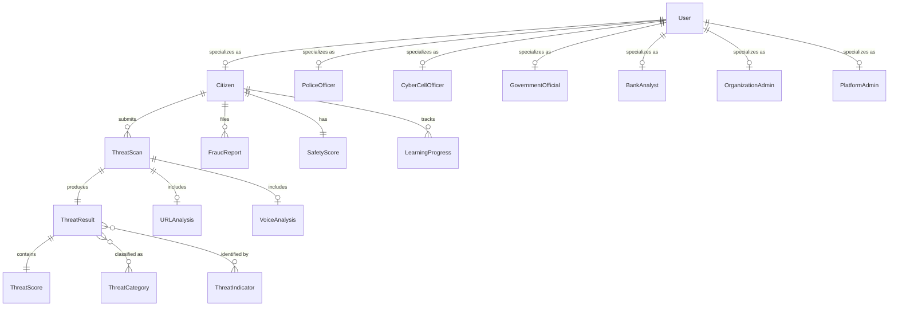

### Case & Evidence Relationships

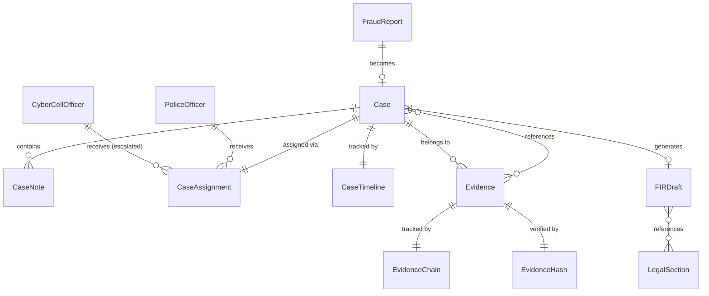

### Fraud Intelligence Relationships

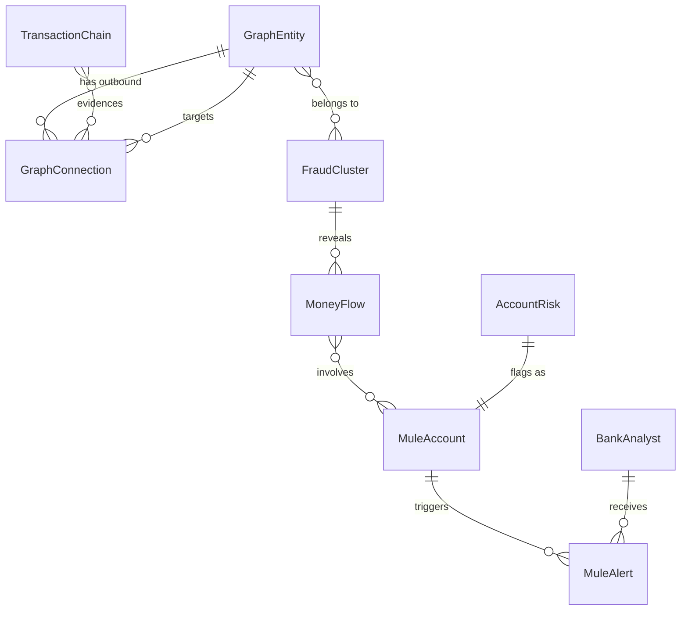

### Alert & Community Relationships

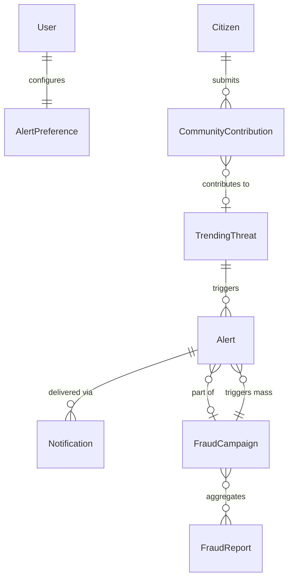

### Education & Organization Relationships

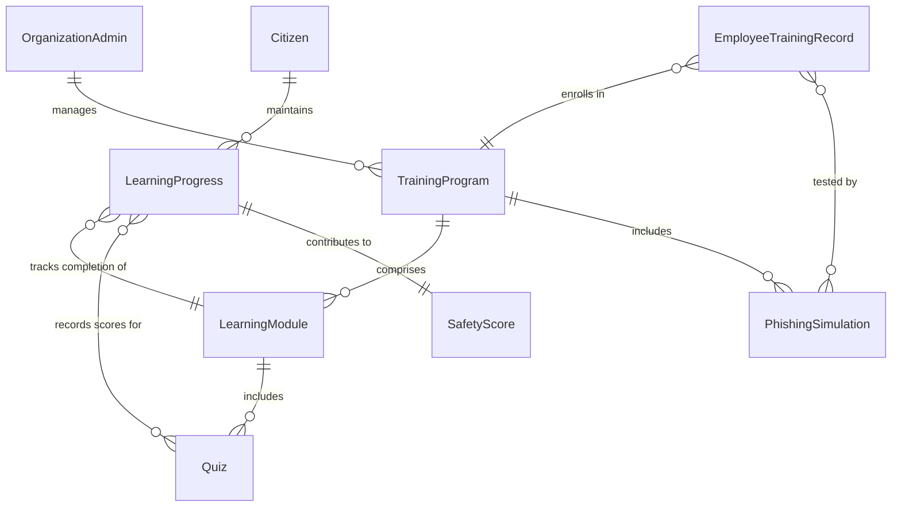

### Cross-Context Relationships Summary

| From Entity | Relationship | To Entity | Crossing Contexts |
|---|---|---|---|
| Citizen | submits | ThreatScan | Citizen Services → Threat Intelligence |
| Citizen | files | FraudReport | Citizen Services → Case Management |
| Case | references | Evidence | Case Management → Evidence Management |
| Case | generates | FIRDraft | Case Management → Legal Services |
| ThreatResult | feeds | GraphEntity | Threat Intelligence → Fraud Intelligence |
| FraudCluster | triggers | Alert | Fraud Intelligence → Alert & Communication |
| MuleAccount | triggers | MuleAlert | Fraud Intelligence → Financial Intelligence |
| CommunityContribution | feeds | TrendingThreat | Community Intelligence → Alert & Communication |
| LearningProgress | updates | SafetyScore | Education → Citizen Services |
| TrainingProgram | uses | LearningModule | Organization Mgmt → Education |
| GovernmentOfficial | views | NationalStatistic | Identity → Government Intelligence |
| PlatformAdmin | manages | FeatureFlag | Identity → Platform Administration |

---

## SECTION 4: Aggregate Roots

Aggregates define transactional consistency boundaries. Each aggregate has a root entity that controls all access to internal entities.

### 4.1 User Aggregate

**Root**: User

**Internal Entities**: Session, Preference, RoleAssignment

**Boundary Justification**: User identity, sessions, and preferences always change together and require consistent state.

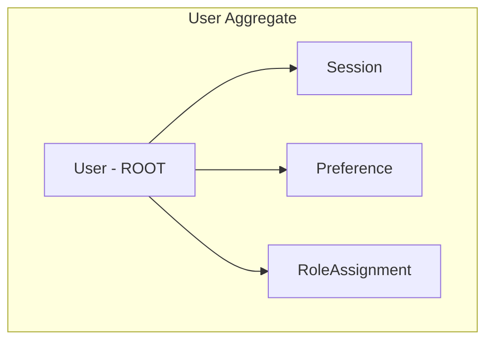

**Invariants**:
- User MUST have at least one active role at all times
- Maximum 5 concurrent sessions per user
- Preference changes do not require re-authentication
- Session expiry: 24 hours (citizen), 8 hours (officer), 4 hours (admin)

### 4.2 ThreatScan Aggregate

**Root**: ThreatScan

**Internal Entities**: ThreatResult, ThreatScore, ThreatIndicator (instances)

**Boundary Justification**: A scan and its results form an atomic unit — a scan without a result is incomplete, and results cannot exist without a scan.

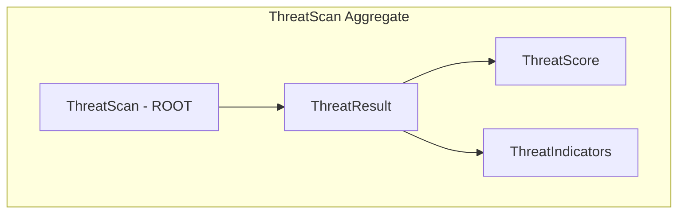

**Invariants**:
- A completed ThreatScan MUST have exactly one ThreatResult
- ThreatScore MUST be within 0-100 range
- At least one ThreatIndicator must be present if score > 0
- Scan state cannot regress (Processing cannot go back to Submitted)

### 4.3 Case Aggregate

**Root**: Case

**Internal Entities**: CaseNote, CaseAssignment, CaseTimeline

**Boundary Justification**: Case notes, assignments, and timeline are meaningless without the case. All case operations maintain case-level invariants.

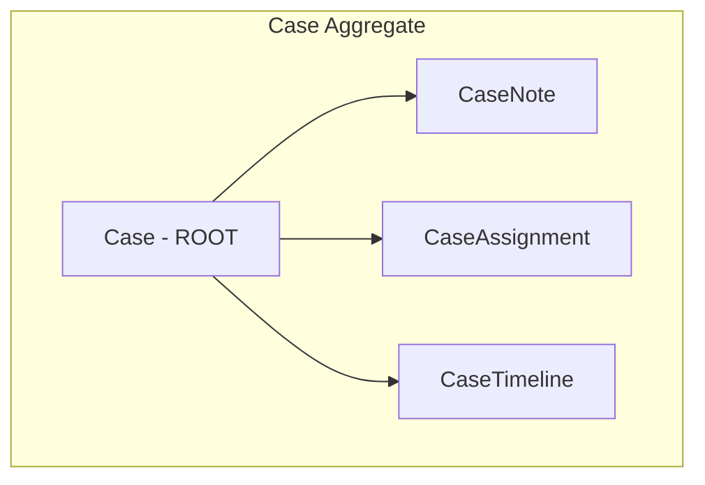

**Invariants**:
- Case MUST have exactly one primary assignment at all times
- Status transitions follow defined state machine (no skipping)
- Closing a case requires at least one CaseNote
- Timeline entries are append-only and monotonically timestamped

### 4.4 Evidence Aggregate

**Root**: Evidence

**Internal Entities**: EvidenceChain, EvidenceHash

**Boundary Justification**: Evidence integrity (hash) and custody (chain) are inseparable from the evidence itself. Any operation on evidence must maintain hash and chain consistency.

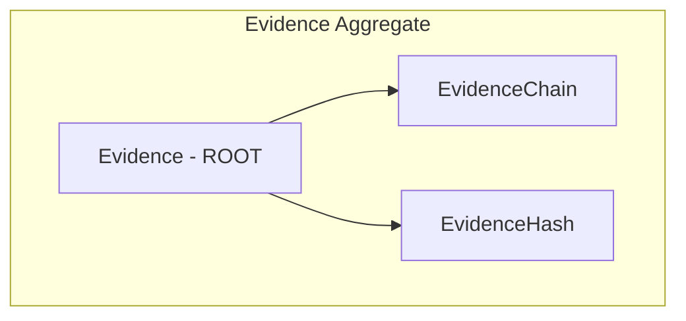

**Invariants**:
- EvidenceHash computed at upload time and NEVER modified
- EvidenceChain MUST have unbroken custody from upload to current state
- Every access to evidence creates a chain entry
- Hash verification must pass on every read operation

### 4.5 GraphEntity Aggregate

**Root**: GraphEntity

**Internal Entities**: Outbound GraphConnections

**Boundary Justification**: An entity and its outbound connections form a consistency unit — connection strength updates affect the entity's risk score.

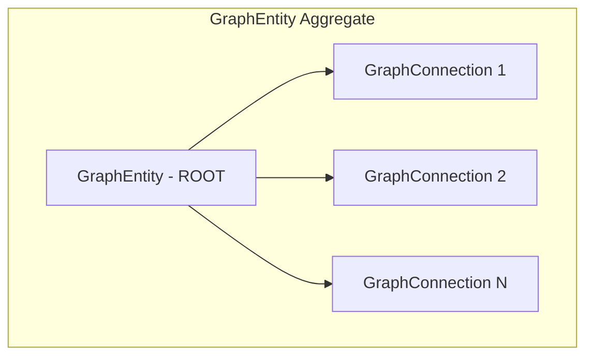

**Invariants**:
- Entity risk score derived from connection analysis
- Connection strength MUST be in range [0.0, 1.0]
- Connections below 0.1 strength are auto-archived
- Adding a connection triggers risk re-calculation

### 4.6 FraudCluster Aggregate

**Root**: FraudCluster

**Internal Entities**: Cluster membership references, cluster metrics

**Boundary Justification**: Cluster membership, risk computation, and lifecycle are managed atomically. Adding/removing entities requires cluster-level invariant checks.

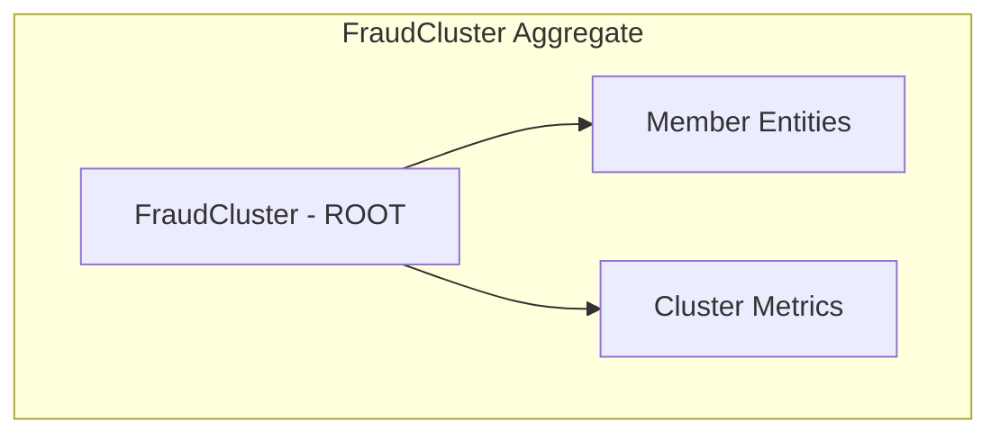

**Invariants**:
- Cluster MUST maintain minimum 3 member entities
- Average connection strength within cluster MUST exceed 0.5
- Cluster risk = weighted average of member risks
- Removing an entity below minimum dissolves the cluster

### 4.7 Alert Aggregate

**Root**: Alert

**Internal Entities**: Notification deliveries, campaign association

**Boundary Justification**: An alert and its delivery notifications form a transactional unit — alert state depends on delivery outcomes.

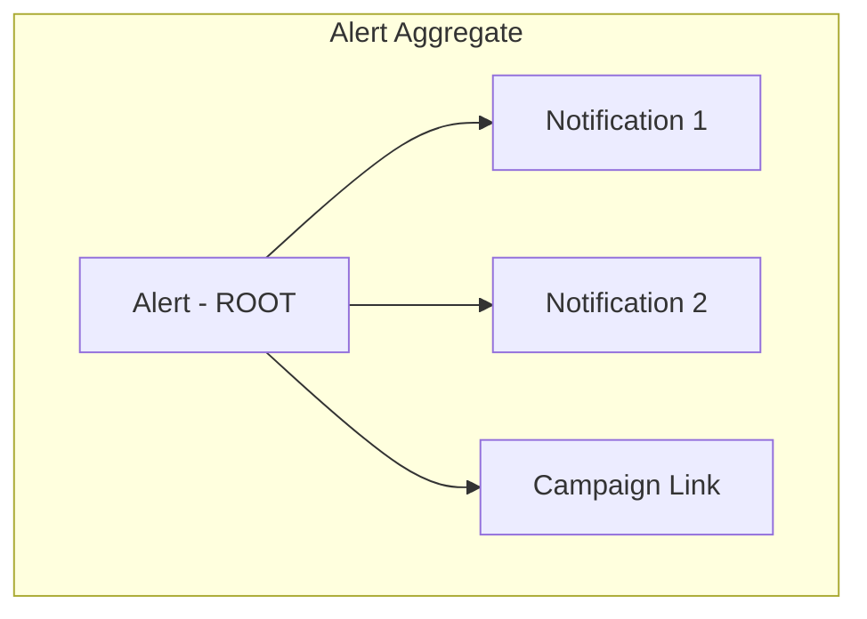

**Invariants**:
- Alert delivery MUST complete within 5-minute SLA
- Alert acknowledged only when at least one notification is confirmed read
- CRITICAL alerts MUST attempt all available channels
- Expired alerts cannot be re-delivered

### 4.8 LearningModule Aggregate

**Root**: LearningModule

**Internal Entities**: Quiz, ModuleContent

**Boundary Justification**: A module's quizzes and content are designed together and versioned together. Publishing requires all components valid.

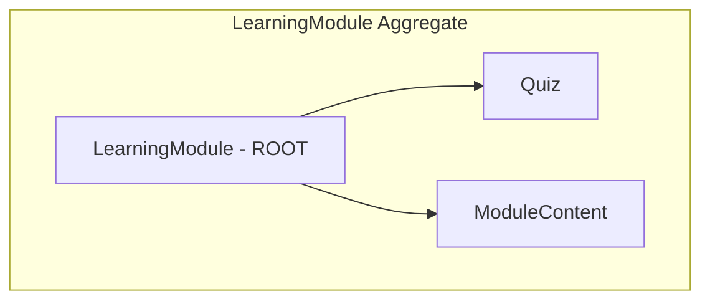

**Invariants**:
- Published module MUST include at least one quiz with 5+ questions
- Content MUST be available in minimum 2 languages
- Quiz pass threshold fixed at 70%
- Retiring module requires replacement to be published first

### 4.9 TrainingProgram Aggregate

**Root**: TrainingProgram

**Internal Entities**: PhishingSimulation references, EmployeeTrainingRecord references

**Boundary Justification**: Program lifecycle, simulation scheduling, and employee enrollment form a coordinated unit.

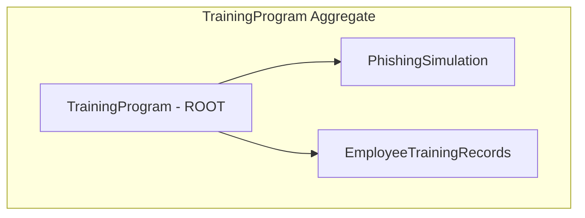

**Invariants**:
- Program MUST contain minimum 3 learning modules
- PhishingSimulation cannot run without 48-hour advance notice
- All enrolled employees receive completion deadline
- Program cannot be archived while employees have incomplete status

### 4.10 FIRDraft Aggregate

**Root**: FIRDraft

**Internal Entities**: LegalSection references, review history

**Boundary Justification**: A FIR draft and its legal section mappings are generated and reviewed as a unit. Approval/rejection affects the entire draft.

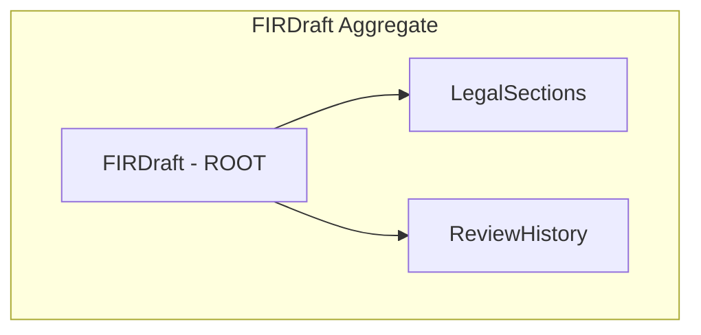

**Invariants**:
- Draft MUST reference at least one LegalSection
- "AI-Generated" label MUST always be present
- Filing requires explicit citizen approval
- Draft expires after 7 days without citizen action


---

## SECTION 5: Value Objects

Value Objects are immutable, identity-less objects defined solely by their attributes. They enforce business constraints at the type level.

```pascal
VALUE OBJECT PhoneNumber
  PROPERTIES
    countryCode: String       %% "+91" for India
    number: String            %% 10-digit mobile number
  END PROPERTIES

  INVARIANTS
    countryCode MUST match pattern "+\d{1,3}"
    number MUST match pattern "\d{10}" (for India)
    number MUST NOT start with "0"
  END INVARIANTS

  EQUALITY: Two PhoneNumbers are equal IF countryCode AND number are identical
END VALUE OBJECT


VALUE OBJECT UPIId
  PROPERTIES
    handle: String            %% e.g., "user@bankname"
  END PROPERTIES

  INVARIANTS
    handle MUST match pattern "[a-zA-Z0-9._]+@[a-zA-Z]+"
    handle length MUST be between 3 and 50 characters
  END INVARIANTS

  EQUALITY: Two UPIIds are equal IF handles are identical (case-insensitive)
END VALUE OBJECT


VALUE OBJECT EmailAddress
  PROPERTIES
    address: String           %% Standard email format
  END PROPERTIES

  INVARIANTS
    address MUST conform to RFC 5322 email format
    address length MUST NOT exceed 254 characters
    domain part MUST contain at least one dot
  END INVARIANTS

  EQUALITY: Two EmailAddresses are equal IF addresses are identical (case-insensitive)
END VALUE OBJECT


VALUE OBJECT IPAddress
  PROPERTIES
    version: Enum(IPv4, IPv6)
    address: String
  END PROPERTIES

  INVARIANTS
    IF version = IPv4 THEN address MUST match "\d{1,3}\.\d{1,3}\.\d{1,3}\.\d{1,3}"
      AND each octet MUST be 0-255
    IF version = IPv6 THEN address MUST match valid IPv6 format
  END INVARIANTS

  EQUALITY: Two IPAddresses are equal IF version AND address match
END VALUE OBJECT


VALUE OBJECT BankAccountNumber
  PROPERTIES
    ifscCode: String          %% 11-character IFSC
    accountNumber: String     %% 9-18 digit account number
  END PROPERTIES

  INVARIANTS
    ifscCode MUST match pattern "[A-Z]{4}0[A-Z0-9]{6}"
    accountNumber MUST be numeric, length 9-18 digits
  END INVARIANTS

  EQUALITY: Two BankAccountNumbers are equal IF ifscCode AND accountNumber match
END VALUE OBJECT


VALUE OBJECT GeoCoordinate
  PROPERTIES
    latitude: Decimal         %% -90.0 to +90.0
    longitude: Decimal        %% -180.0 to +180.0
  END PROPERTIES

  INVARIANTS
    latitude MUST be in range [-90.0, +90.0]
    longitude MUST be in range [-180.0, +180.0]
    precision MUST be at least 4 decimal places
  END INVARIANTS

  EQUALITY: Two GeoCoordinates are equal IF lat AND lon match within 0.0001 tolerance
END VALUE OBJECT


VALUE OBJECT Address
  PROPERTIES
    line1: String
    line2: String (optional)
    city: String
    state: String
    pincode: String
    country: String
  END PROPERTIES

  INVARIANTS
    line1 MUST NOT be empty
    city MUST NOT be empty
    state MUST be valid Indian state/UT code
    pincode MUST match pattern "\d{6}" (Indian PIN)
    country defaults to "IN"
  END INVARIANTS

  EQUALITY: All fields must match (normalized, trimmed)
END VALUE OBJECT


VALUE OBJECT ThreatScoreValue
  PROPERTIES
    score: Integer            %% 0-100
    classification: Enum(SAFE, CAUTION, DANGER)
  END PROPERTIES

  INVARIANTS
    score MUST be in range [0, 100]
    IF score IN [0, 29] THEN classification = SAFE
    IF score IN [30, 69] THEN classification = CAUTION
    IF score IN [70, 100] THEN classification = DANGER
    classification MUST be consistent with score
  END INVARIANTS

  EQUALITY: Two ThreatScoreValues are equal IF scores are identical
END VALUE OBJECT


VALUE OBJECT ConfidenceLevel
  PROPERTIES
    value: Decimal            %% 0.0-1.0
  END PROPERTIES

  INVARIANTS
    value MUST be in range [0.0, 1.0]
    precision: 2 decimal places
  END INVARIANTS

  EQUALITY: Two ConfidenceLevels are equal IF values match within 0.01 tolerance
END VALUE OBJECT


VALUE OBJECT ThreatCategoryType
  PROPERTIES
    category: Enum(
      PHISHING,
      VISHING,
      SMISHING,
      MALWARE,
      IMPERSONATION,
      LOTTERY_SCAM,
      INVESTMENT_FRAUD,
      ROMANCE_SCAM,
      TECH_SUPPORT_SCAM,
      UPI_FRAUD,
      DEEPFAKE,
      SOCIAL_ENGINEERING,
      IDENTITY_THEFT,
      OTHER
    )
  END PROPERTIES

  INVARIANTS
    category MUST be one of the defined enum values
  END INVARIANTS

  EQUALITY: Two ThreatCategoryTypes are equal IF categories match
END VALUE OBJECT


VALUE OBJECT CaseReferenceNumber
  PROPERTIES
    prefix: String            %% "FR"
    year: Integer             %% 4-digit year
    sequence: Integer         %% 5-digit sequential number
  END PROPERTIES

  INVARIANTS
    prefix = "FR" (fixed)
    year MUST be valid 4-digit year (>= 2024)
    sequence MUST be in range [00001, 99999]
    Format: "FR-YYYY-NNNNN" (e.g., "FR-2024-00001")
  END INVARIANTS

  EQUALITY: Two CaseReferenceNumbers are equal IF formatted strings match
END VALUE OBJECT


VALUE OBJECT EvidenceHashValue
  PROPERTIES
    algorithm: String         %% "SHA-256"
    hash: String              %% 64-character hex string
    computedAt: Timestamp
  END PROPERTIES

  INVARIANTS
    algorithm = "SHA-256" (currently only supported)
    hash MUST match pattern "[a-f0-9]{64}"
    computedAt MUST be in the past
  END INVARIANTS

  EQUALITY: Two EvidenceHashValues are equal IF algorithm AND hash match
END VALUE OBJECT


VALUE OBJECT DateRange
  PROPERTIES
    startDate: Date
    endDate: Date
  END PROPERTIES

  INVARIANTS
    startDate MUST be <= endDate
    Range MUST NOT exceed 366 days (1 year maximum)
    Both dates MUST be valid calendar dates
  END INVARIANTS

  EQUALITY: Two DateRanges are equal IF start AND end dates match
END VALUE OBJECT


VALUE OBJECT MoneyAmount
  PROPERTIES
    amount: Decimal
    currency: String          %% ISO 4217 code
  END PROPERTIES

  INVARIANTS
    amount MUST be >= 0 (no negative amounts)
    currency MUST be valid ISO 4217 code (default: "INR")
    precision: 2 decimal places
  END INVARIANTS

  EQUALITY: Two MoneyAmounts are equal IF amount AND currency match
END VALUE OBJECT


VALUE OBJECT JurisdictionCode
  PROPERTIES
    stateCode: String         %% 2-letter state code
    districtCode: String      %% District identifier
    stationCode: String       %% Police station code (optional)
  END PROPERTIES

  INVARIANTS
    stateCode MUST be valid Indian state/UT code (2 letters)
    districtCode MUST be non-empty
    stationCode is optional (empty = district-level jurisdiction)
  END INVARIANTS

  EQUALITY: All code components must match
END VALUE OBJECT


VALUE OBJECT LanguageCode
  PROPERTIES
    code: String              %% ISO 639-1 language code
  END PROPERTIES

  INVARIANTS
    code MUST be valid ISO 639-1 code
    Supported: "en", "hi", "ta", "te", "bn", "mr", "gu", "kn", "ml", "pa", "or"
  END INVARIANTS

  EQUALITY: Two LanguageCodes are equal IF codes match (case-insensitive)
END VALUE OBJECT


VALUE OBJECT AlertSeverity
  PROPERTIES
    level: Enum(CRITICAL, HIGH, MEDIUM, LOW)
  END PROPERTIES

  INVARIANTS
    level MUST be one of: CRITICAL, HIGH, MEDIUM, LOW
    Ordering: CRITICAL > HIGH > MEDIUM > LOW
  END INVARIANTS

  EQUALITY: Two AlertSeverities are equal IF levels match
END VALUE OBJECT


VALUE OBJECT CaseStatus
  PROPERTIES
    status: Enum(OPEN, INVESTIGATING, ESCALATED, CLOSED)
  END PROPERTIES

  INVARIANTS
    status MUST be one of: OPEN, INVESTIGATING, ESCALATED, CLOSED
    Valid transitions:
      OPEN → INVESTIGATING
      INVESTIGATING → ESCALATED
      INVESTIGATING → CLOSED
      ESCALATED → CLOSED
    No backward transitions allowed
  END INVARIANTS

  EQUALITY: Two CaseStatuses are equal IF statuses match
END VALUE OBJECT


VALUE OBJECT ThreatLevel
  PROPERTIES
    level: Enum(SAFE, CAUTION, DANGER)
  END PROPERTIES

  INVARIANTS
    level MUST be one of: SAFE, CAUTION, DANGER
    Ordering: SAFE < CAUTION < DANGER
    Maps to ThreatScore ranges: SAFE=[0,29], CAUTION=[30,69], DANGER=[70,100]
  END INVARIANTS

  EQUALITY: Two ThreatLevels are equal IF levels match
END VALUE OBJECT
```

---

## SECTION 6: Domain Events

Domain events represent significant business occurrences that other contexts may react to. Events are published asynchronously and are the primary mechanism for cross-context communication.

### Domain Event Flow

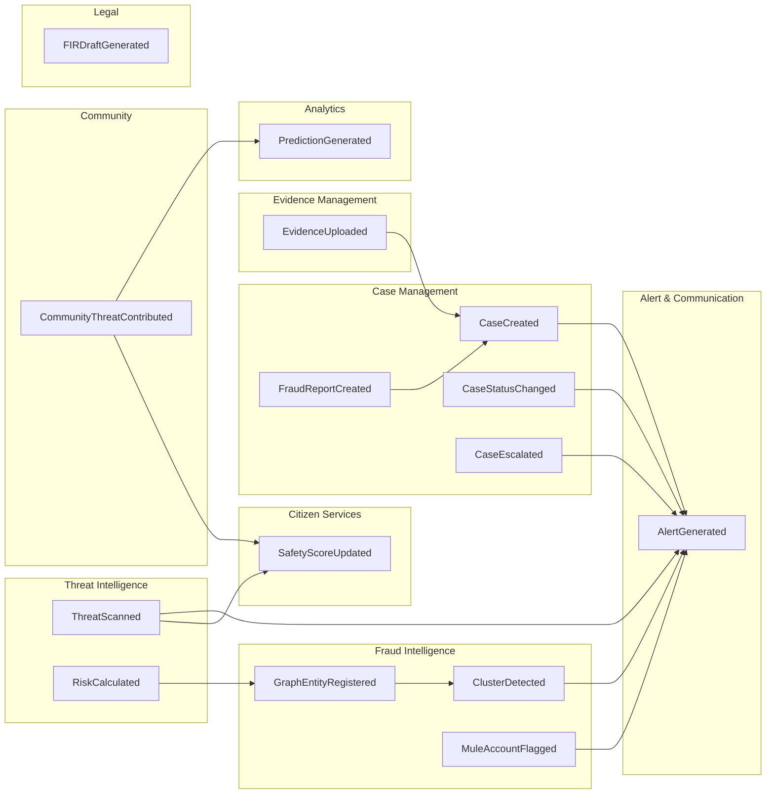

### Event Definitions

#### Event: ThreatScanned

**Trigger**: A ThreatScan completes analysis successfully.

**Payload**:
```pascal
EVENT ThreatScanned
  scanId: UUID
  citizenId: UUID
  scanType: Enum(TEXT, URL, VOICE)
  threatScore: ThreatScoreValue
  threatCategories: List of ThreatCategoryType
  indicatorCount: Integer
  timestamp: Timestamp
END EVENT
```

**Subscribers**:
- Citizen Services (update scan history, recalculate safety score)
- Alert & Communication (trigger alert if DANGER)
- Fraud Intelligence (register new threat indicators in graph)
- Predictive Analytics (feed prediction models)
- Community Intelligence (anonymized contribution if citizen opted in)

---

#### Event: RiskCalculated

**Trigger**: The Risk Engine completes deterministic scoring for a threat scan.

**Payload**:
```pascal
EVENT RiskCalculated
  scanId: UUID
  previousScore: ThreatScoreValue (nullable, for re-scans)
  newScore: ThreatScoreValue
  scoringFactors: List of (factorName: String, weight: Decimal, contribution: Integer)
  templateMatchConfidence: ConfidenceLevel (nullable)
  timestamp: Timestamp
END EVENT
```

**Subscribers**:
- Threat Intelligence (store final score)
- Fraud Intelligence (update entity risk profiles)
- Alert & Communication (escalate if score crossed threshold)

---

#### Event: FraudReportCreated

**Trigger**: A Citizen submits a validated fraud report.

**Payload**:
```pascal
EVENT FraudReportCreated
  reportId: UUID
  citizenId: UUID
  suspectIdentifiers: List of (type: String, value: String)
  incidentType: ThreatCategoryType
  estimatedLoss: MoneyAmount (nullable)
  jurisdiction: JurisdictionCode
  timestamp: Timestamp
END EVENT
```

**Subscribers**:
- Case Management (create new case)
- Fraud Intelligence (register suspect entities in graph)
- Alert & Communication (check for campaign patterns)
- Community Intelligence (anonymized trending feed)
- Financial Intelligence (if financial loss reported)

---

#### Event: EvidenceUploaded

**Trigger**: Evidence is successfully uploaded and hash-verified.

**Payload**:
```pascal
EVENT EvidenceUploaded
  evidenceId: UUID
  caseId: UUID
  uploadedBy: UUID
  evidenceType: Enum(SCREENSHOT, DOCUMENT, AUDIO, VIDEO, TRANSACTION_RECORD)
  hash: EvidenceHashValue
  sizeBytes: Integer
  timestamp: Timestamp
END EVENT
```

**Subscribers**:
- Case Management (update case timeline)
- Evidence Management (initiate chain of custody)
- Fraud Intelligence (if transaction record, feed graph)

---

#### Event: CaseCreated

**Trigger**: A new Case is created from a validated FraudReport.

**Payload**:
```pascal
EVENT CaseCreated
  caseId: UUID
  referenceNumber: CaseReferenceNumber
  reportId: UUID
  assignedOfficerId: UUID
  jurisdiction: JurisdictionCode
  priority: Enum(HIGH, MEDIUM, LOW)
  timestamp: Timestamp
END EVENT
```

**Subscribers**:
- Alert & Communication (notify assigned officer)
- Government Intelligence (update case statistics)
- Platform Administration (audit log)

---

#### Event: CaseStatusChanged

**Trigger**: A case transitions from one status to another.

**Payload**:
```pascal
EVENT CaseStatusChanged
  caseId: UUID
  referenceNumber: CaseReferenceNumber
  previousStatus: CaseStatus
  newStatus: CaseStatus
  changedBy: UUID
  reason: String
  timestamp: Timestamp
END EVENT
```

**Subscribers**:
- Alert & Communication (notify stakeholders)
- Citizen Services (update citizen's case status view)
- Government Intelligence (update resolution statistics)
- Platform Administration (audit log)

---

#### Event: CaseEscalated

**Trigger**: An investigating officer escalates a case to cyber cell.

**Payload**:
```pascal
EVENT CaseEscalated
  caseId: UUID
  referenceNumber: CaseReferenceNumber
  escalatedBy: UUID
  escalatedTo: Enum(CYBER_CELL, STATE_CYBER, CENTRAL_CYBER)
  reason: String
  previousAssignee: UUID
  timestamp: Timestamp
END EVENT
```

**Subscribers**:
- Case Management (reassign to cyber cell pool)
- Alert & Communication (notify escalation target)
- Government Intelligence (track escalation patterns)

---

#### Event: AlertGenerated

**Trigger**: The system determines an alert must be sent to one or more users.

**Payload**:
```pascal
EVENT AlertGenerated
  alertId: UUID
  severity: AlertSeverity
  targetUsers: List of UUID
  alertType: Enum(THREAT_WARNING, MULE_FLAG, CAMPAIGN_DETECTED, CASE_UPDATE, SYSTEM)
  title: String
  body: String
  relatedEntityId: UUID (nullable)
  expiresAt: Timestamp
  timestamp: Timestamp
END EVENT
```

**Subscribers**:
- Alert & Communication (dispatch notifications per user preferences)
- Platform Administration (audit log)

---

#### Event: GraphEntityRegistered

**Trigger**: A new entity is added to the fraud intelligence graph.

**Payload**:
```pascal
EVENT GraphEntityRegistered
  entityId: UUID
  entityType: Enum(PHONE, BANK_ACCOUNT, PERSON, UPI_ID, EMAIL, DEVICE, IP_ADDRESS)
  identifier: String
  sourceEventId: UUID
  initialRiskScore: Integer
  timestamp: Timestamp
END EVENT
```

**Subscribers**:
- Fraud Intelligence (check existing connections, trigger cluster analysis)
- Financial Intelligence (if BANK_ACCOUNT or UPI_ID type)
- Predictive Analytics (feed pattern detection)

---

#### Event: ClusterDetected

**Trigger**: Community detection algorithm identifies a new fraud cluster.

**Payload**:
```pascal
EVENT ClusterDetected
  clusterId: UUID
  memberEntityIds: List of UUID
  memberCount: Integer
  averageConnectionStrength: Decimal
  clusterRiskScore: Integer
  detectionMethod: String
  timestamp: Timestamp
END EVENT
```

**Subscribers**:
- Alert & Communication (generate alerts for affected users)
- Case Management (link related cases)
- Government Intelligence (update fraud network statistics)
- Predictive Analytics (feed evolution tracking)

---

#### Event: MuleAccountFlagged

**Trigger**: A bank account is identified as a suspected money mule.

**Payload**:
```pascal
EVENT MuleAccountFlagged
  muleAccountId: UUID
  accountIdentifier: BankAccountNumber
  flagReason: String
  evidenceSources: List of UUID
  confidenceLevel: ConfidenceLevel
  estimatedFlowVolume: MoneyAmount
  timestamp: Timestamp
END EVENT
```

**Subscribers**:
- Financial Intelligence (generate MuleAlert for bank)
- Alert & Communication (notify relevant bank analyst)
- Case Management (link to related cases)
- Government Intelligence (update mule statistics)

---

#### Event: PredictionGenerated

**Trigger**: Predictive analytics model produces a new prediction about emerging threats.

**Payload**:
```pascal
EVENT PredictionGenerated
  predictionId: UUID
  predictionType: Enum(EMERGING_THREAT, CAMPAIGN_FORECAST, REGIONAL_RISK, SEASONAL_PATTERN)
  confidence: ConfidenceLevel
  affectedRegions: List of JurisdictionCode
  predictedTimeframe: DateRange
  description: String
  timestamp: Timestamp
END EVENT
```

**Subscribers**:
- Alert & Communication (proactive warnings if high confidence)
- Government Intelligence (policy planning input)
- Citizen Services (personalized risk awareness)

---

#### Event: CommunityThreatContributed

**Trigger**: A citizen shares an anonymized threat report with the community.

**Payload**:
```pascal
EVENT CommunityThreatContributed
  contributionId: UUID
  anonymizedContributorHash: String
  threatType: ThreatCategoryType
  region: JurisdictionCode (state-level only)
  timestamp: Timestamp
END EVENT
```

**Subscribers**:
- Community Intelligence (trending analysis)
- Predictive Analytics (pattern detection)
- Citizen Services (update contributor's safety score)

---

#### Event: SafetyScoreUpdated

**Trigger**: A citizen's safety score is recalculated.

**Payload**:
```pascal
EVENT SafetyScoreUpdated
  citizenId: UUID
  previousScore: Integer
  newScore: Integer
  changeReason: Enum(SCAN_COMPLETED, LEARNING_COMPLETED, CLEAN_HISTORY, COMMUNITY_CONTRIBUTION, REPORT_FILED)
  timestamp: Timestamp
END EVENT
```

**Subscribers**:
- Citizen Services (update dashboard display)
- Education & Awareness (adjust recommendations)
- Alert & Communication (notify if significant drop)

---

#### Event: FIRDraftGenerated

**Trigger**: AI generates a FIR draft for a citizen's fraud report.

**Payload**:
```pascal
EVENT FIRDraftGenerated
  draftId: UUID
  caseId: UUID
  citizenId: UUID
  legalSections: List of String
  generationConfidence: ConfidenceLevel
  expiresAt: Timestamp
  timestamp: Timestamp
END EVENT
```

**Subscribers**:
- Citizen Services (notify citizen of available draft)
- Legal Services (queue for optional legal review)
- Case Management (link draft to case)


---

## SECTION 7: Business Rules

### 7.1 Threat Score Rules

```pascal
RULES ThreatScoring
  %% Score range and classification
  RULE score_range:
    ThreatScore.value MUST be in [0, 100]

  RULE classification_safe:
    IF ThreatScore.value IN [0, 29] THEN ThreatLevel = SAFE

  RULE classification_caution:
    IF ThreatScore.value IN [30, 69] THEN ThreatLevel = CAUTION

  RULE classification_danger:
    IF ThreatScore.value IN [70, 100] THEN ThreatLevel = DANGER

  RULE template_match_override:
    IF templateMatchConfidence > 0.90 THEN
      ThreatScore.value = MAX(ThreatScore.value, 80)
    END IF

  RULE scoring_deterministic:
    Given identical input AND identical indicator weights,
    the scoring algorithm MUST produce identical output
    (deterministic, not probabilistic)

  RULE minimum_factors:
    ThreatScore MUST include at least one contributing factor with explanation

  RULE confidence_attachment:
    Every ThreatIndicator contributing to score MUST carry a ConfidenceLevel
END RULES
```

### 7.2 Case Management Rules

```pascal
RULES CaseManagement
  %% Status transitions (state machine)
  RULE valid_transitions:
    ALLOWED: OPEN → INVESTIGATING
    ALLOWED: INVESTIGATING → ESCALATED
    ALLOWED: INVESTIGATING → CLOSED
    ALLOWED: ESCALATED → CLOSED
    FORBIDDEN: Any backward transition
    FORBIDDEN: OPEN → CLOSED (must investigate first)
    FORBIDDEN: OPEN → ESCALATED (must investigate first)

  RULE closure_requirement:
    WHEN Case.status changes to CLOSED THEN
      Case MUST have at least one CaseNote
      Case MUST have a resolution summary
    END WHEN

  RULE jurisdiction_matching:
    WHEN Case is assigned THEN
      CaseAssignment.officer.jurisdiction MUST match Case.jurisdiction
      EXCEPTION: CyberCellOfficer (cross-jurisdiction access)
    END WHEN

  RULE reference_number_format:
    CaseReferenceNumber format = "FR-" + YEAR(4 digits) + "-" + SEQUENCE(5 digits, zero-padded)
    EXAMPLE: FR-2024-00042

  RULE assignment_workload:
    PoliceOfficer active case count MUST NOT exceed 20
    IF at capacity THEN new assignments routed to next available officer

  RULE escalation_documentation:
    CaseEscalated event MUST include reason (minimum 20 characters)

  RULE duplicate_detection:
    FraudReport from same Citizen with same suspect identifier within 48 hours
    is flagged as potential duplicate and requires manual confirmation
END RULES
```

### 7.3 Evidence Rules

```pascal
RULES EvidenceManagement
  %% Integrity rules
  RULE hash_verification:
    ON every evidence access:
      computedHash = SHA256(evidence.content)
      IF computedHash != evidence.storedHash THEN
        RAISE EvidenceCompromised
        FLAG evidence as POTENTIALLY_TAMPERED
        LOG to AuditLog with CRITICAL severity
      END IF

  RULE retention_policy:
    Evidence MUST be retained for minimum 7 years after case closure
    Deletion before 7 years requires explicit legal authorization
    Deletion logged permanently in AuditLog

  RULE chain_of_custody:
    EvidenceChain MUST have no temporal gaps
    Every access/transfer creates a chain entry with:
      actor, action, timestamp, previous_entry_hash
    Gap detection flags evidence as potentially compromised

  RULE size_limits:
    Maximum single evidence file: 100 MB
    Supported types: SCREENSHOT, DOCUMENT, AUDIO, VIDEO, TRANSACTION_RECORD
    Unsupported types MUST be rejected at upload

  RULE custody_transfer:
    Transfer requires acknowledgment from BOTH sender and receiver
    Unacknowledged transfers timeout after 24 hours and revert
END RULES
```

### 7.4 Alert Rules

```pascal
RULES AlertManagement
  %% Campaign detection
  RULE campaign_detection:
    IF count(similar FraudReports within 48 hours) >= 3 THEN
      TRIGGER FraudCampaign detection workflow
    END IF
    Similarity measured by:
      - Same suspect phone/email/UPI (exact match)
      - Message template similarity > 80% (NLP cosine similarity)
      - Same target demographic (age group + region)

  RULE delivery_sla:
    Alert MUST be delivered within 5 minutes of generation
    IF delivery fails after 3 retries THEN
      ESCALATE to Platform Administration
      LOG SLA breach

  RULE notification_cap:
    Maximum 10 notifications per user per day
    EXCEPTION: CRITICAL severity bypasses the cap
    EXCEPTION: Explicit user opt-in to higher frequency

  RULE critical_bypass:
    CRITICAL alerts:
      - Bypass quiet hours
      - Bypass notification cap
      - Attempt ALL available channels
      - Require acknowledgment within 1 hour
      - Escalate if unacknowledged

  RULE preference_respect:
    Non-CRITICAL notifications MUST respect AlertPreference:
      - Channel selection
      - Quiet hours
      - Category filters
    Preference changes take effect within 5 minutes
END RULES
```

### 7.5 Safety Score Rules

```pascal
RULES SafetyScore
  RULE score_range:
    SafetyScore.value MUST be in [0, 100]

  RULE initial_score:
    New Citizen receives SafetyScore = 50

  RULE score_floor:
    SafetyScore MUST NOT drop below 10 (anti-discouragement floor)

  RULE factor_weights:
    Scan Frequency (regular scanning behavior): 25%
    Learning Completion (modules and quizzes): 20%
    Clean Scan History (low threat results): 25%
    Community Participation (contributions): 15%
    Report Filing (proactive reporting): 15%
    TOTAL: 100%

  RULE calculation_window:
    Score computed on rolling 90-day window
    Updated daily at midnight (user's timezone)

  RULE badge_threshold:
    IF SafetyScore >= 80 THEN citizen earns "Cyber Aware" badge
    IF SafetyScore >= 90 THEN citizen earns "Cyber Guardian" badge

  RULE score_explanation:
    Every score update MUST include breakdown by factor
    Citizen can view which factors are dragging score down
END RULES
```

### 7.6 Fraud Graph Rules

```pascal
RULES FraudGraph
  %% Entity rules
  RULE entity_types:
    Valid GraphEntity types: PHONE, BANK_ACCOUNT, PERSON, UPI_ID, EMAIL, DEVICE, IP_ADDRESS
    Each entity MUST have exactly one type (immutable after creation)

  RULE connection_strength:
    GraphConnection.strength MUST be in [0.0, 1.0]
    0.0 = theoretical (no evidence)
    0.5 = moderate (circumstantial evidence)
    1.0 = confirmed (direct evidence)

  RULE strength_decay:
    Connection strength decays by 10% per month without new reinforcing evidence
    Decay formula: newStrength = currentStrength * (0.9 ^ monthsWithoutEvidence)
    IF strength < 0.1 THEN connection is archived (soft-deleted)

  RULE cluster_formation:
    Minimum 3 entities required to form a FraudCluster
    Average internal connection strength MUST exceed 0.5
    IF member count drops below 3 THEN cluster is dissolved

  RULE cluster_risk:
    Cluster risk = SUM(entity.risk * entity.connectionCount) / SUM(entity.connectionCount)
    Weighted by connectivity (more connected entities influence more)

  RULE connection_types:
    Valid: CONTACTED, TRANSACTED, SHARED_DEVICE, SAME_NETWORK, REPORTED_TOGETHER, MONEY_FLOW
    Each connection MUST have exactly one type

  RULE dormancy:
    Entity with no new connections for 6 months → status = DORMANT
    Dormant entities excluded from active cluster calculations
    Reactivated if new connection appears
END RULES
```

### 7.7 FIR Rules

```pascal
RULES FIRGeneration
  RULE ai_label:
    ALL AI-generated FIR drafts MUST carry label:
      "AI-Generated — Human Review Required"
    Label MUST be visible and non-removable from system-generated content

  RULE human_review:
    FIRDraft MUST be reviewed and explicitly approved by citizen before filing
    System MUST NOT auto-file any FIR without human confirmation

  RULE legal_section_mapping:
    FIRDraft MUST reference at least one applicable legal section
    Sections drawn from: IPC, IT Act 2000, Prevention of Money Laundering Act

  RULE generation_sla:
    FIR draft generation MUST complete within 30 seconds of request

  RULE expiry:
    FIRDraft expires 7 days after generation without citizen action
    Expired drafts archived (not deleted)
    Citizen may request re-generation

  RULE accuracy_tracking:
    System tracks:
      - How often citizens modify AI-generated sections
      - Which sections are most frequently edited
      - Feedback incorporated into model improvement
END RULES
```

---

## SECTION 8: Fraud Intelligence Model (USP)

The Fraud Intelligence Graph is CyberShield AI's key differentiator — a real-time, evolving knowledge graph connecting fraud actors, victims, and infrastructure across cases.

### 8.1 Graph Nodes (Entity Types)

```pascal
STRUCTURE GraphNode
  %% 7 Entity Types in the Fraud Graph

  TYPE PhoneNode
    identifier: PhoneNumber
    firstSeen: Timestamp
    reportCount: Integer
    riskScore: Integer (0-100)
    status: Enum(ACTIVE, DORMANT, FLAGGED)
  END TYPE

  TYPE BankAccountNode
    identifier: BankAccountNumber
    firstSeen: Timestamp
    transactionVolume: MoneyAmount
    riskScore: Integer (0-100)
    muleConfidence: ConfidenceLevel
  END TYPE

  TYPE PersonNode
    anonymizedId: UUID
    knownAliases: List of String
    associatedIdentifiers: List of (type, value)
    riskScore: Integer (0-100)
  END TYPE

  TYPE UPINode
    identifier: UPIId
    firstSeen: Timestamp
    transactionFrequency: Integer (per day)
    riskScore: Integer (0-100)
  END TYPE

  TYPE EmailNode
    identifier: EmailAddress
    domainAge: Integer (days)
    reportCount: Integer
    riskScore: Integer (0-100)
  END TYPE

  TYPE DeviceNode
    fingerprint: String (anonymized device hash)
    firstSeen: Timestamp
    associatedAccounts: Integer
    riskScore: Integer (0-100)
  END TYPE

  TYPE IPAddressNode
    identifier: IPAddress
    geolocation: GeoCoordinate
    isVPN: Boolean
    isTOR: Boolean
    riskScore: Integer (0-100)
  END TYPE
END STRUCTURE
```

### 8.2 Graph Edges (Connection Types)

```pascal
STRUCTURE GraphEdge
  %% 6 Edge Types with Properties

  TYPE ContactedEdge
    %% Phone/Email communication between entities
    source: GraphNode
    target: GraphNode
    frequency: Integer            %% contact count
    lastContact: Timestamp
    strength: Decimal (0-1)
    evidence: List of UUID        %% supporting report IDs
  END TYPE

  TYPE TransactedEdge
    %% Financial transaction between accounts
    source: GraphNode (BankAccount | UPI)
    target: GraphNode (BankAccount | UPI)
    totalVolume: MoneyAmount
    transactionCount: Integer
    averageAmount: MoneyAmount
    lastTransaction: Timestamp
    strength: Decimal (0-1)
  END TYPE

  TYPE SharedDeviceEdge
    %% Multiple accounts accessed from same device
    source: GraphNode
    target: GraphNode (Device)
    accessCount: Integer
    lastAccess: Timestamp
    strength: Decimal (0-1)
  END TYPE

  TYPE SameNetworkEdge
    %% Entities operating from same IP/network
    source: GraphNode
    target: GraphNode
    coOccurrenceCount: Integer
    networkIdentifier: String
    strength: Decimal (0-1)
  END TYPE

  TYPE ReportedTogetherEdge
    %% Entities mentioned in same fraud report
    source: GraphNode
    target: GraphNode
    reportIds: List of UUID
    reportCount: Integer
    strength: Decimal (0-1)
  END TYPE

  TYPE MoneyFlowEdge
    %% Directed money movement (A → B)
    source: GraphNode (BankAccount | UPI)
    target: GraphNode (BankAccount | UPI)
    flowVolume: MoneyAmount
    flowCount: Integer
    averageDelay: Duration         %% time between receive and forward
    forwardingRatio: Decimal       %% % of received funds forwarded
    strength: Decimal (0-1)
  END TYPE
END STRUCTURE
```

### 8.3 Connection Strength Calculation

```pascal
PROCEDURE calculateConnectionStrength(edge)
  INPUT: edge of type GraphEdge
  OUTPUT: strength (Decimal 0.0-1.0)

  SEQUENCE
    baseStrength ← 0.0

    %% Factor 1: Evidence Count (0-0.3)
    evidenceFactor ← MIN(edge.evidenceCount / 10, 1.0) * 0.3

    %% Factor 2: Recency (0-0.25)
    daysSinceLastActivity ← DAYS_BETWEEN(edge.lastActivity, NOW())
    recencyFactor ← MAX(0, (1.0 - daysSinceLastActivity / 180)) * 0.25

    %% Factor 3: Frequency (0-0.25)
    frequencyFactor ← MIN(edge.frequency / 20, 1.0) * 0.25

    %% Factor 4: Corroboration (0-0.2)
    %% Multiple independent sources confirming same connection
    corroborationFactor ← MIN(edge.independentSources / 5, 1.0) * 0.2

    strength ← evidenceFactor + recencyFactor + frequencyFactor + corroborationFactor

    RETURN CLAMP(strength, 0.0, 1.0)
  END SEQUENCE
END PROCEDURE
```

**Strength Decay (6-Month Half-Life)**:

```pascal
PROCEDURE applyStrengthDecay(edge, currentDate)
  INPUT: edge of type GraphEdge, currentDate of type Date
  OUTPUT: updated edge with decayed strength

  SEQUENCE
    monthsInactive ← MONTHS_BETWEEN(edge.lastActivity, currentDate)

    IF monthsInactive > 0 THEN
      decayFactor ← 0.9 ^ monthsInactive      %% 10% decay per month
      edge.strength ← edge.strength * decayFactor

      IF edge.strength < 0.1 THEN
        edge.status ← ARCHIVED
      END IF
    END IF

    RETURN edge
  END SEQUENCE
END PROCEDURE
```

### 8.4 Confidence Model

```pascal
PROCEDURE calculateEdgeConfidence(edge)
  INPUT: edge of type GraphEdge
  OUTPUT: confidence of type ConfidenceLevel

  SEQUENCE
    %% Confidence is per-edge, evidence-based
    factors ← []

    %% Direct evidence (highest weight)
    IF edge has DIRECT_EVIDENCE (transaction records, screenshots) THEN
      factors.add(0.8)
    END IF

    %% Corroborating reports (medium weight)
    IF edge.reportCount >= 2 THEN
      factors.add(MIN(edge.reportCount * 0.1, 0.6))
    END IF

    %% System detection (lower weight, needs human confirmation)
    IF edge.detectedByAI AND NOT edge.humanConfirmed THEN
      factors.add(0.3)
    ELSE IF edge.detectedByAI AND edge.humanConfirmed THEN
      factors.add(0.7)
    END IF

    %% Temporal consistency (supporting factor)
    IF edge.activityPattern is CONSISTENT THEN
      factors.add(0.1)
    END IF

    confidence ← MIN(MAX(factors), 1.0)
    RETURN confidence
  END SEQUENCE
END PROCEDURE
```

### 8.5 Cluster Detection

```pascal
PROCEDURE detectFraudClusters(graph)
  INPUT: graph (full fraud intelligence graph)
  OUTPUT: List of FraudCluster

  SEQUENCE
    %% Step 1: Apply community detection algorithm
    communities ← COMMUNITY_DETECTION(graph, algorithm="louvain")

    %% Step 2: Filter by minimum requirements
    validClusters ← []

    FOR each community IN communities DO
      IF community.memberCount >= 3 THEN
        avgStrength ← AVERAGE(community.internalEdges.strength)

        IF avgStrength > 0.5 THEN
          cluster ← NEW FraudCluster
          cluster.members ← community.members
          cluster.averageStrength ← avgStrength
          cluster.riskScore ← calculateClusterRisk(community)
          validClusters.add(cluster)
        END IF
      END IF
    END FOR

    %% Step 3: Rank by risk
    SORT validClusters BY riskScore DESCENDING

    RETURN validClusters
  END SEQUENCE
END PROCEDURE

PROCEDURE calculateClusterRisk(community)
  INPUT: community (detected community subgraph)
  OUTPUT: riskScore (Integer 0-100)

  SEQUENCE
    totalWeightedRisk ← 0
    totalConnectionCount ← 0

    FOR each entity IN community.members DO
      entityWeight ← entity.connectionCount    %% More connected = more influential
      totalWeightedRisk ← totalWeightedRisk + (entity.riskScore * entityWeight)
      totalConnectionCount ← totalConnectionCount + entityWeight
    END FOR

    IF totalConnectionCount > 0 THEN
      riskScore ← totalWeightedRisk / totalConnectionCount
    ELSE
      riskScore ← 0
    END IF

    RETURN CLAMP(riskScore, 0, 100)
  END SEQUENCE
END PROCEDURE
```

### 8.6 Relationship Discovery

```pascal
PROCEDURE discoverRelationships(newEntity)
  INPUT: newEntity (newly registered GraphEntity)
  OUTPUT: List of discovered GraphConnections

  SEQUENCE
    discoveredConnections ← []

    %% Automatic Discovery Methods

    %% Method 1: Identifier Matching
    %% Check if entity's identifiers appear in existing reports
    matchingReports ← SEARCH reports WHERE suspect_identifiers CONTAINS newEntity.identifier
    FOR each report IN matchingReports DO
      FOR each otherIdentifier IN report.suspectIdentifiers DO
        IF otherIdentifier != newEntity.identifier THEN
          existingEntity ← FIND GraphEntity BY otherIdentifier
          IF existingEntity EXISTS THEN
            connection ← CREATE GraphConnection(
              source: newEntity,
              target: existingEntity,
              type: REPORTED_TOGETHER,
              strength: 0.3   %% Initial strength for report-based discovery
            )
            discoveredConnections.add(connection)
          END IF
        END IF
      END FOR
    END FOR

    %% Method 2: Transaction Pattern Matching
    IF newEntity.type IN [BANK_ACCOUNT, UPI_ID] THEN
      relatedTransactions ← FIND transactions INVOLVING newEntity.identifier
      FOR each transaction IN relatedTransactions DO
        counterparty ← FIND GraphEntity BY transaction.counterpartyId
        IF counterparty EXISTS THEN
          connection ← CREATE GraphConnection(
            source: newEntity,
            target: counterparty,
            type: TRANSACTED,
            strength: calculateConnectionStrength(transaction)
          )
          discoveredConnections.add(connection)
        END IF
      END FOR
    END IF

    %% Method 3: Device/Network Co-occurrence
    IF newEntity.type IN [DEVICE, IP_ADDRESS] THEN
      coOccurring ← FIND entities ACCESSED_FROM newEntity
      FOR each entity IN coOccurring DO
        connection ← CREATE GraphConnection(
          source: entity,
          target: newEntity,
          type: SHARED_DEVICE,
          strength: 0.4
        )
        discoveredConnections.add(connection)
      END FOR
    END IF

    %% Manual Discovery: Human analyst can add connections with evidence
    %% (handled separately through analyst workflow)

    RETURN discoveredConnections
  END SEQUENCE
END PROCEDURE
```

### 8.7 Network Evolution Tracking

```pascal
PROCEDURE trackNetworkEvolution(cluster, currentDate)
  INPUT: cluster of type FraudCluster, currentDate of type Date
  OUTPUT: EvolutionMetrics

  SEQUENCE
    %% Monthly Snapshots
    currentSnapshot ← captureSnapshot(cluster, currentDate)
    previousSnapshot ← GET snapshot FOR cluster AT (currentDate - 30 days)

    metrics ← NEW EvolutionMetrics

    %% Growth Tracking
    metrics.memberGrowth ← currentSnapshot.memberCount - previousSnapshot.memberCount
    metrics.connectionGrowth ← currentSnapshot.edgeCount - previousSnapshot.edgeCount
    metrics.volumeGrowth ← currentSnapshot.totalFlowVolume - previousSnapshot.totalFlowVolume

    %% Growth Rate Classification
    IF metrics.memberGrowth > 5 THEN
      metrics.growthClassification ← RAPIDLY_GROWING
    ELSE IF metrics.memberGrowth > 0 THEN
      metrics.growthClassification ← GROWING
    ELSE IF metrics.memberGrowth = 0 THEN
      metrics.growthClassification ← STABLE
    ELSE
      metrics.growthClassification ← SHRINKING
    END IF

    %% Dormancy Detection
    latestActivity ← MAX(cluster.members.lastActivityDate)
    daysSinceActivity ← DAYS_BETWEEN(latestActivity, currentDate)

    IF daysSinceActivity > 180 THEN
      metrics.dormancyStatus ← DORMANT
    ELSE IF daysSinceActivity > 90 THEN
      metrics.dormancyStatus ← POSSIBLY_DORMANT
    ELSE
      metrics.dormancyStatus ← ACTIVE
    END IF

    %% Store snapshot for future comparison
    STORE currentSnapshot

    RETURN metrics
  END SEQUENCE
END PROCEDURE

STRUCTURE EvolutionMetrics
  memberGrowth: Integer
  connectionGrowth: Integer
  volumeGrowth: MoneyAmount
  growthClassification: Enum(RAPIDLY_GROWING, GROWING, STABLE, SHRINKING)
  dormancyStatus: Enum(ACTIVE, POSSIBLY_DORMANT, DORMANT)
  snapshotDate: Date
END STRUCTURE
```

### Fraud Graph Architecture

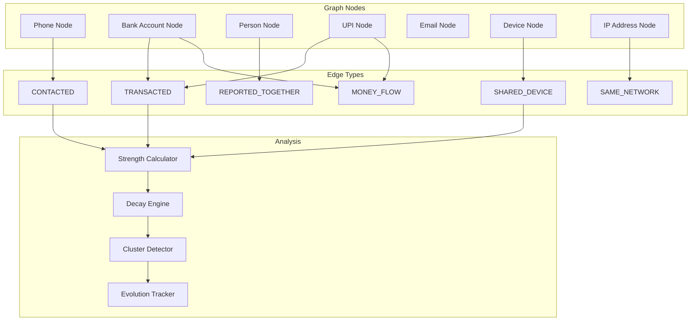


---

## SECTION 9: AI Domain Services

AI services in CyberShield are treated as domain services with clear interfaces, preconditions, and postconditions. They are NOT bounded contexts themselves — they serve the domain contexts.

### 9.1 Threat Analyzer (Text NLP)

```pascal
SERVICE ThreatAnalyzer
  PURPOSE: Analyze text content for fraud indicators using Natural Language Processing

  PROCEDURE analyzeText(content)
    INPUT: content (String, 1-10000 characters)
    OUTPUT: NLPAnalysisResult

    PRECONDITIONS:
      content is non-empty
      content length <= 10000 characters
      content is valid UTF-8

    POSTCONDITIONS:
      result contains at least one indicator assessment
      result.confidence is in [0.0, 1.0]
      processing time <= 1500ms

    SEQUENCE
      %% Step 1: Language detection and normalization
      language ← detectLanguage(content)
      normalizedContent ← normalize(content, language)

      %% Step 2: Feature extraction
      features ← extractFeatures(normalizedContent)
        features.urgencyScore        %% 0-1 urgency language detection
        features.authorityScore      %% 0-1 impersonation of authority
        features.financialPressure   %% 0-1 money-related pressure
        features.personalInfoRequest %% 0-1 asking for sensitive data
        features.linkPresence        %% Boolean
        features.templateMatch       %% 0-1 match against known templates

      %% Step 3: Classification
      indicators ← classifyIndicators(features)
      categories ← mapToCategories(indicators)
      confidence ← calculateOverallConfidence(indicators)

      RETURN NLPAnalysisResult(indicators, categories, confidence, features)
    END SEQUENCE
  END PROCEDURE
END SERVICE
```

### 9.2 URL Analyzer

```pascal
SERVICE URLAnalyzer
  PURPOSE: Analyze URLs for phishing, malware distribution, and reputation risks

  PROCEDURE analyzeURL(url)
    INPUT: url (String, valid URL format)
    OUTPUT: URLAnalysisResult

    PRECONDITIONS:
      url is syntactically valid URL
      url uses HTTP or HTTPS protocol

    POSTCONDITIONS:
      result includes domain reputation assessment
      result includes redirect chain (if any)
      result.redirectHops <= 5
      processing time <= 2000ms

    SEQUENCE
      %% Step 1: URL normalization and expansion
      expandedUrl ← expandShortUrl(url, maxHops=5)
      domain ← extractDomain(expandedUrl)

      %% Step 2: Domain analysis
      domainAge ← lookupDomainAge(domain)
      sslValid ← checkSSLCertificate(domain)
      reputation ← queryReputationDatabase(domain)

      %% Step 3: Content analysis (if accessible)
      IF url is accessible AND NOT known-malicious THEN
        pageContent ← fetchSafely(expandedUrl)
        contentRisk ← analyzePageContent(pageContent)
      END IF

      %% Step 4: Structural analysis
      obfuscation ← detectObfuscation(url)
        obfuscation.homoglyph       %% lookalike characters
        obfuscation.subdomain       %% excessive subdomains
        obfuscation.pathManipulation %% deceptive paths

      %% Step 5: Scoring
      riskFactors ← compilefactors(domainAge, sslValid, reputation, obfuscation)
      score ← computeURLRisk(riskFactors)

      IF reputation = KNOWN_MALICIOUS THEN
        score ← MAX(score, 95)       %% Override: known bad
      END IF

      RETURN URLAnalysisResult(score, riskFactors, expandedUrl, redirectChain)
    END SEQUENCE
  END PROCEDURE
END SERVICE
```

### 9.3 Voice Analyzer

```pascal
SERVICE VoiceAnalyzer
  PURPOSE: Detect deepfake audio and social engineering speech patterns

  PROCEDURE analyzeVoice(audioData)
    INPUT: audioData (binary audio, max 5 minutes duration)
    OUTPUT: VoiceAnalysisResult

    PRECONDITIONS:
      audioData is valid audio format (WAV, MP3, OGG, M4A)
      audioData duration <= 5 minutes
      audioData size <= 50 MB

    POSTCONDITIONS:
      result includes deepfake confidence score
      result includes transcript
      result includes timestamped markers
      processing time <= 10 seconds

    SEQUENCE
      %% Step 1: Audio preprocessing
      normalizedAudio ← preprocessAudio(audioData)

      %% Step 2: Speech-to-text transcription
      transcript ← transcribe(normalizedAudio)

      %% Step 3: Deepfake detection
      deepfakeScore ← detectSynthetic(normalizedAudio)
        %% Analyzes: spectral artifacts, temporal inconsistencies,
        %% voice naturalness, breathing patterns

      %% Step 4: Social engineering pattern detection
      speechPatterns ← analyzeSpeechPatterns(transcript)
        speechPatterns.urgency         %% "act now", "immediately"
        speechPatterns.authority        %% "police", "bank manager", "government"
        speechPatterns.isolation        %% "don't tell anyone"
        speechPatterns.financialPressure %% "transfer money", "pay fine"

      %% Step 5: Timestamped markers
      markers ← generateMarkers(transcript, speechPatterns)
        %% Key moments with start/end timestamps

      %% Step 6: Combined scoring
      IF deepfakeScore.confidence > 0.80 THEN
        classification ← DANGER
      ELSE
        classification ← scoreFromPatterns(speechPatterns)
      END IF

      RETURN VoiceAnalysisResult(
        transcript, deepfakeScore, speechPatterns, markers, classification
      )
    END SEQUENCE
  END PROCEDURE
END SERVICE
```

### 9.4 Risk Engine (DETERMINISTIC Scoring)

```pascal
SERVICE RiskEngine
  PURPOSE: Compute deterministic threat scores from analysis results
  NOTE: This is NOT ML-based. It uses RULE-BASED deterministic computation.

  PROCEDURE computeRisk(analysisResults)
    INPUT: analysisResults (combined outputs from analyzers)
    OUTPUT: ThreatScoreValue with full factor breakdown

    PRECONDITIONS:
      analysisResults contains at least one analyzer output
      All analyzer outputs have valid confidence levels

    POSTCONDITIONS:
      result.score is in [0, 100]
      result is DETERMINISTIC (same input → same output)
      result includes factor breakdown
      result includes classification (SAFE/CAUTION/DANGER)

    SEQUENCE
      score ← 0
      factors ← []

      %% Factor 1: NLP indicators (weight: 30%)
      IF analysisResults.nlp EXISTS THEN
        nlpContribution ← 0
        nlpContribution += analysisResults.nlp.urgencyScore * 8
        nlpContribution += analysisResults.nlp.authorityScore * 7
        nlpContribution += analysisResults.nlp.financialPressure * 8
        nlpContribution += analysisResults.nlp.personalInfoRequest * 7
        factors.add("NLP Indicators", nlpContribution)
        score += nlpContribution
      END IF

      %% Factor 2: URL risk (weight: 25%)
      IF analysisResults.url EXISTS THEN
        urlContribution ← analysisResults.url.riskScore * 0.25
        factors.add("URL Risk", urlContribution)
        score += urlContribution
      END IF

      %% Factor 3: Voice/deepfake (weight: 25%)
      IF analysisResults.voice EXISTS THEN
        voiceContribution ← analysisResults.voice.deepfakeScore * 15
        voiceContribution += analysisResults.voice.speechPatterns.total * 10
        factors.add("Voice Analysis", voiceContribution)
        score += voiceContribution
      END IF

      %% Factor 4: Template matching (weight: 20%)
      IF analysisResults.templateMatch EXISTS THEN
        templateContribution ← analysisResults.templateMatch.confidence * 20
        factors.add("Known Pattern Match", templateContribution)
        score += templateContribution
      END IF

      %% Template override rule
      IF analysisResults.templateMatch.confidence > 0.90 THEN
        score ← MAX(score, 80)
      END IF

      %% Clamp and classify
      score ← CLAMP(ROUND(score), 0, 100)
      classification ← classifyScore(score)

      RETURN ThreatScoreValue(score, classification, factors)
    END SEQUENCE
  END PROCEDURE

  PROCEDURE classifyScore(score)
    IF score IN [0, 29] THEN RETURN SAFE
    IF score IN [30, 69] THEN RETURN CAUTION
    IF score IN [70, 100] THEN RETURN DANGER
  END PROCEDURE
END SERVICE
```

### 9.5 Explanation Engine

```pascal
SERVICE ExplanationEngine
  PURPOSE: Translate technical analysis results into plain-language explanations for citizens

  PROCEDURE generateExplanation(threatResult, language)
    INPUT: threatResult (ThreatResult), language (LanguageCode)
    OUTPUT: PlainLanguageExplanation

    PRECONDITIONS:
      threatResult is complete (has score, indicators, categories)
      language is supported (en, hi, ta, te, bn, mr, gu, kn, ml, pa, or)

    POSTCONDITIONS:
      explanation is in requested language
      explanation uses no technical jargon
      explanation includes actionable advice
      reading level <= Grade 8

    SEQUENCE
      %% Step 1: Select explanation template based on classification
      template ← selectTemplate(threatResult.classification, language)

      %% Step 2: Populate with specific findings
      findings ← []
      FOR each indicator IN threatResult.indicators DO
        finding ← translateIndicator(indicator, language)
        findings.add(finding)
      END FOR

      %% Step 3: Generate actionable advice
      advice ← generateAdvice(threatResult.categories, language)

      %% Step 4: Compose explanation
      explanation ← compose(template, findings, advice)
        explanation.summary       %% 1-2 sentence overview
        explanation.details       %% What was found (bullet points)
        explanation.advice        %% What to do next
        explanation.confidence    %% How sure we are

      RETURN explanation
    END SEQUENCE
  END PROCEDURE
END SERVICE
```

### 9.6 Fraud Graph AI

```pascal
SERVICE FraudGraphAI
  PURPOSE: Pattern recognition and anomaly detection in the fraud intelligence graph

  PROCEDURE detectPatterns(graphSubset)
    INPUT: graphSubset (portion of fraud graph for analysis)
    OUTPUT: List of DetectedPattern

    PRECONDITIONS:
      graphSubset contains at least 5 entities
      graphSubset connections have valid strength values

    POSTCONDITIONS:
      each pattern has confidence score
      patterns are non-overlapping (entity belongs to max 1 pattern per run)

    SEQUENCE
      patterns ← []

      %% Pattern 1: Money Mule Chain
      muleChains ← detectMuleChains(graphSubset)
        %% Look for: A→B→C→D with >80% forwarding ratio at each hop

      %% Pattern 2: Coordinated Campaign
      campaigns ← detectCoordination(graphSubset)
        %% Look for: Multiple sources using same templates/timing

      %% Pattern 3: Account Farming
      farms ← detectAccountFarms(graphSubset)
        %% Look for: Many accounts, same device/IP, short lifespan

      %% Pattern 4: Circular Flow (Layering)
      circles ← detectCircularFlows(graphSubset)
        %% Look for: Money returning to origin through intermediaries

      patterns ← MERGE(muleChains, campaigns, farms, circles)
      SORT patterns BY confidence DESCENDING

      RETURN patterns
    END SEQUENCE
  END PROCEDURE
END SERVICE
```

### 9.7 Prediction Engine

```pascal
SERVICE PredictionEngine
  PURPOSE: Generate weekly predictions about emerging fraud trends

  PROCEDURE generatePredictions(historicalData, currentTrends)
    INPUT: historicalData (90-day rolling window), currentTrends (active trends)
    OUTPUT: List of Prediction

    PRECONDITIONS:
      historicalData covers at least 30 days
      currentTrends is non-empty

    POSTCONDITIONS:
      predictions have timeframe (next 7 days)
      predictions have confidence score
      predictions include affected regions
      maximum 10 predictions per run

    SEQUENCE
      predictions ← []

      %% Method 1: Trend extrapolation
      FOR each trend IN currentTrends DO
        IF trend.velocity is INCREASING THEN
          prediction ← extrapolate(trend, days=7)
          prediction.type ← EMERGING_THREAT
          predictions.add(prediction)
        END IF
      END FOR

      %% Method 2: Seasonal pattern matching
      seasonalMatches ← matchSeasonalPatterns(historicalData, currentDate)
      FOR each match IN seasonalMatches DO
        prediction ← createSeasonalPrediction(match)
        prediction.type ← SEASONAL_PATTERN
        predictions.add(prediction)
      END FOR

      %% Method 3: Campaign forecast
      activeCampaigns ← FILTER currentTrends WHERE type = CAMPAIGN
      FOR each campaign IN activeCampaigns DO
        forecast ← forecastCampaignSpread(campaign)
        prediction.type ← CAMPAIGN_FORECAST
        predictions.add(forecast)
      END FOR

      %% Limit and rank
      SORT predictions BY confidence DESCENDING
      RETURN TOP(predictions, 10)
    END SEQUENCE
  END PROCEDURE
END SERVICE
```

### 9.8 Recommendation Engine

```pascal
SERVICE RecommendationEngine
  PURPOSE: Personalize content and safety recommendations for each citizen

  PROCEDURE generateRecommendations(citizenProfile)
    INPUT: citizenProfile (citizen's history, score, behavior)
    OUTPUT: List of Recommendation

    PRECONDITIONS:
      citizenProfile has at least 7 days of activity history
      citizenProfile.safetyScore is computed

    POSTCONDITIONS:
      recommendations are personalized (not generic)
      recommendations are actionable
      maximum 5 recommendations per request
      no repeated recommendations within 7 days

    SEQUENCE
      recommendations ← []

      %% Factor 1: Safety score weak areas
      weakFactors ← identifyWeakFactors(citizenProfile.safetyScore)
      FOR each factor IN weakFactors DO
        rec ← createImprovementRecommendation(factor)
        recommendations.add(rec)
      END FOR

      %% Factor 2: Recent scan results
      IF citizenProfile.recentScans have HIGH_RISK results THEN
        rec ← createAwarenessRecommendation(recentThreats)
        recommendations.add(rec)
      END IF

      %% Factor 3: Incomplete learning
      incompletModules ← getIncompleteModules(citizenProfile)
      IF incompletModules is NOT EMPTY THEN
        rec ← createLearningRecommendation(incompletModules)
        recommendations.add(rec)
      END IF

      %% Factor 4: Regional threats
      regionalThreats ← getTrendingThreats(citizenProfile.region)
      IF regionalThreats is NOT EMPTY THEN
        rec ← createRegionalWarning(regionalThreats)
        recommendations.add(rec)
      END IF

      %% Deduplicate and limit
      recommendations ← deduplicate(recommendations, citizenProfile.recentRecommendations)
      RETURN TOP(recommendations, 5)
    END SEQUENCE
  END PROCEDURE
END SERVICE
```

---

## SECTION 10: Validation Rules

### 10.1 Citizen Validation

```pascal
VALIDATION Citizen
  REQUIRED FIELDS:
    phoneNumber: PhoneNumber         %% Must be valid Indian mobile
    displayName: String              %% 2-50 characters
    language: LanguageCode           %% Preferred language

  OPTIONAL FIELDS:
    email: EmailAddress
    dateOfBirth: Date                %% Must be >= 13 years old
    address: Address
    aadhaarLastFour: String          %% Last 4 digits only (privacy)

  CONSTRAINTS:
    phoneNumber MUST be unique across all Citizens
    email (if provided) MUST be unique across all Citizens
    displayName MUST contain only Unicode letters, spaces, and hyphens
    dateOfBirth (if provided) MUST make citizen >= 13 years old
    aadhaarLastFour (if provided) MUST be exactly 4 digits
    At least one of (phoneNumber, email) MUST be verified
END VALIDATION
```

### 10.2 FraudReport Validation

```pascal
VALIDATION FraudReport
  REQUIRED FIELDS:
    reporterId: UUID                 %% Must be valid Citizen
    incidentDescription: String      %% 50-5000 characters
    incidentDate: Date               %% When fraud occurred/attempted
    suspectIdentifiers: List         %% At least 1 identifier
    incidentType: ThreatCategoryType %% Category of fraud

  OPTIONAL FIELDS:
    estimatedLoss: MoneyAmount       %% Financial loss (if any)
    evidenceIds: List of UUID        %% Attached evidence
    location: GeoCoordinate          %% Where it happened
    additionalVictims: List of UUID  %% Known co-victims

  CONSTRAINTS:
    incidentDescription length MUST be between 50 and 5000 characters
    incidentDate MUST NOT be in the future
    incidentDate MUST be within last 365 days
    suspectIdentifiers MUST contain at least 1 entry
    Each suspectIdentifier MUST be one of: PhoneNumber, EmailAddress, UPIId, BankAccountNumber, URL
    estimatedLoss.amount (if provided) MUST be > 0
    evidenceIds (if provided) each MUST reference existing Evidence
    Duplicate check: same reporter + same suspect + within 48 hours → flag
END VALIDATION
```

### 10.3 Case Validation

```pascal
VALIDATION Case
  REQUIRED FIELDS:
    referenceNumber: CaseReferenceNumber  %% System-generated
    reportId: UUID                        %% Source FraudReport
    status: CaseStatus                    %% Current status
    jurisdiction: JurisdictionCode        %% Owning jurisdiction
    priority: Enum(HIGH, MEDIUM, LOW)     %% Case priority
    createdAt: Timestamp                  %% Creation time

  OPTIONAL FIELDS:
    assignedOfficerId: UUID               %% Primary investigator
    relatedCaseIds: List of UUID          %% Linked cases
    resolutionSummary: String             %% Required at closure

  CONSTRAINTS:
    referenceNumber MUST be unique
    reportId MUST reference existing FraudReport
    status transitions MUST follow state machine rules
    jurisdiction MUST be valid JurisdictionCode
    assignedOfficerId (if set) MUST reference active PoliceOfficer or CyberCellOfficer
    assignedOfficer jurisdiction MUST match case jurisdiction (unless CyberCell)
    resolutionSummary MUST be present when status = CLOSED (min 50 chars)
    relatedCaseIds (if provided) MUST reference existing Cases
END VALIDATION
```

### 10.4 Evidence Validation

```pascal
VALIDATION Evidence
  REQUIRED FIELDS:
    caseId: UUID                     %% Must belong to a case
    uploadedBy: UUID                 %% Uploader identity
    evidenceType: Enum(SCREENSHOT, DOCUMENT, AUDIO, VIDEO, TRANSACTION_RECORD)
    contentHash: EvidenceHashValue   %% SHA-256 computed at upload
    fileName: String                 %% Original file name
    fileSize: Integer                %% Size in bytes
    mimeType: String                 %% Valid MIME type

  OPTIONAL FIELDS:
    description: String              %% Evidence description
    metadata: Map                    %% Additional metadata

  CONSTRAINTS:
    caseId MUST reference existing Case
    uploadedBy MUST be authorized for the case
    fileSize MUST be <= 104857600 (100 MB)
    mimeType MUST match evidenceType:
      SCREENSHOT: image/png, image/jpeg, image/webp
      DOCUMENT: application/pdf, text/plain, application/msword
      AUDIO: audio/wav, audio/mpeg, audio/ogg, audio/mp4
      VIDEO: video/mp4, video/webm
      TRANSACTION_RECORD: application/json, text/csv, application/pdf
    contentHash MUST be valid SHA-256 (64 hex characters)
    fileName MUST NOT contain path separators
    description (if provided) MUST be <= 500 characters
END VALIDATION
```

### 10.5 ThreatScan Validation

```pascal
VALIDATION ThreatScan
  REQUIRED FIELDS:
    citizenId: UUID                  %% Requesting citizen
    scanType: Enum(TEXT, URL, VOICE) %% Type of scan
    content: varies by scanType      %% The content to analyze

  OPTIONAL FIELDS:
    sourceContext: String            %% Where content came from (e.g., "WhatsApp")
    language: LanguageCode           %% Content language hint

  CONSTRAINTS:
    citizenId MUST reference active Citizen
    Citizen daily scan count MUST NOT exceed 50

    IF scanType = TEXT THEN:
      content MUST be String, 1-10000 characters
      content MUST be valid UTF-8
      content MUST NOT be empty/whitespace-only

    IF scanType = URL THEN:
      content MUST be valid URL format
      content MUST use HTTP or HTTPS protocol
      content length MUST be <= 2048 characters

    IF scanType = VOICE THEN:
      content MUST be valid audio binary
      content duration MUST be <= 5 minutes
      content size MUST be <= 52428800 (50 MB)
      content format MUST be WAV, MP3, OGG, or M4A
END VALIDATION
```

### 10.6 GraphEntity Validation

```pascal
VALIDATION GraphEntity
  REQUIRED FIELDS:
    entityType: Enum(PHONE, BANK_ACCOUNT, PERSON, UPI_ID, EMAIL, DEVICE, IP_ADDRESS)
    identifier: String               %% Unique identifier for entity
    sourceEventId: UUID              %% What created this entity

  OPTIONAL FIELDS:
    metadata: Map                    %% Type-specific metadata
    manualNotes: String              %% Analyst notes

  CONSTRAINTS:
    identifier MUST be unique within same entityType
    identifier format MUST match entityType:
      PHONE: valid PhoneNumber format
      BANK_ACCOUNT: valid BankAccountNumber format
      UPI_ID: valid UPIId format
      EMAIL: valid EmailAddress format
      DEVICE: 64-character hex fingerprint
      IP_ADDRESS: valid IPAddress format
      PERSON: UUID (anonymized)
    sourceEventId MUST reference existing domain event
    Entity type is IMMUTABLE after creation
    manualNotes (if provided) MUST be <= 1000 characters
END VALIDATION
```

### 10.7 Alert Validation

```pascal
VALIDATION Alert
  REQUIRED FIELDS:
    severity: AlertSeverity          %% CRITICAL, HIGH, MEDIUM, LOW
    alertType: Enum(THREAT_WARNING, MULE_FLAG, CAMPAIGN_DETECTED, CASE_UPDATE, SYSTEM)
    title: String                    %% Alert title
    body: String                     %% Alert content
    targetUsers: List of UUID        %% Recipients
    expiresAt: Timestamp             %% When alert expires

  OPTIONAL FIELDS:
    relatedEntityId: UUID            %% Related scan, case, etc.
    campaignId: UUID                 %% If part of campaign alert
    actionUrl: String                %% Deep link for action

  CONSTRAINTS:
    title length MUST be between 5 and 100 characters
    body length MUST be between 10 and 1000 characters
    targetUsers MUST contain at least 1 valid user
    targetUsers MUST contain at most 10000 users (batch for larger)
    expiresAt MUST be in the future
    expiresAt MUST be within 30 days from creation
    relatedEntityId (if provided) MUST reference existing entity
    campaignId (if provided) MUST reference existing FraudCampaign
    actionUrl (if provided) MUST be valid internal URL path
    CRITICAL alerts MUST have expiresAt >= 24 hours from creation
END VALIDATION
```


---

## SECTION 11: Future Extensibility

The domain model is designed to accommodate future integrations without modifying existing bounded contexts. New capabilities plug in through published domain events, anti-corruption layers, and open host services.

### 11.1 Bank APIs Integration

**Integration Point**: Financial Intelligence Context (downstream consumer)

**Approach**:
- Banks expose transaction monitoring APIs
- CyberShield consumes through Anti-Corruption Layer (ACL)
- ACL translates bank-specific data formats to domain value objects
- MuleAlert delivery uses bank's webhook endpoints

**Domain Impact**: NONE on existing model
- New adapter class in Financial Intelligence
- New external event: BankTransactionReceived
- Existing MuleAlert entity gains new delivery channel

```pascal
ADAPTER BankAPIAdapter
  %% Translates bank-specific formats to domain objects
  PROCEDURE translateTransaction(bankTransaction)
    INPUT: bankTransaction (bank-specific format)
    OUTPUT: TransactionChain entry (domain format)

    %% ACL ensures bank format changes don't propagate inward
    RETURN mapToTransactionEntry(bankTransaction)
  END PROCEDURE
END ADAPTER
```

### 11.2 CERT-In Integration

**Integration Point**: Government Intelligence Context + Alert & Communication Context

**Approach**:
- CERT-In publishes national threat advisories
- CyberShield subscribes to CERT-In feeds via ACL
- Advisories enriched with local intelligence and distributed
- CyberShield contributes anonymized trend data back to CERT-In

**Domain Impact**: NONE on existing model
- New inbound event: CERTInAdvisoryReceived
- Existing Alert entity used for dissemination
- Government Intelligence gains new data source

### 11.3 NPCI (UPI) Integration

**Integration Point**: Financial Intelligence Context

**Approach**:
- NPCI provides UPI transaction dispute data
- Real-time UPI fraud alerts consumed through Open Host Service
- Enriches GraphEntity nodes of type UPI_ID
- Bidirectional: CyberShield reports suspicious UPIs back

**Domain Impact**: NONE on existing model
- New adapter for NPCI data format
- Existing UPIId value object already compatible
- GraphEntity gains richer metadata for UPI nodes

### 11.4 Browser Extension

**Integration Point**: Citizen Services Context + Threat Intelligence Context

**Approach**:
- Extension acts as a new scan submission channel
- Submits URLs automatically for analysis
- Displays inline threat indicators on web pages
- Uses existing ThreatScan workflow unchanged

**Domain Impact**: NONE on existing model
- New channel added to ThreatScan.sourceContext
- Existing scan pipeline processes extension submissions identically
- AlertPreference gains "browser_extension" as notification channel

### 11.5 Android App (Mobile Platform)

**Integration Point**: All citizen-facing contexts

**Approach**:
- Mobile app is a presentation layer consuming domain APIs
- Call interception → VoiceAnalysis pipeline
- SMS interception → Text NLP pipeline
- Push notifications via existing Alert infrastructure

**Domain Impact**: NONE on existing model
- New notification channel: MOBILE_PUSH
- Existing domain services consumed through API gateway
- SafetyScore, LearningProgress work identically

### 11.6 Insurance Module

**Integration Point**: New Bounded Context (Cyber Insurance)

**Approach**:
- Create new bounded context: "Cyber Insurance"
- Consumes events: SafetyScoreUpdated, ThreatScanned, FraudReportCreated
- SafetyScore used as risk factor for premium calculation
- Claim filing linked to existing Case through Published Language

**Domain Impact**: MINIMAL — adds one new bounded context
- New context subscribes to existing events (no producer changes)
- New entities: InsurancePolicy, Claim, Premium
- Communicates via domain events (no coupling to existing contexts)

```pascal
%% New bounded context - does NOT modify existing ones
BOUNDED CONTEXT CyberInsurance
  SUBSCRIBES TO:
    SafetyScoreUpdated    → adjust premium risk factor
    FraudReportCreated    → enable claim filing
    CaseStatusChanged     → update claim status

  NEW ENTITIES:
    InsurancePolicy, Claim, Premium, RiskAssessment

  PUBLISHES:
    ClaimFiled, PolicyActivated, PremiumAdjusted
END BOUNDED CONTEXT
```

### 11.7 Telecom Integration

**Integration Point**: Threat Intelligence Context + Fraud Intelligence Context

**Approach**:
- Telecom providers share call metadata (anonymized)
- Enriches VoiceAnalysis with caller reputation data
- Known spam/scam numbers flagged proactively
- CyberShield contributes flagged numbers back to telecoms

**Domain Impact**: NONE on existing model
- New adapter for telecom data format
- Existing PhoneNumber value object already compatible
- GraphEntity (PHONE type) gains telecom-sourced reputation data
- New external event: TelecomCallerFlagged

### Extensibility Architecture

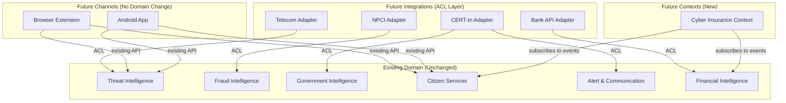

### Extensibility Principles

| Principle | Implementation |
|---|---|
| Open/Closed | Existing contexts open for extension via events, closed for modification |
| Anti-Corruption Layer | External systems NEVER directly access domain entities |
| Published Language | Cross-context communication uses domain events with stable schemas |
| Event Versioning | Events use semantic versioning; consumers handle backward-compatible changes |
| Adapter Pattern | Each external integration has its own adapter, isolating format changes |
| Feature Flags | New integrations controlled by FeatureFlag for gradual rollout |

---

## Correctness Properties

The following properties MUST hold true for the CyberShield AI domain model at all times. These are universal quantification statements that can be verified through property-based testing.

### Property 1: Threat Score Consistency

```pascal
PROPERTY threat_score_classification_consistency:
  FOR ALL threatScore IN ThreatScores:
    (threatScore.value >= 0 AND threatScore.value <= 29) IMPLIES threatScore.classification = SAFE
    AND (threatScore.value >= 30 AND threatScore.value <= 69) IMPLIES threatScore.classification = CAUTION
    AND (threatScore.value >= 70 AND threatScore.value <= 100) IMPLIES threatScore.classification = DANGER
```

### Property 2: Template Match Override

```pascal
PROPERTY template_override_minimum:
  FOR ALL scan IN ThreatScans:
    IF scan.templateMatchConfidence > 0.90 THEN
      scan.threatScore.value >= 80
```

### Property 3: Case Status Transition Validity

```pascal
PROPERTY case_status_valid_transitions:
  FOR ALL statusChange IN CaseStatusChanges:
    (statusChange.from = OPEN AND statusChange.to = INVESTIGATING)
    OR (statusChange.from = INVESTIGATING AND statusChange.to = ESCALATED)
    OR (statusChange.from = INVESTIGATING AND statusChange.to = CLOSED)
    OR (statusChange.from = ESCALATED AND statusChange.to = CLOSED)
    %% No other transitions are valid
```

### Property 4: Evidence Integrity

```pascal
PROPERTY evidence_hash_immutability:
  FOR ALL evidence IN Evidences:
    evidence.hash.computedAt <= NOW()
    AND SHA256(evidence.content) = evidence.hash.value
    %% Hash computed at creation never changes; content matches hash
```

### Property 5: Cluster Minimum Size

```pascal
PROPERTY fraud_cluster_minimum_members:
  FOR ALL cluster IN FraudClusters WHERE cluster.status != DISSOLVED:
    cluster.memberCount >= 3
```

### Property 6: Cluster Average Strength

```pascal
PROPERTY fraud_cluster_strength_threshold:
  FOR ALL cluster IN FraudClusters WHERE cluster.status = ACTIVE:
    AVERAGE(cluster.internalConnections.strength) > 0.5
```

### Property 7: Connection Strength Bounds

```pascal
PROPERTY connection_strength_range:
  FOR ALL connection IN GraphConnections:
    connection.strength >= 0.0 AND connection.strength <= 1.0
```

### Property 8: Safety Score Bounds

```pascal
PROPERTY safety_score_bounded:
  FOR ALL citizen IN Citizens:
    citizen.safetyScore.value >= 10 AND citizen.safetyScore.value <= 100
```

### Property 9: Alert Delivery SLA

```pascal
PROPERTY alert_delivery_within_sla:
  FOR ALL alert IN Alerts WHERE alert.status = DELIVERED:
    (alert.deliveredAt - alert.createdAt) <= 5 MINUTES
```

### Property 10: FIR AI Label Presence

```pascal
PROPERTY fir_always_labeled:
  FOR ALL fir IN FIRDrafts:
    fir.label CONTAINS "AI-Generated"
    AND fir.label CONTAINS "Human Review Required"
```

### Property 11: Case Closure Requires Note

```pascal
PROPERTY case_closure_requires_note:
  FOR ALL case IN Cases WHERE case.status = CLOSED:
    COUNT(case.notes) >= 1
    AND case.resolutionSummary IS NOT NULL
    AND LENGTH(case.resolutionSummary) >= 50
```

### Property 12: Evidence Chain Continuity

```pascal
PROPERTY evidence_chain_no_gaps:
  FOR ALL evidence IN Evidences:
    FOR ALL consecutive_entries (entry_i, entry_i+1) IN evidence.chain:
      entry_i+1.timestamp > entry_i.timestamp
      AND entry_i+1.previousEntryHash = HASH(entry_i)
```

### Property 13: Risk Engine Determinism

```pascal
PROPERTY risk_scoring_deterministic:
  FOR ALL (input_a, input_b) WHERE input_a = input_b:
    RiskEngine.computeRisk(input_a) = RiskEngine.computeRisk(input_b)
    %% Same input always produces same output
```

### Property 14: Campaign Detection Threshold

```pascal
PROPERTY campaign_requires_minimum_reports:
  FOR ALL campaign IN FraudCampaigns:
    COUNT(campaign.relatedReports) >= 3
```

### Property 15: Jurisdiction Assignment Match

```pascal
PROPERTY officer_jurisdiction_match:
  FOR ALL assignment IN CaseAssignments:
    assignment.officer.role = CYBER_CELL_OFFICER
    OR assignment.officer.jurisdiction MATCHES assignment.case.jurisdiction
```

### Property 16: Notification Daily Cap

```pascal
PROPERTY notification_daily_limit:
  FOR ALL user IN Users:
    FOR ALL day IN Days:
      COUNT(notifications WHERE user = user AND date = day AND severity != CRITICAL) <= 10
```

### Property 17: Mule Account Dual Source

```pascal
PROPERTY mule_requires_dual_evidence:
  FOR ALL mule IN MuleAccounts WHERE mule.status = CONFIRMED:
    COUNT(DISTINCT(mule.evidenceSources)) >= 2
```

### Property 18: Value Object Immutability

```pascal
PROPERTY value_objects_immutable:
  FOR ALL vo IN ValueObjects:
    AFTER creation, no field of vo can be modified
    %% Value objects can only be replaced, never mutated
```

---

## Testing Strategy

### Property-Based Testing Approach

**Property Test Library**: fast-check (JavaScript/TypeScript)

Property-based tests should validate all 18 correctness properties above by generating random valid domain objects and asserting invariants hold.

Key property test areas:
1. ThreatScore classification boundaries (test with random scores 0-100)
2. Case status transition machine (test random transition sequences)
3. Connection strength decay (test with random time intervals)
4. Cluster formation/dissolution (test with random entity additions/removals)
5. SafetyScore factor calculations (test with random factor values)

### Unit Testing Approach

Each bounded context tested in isolation:
- Aggregate invariant enforcement
- Value object validation rules
- Domain event generation and payload correctness
- Business rule enforcement

### Integration Testing Approach

Cross-context event flows:
- ThreatScanned → GraphEntityRegistered → ClusterDetected → AlertGenerated
- FraudReportCreated → CaseCreated → EvidenceUploaded → FIRDraftGenerated
- MuleAccountFlagged → MuleAlert → BankAnalyst notification

