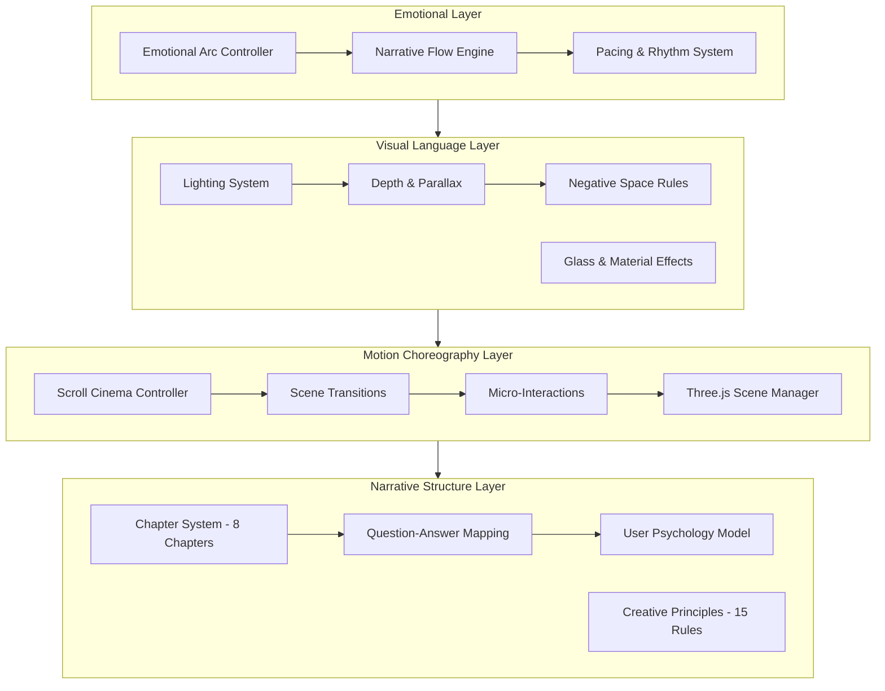
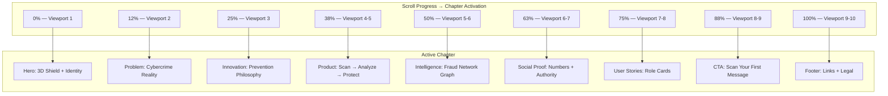
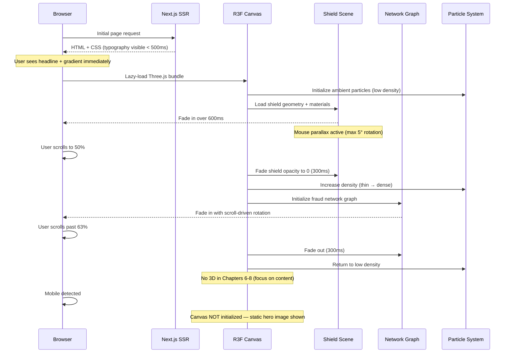

# Design Document: CyberShield AI — Experience Strategy & Creative Direction

## Overview

CyberShield AI Experience Strategy is the cinematic and emotional blueprint for how the landing page communicates trust, intelligence, and protection to Indian citizens facing digital threats. This document governs the temporal emotional arc, narrative structure, visual language, Three.js philosophy, motion choreography, user psychology mapping, and creative principles that transform a marketing page into a story — one that moves visitors from curiosity to conviction in under 60 seconds.

This is not UI design, component code, or implementation specification. This is the creative direction document — the brief that guides every visual, motion, and narrative decision on the public-facing landing experience. It bridges the design system tokens (P04), information architecture (P03), and frontend component architecture into a unified emotional experience that feels like cinema, not a brochure.

The landing page must accomplish one mission: convince an Indian citizen that CyberShield AI will protect their family from cybercrime — and that starting is effortless. Every pixel, every animation frame, every word serves this singular narrative purpose.

## Architecture

### Experience Layer Architecture



### Emotional Arc Across Chapters

```mermaid
graph LR
    subgraph Act1["Act I — The World As It Is"]
        C1[Ch1: Awe + Curiosity]
        C2[Ch2: Recognition + Concern]
    end

    subgraph Act2["Act II — A New Kind of Shield"]
        C3[Ch3: Understanding + Interest]
        C4[Ch4: Clarity + Trust]
        C5[Ch5: Impressiveness + Confidence]
    end

    subgraph Act3["Act III — Join the Shield"]
        C6[Ch6: Validation + Trust Amplification]
        C7[Ch7: Inclusivity + Personal Relevance]
        C8[Ch8: Confidence + Action + Relief]
    end

    C1 -->|"Wonder builds"| C2
    C2 -->|"Empathy opens"| C3
    C3 -->|"Logic satisfies"| C4
    C4 -->|"Depth impresses"| C5
    C5 -->|"Proof validates"| C6
    C6 -->|"Belonging forms"| C7
    C7 -->|"Conviction peaks"| C8
```



### Scroll-to-Chapter Mapping



### 3D Scene Lifecycle on Landing Page



### Motion Timing Diagram

```mermaid
graph LR
    subgraph Enter["Element Enter Timing"]
        E1["Fade: opacity 0→1, 300ms, ease-default"]
        E2["Translate: Y 20px→0, 300ms, ease-default"]
        E3["Stagger: 50-80ms between siblings"]
        E4["Trigger: element 20% into viewport"]
    end

    subgraph Exit["Element Exit Timing"]
        X1["Fade: opacity 1→0, 150ms, ease-out"]
        X2["Translate: Y 0→-10px, 150ms, ease-out"]
        X3["No stagger on exit (simultaneous)"]
    end

    subgraph Scene["3D Scene Timing"]
        S1["Camera move: 800ms, GSAP ease"]
        S2["Object dissolve: 400ms, cross-fade"]
        S3["Particle density: continuous with scroll"]
        S4["Shield parallax: immediate, dampened"]
    end

    subgraph Micro["Micro-interaction Timing"]
        M1["Hover response: 0ms delay, 100ms duration"]
        M2["CTA lift: translateY -2px, 100ms"]
        M3["Card elevation: shadow-1→2, 150ms"]
        M4["Counter animate: 800ms on first visible"]
        M5["Phone float: ±3px, 4s loop, ease-in-out"]
    end

    Enter --> Exit
    Exit --> Scene
    Scene --> Micro
```



---

## Section 1: Brand Emotion — Temporal Arc

### The Emotional Timeline

The landing page is a 60-second emotional journey. Every second is choreographed.

**0–5 seconds — Arrival (Awe + Curiosity)**

- Feeling: "Something important is here. Something beautiful. I want to understand."
- Visual: A 3D shield emerges from a particle field — slow, confident, inevitable
- Audio equivalent: A single deep note that resonates in the chest
- The user's subconscious registers: premium quality, serious purpose, technical depth
- Typography visible immediately (< 500ms) — the 3D is a reward, not a gate
- Background: Deep Navy (#0A1628) gradient, no hard edges, infinite depth feeling

**5–15 seconds — Recognition (Relevance + Personal Connection)**

- Feeling: "This is about MY safety. This matters to ME."
- Visual: The shield transforms into a protective field encompassing the headline
- The headline lands with gravitas — not shouting, not whispering, stating
- The user's brain connects: cybercrime → my family → my parents' phones → this product
- Subtext appears with deliberate timing (stagger 80ms per word cluster)
- The connection is emotional, not logical — fear without panic, awareness without alarm

**15–30 seconds — Understanding (Clarity + Trust)**

- Feeling: "I understand what this does. It's simple. It's powerful."
- Visual: Clean typography explains the value proposition in one crystalline sentence
- The complexity of AI fraud detection is made accessible through metaphor
- The scroll has introduced the problem, and now the solution feels inevitable
- Motion slows — content is the star, animation supports but never competes
- User begins to trust because the page respects their intelligence

**30–60 seconds — Conviction (Confidence + Urgency to Act)**

- Feeling: "I need this. My family needs this. How do I start?"
- Visual: Social proof, authority signals, the CTA emerges as the only logical next step
- Numbers tell the story: scans performed, threats blocked, families protected
- The CTA is not an interruption — it's the climax the narrative has been building toward
- Urgency without pressure: "Start protecting your family" not "LIMITED TIME OFFER"
- Post-CTA promise: immediate value (scan result in seconds, not hours)

---

## Section 2: Experience Narrative

### The Story Structure (Three-Act Architecture)

**Act I — "The World as It Is" (Problem Statement)**

India's digital population is under siege. 1.4 billion people, 800 million internet users, and a cybercrime industry that grows faster than the economy. Every day, ordinary citizens — mothers, fathers, grandparents, students — lose money to scams they couldn't recognize. A WhatsApp message from a "bank." A call from a "police officer." A link that looks exactly like a government portal.

Current tools fail because they react AFTER the damage. They're forensic, not preventive. By the time traditional security kicks in, the money is gone, the data is stolen, the trust is broken.

The emotional register here is empathy, not fear-mongering. We acknowledge the threat without exploiting anxiety.

**Act II — "A New Kind of Shield" (Solution Revelation)**

CyberShield AI doesn't wait for the attack to succeed. It thinks before the scam reaches you.

- Intelligence that connects dots humans can't see — pattern recognition across millions of data points
- AI that reads a message the way a trained investigator would, but in 2 seconds instead of 2 hours
- A shield that grows stronger with every citizen it protects — community intelligence that compounds

The tone shifts from empathy to empowerment. The user is not a victim being rescued — they're a participant being equipped.

**Act III — "Join the Shield" (Call to Action)**

You're not just downloading an app — you're joining a movement. Every message you scan makes the community safer. Every threat you flag strengthens the network. Every citizen who joins makes the shield more intelligent.

- Start protecting yourself in 30 seconds
- No credit card, no complex setup, no learning curve
- Scan your first suspicious message right now

The emotional climax: confidence without arrogance, urgency without pressure, action without friction.

**Complete Emotional Arc:**
Opening Wonder → Personal Recognition → Empathetic Concern → Logical Understanding → Impressed Confidence → Validated Trust → Personal Belonging → Decisive Action

---

## Section 3: Landing Chapters — The Eight Scenes

Each chapter answers exactly ONE question in the user's mind. No chapter does double duty.

### Chapter 1: "What is this?" — Hero

**Purpose:** Arrest attention, create wonder, establish premium quality in 5 seconds  
**Duration:** 1 viewport height (100vh)  
**Emotion:** Awe → Curiosity  

**Visual Composition:**
- Center: 3D shield emerging from particle field (R3F, lazy-loaded)
- Above shield: Product name "CyberShield AI" in Inter 600, 14px tracking
- Below shield: Headline — "AI-Powered Protection for Every Indian Citizen"
- Sub-headline (staggered entry, +200ms): One sentence value proposition
- Background: Deep Navy (#0A1628) → slightly lighter gradient toward bottom
- Particles: Sparse, slow-moving, low opacity (0.3), providing depth without distraction

**3D Behavior:**
- Shield emerges from scattered particles → assembles into form (2s animation on load)
- Mouse parallax: ±5° rotation tracking cursor position (dampened, 60fps)
- Scroll response: shield subtly scales down (0.95) and increases opacity as user begins to scroll
- Mobile fallback: High-quality static illustration of the shield, commissioned in brand style

**Typography Hierarchy:**
- Product name: Inter 500, 12-14px, letter-spacing 2px, uppercase, Electric Indigo (#4F46E5)
- Headline: Inter 700, 48-64px, white (#F8FAFC), max-width 720px, centered
- Sub-headline: Inter 400, 18-20px, rgba(255,255,255,0.7), max-width 560px

### Chapter 2: "Why should I care?" — The Problem

**Purpose:** Create emotional connection through relatable threat scenarios  
**Duration:** 1.5 viewport heights (150vh)  
**Emotion:** Recognition → Concern  

**Visual Composition:**
- Statistics presented as large typography (not charts): "₹1.25 Lakh Crore lost to cybercrime in 2024"
- Each statistic occupies its own viewport-moment (scroll-triggered reveal)
- Contextual human framing: "That's one family's savings every 3 seconds"
- Color: Numbers in Electric Indigo (#4F46E5), context in white, background remains dark
- No imagery of victims or distress — the numbers alone carry emotional weight

**Animation:**
- Statistics fade in as typography-first (number counter-up animation: 800ms)
- Contextual sentence appears 300ms after number settles
- Between stats: breathing room (40vh of gradient space)

### Chapter 3: "What makes this different?" — The Innovation

**Purpose:** Explain the Prevention > Reaction philosophy clearly  
**Duration:** 1.5 viewport heights (150vh)  
**Emotion:** Understanding → Interest  

**Visual Composition:**
- Split concept: "Before" (traditional tools) vs "After" (CyberShield AI)
- NOT a literal split-screen — sequential reveal: show the old way, then transform into the new way
- Old way: "Alert: You were scammed 3 days ago" (faded, less important)
- New way: "Blocked: This message is a scam. Here's why." (vibrant, confident)
- Visual metaphor: Shield crack (old) → Shield whole (new) — using 3D bridge from Chapter 1

**Animation:**
- "Old way" enters muted (opacity 0.5, desaturated)
- Pause (reader comprehends)
- "New way" enters bold (full opacity, Electric Indigo accent)
- The contrast does the selling — no additional explanation needed

### Chapter 4: "How does it actually work?" — The Product

**Purpose:** Demonstrate the scan → analyze → protect flow with demo-like clarity  
**Duration:** 2 viewport heights (200vh) — the densest chapter, needs space  
**Emotion:** Clarity → Trust  

**Visual Composition:**
- Phone mockup (centered, subtle float animation: ±3px, 4s loop)
- Three sequential moments animated with scroll progress:
  1. Message arrives on phone screen (suspicious WhatsApp message appears)
  2. AI analysis overlay (scan lines, processing indicators, NLP breakdown)
  3. Threat score reveal (Danger: 87/100 in Rose, with explanation bullets)
- Background shifts slightly warmer (still dark, but a hint of navy-to-indigo gradient)
- NOT interactive — animated to FEEL like a demo without requiring user input

**Animation Choreography:**
- Phone enters from bottom (translateY 40px → 0, 400ms)
- Message "types in" with scroll progress (character-by-character feel)
- Analysis phase: subtle scan-line overlay (horizontal, 200ms sweep)
- Score reveals with emphasis easing (800ms, scale 0.8 → 1.0)
- Explanation bullets stagger in (50ms apart)

**Typography in Phone:**
- Message text: Inter 400, 14px (realistic message sizing)
- Score number: Inter 700, 32px, Rose (#DC2626) for danger
- Explanation: Inter 400, 12px, muted white

### Chapter 5: "How smart is the AI?" — Intelligence

**Purpose:** Show the depth of the fraud intelligence network — most impressive visual  
**Duration:** 1.5 viewport heights (150vh)  
**Emotion:** Impressiveness → Confidence  

**Visual Composition:**
- Abstract network graph (Three.js): Nodes represent threat actors, edges represent connections
- NOT a literal data visualization — an artistic interpretation of intelligence
- Clusters light up sequentially (scroll-driven), showing how the AI connects disparate fraud signals
- Central node pulses (the AI), connections radiate outward
- Background: darkest section of the page (near-black: #060D1A)

**3D Behavior:**
- Graph rotates slowly with scroll (Y-axis, max 45° total rotation across chapter)
- Nodes: small glowing spheres (Emerald for identified, Amber for suspicious, Rose for confirmed threat)
- Edges: thin lines with pulse animation (data flowing between nodes)
- On entry: nodes appear one by one (50ms stagger), edges draw between them
- Total polygons: < 30K (performance budget for this scene)

**Typography Overlay:**
- Headline: "Intelligence That Sees What Humans Can't"
- Sub-text: Brief explanation of network analysis (2 sentences max)
- Positioned: left-aligned, giving the 3D graph 60% of viewport width

### Chapter 6: "Who else uses this?" — Social Proof

**Purpose:** Build credibility through authority and numbers  
**Duration:** 1.5 viewport heights (150vh)  
**Emotion:** Validation → Trust Amplification  

**Visual Composition:**
- Large animated counters: "2.4M+ Scans Performed" / "847K+ Threats Blocked" / "12 State Police Partners"
- Each counter gets its own moment (scroll-triggered, 800ms count-up animation)
- Below counters: Partner logo row (government seals, police insignia, bank logos) — muted, not colorful
- Below logos: 2-3 testimonial cards (glass effect, floating)
- Human context for each number: "That's one family protected every 3 seconds"

**Animation:**
- Numbers count up from 0 on first visibility (800ms, eased deceleration)
- Partner logos fade in as a row (200ms, simultaneous, opacity 0.6 — not competing with numbers)
- Testimonial cards stagger in from bottom (80ms apart, glass material with blur)
- NO 3D in this section — typography and human proof carry the weight

**Design Caution:**
- This chapter risks feeling generic. The "human context" lines differentiate it.
- Numbers alone don't build trust — the framing does ("one family every 3 seconds" > "2.4 million scans")

### Chapter 7: "Who is it for?" — User Stories

**Purpose:** Show all types of people benefit — universality without genericness  
**Duration:** 1.5 viewport heights (150vh)  
**Emotion:** Inclusivity → Personal Relevance  

**Visual Composition:**
- 4 cards in a grid (2×2 desktop, stacked mobile):
  - Citizen: "A mother in Mumbai scans her father's suspicious call" — icon: Shield
  - Police: "An inspector maps a fraud ring across 3 states in minutes" — icon: Network
  - Government: "A policy maker sees threat trends before they become crises" — icon: Chart
  - Bank: "An analyst detects money mule patterns before transfers complete" — icon: Lock
- Each card: glass effect background, single icon, role title, one-sentence story
- Cards are NOT feature lists — they're human narratives in one line

**Animation:**
- Cards enter with stagger (80ms between cards)
- Elevation increases on hover (shadow-1 → shadow-2, 150ms)
- Border color shifts subtly on hover (rgba(79,70,229,0.3) — Electric Indigo hint)
- NO click action — these are story cards, not navigation

**Emotional Framing:**
- Stories, not features. "Scan messages" becomes "A mother protects her aging father"
- Each story implicitly says: "People like you already need this"
- The variety (citizen, police, government, bank) communicates scale and seriousness

### Chapter 8: "How do I start?" — Call to Action

**Purpose:** Convert interest into action with zero friction  
**Duration:** 1 viewport height (100vh) — no scroll needed within this chapter  
**Emotion:** Confidence → Action → Relief  

**Visual Composition:**
- Centered, clean, minimal — the most whitespace-heavy chapter
- Headline: "Scan Your First Message Free" — Inter 700, 36-48px
- Sub-text: "No sign-up required. Paste a suspicious message and see CyberShield in action."
- Input: Single text area or phone number input (clear, large, inviting)
- Button: "Scan Now" — Electric Indigo (#4F46E5), prominent but not aggressive
- Below CTA: Trust reinforcer — "Trusted by 12 State Police Departments"
- Background: Returns to Deep Navy, clean, confident

**Animation:**
- Headline enters with authority (translateY 20px → 0, 400ms)
- Input field fades in (+200ms after headline)
- Button appears last (+100ms after input) — the culmination
- Button hover: subtle lift (-2px Y) + shadow increase
- NO distracting animations — all attention on the action

**Design Philosophy:**
- The CTA is earned, not forced. Eight chapters of narrative built to this moment.
- Friction removed: no pricing, no sign-up form, no "learn more" detours
- Immediate value promise: "See results in seconds" — instant gratification after investment of attention
- Post-action: success state shows scan result immediately (designed in product UX, not here)

---

## Section 4: Visual Language

### Lighting

- **Ambient:** Soft, cool-toned directional light from top-left at 45° — the default for all content
- **Accent:** Single warm highlight on focal elements (subtle, color temperature shift, not brightness blast)
- **3D scenes:** One key light (cool white), one fill light (20% intensity, blue tint), no rim light (avoids gaming aesthetic)
- **Never:** Flat even lighting, harsh cast shadows, multiple colored lights, neon glow effects
- **Philosophy:** "Gallery lighting" — the content is the art, light exists only to reveal it with dignity

### Depth System

Three distinct layers create hierarchy without borders or containers:

| Layer | Content | Z-Behavior | Visual Treatment |
|-------|---------|-------------|-----------------|
| Background (z: -1) | Particles, gradients, ambient 3D | Fixed or slow parallax | Low opacity, blurred edges |
| Midground (z: 0) | Typography, cards, content | Standard scroll | Full opacity, crisp rendering |
| Foreground (z: 1) | Navigation, floating stats, CTAs | Sticky or elevated | Glass effect, shadow-3, interactive |

- Parallax offset between layers: max 8px on scroll (subtle, never nauseating)
- Depth creates visual hierarchy without needing borders, dividers, or background color blocks
- Mobile: layers collapse to 2 (background + content) — no parallax

### Negative Space

- Content occupies maximum 60% of any viewport section (40% is breathing room)
- Between chapters: minimum 80vh of gradient/darkness (full breathing space)
- Within chapters: 128px vertical spacing between elements (desktop), 80px (mobile)
- Horizontal margins: 15% each side desktop (content in center 70%), full-bleed on mobile with 24px padding
- Philosophy: "If you're afraid of whitespace, you're not confident in your content"
- The space IS the design. It communicates luxury, confidence, and respect for attention.

### Glass Effects

- **Application:** Navigation overlay, floating statistics cards, testimonial cards only
- **Formula:** `background: rgba(10, 22, 40, 0.8)` + `backdrop-filter: blur(12px)` + `border: 1px solid rgba(255, 255, 255, 0.08)`
- **Border radius:** 12px for cards, 8px for smaller elements
- **Never on:** Body text containers, hero sections, primary content areas (readability first)
- **Principle:** Glass is seasoning, not the meal. Two glass elements visible simultaneously is the maximum.

### Color in Context

| Element | Color | Opacity | Purpose |
|---------|-------|---------|---------|
| Page background | #0A1628 → #060D1A | 1.0 | Depth, premium darkness |
| Primary text | #F8FAFC | 1.0 | Maximum readability |
| Secondary text | #F8FAFC | 0.7 | Hierarchy without new colors |
| Accent elements | #4F46E5 (Electric Indigo) | 1.0 | Interactive, brand identity |
| Safe indicators | #059669 (Emerald) | 1.0 | Status: safe |
| Warning indicators | #D97706 (Amber) | 1.0 | Status: caution |
| Danger indicators | #DC2626 (Rose) | 1.0 | Status: threat confirmed |
| Decorative elements | Various | 0.1–0.3 | Atmosphere, never attention-grabbing |

### Visual Rhythm

- Alternate: Text-heavy section → Visual-heavy section → Text → Visual (never two of the same consecutively)
- Each chapter has ONE focal point — the eye should never wonder "where do I look?"
- Consistent vertical spacing between chapters: 128px desktop, 80px mobile
- Content density varies inversely with emotional weight (heavier emotion = more space)

---

## Section 5: Three.js Philosophy

### Purpose of 3D

3D on this landing page is NOT decoration. It is NOT a technology demo. It is storytelling.

Every 3D element must answer: "What does this help the user UNDERSTAND that 2D cannot?"

| 3D Element | Communicates | Why 3D specifically |
|------------|-------------|---------------------|
| Shield (Hero) | Brand identity, protection, premium quality | Assembly-from-particles tells a story of construction/formation |
| Network Graph (Ch5) | Intelligence connections, AI depth | Spatial relationships between fraud actors require 3 dimensions |
| Ambient Particles | Atmosphere, digital environment | Creates depth perception impossible in 2D |

### Where 3D Must NOT Appear

- **Product demo (Ch4):** Phone mockup with animated UI is clearer than 3D phone
- **Statistics (Ch6):** Typography communicates numbers better than any 3D chart
- **Testimonials (Ch6):** Human quotes need human clarity, not 3D distraction
- **CTA (Ch8):** The action must have zero visual competition
- **Any section where text readability is primary** — 3D competes with reading

### 3D Interaction Rules

| Scene | Interaction | Constraint |
|-------|-------------|------------|
| Shield (Hero) | Mouse parallax | Max ±5° rotation, dampened (lerp 0.05) |
| Network Graph (Ch5) | Scroll-driven rotation | Y-axis only, max 45° total, no user mouse control |
| Particles (ambient) | None | Autonomous, ambient, ignored by user |
| All scenes | Never click-to-interact | This is cinema, not a game |

### Performance Budget

- Total canvas triangles: < 100K across all visible scenes
- Shield scene: < 50K triangles
- Network graph: < 30K triangles (nodes as instanced spheres)
- Particles: < 20K (instanced points, not meshes)
- Target: 60fps minimum on mid-range devices (2020+ laptops)
- Auto-degradation: if frame time > 18ms for 10 consecutive frames, reduce particle count by 50%
- Mobile: NO Three.js initialization. Static hero image. No exceptions.
- Loading: Canvas lazy-loaded, never blocks First Contentful Paint
- Reduced motion preference: show final static frame of each scene, no animation

---

## Section 6: Motion Philosophy

### Scroll as Camera Movement

The scroll IS the camera. Each scroll increment moves the user deeper into the story, like a slow dolly push through a designed space.

**Principles:**
- Scrolling feels like a slow camera push through a gallery — each chapter is a room you arrive in
- No sudden jumps — smooth eased transitions between scenes
- Scroll speed: natural (1:1 with finger). Scroll hijacking is forbidden.
- The page respects the user's scroll velocity — no forced pacing
- Scroll progress drives 3D scene state (not time-based animation)

### Chapter Transitions

The space BETWEEN chapters is as designed as the chapters themselves.

```
Chapter N content
  ↓ fade out (150ms, ease-out)
  ↓ 
  ↓ [40-80vh breathing space — gradient/darkness]
  ↓
  ↓ fade in from below (translateY 20px→0, 300ms, ease-default)
Chapter N+1 content
```

- Previous chapter fades out: opacity 1→0, 150ms, ease-out
- Breathing space: 40-80vh of gradient (not empty — subtle color shift maintains flow)
- Next chapter enters: translateY 20px→0, opacity 0→1, 300ms, ease-default
- Children within chapter stagger: 50ms between siblings
- No element enters before the previous chapter fully exits viewport

### Scroll-Triggered Animation Rules

| Property | Value | Notes |
|----------|-------|-------|
| Trigger point | Element 20% into viewport | Consistent, predictable |
| Direction | Always bottom-to-top | Never horizontal slide-in |
| Opacity | 0 → 1 | Always fade, never pop |
| Translation | Y-axis only: 20px → 0 | Consistent, subtle |
| Duration | 300-500ms | Heavier elements = longer |
| Stagger | 50-80ms between siblings | Creates rhythm |
| Easing | cubic-bezier(0.4, 0, 0.2, 1) | ease-default from design system |
| Repeat | Never — animate once only | Scroll up doesn't re-trigger |

### Micro-Interactions

| Element | Trigger | Animation | Duration |
|---------|---------|-----------|----------|
| Nav links | Hover | Underline slides in from left | 200ms |
| CTA button | Hover | translateY(-2px) + shadow increase | 100ms |
| Cards | Hover | elevation shadow-1 → shadow-2 + border color | 150ms |
| Stat numbers | First visible | Count-up from 0 | 800ms |
| Phone mockup | Ambient | Float ±3px (translateY loop) | 4000ms |
| Logo | None | Static — logos don't animate | — |
| Body text | None | Static — text doesn't animate on hover | — |

### Hover State Philosophy

- Delay: 0ms (instant acknowledgment)
- Duration: 100ms (fast but perceptible)
- Easing: ease-default
- Constraint: max 8% background darkening, max 2px translate, max 1 property animated
- Never: dramatic scale changes, color inversions, rotation, multiple simultaneous changes
- All hover states must have a 1:1 matching keyboard focus state for accessibility

### Loading Choreography

| Stage | Target Time | Behavior |
|-------|-------------|----------|
| HTML + CSS | < 500ms | Typography, gradients, layout skeleton visible |
| Hero headline | < 800ms | Full text readable, even without 3D |
| 3D canvas init | < 2000ms | Fades in over 600ms once geometry ready |
| Below-fold | Lazy | Streams as user scrolls, never pre-loaded |
| Full page | < 4000ms | Complete interactive state on broadband |

- Never: full-page loader, progress bar, blank screen, loading spinner
- Always: progressive enhancement (content first, decoration second)

### 3D Scene Transitions

- Camera moves: GSAP-driven, 800ms, custom ease (power2.inOut)
- Object morph/dissolve: cross-fade over 400ms (not hard cut)
- Particle density: continuous interpolation tied to scroll progress (lerp)
- Scene swap (shield → network): 300ms fade-out of old, 300ms fade-in of new, 200ms overlap

---

## Section 7: Narrative Flow — Question-Answer Scroll

Every scroll position answers exactly one question in the user's mind. The page is a conversation:

| Scroll % | User's Internal Question | Chapter | Answer Strategy |
|----------|--------------------------|---------|-----------------|
| 0% | "What is this?" | Hero | 3D shield + "AI-Powered Public Safety" |
| 12% | "Why does this matter to me?" | Problem | Cybercrime statistics with human context |
| 25% | "How is this different from others?" | Innovation | Prevention vs Reaction comparison |
| 38% | "How does it actually work?" | Product | Scan → Analyze → Protect animated flow |
| 50% | "How powerful is the AI?" | Intelligence | Fraud network visualization (3D) |
| 63% | "Can I trust this?" | Social Proof | Numbers + authority signals + testimonials |
| 75% | "Is this for people like me?" | User Stories | Role cards with one-line human narratives |
| 88% | "How do I start?" | CTA | Simple input + "Scan Now" button |
| 100% | "What else should I know?" | Footer | Links, legal, social, language selector |

### Pacing Rules

- No chapter exceeds 2 viewport heights (200vh) — maximum content density
- The fastest chapter: CTA (Chapter 8) at exactly 1 viewport (100vh) — no scroll within
- The slowest chapter: Product Demo (Chapter 4) at 2 viewports — needs space for animation sequence
- Total page length: 8-10 viewport heights (well-paced, never feels infinite)
- The user should reach the CTA within 45-60 seconds of moderate scrolling
- Every chapter is independently comprehensible (works even if user jumps via nav)

### Narrative Handoffs

Each chapter ends with an implicit forward-pull that draws the user to scroll further:

| Chapter | Ending Hook | Why It Works |
|---------|-------------|--------------|
| 1 (Hero) | "But first, understand what you're up against" (implied by downward visual cue) | Curiosity about the threat |
| 2 (Problem) | Large number + "There's a better way" | Hope after concern |
| 3 (Innovation) | "See it in action" (motion suggests more below) | Desire for proof |
| 4 (Product) | Threat score revealed → "Powered by..." | Want to understand the engine |
| 5 (Intelligence) | Network complexity → "Trusted by..." | Need for validation |
| 6 (Social Proof) | Authority established → "For everyone" | Personal identification |
| 7 (User Stories) | "You could be next" → scroll to CTA naturally | Ready to act |

---

## Section 8: User Psychology

### Curiosity Engine (Chapters 1–2)

**Triggered by:** Visual quality exceeding expectations + partial information reveal  
**Maintained by:** Progressive disclosure — each scroll reveals slightly more context  
**Risk:** Losing curiosity if hero takes too long to load or purpose is unclear  
**Mitigation:** Headline visible within 1.5 seconds, even before 3D loads. The text alone must hook.

**Psychology:** The "information gap" theory — when people perceive a gap between what they know and what they want to know, they are compelled to scroll. The hero creates the gap ("What is this beautiful thing?"), Chapter 2 begins filling it.

### Trust Construction (Chapters 3–6)

**Built by:**
- Consistency: same visual language throughout (no jarring style changes)
- Authority: government partnership mentions, police insignia
- Social proof: specific numbers (not "thousands" but "847,293")
- Transparency: showing HOW it works (Chapter 4), not just claiming it does

**Broken by:**
- Hyperbole: "100% safe" or "guaranteed protection" (nothing is 100%)
- Flashy gimmicks: excessive animation that feels like distraction
- Unclear claims: vague promises without mechanism explanation
- Inconsistency: different visual styles between sections

**Mitigation:** Specific numbers, real use cases, calm confident tone. Let the product speak — don't oversell.

### Attention Management (Entire Page)

- Average landing page holds attention: 8-15 seconds
- Our target: 45-60 seconds (top 5% of landing pages)
- Strategy: each chapter is a fresh "scene" that resets the attention clock

**Attention Renewal Pattern:**
```
Chapter 1: Visual spectacle (3D) → resets attention
Chapter 2: Emotional content (statistics) → resets attention  
Chapter 3: Intellectual content (comparison) → resets attention
Chapter 4: Interactive-feeling content (demo) → resets attention
Chapter 5: Visual spectacle (3D graph) → resets attention
Chapter 6: Social validation (numbers + faces) → resets attention
Chapter 7: Personal identification (stories) → resets attention
Chapter 8: Action opportunity (CTA) → converts attention
```

- Never: two consecutive text-heavy chapters
- Never: two consecutive 3D-heavy chapters
- Always: variety in content type maintains freshness

### Retention Architecture (Post-Visit)

**What they remember (memory anchors):**
- Visual: The 3D shield emerging from particles (unique, ownable, brand-defining)
- Concept: "It scans messages before you get scammed" (one-sentence pitch)
- Action: "Scan your message free" (low barrier remembered for later)
- Feeling: "That was a premium experience" (quality breeds trust recall)

**Shareability:**
- Most impressive moment: Intelligence graph (Chapter 5) — visually spectacular, conversation-worthy
- Most relatable moment: Statistics with human context — "Did you know ₹1.25 lakh crore...?"
- Most actionable moment: "You can scan any message free right now"

### Confidence & Conversion (Chapters 6–8)

**Source of confidence:**
- Social proof: numbers that feel real (specific, not rounded)
- Authority: government, police, bank partnerships
- Simplicity: one CTA, one action, one benefit — no decision paralysis

**The CTA should feel inevitable — not pressured:**
- By Chapter 8, the user has had 7 chapters of building conviction
- The CTA is the ONLY logical next step — not a sales push
- Remove all friction: no pricing, no sign-up form, no "call us"
- Promise immediate value: "See results in seconds" (not "we'll get back to you")
- Post-CTA experience: scan result within seconds of first try (designed elsewhere)

---

## Section 9: Creative Principles — 15 Immutable Rules

These rules are non-negotiable. They govern every creative decision on the landing page.

### 1. Motion Must Never Distract
If the eye fights between animation and content, the animation is wrong. Motion serves comprehension. The moment it competes with reading or understanding, reduce it. Every animation frame must answer: "Does this help or hinder the user's understanding?"

### 2. 3D Must Explain, Never Decorate
Every polygon earns its render cycles by communicating meaning. If a 2D illustration communicates equally well — use 2D. The shield formation tells a story of construction. The network graph shows spatial relationships. Particles create depth. Nothing is decoration.

### 3. Whitespace Creates Confidence
Premium products breathe. Crowded layouts signal desperation. Content occupies max 60% of any viewport. Between chapters: generous void. The space says: "We have so little to prove that we can afford silence."

### 4. Typography Leads Before Graphics
The headline must communicate even if every image, animation, and 3D scene fails to load. Text is the foundation. Everything else is enhancement. If the internet is slow, the user still understands what CyberShield AI is.

### 5. Interaction Rewards Curiosity
Hover states, scroll reveals, and subtle responses make exploration feel rewarding. The user who hovers, scrolls slowly, and explores should discover micro-details. But the user who scrolls fast should miss nothing essential.

### 6. One Focal Point Per Viewport
The eye should never wonder "where do I look?" — the answer is always obvious. At any scroll position, one element dominates. Competing focal points create anxiety. Single focus creates confidence.

### 7. Speed Is a Feature
A beautiful page that loads in 5 seconds loses to a good page that loads in 1 second. Performance is not a technical constraint — it's a creative decision. Every visual choice must pass: "Is this worth the render cost?"

### 8. Accessibility Is Invisible Excellence
Screen readers, keyboard users, and reduced-motion users get an equally complete experience. This is not compliance — it's craft. The page works without JavaScript. The page works without CSS. The page works without images. Progressively enhanced, gracefully degraded.

### 9. Color Communicates Status, Not Style
Green means safe. Amber means caution. Rose means danger. Always. Everywhere. Color is never decorative on this page — it always carries semantic meaning. Decorative color is handled by opacity and tint, not hue.

### 10. Glass and Blur Are Seasoning, Not the Meal
Use on overlay elements only. Never on primary content containers. Maximum two glass elements visible at any time. The page would work identically without any glass effects — they're enhancement, not structure.

### 11. Scroll Is Cinema
Each scroll frame should feel directed, not accidental. The page is a story, not a brochure. A filmmaker's attention to pacing, reveal, and emotional beats guides every section transition.

### 12. Exit Fast, Enter Slow
Departing elements vanish quickly (150ms) — they've served their purpose. Arriving elements emerge with authority (300ms) — they deserve attention. This asymmetry creates rhythm and prevents visual clutter.

### 13. Mobile Is a Different Film, Not a Cropped One
Mobile layout is designed independently, not shrunk from desktop. Different pacing, different chapter heights, different focal points, no 3D, no parallax. The story is the same — the cinematography is adapted to the screen.

### 14. Dark Theme Is the Primary Experience
The landing page defaults to dark (Deep Navy backgrounds). Light theme is for the authenticated dashboard. The dark canvas provides: premium feeling, better contrast for glowing elements, cinematic mood, reduced eye strain for evening browsing (when most Indians check phones).

### 15. The CTA Is the Climax, Not an Interruption
By the time the user reaches the CTA, every preceding chapter has built toward this moment. The CTA doesn't interrupt the story — it concludes it. It's the resolution of a narrative arc, not a banner ad dropped into content.

---

## Section 10: Creative Review & Risk Assessment

### Strongest Creative Moments

1. **Hero Shield Emergence (Chapter 1):** The particle-to-shield assembly creates immediate premium impression and brand recognition. It's ownable — no competitor has this visual identity. The slow confidence of the animation signals "we don't need to shout."

2. **Intelligence Network Graph (Chapter 5):** The most visually impressive moment on the page. Abstract 3D network with color-coded threat nodes creates a "wow" moment that communicates AI depth without requiring technical explanation. Most shareable, most memorable, most differentiated from competitors.

3. **CTA as Narrative Climax (Chapter 8):** The simplicity of the final chapter — after 7 chapters of building complexity — creates powerful contrast. The story has been complex; the action is simple. This contrast IS the conversion strategy.

4. **Statistics with Human Context (Chapter 6):** "₹1.25 Lakh Crore" alone is abstract. "That's one family's savings every 3 seconds" is visceral. This reframing transforms generic numbers into emotional proof.

### Potential Weak Points & Mitigations

| Risk | Chapter | Problem | Mitigation |
|------|---------|---------|------------|
| Generic counters | 6 | Animated numbers feel like every other SaaS page | Add human context below each number; use unexpected framing |
| Feature-list fatigue | 7 | User type cards could read as boring feature bullets | Frame as human stories, not features. One sentence per card. |
| Hero-to-Problem gap | 1→2 | Attention drop between wonder and problem understanding | Use shield visual as bridge — it "cracks" entering Ch2, rebuilds in Ch3 |
| Mobile hero quality | 1 | Without 3D, mobile hero could feel flat/generic | Commission premium illustrated hero matching brand language (not screenshot) |
| Loading perception | 1 | If 3D loads slowly, user sees blank canvas | Typography + gradient visible < 500ms; 3D fades in as reward, not gate |
| Scroll fatigue | 4-5 | Two information-dense chapters back-to-back | Ch4 is interactive-feeling; Ch5 is visual-first. Different modalities prevent fatigue |

### Improvement Opportunities

1. **Statistics differentiation:** Instead of standard animated counters, consider "counter with narrative" — the number counts up while a sentence types below it, creating a micro-story for each stat.

2. **User type emotional framing:** Instead of "Citizen: Scan messages for fraud" → "A mother in Mumbai scans her father's suspicious call before he loses his pension." Stories > features.

3. **3D Shield as narrative thread:** The shield could subtly appear in the background of every chapter (very low opacity, very small), creating visual continuity. It "cracks" in Chapter 2 (problem), rebuilds in Chapter 3 (solution), glows in Chapter 8 (CTA).

4. **Mobile premium illustration:** Invest in a commissioned illustration that captures the shield-emergence feeling in 2D — abstract, geometric, brand-colored. Not a 3D render screenshot. A designed illustration that works at mobile resolution.

5. **Sound design consideration (future):** While not implemented in v1, the experience is designed with sonic possibility — if sound is ever added, the hero gets a low resonant tone, stats get subtle ticks, CTA gets a satisfying confirmation sound.

### Overall Creative Assessment

The experience narrative is coherent — the emotional arc builds properly from wonder through understanding to action. The 3D usage is restrained and purposeful (only 2 active scenes + ambient particles). The pacing alternates visual density with breathing space.

**Critical success factor:** Loading speed. If the hero loads slowly, the entire emotional sequence breaks. The mitigation (typography + gradient visible < 500ms, 3D fades in by 2s) must be treated as a hard requirement, not a nice-to-have.

**Differentiation:** Most cybersecurity landing pages use: dark theme + neon accents + lock icons + fear-based messaging. CyberShield AI uses: dark theme + warm intelligence + 3D storytelling + empowerment-based messaging. The difference is tone — calm confidence vs aggressive fear.

---

## Components and Interfaces

### Experience Strategy Interfaces

```typescript
// Temporal emotion state at any scroll position
interface EmotionState {
  chapter: ChapterID                    // 1-8
  primaryEmotion: Emotion               // What user SHOULD feel
  secondaryEmotion: Emotion             // Supporting undercurrent
  intensity: number                     // 0.0-1.0 emotional weight
  transitionPhase: 'entering' | 'active' | 'exiting'
}

type ChapterID = 1 | 2 | 3 | 4 | 5 | 6 | 7 | 8
type Emotion = 
  | 'awe' | 'curiosity' | 'recognition' | 'concern'
  | 'understanding' | 'interest' | 'clarity' | 'trust'
  | 'impressiveness' | 'confidence' | 'validation'
  | 'inclusivity' | 'relevance' | 'action' | 'relief'

// Chapter configuration — creative direction per scene
interface ChapterConfig {
  id: ChapterID
  question: string                      // User's internal question
  answer: string                        // One-line answer strategy
  duration: ViewportHeight              // 1.0 = 100vh
  emotionalArc: {
    entry: Emotion
    peak: Emotion
    exit: Emotion
  }
  visualMode: 'typography-first' | 'visual-first' | 'interactive-feel' | 'action-focused'
  has3D: boolean                        // Whether Three.js canvas active
  focalPoint: 'center' | 'left-text-right-visual' | 'full-width'
}

type ViewportHeight = number            // 1.0 = 100vh, 1.5 = 150vh, etc.

// Visual language constraints
interface VisualLanguageRules {
  lighting: {
    ambient: 'cool-directional-top-left-45deg'
    accent: 'single-warm-highlight-focal'
    forbidden: ('flat' | 'harsh-shadow' | 'multi-colored' | 'neon')[]
  }
  depth: {
    layers: 3                           // background, midground, foreground
    maxParallaxOffset: 8                // pixels
    mobileLayerCollapse: 2              // background + content only
  }
  negativeSpace: {
    maxContentWidth: 0.6                // 60% of viewport
    minChapterGap: 80                   // vh units (80vh minimum between chapters)
    desktopVerticalSpacing: 128         // px between elements within chapter
    mobileVerticalSpacing: 80           // px
  }
  glass: {
    background: 'rgba(10, 22, 40, 0.8)'
    blur: 12                            // px
    border: 'rgba(255, 255, 255, 0.08)'
    maxSimultaneous: 2                  // max glass elements visible at once
    allowedOn: ('navigation' | 'floating-stats' | 'testimonial-cards')[]
    forbiddenOn: ('body-text' | 'hero' | 'primary-content')[]
  }
}
```

```typescript
// Motion choreography configuration
interface MotionConfig {
  scrollBehavior: {
    speed: '1:1-natural'                // No scroll hijacking
    triggerPoint: 0.2                   // Element 20% into viewport
    direction: 'bottom-to-top-only'     // Never horizontal
    repeatOnScrollUp: false             // Animate once only
  }
  enterAnimation: {
    opacity: { from: 0, to: 1 }
    translateY: { from: 20, to: 0 }     // pixels
    duration: { min: 300, max: 500 }    // ms
    easing: 'cubic-bezier(0.4, 0, 0.2, 1)'
    stagger: { min: 50, max: 80 }      // ms between siblings
  }
  exitAnimation: {
    opacity: { from: 1, to: 0 }
    translateY: { from: 0, to: -10 }    // pixels
    duration: 150                        // ms (always fast)
    easing: 'cubic-bezier(0.4, 0, 1, 1)'
    stagger: 0                          // simultaneous exit
  }
  hoverState: {
    delay: 0                            // ms (instant)
    duration: 100                       // ms
    easing: 'cubic-bezier(0.4, 0, 0.2, 1)'
    maxBackgroundDarken: 0.08           // 8%
    maxTranslate: 2                     // px
  }
  threeJS: {
    cameraMove: { duration: 800, easing: 'power2.inOut' }
    objectDissolve: { duration: 400, type: 'cross-fade' }
    shieldParallax: { maxRotation: 5, dampening: 0.05 }
    networkRotation: { maxAngle: 45, axis: 'Y' }
  }
}

// Performance budget interface
interface PerformanceBudget {
  threeJS: {
    maxTriangles: 100_000              // total across all scenes
    shieldBudget: 50_000               // triangles
    networkBudget: 30_000              // triangles
    particleBudget: 20_000             // instanced points
    targetFPS: 60
    degradationThreshold: 18           // ms frame time
    degradationAction: 'reduce-particles-50%'
    mobilePolicy: 'no-three-js'
  }
  loading: {
    typographyVisible: 500             // ms max
    heroHeadline: 800                   // ms max
    threeJSCanvas: 2000                // ms max
    fullInteractive: 4000              // ms max
    belowFoldStrategy: 'lazy-on-scroll'
  }
  accessibility: {
    reducedMotion: 'static-final-frame'
    noJavaScript: 'full-content-readable'
    noCSS: 'semantic-html-structure'
    noImages: 'alt-text-complete-narrative'
    keyboardNavigation: 'full-page-traversable'
    screenReader: 'complete-narrative-without-visuals'
  }
}

// Creative principles as enforceable rules
interface CreativePrinciple {
  id: number                            // 1-15
  rule: string                          // The principle statement
  test: string                          // How to verify compliance
  violation: string                     // What a violation looks like
}
```

---

## Key Functions with Formal Specifications

### Function 1: resolveEmotionState()

```typescript
function resolveEmotionState(scrollProgress: number): EmotionState
```

**Preconditions:**
- `scrollProgress` is between 0.0 and 1.0 inclusive
- Scroll progress represents normalized position within total page height

**Postconditions:**
- Returns a valid EmotionState for the corresponding chapter
- `chapter` is correctly mapped from scroll percentage ranges
- `primaryEmotion` matches the chapter's defined emotional target
- `intensity` peaks at chapter midpoint, tapers at boundaries
- `transitionPhase` is 'entering' for first 20% of chapter, 'exiting' for last 20%, 'active' otherwise

**Loop Invariants:** N/A (pure mapping function)

### Function 2: shouldRender3D()

```typescript
function shouldRender3D(
  chapter: ChapterID, 
  deviceType: 'desktop' | 'tablet' | 'mobile',
  prefersReducedMotion: boolean,
  currentFPS: number
): { render: boolean; quality: 'full' | 'degraded' | 'static' }
```

**Preconditions:**
- `chapter` is a valid ChapterID (1-8)
- `deviceType` accurately reflects current viewport classification
- `currentFPS` is measured over at least 10 consecutive frames

**Postconditions:**
- Returns `{ render: false, quality: 'static' }` if `deviceType === 'mobile'`
- Returns `{ render: false, quality: 'static' }` if `prefersReducedMotion === true`
- Returns `{ render: false, quality: 'static' }` if `chapter` is not in [1, 5] (only hero and intelligence have 3D)
- Returns `{ render: true, quality: 'degraded' }` if `currentFPS < 60` and frame time > 18ms for 10+ frames
- Returns `{ render: true, quality: 'full' }` otherwise when chapter has 3D
- Never returns `render: true` for chapters 2, 3, 4, 6, 7, 8

### Function 3: calculateChapterTiming()

```typescript
function calculateChapterTiming(
  chapterConfig: ChapterConfig,
  viewportHeight: number
): {
  startPx: number
  endPx: number
  breathingBefore: number
  breathingAfter: number
  totalOccupied: number
}
```

**Preconditions:**
- `chapterConfig.duration` is between 1.0 and 2.0 (viewport heights)
- `viewportHeight` is positive and represents actual CSS viewport height in pixels
- Chapter configs collectively fit within 8-10 viewport total

**Postconditions:**
- `startPx` is non-negative and correctly positioned in document flow
- `endPx - startPx` equals `chapterConfig.duration * viewportHeight`
- `breathingBefore` is >= 80vh for all chapters except Chapter 1 (which starts at 0)
- `breathingAfter` is >= 40vh for all chapters except Chapter 8
- `totalOccupied` = (endPx - startPx) + breathingBefore + breathingAfter
- Sum of all chapter `totalOccupied` values equals total page scroll height

### Function 4: validateVisualComposition()

```typescript
function validateVisualComposition(
  chapter: ChapterID,
  elements: VisualElement[]
): { valid: boolean; violations: CreativeViolation[] }
```

**Preconditions:**
- `elements` is non-empty array of positioned visual elements
- Each element has defined bounds, z-index, and content type

**Postconditions:**
- `valid` is true only when ALL creative principles are satisfied
- Checks: max 1 focal point per viewport (Principle 6)
- Checks: content occupies ≤ 60% of viewport width (Principle 3)
- Checks: no two glass elements visible simultaneously beyond limit of 2 (Principle 10)
- Checks: text is readable without any visual elements loaded (Principle 4)
- Checks: no competing animations in same viewport (Principle 1)
- `violations` array describes each failed principle with element references

### Function 5: orchestrateScrollAnimation()

```typescript
function orchestrateScrollAnimation(
  scrollDelta: number,
  currentState: PageState,
  motionConfig: MotionConfig
): AnimationCommand[]
```

**Preconditions:**
- `scrollDelta` represents pixel change since last frame
- `currentState` includes active chapter, visible elements, animation queue
- `motionConfig` is valid and complete configuration

**Postconditions:**
- Returns array of animation commands to execute this frame
- No command violates: scroll hijacking (scroll remains 1:1 natural)
- No command animates X-axis translation (Y-axis only rule)
- Enter animations only triggered when element is 20% into viewport
- Exit animations complete in ≤ 150ms
- Enter animations complete in 300-500ms range
- Stagger between siblings is 50-80ms
- 3D scene commands respect performance budget
- Returns empty array if `prefersReducedMotion` is active (static frames only)

---

## Algorithmic Pseudocode

### Main Processing Algorithm: Scroll Experience Controller

```pascal
ALGORITHM scrollExperienceController(scrollPosition, viewportHeight, deviceContext)
INPUT: scrollPosition (pixels from top), viewportHeight (CSS vh in px), deviceContext (device + prefs)
OUTPUT: frameRenderCommands (array of visual commands for this frame)

BEGIN
  // Step 1: Normalize scroll progress
  totalPageHeight ← calculateTotalPageHeight(chapterConfigs, viewportHeight)
  scrollProgress ← scrollPosition / totalPageHeight
  ASSERT scrollProgress >= 0.0 AND scrollProgress <= 1.0

  // Step 2: Determine active chapter
  activeChapter ← NULL
  FOR each chapter IN chapterConfigs DO
    ASSERT chapter.startProgress <= chapter.endProgress
    IF scrollProgress >= chapter.startProgress AND scrollProgress <= chapter.endProgress THEN
      activeChapter ← chapter
      BREAK
    END IF
  END FOR

  // Step 3: Resolve emotional state
  emotionState ← resolveEmotionState(scrollProgress)
  ASSERT emotionState.chapter = activeChapter.id

  // Step 4: Determine 3D rendering decision
  threeDDecision ← shouldRender3D(activeChapter.id, deviceContext.type, deviceContext.reducedMotion, deviceContext.currentFPS)

  // Step 5: Calculate element visibility
  visibleElements ← []
  FOR each element IN activeChapter.elements DO
    elementTopInViewport ← element.absoluteTop - scrollPosition
    triggerPoint ← viewportHeight * 0.8  // 20% into viewport = 80% from top
    IF elementTopInViewport <= triggerPoint AND NOT element.hasAnimated THEN
      visibleElements.add(element)
      element.hasAnimated ← TRUE
    END IF
  END FOR

  // Step 6: Build animation commands
  frameRenderCommands ← []
  
  IF deviceContext.reducedMotion THEN
    // Static render — no animations, show final state
    FOR each element IN visibleElements DO
      frameRenderCommands.add(ShowStaticCommand(element, opacity: 1.0, translateY: 0))
    END FOR
  ELSE
    // Animated render
    staggerDelay ← 0
    FOR each element IN visibleElements DO
      ASSERT staggerDelay >= 0
      enterCommand ← CreateEnterAnimation(element, delay: staggerDelay, duration: 300ms)
      frameRenderCommands.add(enterCommand)
      staggerDelay ← staggerDelay + 50  // 50ms stagger between siblings
    END FOR
  END IF

  // Step 7: Handle 3D scene commands
  IF threeDDecision.render THEN
    sceneCommand ← Update3DScene(activeChapter.id, scrollProgress, threeDDecision.quality)
    frameRenderCommands.add(sceneCommand)
  END IF

  ASSERT ALL commands IN frameRenderCommands respect performanceBudget
  RETURN frameRenderCommands
END
```

**Preconditions:**
- scrollPosition is non-negative integer
- viewportHeight is positive (minimum 320px on smallest mobile)
- chapterConfigs are pre-sorted by startProgress ascending
- deviceContext accurately reflects current environment

**Postconditions:**
- frameRenderCommands is a valid, non-conflicting set of visual operations
- No scroll hijacking commands in output
- No X-axis translation commands in output
- 3D commands only present for chapters 1 and 5
- Total frame execution time < 16ms (60fps budget)

**Loop Invariants:**
- staggerDelay increases monotonically (each sibling gets later timing)
- Each element animates exactly once (hasAnimated flag prevents re-triggering)
- All preceding chapter elements have completed exit before current chapter enters

### Validation Algorithm: Creative Principle Compliance Checker

```pascal
ALGORITHM validateCreativeCompliance(pageState)
INPUT: pageState (current page snapshot — all visible elements, their bounds, types, and animations)
OUTPUT: complianceReport (array of principle violations, or empty if fully compliant)

BEGIN
  complianceReport ← []

  // Principle 1: Motion Must Never Distract
  activeAnimations ← pageState.getActiveAnimations()
  FOR each viewport IN pageState.visibleViewports DO
    animationsInViewport ← activeAnimations.filter(a → a.overlapsViewport(viewport))
    IF animationsInViewport.count > 1 AND any animation competes with text content THEN
      complianceReport.add(Violation(principle: 1, detail: "Competing animations in viewport"))
    END IF
  END FOR

  // Principle 3: Whitespace Creates Confidence
  FOR each chapter IN pageState.chapters DO
    contentWidth ← chapter.getContentBounds().width
    viewportWidth ← pageState.viewportWidth
    IF contentWidth / viewportWidth > 0.60 THEN
      complianceReport.add(Violation(principle: 3, detail: "Content exceeds 60% width"))
    END IF
  END FOR

  // Principle 6: One Focal Point Per Viewport
  FOR each viewport IN pageState.visibleViewports DO
    focalElements ← viewport.elements.filter(e → e.visualWeight > FOCAL_THRESHOLD)
    IF focalElements.count > 1 THEN
      complianceReport.add(Violation(principle: 6, detail: "Multiple focal points"))
    END IF
  END FOR

  // Principle 7: Speed Is a Feature
  IF pageState.timeToFirstContent > 500ms THEN
    complianceReport.add(Violation(principle: 7, detail: "First content > 500ms"))
  END IF
  IF pageState.timeToHeroHeadline > 800ms THEN
    complianceReport.add(Violation(principle: 7, detail: "Hero headline > 800ms"))
  END IF

  // Principle 10: Glass elements limit
  glassElements ← pageState.getVisibleElements().filter(e → e.hasGlassEffect)
  IF glassElements.count > 2 THEN
    complianceReport.add(Violation(principle: 10, detail: "More than 2 glass elements visible"))
  END IF

  // Principle 14: Dark theme primary
  IF pageState.backgroundLuminance > 0.2 THEN
    complianceReport.add(Violation(principle: 14, detail: "Background too light for landing page"))
  END IF

  RETURN complianceReport
END
```

**Preconditions:**
- pageState is a complete snapshot of the current rendered page
- All element bounds are calculated and positioned

**Postconditions:**
- complianceReport is empty if and only if all 15 principles are satisfied
- Each violation references the specific principle number and offending element(s)
- The algorithm is deterministic — same pageState always produces same report

---

## Example Usage

```typescript
// Example 1: Chapter configuration for the complete landing page
const landingChapters: ChapterConfig[] = [
  {
    id: 1,
    question: "What is this?",
    answer: "3D shield + AI-Powered Public Safety headline",
    duration: 1.0,
    emotionalArc: { entry: 'awe', peak: 'curiosity', exit: 'curiosity' },
    visualMode: 'visual-first',
    has3D: true,
    focalPoint: 'center'
  },
  {
    id: 2,
    question: "Why should I care?",
    answer: "Cybercrime statistics with human context",
    duration: 1.5,
    emotionalArc: { entry: 'recognition', peak: 'concern', exit: 'concern' },
    visualMode: 'typography-first',
    has3D: false,
    focalPoint: 'center'
  },
  {
    id: 3,
    question: "What makes this different?",
    answer: "Prevention vs Reaction philosophy",
    duration: 1.5,
    emotionalArc: { entry: 'understanding', peak: 'interest', exit: 'interest' },
    visualMode: 'typography-first',
    has3D: false,
    focalPoint: 'center'
  },
  {
    id: 4,
    question: "How does it actually work?",
    answer: "Scan → Analyze → Protect animated flow",
    duration: 2.0,
    emotionalArc: { entry: 'clarity', peak: 'trust', exit: 'trust' },
    visualMode: 'interactive-feel',
    has3D: false,
    focalPoint: 'center'
  },
  {
    id: 5,
    question: "How powerful is the AI?",
    answer: "Fraud network 3D visualization",
    duration: 1.5,
    emotionalArc: { entry: 'impressiveness', peak: 'confidence', exit: 'confidence' },
    visualMode: 'visual-first',
    has3D: true,
    focalPoint: 'left-text-right-visual'
  },
  {
    id: 6,
    question: "Can I trust this?",
    answer: "Numbers + authority + testimonials",
    duration: 1.5,
    emotionalArc: { entry: 'validation', peak: 'trust', exit: 'trust' },
    visualMode: 'typography-first',
    has3D: false,
    focalPoint: 'center'
  },
  {
    id: 7,
    question: "Is this for people like me?",
    answer: "Role cards with human narratives",
    duration: 1.5,
    emotionalArc: { entry: 'inclusivity', peak: 'relevance', exit: 'relevance' },
    visualMode: 'typography-first',
    has3D: false,
    focalPoint: 'full-width'
  },
  {
    id: 8,
    question: "How do I start?",
    answer: "Simple CTA — scan your first message",
    duration: 1.0,
    emotionalArc: { entry: 'confidence', peak: 'action', exit: 'relief' },
    visualMode: 'action-focused',
    has3D: false,
    focalPoint: 'center'
  }
]
```

```typescript
// Example 2: Motion configuration applied to scroll handler
const motionConfig: MotionConfig = {
  scrollBehavior: {
    speed: '1:1-natural',
    triggerPoint: 0.2,
    direction: 'bottom-to-top-only',
    repeatOnScrollUp: false
  },
  enterAnimation: {
    opacity: { from: 0, to: 1 },
    translateY: { from: 20, to: 0 },
    duration: { min: 300, max: 500 },
    easing: 'cubic-bezier(0.4, 0, 0.2, 1)',
    stagger: { min: 50, max: 80 }
  },
  exitAnimation: {
    opacity: { from: 1, to: 0 },
    translateY: { from: 0, to: -10 },
    duration: 150,
    easing: 'cubic-bezier(0.4, 0, 1, 1)',
    stagger: 0
  },
  hoverState: {
    delay: 0,
    duration: 100,
    easing: 'cubic-bezier(0.4, 0, 0.2, 1)',
    maxBackgroundDarken: 0.08,
    maxTranslate: 2
  },
  threeJS: {
    cameraMove: { duration: 800, easing: 'power2.inOut' },
    objectDissolve: { duration: 400, type: 'cross-fade' },
    shieldParallax: { maxRotation: 5, dampening: 0.05 },
    networkRotation: { maxAngle: 45, axis: 'Y' }
  }
}

// Example 3: 3D rendering decision tree
function shouldRender3DExample() {
  // Mobile user → always static
  shouldRender3D(1, 'mobile', false, 60)
  // → { render: false, quality: 'static' }

  // Desktop user, hero chapter, good FPS → full render
  shouldRender3D(1, 'desktop', false, 60)
  // → { render: true, quality: 'full' }

  // Desktop user, statistics chapter → no 3D (not a 3D chapter)
  shouldRender3D(6, 'desktop', false, 60)
  // → { render: false, quality: 'static' }

  // Desktop user, hero chapter, reduced motion → static frame
  shouldRender3D(1, 'desktop', true, 60)
  // → { render: false, quality: 'static' }

  // Desktop user, intelligence chapter, low FPS → degraded
  shouldRender3D(5, 'desktop', false, 42)
  // → { render: true, quality: 'degraded' }
}
```

---

## Correctness Properties

The following properties must hold universally across the experience implementation:

### Property 1: Single Focal Point Invariant
∀ scrollPosition ∈ [0, totalHeight]: the number of elements with visual weight > FOCAL_THRESHOLD visible in the current viewport ≤ 1. At any scroll position, the user's eye has exactly one dominant target.

### Property 2: Content Width Constraint
∀ chapter ∈ Chapters, ∀ viewport ∈ chapter.viewports: chapter.contentWidth / viewport.width ≤ 0.60. No chapter's content ever exceeds 60% of the viewport width (40% remains as breathing space).

### Property 3: Motion Direction Consistency
∀ scrollAnimation ∈ ScrollAnimations: scrollAnimation.translateAxis === 'Y'. No scroll-triggered animation ever moves elements horizontally. All scroll-triggered movement is bottom-to-top only.

### Property 4: Enter/Exit Duration Asymmetry
∀ element ∈ AnimatedElements: element.enterDuration ∈ [300ms, 500ms] ∧ element.exitDuration ≤ 150ms. Elements always enter slowly (authority) and exit quickly (efficiency). Exit is always faster than enter.

### Property 5: 3D Scene Exclusivity
∀ chapter ∈ Chapters: chapter.has3D === true ⟹ chapter.id ∈ {1, 5}. Three.js scenes render ONLY in Hero (chapter 1) and Intelligence (chapter 5). No other chapter may initialize or display 3D content.

### Property 6: Mobile 3D Prohibition
∀ device WHERE device.type === 'mobile': threeJSCanvas.initialized === false. Mobile devices never initialize the Three.js canvas under any circumstances.

### Property 7: Performance Budget Compliance
∀ frame ∈ RenderedFrames: frame.triangleCount ≤ 100_000 ∧ frame.renderTime ≤ 16ms. Total polygon count never exceeds budget, and frame render time stays within 60fps budget.

### Property 8: Typography-Before-Graphics Loading
∀ pageLoad: time(heroHeadlineVisible) < time(threeJSCanvasRendered). The headline is always visible before the 3D scene renders. Text is never gated behind 3D loading.

### Property 9: Scroll Sovereignty
∀ scrollEvent: scrollDisplacement === fingerDisplacement × 1.0. The page never hijacks, accelerates, decelerates, or snaps the user's scroll. Natural 1:1 correspondence always maintained.

### Property 10: Chapter Emotional Monotonicity
∀ chapter[n], chapter[n+1]: emotionalIntensity(chapter[n+1]) ≥ emotionalIntensity(chapter[n]) for n ∈ [1, 7]. The emotional arc builds monotonically toward the CTA — no chapter reduces conviction below its predecessor.

### Property 11: Glass Element Visibility Limit
∀ scrollPosition: count(visibleGlassElements) ≤ 2. At no point are more than 2 elements with glass/blur effect visible simultaneously.

### Property 12: Reduced Motion Completeness
∀ content ∈ PageContent, ∀ user WHERE prefersReducedMotion === true: content.accessible === true ∧ content.informationComplete === true. Users with reduced motion preference receive ALL information — nothing is hidden behind animation.

### Property 13: Accessibility Parity
∀ content ∈ PageContent: screenReaderNarrative(content) conveys equivalent information to visualNarrative(content). The screen reader experience tells the same story as the visual experience, with no information loss.

### Property 14: Color Semantic Consistency
∀ element WHERE element.color ∈ {Emerald, Amber, Rose}: element.semanticMeaning ∈ {safe, caution, danger} respectively. Status colors are NEVER used decoratively — they always carry threat-level meaning.

### Property 15: CTA Reachability Guarantee
∀ user ∈ LandingPageVisitors: scrollTime(0%, CTA) ≤ 60 seconds at moderate scroll speed. Every user reaches the call-to-action within 60 seconds of moderate, continuous scrolling.

### Property 16: Chapter Independence
∀ chapter ∈ Chapters: chapter.isComprehensible(withoutPrecedingChapters) === true. Each chapter communicates its core message independently — users who jump via navigation still understand the section.

---

## Error Handling

### Error Scenario 1: Three.js Fails to Load

**Condition:** WebGL not supported, bundle fails to download, or GPU unavailable  
**Response:** Show static hero image (commissioned illustration) with no visual gap or flash  
**Recovery:** Page is fully functional without 3D — content is complete, CTA is reachable  
**User Impact:** Slightly less premium feel, but ZERO information or functionality loss  
**Detection:** `canvas.getContext('webgl2')` returns null, or bundle timeout after 5s

### Error Scenario 2: Slow Network (3G or Worse)

**Condition:** Initial bundle exceeds 3s load time  
**Response:** Typography + gradient background render immediately from SSR HTML. Below-fold deferred entirely.  
**Recovery:** Progressive loading — hero text visible < 500ms from server response  
**User Impact:** Sees content immediately. 3D and below-fold images arrive later.  
**Detection:** Network Information API or heuristic (time-to-first-byte > 1s)

### Error Scenario 3: JavaScript Disabled

**Condition:** User has JS disabled or JS fails to execute  
**Response:** Full semantic HTML renders from Next.js SSR. All text content readable. No animations.  
**Recovery:** Static page with all chapters visible. CTA form requires JS — show alternate contact info.  
**User Impact:** Complete narrative accessible. Interactive elements (3D, animations) absent.  
**Principle Honored:** #4 (Typography leads before graphics), #8 (Accessibility is invisible excellence)

### Error Scenario 4: Reduced Motion Preference Active

**Condition:** `prefers-reduced-motion: reduce` media query matches  
**Response:** All animations disabled. 3D shows final static frame. Scroll-triggered reveals show immediately.  
**Recovery:** Content renders in final state without animation — nothing is hidden behind motion.  
**User Impact:** Full information parity. Emotional arc maintained through content quality, not animation.  
**Principle Honored:** #8, #12 (Reduced motion completeness property)

### Error Scenario 5: Viewport Smaller Than Minimum (< 320px)

**Condition:** Extremely small viewport (smartwatches, unusual devices)  
**Response:** Simplified single-column layout. One element per viewport. Maximum font scaling.  
**Recovery:** Content remains readable through responsive typography and single-column stack.  
**User Impact:** Reduced visual richness, full content accessibility.

### Error Scenario 6: Performance Degradation (FPS Drop)

**Condition:** Frame time exceeds 18ms for 10+ consecutive frames  
**Response:** Auto-degrade: reduce particle count by 50%, simplify shader complexity, disable parallax  
**Recovery:** If still below 60fps after degradation: disable 3D entirely, show static frame  
**User Impact:** Smooth scroll maintained at cost of visual richness — never janky animation  
**Detection:** `requestAnimationFrame` timestamp delta monitoring

---

## Testing Strategy

### Unit Testing Approach

**Coverage Goals:**
- Emotion state resolver: 100% coverage (pure function, easy to test)
- Chapter timing calculator: 100% coverage (mathematical correctness)
- 3D rendering decision tree: 100% branch coverage (all device/chapter/preference combinations)
- Creative compliance validator: 95% coverage (all 15 principles testable)

**Key Test Cases:**
- Scroll progress at chapter boundaries produces correct chapter assignment
- Edge cases: scrollProgress = 0.0, 1.0, and exact boundary values
- Mobile device always produces `render: false` for all chapters
- Reduced motion always produces static frame
- Performance degradation triggers quality reduction at correct threshold

### Property-Based Testing Approach

**Property Test Library:** fast-check (TypeScript)

**Properties to Test:**

1. **Scroll Continuity:** For any two adjacent scroll positions (differing by 1px), the visual output changes by at most one element state change (no sudden jumps).

2. **Emotion Monotonicity:** For scroll positions progressing through chapters 1-8, the aggregate emotional intensity never decreases between adjacent chapters.

3. **Performance Budget:** For any randomly generated page state with N visible elements, total triangle count ≤ 100K and render command count ≤ frame budget.

4. **Animation Timing Bounds:** For any generated animation command, enter duration ∈ [300, 500]ms and exit duration ≤ 150ms.

5. **3D Scene Constraint:** For any randomly generated (chapter, device, motion-preference) tuple, 3D renders only when chapter ∈ {1, 5} AND device ≠ 'mobile' AND reducedMotion ≠ true.

6. **Content Width Invariant:** For any randomly generated chapter layout, content bounds never exceed 60% of viewport width.

### Integration Testing Approach

**Scroll-to-Visual Integration:**
- Simulate complete scroll from 0% to 100% at 1% increments
- Verify each increment produces valid animation commands
- Verify chapter transitions happen at correct scroll thresholds
- Verify 3D scene state changes align with chapter boundaries

**Loading Sequence Integration:**
- Verify typography renders before 3D canvas (timing assertion)
- Verify below-fold content lazy-loads on scroll approach
- Verify 3D fallback activates when WebGL unavailable

**Accessibility Integration:**
- Verify complete keyboard navigation from Chapter 1 to CTA
- Verify screen reader announces all chapter content in correct order
- Verify reduced-motion renders all content without animation dependency

---

## Performance Considerations

### Critical Performance Metrics

| Metric | Target | Measurement |
|--------|--------|-------------|
| First Contentful Paint | < 500ms | Typography + gradient visible |
| Hero Headline Readable | < 800ms | Full text rendered, even without 3D |
| Largest Contentful Paint | < 2000ms | 3D canvas or hero image loaded |
| Time to Interactive | < 3000ms | Scroll responds, hover states work |
| Total Page Weight | < 2MB | Including 3D assets (gzipped) |
| 3D Bundle Size | < 500KB | Three.js + R3F + scenes (gzipped) |
| Animation Frame Budget | 16ms | 60fps at all scroll positions |
| Cumulative Layout Shift | < 0.05 | No content shifts after initial paint |

### Performance Strategy

**Loading Waterfall:**
1. Critical CSS + HTML (SSR) → immediately visible content (< 500ms)
2. Hydration + JS framework → interactivity (< 2s)
3. Three.js bundle (lazy) → 3D scenes (< 3s, background)
4. Below-fold assets (lazy) → loaded on scroll approach (intersection observer)
5. Fonts (preloaded) → Inter loaded via next/font (no FOUT)

**3D Performance Management:**
- Instanced rendering for particles (single draw call for all points)
- LOD (Level of Detail) not needed at < 100K triangles
- Scene disposal: Three.js geometries/materials disposed when scrolling past chapter
- Canvas resolution: match device pixel ratio, cap at 2x (no 3x rendering)
- Offscreen: scenes not in viewport are paused (no render loop when invisible)

**Animation Performance:**
- All scroll animations use `transform` and `opacity` only (compositor-friendly)
- No layout-triggering properties animated (no width, height, top, left)
- `will-change: transform, opacity` applied to elements that will animate
- Removed after animation completes (prevent excessive GPU memory)
- Framer Motion layout animations avoided (expensive reflow)

---

## Security Considerations

### Content Security

- No user-generated content on the landing page (static content only)
- CTA input (phone number or message text) sanitized before submission
- No third-party scripts except analytics (minimal, deferred)
- CSP headers: strict, no inline scripts, no eval

### Privacy

- No cookies set before consent (GDPR/Indian privacy compliance)
- Analytics: privacy-preserving (no PII collection on landing page)
- No fingerprinting or tracking pixels
- CTA submission: encrypted in transit (HTTPS), minimal data collection

### Asset Integrity

- 3D assets served from same-origin CDN with SRI hashes
- No external 3D model loading (all assets bundled at build time)
- Font files self-hosted via next/font (no Google Fonts external request)

---

## Dependencies

### Upstream Spec Dependencies

| Spec | What This Document Consumes |
|------|-----------------------------|
| P01: AI Foundation | Project structure, Next.js 15 configuration, TypeScript setup |
| P03: Information Architecture | Landing page position in portal hierarchy, navigation patterns |
| P04: Design System | Color tokens, typography scale, spacing system, motion language, Three.js guidelines |
| P05: Frontend Architecture | Component hierarchy, R3F integration patterns, animation orchestration hooks |

### Technology Dependencies

| Technology | Role in Experience Strategy |
|------------|----------------------------|
| Next.js 15 (App Router) | SSR for instant text rendering, streaming for progressive loading |
| Three.js + R3F | 3D shield scene (hero), network graph (intelligence chapter) |
| Framer Motion | Scroll-triggered element animations, stagger, exit/enter transitions |
| GSAP | 3D camera movements, complex easing curves, timeline sequencing |
| Intersection Observer API | Scroll trigger detection (element 20% into viewport) |
| Web Animations API | Micro-interactions (hover states, focus states) |
| CSS Custom Properties | Design token resolution, theme management |
| next/font | Inter font loading without FOUT |

### Asset Dependencies (To Be Commissioned)

| Asset | Purpose | Specification |
|-------|---------|---------------|
| Shield 3D Model | Hero scene — brand identity object | < 50K triangles, glTF format, PBR materials |
| Mobile Hero Illustration | Static fallback for mobile hero | SVG or optimized PNG, brand colors, premium quality |
| Network Graph Data | Intelligence chapter — node/edge definitions | JSON, < 100 nodes, < 300 edges |
| Partner Logos | Social proof chapter — government/police/bank | SVG, monochrome (muted), usage rights confirmed |
| Phone Mockup Frame | Product demo chapter — device container | SVG or CSS-rendered, brand-appropriate device |

---

## Data Models

### Chapter State Model

```typescript
interface ChapterState {
  id: ChapterID
  scrollProgress: number              // 0.0-1.0 within this chapter
  phase: 'pre-enter' | 'entering' | 'active' | 'exiting' | 'exited'
  elementsAnimated: Set<string>       // IDs of elements that have completed enter animation
  threeDScene: ThreeDSceneState | null
}

interface ThreeDSceneState {
  active: boolean
  quality: 'full' | 'degraded' | 'static'
  cameraPosition: { x: number; y: number; z: number }
  scrollInfluence: number             // 0.0-1.0 how much scroll has progressed this scene
}

interface PageNarrativeState {
  chapters: ChapterState[]
  activeChapter: ChapterID
  emotionState: EmotionState
  deviceContext: DeviceContext
  performanceState: PerformanceState
  accessibilityMode: 'full' | 'reduced-motion' | 'no-js' | 'no-images'
}

interface DeviceContext {
  type: 'desktop' | 'tablet' | 'mobile'
  viewportWidth: number
  viewportHeight: number
  pixelRatio: number
  prefersReducedMotion: boolean
  supportsWebGL: boolean
  connectionType: 'fast' | 'slow' | 'offline'
}

interface PerformanceState {
  currentFPS: number
  averageFrameTime: number
  degradationLevel: 0 | 1 | 2         // 0=full, 1=reduced, 2=static
  totalTriangles: number
  memoryUsage: number
}
```

### Animation Command Model

```typescript
type AnimationCommand =
  | EnterCommand
  | ExitCommand
  | ThreeDCommand
  | HoverCommand
  | CounterCommand

interface EnterCommand {
  type: 'enter'
  elementId: string
  delay: number                        // ms (stagger offset)
  duration: number                     // ms (300-500)
  properties: {
    opacity: { from: 0; to: 1 }
    translateY: { from: 20; to: 0 }    // pixels
  }
  easing: string                       // cubic-bezier
}

interface ExitCommand {
  type: 'exit'
  elementId: string
  delay: 0                             // exits don't stagger
  duration: 150                        // ms (always 150)
  properties: {
    opacity: { from: 1; to: 0 }
    translateY: { from: 0; to: -10 }
  }
  easing: string
}

interface ThreeDCommand {
  type: '3d-update'
  scene: 'shield' | 'network' | 'particles'
  scrollInfluence: number
  quality: 'full' | 'degraded'
  action: 'rotate' | 'fade-in' | 'fade-out' | 'morph' | 'density-change'
}

interface CounterCommand {
  type: 'counter'
  elementId: string
  from: 0
  to: number                           // target value
  duration: 800                        // ms
  suffix: string                       // "+" or "K+" or "M+"
}
```
