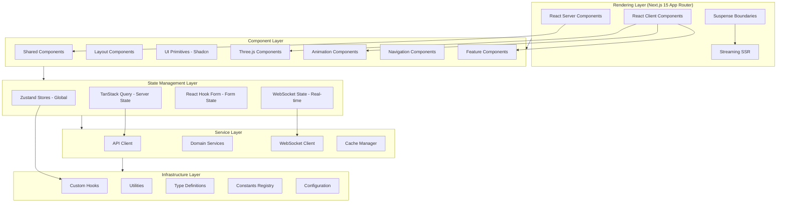
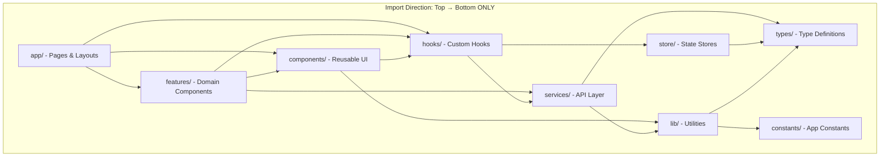
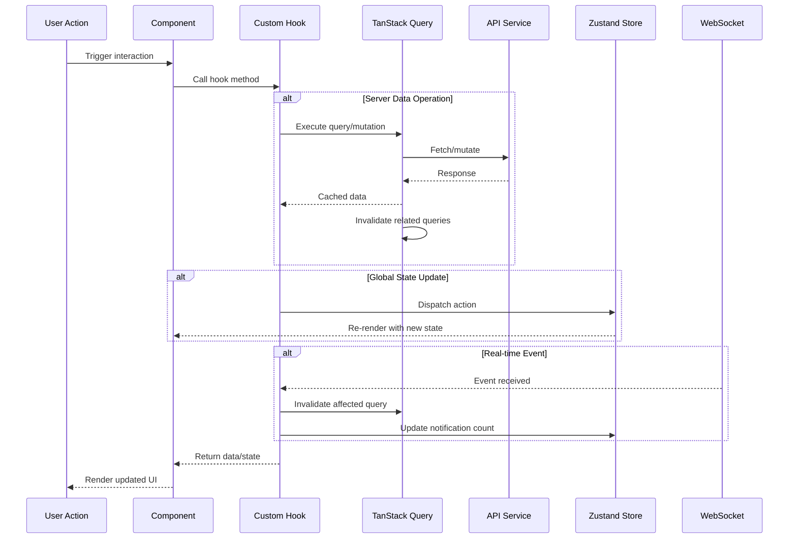
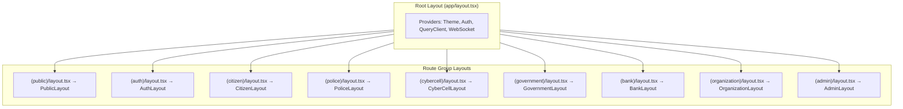
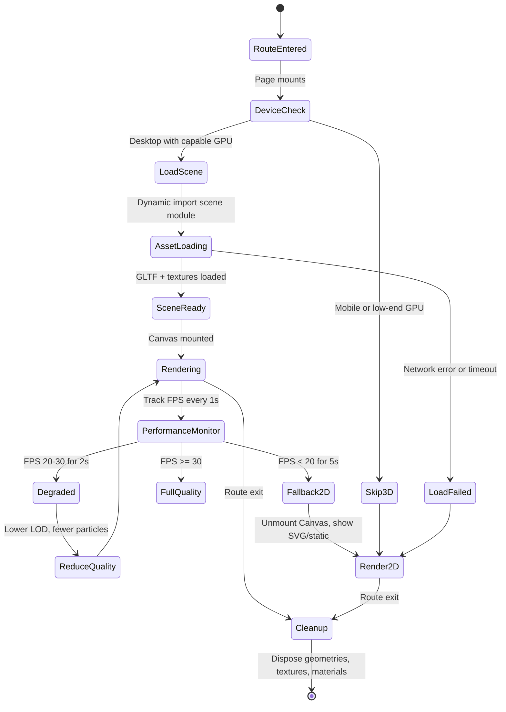
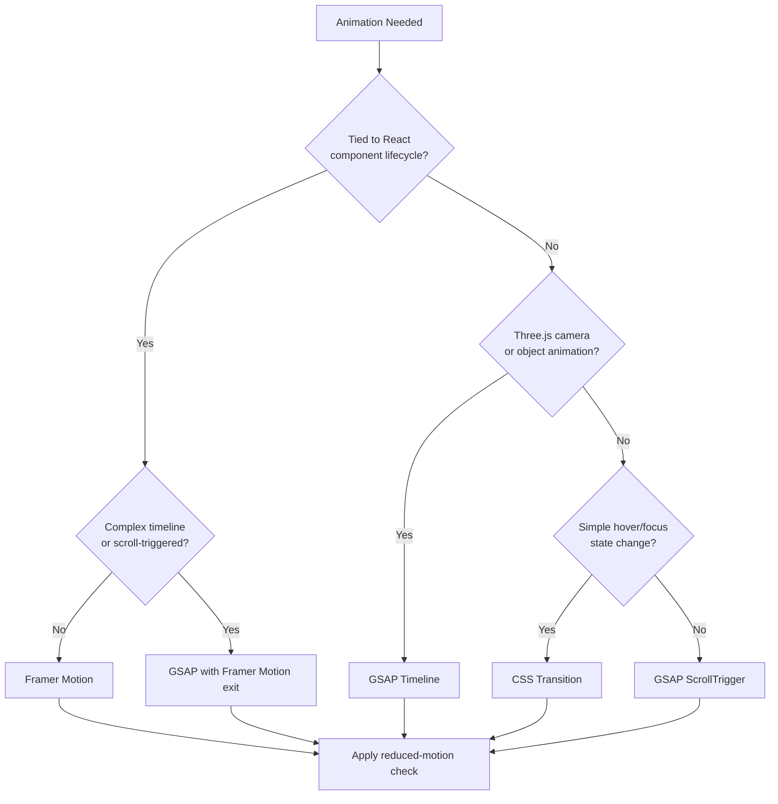
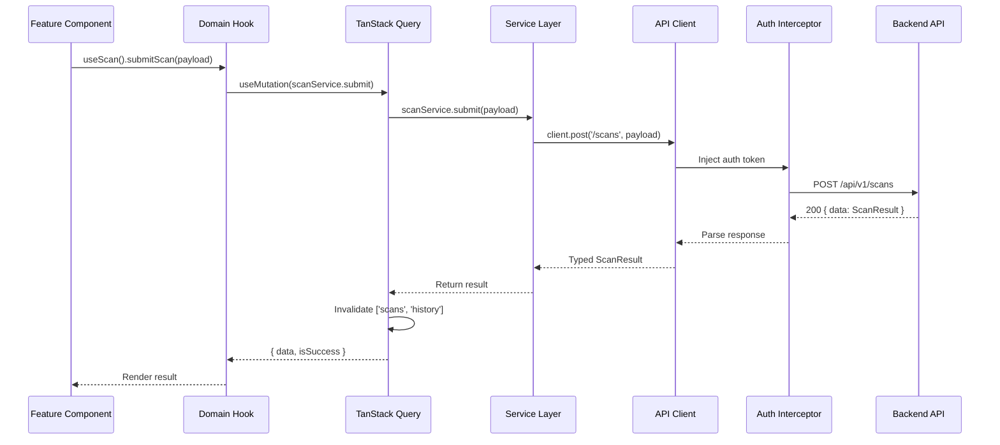

# Design Document: CyberShield AI — Frontend Component Architecture

## Overview

CyberShield AI Frontend Component Architecture defines the complete structural blueprint for implementing the platform's frontend as a Next.js 15 application with TypeScript. This document bridges the gap between the design system tokens (P04), information architecture (P03), API contract (P07), and system architecture (P08) — translating them into actionable component hierarchies, state management patterns, hooks contracts, service layer interfaces, Three.js scene management, animation orchestration, performance strategies, and accessibility enforcement.

This architecture serves as the implementation guide for frontend engineers. It establishes folder ownership rules, component categorization, import dependency constraints, rendering strategy decisions (Server vs Client Components), code splitting boundaries, and the formal contracts between every architectural layer. The goal is predictable, scalable, testable frontend code that supports 8 portals, 69+ screens, real-time WebSocket updates, 3D visualizations, and complex multi-step workflows — all while maintaining sub-3-second initial page loads and 60fps animations.

No React JSX, no Tailwind utility classes, no implementation code appears in this document. This is pure architecture: interfaces, contracts, data flow, ownership rules, and correctness properties that can be verified independently of any specific component implementation.

## Architecture

### Frontend Layer Architecture



### Component Import Dependency Graph



### State Management Data Flow



### Layout Architecture — Route Wrapping



### Three.js Scene Lifecycle



### Animation Ownership Decision Tree



### API Layer Architecture



---

## Components and Interfaces

### SECTION 1: Frontend Folder Architecture


```typescript
interface FolderArchitecture {
  src: {
    app: AppDirectory
    components: ComponentDirectory
    features: FeatureDirectory
    hooks: HookDirectory
    lib: LibDirectory
    services: ServiceDirectory
    store: StoreDirectory
    styles: StyleDirectory
    types: TypeDirectory
    utils: UtilDirectory
    constants: ConstantDirectory
    config: ConfigDirectory
    assets: AssetDirectory
  }
}
```

**Folder Ownership and Responsibilities:**

| Folder | Owner | Responsibility | Can Import From |
|--------|-------|----------------|-----------------|
| `app/` | Route definitions | Pages, layouts, route handlers | features, components, hooks |
| `components/shared/` | Design system team | Cross-portal reusable UI | hooks, lib, types, constants |
| `components/layout/` | Platform team | Portal shell structures | components/shared, hooks, store |
| `components/ui/` | Design system team | Shadcn UI primitives | lib, types |
| `components/three/` | 3D visualization team | Three.js scenes and objects | hooks, lib, types, assets |
| `components/animations/` | Motion team | Animation wrapper components | hooks, lib, types |
| `components/navigation/` | Platform team | Navigation systems | hooks, store, constants |
| `features/` | Domain teams | Portal-specific business logic | components, hooks, services, store |
| `hooks/` | Platform team | Reusable stateful logic | services, store, lib, types |
| `services/` | API team | Typed API communication | lib, types, constants |
| `store/` | Platform team | Global state containers | types, constants |
| `lib/` | Platform team | Pure utility functions | types, constants |
| `types/` | All teams (shared) | TypeScript type definitions | constants |
| `constants/` | Platform team | Immutable configuration values | (none — leaf node) |
| `config/` | DevOps/Platform | Environment-aware settings | constants |
| `assets/` | Design team | Static files (3D models, icons) | (none — leaf node) |

**Import Rules (enforced via ESLint):**

1. No circular dependencies between top-level folders
2. `constants/` and `types/` are leaf nodes — they import nothing except each other
3. `features/` NEVER imports from other `features/` (inter-portal isolation)
4. `components/` NEVER imports from `features/` (reusability constraint)
5. `app/` is the only folder that imports from `features/`
6. `store/` NEVER imports from `services/` (state is agnostic of transport)
7. `hooks/` is the bridge between `services/` and `components/`

**Route Group Structure:**

```typescript
interface AppDirectory {
  '(public)': RouteGroup       // Landing, About, Blog, Contact
  '(auth)': RouteGroup         // Login, Register, OTP, Reset
  '(citizen)': RouteGroup      // Dashboard, Scanner, Reports, Education, Community
  '(police)': RouteGroup       // Cases, Investigation, Graph, Analytics, Alerts
  '(cybercell)': RouteGroup    // Intelligence, Patterns, Deep-Investigation
  '(government)': RouteGroup   // Analytics, Reports, Policy Dashboard
  '(bank)': RouteGroup         // Fraud Detection, Money Mule, Alerts
  '(organization)': RouteGroup // Training, Threats, Compliance
  '(admin)': RouteGroup        // Users, System, Audit, Config
  'layout.tsx': RootLayout     // Providers, metadata, fonts
  'not-found.tsx': NotFoundPage
  'error.tsx': GlobalErrorBoundary
  'loading.tsx': GlobalLoading
}
```

### SECTION 2: Component Hierarchy

```typescript
interface ComponentRegistry {
  shared: SharedComponents
  layout: LayoutComponents
  ui: UIComponents
  three: ThreeComponents
  animations: AnimationComponents
  navigation: NavigationComponents
}

interface SharedComponents {
  Button: ComponentContract<ButtonProps>       // Primary, Secondary, Ghost, Danger, Icon
  Card: ComponentContract<CardProps>           // Default, Interactive, Stat, Threat
  Badge: ComponentContract<BadgeProps>         // Safe, Caution, Danger, Info, Custom
  Alert: ComponentContract<AlertProps>         // Info, Success, Warning, Error
  Avatar: ComponentContract<AvatarProps>       // Image, Initials, Fallback
  Tooltip: ComponentContract<TooltipProps>     // Hover-triggered contextual info
  Skeleton: ComponentContract<SkeletonProps>   // Loading placeholder shapes
  EmptyState: ComponentContract<EmptyProps>    // Zero-data display with CTA
  LoadingSpinner: ComponentContract<SpinnerProps>  // Indeterminate progress
  DataTable: ComponentContract<TableProps>     // Sortable, filterable, paginated
  StatusIndicator: ComponentContract<StatusProps>  // Online/Offline/Processing
}

interface LayoutComponents {
  AppShell: ComponentContract<AppShellProps>         // Configurable portal container
  Sidebar: ComponentContract<SidebarProps>           // Collapsible navigation panel
  Header: ComponentContract<HeaderProps>             // Top bar with actions
  Footer: ComponentContract<FooterProps>             // Links and legal
  Breadcrumb: ComponentContract<BreadcrumbProps>     // Hierarchical location
  PageContainer: ComponentContract<PageProps>        // Content width constraint
  ContentArea: ComponentContract<ContentProps>       // Main scrollable region
  PanelLayout: ComponentContract<PanelProps>         // Split-pane arrangement
}
```

```typescript
interface ThreeComponents {
  HeroScene: SceneContract<HeroSceneConfig>              // Landing page 3D shield
  GlobeScene: SceneContract<GlobeSceneConfig>            // Government threat map
  ThreatNetworkScene: SceneContract<NetworkSceneConfig>  // Cyber cell fraud graph
  ParticleField: SceneContract<ParticleConfig>           // Decorative backgrounds
  ShieldAnimation: SceneContract<ShieldConfig>           // Brand element (login)
}

interface AnimationComponents {
  PageTransition: ComponentContract<TransitionProps>     // Route change animation
  ScrollReveal: ComponentContract<RevealProps>           // Viewport-triggered entry
  MotionCard: ComponentContract<MotionCardProps>         // Hover-interactive card
  FadeIn: ComponentContract<FadeProps>                   // Opacity entrance
  SlideUp: ComponentContract<SlideProps>                 // Translate-Y entrance
  StaggerChildren: ComponentContract<StaggerProps>       // Sequential child animation
  CountUp: ComponentContract<CountUpProps>               // Numeric value reveal
  SkeletonPulse: ComponentContract<PulseProps>           // Animated loading state
}

interface FeatureComponents {
  citizen: {
    dashboard: ['SafetyScoreRing', 'RecentScans', 'AlertFeed', 'QuickActions']
    scanner: ['ScanInput', 'ScanResult', 'ThreatScoreCard', 'FactorBreakdown', 'ExplanationPanel']
    reports: ['ReportForm', 'DraftList', 'StatusTracker', 'EvidenceUploader']
    education: ['ModuleCard', 'QuizView', 'ProgressBar', 'CertificateBadge']
  }
  police: {
    cases: ['CaseList', 'CaseDetail', 'CaseTimeline', 'CaseNotes', 'StatusBadge']
    investigation: ['EvidenceViewer', 'InvestigationNotes', 'GraphExplorer']
    alerts: ['AlertComposer', 'AlertCard', 'SeverityIndicator', 'BroadcastStatus']
  }
  analytics: {
    charts: ['ThreatTrendChart', 'CategoryDistribution', 'GeographicHeatmap']
    maps: ['DistrictMap', 'ClusterView', 'HotspotOverlay']
  }
}
```

**Component Contract Interface:**

```typescript
interface ComponentContract<P> {
  props: P
  variants: string[]
  defaultProps: Partial<P>
  renderingMode: 'server' | 'client' | 'hybrid'
  accessibility: AccessibilityContract
  testId: string
}

interface SceneContract<C> extends ComponentContract<C> {
  performanceBudget: PerformanceBudget
  fallback: FallbackStrategy
  assetManifest: AssetReference[]
  reducedMotionBehavior: 'static-frame' | 'hide' | '2d-alternative'
}

interface AccessibilityContract {
  role: AriaRole
  label: string | LabelStrategy
  keyboardInteraction: KeyBinding[]
  announcements: LiveRegionConfig | null
}
```

### SECTION 3: Layout Architecture

```typescript
interface LayoutContract {
  name: string
  routeGroups: string[]
  regions: LayoutRegion[]
  responsiveBehavior: ResponsiveConfig
  authRequired: boolean
  renderingMode: 'server' | 'client'
}

interface PublicLayout extends LayoutContract {
  name: 'PublicLayout'
  routeGroups: ['(public)']
  regions: ['header', 'main', 'footer']
  authRequired: false
  header: { items: ['Home', 'Features', 'Resources', 'Login'] }
  footer: { columns: ['Product', 'Resources', 'Legal', 'Social'] }
  threeEligible: true  // Can render Three.js hero scenes
}

interface AuthLayout extends LayoutContract {
  name: 'AuthLayout'
  routeGroups: ['(auth)']
  regions: ['main']
  authRequired: false
  variant: 'centered-card' | 'split-illustration'
  chrome: 'minimal'  // No sidebar, no footer
}

interface CitizenLayout extends LayoutContract {
  name: 'CitizenLayout'
  routeGroups: ['(citizen)']
  regions: ['sidebar', 'header', 'main']
  authRequired: true
  sidebar: {
    items: ['Dashboard', 'Scanner', 'Reports', 'Education', 'Community']
    collapsible: true
    defaultState: 'expanded'
  }
  header: { features: ['search', 'notifications', 'profile'] }
  mobile: {
    bottomNav: { maxItems: 5, items: ['Home', 'Scan', 'Reports', 'Learn', 'More'] }
    fab: { action: 'Quick Scan', position: 'bottom-right' }
  }
}
```

```typescript
interface PoliceLayout extends LayoutContract {
  name: 'PoliceLayout'
  routeGroups: ['(police)']
  regions: ['sidebar', 'header', 'tabs', 'main']
  authRequired: true
  sidebar: {
    items: ['Cases', 'Intelligence', 'Graph', 'Analytics', 'Alerts']
    collapsible: true
    defaultState: 'expanded'
  }
  header: { features: ['search', 'notifications', 'team-status'] }
  secondaryNav: 'tab-bar'  // Within-section navigation
  commandPalette: { shortcut: 'Cmd+K', enabled: true }
}

interface AdminLayout extends LayoutContract {
  name: 'AdminLayout'
  routeGroups: ['(admin)']
  regions: ['sidebar', 'header', 'main']
  authRequired: true
  sidebar: {
    groups: ['Users', 'System', 'Audit', 'Configuration']
    collapsible: true
    defaultState: 'expanded'
  }
  header: { features: ['search', 'system-health-indicator'] }
  contentWidth: 'full'  // No secondary nav
}

interface CyberCellLayout extends LayoutContract {
  name: 'CyberCellLayout'
  routeGroups: ['(cybercell)']
  regions: ['sidebar', 'header', 'toolbar', 'main', 'detail-panel']
  authRequired: true
  sidebar: {
    items: ['Intelligence', 'Patterns', 'Graph', 'Investigations', 'Reports']
    collapsible: true
  }
  detailPanel: { position: 'right', resizable: true, defaultWidth: '400px' }
}

interface GovernmentLayout extends LayoutContract {
  name: 'GovernmentLayout'
  routeGroups: ['(government)']
  regions: ['sidebar', 'header', 'main']
  authRequired: true
  sidebar: { items: ['Dashboard', 'Analytics', 'Reports', 'Policies'] }
}

interface BankLayout extends LayoutContract {
  name: 'BankLayout'
  routeGroups: ['(bank)']
  regions: ['sidebar', 'header', 'main']
  authRequired: true
  sidebar: { items: ['Fraud Detection', 'Money Mule', 'Alerts', 'Reports'] }
}

interface OrganizationLayout extends LayoutContract {
  name: 'OrganizationLayout'
  routeGroups: ['(organization)']
  regions: ['sidebar', 'header', 'main']
  authRequired: true
  sidebar: { items: ['Training', 'Threats', 'Compliance', 'Team'] }
}
```

### SECTION 4: State Management

```typescript
// === GLOBAL STATE (Zustand) — Client-only, synchronous, UI-critical ===

interface AuthStore {
  // State
  user: AuthenticatedUser | null
  role: UserRole | null
  token: string | null
  refreshToken: string | null
  permissions: Permission[]
  sessionExpiresAt: number | null

  // Actions
  login: (credentials: LoginPayload) => Promise<AuthResult>
  logout: () => Promise<void>
  refreshSession: () => Promise<boolean>
  hasPermission: (permission: Permission) => boolean
  hasRole: (role: UserRole) => boolean
}

interface ThemeStore {
  // State
  theme: 'light' | 'dark'
  systemPreference: 'light' | 'dark' | 'no-preference'
  reducedMotion: boolean

  // Actions
  toggleTheme: () => void
  setTheme: (theme: 'light' | 'dark') => void
  syncWithSystem: () => void
}

interface NotificationStore {
  // State
  unreadCount: number
  recentNotifications: Notification[]
  connectionState: 'connected' | 'disconnected' | 'reconnecting'

  // Actions
  markRead: (id: string) => void
  markAllRead: () => void
  addNotification: (notification: Notification) => void
  removeNotification: (id: string) => void
}

interface UIStore {
  // State
  sidebarCollapsed: boolean
  commandPaletteOpen: boolean
  mobileMenuOpen: boolean
  activeModal: ModalId | null
  toasts: Toast[]

  // Actions
  toggleSidebar: () => void
  openCommandPalette: () => void
  closeCommandPalette: () => void
  toggleMobileMenu: () => void
  showToast: (toast: ToastPayload) => void
  dismissToast: (id: string) => void
}
```

```typescript
// === SERVER STATE (TanStack Query) — Async, cached, background-refreshed ===

interface QueryConfiguration {
  defaultStaleTime: number       // 30_000ms (30s)
  defaultCacheTime: number       // 300_000ms (5min)
  defaultRetryCount: number      // 3
  defaultRetryDelay: 'exponential'
  refetchOnWindowFocus: boolean  // true
  refetchOnReconnect: boolean    // true
}

interface CacheStrategyByDomain {
  dashboard: { staleTime: 30_000, cacheTime: 300_000 }
  scanHistory: { staleTime: 60_000, cacheTime: 600_000 }
  referenceData: { staleTime: 3_600_000, cacheTime: 86_400_000 }
  caseDetail: { staleTime: 0, cacheTime: 300_000 }         // Always fresh
  evidenceList: { staleTime: 0, cacheTime: 0 }             // Never cached (integrity)
  notifications: { staleTime: 10_000, cacheTime: 60_000 }
  userProfile: { staleTime: 300_000, cacheTime: 3_600_000 }
}

// === FORM STATE (React Hook Form + Zod) — Per-form, validation-driven ===

interface FormStatePattern {
  schema: ZodSchema              // Validation rules
  defaultValues: FormValues      // Initial form state
  mode: 'onBlur' | 'onChange'   // Validation trigger
  resolver: ZodResolver          // Schema-to-form bridge
  persistDraft: boolean          // Save drafts to localStorage
  multiStep: boolean             // Multi-page form support
}

// === WEBSOCKET STATE (Custom Hook) — Real-time, event-driven ===

interface WebSocketState {
  connectionState: 'idle' | 'connecting' | 'connected' | 'disconnected' | 'reconnecting'
  subscriptions: Map<ChannelId, SubscriptionConfig>
  eventQueue: WebSocketEvent[]
  reconnectAttempts: number
  lastHeartbeat: number | null
}

interface WebSocketActions {
  connect: (config: ConnectionConfig) => void
  disconnect: () => void
  subscribe: (channel: ChannelId, handler: EventHandler) => Unsubscribe
  send: (event: OutboundEvent) => void
}
```

**State Ownership Rules:**

| Data Type | Owner | Rationale |
|-----------|-------|-----------|
| Current user session | Zustand AuthStore | Synchronous access needed everywhere |
| Theme preference | Zustand ThemeStore | Instant toggle, no server round-trip |
| API response data | TanStack Query | Cacheable, background-refreshable |
| Form field values | React Hook Form | Ephemeral, per-form lifecycle |
| WebSocket events | Custom hook + Zustand | Real-time delivery to stores |
| Route params | Next.js (useParams) | Framework-managed |
| URL search state | nuqs or useSearchParams | Shareable, bookmarkable |

### SECTION 5: Hooks Architecture

```typescript
// === Authentication Hook ===
interface UseAuth {
  (): {
    user: AuthenticatedUser | null
    isAuthenticated: boolean
    isLoading: boolean
    role: UserRole | null
    login: (credentials: LoginPayload) => Promise<AuthResult>
    logout: () => Promise<void>
    refreshSession: () => Promise<boolean>
    hasPermission: (permission: Permission) => boolean
    hasRole: (role: UserRole) => boolean
  }
}

// === Threat Scanner Hook ===
interface UseScan {
  (): {
    submitScan: (payload: ScanPayload) => Promise<ScanResult>
    scanResult: ScanResult | null
    isScanning: boolean
    scanHistory: ScanHistoryItem[]
    clearResult: () => void
  }
}

// === Case Management Hook ===
interface UseCases {
  (filters?: CaseFilters): {
    cases: Case[]
    isLoading: boolean
    totalCount: number
    filterCases: (filters: CaseFilters) => void
    updateStatus: (caseId: string, status: CaseStatus) => Promise<void>
    assignOfficer: (caseId: string, officerId: string) => Promise<void>
    getCaseDetail: (caseId: string) => Case | undefined
  }
}

// === Notifications Hook ===
interface UseNotifications {
  (): {
    notifications: Notification[]
    unreadCount: number
    isLoading: boolean
    markRead: (id: string) => void
    markAllRead: () => void
    subscribe: (channel: NotificationChannel) => Unsubscribe
  }
}

// === WebSocket Hook ===
interface UseWebSocket {
  (config?: WebSocketConfig): {
    connectionState: ConnectionState
    connect: () => void
    disconnect: () => void
    subscribe: (channel: ChannelId, handler: EventHandler) => Unsubscribe
    send: (event: OutboundEvent) => void
    lastEvent: WebSocketEvent | null
  }
}
```

```typescript
// === Theme Hook ===
interface UseTheme {
  (): {
    theme: 'light' | 'dark'
    toggleTheme: () => void
    systemPreference: 'light' | 'dark' | 'no-preference'
    reducedMotion: boolean
  }
}

// === Safety Score Hook ===
interface UseSafetyScore {
  (): {
    score: number                    // 0-100
    breakdown: ScoreBreakdown        // Factor-by-factor
    history: ScoreHistoryPoint[]     // Time-series
    isLoading: boolean
    refresh: () => void
  }
}

// === Utility Hooks ===
interface UseDebounce {
  <T>(value: T, delay: number): T
}

interface UseIntersection {
  (options?: IntersectionOptions): {
    ref: RefCallback
    isIntersecting: boolean
    entry: IntersectionObserverEntry | null
  }
}

interface UseMediaQuery {
  (query: string): boolean
}

interface UseThreePerformance {
  (): {
    fps: number
    triangleCount: number
    drawCalls: number
    gpuMemory: number | null
    qualityLevel: 'full' | 'degraded' | 'minimal'
    shouldFallback: boolean
    forceDegrade: () => void
    forceFallback: () => void
  }
}

interface UseCommandPalette {
  (): {
    isOpen: boolean
    open: () => void
    close: () => void
    toggle: () => void
    registerCommand: (command: PaletteCommand) => Unregister
  }
}
```

### SECTION 6: API Layer

```typescript
// === API Client Contract ===
interface APIClient {
  get<T>(path: string, config?: RequestConfig): Promise<APIResponse<T>>
  post<T>(path: string, body: unknown, config?: RequestConfig): Promise<APIResponse<T>>
  put<T>(path: string, body: unknown, config?: RequestConfig): Promise<APIResponse<T>>
  patch<T>(path: string, body: unknown, config?: RequestConfig): Promise<APIResponse<T>>
  delete<T>(path: string, config?: RequestConfig): Promise<APIResponse<T>>
}

interface APIResponse<T> {
  data: T
  status: number
  headers: Record<string, string>
  timestamp: string
}

interface RequestConfig {
  headers?: Record<string, string>
  params?: Record<string, string | number | boolean>
  timeout?: number
  signal?: AbortSignal
  skipAuth?: boolean
}
```

```typescript
// === Service Layer Pattern ===
interface ServiceContract {
  baseEndpoint: string
  methods: Record<string, ServiceMethod>
}

interface ScanService extends ServiceContract {
  baseEndpoint: '/api/v1/scans'
  methods: {
    submit: (payload: ScanPayload) => Promise<ScanResult>
    getHistory: (params: PaginationParams) => Promise<Paginated<ScanHistoryItem>>
    getDetail: (scanId: string) => Promise<ScanDetail>
    getStats: () => Promise<ScanStats>
  }
}

interface CaseService extends ServiceContract {
  baseEndpoint: '/api/v1/cases'
  methods: {
    list: (filters: CaseFilters) => Promise<Paginated<Case>>
    getDetail: (caseId: string) => Promise<CaseDetail>
    create: (payload: CreateCasePayload) => Promise<Case>
    updateStatus: (caseId: string, status: CaseStatus) => Promise<Case>
    assign: (caseId: string, officerId: string) => Promise<Case>
    addNote: (caseId: string, note: NotePayload) => Promise<CaseNote>
    getTimeline: (caseId: string) => Promise<TimelineEvent[]>
  }
}

interface AuthService extends ServiceContract {
  baseEndpoint: '/api/v1/auth'
  methods: {
    login: (credentials: LoginPayload) => Promise<AuthTokens>
    register: (payload: RegisterPayload) => Promise<AuthTokens>
    refreshToken: (refreshToken: string) => Promise<AuthTokens>
    logout: () => Promise<void>
    verifyOTP: (payload: OTPPayload) => Promise<AuthTokens>
    requestPasswordReset: (email: string) => Promise<void>
  }
}

interface EducationService extends ServiceContract {
  baseEndpoint: '/api/v1/education'
  methods: {
    getModules: () => Promise<EducationModule[]>
    getModuleDetail: (moduleId: string) => Promise<ModuleDetail>
    submitQuiz: (moduleId: string, answers: QuizAnswer[]) => Promise<QuizResult>
    getProgress: () => Promise<UserProgress>
  }
}

interface AlertService extends ServiceContract {
  baseEndpoint: '/api/v1/alerts'
  methods: {
    list: (filters: AlertFilters) => Promise<Paginated<Alert>>
    create: (payload: CreateAlertPayload) => Promise<Alert>
    broadcast: (alertId: string, targets: BroadcastTarget[]) => Promise<BroadcastResult>
    acknowledge: (alertId: string) => Promise<void>
  }
}
```

**Error Normalization:**

```typescript
interface NormalizedError {
  code: ErrorCode                    // Machine-readable error identifier
  message: string                    // Human-readable message
  status: number                     // HTTP status code
  details?: Record<string, string[]> // Field-level validation errors
  retryable: boolean                 // Whether client should retry
  timestamp: string                  // When error occurred
}

interface RetryStrategy {
  networkError: { maxRetries: 3, backoff: 'exponential', baseDelay: 1000 }
  serverError: { maxRetries: 2, backoff: 'exponential', baseDelay: 2000 }
  clientError: { maxRetries: 0 }     // Never retry 4xx
  authError: { action: 'refresh-then-retry', maxRetries: 1 }
}
```

### SECTION 7: Three.js Architecture

```typescript
// === Scene Configuration Contracts ===

interface ThreeSceneConfig {
  id: string
  loadStrategy: 'lazy' | 'preload-on-hover'
  performanceBudget: PerformanceBudget
  fallback: FallbackConfig
  reducedMotion: ReducedMotionConfig
  deviceRequirements: DeviceRequirements
}

interface PerformanceBudget {
  maxFrameTime: number          // milliseconds per frame
  maxTriangles: number          // geometry complexity cap
  maxDrawCalls: number          // render pass limit
  maxTextureMemory: number      // MB of GPU texture memory
  degradeThreshold: number      // FPS below which quality drops
  fallbackThreshold: number     // FPS below which 2D replaces 3D
  degradeWindow: number         // seconds below threshold before action
  fallbackWindow: number        // seconds below threshold before fallback
}

interface FallbackConfig {
  type: '2d-svg' | '2d-canvas' | 'static-image' | 'hidden'
  component: string             // Fallback component path
  dataMapping: DataMappingFn    // Transform 3D data for 2D display
}

interface ReducedMotionConfig {
  behavior: 'static-frame' | 'hide' | '2d-alternative'
  staticFrame?: CameraPosition  // Which frame to show when static
}

interface DeviceRequirements {
  minGPUTier: number            // 1=integrated, 2=mid, 3=dedicated
  skipOnMobile: boolean         // Bypass entirely on mobile
  skipOnLowMemory: boolean      // Bypass if device RAM < 4GB
}
```

```typescript
// === Scene Definitions ===

const HeroSceneConfig: ThreeSceneConfig = {
  id: 'hero-scene',
  loadStrategy: 'preload-on-hover',
  performanceBudget: {
    maxFrameTime: 16,
    maxTriangles: 50_000,
    maxDrawCalls: 50,
    maxTextureMemory: 64,
    degradeThreshold: 30,
    fallbackThreshold: 20,
    degradeWindow: 2,
    fallbackWindow: 5
  },
  fallback: { type: 'static-image', component: 'HeroStatic', dataMapping: identity },
  reducedMotion: { behavior: 'static-frame', staticFrame: { x: 0, y: 0, z: 5 } },
  deviceRequirements: { minGPUTier: 2, skipOnMobile: true, skipOnLowMemory: true }
}

const GlobeSceneConfig: ThreeSceneConfig = {
  id: 'globe-scene',
  loadStrategy: 'lazy',
  performanceBudget: {
    maxFrameTime: 16,
    maxTriangles: 100_000,
    maxDrawCalls: 100,
    maxTextureMemory: 128,
    degradeThreshold: 30,
    fallbackThreshold: 20,
    degradeWindow: 2,
    fallbackWindow: 5
  },
  fallback: { type: '2d-svg', component: 'IndiaMapSVG', dataMapping: globeToFlatMap },
  reducedMotion: { behavior: '2d-alternative' },
  deviceRequirements: { minGPUTier: 2, skipOnMobile: true, skipOnLowMemory: true }
}

const ThreatNetworkConfig: ThreeSceneConfig = {
  id: 'threat-network-scene',
  loadStrategy: 'lazy',
  performanceBudget: {
    maxFrameTime: 16,
    maxTriangles: 200_000,
    maxDrawCalls: 500,
    maxTextureMemory: 256,
    degradeThreshold: 30,
    fallbackThreshold: 20,
    degradeWindow: 2,
    fallbackWindow: 5
  },
  fallback: { type: '2d-canvas', component: 'ForceGraph2D', dataMapping: graphTo2D },
  reducedMotion: { behavior: 'static-frame' },
  deviceRequirements: { minGPUTier: 3, skipOnMobile: true, skipOnLowMemory: true }
}

const ParticleFieldConfig: ThreeSceneConfig = {
  id: 'particle-field',
  loadStrategy: 'lazy',
  performanceBudget: {
    maxFrameTime: 4,
    maxTriangles: 1_000,
    maxDrawCalls: 5,
    maxTextureMemory: 8,
    degradeThreshold: 45,
    fallbackThreshold: 30,
    degradeWindow: 1,
    fallbackWindow: 3
  },
  fallback: { type: 'hidden', component: 'null', dataMapping: identity },
  reducedMotion: { behavior: 'hide' },
  deviceRequirements: { minGPUTier: 1, skipOnMobile: true, skipOnLowMemory: false }
}
```

**Asset Management Contract:**

```typescript
interface AssetManifest {
  models: ModelAsset[]
  textures: TextureAsset[]
  totalBudget: number  // MB cap per scene
}

interface ModelAsset {
  id: string
  path: string                    // Relative to /assets/models/
  format: 'gltf' | 'glb'
  compression: 'draco' | 'meshopt' | 'none'
  maxFileSize: number             // KB
  lodLevels: LODLevel[]
}

interface TextureAsset {
  id: string
  path: string
  format: 'ktx2' | 'webp' | 'png'
  maxResolution: [number, number]
  mipmaps: boolean
}

interface LODLevel {
  distance: number                // Camera distance threshold
  triangleReduction: number       // Percentage of full geometry
  textureResolution: number       // Percentage of full texture
}
```

### SECTION 8: Animation Architecture

```typescript
// === Animation Ownership Contract ===

interface AnimationOwnership {
  framerMotion: AnimationDomain[]
  gsap: AnimationDomain[]
  cssTransitions: AnimationDomain[]
  rule: 'one-library-per-element'  // NEVER mix on same element
}

interface AnimationDomain {
  category: string
  examples: string[]
  renderingMode: 'client'  // All animation components are Client Components
}

const framerMotionDomains: AnimationDomain[] = [
  { category: 'page-transitions', examples: ['route enter/exit', 'layout animations'], renderingMode: 'client' },
  { category: 'micro-interactions', examples: ['button hover', 'card hover', 'toggle'], renderingMode: 'client' },
  { category: 'list-animations', examples: ['stagger children mount', 'reorder'], renderingMode: 'client' },
  { category: 'modal-entry', examples: ['scale + fade', 'slide from edge'], renderingMode: 'client' },
  { category: 'tab-transitions', examples: ['cross-fade content', 'slide between'], renderingMode: 'client' }
]

const gsapDomains: AnimationDomain[] = [
  { category: 'score-reveal', examples: ['number count-up', 'ring fill'], renderingMode: 'client' },
  { category: 'hero-text', examples: ['stagger words', 'typewriter effect'], renderingMode: 'client' },
  { category: 'scroll-triggered', examples: ['section reveals', 'parallax'], renderingMode: 'client' },
  { category: 'three-js-camera', examples: ['smooth orbit', 'zoom to target'], renderingMode: 'client' },
  { category: 'complex-timelines', examples: ['multi-step sequences', 'choreography'], renderingMode: 'client' }
]

const cssTransitionDomains: AnimationDomain[] = [
  { category: 'hover-states', examples: ['color change', 'scale(1.02)', 'shadow'], renderingMode: 'client' },
  { category: 'focus-rings', examples: ['outline appearance', 'ring expansion'], renderingMode: 'client' },
  { category: 'simple-toggles', examples: ['sidebar collapse width', 'opacity'], renderingMode: 'client' }
]
```

**Motion Presets (from Design System P04):**

```typescript
interface MotionPresets {
  duration: {
    fast: 100        // hover responses
    normal: 200      // tooltips, dropdowns
    moderate: 300    // page transitions
    slow: 500        // chart reveals, score animations
    glacial: 1000    // Three.js camera movements
  }
  easing: {
    default: 'cubic-bezier(0.4, 0, 0.2, 1)'      // General purpose
    enter: 'cubic-bezier(0, 0, 0.2, 1)'           // Elements appearing
    exit: 'cubic-bezier(0.4, 0, 1, 1)'            // Elements leaving
    spring: { stiffness: 300, damping: 30 }        // Bouncy interactions
    sharp: 'cubic-bezier(0.4, 0, 0.6, 1)'         // Quick decisive moves
  }
}

interface ReducedMotionPolicy {
  // Global enforcement
  mediaQuery: 'prefers-reduced-motion: reduce'
  storageKey: 'cybershield-reduced-motion'
  
  // Per-category behavior
  entranceAnimations: 'disabled'           // No fly-in, fade-in, slide-up
  continuousAnimations: 'disabled'         // No orbit, float, pulse
  threeJsScenes: 'static-frame'           // Show single rendered frame
  scoreCountUp: 'show-final-instantly'    // Skip counting animation
  focusIndicators: 'preserved'            // NEVER disable focus rings
  stateTransitions: 'preserved'           // Checkmarks, status changes kept
  scrollPosition: 'instant'              // No smooth scroll
}
```

### SECTION 9: Performance Architecture

```typescript
// === Rendering Strategy ===

interface RenderingStrategy {
  defaultMode: 'server'  // React Server Components by default
  clientComponentTriggers: ClientTrigger[]
  streamingConfig: StreamingConfig
  suspenseBoundaries: SuspenseStrategy
}

interface ClientTrigger {
  reason: string
  examples: string[]
}

const clientTriggers: ClientTrigger[] = [
  { reason: 'interactivity', examples: ['onClick', 'onChange', 'onSubmit'] },
  { reason: 'hooks', examples: ['useState', 'useEffect', 'useRef'] },
  { reason: 'browser-api', examples: ['localStorage', 'IntersectionObserver', 'WebSocket'] },
  { reason: 'three-js', examples: ['Canvas', 'useFrame', 'useThree'] },
  { reason: 'animation', examples: ['motion.div', 'gsap.timeline'] }
]

interface StreamingConfig {
  enabled: true
  targets: StreamTarget[]
}

interface StreamTarget {
  component: string
  reason: string
  fallback: string  // Loading component shown during stream
}

const streamTargets: StreamTarget[] = [
  { component: 'DashboardStats', reason: 'Aggregation queries are slow', fallback: 'StatsSkeleton' },
  { component: 'CaseList', reason: 'Large dataset with filters', fallback: 'TableSkeleton' },
  { component: 'ThreatFeed', reason: 'Real-time data assembly', fallback: 'FeedSkeleton' },
  { component: 'AnalyticsCharts', reason: 'Complex computations', fallback: 'ChartSkeleton' }
]
```

```typescript
// === Code Splitting Strategy ===

interface CodeSplittingRules {
  routeBased: 'automatic'        // Next.js App Router handles this
  componentBased: DynamicImportRule[]
  vendorChunks: VendorChunkConfig
}

interface DynamicImportRule {
  target: string
  condition: string
  loadingFallback: string
}

const dynamicImports: DynamicImportRule[] = [
  { target: 'Three.js scenes', condition: 'route contains 3D view', loadingFallback: 'SceneSkeleton' },
  { target: 'GSAP', condition: 'first scroll-triggered animation', loadingFallback: 'none (invisible)' },
  { target: 'D3.js (fallback graphs)', condition: 'Three.js fallback triggered', loadingFallback: 'ChartSkeleton' },
  { target: 'react-pdf', condition: 'user opens report export', loadingFallback: 'ExportSkeleton' },
  { target: 'monaco-editor', condition: 'admin opens config editor', loadingFallback: 'EditorSkeleton' }
]

// === Bundle Optimization Rules ===

interface BundleRules {
  treeShaking: {
    rule: 'named-imports-only'
    banned: 'import * from'        // Never wildcard import
    enforced: 'eslint-plugin-import'
  }
  barrelFiles: {
    strategy: 'explicit-re-exports' // No export * from
    optimization: 'modularizeImports in next.config'
  }
  iconImports: {
    library: 'lucide-react'
    rule: 'individual-icon-import'  // import { Shield } from 'lucide-react'
    banned: 'import * as Icons'     // Never import all icons
  }
  imageOptimization: {
    component: 'next/image'
    formats: ['webp', 'avif']
    lazyLoading: 'default'
    priorityHint: 'above-fold-images-only'
  }
}

// === Performance Budgets ===

interface PerformanceBudgets {
  initialLoad: {
    firstContentfulPaint: 1500     // ms
    largestContentfulPaint: 2500   // ms
    timeToInteractive: 3500        // ms
    cumulativeLayoutShift: 0.1     // score
    totalBlockingTime: 200         // ms
  }
  routeTransition: {
    maxTime: 300                   // ms
    prefetch: 'on-hover'           // Link prefetching strategy
  }
  jsBundle: {
    mainBundle: 150                // KB gzipped
    perRouteBudget: 50             // KB gzipped
    threeJsScene: 300              // KB gzipped (lazy loaded)
    totalVendor: 200               // KB gzipped
  }
  threeJs: {
    sceneLoadTime: 3000            // ms max
    assetBudgetPerScene: 5         // MB
    maxConcurrentScenes: 1         // Only one 3D scene active
  }
}
```

### SECTION 10: Accessibility Architecture

```typescript
// === Keyboard Navigation Contract ===

interface KeyboardNavigationRules {
  globalShortcuts: KeyBinding[]
  focusManagement: FocusStrategy
  trapBehavior: TrapConfig
}

interface KeyBinding {
  key: string
  modifier?: 'Cmd' | 'Ctrl' | 'Alt' | 'Shift'
  action: string
  scope: 'global' | 'modal' | 'navigation' | 'table'
}

const globalShortcuts: KeyBinding[] = [
  { key: 'k', modifier: 'Cmd', action: 'Open command palette', scope: 'global' },
  { key: '/', action: 'Focus search input', scope: 'global' },
  { key: 'Escape', action: 'Close modal/popover/palette', scope: 'global' },
  { key: 'Tab', action: 'Move focus forward', scope: 'global' },
  { key: 'Tab', modifier: 'Shift', action: 'Move focus backward', scope: 'global' }
]

interface FocusStrategy {
  skipLink: { enabled: true, target: '#main-content', label: 'Skip to content' }
  focusVisible: { style: '2px solid var(--color-focus-ring)', offset: '2px' }
  focusReturn: 'restore-on-modal-close'
  autoFocus: 'first-interactive-in-new-view'
}

interface TrapConfig {
  modals: { trap: true, escapeCloses: true, returnFocusOnClose: true }
  dropdowns: { trap: false, escapeCloses: true }
  commandPalette: { trap: true, escapeCloses: true, returnFocusOnClose: true }
  sidebar: { trap: false }  // Sidebar is not a trap (always escapable)
}

// === Screen Reader Contract ===

interface ScreenReaderContract {
  semanticHTML: SemanticRules
  ariaPatterns: AriaPattern[]
  liveRegions: LiveRegionConfig[]
  dataVisualization: DataVizA11y
}

interface SemanticRules {
  landmarks: {
    nav: 'Primary navigation, breadcrumbs'
    main: 'Page primary content'
    aside: 'Sidebar, detail panels'
    section: 'Logical content groups with headings'
    header: 'Page header with actions'
    footer: 'Page footer with links'
  }
  headingHierarchy: 'strict-sequential'  // h1 → h2 → h3, no skipping
  listUsage: 'navigation-items, data-lists, action-groups'
}
```

```typescript
interface AriaPattern {
  component: string
  role: string
  requiredAttributes: string[]
  announcements: string | null
}

const ariaPatterns: AriaPattern[] = [
  { component: 'IconButton', role: 'button', requiredAttributes: ['aria-label'], announcements: null },
  { component: 'ThreatScore', role: 'meter', requiredAttributes: ['aria-valuenow', 'aria-valuemin', 'aria-valuemax', 'aria-label'], announcements: null },
  { component: 'ScanResult', role: 'alert', requiredAttributes: ['aria-live=assertive'], announcements: 'Scan complete: threat level {score}' },
  { component: 'NotificationBadge', role: 'status', requiredAttributes: ['aria-live=polite', 'aria-label'], announcements: '{count} unread notifications' },
  { component: 'DataTable', role: 'table', requiredAttributes: ['aria-label', 'aria-rowcount', 'aria-colcount'], announcements: null },
  { component: 'CaseTimeline', role: 'feed', requiredAttributes: ['aria-label'], announcements: 'New event added to timeline' },
  { component: 'Globe3D', role: 'img', requiredAttributes: ['aria-label'], announcements: null },
  { component: 'CommandPalette', role: 'combobox', requiredAttributes: ['aria-expanded', 'aria-controls', 'aria-activedescendant'], announcements: '{count} results' }
]

interface LiveRegionConfig {
  target: string
  politeness: 'polite' | 'assertive'
  atomic: boolean
  relevance: 'additions' | 'removals' | 'all'
}

const liveRegions: LiveRegionConfig[] = [
  { target: 'scan-result-area', politeness: 'assertive', atomic: true, relevance: 'additions' },
  { target: 'notification-count', politeness: 'polite', atomic: true, relevance: 'all' },
  { target: 'case-status-update', politeness: 'polite', atomic: false, relevance: 'additions' },
  { target: 'toast-container', politeness: 'polite', atomic: true, relevance: 'additions' },
  { target: 'websocket-status', politeness: 'polite', atomic: true, relevance: 'all' }
]

interface DataVizA11y {
  charts: { requirement: 'aria-label summary + linked data table' }
  graphs3D: { requirement: 'aria-label description + downloadable CSV' }
  threatScores: { format: 'Threat level: {score} out of 100, {severity}' }
  maps: { requirement: 'aria-label + text list of highlighted regions' }
}
```

### SECTION 11: Architecture Review

**Strengths:**

1. Feature-based folder structure scales linearly with team growth — each portal team owns their `features/` subdirectory independently
2. Server Components as default reduces client-side JavaScript by 40-60% compared to traditional SPA approaches
3. Three.js scenes are fully lazy-loaded and isolated — zero impact on initial page load for the 95% of pages without 3D
4. Design system token alignment ensures visual consistency across 8 portals without runtime coordination
5. WebSocket hook abstraction provides real-time updates without coupling components to transport layer
6. TanStack Query eliminates manual loading/error/cache state — single source of truth for all server data
7. Strict import rules prevent dependency entanglement as codebase scales to 69+ screens

**Weaknesses and Mitigations:**

| Weakness | Risk Level | Mitigation |
|----------|------------|------------|
| 8 portal layouts = high maintenance | Medium | Shared `AppShell` with role-based configuration object |
| Three.js bundle (~500KB) impacts users who see 3D | Medium | Lazy load on route, never in critical path, aggressive compression |
| State management could fragment across 4 patterns | High | Clear ownership rules per data type, enforced in code review |
| Multi-step form state persistence across navigation | Medium | React Hook Form context + localStorage draft persistence |
| WebSocket reconnection complexity | Medium | Exponential backoff with jitter, max 10 reconnects before manual |
| 69+ screens = massive route surface area | Low | Next.js automatic code splitting per route group |

**Improvement Recommendations:**

1. Storybook instance for design system component catalog — enables visual QA without full app
2. Bundle analyzer integrated in CI (webpack-bundle-analyzer) — alerts on >10% size increase per PR
3. Lighthouse CI with strict performance budgets — blocks deploy if LCP > 2.5s
4. Automated accessibility testing (axe-core) in test suite — catches WCAG violations pre-merge
5. Visual regression testing for Three.js fallback scenarios — ensures 2D alternatives match design intent
6. Import boundary linting (eslint-plugin-boundaries) — enforces folder import rules automatically

---

## Data Models

```typescript
// === Core Domain Types (consumed by all layers) ===

type UserRole = 'citizen' | 'police' | 'cybercell' | 'government' | 'bank' | 'organization' | 'admin'

interface AuthenticatedUser {
  id: string
  email: string
  name: string
  role: UserRole
  avatar: string | null
  permissions: Permission[]
  organization: string | null
  lastLogin: string  // ISO 8601
}
```

```typescript
type Permission = 
  | 'scan:create' | 'scan:read' | 'scan:history'
  | 'case:create' | 'case:read' | 'case:update' | 'case:assign' | 'case:close'
  | 'alert:create' | 'alert:broadcast' | 'alert:read'
  | 'report:create' | 'report:read' | 'report:update'
  | 'education:read' | 'education:manage'
  | 'analytics:read' | 'analytics:export'
  | 'graph:read' | 'graph:explore'
  | 'admin:users' | 'admin:system' | 'admin:audit'

// === Scan Domain ===
interface ScanPayload {
  content: string                  // Text to analyze
  contentType: 'sms' | 'whatsapp' | 'email' | 'url' | 'phone'
  metadata?: { source?: string }
}

interface ScanResult {
  id: string
  threatScore: number              // 0-100
  severity: 'safe' | 'caution' | 'danger' | 'critical'
  factors: ThreatFactor[]
  explanation: string              // AI-generated plain language
  recommendations: string[]
  timestamp: string
}

interface ThreatFactor {
  name: string
  weight: number                   // 0-1 contribution to total score
  description: string
  evidence: string[]
}

// === Case Domain ===
interface Case {
  id: string
  title: string
  status: CaseStatus
  priority: 'low' | 'medium' | 'high' | 'critical'
  assignedTo: string | null
  createdBy: string
  createdAt: string
  updatedAt: string
  category: FraudCategory
  jurisdiction: string
  victimCount: number
}

type CaseStatus = 'open' | 'investigating' | 'evidence-gathering' | 'prosecution' | 'closed' | 'archived'
type FraudCategory = 'phishing' | 'upi-fraud' | 'investment' | 'romance' | 'job' | 'lottery' | 'impersonation' | 'other'

// === Notification Domain ===
interface Notification {
  id: string
  type: 'alert' | 'case-update' | 'scan-complete' | 'system' | 'community'
  title: string
  body: string
  read: boolean
  createdAt: string
  actionUrl: string | null
  severity: 'info' | 'warning' | 'critical'
}

// === Education Domain ===
interface EducationModule {
  id: string
  title: string
  description: string
  category: string
  duration: number                 // minutes
  completionRate: number           // 0-100 for current user
  difficulty: 'beginner' | 'intermediate' | 'advanced'
}

// === Pagination ===
interface Paginated<T> {
  data: T[]
  pagination: {
    page: number
    pageSize: number
    totalItems: number
    totalPages: number
    hasNext: boolean
    hasPrevious: boolean
  }
}
```

---

## Correctness Properties

### Property 1: Import Boundary Enforcement

For all files F in the codebase, if F resides in folder A, then every import statement in F references only modules in folders that A is permitted to import from according to the Import Rules table. No file in `components/` imports from `features/`. No file in `features/X/` imports from `features/Y/` where X ≠ Y. No file in `constants/` or `types/` imports from any folder other than each other.

### Property 2: Server Component Default

For all components C in `app/` and `components/`, if C does not use hooks (useState, useEffect, useRef, useContext), browser APIs (window, document, localStorage), event handlers (onClick, onChange), Three.js primitives, or animation libraries, then C is rendered as a React Server Component (no 'use client' directive). The 'use client' boundary is pushed to the lowest possible component in the tree.

### Property 3: Three.js Scene Isolation

For all Three.js scene components S, S is loaded via dynamic import (never statically imported). S does not appear in the initial JavaScript bundle for any route. S is wrapped in a Suspense boundary with a non-Three.js fallback. When S is unmounted, all GPU resources (geometries, textures, materials) are disposed. No more than one Three.js Canvas is active in the DOM at any time.

### Property 4: Performance Budget Compliance

For all Three.js scenes S with configuration C, the rendering loop of S maintains frame time ≤ C.performanceBudget.maxFrameTime under normal operation. If frame time exceeds the degrade threshold for C.degradeWindow consecutive seconds, quality is automatically reduced. If frame time exceeds the fallback threshold for C.fallbackWindow consecutive seconds, S is unmounted and replaced with C.fallback.component.

### Property 5: Reduced Motion Respect

For all animation components A, if the user's system has `prefers-reduced-motion: reduce` enabled OR the application's `reducedMotion` store value is `true`, then A produces no visible motion (duration effectively 0 or component hidden). Essential state indicators (focus rings, checkmarks, error outlines) remain visible regardless of reduced motion preference.

### Property 6: Authentication Guard Completeness

For all route groups G where G.authRequired is true, every page within G performs authentication verification before rendering content. If the user's auth token is expired or missing, the user is redirected to the auth flow. No authenticated page content (including layout shells, sidebar items, or page skeletons) is visible to unauthenticated users.

### Property 7: State Ownership Exclusivity

For all data D in the application, D is owned by exactly one state management system. API response data is owned exclusively by TanStack Query. User session data is owned exclusively by Zustand AuthStore. Form field values are owned exclusively by React Hook Form. No data is duplicated across state systems. When data flows between systems (e.g., WebSocket event invalidating a TanStack Query), it passes through the designated hook bridge layer.

### Property 8: Cache Invalidation Correctness

For all mutations M that modify server data of type T, upon successful completion of M, all TanStack Query cache entries containing type T are invalidated (marked stale). Specifically: a successful scan submission invalidates ['scans', 'history'] and ['dashboard', 'stats']. A case status update invalidates ['cases', 'list'] and ['cases', caseId]. No stale data is displayed to the user after a successful mutation completes.

### Property 9: Accessibility Landmark Completeness

For all pages P rendered by the application, P contains exactly one `main` landmark, at least one `nav` landmark, and appropriate heading hierarchy starting from a single `h1`. All interactive elements within P are reachable via Tab key navigation. All icon-only buttons have an `aria-label` attribute. All dynamic content regions that update without page reload are wrapped in an `aria-live` region with appropriate politeness.

### Property 10: Type Safety Across Service Boundary

For all service methods S that communicate with the backend API, the return type of S exactly matches the API response schema defined in the API contract (P07). If the backend returns data that does not conform to the expected type, the API client layer throws a typed parse error before the data reaches any component or hook. No `any` type is used in the service layer.

### Property 11: WebSocket Reconnection Guarantee

For all WebSocket connections W, if W transitions to 'disconnected' state due to network interruption, the system automatically attempts reconnection using exponential backoff with jitter. Maximum reconnection attempts are bounded (10 attempts). During disconnection, the UI displays a visible 'offline' indicator. Upon successful reconnection, all active channel subscriptions are re-established and any missed events trigger a cache invalidation for affected queries.

### Property 12: Code Splitting Isolation

For all portal-specific feature code in `features/X/`, that code is included ONLY in the JavaScript bundle for route group `(X)`. Citizen portal code never appears in the police bundle. Police portal code never appears in the citizen bundle. Shared code in `components/` and `hooks/` may appear in multiple bundles only through tree-shaken imports of actually-used symbols.

### Property 13: Fallback Rendering Equivalence

For all Three.js scenes S with a 2D fallback component F, F displays the same underlying data as S (transformed via the scene's `dataMapping` function). If S shows 5 threat clusters on a globe, F shows the same 5 clusters on a flat map. The information content accessible to users (including screen reader users) is equivalent between S and F, though the visual representation differs.

### Property 14: Form Draft Persistence

For all multi-step forms with `persistDraft: true`, if a user navigates away from the form (route change, browser back, accidental close), upon returning to the same form route within the same session, all previously entered values are restored from localStorage. Draft data is encrypted at rest and cleared upon successful form submission or explicit user cancellation.

---

## Error Handling

### Error Scenario 1: Unrecoverable Application Error

**Condition**: A React component throws an unhandled exception during render, causing the component tree to crash.
**Response**: The nearest error boundary catches the error. If no granular boundary exists, the root `error.tsx` displays a full-page error state with a "Reload" button. Error details are logged to the monitoring service (never shown to users in production).
**Recovery**: User clicks "Reload" which performs a full page refresh. If the error persists across reloads, a "Contact Support" option is displayed.

### Error Scenario 2: Network Request Failure

**Condition**: An API call fails due to network timeout, DNS failure, or server unreachability.
**Response**: TanStack Query applies the retry strategy (3 retries with exponential backoff for network errors). During retries, the component shows its loading state. After all retries exhaust, the component shows an inline error state with a "Retry" button and a brief error message.
**Recovery**: User clicks "Retry" which re-triggers the query. If the issue persists, a global "Connection issues" banner appears at the top of the layout.

### Error Scenario 3: Authentication Token Expiry

**Condition**: An API call returns HTTP 401, indicating the access token has expired.
**Response**: The API client interceptor automatically attempts token refresh using the stored refresh token. If refresh succeeds, the original request is retried transparently. If refresh fails (refresh token also expired), the user is redirected to the login page.
**Recovery**: Automatic and transparent if refresh succeeds. If redirect occurs, all unsaved form data with `persistDraft: true` is preserved in localStorage for restoration after re-authentication.

### Error Scenario 4: API Validation Error (4xx)

**Condition**: An API call returns HTTP 400/422 with field-level validation errors.
**Response**: The normalized error is passed to the form layer. Field-level errors are displayed inline next to the relevant input. A summary toast notification appears for non-form contexts. No retry is attempted (4xx errors are deterministic).
**Recovery**: User corrects the invalid fields and resubmits.

### Error Scenario 5: Three.js Scene Load Failure

**Condition**: A Three.js scene fails to load (GLTF fetch error, WebGL context lost, shader compilation failure).
**Response**: The scene's fallback component is rendered immediately. An error is logged to monitoring. No error UI is shown to the user — the fallback IS the graceful degradation.
**Recovery**: On next route entry, the system re-attempts loading the 3D scene. If it fails 3 times consecutively, the scene is permanently disabled for that session (uses 2D fallback).

### Error Scenario 6: WebSocket Connection Loss

**Condition**: The WebSocket connection drops (network interruption, server restart, idle timeout).
**Response**: The connection state moves to 'reconnecting'. A subtle "Reconnecting..." indicator appears in the header. Exponential backoff reconnection begins (1s, 2s, 4s, 8s...). In-flight events are buffered for re-delivery.
**Recovery**: Upon reconnection, subscriptions are re-established and a cache invalidation sweep is triggered for all WebSocket-dependent queries. If 10 reconnection attempts fail, state moves to 'disconnected' with a visible "Connection lost — click to retry" banner.

---

## Testing Strategy

### Unit Testing Approach

**Framework**: Vitest (aligned with Next.js ecosystem)
**Coverage Target**: 80% statement coverage for hooks, services, and utility layers

- All custom hooks tested in isolation with `renderHook` from testing-library
- All service layer methods tested with mocked API responses (MSW — Mock Service Worker)
- All utility functions tested with standard unit test assertions
- All Zustand stores tested by dispatching actions and asserting state transitions
- Zod schemas tested with valid and invalid payloads

### Property-Based Testing Approach

**Library**: fast-check (TypeScript-native, integrates with Vitest)

- API client: for all valid request configurations, the client produces well-formed HTTP requests
- Type guards: for all values of correct type, the guard returns true; for all values of incorrect type, the guard returns false
- Pagination: for all valid page/pageSize combinations, totalPages = ceil(totalItems / pageSize)
- Normalization: for all API error responses with status >= 400, the normalizer produces a valid NormalizedError
- State reducers: for all sequences of valid actions, the store never enters an invalid state

### Integration Testing Approach

**Framework**: Playwright (E2E) + Testing Library (component integration)

- Route-level integration tests verify that page components render with mocked API data
- Navigation tests verify that clicking sidebar items produces correct route transitions
- Auth flow tests verify login → redirect → authenticated page → logout sequence
- Form flow tests verify multi-step form submission with validation
- Accessibility tests (axe-core integration) run on every page after render

---

## Performance Considerations

### Initial Load Performance

The architecture prioritizes Time to Interactive (TTI) under 3.5 seconds on 4G connections. Key strategies:

1. **Server Components by default** — Reduces client JavaScript by shipping HTML instead of component code for data-display pages
2. **Streaming SSR** — Slow data sources (dashboard aggregates, analytics) stream progressively rather than blocking the entire page
3. **Route-based code splitting** — Each portal route group produces an independent JavaScript bundle, loaded only when that portal is accessed
4. **Font optimization** — next/font with `display: swap` and subset loading for Devanagari + Latin character sets
5. **Critical CSS inlining** — Above-fold styles inlined in the HTML response, below-fold loaded asynchronously

### Runtime Performance

1. **Three.js isolation** — Scenes render in a dedicated rendering loop that does not block the React reconciliation cycle
2. **Virtual scrolling** — Data tables and case lists with >100 items use virtualization (only visible rows in DOM)
3. **Debounced search** — Global search and filter inputs debounce API calls by 300ms
4. **Optimistic updates** — Mutation-driven UI updates appear instantly, rolling back only on server error
5. **Memo boundaries** — Expensive component subtrees wrapped in memo with stable prop references

### Monitoring and Alerting

1. **Web Vitals tracking** — LCP, FID, CLS reported per route via next/web-vitals API
2. **Lighthouse CI** — Automated performance audits on every PR with hard failure thresholds
3. **Bundle size tracking** — CI step compares bundle sizes against budgets, alerts on >10% growth
4. **Three.js performance** — Custom hook reports FPS metrics to monitoring for degradation tracking

---

## Security Considerations

### Authentication Security

1. **Token storage** — Access tokens stored in memory (Zustand store), never in localStorage or cookies accessible to JS. Refresh tokens in httpOnly secure cookies.
2. **Token lifecycle** — Access tokens expire after 15 minutes. Refresh tokens expire after 7 days. Rotation on every refresh.
3. **Route protection** — All authenticated route groups verify token validity server-side via middleware before rendering content.
4. **Session invalidation** — Logout clears all client-side state (Zustand stores, TanStack Query cache, form drafts).

### Input Sanitization

1. **XSS prevention** — All user-generated content rendered via React's default escaping. No `dangerouslySetInnerHTML` without explicit sanitization (DOMPurify).
2. **Scan input** — Text submitted to the threat scanner is sent as-is to the API (analysis is server-side). Display of scan results sanitizes any embedded HTML/scripts.
3. **File uploads** — Evidence file uploads validate file type, size limits (client-side pre-check, server-side enforcement), and strip EXIF metadata before display.

### Content Security

1. **CSP headers** — Strict Content Security Policy allowing scripts only from own origin and required CDNs (Three.js assets). No inline scripts in production.
2. **CORS** — API client only communicates with the configured backend origin. No cross-origin requests to third-party services from the client.
3. **Sensitive data** — No PII displayed in URL paths or query parameters. Case IDs use opaque UUIDs, not sequential numbers.

### Dependency Security

1. **Supply chain** — All dependencies pinned to exact versions in lockfile. Automated vulnerability scanning (npm audit) in CI.
2. **Shadcn approach** — UI primitives copied into the project (not runtime dependency), reducing supply chain surface area.
3. **Three.js assets** — 3D model files served from own CDN only, not loaded from external URLs. Subresource integrity (SRI) hashes for vendor bundles.

---

## Dependencies

### Production Dependencies

| Package | Purpose | Version Strategy |
|---------|---------|-----------------|
| next | Framework (App Router, SSR, routing) | ^15.x |
| react / react-dom | UI library | ^18.x |
| typescript | Type system | ^5.x |
| @react-three/fiber | React renderer for Three.js | ^8.x |
| three | 3D graphics library | ^0.160.x |
| @react-three/drei | Three.js helpers and abstractions | ^9.x |
| framer-motion | Component-level animations | ^11.x |
| gsap | Timeline and scroll animations | ^3.x |
| zustand | Global state management | ^4.x |
| @tanstack/react-query | Server state management | ^5.x |
| react-hook-form | Form state management | ^7.x |
| zod | Schema validation | ^3.x |
| lucide-react | Icon library | ^0.400.x |
| nuqs | URL search params state | ^1.x |

### Development Dependencies

| Package | Purpose | Version Strategy |
|---------|---------|-----------------|
| vitest | Unit test runner | ^1.x |
| @testing-library/react | Component testing utilities | ^14.x |
| playwright | E2E testing | ^1.x |
| msw | API mocking for tests | ^2.x |
| fast-check | Property-based testing | ^3.x |
| axe-core | Accessibility testing | ^4.x |
| eslint-plugin-boundaries | Import rule enforcement | ^3.x |
| @next/bundle-analyzer | Bundle size analysis | ^15.x |
| storybook | Component catalog | ^8.x |

### Asset Dependencies

| Asset Type | Format | Delivery |
|------------|--------|----------|
| 3D Models | GLTF/GLB with Draco compression | Lazy-loaded from CDN |
| Textures | KTX2 with mipmaps | Lazy-loaded with scene |
| Icons | SVG (Lucide, inline) | Bundled (tree-shaken) |
| Illustrations | SVG | Lazy-loaded for large, inline for small |
| Fonts | WOFF2 (Latin + Devanagari subsets) | next/font preloaded |
