# Design Document: CyberShield AI — Information Architecture

## Overview

CyberShield AI Information Architecture defines the structural organization, navigation patterns, screen inventory, user flow mapping, feature ownership boundaries, permissions model, cross-module communication, and scalability strategy for the entire AI-Powered Digital Public Safety Intelligence Platform. This document serves as the single source of truth for how the product is organized, navigated, and experienced across all user roles — from citizens to administrators.

This is not UI design, component implementation, or code architecture. This document governs product hierarchy, navigation systems, page relationships, user journeys, module boundaries, data flow between subsystems, and the rules that ensure consistency as the platform scales to serve millions of users across India's diverse digital landscape.

The platform serves seven distinct user roles across eight portals, with a shared AI Intelligence Engine backend. The architecture must support 50+ screens, multi-language delivery in 15 Indian languages, real-time threat intelligence, and a 5-year scalability horizon accommodating future integrations with banks, telecoms, CERT-In, and insurance providers.

## Architecture

### Portal Architecture — High-Level System View

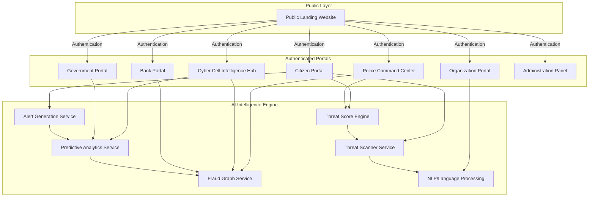

### Navigation Flow Architecture

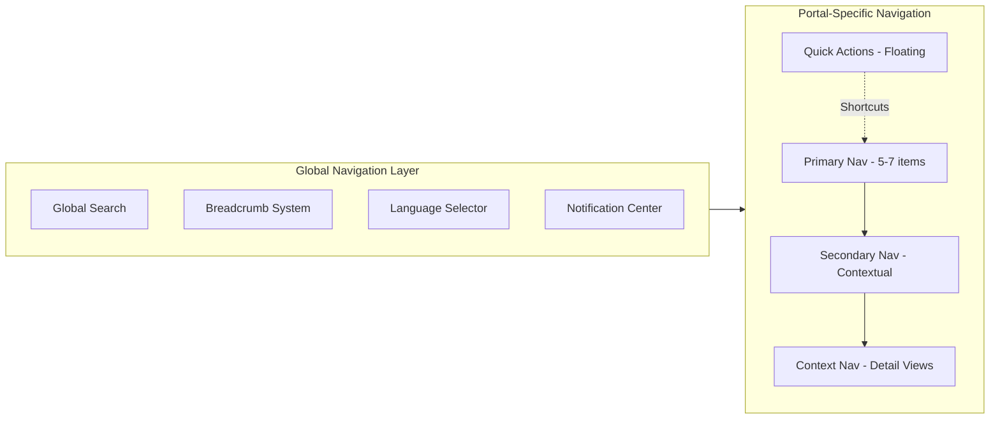

---

## Components and Interfaces

### Public Landing Website

**Purpose**: Serves as the unauthenticated entry point for all users — citizens, law enforcement, government officials, and organizational partners.

**Interface**: Provides threat awareness content, platform onboarding, authentication gateway, and public statistics dashboards.

### Citizen Portal

**Purpose**: Primary interface for Indian citizens to scan URLs/messages, view threat alerts, report cybercrimes, and track case status.

**Interface**: Threat scanner, personal dashboard, alert feed, complaint filing, case tracking, and educational content.

### Police Command Center

**Purpose**: Operational hub for police officers to manage cybercrime cases, coordinate investigations, and access intelligence feeds.

**Interface**: Case management, investigation tools, inter-department communication, evidence handling, and jurisdiction-based filtering.

### Cyber Cell Intelligence Hub

**Purpose**: Advanced analytics and intelligence platform for specialized cyber cell investigators.

**Interface**: Fraud graph visualization, pattern analysis, deep investigation tools, cross-jurisdictional intelligence sharing, and predictive threat modeling.

### Government Portal

**Purpose**: Aggregated analytics and policy-level intelligence for government officials (no PII exposure).

**Interface**: Statistical dashboards, trend analysis, regional comparisons, policy impact metrics, and anonymized intelligence reports.

### Bank Portal

**Purpose**: Financial fraud intelligence sharing and coordination interface for banking partners.

**Interface**: Transaction fraud alerts, mule account detection, coordinated response tools, and financial pattern analytics.

### Organization Portal

**Purpose**: Enterprise-facing interface for organizations to monitor threats targeting their brand/infrastructure.

**Interface**: Brand impersonation alerts, phishing campaign tracking, employee awareness metrics, and organizational threat scores.

### Administration Panel

**Purpose**: Platform governance, user management, system configuration, and operational monitoring.

**Interface**: Role/permission management, system health monitoring, content management, audit logs, and platform configuration.

### AI Intelligence Engine (Backend Services)

**Purpose**: Shared backend providing AI-powered threat analysis, scoring, graph analytics, and alert generation across all portals.

**Key Services**:
- **Threat Scanner Service**: URL/message/file scanning and classification
- **Threat Score Engine**: Multi-factor risk scoring for entities and transactions
- **Fraud Graph Service**: Relationship mapping and network analysis
- **Predictive Analytics Service**: Trend forecasting and early warning generation
- **NLP/Language Processing**: Multi-language content analysis (15 Indian languages)
- **Alert Generation Service**: Real-time alert routing based on region and severity

---

## SECTION 1: Overall Product Hierarchy

### Complete Platform Tree Structure

```
CyberShield AI
├── Public Landing Website
│   ├── Home
│   ├── About / Mission
│   ├── Features Overview
│   ├── Safety Resources (public)
│   ├── Blog / Threat Alerts
│   └── Authentication (Login / Register)
├── Citizen Portal
│   ├── Dashboard (Safety Score, Alerts, Recent Scans)
│   ├── AI Threat Scanner
│   │   ├── Text Scanner (SMS/WhatsApp/Email)
│   │   ├── URL Scanner
│   │   └── Voice/Call Analyzer
│   ├── Scan History
│   ├── Smart Reporting
│   │   ├── New Report (Guided Flow)
│   │   ├── Draft Reports
│   │   └── Submitted Reports / Track Status
│   ├── Evidence Vault (User's Evidence)
│   ├── Safety Education
│   │   ├── Learning Modules
│   │   ├── Quizzes
│   │   └── Progress Tracking
│   ├── Community Shield
│   │   ├── Trending Threats
│   │   └── Community Stats
│   ├── Alerts & Notifications
│   ├── AI Legal Assistant (FIR Draft)
│   ├── Settings & Profile
│   └── Language Selection
├── Police Command Center
│   ├── Case Dashboard
│   │   ├── Active Cases
│   │   ├── Case Queue (New Reports)
│   │   ├── Escalated Cases
│   │   └── Closed Cases
│   ├── Case Detail View
│   │   ├── Case Summary (AI-Generated)
│   │   ├── Evidence Panel
│   │   ├── Investigation Notes
│   │   ├── Linked Cases
│   │   └── FIR Draft Review
│   ├── Intelligence Search
│   │   ├── Phone Number Search
│   │   ├── Account Number Search
│   │   ├── Email/IP Search
│   │   └── Cross-Case Correlation
│   ├── Case Intelligence Graph
│   ├── Alert Management (Broadcast Alerts)
│   ├── Analytics & Reports
│   └── Team Management
├── Cyber Cell Intelligence Hub
│   ├── Threat Intelligence Dashboard
│   ├── Case Intelligence Graph (Advanced)
│   │   ├── Network Visualization
│   │   ├── Cluster Detection
│   │   └── Entity Deep Dive
│   ├── Predictive Intelligence
│   │   ├── Weekly Predictions
│   │   ├── Campaign Tracking
│   │   └── Accuracy Metrics
│   ├── Financial Fraud Graph
│   │   ├── Money Flow Visualization
│   │   ├── Money Mule Detection
│   │   └── Account Flagging
│   ├── AI Audit Trail
│   └── Advanced Analytics
├── Government Portal
│   ├── National Threat Dashboard
│   │   ├── Real-Time Threat Map
│   │   ├── State-wise Statistics
│   │   └── District Heat Maps
│   ├── Demographic Analysis
│   ├── Policy Impact Metrics
│   ├── Report Generation
│   └── Intervention Tracking
├── Bank / Financial Institution Portal
│   ├── Fraud Intelligence Feed
│   ├── Account Risk Query
│   ├── Money Mule Alerts
│   ├── API Integration Management
│   └── Compliance Reports
├── Organization Portal
│   ├── Training Management
│   │   ├── Program Creation
│   │   ├── Employee Assignment
│   │   └── Progress Tracking
│   ├── Phishing Simulation
│   ├── Organizational Risk Report
│   └── Employee Portal
├── Administration Panel
│   ├── User Management
│   ├── Role & Permission Management
│   ├── Content Management (Education, Alerts)
│   ├── AI Model Management
│   ├── System Health & Monitoring
│   ├── Audit Logs
│   ├── Feature Flags
│   └── Platform Configuration
└── AI Intelligence Engine (Backend Service Layer)
    ├── Threat Scanner Service
    ├── Threat Score Engine
    ├── Fraud Graph Service
    ├── Predictive Analytics Service
    ├── NLP/Language Processing
    └── Alert Generation Service
```

### Hierarchy Depth Rules

| Level | Contains | Example |
|-------|----------|---------|
| L0 | Platform Root | CyberShield AI |
| L1 | Portals | Citizen Portal, Police Command Center |
| L2 | Sections | AI Threat Scanner, Case Dashboard |
| L3 | Subsections | Text Scanner, Active Cases |
| L4 | Detail/Action | Individual Scan Result, Case #FR-2024-001 |

**Max Depth Rule**: No user journey exceeds 4 navigation levels from portal root.

### Hierarchy Resolution Algorithm

```pascal
PROCEDURE resolveHierarchyPath(currentScreen)
  INPUT: currentScreen (Screen object with portal, section, subsection, item)
  OUTPUT: breadcrumbPath (ordered list of navigation nodes)
  
  SEQUENCE
    breadcrumbPath ← EMPTY_LIST
    
    // Level 0: Always include portal name
    breadcrumbPath.ADD(currentScreen.portal.name)
    
    // Level 1: Section (always present for authenticated screens)
    IF currentScreen.section IS NOT NULL THEN
      breadcrumbPath.ADD(currentScreen.section.name)
    END IF
    
    // Level 2: Subsection (present for nested views)
    IF currentScreen.subsection IS NOT NULL THEN
      breadcrumbPath.ADD(currentScreen.subsection.name)
    END IF
    
    // Level 3: Item (present for detail views)
    IF currentScreen.item IS NOT NULL THEN
      breadcrumbPath.ADD(currentScreen.item.displayId)
    END IF
    
    RETURN breadcrumbPath
  END SEQUENCE
END PROCEDURE
```

**Preconditions:**
- currentScreen is a valid Screen object with at minimum a portal reference
- portal.name is a non-empty string

**Postconditions:**
- breadcrumbPath contains 1 to 4 elements
- First element is always the portal name
- Elements are ordered from broadest to most specific

---

## SECTION 2: Navigation Architecture

### Navigation System by Role

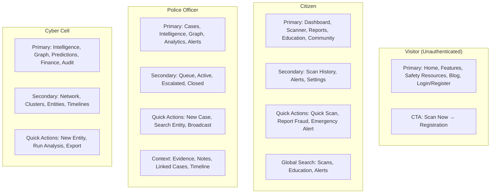

### Detailed Navigation Specifications

#### Visitor (Unauthenticated)

| Element | Items | Behavior |
|---------|-------|----------|
| Primary Nav | Home, Features, Safety Resources, Blog, Login/Register | Always visible, horizontal top bar |
| Secondary Nav | None | — |
| CTA | "Scan Now" | Floating button, leads to registration |
| Footer Nav | About, Contact, Privacy Policy, Terms | Standard footer |

#### Citizen

| Element | Items | Behavior |
|---------|-------|----------|
| Primary Nav | Dashboard, Scanner, Reports, Education, Community | Left sidebar or bottom bar (mobile) |
| Secondary Nav | Scan History, Alerts, Settings | Contextual top bar within sections |
| Quick Actions | Quick Scan (floating), Report Fraud, Emergency Alert | Persistent floating action button |
| Global Search | Search scan history, education content, alerts | Top bar, scoped to citizen data |

#### Police Officer

| Element | Items | Behavior |
|---------|-------|----------|
| Primary Nav | Cases, Intelligence, Graph, Analytics, Alerts | Left sidebar, collapsible |
| Secondary Nav | Case Queue, Active, Escalated, Closed | Tab bar within Cases section |
| Quick Actions | New Case, Search Entity, Broadcast Alert | Command palette + floating |
| Context Nav | Evidence, Notes, Linked Cases, Timeline | Within case detail — tab/panel |

#### Cyber Cell

| Element | Items | Behavior |
|---------|-------|----------|
| Primary Nav | Intelligence, Graph, Predictions, Finance, Audit | Left sidebar |
| Secondary Nav | Network view, Clusters, Entities, Timelines | Filter/view toggles |
| Quick Actions | New Entity, Run Analysis, Export Report | Toolbar + shortcuts |

#### Government

| Element | Items | Behavior |
|---------|-------|----------|
| Primary Nav | Dashboard, Map, Demographics, Reports, Policy | Left sidebar |
| Secondary Nav | By state, By type, By timeframe | Filter controls |

#### Bank

| Element | Items | Behavior |
|---------|-------|----------|
| Primary Nav | Feed, Query, Mule Alerts, API, Compliance | Left sidebar |
| Quick Actions | Account Lookup, Flag Account | Inline + toolbar |

#### Organization

| Element | Items | Behavior |
|---------|-------|----------|
| Primary Nav | Training, Simulation, Reports, Employees | Left sidebar |
| Secondary Nav | Active Programs, Completed, Scheduled | Tab bar |

#### Administrator

| Element | Items | Behavior |
|---------|-------|----------|
| Primary Nav | Users, Roles, Content, AI, System, Audit, Config | Left sidebar with sections |
| Secondary Nav | Per section drill-down | Nested navigation |

### Breadcrumb Strategy

**Pattern**: `Portal > Section > Subsection > Item`

**Examples**:
- `Police > Cases > Active > Case #FR-2024-001`
- `Citizen > Scanner > Text Scanner > Scan Result #45672`
- `Cyber Cell > Graph > Clusters > Cluster #NET-089`
- `Government > Map > Maharashtra > Pune District`
- `Admin > Users > Police Officers > Officer Detail`

**Rules**:
- Max depth: 4 levels
- Each breadcrumb segment is clickable (navigates to that level)
- Current page (last segment) is not linked
- Mobile: Show last 2 segments with "..." expansion

### Global Search Architecture

```pascal
PROCEDURE executeGlobalSearch(query, userRole, currentPortal)
  INPUT: query (string), userRole (Role enum), currentPortal (Portal enum)
  OUTPUT: searchResults (list of SearchResult)
  
  SEQUENCE
    // Step 1: Determine searchable scopes based on role
    scopes ← getSearchScopes(userRole)
    
    // Step 2: Apply portal context as default scope
    primaryScope ← mapPortalToScope(currentPortal)
    
    // Step 3: Execute search across permitted scopes
    results ← EMPTY_LIST
    
    FOR EACH scope IN scopes DO
      scopeResults ← searchIndex(query, scope)
      results.ADD_ALL(scopeResults)
    END FOR
    
    // Step 4: Rank results — primary scope first
    sortedResults ← rankResults(results, primaryScope)
    
    // Step 5: Apply pagination
    RETURN paginate(sortedResults, pageSize: 20)
  END SEQUENCE
END PROCEDURE
```

**Search Scope by Role**:

| Role | Searchable Content |
|------|-------------------|
| Citizen | Scan history, education content, alerts, reports |
| Police | Cases, entities, evidence, phone numbers, accounts |
| Cyber Cell | All police scopes + predictions, network clusters |
| Government | Statistics, regions, reports, interventions |
| Bank | Accounts, transactions, fraud alerts, API logs |
| Organization | Employees, training programs, simulations |
| Admin | All content + users, roles, config, audit logs |

**Supported Search Formats**: text, phone numbers, account numbers, case IDs, URLs, email addresses

---

## SECTION 3: Complete Screen Inventory

### Public Landing Website (6 screens)

| # | Screen | Purpose | Primary User | Key Content Areas | Auth | Dependencies | Future Expansion |
|---|--------|---------|-------------|-------------------|------|--------------|-----------------|
| 1 | Home | Platform introduction, value prop | Visitor | Hero, features grid, statistics, testimonials, CTA | No | None | A/B testing variants |
| 2 | About / Mission | Platform mission, team | Visitor | Mission statement, team, partners, timeline | No | None | Press kit, careers |
| 3 | Features Overview | Detailed feature showcase | Visitor | Feature cards, demos, comparison table | No | None | Interactive demos |
| 4 | Safety Resources | Public threat awareness | Visitor | Threat guides, tips, downloadable content | No | CMS | Multilingual expansion |
| 5 | Blog / Threat Alerts | Public threat news | Visitor | Articles, alerts, categories, search | No | CMS, Alert System | RSS feed, newsletter |
| 6 | Authentication | Login / Register | Visitor | Login form, register flow, OTP verification | No | Auth System | SSO, DigiLocker |

### Citizen Portal (15 screens)

| # | Screen | Purpose | Primary User | Key Content Areas | Auth | Dependencies | Future Expansion |
|---|--------|---------|-------------|-------------------|------|--------------|-----------------|
| 7 | Citizen Dashboard | Personal safety overview | Citizen | Safety Score, alerts, recent scans, tips | Yes - Citizen | Score Engine, Alerts | Widget customization |
| 8 | Text Scanner | Analyze SMS/WhatsApp/Email | Citizen | Input area, scan button, result display | Yes - Citizen | Threat Scanner | Bulk scan, auto-detect |
| 9 | URL Scanner | Analyze suspicious URLs | Citizen | URL input, domain info, result | Yes - Citizen | Threat Scanner | Browser extension hook |
| 10 | Voice/Call Analyzer | Analyze call recordings | Citizen | Audio upload, waveform, result | Yes - Citizen | Threat Scanner, NLP | Real-time call analysis |
| 11 | Scan History | Past scan results | Citizen | Chronological list, filters, export | Yes - Citizen | Threat Scanner | Analytics, patterns |
| 12 | New Report (Guided) | File fraud report | Citizen | Multi-step form, evidence upload | Yes - Citizen | Evidence Vault | Auto-populate from scan |
| 13 | Draft Reports | Incomplete reports | Citizen | Draft list, resume editing | Yes - Citizen | Case Management | Auto-save reminders |
| 14 | Submitted Reports | Track report status | Citizen | Status timeline, case reference | Yes - Citizen | Case Management | Push notifications |
| 15 | Evidence Vault | User's stored evidence | Citizen | File list, integrity status, access log | Yes - Citizen | Evidence Vault | Categorization, tags |
| 16 | Learning Modules | Cyber safety education | Citizen | Module list, progress bars, categories | Yes - Citizen | Education Module | Gamification |
| 17 | Quizzes | Knowledge assessment | Citizen | Questions, score, explanation | Yes - Citizen | Education Module | Adaptive difficulty |
| 18 | Progress Tracking | Education progress | Citizen | Completion %, badges, recommendations | Yes - Citizen | Education Module | Leaderboards |
| 19 | Community Shield | Community threat intel | Citizen | Trending threats, stats, contribution | Yes - Citizen | Community Shield | Discussion forum |
| 20 | AI Legal Assistant | FIR draft generation | Citizen | Report selection, FIR preview, legal sections | Yes - Citizen | Legal Assistant | Lawyer referral |
| 21 | Settings & Profile | Account management | Citizen | Profile, preferences, language, notifications | Yes - Citizen | Auth System | 2FA, linked accounts |

### Police Command Center (12 screens)

| # | Screen | Purpose | Primary User | Key Content Areas | Auth | Dependencies | Future Expansion |
|---|--------|---------|-------------|-------------------|------|--------------|-----------------|
| 22 | Case Dashboard | Overview of all cases | Police | Stats cards, case list, filters | Yes - Police | Case Management | Customizable widgets |
| 23 | Case Queue | New unassigned reports | Police | Priority queue, quick assign, preview | Yes - Police | Case Management | Auto-assignment AI |
| 24 | Active Cases | Cases under investigation | Police | Case list, status indicators, deadlines | Yes - Police | Case Management | Kanban view |
| 25 | Escalated Cases | High-priority cases | Police | Escalation reason, SLA timers | Yes - Police | Case Management | Inter-district transfer |
| 26 | Closed Cases | Resolved cases archive | Police | Resolution stats, searchable archive | Yes - Police | Case Management | Outcome analytics |
| 27 | Case Detail View | Single case deep dive | Police | Summary, evidence, notes, timeline | Yes - Police | Case Mgmt, Evidence | Collaboration tools |
| 28 | Case Summary (AI) | AI-generated case brief | Police | Key findings, suggested leads, similar cases | Yes - Police | AI Engine | Confidence scoring |
| 29 | Evidence Panel | Case evidence viewer | Police | File viewer, integrity checks, chain | Yes - Police | Evidence Vault | Annotation tools |
| 30 | Intelligence Search | Cross-case entity search | Police | Search bar, entity results, connections | Yes - Police | Intelligence Graph | Saved searches |
| 31 | Case Intelligence Graph | Relationship visualization | Police | Interactive graph, entity details | Yes - Police | Fraud Graph | Timeline mode |
| 32 | Alert Management | Broadcast citizen alerts | Police | Alert composer, audience, schedule | Yes - Police | Alert System | Templates library |
| 33 | Analytics & Reports | Jurisdiction analytics | Police | Charts, trends, export options | Yes - Police | Analytics | Custom dashboards |

### Cyber Cell Intelligence Hub (10 screens)

| # | Screen | Purpose | Primary User | Key Content Areas | Auth | Dependencies | Future Expansion |
|---|--------|---------|-------------|-------------------|------|--------------|-----------------|
| 34 | Threat Intelligence Dashboard | Threat landscape overview | Cyber Cell | Threat map, active campaigns, KPIs | Yes - Cyber Cell | All AI Services | Customizable feeds |
| 35 | Network Visualization | Entity relationship graph | Cyber Cell | Full graph, zoom, filter, search | Yes - Cyber Cell | Fraud Graph | 3D visualization |
| 36 | Cluster Detection | Organized network identification | Cyber Cell | Cluster list, confidence, members | Yes - Cyber Cell | Fraud Graph | ML-assisted clustering |
| 37 | Entity Deep Dive | Single entity full profile | Cyber Cell | All connections, history, risk score | Yes - Cyber Cell | Fraud Graph | Entity timeline |
| 38 | Weekly Predictions | Emerging threat forecasts | Cyber Cell | Prediction cards, confidence, evidence | Yes - Cyber Cell | Predictive Engine | Model explainability |
| 39 | Campaign Tracking | Active fraud campaign monitor | Cyber Cell | Campaign list, victim count, spread | Yes - Cyber Cell | Alert System | Response playbooks |
| 40 | Accuracy Metrics | Prediction performance | Cyber Cell | Accuracy charts, calibration, trends | Yes - Cyber Cell | Predictive Engine | A/B model comparison |
| 41 | Money Flow Visualization | Transaction chain graph | Cyber Cell | Flow diagram, amounts, timing | Yes - Cyber Cell | Financial Graph | Real-time streaming |
| 42 | Money Mule Detection | Mule account identification | Cyber Cell | Flagged accounts, patterns, confidence | Yes - Cyber Cell | Financial Graph | Bank integration |
| 43 | AI Audit Trail | AI decision transparency | Cyber Cell | Decision log, inputs, outputs, reasoning | Yes - Cyber Cell | AI Engine | Bias detection |

### Government Portal (7 screens)

| # | Screen | Purpose | Primary User | Key Content Areas | Auth | Dependencies | Future Expansion |
|---|--------|---------|-------------|-------------------|------|--------------|-----------------|
| 44 | National Threat Dashboard | Country-wide threat overview | Government | KPIs, national stats, active campaigns | Yes - Govt | Analytics | CERT-In integration |
| 45 | Real-Time Threat Map | Geographic threat visualization | Government | India map, state overlays, hotspots | Yes - Govt | Alert System | Drill-down to district |
| 46 | State-wise Statistics | Per-state breakdown | Government | State comparison, rankings, trends | Yes - Govt | Analytics | Predictive alerts |
| 47 | District Heat Maps | Granular geographic data | Government | District overlay, intensity coloring | Yes - Govt | Analytics | Panchayat level |
| 48 | Demographic Analysis | Population segment analysis | Government | Age, gender, urban/rural, income | Yes - Govt | Analytics | Custom segments |
| 49 | Policy Impact Metrics | Intervention effectiveness | Government | Before/after comparison, correlation | Yes - Govt | Analytics | Causal inference |
| 50 | Report Generation | Export filtered reports | Government | Report builder, templates, export | Yes - Govt | Analytics | Scheduled reports |

### Bank / Financial Institution Portal (5 screens)

| # | Screen | Purpose | Primary User | Key Content Areas | Auth | Dependencies | Future Expansion |
|---|--------|---------|-------------|-------------------|------|--------------|-----------------|
| 51 | Fraud Intelligence Feed | Real-time fraud alerts | Bank | Alert stream, severity, linked cases | Yes - Bank | Alert System | Webhook config |
| 52 | Account Risk Query | Check account risk | Bank | Search, risk score, history, network | Yes - Bank | Financial Graph | Batch query |
| 53 | Money Mule Alerts | Mule account notifications | Bank | Alert list, evidence, action buttons | Yes - Bank | Financial Graph | Auto-freeze integration |
| 54 | API Integration Management | API key and webhook config | Bank | Keys, endpoints, logs, rate limits | Yes - Bank | Platform API | SDK generation |
| 55 | Compliance Reports | Regulatory reporting | Bank | Report templates, schedules, history | Yes - Bank | Analytics | RBI format compliance |

### Organization Portal (6 screens)

| # | Screen | Purpose | Primary User | Key Content Areas | Auth | Dependencies | Future Expansion |
|---|--------|---------|-------------|-------------------|------|--------------|-----------------|
| 56 | Training Management | Manage training programs | Organization | Program list, creation, assignment | Yes - Org | Education Module | LMS integration |
| 57 | Program Creation | Build training programs | Organization | Module selection, scheduling, targets | Yes - Org | Education Module | Custom content |
| 58 | Employee Assignment | Assign training to staff | Organization | Employee list, bulk assign, deadlines | Yes - Org | Education Module | Dept-based rules |
| 59 | Phishing Simulation | Deploy test phishes | Organization | Campaign builder, templates, results | Yes - Org | Alert System | AI-generated phishes |
| 60 | Organizational Risk Report | Aggregate risk overview | Organization | Risk score, trends, department breakdown | Yes - Org | Analytics | Benchmark comparison |
| 61 | Employee Portal | Individual training view | Org Employee | My training, progress, certificates | Yes - Org | Education Module | Mobile-first |

### Administration Panel (8 screens)

| # | Screen | Purpose | Primary User | Key Content Areas | Auth | Dependencies | Future Expansion |
|---|--------|---------|-------------|-------------------|------|--------------|-----------------|
| 62 | User Management | Manage platform users | Admin | User list, CRUD, role assignment | Yes - Admin | Auth System | Bulk operations |
| 63 | Role & Permission Mgmt | Configure RBAC | Admin | Role list, permission matrix, custom roles | Yes - Admin | Auth System | Attribute-based AC |
| 64 | Content Management | Manage education/alerts | Admin | Content list, editor, publish workflow | Yes - Admin | CMS | Version control |
| 65 | AI Model Management | Monitor AI models | Admin | Model versions, performance, A/B tests | Yes - Admin | AI Engine | Model marketplace |
| 66 | System Health | Platform monitoring | Admin | Uptime, latency, error rates, resources | Yes - Admin | Infrastructure | Auto-scaling rules |
| 67 | Audit Logs | Activity audit trail | Admin | Filterable logs, export, anomaly flags | Yes - Admin | All Modules | SIEM integration |
| 68 | Feature Flags | Toggle features | Admin | Flag list, rollout %, targeting rules | Yes - Admin | All Modules | Experimentation |
| 69 | Platform Configuration | System-wide settings | Admin | Config editor, environment management | Yes - Admin | All Modules | Config versioning |

### Total Screen Count: 69 screens

**Summary by Portal:**
| Portal | Screen Count |
|--------|-------------|
| Public Landing | 6 |
| Citizen Portal | 15 |
| Police Command Center | 12 |
| Cyber Cell Hub | 10 |
| Government Portal | 7 |
| Bank Portal | 5 |
| Organization Portal | 6 |
| Administration Panel | 8 |
| **Total** | **69** |

---

## SECTION 4: User Flow Mapping

### Flow 1: Citizen — First-Time Scan

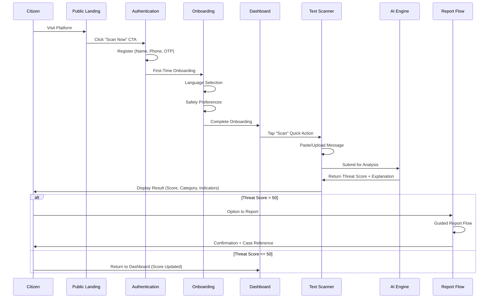

**Flow Algorithm:**

```pascal
PROCEDURE citizenFirstTimeScan(citizen)
  INPUT: citizen (new user arriving from public landing)
  OUTPUT: scanResult (ThreatResult) OR reportConfirmation (CaseReference)
  
  SEQUENCE
    // Phase 1: Acquisition
    landingPage ← renderPublicLanding()
    DISPLAY landingPage WITH scanCTA
    
    // Phase 2: Registration
    WHEN citizen.clicks(scanCTA) DO
      credentials ← collectRegistration(name, phone, otp)
      session ← authenticate(credentials)
    END WHEN
    
    // Phase 3: Onboarding (first-time only)
    IF citizen.isFirstLogin THEN
      language ← presentLanguageSelection(15_LANGUAGES)
      preferences ← collectSafetyPreferences()
      citizen.updateProfile(language, preferences)
    END IF
    
    // Phase 4: Navigate to Scanner
    dashboard ← renderCitizenDashboard(citizen)
    NAVIGATE_TO textScanner
    
    // Phase 5: Scan Execution
    content ← citizen.pasteOrUpload(message)
    scanResult ← ThreatScanner.analyze(content, type: TEXT)
    
    // Phase 6: Result Display
    DISPLAY scanResult WITH explanation, category, indicators
    
    // Phase 7: Conditional Report
    IF scanResult.threatScore > 50 THEN
      DISPLAY reportOption
      IF citizen.choosesToReport THEN
        report ← guidedReportFlow(scanResult, citizen)
        caseRef ← submitReport(report)
        RETURN caseRef
      END IF
    END IF
    
    RETURN scanResult
  END SEQUENCE
END PROCEDURE
```

**Preconditions:**
- Public landing page is accessible
- Authentication service is available
- Threat Scanner service is operational

**Postconditions:**
- Citizen has an active account with language preference set
- Scan result is stored in scan history
- If reported: case is created and forwarded to police queue within 60 seconds

### Flow 2: Citizen — Fraud Report to Police

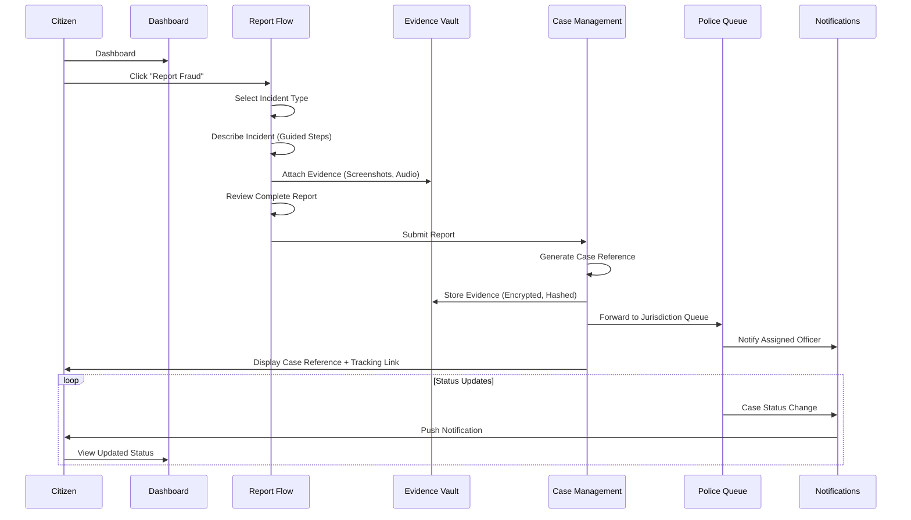

**Flow Algorithm:**

```pascal
PROCEDURE citizenFraudReport(citizen, incidentData)
  INPUT: citizen (authenticated Citizen_User), incidentData (optional, from previous scan)
  OUTPUT: caseReference (string), trackingURL (string)
  
  SEQUENCE
    // Step 1: Initialize Report
    report ← NEW FraudReport()
    report.reporter ← citizen.id
    report.startedAt ← NOW()
    
    // Step 2: Incident Type Selection
    report.type ← presentIncidentTypes([
      FINANCIAL_FRAUD, PHISHING, IMPERSONATION,
      TECH_SUPPORT_SCAM, LOTTERY_SCAM, JOB_FRAUD
    ])
    
    // Step 3: Auto-populate if from scan
    IF incidentData IS NOT NULL THEN
      report.autoPopulate(incidentData)
    END IF
    
    // Step 4: Guided Data Collection
    report.dateTime ← collectDateTime()
    report.channel ← collectChannel(SMS, WHATSAPP, EMAIL, CALL, WEBSITE)
    report.perpetratorDetails ← collectPerpetrator(optional: TRUE)
    report.financialLoss ← collectAmount(optional: TRUE)
    report.narrative ← collectDescription(minLength: 50)
    
    // Step 5: Evidence Attachment
    FOR EACH evidenceFile IN citizen.attachFiles() DO
      VALIDATE format IN [JPEG, PNG, PDF, MP3, WAV, MP4]
      hash ← computeSHA256(evidenceFile)
      encryptedFile ← encrypt(evidenceFile, citizen.key, assignedOfficer.key)
      EvidenceVault.store(encryptedFile, hash, auditTrail: TRUE)
      report.evidence.ADD(encryptedFile.reference)
    END FOR
    
    // Step 6: Review and Submit
    DISPLAY reportReview(report)
    AWAIT citizen.confirms()
    
    // Step 7: Submission
    caseReference ← CaseManagement.createCase(report)
    jurisdiction ← resolveJurisdiction(citizen.location)
    CaseManagement.forwardToQueue(caseReference, jurisdiction)
    
    // Step 8: Confirmation
    NOTIFY citizen WITH caseReference, trackingURL
    
    RETURN (caseReference, trackingURL)
  END SEQUENCE
END PROCEDURE
```

**Preconditions:**
- Citizen is authenticated with valid session
- Evidence Vault encryption keys are available
- Case Management service is operational

**Postconditions:**
- Case exists in system with unique reference number
- All evidence is encrypted with SHA-256 hash recorded
- Report is in police queue for assigned jurisdiction
- Citizen can track status via case reference

**Loop Invariant (Evidence Upload):**
- All previously uploaded evidence files have valid hashes stored
- Each file is encrypted with dual-key access (citizen + officer)

### Flow 3: Police — Case Investigation

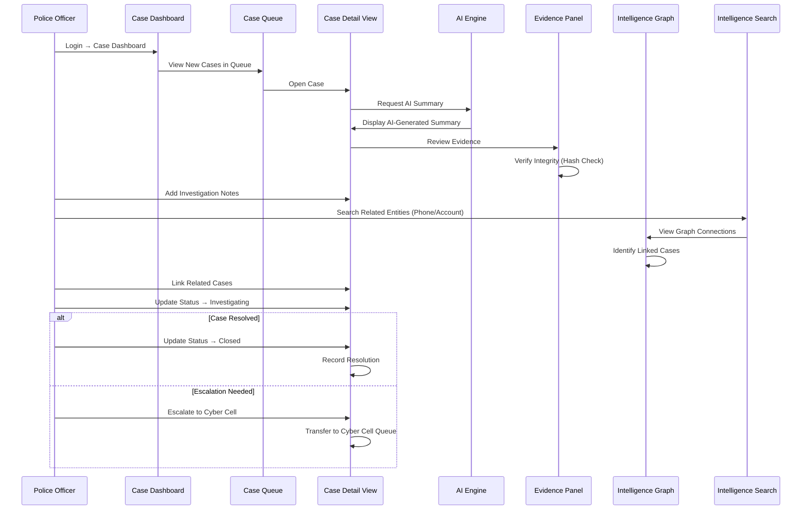

**Flow Algorithm:**

```pascal
PROCEDURE policeInvestigation(officer, caseId)
  INPUT: officer (authenticated Police_User), caseId (from queue)
  OUTPUT: caseResolution (Status enum)
  
  SEQUENCE
    // Step 1: Case Acquisition
    case ← CaseManagement.getCase(caseId)
    ASSERT case.jurisdiction EQUALS officer.jurisdiction
    CaseManagement.assign(case, officer)
    case.status ← INVESTIGATING
    
    // Step 2: AI-Assisted Review
    aiSummary ← AIEngine.generateCaseSummary(case)
    DISPLAY aiSummary WITH confidenceLevel, suggestedLeads
    
    // Step 3: Evidence Review
    FOR EACH evidence IN case.evidence DO
      integrityCheck ← EvidenceVault.verifyHash(evidence)
      IF integrityCheck FAILS THEN
        FLAG evidence AS POTENTIALLY_TAMPERED
        NOTIFY systemAdmin
      END IF
      DISPLAY evidence WITH accessLogged
    END FOR
    
    // Step 4: Intelligence Gathering
    entities ← extractEntities(case)  // phones, accounts, emails, IPs
    FOR EACH entity IN entities DO
      connections ← IntelligenceGraph.search(entity)
      relatedCases ← IntelligenceGraph.findLinkedCases(entity)
      IF relatedCases.count > 0 THEN
        SUGGEST linkCases(case, relatedCases)
      END IF
    END FOR
    
    // Step 5: Investigation Notes
    officer.addNotes(case, observations, timeline)
    
    // Step 6: Resolution Decision
    IF case.requiresEscalation THEN
      CaseManagement.escalate(case, targetUnit: CYBER_CELL)
      RETURN ESCALATED
    ELSE IF case.isResolved THEN
      case.status ← CLOSED
      case.resolution ← officer.recordResolution()
      RETURN CLOSED
    ELSE
      RETURN INVESTIGATING
    END IF
  END SEQUENCE
END PROCEDURE
```

### Flow 4: Citizen — Safety Education

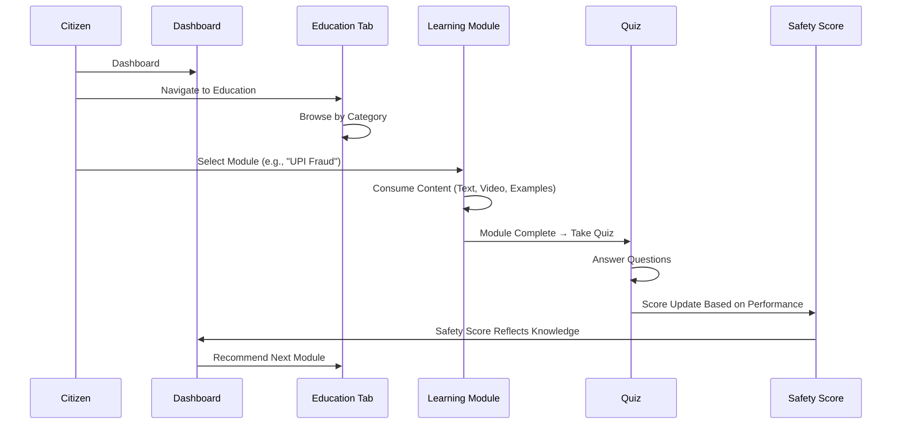

```pascal
PROCEDURE safetyEducationFlow(citizen, moduleId)
  INPUT: citizen (Citizen_User), moduleId (optional - if null, show recommendations)
  OUTPUT: updatedSafetyScore (integer 0-100)
  
  SEQUENCE
    // Step 1: Module Selection
    IF moduleId IS NULL THEN
      recommendations ← EducationModule.recommend(citizen.scanHistory, citizen.progress)
      moduleId ← citizen.selectModule(recommendations)
    END IF
    
    module ← EducationModule.getModule(moduleId, language: citizen.preferredLanguage)
    
    // Step 2: Content Delivery
    FOR EACH section IN module.sections DO
      RENDER section IN citizen.preferredLanguage
      trackProgress(citizen, module, section)
    END FOR
    
    // Step 3: Quiz Assessment
    quiz ← module.getQuiz()
    answers ← citizen.takeQuiz(quiz)
    quizScore ← evaluateAnswers(answers, quiz.correctAnswers)
    
    // Step 4: Score Update
    knowledgeFactor ← computeKnowledgeFactor(quizScore, module.difficulty)
    citizen.safetyScore ← recalculateSafetyScore(
      currentScore: citizen.safetyScore,
      knowledgeFactor: knowledgeFactor,
      scanHistory: citizen.scanHistory
    )
    
    // Step 5: Progress Recording
    EducationModule.recordCompletion(citizen, module, quizScore)
    
    RETURN citizen.safetyScore
  END SEQUENCE
END PROCEDURE
```

### Flow 5: Cyber Cell — Network Analysis

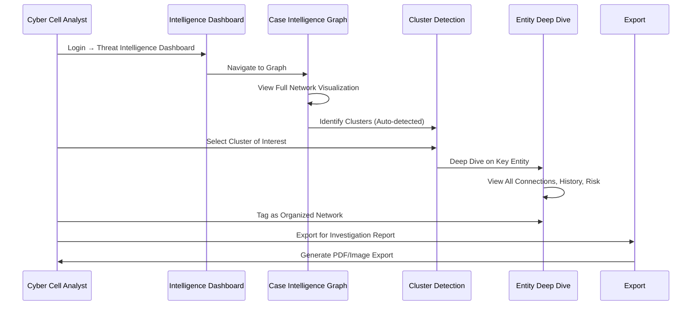

```pascal
PROCEDURE cyberCellNetworkAnalysis(analyst, targetCluster)
  INPUT: analyst (CyberCell_User), targetCluster (optional ClusterId)
  OUTPUT: analysisReport (NetworkAnalysisReport)
  
  SEQUENCE
    // Step 1: Load Intelligence Dashboard
    dashboard ← renderThreatIntelligence(analyst)
    activeCampaigns ← AlertSystem.getActiveCampaigns()
    
    // Step 2: Graph Visualization
    graph ← FraudGraph.loadFullNetwork(filters: analyst.savedFilters)
    ASSERT graph.nodeCount <= 10000  // Performance threshold
    ASSERT graph.edgeCount <= 50000
    
    // Step 3: Cluster Detection
    clusters ← graph.detectClusters(
      algorithm: COMMUNITY_DETECTION,
      minSize: 3,
      confidenceThreshold: 0.7
    )
    
    // Step 4: Cluster Selection and Deep Dive
    IF targetCluster IS NOT NULL THEN
      cluster ← clusters.find(targetCluster)
    ELSE
      cluster ← analyst.selectCluster(clusters)
    END IF
    
    // Step 5: Entity Analysis
    FOR EACH entity IN cluster.entities DO
      entity.connections ← graph.getConnections(entity, depth: 2)
      entity.riskScore ← computeCentralityScore(entity, cluster)
      entity.history ← CaseManagement.getEntityHistory(entity)
    END FOR
    
    // Step 6: Network Classification
    networkType ← classifyNetwork(cluster)  // ORGANIZED, LOOSELY_CONNECTED, MONEY_MULE_CHAIN
    analyst.tagCluster(cluster, networkType)
    
    // Step 7: Export
    analysisReport ← generateReport(cluster, entities, networkType)
    RETURN analysisReport
  END SEQUENCE
END PROCEDURE
```

### Flow 6: Bank — Money Mule Detection

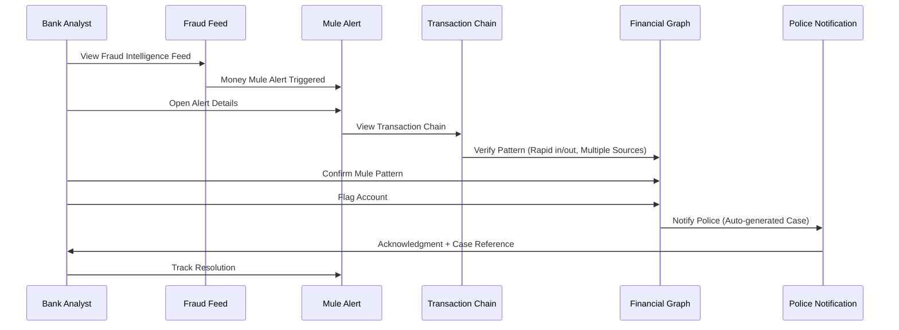

```pascal
PROCEDURE moneyMuleDetection(bankAnalyst, alertId)
  INPUT: bankAnalyst (Bank_User), alertId (MoneyMuleAlert identifier)
  OUTPUT: flagResult (AccountFlagResult)
  
  SEQUENCE
    // Step 1: Alert Review
    alert ← AlertSystem.getMuleAlert(alertId)
    account ← FinancialGraph.getAccount(alert.accountNumber)
    
    // Step 2: Transaction Chain Analysis
    transactions ← FinancialGraph.getTransactionChain(account, timeWindow: 30_DAYS)
    
    // Step 3: Pattern Verification
    patterns ← analyzeMulePatterns(transactions)
    isMule ← FALSE
    
    IF patterns.rapidInflowOutflow AND patterns.multipleSourceAccounts >= 3 THEN
      isMule ← TRUE
    END IF
    
    IF patterns.firstTimeHighValueInternational THEN
      isMule ← TRUE
    END IF
    
    IF patterns.linkedToReportedFraudCases >= 3 THEN
      isMule ← TRUE
    END IF
    
    // Step 4: Account Flagging
    IF isMule AND bankAnalyst.confirms() THEN
      FinancialGraph.flagAccount(account, status: CONFIRMED_MULE, evidence: patterns)
      
      // Step 5: Police Notification
      caseRef ← CaseManagement.createAutoCase(
        type: MONEY_MULE,
        account: account,
        evidence: transactions,
        flaggedBy: bankAnalyst
      )
      
      NOTIFY assignedPoliceUnit WITH caseRef
      RETURN AccountFlagResult(success: TRUE, caseRef: caseRef)
    END IF
    
    RETURN AccountFlagResult(success: FALSE, reason: "Pattern not confirmed")
  END SEQUENCE
END PROCEDURE
```

### Flow 7: Government — Policy Report

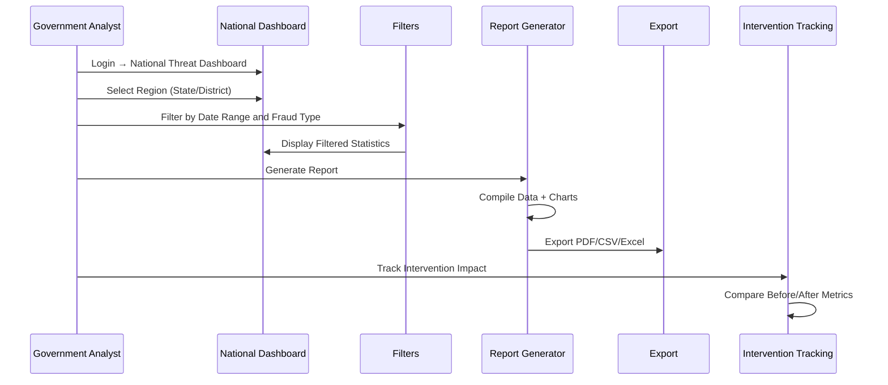

```pascal
PROCEDURE governmentPolicyReport(analyst, reportConfig)
  INPUT: analyst (Government_User), reportConfig (region, dateRange, fraudTypes)
  OUTPUT: exportedReport (File in PDF/CSV/Excel format)
  
  SEQUENCE
    // Step 1: Data Aggregation
    data ← Analytics.aggregate(
      region: reportConfig.region,
      dateRange: reportConfig.dateRange,
      fraudTypes: reportConfig.fraudTypes,
      groupBy: [STATE, DISTRICT, FRAUD_TYPE, MONTH]
    )
    
    // Step 2: Statistical Analysis
    statistics ← computeStatistics(data)
    statistics.totalReports ← data.count()
    statistics.financialLoss ← data.sumFinancialLoss()
    statistics.topCategories ← data.groupByType().top(5)
    statistics.yearOverYear ← computeTrend(data, interval: YEAR)
    
    // Step 3: Intervention Impact (if applicable)
    IF reportConfig.includeInterventionMetrics THEN
      interventions ← InterventionTracking.getByRegion(reportConfig.region)
      FOR EACH intervention IN interventions DO
        intervention.impact ← computeImpact(
          metricsBefore: data.filter(before: intervention.startDate),
          metricsAfter: data.filter(after: intervention.startDate)
        )
      END FOR
      statistics.interventionImpact ← interventions
    END IF
    
    // Step 4: Report Generation
    report ← ReportGenerator.build(
      template: reportConfig.template,
      data: statistics,
      charts: generateCharts(statistics),
      format: reportConfig.exportFormat
    )
    
    RETURN report
  END SEQUENCE
END PROCEDURE
```

### Flow 8: Organization — Phishing Simulation

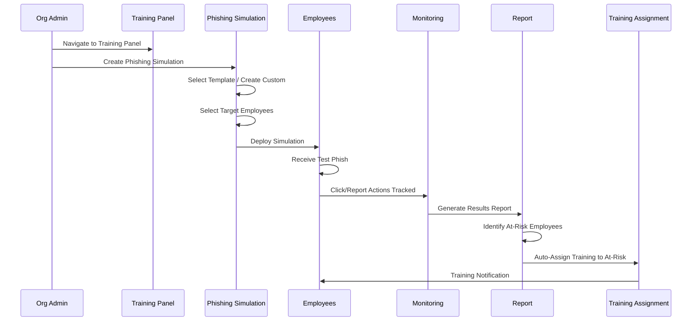

```pascal
PROCEDURE phishingSimulation(orgAdmin, simulationConfig)
  INPUT: orgAdmin (Organization_User), simulationConfig (template, targets, schedule)
  OUTPUT: simulationReport (PhishingSimulationReport)
  
  SEQUENCE
    // Step 1: Simulation Setup
    simulation ← NEW PhishingSimulation()
    simulation.template ← selectOrCreateTemplate(simulationConfig.template)
    simulation.targets ← resolveTargets(simulationConfig.targets)  // employees list
    simulation.schedule ← simulationConfig.schedule
    
    // Step 2: Deployment
    FOR EACH employee IN simulation.targets DO
      personalizedPhish ← personalizeTemplate(simulation.template, employee)
      deliverSimulation(personalizedPhish, employee, simulation.schedule)
    END FOR
    
    // Step 3: Monitoring (async, time-bounded)
    WHILE simulation.isActive AND NOT simulation.deadline.passed DO
      FOR EACH employee IN simulation.targets DO
        trackAction(employee, actions: [CLICKED, REPORTED, IGNORED, ENTERED_DATA])
      END FOR
    END WHILE
    
    // Step 4: Results Analysis
    results ← analyzeResults(simulation)
    results.clickRate ← countActions(CLICKED) / simulation.targets.count
    results.reportRate ← countActions(REPORTED) / simulation.targets.count
    results.dataEntryRate ← countActions(ENTERED_DATA) / simulation.targets.count
    
    // Step 5: Risk Identification
    atRiskEmployees ← simulation.targets.filter(
      action EQUALS CLICKED OR action EQUALS ENTERED_DATA
    )
    
    // Step 6: Auto-Assign Training
    FOR EACH employee IN atRiskEmployees DO
      TrainingModule.autoAssign(employee, modules: [PHISHING_AWARENESS, SAFE_BROWSING])
      NOTIFY employee WITH trainingAssignment
    END FOR
    
    // Step 7: Generate Report
    simulationReport ← generateSimulationReport(simulation, results, atRiskEmployees)
    RETURN simulationReport
  END SEQUENCE
END PROCEDURE
```

**Loop Invariant (Monitoring Phase):**
- All tracked actions are recorded with timestamp and employee ID
- No employee receives duplicate simulation messages
- Simulation remains active until deadline or manual stop

---

## SECTION 5: Feature Ownership

### Module Ownership Boundaries

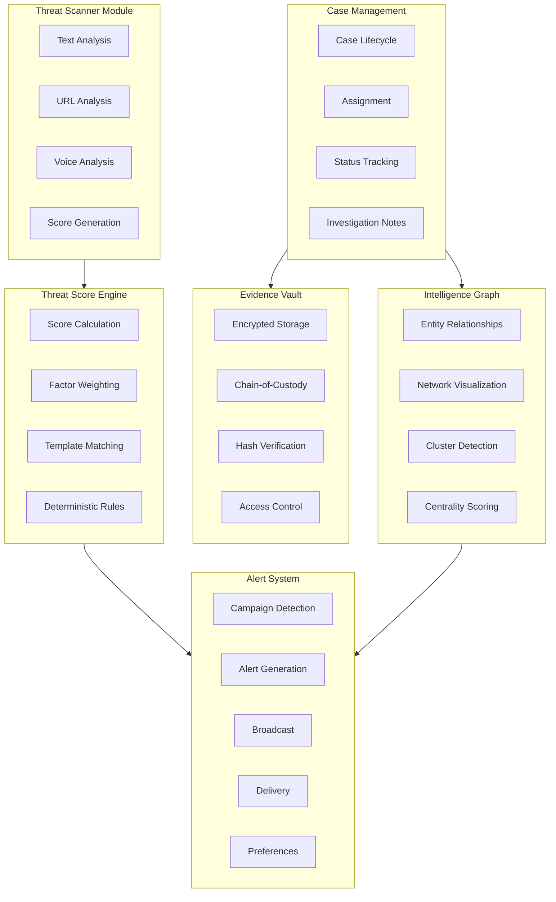

### Ownership Registry

| Module | Owns | Never Owns |
|--------|------|-----------|
| Threat Scanner | Text analysis, URL analysis, voice analysis, score generation | Case management, evidence storage, alert broadcasting |
| Threat Score Engine | Score calculation, factor weighting, template matching, deterministic rules | UI rendering, evidence handling, case assignment |
| Evidence Vault | Encrypted storage, chain-of-custody, hash verification, access control | Evidence creation, case lifecycle, user management |
| Case Management | Case lifecycle, assignment, status tracking, investigation notes | Threat analysis, evidence encryption, graph computation |
| Intelligence Graph | Entity relationships, network visualization, cluster detection, centrality scoring | Case assignment, alert delivery, user authentication |
| Alert System | Campaign detection, alert generation, broadcast, delivery, user preferences | Threat scanning, case management, evidence storage |
| Community Shield | Anonymization, intelligence pooling, trending analysis | Individual user data, case details, evidence access |
| Predictive Engine | Pattern analysis, prediction generation, accuracy tracking | Alert delivery, case management, user interface |
| Education Module | Content delivery, progress tracking, quiz scoring, language rendering | Threat scanning, case handling, evidence management |
| Financial Graph | Money flow visualization, mule detection, account flagging | Case lifecycle, alert broadcasting, user management |
| Legal Assistant | FIR draft generation, legal section suggestion, template formatting | Case submission to police, evidence storage, investigations |
| Auth System | Registration, login, session management, role assignment | Feature logic, content management, analytics |
| Admin Panel | User management, roles, feature flags, content management, system config | Domain logic, AI model inference, case investigation |

### Consumption Rules (No Duplication)

```pascal
STRUCTURE ConsumptionRule
  consumer: Module
  provider: Module
  accessType: READ_ONLY OR READ_WRITE
  dataScope: string
END STRUCTURE

// Defined Consumption Relationships
CONSTANT CONSUMPTION_RULES ← [
  // Police Dashboard CONSUMES Intelligence Graph (does not rebuild it)
  ConsumptionRule(
    consumer: POLICE_DASHBOARD,
    provider: INTELLIGENCE_GRAPH,
    accessType: READ_ONLY,
    dataScope: "jurisdiction-filtered entities and connections"
  ),
  
  // Citizen Dashboard CONSUMES Alert System (does not generate alerts)
  ConsumptionRule(
    consumer: CITIZEN_DASHBOARD,
    provider: ALERT_SYSTEM,
    accessType: READ_ONLY,
    dataScope: "region-relevant alerts for display"
  ),
  
  // Government Dashboard CONSUMES aggregated data (read-only)
  ConsumptionRule(
    consumer: GOVERNMENT_DASHBOARD,
    provider: ALL_MODULES,
    accessType: READ_ONLY,
    dataScope: "anonymized aggregated statistics only"
  ),
  
  // Bank Portal CONSUMES Financial Graph and Intelligence Graph
  ConsumptionRule(
    consumer: BANK_PORTAL,
    provider: FINANCIAL_GRAPH,
    accessType: READ_ONLY,
    dataScope: "account-level risk and transaction patterns"
  ),
  ConsumptionRule(
    consumer: BANK_PORTAL,
    provider: INTELLIGENCE_GRAPH,
    accessType: READ_ONLY,
    dataScope: "entity connections related to queried accounts"
  ),
  
  // Organization Portal CONSUMES Education Module
  ConsumptionRule(
    consumer: ORGANIZATION_PORTAL,
    provider: EDUCATION_MODULE,
    accessType: READ_WRITE,
    dataScope: "training content assignment and progress for org employees"
  )
]
```

**Key Principle**: If a module only needs to DISPLAY data from another module, it CONSUMES via API. It never reimplements the logic or stores a duplicate copy of the data.

---

## SECTION 6: Permissions Matrix

### Role Definitions

| Role | Description | Portal Access |
|------|-------------|---------------|
| Visitor | Unauthenticated user | Public Landing only |
| Citizen | Registered public user | Citizen Portal |
| Police Officer | Law enforcement (station level) | Police Command Center |
| Senior Investigator | Senior police / SHO | Police Command Center (elevated) |
| Cyber Cell | Specialized cybercrime unit | Cyber Cell Intelligence Hub |
| Government Analyst | Policy maker / official | Government Portal |
| Bank Analyst | Financial institution staff | Bank Portal |
| Organization Admin | Corporate admin | Organization Portal |
| Platform Admin | System administrator | Administration Panel |
| Super Admin | Root access, all systems | All Portals + Admin Panel |

### Comprehensive Permissions Matrix

| Permission | Visitor | Citizen | Police | Sr. Investigator | Cyber Cell | Govt Analyst | Bank Analyst | Org Admin | Platform Admin | Super Admin |
|-----------|---------|---------|--------|-------------------|------------|--------------|--------------|-----------|----------------|-------------|
| **Read Public Content** | ✅ | ✅ | ✅ | ✅ | ✅ | ✅ | ✅ | ✅ | ✅ | ✅ |
| **Register Account** | ✅ | — | — | — | — | — | — | — | — | — |
| **Scan Threats** | ❌ | ✅ | ✅ | ✅ | ✅ | ❌ | ❌ | ❌ | ✅ | ✅ |
| **View Own Scan History** | ❌ | ✅ | ❌ | ❌ | ❌ | ❌ | ❌ | ❌ | ❌ | ✅ |
| **Submit Fraud Report** | ❌ | ✅ | ❌ | ❌ | ❌ | ❌ | ❌ | ❌ | ❌ | ✅ |
| **View Own Evidence** | ❌ | ✅ | ❌ | ❌ | ❌ | ❌ | ❌ | ❌ | ❌ | ✅ |
| **Access Education** | ❌ | ✅ | ❌ | ❌ | ❌ | ❌ | ❌ | ✅ | ✅ | ✅ |
| **View Community Shield** | ❌ | ✅ | ✅ | ✅ | ✅ | ❌ | ❌ | ❌ | ✅ | ✅ |
| **Generate FIR Draft** | ❌ | ✅ | ✅ | ✅ | ❌ | ❌ | ❌ | ❌ | ❌ | ✅ |
| **View Case Dashboard** | ❌ | ❌ | ✅ | ✅ | ✅ | ❌ | ❌ | ❌ | ❌ | ✅ |
| **Manage Cases** | ❌ | ❌ | ✅ | ✅ | ✅ | ❌ | ❌ | ❌ | ❌ | ✅ |
| **Assign Cases** | ❌ | ❌ | ❌ | ✅ | ✅ | ❌ | ❌ | ❌ | ❌ | ✅ |
| **Access Case Evidence** | ❌ | ❌ | ✅ | ✅ | ✅ | ❌ | ❌ | ❌ | ❌ | ✅ |
| **Intelligence Search** | ❌ | ❌ | ✅ | ✅ | ✅ | ❌ | ✅ | ❌ | ❌ | ✅ |
| **View Intelligence Graph** | ❌ | ❌ | ✅ | ✅ | ✅ | ❌ | ❌ | ❌ | ❌ | ✅ |
| **Advanced Graph (Clusters)** | ❌ | ❌ | ❌ | ❌ | ✅ | ❌ | ❌ | ❌ | ❌ | ✅ |
| **Broadcast Alerts** | ❌ | ❌ | ✅ | ✅ | ✅ | ❌ | ❌ | ❌ | ✅ | ✅ |
| **View Predictions** | ❌ | ❌ | ❌ | ❌ | ✅ | ❌ | ❌ | ❌ | ❌ | ✅ |
| **Financial Graph Access** | ❌ | ❌ | ❌ | ❌ | ✅ | ❌ | ✅ | ❌ | ❌ | ✅ |
| **Flag Accounts** | ❌ | ❌ | ❌ | ❌ | ✅ | ❌ | ✅ | ❌ | ❌ | ✅ |
| **View National Stats** | ❌ | ❌ | ❌ | ❌ | ❌ | ✅ | ❌ | ❌ | ❌ | ✅ |
| **Generate Policy Reports** | ❌ | ❌ | ❌ | ❌ | ❌ | ✅ | ❌ | ❌ | ❌ | ✅ |
| **View Threat Map** | ❌ | ❌ | ❌ | ❌ | ✅ | ✅ | ❌ | ❌ | ✅ | ✅ |
| **API Access** | ❌ | ❌ | ❌ | ❌ | ❌ | ❌ | ✅ | ❌ | ✅ | ✅ |
| **Manage Training** | ❌ | ❌ | ❌ | ❌ | ❌ | ❌ | ❌ | ✅ | ❌ | ✅ |
| **Run Simulations** | ❌ | ❌ | ❌ | ❌ | ❌ | ❌ | ❌ | ✅ | ❌ | ✅ |
| **Manage Users** | ❌ | ❌ | ❌ | ❌ | ❌ | ❌ | ❌ | ❌ | ✅ | ✅ |
| **Manage Roles** | ❌ | ❌ | ❌ | ❌ | ❌ | ❌ | ❌ | ❌ | ✅ | ✅ |
| **Manage Content** | ❌ | ❌ | ❌ | ❌ | ❌ | ❌ | ❌ | ❌ | ✅ | ✅ |
| **AI Model Management** | ❌ | ❌ | ❌ | ❌ | ❌ | ❌ | ❌ | ❌ | ✅ | ✅ |
| **System Health** | ❌ | ❌ | ❌ | ❌ | ❌ | ❌ | ❌ | ❌ | ✅ | ✅ |
| **Audit Logs** | ❌ | ❌ | ❌ | ❌ | ✅ | ❌ | ❌ | ❌ | ✅ | ✅ |
| **Feature Flags** | ❌ | ❌ | ❌ | ❌ | ❌ | ❌ | ❌ | ❌ | ✅ | ✅ |
| **Export Data** | ❌ | ✅* | ✅ | ✅ | ✅ | ✅ | ✅ | ✅ | ✅ | ✅ |
| **Delete Own Data** | ❌ | ✅ | ❌ | ❌ | ❌ | ❌ | ❌ | ❌ | ❌ | ✅ |
| **Delete Any Data** | ❌ | ❌ | ❌ | ❌ | ❌ | ❌ | ❌ | ❌ | ❌ | ✅ |

*Citizen export limited to own scan history and reports only.

### Permission Resolution Algorithm

```pascal
PROCEDURE resolvePermission(user, action, resource)
  INPUT: user (authenticated user with role), action (Permission enum), resource (target resource)
  OUTPUT: allowed (boolean), reason (string)
  
  SEQUENCE
    // Step 1: Get user's effective role
    role ← user.assignedRole
    
    // Step 2: Check permission matrix
    basePermission ← PERMISSION_MATRIX[role][action]
    
    IF basePermission IS FALSE THEN
      RETURN (FALSE, "Role does not have this permission")
    END IF
    
    // Step 3: Resource-level access check
    IF action REQUIRES resource.ownerCheck THEN
      IF resource.ownerId EQUALS user.id OR role IN [SUPER_ADMIN] THEN
        // Owner or super admin — allowed
      ELSE IF role IN [POLICE, SENIOR_INVESTIGATOR, CYBER_CELL] THEN
        // Check jurisdiction
        IF resource.jurisdiction EQUALS user.jurisdiction THEN
          // Jurisdiction match — allowed
        ELSE
          RETURN (FALSE, "Resource outside jurisdiction")
        END IF
      ELSE
        RETURN (FALSE, "Not authorized for this specific resource")
      END IF
    END IF
    
    // Step 4: Time-based restrictions (if applicable)
    IF role HAS timeRestrictions AND NOT withinAllowedHours(user) THEN
      RETURN (FALSE, "Access outside permitted hours")
    END IF
    
    // Step 5: Log access
    AuditLog.record(user, action, resource, timestamp: NOW())
    
    RETURN (TRUE, "Access granted")
  END SEQUENCE
END PROCEDURE
```

**Preconditions:**
- User is authenticated with valid session
- Permission matrix is loaded and current
- Resource exists and is identifiable

**Postconditions:**
- Access decision is logged in audit trail
- If allowed: user can proceed with action
- If denied: user receives clear denial reason

---

## SECTION 7: Cross-Module Communication

### Data Flow Architecture

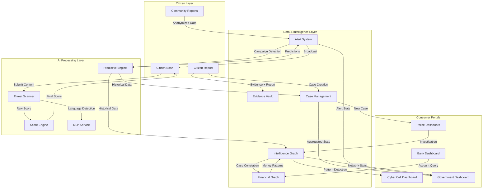

### Communication Patterns

#### Pattern 1: Citizen Scan → Threat Result

```pascal
PROCEDURE scanCommunicationFlow(content, contentType, citizenId)
  INPUT: content (raw text/url/audio), contentType (TEXT/URL/VOICE), citizenId
  OUTPUT: threatResult (ThreatResult with score, explanation, category)
  
  SEQUENCE
    // 1. Language Detection (async, parallel with scan)
    languageDetection ← NLP.detectLanguage(content)  // ASYNC
    
    // 2. Threat Analysis
    IF contentType EQUALS TEXT THEN
      rawSignals ← ThreatScanner.analyzeText(content)
    ELSE IF contentType EQUALS URL THEN
      rawSignals ← ThreatScanner.analyzeURL(content)
    ELSE IF contentType EQUALS VOICE THEN
      rawSignals ← ThreatScanner.analyzeVoice(content)
    END IF
    
    // 3. Score Computation (deterministic)
    threatScore ← ScoreEngine.compute(rawSignals)
    
    // 4. Explanation Generation (AI-assisted)
    language ← AWAIT languageDetection
    explanation ← NLP.generateExplanation(rawSignals, threatScore, language)
    
    // 5. Community Intelligence Check
    communityMatch ← CommunityShield.checkPatterns(content)
    IF communityMatch.found THEN
      threatScore ← ScoreEngine.adjustWithCommunity(threatScore, communityMatch)
    END IF
    
    // 6. Result Assembly
    threatResult ← ThreatResult(
      score: threatScore,
      category: classifyThreat(rawSignals),
      explanation: explanation,
      indicators: rawSignals.indicators,
      communitySignal: communityMatch
    )
    
    // 7. Store in History
    ScanHistory.store(citizenId, threatResult, timestamp: NOW())
    
    RETURN threatResult
  END SEQUENCE
END PROCEDURE
```

#### Pattern 2: Report Submission → Police Queue

```pascal
PROCEDURE reportToPoliceFlow(report, evidence, citizenId)
  INPUT: report (FraudReport), evidence (list of files), citizenId
  OUTPUT: caseReference (string)
  
  SEQUENCE
    // 1. Evidence Storage (parallel)
    storedEvidence ← EMPTY_LIST
    FOR EACH file IN evidence DO  // Parallel execution
      encrypted ← EvidenceVault.encrypt(file)
      hash ← EvidenceVault.computeHash(file)
      ref ← EvidenceVault.store(encrypted, hash, owner: citizenId)
      storedEvidence.ADD(ref)
    END FOR
    
    // 2. Case Creation
    caseRef ← CaseManagement.create(
      reporter: citizenId,
      type: report.incidentType,
      evidence: storedEvidence,
      jurisdiction: resolveJurisdiction(report)
    )
    
    // 3. AI Pre-Processing
    aiSummary ← AIEngine.preSummarize(report, evidence)
    CaseManagement.attachSummary(caseRef, aiSummary)
    
    // 4. Queue Assignment
    jurisdiction ← resolveJurisdiction(report)
    CaseManagement.addToQueue(caseRef, jurisdiction)
    
    // 5. Notification
    AlertSystem.notifyOfficers(jurisdiction, newCase: caseRef)
    
    // 6. Intelligence Graph Update
    entities ← extractEntities(report)
    FOR EACH entity IN entities DO
      IntelligenceGraph.registerEntity(entity, linkedCase: caseRef)
    END FOR
    
    RETURN caseRef
  END SEQUENCE
END PROCEDURE
```

#### Pattern 3: Community Intelligence → Alert Broadcast

```pascal
PROCEDURE communityToAlertFlow()
  // Continuous monitoring process
  
  SEQUENCE
    // 1. Aggregate Community Reports (every 15 minutes)
    recentReports ← CommunityShield.getRecentContributions(window: 24_HOURS)
    
    // 2. Campaign Detection
    clusters ← detectSimilarReports(recentReports, threshold: 3)
    
    FOR EACH cluster IN clusters DO
      IF cluster.count >= 3 AND cluster.sameRegion THEN
        // 3. Generate Alert
        alert ← AlertSystem.generate(
          type: FRAUD_CAMPAIGN,
          severity: computeSeverity(cluster),
          region: cluster.region,
          description: summarizeCampaign(cluster),
          examples: anonymizeExamples(cluster.reports),
          recommendations: generateProtectiveSteps(cluster.type)
        )
        
        // 4. Broadcast
        targetCitizens ← CitizenRegistry.getByRegion(cluster.region)
        AlertSystem.broadcast(alert, targetCitizens)
        
        // 5. Feed to Predictive Engine
        PredictiveEngine.ingestCampaignData(cluster)
      END IF
    END FOR
  END SEQUENCE
END PROCEDURE
```

#### Pattern 4: Cross-System Data Aggregation → Government Dashboard

```pascal
PROCEDURE aggregateForGovernment(region, timeframe)
  INPUT: region (state/district/national), timeframe (date range)
  OUTPUT: aggregatedData (GovernmentDashboardData)
  
  SEQUENCE
    // All data is READ-ONLY aggregation — no individual case details
    
    data ← GovernmentDashboardData()
    
    // From Case Management (anonymized counts)
    data.caseStats ← CaseManagement.getAggregateStats(region, timeframe)
    
    // From Alert System (campaign data)
    data.activeCampaigns ← AlertSystem.getActiveCampaigns(region)
    data.alertHistory ← AlertSystem.getAlertMetrics(region, timeframe)
    
    // From Intelligence Graph (network stats, no PII)
    data.networkStats ← IntelligenceGraph.getRegionStats(region)
    
    // From Financial Graph (aggregate financial loss)
    data.financialLoss ← FinancialGraph.getAggregateLoss(region, timeframe)
    
    // From Predictive Engine
    data.predictions ← PredictiveEngine.getRegionPredictions(region)
    
    // From Education Module (awareness metrics)
    data.awarenessMetrics ← EducationModule.getRegionProgress(region)
    
    RETURN data
  END SEQUENCE
END PROCEDURE
```

### Inter-Module Communication Contracts

| Source Module | Target Module | Data Exchanged | Protocol | Latency SLA |
|--------------|---------------|----------------|----------|-------------|
| Threat Scanner → Score Engine | Raw signals, indicators | Internal API (sync) | < 500ms |
| Score Engine → Citizen Portal | Threat score, explanation | REST API | < 2s total |
| Citizen Report → Evidence Vault | Encrypted files, hashes | Internal API (async) | < 5s |
| Case Management → Police Queue | Case reference, metadata | Event bus (async) | < 60s |
| Intelligence Graph → Cyber Cell | Entity networks, clusters | GraphQL | < 3s |
| Alert System → Citizen Portal | Alert content, severity | WebSocket (push) | < 5min from detection |
| Financial Graph → Bank Portal | Account risk, transactions | REST API | < 500ms |
| All Modules → Government | Aggregated statistics | Batch API (scheduled) | 15min refresh |
| Predictive Engine → Alert System | Campaign predictions | Event bus (async) | Real-time on detection |
| Community Shield → Score Engine | Community signals | Internal API (sync) | < 200ms |

---

## SECTION 8: Scalability Planning

### Future Module Integration Points

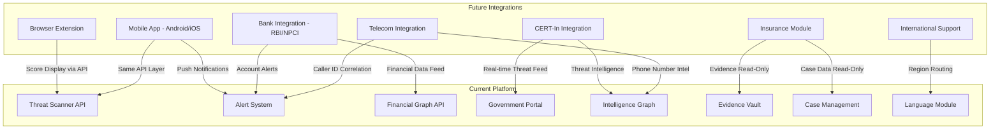

### Integration Architecture

| Future Module | Integrates Via | Existing Touchpoint | Navigation Impact |
|--------------|---------------|--------------------|--------------------|
| Browser Extension | Threat Scanner REST API | Score display inline in browser | None — external client |
| Mobile App (Android/iOS) | Same API layer as web | Push notifications via Alert System | None — parallel client |
| Bank Integration (RBI, NPCI) | Bank Portal + Financial Graph API | Webhook endpoints for real-time feeds | New tab in Bank Portal |
| CERT-In Integration | Government Portal + real-time feed ingestion | Threat intelligence data pipeline | New widget on Govt Dashboard |
| International Support | Language module expansion + region-based routing | Additional languages beyond 15 | Language selector expansion |
| Telecom Integration | Alert System + Intelligence Graph | Caller ID correlation, phone number intel | New Intelligence Search filter |
| Insurance Module | Evidence Vault + Case Management (read-only) | API access to case resolution data | New portal (Insurance Portal) |

### Scalability Principles

```pascal
STRUCTURE ScalabilityRule
  principle: string
  implementation: string
  measurable: string
END STRUCTURE

CONSTANT SCALABILITY_RULES ← [
  ScalabilityRule(
    principle: "Portal Independence",
    implementation: "Each portal is independently deployable with its own routing",
    measurable: "New portal added without modifying existing portals"
  ),
  ScalabilityRule(
    principle: "API-First Communication",
    implementation: "All cross-module communication via versioned APIs",
    measurable: "New consumers added without modifying provider modules"
  ),
  ScalabilityRule(
    principle: "Navigation Stability",
    implementation: "New modules plug into existing portal structures without nav redesign",
    measurable: "Max 1 new primary nav item per portal per year"
  ),
  ScalabilityRule(
    principle: "Horizontal Screen Addition",
    implementation: "New screens follow existing patterns (Section > Subsection > Detail)",
    measurable: "New screen deployed within existing nav hierarchy"
  ),
  ScalabilityRule(
    principle: "Language Extensibility",
    implementation: "Language module supports plugin-based language pack addition",
    measurable: "New language added without code changes, only content"
  ),
  ScalabilityRule(
    principle: "Role Extensibility",
    implementation: "Permission matrix supports custom role creation via admin panel",
    measurable: "New role created and assigned without deployment"
  )
]
```

### 5-Year Capacity Projections

| Metric | Year 1 | Year 2 | Year 3 | Year 5 |
|--------|--------|--------|--------|--------|
| Screen Count | 69 | 85 | 100 | 130 |
| Portals | 8 | 9 (Insurance) | 10 (Telecom) | 12 |
| Supported Languages | 15 | 22 | 30 | 40+ |
| Concurrent Users | 100K | 500K | 1M | 5M |
| Cases/Month | 10K | 50K | 200K | 1M |
| Graph Entities | 100K | 500K | 2M | 10M |
| API Consumers | 10 | 50 | 200 | 1000 |

---

## SECTION 9: Consistency Rules

### Naming Conventions

| Context | Convention | Examples |
|---------|-----------|----------|
| Action Items | Verb-Noun | "Scan Message", "Report Fraud", "Flag Account", "Export Report" |
| Section Names | Noun | "Dashboard", "Cases", "Intelligence", "Analytics" |
| Status Labels (Cases) | Adjective/Past Participle | Open, Investigating, Escalated, Closed |
| Status Labels (Threats) | Adjective | Safe, Caution, Danger |
| Buttons (Primary) | Verb or Verb-Noun | "Submit", "Scan Now", "Generate Report" |
| Buttons (Secondary) | Verb-Noun | "Save Draft", "View Details", "Download PDF" |
| Navigation Items | Max 2 words | "Threat Scanner", "Case Queue", "Risk Report" |

### Screen Hierarchy Pattern

**Rule**: Portal → Section → Detail → Action (max 4 levels)

```pascal
STRUCTURE ScreenHierarchy
  portal: PortalName          // Level 1: Always present
  section: SectionName        // Level 2: Primary nav destination
  detail: DetailView          // Level 3: Specific item or subsection
  action: ActionView          // Level 4: Action on specific item (max depth)
END STRUCTURE

// Validation
PROCEDURE validateHierarchyDepth(screen)
  INPUT: screen (ScreenHierarchy)
  OUTPUT: valid (boolean)
  
  SEQUENCE
    depth ← 1  // Portal always counts
    IF screen.section IS NOT NULL THEN depth ← depth + 1 END IF
    IF screen.detail IS NOT NULL THEN depth ← depth + 1 END IF
    IF screen.action IS NOT NULL THEN depth ← depth + 1 END IF
    
    RETURN depth <= 4
  END SEQUENCE
END PROCEDURE
```

### Dashboard Layout Pattern

**All dashboards follow this structure** (regardless of portal):

```
┌─────────────────────────────────────────────────────────────────┐
│  Summary Cards (3-5 KPI cards with key metrics)                 │
├─────────────────────────────────────────────────────────────────┤
│  Recent Activity (chronological list of latest events)          │
├───────────────────────────────────┬─────────────────────────────┤
│  Quick Actions Panel              │  Alerts/Notifications       │
│  (context-appropriate actions)    │  (time-sensitive items)     │
├───────────────────────────────────┴─────────────────────────────┤
│  Detailed Lists / Tables (sortable, filterable, paginated)      │
└─────────────────────────────────────────────────────────────────┘
```

### Terminology Registry

| Concept | Correct Term | Never Use |
|---------|-------------|-----------|
| Risk assessment score | Threat_Score | "risk score", "danger level", "safety rating" |
| Personal safety metric | Safety_Score | "user score", "hygiene score", "protection level" |
| Fraud attempt cluster | Fraud_Campaign | "attack", "scam wave", "fraud burst" |
| Shared threat intelligence | Community_Shield | "crowd intel", "shared data", "user reports" |
| Relationship visualization | Intelligence_Graph | "network map", "connection diagram", "link chart" |
| Evidence storage | Evidence_Vault | "file storage", "document store", "evidence locker" |
| Automatic fraud detection | Money_Mule | "mule account", "fraud account", "suspicious account" |
| Police complaint | FIR | "complaint", "report" (use "report" only for citizen submission) |

### Formatting Standards

| Element | Standard | Example |
|---------|----------|---------|
| Date Format | DD MMM YYYY | 12 Jun 2024 |
| Time Format | HH:MM (24hr) with timezone | 14:30 IST |
| Currency | ₹X,XX,XXX (Indian format) | ₹1,25,000 |
| Phone Numbers | +91-XXXXX-XXXXX | +91-98765-43210 |
| Case References | XX-YYYY-NNNNN | FR-2024-00123 |
| Threat Scores | Integer 0-100 with label | 78 (Danger) |
| Pagination | 20 items default, user-configurable | "Showing 1-20 of 456" |
| Empty States | Message + CTA | "No scans yet. Scan your first message →" |

### Empty State Rules

```pascal
PROCEDURE renderEmptyState(context)
  INPUT: context (screen context with section and user role)
  OUTPUT: emptyStateContent (message, CTA, illustration)
  
  SEQUENCE
    // Every list/table must have a meaningful empty state
    message ← getEmptyMessage(context)     // Clear explanation of what belongs here
    cta ← getPrimaryCTA(context)           // Action to populate this section
    illustration ← getIllustration(context) // Friendly visual (not error-like)
    
    RETURN EmptyState(
      message: message,
      cta: cta,
      illustration: illustration,
      showOnboarding: context.user.isNew
    )
  END SEQUENCE
END PROCEDURE

// Examples:
// Scan History empty: "No scans yet. Paste a suspicious message to check if it's safe." → CTA: "Scan Now"
// Case Queue empty: "No new cases. All reports have been assigned." → CTA: "View Active Cases"
// Evidence Vault empty: "Your evidence vault is empty. Evidence is stored here when you file reports." → CTA: "Report Fraud"
```

### Responsive Breakpoints

| Breakpoint | Width | Navigation Pattern | Content Layout |
|-----------|-------|-------------------|---------------|
| Mobile | < 768px | Bottom tab bar (5 items max) | Single column, stacked cards |
| Tablet | 768px - 1024px | Collapsible sidebar | Two-column where appropriate |
| Desktop | 1024px - 1440px | Full sidebar + secondary nav | Multi-column, full tables |
| Large Desktop | > 1440px | Full sidebar + content max-width | Max-width container, centered |

---

## SECTION 10: Architecture Validation

### Identified Potential Weaknesses

| # | Weakness | Severity | Impact Area | Root Cause |
|---|----------|----------|-------------|-----------|
| 1 | Large screen count (69+) risks inconsistent UX | High | All portals | No shared design system enforcement |
| 2 | Multiple portals could drift in patterns | High | Cross-portal | Independent development teams |
| 3 | Real-time features (alerts, graph updates) need special architecture | Medium | Alert System, Graph | HTTP polling won't scale |
| 4 | Multi-language support (15 languages) adds complexity everywhere | Medium | All content modules | Translation pipeline overhead |
| 5 | Evidence Vault encryption adds latency | Medium | Case Management, Reports | Encryption/decryption per access |
| 6 | Intelligence Graph with 10K+ nodes challenges browser rendering | Medium | Cyber Cell, Police | Client-side rendering limits |
| 7 | Cross-jurisdiction data access risks privacy violations | High | Police, Cyber Cell | Jurisdiction boundaries are complex |
| 8 | 8 portals means 8 navigation systems to maintain | Medium | All | Navigation code duplication |
| 9 | Predictive Engine accuracy affects trust | Medium | Cyber Cell, Alerts | ML model drift over time |
| 10 | Government Portal aggregation at scale creates compute load | Low | Government | Large dataset aggregation |

### Mitigation Strategies

```pascal
STRUCTURE Mitigation
  weakness: integer
  strategy: string
  implementation: string
  validation: string
END STRUCTURE

CONSTANT MITIGATIONS ← [
  Mitigation(
    weakness: 1,
    strategy: "Design System as Single Source of Truth",
    implementation: "Shared component library with enforced usage via linting rules. All screens composed from design system primitives. Pattern documentation with live examples.",
    validation: "Visual regression tests catch drift. Component audit monthly."
  ),
  
  Mitigation(
    weakness: 2,
    strategy: "Portal Template Architecture",
    implementation: "Base portal template defining layout, navigation shell, and data fetching patterns. New portals extend template. Shared navigation component with role-based configuration.",
    validation: "Cross-portal UI audit quarterly. Template compliance check in CI."
  ),
  
  Mitigation(
    weakness: 3,
    strategy: "WebSocket Architecture for Real-Time",
    implementation: "WebSocket connection per authenticated session. Event-driven updates for: alerts (push to citizen), graph changes (push to investigators), case status (push to reporters). Fallback to SSE for restricted networks.",
    validation: "Real-time delivery SLA: alerts within 5 min, graph updates within 3s."
  ),
  
  Mitigation(
    weakness: 4,
    strategy: "Translation Pipeline with Fallback",
    implementation: "i18n framework with key-based translations. Professional translation for core UI (15 languages). AI-assisted translation for dynamic content with human review. Fallback to English if translation missing. Language packs loaded on-demand.",
    validation: "Translation coverage report per release. Missing key alerts."
  ),
  
  Mitigation(
    weakness: 5,
    strategy: "Metadata Caching Strategy",
    implementation: "Cache evidence metadata (name, size, type, status) unencrypted. Decrypt only on explicit view request. Pre-fetch decryption keys on case load. Thumbnail generation for images (encrypted separately with faster algorithm).",
    validation: "Evidence panel loads metadata in <500ms. Full decrypt in <2s."
  ),
  
  Mitigation(
    weakness: 6,
    strategy: "Progressive Graph Rendering",
    implementation: "Server-side graph computation. Client receives pre-computed layouts. Level-of-detail rendering: overview (clusters as nodes) → detail (expand cluster). Virtual rendering for large graphs. WebGL for 10K+ nodes.",
    validation: "Pan/zoom operations complete in <200ms at 10K nodes."
  ),
  
  Mitigation(
    weakness: 7,
    strategy: "Jurisdiction-Based Data Partitioning",
    implementation: "Database-level row security policies. API middleware validates jurisdiction on every query. Cross-jurisdiction access requires explicit elevation (Senior Investigator + audit log). Cyber Cell has cross-jurisdiction by default with full audit.",
    validation: "Penetration test: verify no cross-jurisdiction data leakage."
  ),
  
  Mitigation(
    weakness: 8,
    strategy: "Unified Navigation Framework",
    implementation: "Single navigation component configured by JSON per role. Navigation structure defined in configuration, not code. Portal-specific nav loaded from central registry. Changes propagate to all portals automatically.",
    validation: "Navigation config change deploys to all portals in single release."
  ),
  
  Mitigation(
    weakness: 9,
    strategy: "Model Monitoring and Human-in-the-Loop",
    implementation: "Continuous accuracy tracking. Alert when accuracy drops below 75%. Human review queue for disputed predictions. Monthly model retraining cycle. A/B testing for model versions. All predictions advisory, never autonomous action.",
    validation: "Accuracy metrics dashboard. Monthly model health report."
  ),
  
  Mitigation(
    weakness: 10,
    strategy: "Pre-Computed Aggregations",
    implementation: "Batch aggregation pipeline runs every 15 minutes. Government dashboard reads from pre-computed views. On-demand queries for custom filters with timeout. Cache invalidation on new case data. Materialized views for common queries.",
    validation: "Dashboard loads in <500ms. Custom queries timeout at 10s with partial results."
  )
]
```

### Why This Architecture Scales for 5 Years

**1. Portal Independence**: Each portal is a self-contained application with its own routing, state, and deployment lifecycle. Adding a 9th portal (Insurance) or 10th portal (Telecom) does not affect existing portals.

**2. API-First Foundation**: All inter-module communication uses versioned APIs. When the Financial Graph adds new features, existing consumers (Bank Portal) continue working on v1 while new consumers use v2.

**3. Configuration-Driven Navigation**: Navigation is not hardcoded. It's role-based configuration loaded at runtime. New screens, new nav items, even new portals can be added via configuration without code deployment.

**4. Modular AI Engine**: The AI Intelligence Engine is a backend service layer with well-defined interfaces. Models can be swapped, improved, or parallelized without touching portal code.

**5. Language Extensibility**: The multi-language system uses key-based i18n with on-demand language pack loading. Adding language #16 through #40 requires content translation, not code changes.

**6. Permission Matrix Extensibility**: New roles are created via the Admin Panel without deployment. The permission resolution algorithm supports any combination of role + action + resource.

**7. Screen Pattern Reuse**: All dashboards, all lists, all detail views follow documented patterns. The design system ensures that screen #70 or #130 feels native to the platform without additional architecture work.

**8. Event-Driven Integration**: New external systems (CERT-In, banks, telecoms) connect via event bus or webhook endpoints. They don't require changes to internal module communication patterns.

---

## Correctness Properties

The following properties must hold true across the entire Information Architecture:

### Property 1: Navigation Depth Limit

**∀ screen S**: `hierarchyDepth(S) ≤ 4` — No screen exists deeper than 4 navigation levels from portal root

### Property 2: Access Control Completeness

**∀ user U, resource R**: `canAccess(U, R) ⟹ rolePermits(U.role, R.requiredPermission) ∧ jurisdictionMatches(U, R)` — Access requires both role permission and jurisdiction match

### Property 3: Read-Only Consumer Isolation

**∀ module M₁ consuming module M₂**: `M₁.accessType = READ_ONLY ⟹ M₂.dataUnmodified` — Read-only consumers never modify provider data

### Property 4: Cognitive Load Constraint

**∀ portal P**: `P.primaryNavItems ≤ 7` — No portal has more than 7 primary navigation items (cognitive load limit)

### Property 5: Regional Alert Delivery

**∀ alert A, citizen C**: `delivered(A, C) ⟹ region(A) ∩ region(C) ≠ ∅` — Alerts only delivered to citizens in affected region

### Property 6: Evidence Integrity Preservation

**∀ evidence E**: `hash(E, upload) = hash(E, access)` — Evidence integrity preserved (hash matches at upload and every access)

### Property 7: Jurisdictional Case Assignment

**∀ case K, officer O**: `assigned(K, O) ⟹ jurisdiction(K) = jurisdiction(O)` — Officers only assigned cases within their jurisdiction

### Property 8: Government PII Exclusion

**∀ government query Q**: `result(Q).containsPII = FALSE` — Government portal never receives personally identifiable information

### Property 9: Cross-Portal Terminology Consistency

**∀ terminology T used in portal P₁ and P₂**: `label(T, P₁) = label(T, P₂)` — Same concept uses identical terminology across all portals

### Property 10: Empty State Completeness

**∀ empty state ES on screen S**: `ES.hasCTA = TRUE ∧ ES.hasMessage = TRUE` — Every empty state provides both explanation and next action

---

## Data Models

### Core Domain Types

```pascal
STRUCTURE Portal
  id: UUID
  name: string
  slug: string (kebab-case)
  requiredRole: Role
  primaryNavItems: list of NavItem (max 7)
  screens: list of Screen
END STRUCTURE

STRUCTURE Screen
  id: UUID
  portal: Portal
  section: string
  subsection: string (nullable)
  item: string (nullable)
  purpose: string
  authRequired: boolean
  requiredRole: Role
  dependencies: list of Module
  futureExpansion: string
END STRUCTURE

STRUCTURE NavItem
  id: UUID
  label: string (max 2 words)
  icon: IconName
  route: string
  children: list of NavItem (max depth 1)
  badge: BadgeConfig (nullable)
  quickAction: boolean
END STRUCTURE

STRUCTURE Role
  id: UUID
  name: string
  level: integer (1-10, higher = more access)
  portalAccess: list of Portal
  permissions: list of Permission
  jurisdictionRestricted: boolean
END STRUCTURE

STRUCTURE Permission
  action: ActionType enum
  resource: ResourceType enum
  scope: ScopeType enum (OWN, JURISDICTION, ALL)
END STRUCTURE

STRUCTURE Module
  id: UUID
  name: string
  owns: list of Capability
  neverOwns: list of Capability
  consumers: list of ConsumptionRule
  apiVersion: string
END STRUCTURE

STRUCTURE UserFlow
  id: UUID
  name: string
  actor: Role
  startScreen: Screen
  endScreen: Screen
  steps: list of FlowStep
  happyPathLength: integer
  errorPaths: list of ErrorPath
END STRUCTURE

STRUCTURE FlowStep
  order: integer
  screen: Screen
  action: string
  systemResponse: string
  nextStep: FlowStep (nullable)
  alternativePaths: list of FlowStep
END STRUCTURE
```

---

## Error Handling

### Navigation Error Scenarios

| Scenario | Condition | Response | Recovery |
|----------|-----------|----------|----------|
| Unauthorized Portal Access | User navigates to portal without role | Redirect to appropriate portal + toast | Auto-redirect to home portal |
| Deep Link to Deleted Screen | URL points to removed/moved screen | 404 with helpful redirect suggestions | Breadcrumb to parent section |
| Session Expiry Mid-Flow | Auth token expires during multi-step flow | Auto-save progress + re-auth prompt | Resume from saved state after login |
| Cross-Jurisdiction Attempt | Officer accesses case outside jurisdiction | Access denied with explanation | Suggest escalation to supervisor |
| Feature Flag Disabled | User navigates to disabled feature | Graceful "Coming Soon" with alternative | Link to related active features |
| Language Pack Missing | Selected language unavailable for content | Fallback to English with indicator | Language toggle always accessible |
| Graph Overload | Intelligence Graph exceeds rendering capacity | Progressive loading with reduced detail | Zoom-to-filter, reduce visible nodes |
| Evidence Integrity Failure | Hash mismatch on evidence access | Block access, flag evidence, notify admin | Admin review + re-upload if needed |

### Error Recovery Algorithm

```pascal
PROCEDURE handleNavigationError(error, user, context)
  INPUT: error (NavigationError), user (User), context (current screen/state)
  OUTPUT: recovery (RecoveryAction)
  
  SEQUENCE
    // Log error for monitoring
    AuditLog.record(error, user, context)
    
    IF error.type EQUALS UNAUTHORIZED THEN
      homePortal ← resolveHomePortal(user.role)
      RETURN Redirect(homePortal, message: "You don't have access to that section")
      
    ELSE IF error.type EQUALS NOT_FOUND THEN
      parentSection ← resolveParent(context.requestedURL)
      suggestions ← findSimilarScreens(context.requestedURL)
      RETURN NotFoundPage(parentLink: parentSection, suggestions: suggestions)
      
    ELSE IF error.type EQUALS SESSION_EXPIRED THEN
      savedState ← autoSave(context.currentForm, context.currentStep)
      RETURN ReAuthPrompt(returnTo: context.requestedURL, savedState: savedState)
      
    ELSE IF error.type EQUALS FEATURE_DISABLED THEN
      alternatives ← findAlternativeFeatures(context.requestedFeature)
      RETURN ComingSoonPage(feature: context.requestedFeature, alternatives: alternatives)
      
    ELSE
      RETURN GenericErrorPage(message: "Something went wrong", retry: TRUE)
    END IF
  END SEQUENCE
END PROCEDURE
```

---

## Testing Strategy

### Information Architecture Validation Tests

**1. Hierarchy Depth Tests**: Verify no screen exceeds 4 levels of navigation depth.

**2. Navigation Completeness Tests**: Verify every screen in the inventory is reachable via at least one navigation path.

**3. Permission Matrix Tests**: For each role × action × resource combination, verify the expected access decision.

**4. Breadcrumb Consistency Tests**: Verify breadcrumb trail matches actual navigation path for every screen.

**5. Cross-Portal Terminology Tests**: Verify identical concepts use the same label across all portals.

**6. Empty State Coverage Tests**: Verify every list/table view has a defined empty state with CTA.

**7. User Flow Completeness Tests**: Verify every flow reaches a terminal state (success or explicit error recovery).

**8. Ownership Boundary Tests**: Verify no module writes to data owned by another module (consumption rules respected).

### Property-Based Testing Approach

**Property Test Library**: fast-check (TypeScript) or Hypothesis (Python)

**Key Properties to Test**:
- Any randomly generated navigation path resolves to a valid screen or a proper error
- Any role assigned to a user results in consistent permission decisions (no contradictions)
- Any combination of active feature flags produces a navigable portal (no dead ends)
- Any search query scoped by role returns only data the role can access

---

## Performance Considerations

| Metric | Target | Rationale |
|--------|--------|-----------|
| Portal Navigation (click → render) | < 200ms | Instant feel for page transitions |
| Global Search (query → results) | < 500ms | Responsive search experience |
| Dashboard Load (auth → visible) | < 500ms | Immediate overview on login |
| Alert Delivery (detection → notification) | < 5 min | Time-critical safety information |
| Graph Render (load → interactive) | < 3s at 10K nodes | Complex visualization acceptable |
| Evidence Access (request → decrypted view) | < 2s | Encryption overhead managed |
| Report Generation (request → download) | < 10s | Batch computation acceptable |
| Language Switch (select → re-rendered) | < 1s | Near-instant locale change |

---

## Security Considerations

- **Portal Isolation**: Each portal runs as an independent application — compromise of one does not cascade
- **Jurisdiction Enforcement**: Database-level row security prevents cross-jurisdiction leakage regardless of application bugs
- **Evidence Vault Zero-Knowledge**: Platform operators cannot access evidence — only authorized user keys can decrypt
- **Audit Everything**: Every permission check, every data access, every navigation event is logged
- **Role Escalation Controls**: No self-assignment of higher roles — requires admin + audit trail
- **Session Management**: Per-portal session tokens — switching portals (for super admin) requires re-verification
- **API Rate Limiting**: Per-role rate limits prevent data scraping through search or API endpoints
- **Feature Flag Security**: Disabled features are not just hidden — routes return 403, data endpoints are blocked

---

## Dependencies

| Dependency | Purpose | Used By |
|-----------|---------|---------|
| Navigation Framework | Role-based nav configuration and rendering | All Portals |
| i18n System | Multi-language content delivery (15 languages) | All Portals |
| WebSocket Infrastructure | Real-time alerts and graph updates | Alert System, Intelligence Graph |
| Graph Rendering Engine | Network visualization (10K+ nodes) | Intelligence Graph, Financial Graph |
| Search Infrastructure | Global search across all content types | All Portals |
| Design System | Shared components, patterns, tokens | All Portals |
| RBAC Engine | Permission resolution and enforcement | Auth System, All Portals |
| Event Bus | Async inter-module communication | All Backend Services |
| Encryption Service | Evidence Vault, data-at-rest | Evidence Vault, Auth System |
| Analytics Pipeline | Aggregation for Government + Admin dashboards | Government Portal, Admin Panel |
| CMS | Education content, alert content, blog | Education Module, Alert System, Public Landing |
| Geolocation Service | Region-based routing, jurisdiction resolution | Alert System, Case Management |
