# Design Document: CyberShield System Architecture & Internal Event Flow

## Overview

CyberShield AI's System Architecture defines the internal mechanics of how 15+ microservices communicate, process events, and recover from failures across a distributed platform serving citizens, police, cyber cells, banks, and government bodies. This document specifies the event-driven backbone, processing pipelines, real-time communication channels, and scalability strategies that enable the platform to deliver sub-2-second threat analysis, real-time case management, and nationwide alert broadcasting.

The architecture follows a strict bounded-context separation where each service owns its data and communicates exclusively through domain events for cross-context operations. Synchronous communication is reserved for pipeline-critical paths (threat scanning) while all other interactions flow through an asynchronous message queue. This design enables independent scaling, fault isolation, and zero-downtime deployments across all 15 bounded contexts defined in the domain model.

The system is designed to scale from 100 users during development to 1,000,000+ users at national scale, with clearly defined architectural transitions at each tier. Performance targets are aggressive: p95 threat scan under 2 seconds, dashboard loads under 500ms, and notification delivery within 5 minutes.

## Architecture

### High-Level System Topology

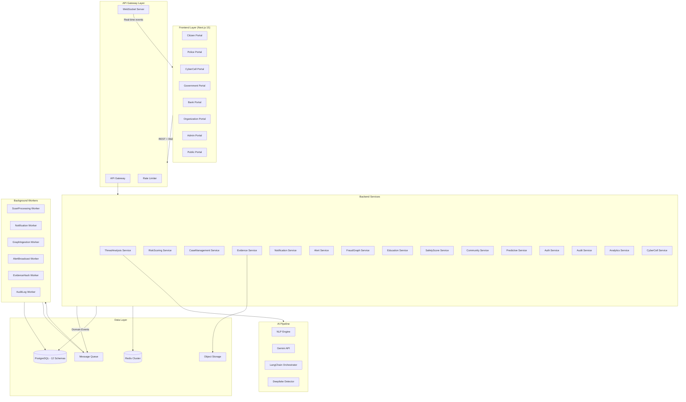

### Communication Patterns

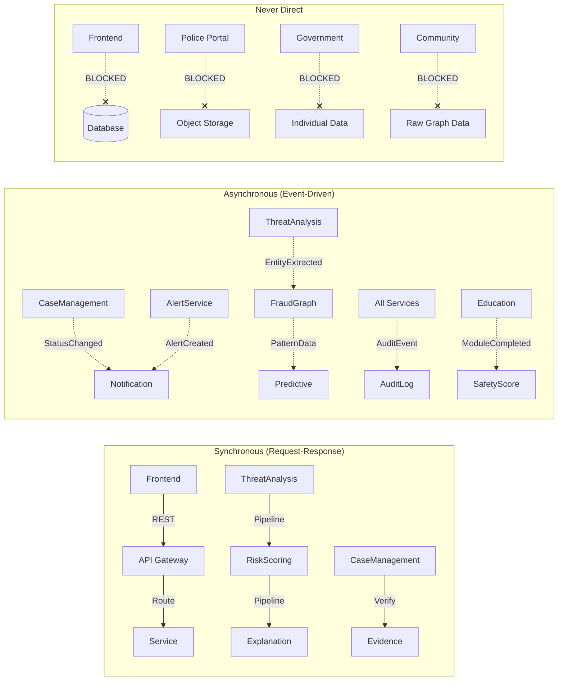

## Components and Interfaces

### Component 1: API Gateway

**Purpose**: Single entry point for all frontend requests. Handles authentication verification, rate limiting, request routing, and response formatting.

```pascal
INTERFACE APIGateway
  PROCEDURE authenticateRequest(request: HTTPRequest): AuthContext
  PROCEDURE routeRequest(request: HTTPRequest, context: AuthContext): HTTPResponse
  PROCEDURE applyRateLimit(context: AuthContext, endpoint: String): Boolean
  PROCEDURE validateRequestSchema(request: HTTPRequest, schema: SchemaDefinition): ValidationResult
END INTERFACE
```

**Responsibilities**:
- JWT token verification and context extraction
- Per-user and per-endpoint rate limiting
- Request schema validation before forwarding
- Response envelope standardization
- CORS and security header management

### Component 2: ThreatAnalysis Service

**Purpose**: Orchestrates the complete threat scanning pipeline for text, URL, and voice inputs. Coordinates NLP, AI scoring, and result persistence.

```pascal
INTERFACE ThreatAnalysisService
  PROCEDURE submitScan(input: ScanInput, userId: UUID): ScanId
  PROCEDURE processTextScan(scanId: ScanId, content: String): ScanResult
  PROCEDURE processURLScan(scanId: ScanId, url: URL): ScanResult
  PROCEDURE processVoiceScan(scanId: ScanId, audio: AudioBlob): ScanResult
  PROCEDURE getScanHistory(userId: UUID, filters: ScanFilters): PaginatedList OF ScanResult
  PROCEDURE getScanDetail(scanId: ScanId, userId: UUID): ScanDetail
END INTERFACE
```

**Responsibilities**:
- Input validation and normalization
- Pipeline orchestration (NLP → Scoring → Explanation)
- Result persistence and caching
- Event emission for downstream consumers (FraudGraph, SafetyScore)
- SLA enforcement (timeout at 2s for text/URL, 5s for voice)

### Component 3: RiskScoring Service

**Purpose**: Computes deterministic threat scores based on extracted features. Applies weighted factor aggregation with explainable scoring breakdown.

```pascal
INTERFACE RiskScoringService
  PROCEDURE computeScore(features: FeatureSet, scanType: ScanType): ScoreResult
  PROCEDURE getScoreBreakdown(scoreId: UUID): ScoreBreakdown
  PROCEDURE updateScoringWeights(weights: WeightConfiguration, adminId: UUID): Boolean
END INTERFACE
```

**Responsibilities**:
- Deterministic score computation (same input → same score)
- Factor weight application per scan type
- Score explanation generation coordination
- Scoring model versioning and A/B testing support

### Component 4: CaseManagement Service

**Purpose**: Manages the lifecycle of fraud cases from report submission through investigation to resolution. Enforces status transitions and jurisdiction rules.

```pascal
INTERFACE CaseManagementService
  PROCEDURE createCase(report: FraudReport, citizenId: UUID): CaseId
  PROCEDURE assignOfficer(caseId: CaseId, officerId: UUID): AssignmentResult
  PROCEDURE transitionStatus(caseId: CaseId, newStatus: CaseStatus, officerId: UUID): TransitionResult
  PROCEDURE escalateCase(caseId: CaseId, reason: String, requesterId: UUID): EscalationResult
  PROCEDURE getCaseTimeline(caseId: CaseId, requesterId: UUID): Timeline
  PROCEDURE searchCases(query: CaseQuery, requesterId: UUID): PaginatedList OF CaseSummary
END INTERFACE
```

**Responsibilities**:
- Case lifecycle management with valid state transitions
- Workload-balanced officer assignment
- Jurisdiction validation and escalation routing
- Timeline event recording
- Access control enforcement (only assigned officer + citizen)

### Component 5: Evidence Service

**Purpose**: Manages secure storage, retrieval, and chain-of-custody tracking for all digital evidence attached to cases.

```pascal
INTERFACE EvidenceService
  PROCEDURE uploadEvidence(file: FileBlob, caseId: CaseId, uploaderId: UUID): EvidenceId
  PROCEDURE retrieveEvidence(evidenceId: EvidenceId, requesterId: UUID): EvidenceFile
  PROCEDURE verifyIntegrity(evidenceId: EvidenceId): IntegrityResult
  PROCEDURE getCustodyChain(evidenceId: EvidenceId): List OF CustodyEntry
  PROCEDURE deleteEvidence(evidenceId: EvidenceId, adminId: UUID, reason: String): Boolean
END INTERFACE
```

**Responsibilities**:
- SHA-256 hash computation on upload
- AES-256 encryption before storage
- Chain-of-custody logging (every access recorded)
- Hash verification on every retrieval
- Garbage collection of partial uploads after 24h

### Component 6: FraudGraph Service

**Purpose**: Maintains the fraud intelligence graph connecting entities (phone numbers, UPI IDs, accounts, URLs) with weighted connections derived from reports and scans.

```pascal
INTERFACE FraudGraphService
  PROCEDURE registerEntity(entity: GraphEntity, sourceId: UUID): EntityId
  PROCEDURE addConnection(from: EntityId, to: EntityId, strength: Float, evidence: UUID): ConnectionId
  PROCEDURE queryConnections(entityId: EntityId, depth: Integer, minStrength: Float): SubGraph
  PROCEDURE detectClusters(): List OF FraudCluster
  PROCEDURE getEntityRiskScore(entityId: EntityId): RiskAssessment
  PROCEDURE applyStrengthDecay(decayFactor: Float): DecayReport
END INTERFACE
```

**Responsibilities**:
- Entity deduplication and merging
- Connection strength calculation (report count, recency, severity)
- Cluster detection via connected component analysis
- Monthly strength decay (10% for inactive connections)
- Anonymized data feed to Community Service

### Component 7: Notification Service

**Purpose**: Multi-channel notification dispatch handling push notifications, SMS, email, in-app messages, and WebSocket real-time events.

```pascal
INTERFACE NotificationService
  PROCEDURE dispatch(notification: NotificationPayload): DispatchResult
  PROCEDURE dispatchBulk(notifications: List OF NotificationPayload): BulkDispatchResult
  PROCEDURE getUserPreferences(userId: UUID): NotificationPreferences
  PROCEDURE updatePreferences(userId: UUID, prefs: NotificationPreferences): Boolean
  PROCEDURE getDeliveryStatus(notificationId: UUID): DeliveryStatus
  PROCEDURE retryFailed(notificationId: UUID): RetryResult
END INTERFACE
```

**Responsibilities**:
- Channel selection based on user preferences and notification priority
- Multi-channel dispatch (push + SMS + in-app for CRITICAL)
- Retry with exponential backoff (1s, 5s, 30s)
- Channel failover (push fails → SMS for critical)
- Delivery tracking and SLA monitoring
- Dead letter queue management

### Component 8: Alert Service

**Purpose**: Detects fraud campaigns through pattern analysis and broadcasts targeted alerts to affected regions and user groups.

```pascal
INTERFACE AlertService
  PROCEDURE detectCampaign(recentReports: List OF Report, threshold: Integer, window: Duration): CampaignResult
  PROCEDURE generateAlert(campaign: Campaign): Alert
  PROCEDURE broadcastAlert(alert: Alert, targets: TargetResolution): BroadcastResult
  PROCEDURE getActiveAlerts(jurisdictionCode: String): List OF Alert
  PROCEDURE acknowledgeAlert(alertId: UUID, userId: UUID): Boolean
END INTERFACE
```

**Responsibilities**:
- Campaign detection (3+ similar reports within 24h window)
- Severity classification (LOW, MEDIUM, HIGH, CRITICAL)
- Region-based target resolution
- Multi-channel broadcast coordination with Notification Service
- Alert lifecycle management (active → acknowledged → expired)

### Component 9: SafetyScore Service

**Purpose**: Computes and maintains personal safety scores for citizens based on their digital hygiene behavior, scan activity, and learning progress.

```pascal
INTERFACE SafetyScoreService
  PROCEDURE computeScore(citizenId: UUID): SafetyScoreResult
  PROCEDURE getScoreHistory(citizenId: UUID, period: DateRange): List OF ScoreSnapshot
  PROCEDURE batchRecompute(citizenIds: List OF UUID): BatchResult
  PROCEDURE getScoreBreakdown(citizenId: UUID): ScoreFactors
END INTERFACE
```

**Responsibilities**:
- Daily batch recomputation for all citizens
- Factor aggregation: scan frequency (25%) + learning (20%) + clean history (25%) + community (15%) + reporting (15%)
- Score floor enforcement (minimum 10)
- 90-day rolling window for history
- Cache invalidation on score change

### Component 10: WebSocket Server

**Purpose**: Manages persistent WebSocket connections for real-time event delivery to connected clients.

```pascal
INTERFACE WebSocketServer
  PROCEDURE onConnect(userId: UUID, sessionId: String): ConnectionId
  PROCEDURE onDisconnect(connectionId: ConnectionId): Void
  PROCEDURE publishToUser(userId: UUID, event: WSEvent): DeliveryResult
  PROCEDURE publishToChannel(channel: String, event: WSEvent): FanoutResult
  PROCEDURE broadcast(event: WSEvent): BroadcastResult
  PROCEDURE getQueuedEvents(userId: UUID, since: Timestamp): List OF WSEvent
END INTERFACE
```

**Responsibilities**:
- Connection lifecycle management
- Channel-based subscription (user:{id}, case:{id}, alerts:{jurisdiction}, role:{role})
- Event queuing for disconnected users (max 100 events, 24h retention)
- Ordered delivery on reconnection
- Heartbeat monitoring and stale connection cleanup

## Data Models

### Event Envelope

```pascal
STRUCTURE DomainEvent
  eventId: UUID
  eventType: String
  aggregateId: UUID
  aggregateType: String
  timestamp: Timestamp
  version: Integer
  payload: JSON
  metadata: EventMetadata
END STRUCTURE

STRUCTURE EventMetadata
  correlationId: UUID
  causationId: UUID
  userId: UUID
  serviceOrigin: String
  traceId: String
END STRUCTURE
```

**Validation Rules**:
- eventId must be globally unique (UUID v4)
- timestamp must be UTC ISO-8601
- version must be monotonically increasing per aggregate
- correlationId traces the full request chain
- causationId identifies the immediate parent event

### Scan Pipeline Models

```pascal
STRUCTURE ScanInput
  scanId: UUID
  userId: UUID
  scanType: ENUM(TEXT, URL, VOICE)
  content: String OR URL OR AudioBlob
  submittedAt: Timestamp
  clientMetadata: ClientInfo
END STRUCTURE

STRUCTURE ScanResult
  scanId: UUID
  userId: UUID
  scanType: ScanType
  threatScore: Integer RANGE 0..100
  riskLevel: ENUM(SAFE, LOW, MEDIUM, HIGH, CRITICAL)
  factors: List OF ScoringFactor
  explanation: String
  completedAt: Timestamp
  processingTimeMs: Integer
END STRUCTURE

STRUCTURE ScoringFactor
  factorName: String
  weight: Float RANGE 0.0..1.0
  score: Integer RANGE 0..100
  evidence: String
END STRUCTURE
```

**Validation Rules**:
- threatScore is deterministic: same factors → same score
- riskLevel derived from threatScore: 0-20 SAFE, 21-40 LOW, 41-60 MEDIUM, 61-80 HIGH, 81-100 CRITICAL
- factors weights must sum to 1.0 (±0.01 tolerance)
- processingTimeMs must be recorded accurately for SLA tracking

### Case Lifecycle Models

```pascal
STRUCTURE FraudCase
  caseId: UUID
  reportId: UUID
  citizenId: UUID
  assignedOfficerId: UUID OR NULL
  status: CaseStatus
  priority: ENUM(LOW, MEDIUM, HIGH, URGENT)
  jurisdictionCode: String
  createdAt: Timestamp
  updatedAt: Timestamp
  closedAt: Timestamp OR NULL
END STRUCTURE

ENUMERATION CaseStatus
  SUBMITTED → VALIDATED → ASSIGNED → INVESTIGATING → ESCALATED → RESOLVED → CLOSED
END ENUMERATION

STRUCTURE StatusTransition
  fromStatus: CaseStatus
  toStatus: CaseStatus
  transitionedBy: UUID
  transitionedAt: Timestamp
  reason: String
END STRUCTURE
```

**Validation Rules**:
- Status transitions must follow defined state machine (no skipping states)
- Only assigned officer can transition INVESTIGATING → RESOLVED
- Escalation requires jurisdiction validation
- closedAt must be NULL unless status is CLOSED
- Every transition creates a Timeline entry

### Graph Intelligence Models

```pascal
STRUCTURE GraphEntity
  entityId: UUID
  entityType: ENUM(PHONE, UPI_ID, BANK_ACCOUNT, URL, EMAIL, DEVICE_ID)
  identifier: String
  firstSeenAt: Timestamp
  lastSeenAt: Timestamp
  reportCount: Integer
  riskScore: Float RANGE 0.0..1.0
END STRUCTURE

STRUCTURE GraphConnection
  connectionId: UUID
  fromEntityId: UUID
  toEntityId: UUID
  strength: Float RANGE 0.0..1.0
  connectionType: ENUM(REPORTED_TOGETHER, SAME_CAMPAIGN, SHARED_INFRASTRUCTURE, FINANCIAL_FLOW)
  evidenceIds: List OF UUID
  createdAt: Timestamp
  lastUpdatedAt: Timestamp
END STRUCTURE

STRUCTURE FraudCluster
  clusterId: UUID
  entities: List OF EntityId
  connections: List OF ConnectionId
  totalReports: Integer
  severity: ENUM(LOW, MEDIUM, HIGH, CRITICAL)
  detectedAt: Timestamp
  lastEvaluatedAt: Timestamp
END STRUCTURE
```

**Validation Rules**:
- Entity identifiers are unique within their type
- Connection strength decays 10% monthly if no new evidence
- Cluster requires minimum 3 connected entities
- riskScore is computed from reportCount + connection density + recency

### Notification Models

```pascal
STRUCTURE NotificationPayload
  notificationId: UUID
  recipientId: UUID
  type: ENUM(SCAN_COMPLETE, CASE_UPDATE, ALERT, SYSTEM)
  priority: ENUM(LOW, NORMAL, HIGH, CRITICAL)
  title: String
  body: String
  channels: List OF ENUM(PUSH, SMS, EMAIL, IN_APP, WEBSOCKET)
  data: JSON
  createdAt: Timestamp
  expiresAt: Timestamp
END STRUCTURE

STRUCTURE DeliveryStatus
  notificationId: UUID
  channel: NotificationChannel
  status: ENUM(PENDING, SENT, DELIVERED, FAILED, EXPIRED)
  attempts: Integer
  lastAttemptAt: Timestamp
  failureReason: String OR NULL
END STRUCTURE
```

**Validation Rules**:
- CRITICAL priority must include at least PUSH + SMS channels
- expiresAt must be within 30 days of createdAt
- Maximum 3 retry attempts per channel
- Dead letter queue after all retries exhausted

## Section 1: High-Level System Diagram

### Service Interaction Map

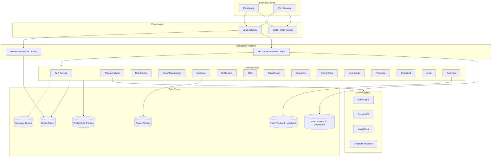

## Section 2: Complete Event-Driven Architecture

### Citizen Action 1: Text Scan

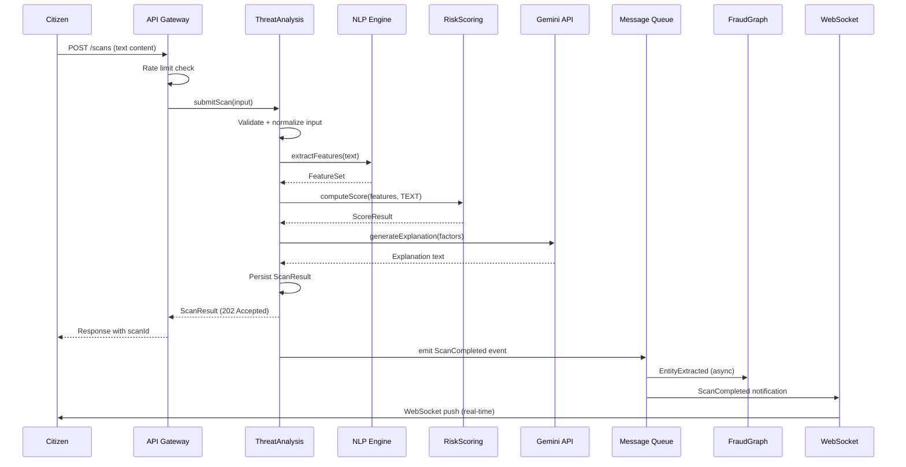

**Event: ScanSubmitted**
- Trigger: Citizen submits scan via API
- Payload: { scanId, userId, scanType: TEXT, content, submittedAt }
- Consumers: ThreatAnalysis (pipeline start)
- Side Effects: Rate limit counter incremented
- Failure Handling: Return 429 if rate exceeded, 400 if validation fails

**Event: ScanCompleted**
- Trigger: Pipeline produces final ScoreResult
- Payload: { scanId, userId, threatScore, riskLevel, factors, completedAt }
- Consumers: FraudGraph (entity extraction), SafetyScore (history update), WebSocket (notification)
- Side Effects: Safety score recalculation queued, graph entities registered
- Failure Handling: Result persisted regardless of downstream consumer failures

### Citizen Action 2: URL Scan

**Event: URLResolutionCompleted**
- Trigger: Short URL expanded (max 5 hops)
- Payload: { scanId, originalUrl, resolvedUrl, hopCount, redirectChain }
- Consumers: ThreatAnalysis (continues pipeline)
- Side Effects: Redirect chain logged for analysis
- Failure Handling: Timeout after 5s per hop, mark as suspicious if unresolvable

**Event: DomainAnalysisCompleted**
- Trigger: Domain reputation and SSL checks complete
- Payload: { scanId, domain, age, sslValid, reputationScore, knownPhishing }
- Consumers: RiskScoring (factor input)
- Side Effects: Domain added to local reputation cache
- Failure Handling: External lookup timeout → use cached data or mark unknown

### Citizen Action 3: Voice Scan

**Event: TranscriptionCompleted**
- Trigger: Speech-to-text processing finishes
- Payload: { scanId, transcript, language, confidence, durationMs }
- Consumers: ThreatAnalysis (pattern analysis), DeepfakeDetector
- Side Effects: Transcript persisted for review
- Failure Handling: Low confidence → flag for manual review, don't block scoring

**Event: DeepfakeAnalysisCompleted**
- Trigger: Spectral analysis of audio finishes
- Payload: { scanId, isDeepfake, confidence, spectralMarkers }
- Consumers: RiskScoring (high-weight factor if deepfake detected)
- Side Effects: Deepfake flag stored with scan result
- Failure Handling: Timeout → proceed without deepfake score, note in explanation

### Citizen Action 4: Report Fraud

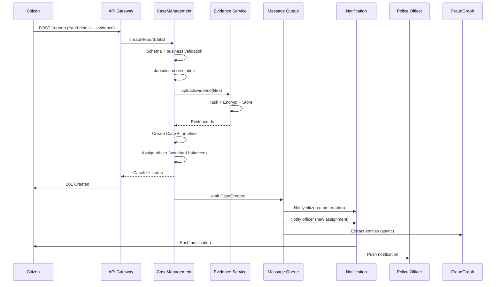

**Event: ReportSubmitted**
- Trigger: Citizen submits fraud report
- Payload: { reportId, citizenId, suspectIdentifiers, category, description, evidenceFiles }
- Consumers: CaseManagement (validation + case creation)
- Side Effects: None until validated
- Failure Handling: 400 for validation errors, duplicate check within 48h window

**Event: CaseCreated**
- Trigger: Report validated and case record persisted
- Payload: { caseId, reportId, citizenId, officerId, jurisdictionCode, priority, createdAt }
- Consumers: Notification (citizen + officer), FraudGraph (entity extraction), Analytics (metrics)
- Side Effects: Officer workload counter incremented, timeline initialized
- Failure Handling: Case created even if notification fails (notification retried from queue)

### Citizen Action 5: Upload Evidence

**Event: EvidenceReceived**
- Trigger: File upload begins processing
- Payload: { evidenceId, caseId, uploaderId, fileType, sizeBytes }
- Consumers: EvidenceService (hash + encrypt pipeline)
- Side Effects: Temporary file created in staging
- Failure Handling: Partial upload → garbage collected after 24h

**Event: CustodyChainInitiated**
- Trigger: Evidence successfully stored with hash
- Payload: { evidenceId, caseId, sha256Hash, encryptionKeyId, storedAt, uploaderId }
- Consumers: CaseManagement (timeline update), AuditLog
- Side Effects: Custody chain record created, case timeline entry added
- Failure Handling: Atomic operation — all succeed or all rollback

### Police Action 6: Open Case

**Event: CaseAccessed**
- Trigger: Officer opens a case for investigation
- Payload: { caseId, officerId, accessedAt }
- Consumers: AuditLog, AI Summary Generator
- Side Effects: Access logged in custody chain, AI summary generation triggered
- Failure Handling: Case loads even if AI summary generation fails (shows without summary)

**Event: AISummaryGenerated**
- Trigger: LangChain produces case summary
- Payload: { caseId, summary, relatedCaseIds, keyFacts, generatedAt }
- Consumers: CaseManagement (cache update)
- Side Effects: Summary cached in Redis (5min TTL)
- Failure Handling: Circuit breaker on AI service, stale cache served if available

### Police Action 7: Update Case Status

**Event: StatusChanged**
- Trigger: Officer transitions case to new status
- Payload: { caseId, fromStatus, toStatus, officerId, reason, changedAt }
- Consumers: Notification (citizen), Timeline, Analytics
- Side Effects: Timeline entry, citizen notification, dashboard metric update
- Failure Handling: Status change persisted regardless of notification delivery

### Police Action 8: Escalate Case

**Event: EscalationRequested**
- Trigger: Officer requests case escalation
- Payload: { caseId, officerId, targetJurisdiction, reason, escalatedAt }
- Consumers: JurisdictionValidator, CyberCell notification
- Side Effects: Case status → ESCALATED, new officer assignment
- Failure Handling: Escalation logged even if target jurisdiction unreachable

### AI/System Action 9: Generate Case Summary

**Event: CaseSummaryRequested**
- Trigger: Officer opens case OR summary cache expired
- Payload: { caseId, requesterId, includeRelatedCases: Boolean }
- Consumers: AI Pipeline (LangChain orchestrator)
- Side Effects: Cache invalidated for stale entry
- Failure Handling: Serve stale cache, background refresh

### AI/System Action 10: Threat Alert Generation

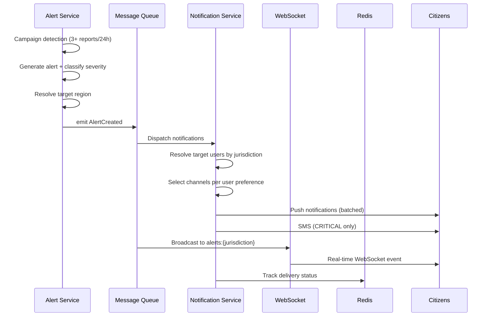

**Event: CampaignDetected**
- Trigger: 3+ similar reports within 24h in same jurisdiction
- Payload: { campaignId, pattern, reportIds, jurisdiction, severity, detectedAt }
- Consumers: Alert Service (alert generation)
- Side Effects: Related reports linked to campaign
- Failure Handling: False positive tolerance — alert generated, human review for HIGH+

**Event: AlertCreated**
- Trigger: Campaign confirmed and alert generated
- Payload: { alertId, campaignId, title, description, severity, jurisdictionCodes, expiresAt }
- Consumers: Notification (dispatch), WebSocket (broadcast), Analytics
- Side Effects: Active alert count incremented for region
- Failure Handling: Alert persisted regardless of delivery failures

### AI/System Action 11: Fraud Graph Update

**Event: EntityRegistered**
- Trigger: New identifier extracted from scan or report
- Payload: { entityId, entityType, identifier, sourceType, sourceId, registeredAt }
- Consumers: FraudGraph (connection discovery)
- Side Effects: Existing entity merged if identifier matches
- Failure Handling: Idempotent — duplicate registration is no-op

**Event: ClusterDetected**
- Trigger: Connected component analysis finds new cluster (3+ entities)
- Payload: { clusterId, entityIds, connectionIds, totalReports, severity }
- Consumers: CyberCell notification, Alert consideration
- Side Effects: Cluster visualization generated, cyber cell dashboard updated
- Failure Handling: Cluster persisted, notification retried independently

## Section 3: Internal Processing Pipelines

### Pipeline 1: Threat Scan (Text)

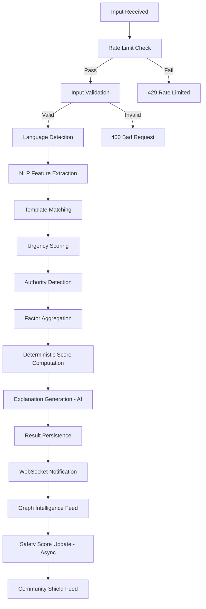

```pascal
PROCEDURE processTextScan(scanId, content, userId)
  INPUT: scanId (UUID), content (String), userId (UUID)
  OUTPUT: ScanResult

  SEQUENCE
    // Stage 1: Validation
    IF length(content) < 10 OR length(content) > 5000 THEN
      RETURN Error("Content must be 10-5000 characters")
    END IF

    IF NOT rateLimiter.allowRequest(userId, "text_scan") THEN
      RETURN Error("Rate limit exceeded: 20 scans/day")
    END IF

    // Stage 2: Feature Extraction
    language ← detectLanguage(content)
    features ← nlpEngine.extractFeatures(content, language)
    templateMatches ← templateMatcher.match(content, language)

    // Stage 3: Scoring
    urgencyScore ← computeUrgencyFactor(features.urgencyMarkers)
    authorityScore ← computeAuthorityFactor(features.authorityMarkers)
    templateScore ← computeTemplateMatchFactor(templateMatches)
    linkScore ← computeLinkRiskFactor(features.extractedLinks)

    factors ← aggregateFactors(urgencyScore, authorityScore, templateScore, linkScore)
    threatScore ← computeDeterministicScore(factors)

    // Stage 4: Explanation (AI-powered, non-blocking on failure)
    explanation ← TRY generateExplanation(factors, content) 
                  CATCH TIMEOUT → "Analysis complete. Score based on detected patterns."

    // Stage 5: Persistence and Notification
    result ← createScanResult(scanId, userId, threatScore, factors, explanation)
    persist(result)

    // Stage 6: Async side effects (non-blocking)
    emitEvent("ScanCompleted", result)

    RETURN result
  END SEQUENCE
END PROCEDURE
```

**Preconditions:**
- userId has valid session and active account
- Rate limit not exceeded (20 text scans/day for free tier)
- Content is UTF-8 encoded text between 10-5000 characters

**Postconditions:**
- ScanResult persisted with deterministic score
- ScanCompleted event emitted to message queue
- WebSocket notification dispatched to user channel
- Processing completed within 2000ms SLA (p95)

**Loop Invariants:** N/A (pipeline is sequential, no loops)

### Pipeline 2: Threat Scan (URL)

```pascal
PROCEDURE processURLScan(scanId, url, userId)
  INPUT: scanId (UUID), url (String), userId (UUID)
  OUTPUT: ScanResult

  SEQUENCE
    // Stage 1: Validation
    IF NOT isValidURL(url) THEN
      RETURN Error("Invalid URL format")
    END IF

    IF NOT rateLimiter.allowRequest(userId, "url_scan") THEN
      RETURN Error("Rate limit exceeded")
    END IF

    // Stage 2: URL Resolution
    resolvedUrl ← url
    hopCount ← 0
    WHILE isShortUrl(resolvedUrl) AND hopCount < 5 DO
      resolvedUrl ← expandShortUrl(resolvedUrl, timeout: 5000ms)
      hopCount ← hopCount + 1
    END WHILE

    IF hopCount >= 5 THEN
      markSuspicious("Excessive redirects")
    END IF

    // Stage 3: Domain Analysis (parallel)
    domain ← extractDomain(resolvedUrl)
    PARALLEL
      domainAge ← lookupDomainAge(domain)
      sslResult ← checkSSLCertificate(domain)
      reputation ← queryReputationDB(domain)
      content ← fetchContentSafely(resolvedUrl, sandbox: TRUE, timeout: 3000ms)
    END PARALLEL

    // Stage 4: Pattern Matching
    phishingMatch ← detectPhishingPatterns(content, domain)
    obfuscation ← detectObfuscation(resolvedUrl, content)

    // Stage 5: Factor Aggregation and Scoring
    factors ← aggregateURLFactors(domainAge, sslResult, reputation, phishingMatch, obfuscation, hopCount)
    threatScore ← computeDeterministicScore(factors)

    // Stage 6: Explanation + Persistence
    explanation ← generateExplanation(factors, url)
    result ← createScanResult(scanId, userId, threatScore, factors, explanation)
    persist(result)
    emitEvent("ScanCompleted", result)

    RETURN result
  END SEQUENCE
END PROCEDURE
```

**Preconditions:**
- URL is syntactically valid (scheme + host minimum)
- Rate limit not exceeded (20 URL scans/day)
- Sandbox environment available for safe content fetch

**Postconditions:**
- All external lookups completed or timed out with fallback
- Score computed even if some external sources unavailable
- Short URL expansion chain fully logged
- Processing completed within 2000ms SLA (p95)

**Loop Invariants:**
- hopCount strictly increases each iteration
- hopCount never exceeds 5 (termination guaranteed)
- Each resolvedUrl is a valid URL format

### Pipeline 3: Threat Scan (Voice)

```pascal
PROCEDURE processVoiceScan(scanId, audio, userId)
  INPUT: scanId (UUID), audio (AudioBlob), userId (UUID)
  OUTPUT: ScanResult

  SEQUENCE
    // Stage 1: Format Validation
    duration ← getAudioDuration(audio)
    IF duration < 3000ms OR duration > 300000ms THEN
      RETURN Error("Audio must be 3 seconds to 5 minutes")
    END IF

    IF NOT isSupportedFormat(audio) THEN
      RETURN Error("Unsupported audio format")
    END IF

    // Stage 2: Audio Normalization
    normalizedAudio ← normalizeAudio(audio, targetSampleRate: 16000, targetBitDepth: 16)

    // Stage 3: Parallel Analysis
    PARALLEL
      transcript ← speechToText(normalizedAudio)
      deepfakeResult ← detectDeepfake(normalizedAudio)
    END PARALLEL

    // Stage 4: Pattern Detection on Transcript
    socialEngPatterns ← detectSocialEngineering(transcript.text)
    urgencyPatterns ← detectUrgencyPatterns(transcript.text)
    authorityPatterns ← detectAuthorityPatterns(transcript.text)
    isolationPatterns ← detectIsolationPatterns(transcript.text)

    // Stage 5: Factor Aggregation
    factors ← aggregateVoiceFactors(
      deepfakeResult, socialEngPatterns, urgencyPatterns,
      authorityPatterns, isolationPatterns, transcript.confidence
    )
    threatScore ← computeDeterministicScore(factors)

    // Stage 6: Result
    explanation ← generateExplanation(factors, transcript.text)
    result ← createScanResult(scanId, userId, threatScore, factors, explanation)
    persist(result)
    emitEvent("ScanCompleted", result)

    RETURN result
  END SEQUENCE
END PROCEDURE
```

**Preconditions:**
- Audio duration between 3s and 5min
- Supported format (WAV, MP3, OGG, M4A)
- Speech-to-text service available

**Postconditions:**
- Transcript generated regardless of deepfake detection success
- If deepfake detector times out, scan completes without deepfake factor (noted in explanation)
- Processing completed within 5000ms SLA (p95)

**Loop Invariants:** N/A (pipeline is sequential with parallel branches)

### Pipeline 4: Fraud Report Submission

```pascal
PROCEDURE processReportSubmission(reportData, evidenceFiles, citizenId)
  INPUT: reportData (ReportInput), evidenceFiles (List OF File), citizenId (UUID)
  OUTPUT: CaseId

  SEQUENCE
    // Stage 1: Schema Validation
    validationResult ← validateSchema(reportData, FraudReportSchema)
    IF NOT validationResult.valid THEN
      RETURN Error(validationResult.errors)
    END IF

    // Stage 2: Business Validation
    IF isDuplicate(citizenId, reportData.suspectIdentifiers, window: 48h) THEN
      RETURN Error("Potential duplicate report. Confirm to proceed.")
    END IF

    // Stage 3: Jurisdiction Resolution
    jurisdictionCode ← resolveJurisdiction(reportData.location, reportData.category)

    // Stage 4: Evidence Processing (atomic)
    BEGIN TRANSACTION
      evidenceIds ← EMPTY LIST
      FOR EACH file IN evidenceFiles DO
        hash ← computeSHA256(file)
        encryptedFile ← encryptAES256(file, generateKey())
        storageRef ← objectStorage.store(encryptedFile)
        evidenceId ← persistEvidenceRecord(hash, storageRef, citizenId)
        APPEND evidenceId TO evidenceIds
      END FOR

      // Stage 5: Case Creation
      caseId ← createCase(reportData, citizenId, jurisdictionCode, evidenceIds)

      // Stage 6: Officer Assignment (workload-balanced)
      officerId ← assignOfficer(jurisdictionCode, reportData.category)
      updateCase(caseId, assignedOfficer: officerId)

      // Stage 7: Timeline Initialization
      initializeTimeline(caseId, citizenId, officerId)
    COMMIT TRANSACTION

    // Stage 8: Async side effects (non-blocking)
    emitEvent("CaseCreated", { caseId, citizenId, officerId, jurisdictionCode })
    emitEvent("CustodyChainInitiated", { caseId, evidenceIds })

    RETURN caseId
  END SEQUENCE
END PROCEDURE
```

**Preconditions:**
- Citizen has verified account
- Report data passes schema validation
- At least one suspect identifier provided
- Evidence files are within size limits (max 50MB per file, 200MB total)

**Postconditions:**
- Case created with ASSIGNED status (skip SUBMITTED → VALIDATED for auto-validated)
- All evidence hashed, encrypted, and stored atomically
- Officer assigned based on workload balancing within jurisdiction
- Citizen and officer both notified
- If any evidence step fails, entire transaction rolls back

**Loop Invariants:**
- All previously processed evidence files have valid hashes
- evidenceIds list grows monotonically
- Transaction isolation ensures no partial state visible externally

### Pipeline 5: Case Investigation

```pascal
PROCEDURE loadCaseForInvestigation(caseId, officerId)
  INPUT: caseId (UUID), officerId (UUID)
  OUTPUT: CaseInvestigationView

  SEQUENCE
    // Stage 1: Access Control
    caseRecord ← fetchCase(caseId)
    IF caseRecord.assignedOfficerId ≠ officerId AND NOT hasEscalatedAccess(officerId, caseId) THEN
      RETURN Error("Access denied: not assigned to this case")
    END IF

    // Stage 2: Evidence Fetch with Integrity
    evidenceList ← fetchEvidenceList(caseId)
    FOR EACH evidence IN evidenceList DO
      integrityResult ← verifyHash(evidence.id)
      IF NOT integrityResult.valid THEN
        flagTampering(evidence.id, caseId)
        MARK evidence AS "INTEGRITY_COMPROMISED"
      END IF
    END FOR

    // Stage 3: AI Summary (cached or generated)
    summary ← cache.get("case_summary:" + caseId)
    IF summary IS NULL OR summary.stale THEN
      summary ← TRY generateAISummary(caseId)
                CATCH → { text: "Summary unavailable", generated: FALSE }
      cache.set("case_summary:" + caseId, summary, TTL: 300s)
    END IF

    // Stage 4: Related Case Discovery
    relatedCases ← findRelatedCases(caseRecord.suspectIdentifiers, limit: 10)

    // Stage 5: Graph Connections
    graphView ← fraudGraph.queryConnections(caseRecord.suspectIdentifiers, depth: 2)

    // Stage 6: Emit access event
    emitEvent("CaseAccessed", { caseId, officerId, accessedAt: NOW() })

    RETURN CaseInvestigationView(caseRecord, evidenceList, summary, relatedCases, graphView)
  END SEQUENCE
END PROCEDURE
```

**Preconditions:**
- Officer is authenticated and assigned to the case (or has escalated access)
- Case exists and is not in CLOSED status

**Postconditions:**
- Every evidence access logged in audit trail
- Integrity verification performed on all evidence
- AI summary served from cache if available (300s TTL)
- Case access event emitted for audit

**Loop Invariants:**
- All previously verified evidence items have integrity status recorded
- No evidence is returned without integrity check

### Pipeline 6: Alert Broadcasting

```pascal
PROCEDURE broadcastAlert(alert, jurisdiction)
  INPUT: alert (Alert), jurisdiction (String)
  OUTPUT: BroadcastResult

  SEQUENCE
    // Stage 1: Target Resolution
    targetUsers ← resolveUsersByJurisdiction(jurisdiction)
    totalTargets ← count(targetUsers)

    // Stage 2: Batch Preparation (max 1000 per worker)
    batches ← splitIntoBatches(targetUsers, batchSize: 1000)

    // Stage 3: Multi-channel Dispatch
    deliveryResults ← EMPTY LIST
    FOR EACH batch IN batches DO
      FOR EACH user IN batch DO
        preferences ← getUserNotificationPreferences(user.id)
        channels ← selectChannels(alert.severity, preferences)
        
        notification ← createNotification(alert, user, channels)
        dispatchResult ← enqueueNotification(notification)
        APPEND dispatchResult TO deliveryResults
      END FOR
    END FOR

    // Stage 4: WebSocket Broadcast (immediate)
    websocket.publishToChannel("alerts:" + jurisdiction, alert)

    // Stage 5: Delivery Tracking
    trackBroadcast(alert.id, totalTargets, deliveryResults)

    RETURN BroadcastResult(alert.id, totalTargets, batchCount: count(batches))
  END SEQUENCE
END PROCEDURE
```

**Preconditions:**
- Alert is validated and persisted
- Jurisdiction code is valid and has registered users

**Postconditions:**
- All target users have notifications enqueued
- WebSocket broadcast sent immediately to connected users
- Delivery tracking initialized for monitoring
- Individual failures don't block other users

**Loop Invariants:**
- All previously processed batches have been enqueued
- deliveryResults count equals number of processed users
- No user receives duplicate notifications for same alert

### Pipeline 7: Fraud Graph Intelligence

```pascal
PROCEDURE processGraphEntity(entity, sourceId, sourceType)
  INPUT: entity (GraphEntity), sourceId (UUID), sourceType (String)
  OUTPUT: GraphUpdateResult

  SEQUENCE
    // Stage 1: Entity Registration / Deduplication
    existingEntity ← findEntityByIdentifier(entity.type, entity.identifier)
    IF existingEntity IS NOT NULL THEN
      entityId ← existingEntity.id
      incrementReportCount(entityId)
      updateLastSeen(entityId, NOW())
    ELSE
      entityId ← registerNewEntity(entity)
    END IF

    // Stage 2: Connection Discovery
    relatedReports ← findReportsByIdentifier(entity.identifier)
    FOR EACH report IN relatedReports DO
      otherEntities ← getEntitiesFromReport(report.id)
      FOR EACH otherEntity IN otherEntities DO
        IF otherEntity.id ≠ entityId THEN
          existingConnection ← findConnection(entityId, otherEntity.id)
          IF existingConnection IS NOT NULL THEN
            strengthenConnection(existingConnection, evidence: sourceId)
          ELSE
            createConnection(entityId, otherEntity.id, sourceId, initialStrength: 0.3)
          END IF
        END IF
      END FOR
    END FOR

    // Stage 3: Risk Score Update
    newRiskScore ← computeEntityRisk(entityId)
    updateEntityRiskScore(entityId, newRiskScore)

    // Stage 4: Cluster Re-evaluation
    affectedSubgraph ← getConnectedComponent(entityId, maxDepth: 3)
    IF count(affectedSubgraph.entities) >= 3 THEN
      clusterResult ← evaluateCluster(affectedSubgraph)
      IF clusterResult.isNewCluster THEN
        emitEvent("ClusterDetected", clusterResult)
      END IF
    END IF

    RETURN GraphUpdateResult(entityId, connectionsAdded, clusterResult)
  END SEQUENCE
END PROCEDURE
```

**Preconditions:**
- Entity has valid type and non-empty identifier
- Source (scan or report) exists and is validated

**Postconditions:**
- Entity registered or existing entity updated
- All discoverable connections established or strengthened
- Risk score recomputed for affected entity
- Cluster evaluation triggered if subgraph large enough

**Loop Invariants:**
- All previously processed reports have their entities connected
- No duplicate connections created (idempotent)
- Connection strength never exceeds 1.0

### Pipeline 8: Safety Score Computation

```pascal
PROCEDURE computeSafetyScore(citizenId)
  INPUT: citizenId (UUID)
  OUTPUT: SafetyScoreResult

  SEQUENCE
    // Fetch 90-day history
    windowStart ← NOW() - 90 DAYS
    scanHistory ← getScanHistory(citizenId, since: windowStart)
    learningHistory ← getLearningProgress(citizenId)
    reportHistory ← getReportHistory(citizenId, since: windowStart)
    communityActivity ← getCommunityActivity(citizenId, since: windowStart)

    // Factor 1: Scan Frequency (25%)
    scanCount ← count(scanHistory)
    scanFrequencyScore ← MIN(100, (scanCount / 30) * 100)

    // Factor 2: Learning Completion (20%)
    modulesCompleted ← learningHistory.completedModules
    totalModules ← learningHistory.totalModules
    learningScore ← (modulesCompleted / totalModules) * 100

    // Factor 3: Clean History (25%)
    highRiskScans ← count(scanHistory WHERE threatScore > 60 AND userActedUnsafely)
    cleanHistoryScore ← MAX(0, 100 - (highRiskScans * 20))

    // Factor 4: Community Participation (15%)
    communityActions ← communityActivity.contributions
    communityScore ← MIN(100, communityActions * 10)

    // Factor 5: Report Filing (15%)
    reportsFiled ← count(reportHistory)
    reportScore ← MIN(100, reportsFiled * 25)

    // Aggregate with weights
    rawScore ← (scanFrequencyScore * 0.25) +
                (learningScore * 0.20) +
                (cleanHistoryScore * 0.25) +
                (communityScore * 0.15) +
                (reportScore * 0.15)

    // Apply floor
    finalScore ← MAX(10, ROUND(rawScore))

    // Persist and cache
    persistSafetyScore(citizenId, finalScore, factors)
    cache.invalidate("safety_score:" + citizenId)

    RETURN SafetyScoreResult(citizenId, finalScore, factors)
  END SEQUENCE
END PROCEDURE
```

**Preconditions:**
- Citizen account exists and is active
- All data sources available (scan, learning, report, community)

**Postconditions:**
- Score is between 10 and 100 inclusive (floor enforced)
- Factor weights sum to exactly 1.0 (0.25 + 0.20 + 0.25 + 0.15 + 0.15)
- Score persisted and previous cache invalidated
- Same input data always produces same score (deterministic)

**Loop Invariants:** N/A (no loops, direct computation)

## Section 4: Service Communication

### Synchronous Communication Map

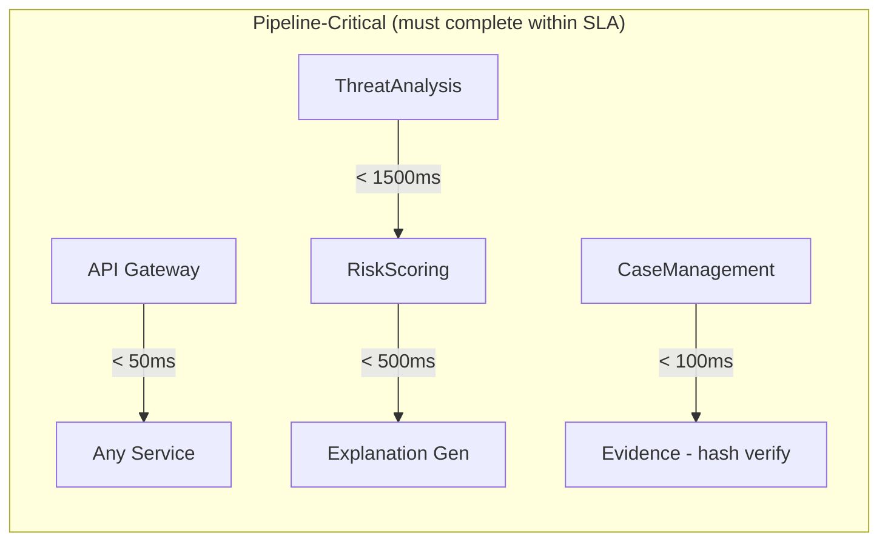

| Source | Target | Protocol | SLA | Purpose |
|--------|--------|----------|-----|---------|
| API Gateway | Any Service | REST/HTTP | < 50ms routing | Request forwarding |
| ThreatAnalysis | RiskScoring | Internal RPC | < 1500ms | Score computation within scan pipeline |
| RiskScoring | Explanation | Internal RPC | < 500ms | AI explanation generation |
| CaseManagement | Evidence | Internal RPC | < 100ms | Hash verification on access |
| Auth | Token Validation | Redis lookup | < 5ms | JWT session verification |

### Asynchronous Communication Map

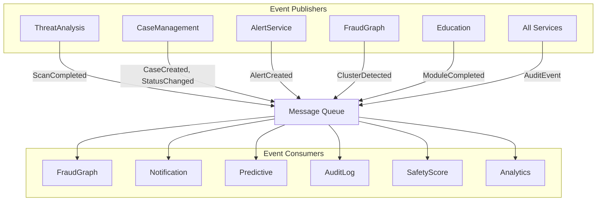

| Publisher | Event | Consumer(s) | Delivery | Retry Policy |
|-----------|-------|-------------|----------|--------------|
| ThreatAnalysis | ScanCompleted | FraudGraph, SafetyScore, WebSocket | At-least-once | 3 retries, exponential backoff |
| CaseManagement | CaseCreated | Notification, FraudGraph, Analytics | At-least-once | 3 retries, exponential backoff |
| CaseManagement | StatusChanged | Notification, Analytics | At-least-once | 3 retries, exponential backoff |
| AlertService | AlertCreated | Notification, WebSocket, Analytics | At-least-once | 5 retries (high priority) |
| FraudGraph | ClusterDetected | CyberCell, Alert consideration | At-least-once | 3 retries |
| FraudGraph | PatternData | Predictive (weekly batch) | At-least-once | Retry next cycle |
| Education | ModuleCompleted | SafetyScore | At-least-once | 3 retries |
| All Services | AuditEvent | AuditLog | At-least-once | Infinite retry (critical) |

### Forbidden Communication Paths

| From | To | Reason |
|------|----|--------|
| Frontend | Database directly | Security: all access through authenticated API layer |
| Police Portal | Object Storage | Evidence access must go through EvidenceService for audit logging |
| Government Portal | Individual user data | Privacy: only aggregated materialized views accessible |
| Community Service | Raw FraudGraph data | Privacy: only anonymized, aggregated threat data flows to community |
| CyberCell | CaseManagement directly | Decoupling: escalation via events only, not direct DB access |
| Any Service | Cross-schema DB query | Bounded context: services own their data exclusively |

## Section 5: Background Jobs

### Scheduled Jobs

| Job | Schedule | Purpose | Duration Target | Failure Strategy |
|-----|----------|---------|-----------------|-----------------|
| Safety Score Recalculation | Daily 00:00 UTC | Recompute all citizen safety scores | < 2h for 1M users | Staggered batches, resume on failure |
| Connection Strength Decay | Monthly 1st 01:00 | Apply 10% decay to inactive connections | < 1h | Idempotent, safe to re-run |
| Cluster Re-evaluation | Hourly :00 | Re-run cluster detection on updated graph | < 10min | Skip if previous still running |
| Materialized View Refresh | Every 15 min | Refresh government/trending dashboards | < 2min | Stale views served until refresh completes |
| Partition Maintenance | Monthly 1st 03:00 | Create future partitions, archive old ones | < 30min | Alert admin on failure, non-blocking |
| Database Backup | Daily 02:00 UTC | Full database backup + evidence vault | < 1h | Retry once, alert admin on second failure |
| Notification Cleanup | Daily 03:00 UTC | Delete expired notifications (>30 days) | < 30min | Batch delete, resumable |
| Session Cleanup | Every 5 min | Remove expired sessions from Redis | < 10s | Non-critical, next cycle catches up |
| Rate Limit Counter Reset | Daily 00:00 UTC | Reset daily scan counters | < 5s | Atomic operation on Redis |
| Prediction Generation | Weekly Sunday 04:00 | Generate fraud predictions for next week | < 4h | Retry next day if fails |

### Queue Workers

```pascal
PROCEDURE scanProcessingWorker()
  // Continuously processes scan submissions from queue
  LOOP
    message ← queue.poll("scan_submissions", timeout: 30s)
    IF message IS NOT NULL THEN
      TRY
        scan ← deserialize(message.payload)
        CASE scan.type OF
          TEXT: processTextScan(scan.id, scan.content, scan.userId)
          URL: processURLScan(scan.id, scan.url, scan.userId)
          VOICE: processVoiceScan(scan.id, scan.audio, scan.userId)
        END CASE
        queue.acknowledge(message)
      CATCH error
        IF message.retryCount < 3 THEN
          queue.requeue(message, delay: exponentialBackoff(message.retryCount))
        ELSE
          queue.deadLetter(message, reason: error.message)
          emitEvent("ScanFailed", { scanId: scan.id, error: error.message })
        END IF
      END TRY
    END IF
  END LOOP
END PROCEDURE

PROCEDURE notificationWorker()
  // Dispatches notifications across channels
  LOOP
    message ← queue.poll("notifications", timeout: 30s)
    IF message IS NOT NULL THEN
      notification ← deserialize(message.payload)
      FOR EACH channel IN notification.channels DO
        TRY
          deliverToChannel(channel, notification)
          updateDeliveryStatus(notification.id, channel, "DELIVERED")
        CATCH error
          IF message.retryCount < 3 THEN
            retrySingleChannel(notification.id, channel, delay: exponentialBackoff(message.retryCount))
          ELSE
            IF channel = PUSH AND notification.priority = CRITICAL THEN
              // Failover: try SMS
              deliverToChannel(SMS, notification)
            ELSE
              moveToDeadLetter(notification.id, channel, error)
            END IF
          END IF
        END TRY
      END FOR
      queue.acknowledge(message)
    END IF
  END LOOP
END PROCEDURE

PROCEDURE graphIngestionWorker()
  // Processes new entities and connections from scans/reports
  LOOP
    message ← queue.poll("graph_ingestion", timeout: 30s)
    IF message IS NOT NULL THEN
      TRY
        event ← deserialize(message.payload)
        CASE event.type OF
          "EntityExtracted": processGraphEntity(event.entity, event.sourceId, event.sourceType)
          "ConnectionDiscovered": strengthenConnection(event.fromId, event.toId, event.evidence)
          "DecayTrigger": applyStrengthDecay(event.decayFactor)
        END CASE
        queue.acknowledge(message)
      CATCH error
        queue.requeue(message, delay: 5000ms)
      END TRY
    END IF
  END LOOP
END PROCEDURE

PROCEDURE alertBroadcastWorker()
  // Handles mass alert distribution
  LOOP
    message ← queue.poll("alert_broadcast", timeout: 30s)
    IF message IS NOT NULL THEN
      alert ← deserialize(message.payload)
      broadcastAlert(alert, alert.jurisdictionCode)
      queue.acknowledge(message)
    END IF
  END LOOP
END PROCEDURE

PROCEDURE evidenceHashWorker()
  // Computes SHA-256 hashes for uploaded evidence
  LOOP
    message ← queue.poll("evidence_hashing", timeout: 30s)
    IF message IS NOT NULL THEN
      evidence ← deserialize(message.payload)
      hash ← computeSHA256(evidence.fileRef)
      persistHash(evidence.id, hash)
      emitEvent("EvidenceHashComputed", { evidenceId: evidence.id, hash })
      queue.acknowledge(message)
    END IF
  END LOOP
END PROCEDURE

PROCEDURE auditLogWorker()
  // Writes audit entries (non-blocking for main request)
  LOOP
    messages ← queue.pollBatch("audit_log", batchSize: 100, timeout: 5s)
    IF count(messages) > 0 THEN
      auditEntries ← deserializeAll(messages)
      batchInsert("audit_log", auditEntries)
      queue.acknowledgeBatch(messages)
    END IF
  END LOOP
END PROCEDURE
```

## Section 6: Real-Time Events (WebSocket)

### WebSocket Channel Architecture

```mermaid
graph TD
    subgraph Channels["Channel Patterns"]
        UC[user:{userId}]
        CC[case:{caseId}]
        AC[alerts:{jurisdictionCode}]
        RC[role:{roleName}]
        BC[broadcast]
    end

    subgraph Events["Event Types"]
        SC[threat.scan.completed]
        AN[alert.new]
        CSC[case.status.changed]
        CA[case.assigned]
        NN[notification.new]
        GCD[graph.cluster.detected]
        MF[mule.flagged]
        SM[system.maintenance]
    end

    SC --> UC
    AN --> AC
    CSC --> CC
    CA --> UC
    NN --> UC
    GCD --> RC
    MF --> RC
    SM --> BC
```

### Event Definitions

| Event | Target | Channel Pattern | Trigger | Payload |
|-------|--------|-----------------|---------|---------|
| threat.scan.completed | Submitting citizen | user:{userId} | Scan pipeline complete | { scanId, threatScore, riskLevel } |
| alert.new | Citizens in region | alerts:{jurisdictionCode} | Campaign detected | { alertId, title, severity, description } |
| case.status.changed | Officer + Citizen | case:{caseId} | Status transition | { caseId, fromStatus, toStatus, updatedAt } |
| case.assigned | Assigned officer | user:{officerId} | Case assignment | { caseId, priority, category } |
| notification.new | Specific user | user:{userId} | Any notification | { notificationId, type, title, preview } |
| graph.cluster.detected | Cyber cell | role:cybercell | New cluster found | { clusterId, entityCount, severity } |
| mule.flagged | Bank analysts | role:bank | Mule account confirmed | { entityId, accountType, confidence } |
| system.maintenance | All connected | broadcast | Scheduled maintenance | { startAt, estimatedDuration, message } |

### Connection Lifecycle

```pascal
PROCEDURE handleWebSocketConnection(userId, sessionId)
  INPUT: userId (UUID), sessionId (String)
  OUTPUT: ConnectionId

  SEQUENCE
    // Register connection
    connectionId ← generateConnectionId()
    connectionStore.register(connectionId, userId, sessionId)

    // Subscribe to user's channels
    subscribe(connectionId, "user:" + userId)

    // Subscribe to role-based channels
    userRole ← getUserRole(userId)
    subscribe(connectionId, "role:" + userRole)

    // Subscribe to jurisdiction alerts (citizens only)
    IF userRole = "citizen" THEN
      jurisdiction ← getUserJurisdiction(userId)
      subscribe(connectionId, "alerts:" + jurisdiction)
    END IF

    // Deliver queued events
    queuedEvents ← getQueuedEvents(userId, limit: 100)
    FOR EACH event IN queuedEvents DO
      send(connectionId, event)
    END FOR
    clearDeliveredQueue(userId, queuedEvents)

    // Start heartbeat monitoring
    startHeartbeat(connectionId, interval: 30s, timeout: 90s)

    RETURN connectionId
  END SEQUENCE
END PROCEDURE

PROCEDURE handleWebSocketDisconnect(connectionId, userId)
  INPUT: connectionId (String), userId (UUID)

  SEQUENCE
    // Unsubscribe from all channels
    unsubscribeAll(connectionId)

    // Mark connection as closed
    connectionStore.remove(connectionId)

    // Enable event queuing for this user
    enableEventQueuing(userId, maxEvents: 100, retention: 24h)
  END SEQUENCE
END PROCEDURE
```

## Section 7: Failure Recovery

### AI Service Unavailable

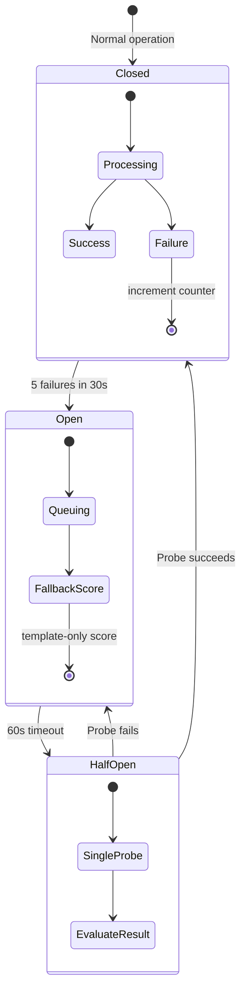

```pascal
PROCEDURE handleAIServiceFailure(scanId, features)
  INPUT: scanId (UUID), features (FeatureSet)
  OUTPUT: FallbackResult

  SEQUENCE
    // Circuit breaker state check
    IF circuitBreaker.isOpen("ai_service") THEN
      // Fallback: template-matching-only score (no AI explanation)
      score ← computeTemplateOnlyScore(features)
      explanation ← "Analysis based on pattern matching. AI-enhanced explanation temporarily unavailable."
      RETURN FallbackResult(score, explanation, degraded: TRUE)
    END IF

    IF circuitBreaker.isHalfOpen("ai_service") THEN
      // Single probe request
      result ← TRY callAIService(features, timeout: 5000ms)
               CATCH → NULL
      IF result IS NOT NULL THEN
        circuitBreaker.close("ai_service")
        RETURN result
      ELSE
        circuitBreaker.open("ai_service")
        RETURN computeFallback(features)
      END IF
    END IF

    // Normal operation
    result ← TRY callAIService(features, timeout: 3000ms)
             CATCH → NULL
    IF result IS NULL THEN
      circuitBreaker.recordFailure("ai_service")
      IF circuitBreaker.shouldOpen("ai_service") THEN
        circuitBreaker.open("ai_service")
      END IF
      RETURN computeFallback(features)
    END IF

    circuitBreaker.recordSuccess("ai_service")
    RETURN result
  END SEQUENCE
END PROCEDURE
```

### Database Unavailable

```pascal
PROCEDURE handleDatabaseFailure(operation, data)
  INPUT: operation (String), data (ANY)
  OUTPUT: FailoverResult

  SEQUENCE
    CASE operation OF
      "READ":
        // Attempt read replica
        result ← TRY readFromReplica(data.query)
                 CATCH → NULL
        IF result IS NOT NULL THEN
          RETURN FailoverResult(result, source: "replica", degraded: FALSE)
        END IF
        // Fall back to cache if available
        cached ← cache.get(data.cacheKey)
        IF cached IS NOT NULL THEN
          RETURN FailoverResult(cached, source: "cache", degraded: TRUE)
        END IF
        RETURN Error("Service temporarily unavailable")

      "WRITE":
        // Queue write to message queue (max 5 min buffer)
        IF queue.size("write_buffer") < MAX_BUFFER_SIZE THEN
          queue.enqueue("write_buffer", { operation, data, timestamp: NOW() })
          RETURN FailoverResult(accepted: TRUE, source: "buffered", degraded: TRUE)
        ELSE
          RETURN Error("Write capacity exceeded, please retry")
        END IF
    END CASE
  END SEQUENCE
END PROCEDURE
```

### Notification Delivery Failure

```pascal
PROCEDURE handleNotificationFailure(notification, channel, attempt)
  INPUT: notification (NotificationPayload), channel (Channel), attempt (Integer)
  OUTPUT: RetryResult

  SEQUENCE
    delays ← [1000, 5000, 30000]  // 1s, 5s, 30s

    IF attempt < 3 THEN
      // Retry with exponential backoff
      scheduleRetry(notification, channel, delay: delays[attempt])
      RETURN RetryResult(status: "RETRYING", nextAttempt: attempt + 1)
    ELSE
      // All retries exhausted
      IF channel = PUSH AND notification.priority = CRITICAL THEN
        // Channel failover: push → SMS
        deliverToChannel(SMS, notification)
        RETURN RetryResult(status: "FAILOVER", failoverChannel: SMS)
      ELSE
        // Dead letter queue
        moveToDeadLetter(notification, channel, reason: "Max retries exceeded")
        RETURN RetryResult(status: "DEAD_LETTERED")
      END IF
    END IF

    // SLA breach detection
    IF NOW() - notification.createdAt > 5 MINUTES THEN
      alertAdmin("Notification SLA breach", notification.id)
    END IF
  END SEQUENCE
END PROCEDURE
```

### Partial Upload Recovery

```pascal
PROCEDURE handlePartialUpload(evidenceId, uploadState)
  INPUT: evidenceId (UUID), uploadState (UploadState)
  OUTPUT: RecoveryResult

  SEQUENCE
    // Upload is atomic: file + hash + record all succeed or all fail
    IF uploadState.fileStored AND NOT uploadState.hashComputed THEN
      // File in staging but not finalized
      markForGarbageCollection(evidenceId, expiry: NOW() + 24h)
      RETURN RecoveryResult(action: "RETRY_UPLOAD", message: "Upload incomplete, please retry")
    END IF

    IF uploadState.hashComputed AND NOT uploadState.recordPersisted THEN
      // Hash computed but DB record missing — attempt recovery
      TRY
        persistEvidenceRecord(evidenceId, uploadState.hash, uploadState.storageRef)
        RETURN RecoveryResult(action: "RECOVERED", message: "Upload recovered successfully")
      CATCH
        rollbackStorage(uploadState.storageRef)
        RETURN RecoveryResult(action: "RETRY_UPLOAD", message: "Upload failed, please retry")
      END TRY
    END IF

    // Garbage collection for abandoned partial uploads
    IF NOW() - uploadState.startedAt > 24 HOURS THEN
      deleteFromStorage(uploadState.storageRef)
      cleanupStagingRecord(evidenceId)
      RETURN RecoveryResult(action: "GARBAGE_COLLECTED")
    END IF
  END SEQUENCE
END PROCEDURE
```

### Duplicate Report Detection

```pascal
PROCEDURE detectDuplicateReport(citizenId, suspectIdentifiers, submittedAt)
  INPUT: citizenId (UUID), suspectIdentifiers (List OF String), submittedAt (Timestamp)
  OUTPUT: DuplicateCheckResult

  SEQUENCE
    windowStart ← submittedAt - 48 HOURS
    recentReports ← getReportsByCitizen(citizenId, since: windowStart)

    FOR EACH report IN recentReports DO
      matchingIdentifiers ← intersect(report.suspectIdentifiers, suspectIdentifiers)
      IF count(matchingIdentifiers) > 0 THEN
        similarity ← count(matchingIdentifiers) / count(suspectIdentifiers)
        IF similarity >= 0.5 THEN
          RETURN DuplicateCheckResult(
            isDuplicate: TRUE,
            existingReportId: report.id,
            matchedIdentifiers: matchingIdentifiers,
            action: "CONFIRM_OR_MERGE"
          )
        END IF
      END IF
    END FOR

    RETURN DuplicateCheckResult(isDuplicate: FALSE)
  END SEQUENCE
END PROCEDURE
```

### WebSocket Reconnection

```pascal
PROCEDURE handleReconnection(userId, lastEventTimestamp)
  INPUT: userId (UUID), lastEventTimestamp (Timestamp)
  OUTPUT: ReconnectionResult

  SEQUENCE
    // Retrieve queued events since disconnection
    queuedEvents ← getQueuedEvents(userId, since: lastEventTimestamp)

    IF count(queuedEvents) > 100 THEN
      // Queue overflow — deliver most recent, notify about missed
      missedCount ← count(queuedEvents) - 100
      queuedEvents ← takeLastN(queuedEvents, 100)
      notifyMissedEvents(userId, missedCount)
    END IF

    // Deliver in chronological order
    sortByTimestamp(queuedEvents, ASC)
    FOR EACH event IN queuedEvents DO
      send(userId, event)
    END FOR

    // Clear delivered events from queue
    clearDeliveredQueue(userId, queuedEvents)

    RETURN ReconnectionResult(deliveredCount: count(queuedEvents), missedCount: missedCount OR 0)
  END SEQUENCE
END PROCEDURE
```

## Section 8: Scalability

### Tier 1: 100 Users (Development)

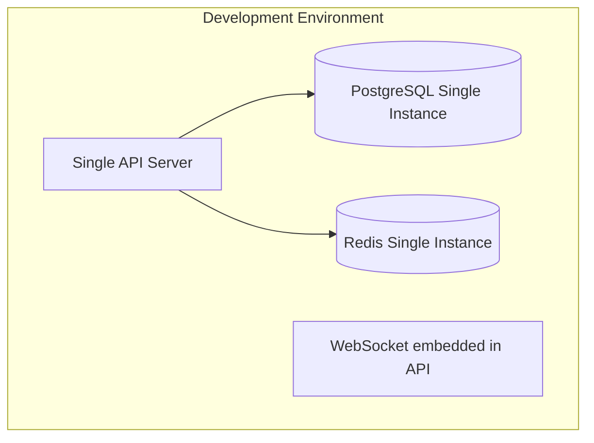

- Single PostgreSQL instance, single API server, no Redis cluster
- All services co-located in single process
- No message queue — synchronous processing
- WebSocket embedded in API server
- All workers run in-process as async tasks
- Suitable for development and testing only

### Tier 2: 10,000 Users (Beta)

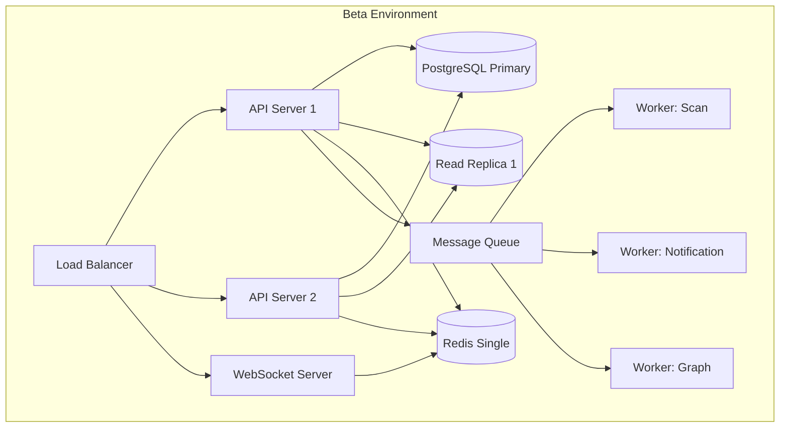

- PostgreSQL primary + 1 read replica (dashboards)
- Redis single instance (sessions + cache + pub/sub for WebSocket)
- 2 API servers behind load balancer
- Dedicated WebSocket server
- Message queue for async jobs (single broker)
- 1 worker per job type (scan, notification, graph)
- Basic CDN for static assets

### Tier 3: 100,000 Users (Launch)

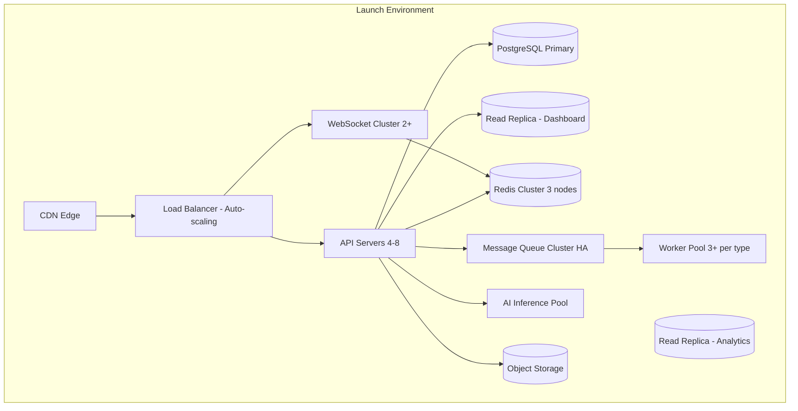

- PostgreSQL primary + 2 read replicas (dashboard + analytics)
- Redis cluster (3 nodes, high availability)
- 4-8 API servers with auto-scaling (CPU/memory triggers)
- Message queue cluster (high availability, 2+ brokers)
- 3+ workers per job type (independently scalable)
- CDN for static assets + cacheable API responses
- WebSocket server cluster (2+ instances, Redis-backed state)
- Dedicated AI inference pool (2+ instances)
- Object storage with lifecycle policies

### Tier 4: 1,000,000 Users (Scale)

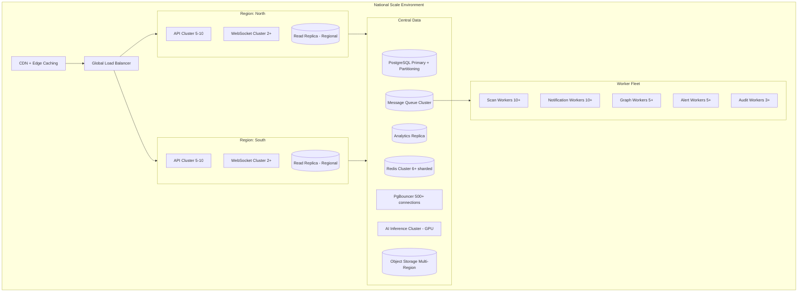

- PostgreSQL with table partitioning active (by date, jurisdiction)
- Read replicas per region (geographic distribution)
- Redis cluster (6+ nodes, sharded by key pattern)
- 10-20 API servers per region, auto-scaling by CPU/memory
- Dedicated workers per queue type (independently scalable)
- CDN + edge caching for API responses (public data only)
- WebSocket server cluster (4+ per region, shared Redis for state)
- Database connection pooling (PgBouncer, 500+ connections)
- Separate AI inference cluster (GPU nodes, auto-scaling by queue depth)
- Object storage with multi-region replication for evidence
- Separate analytics pipeline (no impact on transactional workload)

## Section 9: Performance

### Latency Targets

| Operation | Target (p95) | Strategy |
|-----------|-------------|----------|
| API health check | < 10ms | Direct response, no DB |
| Dashboard load | < 500ms | Materialized views + Redis cache |
| Threat scan (text) | < 2000ms | Optimized NLP pipeline, parallel factors |
| Threat scan (URL) | < 2000ms | Parallel domain checks, cached reputation |
| Threat scan (voice) | < 5000ms | Streaming transcription + parallel deepfake |
| Case list query | < 200ms | Indexed + partitioned + pagination |
| Graph traversal (1 hop) | < 100ms | Indexed connections, adjacency list |
| Graph traversal (2 hops) | < 500ms | Bounded expansion, result limit |
| Notification delivery | < 5 min | Queue + parallel workers |
| WebSocket event | < 500ms | In-memory routing, Redis pub/sub |
| Full-text search | < 300ms | GIN tsvector indexes |
| Evidence upload (50MB) | < 10s | Streaming upload, async hash |
| Safety score lookup | < 50ms | Redis cached |
| Authentication | < 100ms | JWT validation, Redis session |
| Rate limit check | < 5ms | Redis atomic operation |

### Caching Strategy

```pascal
STRUCTURE CacheLayer
  L1_InProcess: DESCRIPTION "Feature flags, static config"
    TTL: 300s (5 minutes)
    Size: < 10MB per instance
    Invalidation: Process restart or manual flush

  L2_Redis: DESCRIPTION "Sessions, permissions, safety scores, reference data"
    TTL: Varies (sessions: 24h, scores: until recomputed, reference: 1h)
    Size: Scales with user count
    Invalidation: Event-driven (score change → invalidate)

  L3_MaterializedViews: DESCRIPTION "Dashboard aggregates, trending threats, case counts"
    TTL: 15 minutes (refresh schedule)
    Size: Fixed (bounded by query definitions)
    Invalidation: Scheduled refresh job

  L4_CDN: DESCRIPTION "Static assets, public pages, help content"
    TTL: 24h for static, 5min for semi-dynamic
    Size: Unbounded (edge network)
    Invalidation: Deploy-time cache bust (versioned URLs)
END STRUCTURE
```

### Concurrency Model

```pascal
STRUCTURE ConcurrencyConfig
  APIServers:
    Model: "Async non-blocking I/O (event loop)"
    MaxConcurrentRequests: 10000 per instance
    ConnectionPool: 50 DB connections per server
    Strategy: "Never block event loop — all I/O is async"

  DatabaseAccess:
    ConnectionPool: 50 per API server
    PreparedStatements: TRUE (reduce parse overhead)
    ReadReplicas: "Dashboard queries → replica, writes → primary"
    Isolation: "Read Committed (default), Serializable (financial)"

  MessageQueue:
    ConsumersPerQueue: 3-10 (auto-scaled by queue depth)
    Prefetch: 10 messages per consumer
    AcknowledgeMode: "Manual (after processing complete)"
    Parallelism: "Each consumer processes 1 message at a time"

  GraphOperations:
    ReadModel: "Eventually consistent (50ms propagation)"
    WriteModel: "Strongly consistent within single entity"
    TraversalLimit: "Max 1000 nodes per query"
    CacheHit: "Graph query results cached 3s TTL"
END STRUCTURE
```

## Section 10: Architecture Review

### Identified Bottlenecks

| # | Bottleneck | Impact | Likelihood |
|---|-----------|--------|------------|
| 1 | Threat scan pipeline (NLP + AI) | CPU-intensive, saturates under load | HIGH at scale |
| 2 | Fraud graph cluster detection | Expensive computation on large graphs | MEDIUM at scale |
| 3 | Alert broadcasting to 100K+ users | High fan-out, notification queue backlog | MEDIUM |
| 4 | Evidence hash verification on access | I/O intensive, blocks case loading | LOW (cacheable) |
| 5 | Safety score daily recalculation | Batch processing load on DB at midnight | HIGH at scale |
| 6 | Materialized view refresh | Locks tables during refresh, blocks reads | LOW (parallel refresh) |
| 7 | WebSocket connection count | Memory per connection, Redis pub/sub limits | MEDIUM at scale |

### Mitigations

```pascal
STRUCTURE BottleneckMitigations
  AIInferenceSaturation:
    Strategy: "Auto-scaling pool + circuit breaker"
    Details: "GPU nodes scale by queue depth. Circuit breaker opens at 5 failures/30s."
    Fallback: "Template-matching-only score (no AI explanation)"
    Recovery: "Circuit half-opens at 60s, probes single request"

  GraphClusterDetection:
    Strategy: "Incremental re-evaluation"
    Details: "Only re-evaluate subgraph affected by new entity/connection"
    Optimization: "Pre-computed connected components, delta updates"
    Limit: "Max traversal depth 3, max 1000 nodes per evaluation"

  AlertBroadcasting:
    Strategy: "Batched parallel workers"
    Details: "Fan-out limited to 1000 users/worker, multiple workers"
    Optimization: "Pre-computed jurisdiction → user mapping (refreshed hourly)"
    Priority: "WebSocket immediate, push/SMS queued with SLA"

  EvidenceHashVerification:
    Strategy: "Verification result caching"
    Details: "Hash check result cached 5 minutes (evidence immutable)"
    Optimization: "Cache key = evidenceId + storedHash, only re-verify on cache miss"

  SafetyScoreBatch:
    Strategy: "Staggered recalculation"
    Details: "Split citizens into 24 cohorts, recalculate 1 cohort per hour"
    Optimization: "Only recalculate if input data changed (dirty flag)"
    Fallback: "Serve previous score if recalculation delayed"
END STRUCTURE
```

### Coupling Analysis

| Coupling | Type | Risk | Recommendation |
|----------|------|------|----------------|
| ThreatAnalysis → RiskScoring | Synchronous | LOW | Acceptable for pipeline SLA |
| RiskScoring → AI Explanation | Synchronous | MEDIUM | Add timeout + fallback |
| All → AuditLog | Async event | NONE | Fully decoupled by design |
| CaseManagement → Evidence | Sync (hash verify) | LOW | Cache verification results |
| FraudGraph → Predictive | Async weekly batch | NONE | Fully decoupled |

### Improvement Recommendations

1. **Read-through cache for case summaries**: AI-generated summaries cached in Redis with 5min TTL, lazy regeneration on cache miss
2. **Graph query result caching**: 3s TTL for cyber cell dashboard queries (repeated access patterns)
3. **CQRS for case management**: Separate write model (event-sourced) from read model (denormalized views) for high-read scenarios
4. **Circuit breakers on all external APIs**: SMS provider, push notification service, domain reputation APIs
5. **Request deduplication**: Idempotency keys on scan submissions to prevent duplicate processing
6. **Connection pooling optimization**: PgBouncer in transaction mode for short-lived connections
7. **Predictive scaling**: Use historical traffic patterns to pre-scale before peak hours
8. **Event replay capability**: Store events in append-only log for debugging and reprocessing

## Correctness Properties

### Property 1: Deterministic Threat Scoring

FOR ALL scans s1, s2:
IF s1.features = s2.features AND s1.scanType = s2.scanType
THEN computeScore(s1) = computeScore(s2)

The threat scoring algorithm must produce identical scores for identical feature sets, regardless of when or how many times it is invoked. This ensures reproducibility and auditability of scan results.

### Property 2: Event Ordering Guarantee

FOR ALL events e1, e2 belonging to the same aggregate:
IF e1.version < e2.version
THEN e1.timestamp <= e2.timestamp AND e1 is processed before e2

Events within a single aggregate (case, scan, entity) must be processed in version order. Cross-aggregate events have no ordering guarantee (eventually consistent).

### Property 3: Evidence Integrity Invariant

FOR ALL evidence e in the system:
retrieveEvidence(e.id).computedHash = e.originalHash
OR flagTampering(e.id) has been called

Every evidence retrieval must verify hash integrity. If the hash does not match, the system must flag tampering — evidence is never served without verification.

### Property 4: Case Status Transition Validity

FOR ALL status transitions t on case c:
t.toStatus MUST be in validTransitions(t.fromStatus)
WHERE validTransitions is defined as:
  SUBMITTED → {VALIDATED}
  VALIDATED → {ASSIGNED}
  ASSIGNED → {INVESTIGATING}
  INVESTIGATING → {ESCALATED, RESOLVED}
  ESCALATED → {INVESTIGATING, RESOLVED}
  RESOLVED → {CLOSED}
  CLOSED → {} (terminal state)

No case can skip states or transition to an invalid state. The state machine is strictly enforced.

### Property 5: Rate Limit Enforcement

FOR ALL users u and time windows w:
count(scans by u in w) <= rateLimit(u.tier)
WHERE rateLimit is:
  free: 20 scans/day
  premium: 100 scans/day
  unlimited: no limit

Rate limits are enforced atomically. A scan that would exceed the limit is rejected before any processing begins.

### Property 6: Notification At-Least-Once Delivery

FOR ALL notifications n with priority >= NORMAL:
EVENTUALLY (n.deliveryStatus = DELIVERED OR n.deliveryStatus = DEAD_LETTERED)
AND retryCount(n) <= maxRetries(n.channel)

Every notification eventually reaches a terminal state. No notification remains in PENDING state indefinitely. Critical notifications have channel failover before dead-lettering.

### Property 7: Safety Score Bounds

FOR ALL citizens c:
10 <= safetyScore(c) <= 100
AND safetyScore(c) = MAX(10, ROUND(weightedSum(factors(c))))
AND sum(factorWeights) = 1.0

Safety scores are always within bounds. The floor of 10 is always enforced. Factor weights are invariant and sum to exactly 1.0.

### Property 8: Graph Connection Strength Bounds

FOR ALL connections conn in FraudGraph:
0.0 <= conn.strength <= 1.0
AND (conn.strength decreases by 10% monthly IF no new evidence)
AND (conn.strength increases on new evidence BUT never exceeds 1.0)

Connection strength is always normalized between 0 and 1. Decay is applied monthly, strengthening occurs on new evidence, and the upper bound is never violated.

### Property 9: Atomic Evidence Upload

FOR ALL evidence uploads u:
(u.fileStored AND u.hashComputed AND u.recordPersisted) = ALL TRUE
OR (u.fileStored AND u.hashComputed AND u.recordPersisted) = ALL FALSE (rolled back)

Evidence upload is atomic. There is no state where a file is stored without its hash and record, or vice versa. Partial states are cleaned up by garbage collection within 24h.

### Property 10: Bounded Context Isolation

FOR ALL services s1, s2 where s1.boundedContext ≠ s2.boundedContext:
NOT EXISTS directDatabaseQuery(s1, s2.schema)
AND communication(s1, s2) IS ONLY VIA domainEvents OR definedSyncAPI

No service directly accesses another service's database schema. All cross-context communication flows through domain events (async) or explicitly defined synchronous APIs.

### Property 11: Circuit Breaker State Machine

FOR ALL circuit breakers cb:
(cb.state = CLOSED AND cb.failureCount < threshold) OR
(cb.state = OPEN AND timeSinceOpened(cb) < timeout) OR
(cb.state = HALF_OPEN AND probeInFlight(cb))
AND transitions follow: CLOSED→OPEN→HALF_OPEN→(CLOSED|OPEN)

Circuit breakers follow the defined state machine. They cannot be in an invalid state or transition directly from CLOSED to HALF_OPEN.

### Property 12: WebSocket Event Queue Bounds

FOR ALL disconnected users u:
count(queuedEvents(u)) <= 100
AND age(oldestEvent(u)) <= 24 HOURS
AND delivery order is chronological (by timestamp)

Queued events for disconnected users never exceed 100 entries or 24h retention. When limits are reached, oldest events are dropped and the user is notified of missed events count.

### Property 13: Duplicate Report Idempotency

FOR ALL report submissions r1, r2 from same citizen c within 48h:
IF intersect(r1.suspectIdentifiers, r2.suspectIdentifiers) / count(r2.suspectIdentifiers) >= 0.5
THEN system flags as potential duplicate before creating case
AND citizen must explicitly confirm to proceed

Duplicate reports are detected and flagged. The system never silently creates duplicate cases for the same fraud incident without citizen confirmation.

### Property 14: Scan Pipeline SLA Compliance

FOR ALL completed scans s:
IF s.scanType = TEXT OR s.scanType = URL THEN s.processingTimeMs <= 2000 (p95)
IF s.scanType = VOICE THEN s.processingTimeMs <= 5000 (p95)
AND IF SLA exceeded THEN scan still completes (with degraded explanation if needed)

Scans that exceed SLA still complete — they are never abandoned. The SLA target applies to p95; outliers are expected but tracked for alerting.

### Property 15: Cluster Detection Minimum Threshold

FOR ALL fraud clusters cl in the graph:
count(cl.entities) >= 3
AND all entities in cl are transitively connected
AND cl.severity is derived from (totalReports, connectionStrengths, entityRiskScores)

A fraud cluster requires minimum 3 connected entities. Isolated pairs are connections, not clusters. Severity classification follows deterministic rules based on cluster properties.

### Property 16: Audit Trail Completeness

FOR ALL state-changing operations op in the system:
EXISTS auditEntry ae WHERE ae.operationId = op.id
AND ae.userId = op.performedBy
AND ae.timestamp = op.timestamp
AND ae.serviceName = op.service

Every state-changing operation produces an audit entry. The audit log worker has infinite retry — audit events are never dropped. If the audit system is down, operations queue until it recovers.

### Property 17: Jurisdiction Isolation

FOR ALL police officers o and cases c:
canAccess(o, c) = TRUE
IF AND ONLY IF (c.assignedOfficerId = o.id OR c.jurisdictionCode IN o.jurisdictions OR hasEscalatedAccess(o, c))

Officers can only access cases within their jurisdiction or explicitly assigned to them. Cross-jurisdiction access requires escalation protocol.

## Error Handling

### Error Scenario 1: AI Service Timeout

**Condition**: Gemini API or NLP engine does not respond within 3000ms
**Response**: Circuit breaker evaluates failure count. If below threshold, retry once with 2000ms timeout. If above threshold (5 failures in 30s), circuit opens.
**Recovery**: Fallback to template-matching-only score. Explanation text indicates AI enhancement temporarily unavailable. Circuit probes every 60s for recovery.
**User Impact**: Scan completes with slightly less detailed explanation. Score remains accurate (template matching covers core patterns).

### Error Scenario 2: Database Write Failure

**Condition**: PostgreSQL primary is unreachable or transaction fails
**Response**: For reads: failover to read replica. For writes: buffer to message queue (max 5 min).
**Recovery**: Connection pool retries with exponential backoff (100ms, 500ms, 2s, 10s). Health check reports degraded state. If primary recovers, buffered writes are flushed in order.
**User Impact**: Reads continue from replica (possibly stale by seconds). Writes accepted but confirmation delayed.

### Error Scenario 3: Message Queue Unavailable

**Condition**: Message queue broker unreachable
**Response**: Synchronous fallback for critical operations (scan result persistence). Non-critical events (audit, analytics) buffered in-memory (max 1000 events per service).
**Recovery**: Queue reconnection with exponential backoff. In-memory buffer flushed when connection restored. If buffer fills, oldest non-critical events dropped.
**User Impact**: Slight delay in async notifications. Core scan and case operations unaffected.

### Error Scenario 4: Evidence Storage Failure

**Condition**: Object storage write fails during evidence upload
**Response**: Entire transaction rolled back (no partial evidence). User receives clear "upload failed" error.
**Recovery**: User retries upload. No orphaned files (transaction atomicity). If object storage has extended outage, evidence upload disabled with informative message.
**User Impact**: Must retry upload. Report can still be submitted without evidence (evidence added later).

### Error Scenario 5: WebSocket Server Crash

**Condition**: WebSocket server instance terminates unexpectedly
**Response**: Load balancer detects health check failure, removes instance. Clients auto-reconnect to surviving instances.
**Recovery**: New WebSocket server spins up. Reconnecting clients receive queued events (from Redis-backed queue). Connection state rebuilt from Redis.
**User Impact**: Brief disconnection (< 5s for reconnect). No events lost (queued in Redis for up to 24h).

### Error Scenario 6: Rate Limit Breach Attempt

**Condition**: User exceeds allocated scan quota
**Response**: 429 Too Many Requests with Retry-After header. No processing resources consumed.
**Recovery**: Counter resets at midnight UTC (daily window). User informed of limit and upgrade options.
**User Impact**: Cannot submit more scans until reset. Previous scan results remain accessible.

### Error Scenario 7: Cascading Service Failure

**Condition**: Multiple services fail simultaneously (e.g., during deployment)
**Response**: API Gateway health checks detect failures. Affected routes return 503 with estimated recovery time. Circuit breakers isolate healthy services from cascading failures.
**Recovery**: Rolling deployment ensures at least one instance per service is always running. If cascade detected, automatic rollback triggered.
**User Impact**: Some features temporarily unavailable (< 30s during normal deployments). Core read operations continue from cache.

## Testing Strategy

### Unit Testing Approach

Each service's core business logic is tested in isolation:
- Score computation: verify determinism with identical inputs
- State machine: verify all valid transitions accepted, all invalid rejected
- Factor aggregation: verify weight sum invariant
- Hash computation: verify correctness against known test vectors
- Rate limiter: verify counter increment and threshold enforcement

### Property-Based Testing Approach

**Property Test Library**: fast-check (JavaScript/TypeScript ecosystem)

Key properties to verify:
- Score determinism: generate random feature sets, verify same input → same output
- Score bounds: for any feature combination, score is always 0-100
- Factor weight invariant: for any scan type configuration, weights sum to 1.0
- State machine completeness: for any sequence of status transitions, valid paths succeed and invalid paths are rejected
- Event ordering: for any sequence of events on same aggregate, version numbers are monotonically increasing
- Graph strength bounds: for any sequence of strengthen/decay operations, strength stays in [0, 1]
- Safety score bounds: for any citizen activity profile, score is always [10, 100]
- Duplicate detection: for any pair of reports with overlapping identifiers, duplicate flag is correctly set

### Integration Testing Approach

- Pipeline end-to-end: submit scan → verify result in DB + event emitted + WebSocket delivered
- Case lifecycle: create report → assign → investigate → resolve → close (full flow)
- Evidence integrity: upload → retrieve → verify hash matches
- Alert broadcasting: trigger campaign detection → verify notifications dispatched to correct users
- Circuit breaker: simulate AI failure → verify fallback score → simulate recovery → verify normal operation resumes
- WebSocket reconnection: disconnect → queue events → reconnect → verify ordered delivery

## Performance Considerations

### Critical Path Optimization

The threat scan pipeline is the most latency-sensitive path. Optimizations:

1. **Parallel factor extraction**: NLP features, template matching, and link analysis run concurrently rather than sequentially
2. **Pre-warmed NLP models**: Models loaded into memory at service start, not on first request
3. **Connection pooling**: Database connections pre-established, eliminating connection setup latency
4. **Prepared statements**: All frequent queries use prepared statements to avoid parse overhead
5. **Streaming transcription**: Voice scans begin text analysis before full transcription completes
6. **Redis pipeline**: Multiple cache operations batched in single round-trip

### Database Performance

- **Partitioning strategy**: Scans partitioned by month (scan_results_2024_01, etc.), cases partitioned by jurisdiction
- **Index design**: Composite indexes on (userId, createdAt) for scan history, (jurisdictionCode, status) for case queries
- **Materialized views**: Pre-computed aggregates refreshed every 15 minutes for dashboards
- **Read replica routing**: Dashboard and analytics queries routed to dedicated read replicas
- **Connection pooling**: PgBouncer in transaction mode (500+ effective connections from 50 actual)

### Memory Management

- **WebSocket state**: Connection metadata in Redis (not in-process memory) — enables server replacement without losing state
- **Event queues**: Bounded (100 events per user, 24h max age) — prevents unbounded memory growth
- **Cache eviction**: LRU policy on Redis with maxmemory-policy set to allkeys-lru
- **Worker memory**: Each worker processes one message at a time — no unbounded buffering

### Throughput Targets

| Metric | Target | Scaling Strategy |
|--------|--------|-----------------|
| Scans per second | 100 sustained, 500 burst | Auto-scale scan workers by queue depth |
| Cases created per hour | 1000 | Horizontal API scaling |
| Notifications per minute | 10,000 | Parallel notification workers |
| WebSocket connections | 50,000 per instance | Dedicated WebSocket cluster |
| Graph queries per second | 500 | Redis-cached results, read replicas |
| Concurrent API requests | 10,000 per instance | Async non-blocking I/O |

## Security Considerations

### Authentication and Authorization

- **JWT tokens**: Short-lived access tokens (15min) + refresh tokens (7 days)
- **Session management**: Redis-backed sessions with automatic expiry
- **Role-based access**: 8 roles (citizen, police, cybercell, government, bank, organization, admin, system)
- **Resource-level access**: Officers can only access assigned cases; citizens can only see their own data
- **API Gateway enforcement**: Authentication verified at gateway level before request reaches services

### Data Protection

- **Evidence encryption**: AES-256 encryption at rest in object storage
- **Database encryption**: TDE (Transparent Data Encryption) for PostgreSQL at rest
- **Transport security**: TLS 1.3 for all communication (internal and external)
- **PII isolation**: Personal data in dedicated schema with stricter access controls
- **Data anonymization**: Community and government views receive only aggregated, anonymized data

### Attack Surface Minimization

- **Rate limiting**: Per-user, per-endpoint, per-IP rate limits at API Gateway
- **Input validation**: Schema validation at gateway + business validation at service
- **Content sandbox**: URL content fetched in isolated sandbox environment (no access to internal network)
- **SQL injection prevention**: Prepared statements exclusively, no string concatenation
- **XSS prevention**: Output encoding, Content-Security-Policy headers
- **CORS**: Strict origin allowlist, no wildcard in production

### Audit and Compliance

- **Complete audit trail**: Every state-changing operation logged with userId, timestamp, and service
- **Evidence chain of custody**: Every access to evidence recorded (who, when, why)
- **Data retention policies**: Configurable per data type (scans: 1 year, cases: 7 years, audit: 10 years)
- **Right to erasure**: Citizen data deletion capability with audit trail preserved (anonymized)
- **Regulatory compliance**: Designed for IT Act 2000 (India) and upcoming DPDP Act requirements

### Secrets Management

- **No secrets in code**: All credentials in secret manager (rotatable)
- **API key rotation**: External service keys rotatable without deployment
- **Database credentials**: Service-specific accounts with minimal privilege
- **Encryption keys**: Key hierarchy with master key in HSM, data keys rotated monthly

## Dependencies

### External Services

| Service | Purpose | Criticality | Fallback |
|---------|---------|-------------|----------|
| Gemini API | AI explanation generation | HIGH | Template-matching fallback |
| SMS Provider | Notification delivery | MEDIUM | Push notification only |
| Push Service (FCM/APNs) | Mobile push notifications | MEDIUM | In-app + email only |
| Email Service | Email notifications | LOW | In-app only |
| Domain Reputation API | URL scan enrichment | MEDIUM | Local cache + conservative scoring |
| Speech-to-Text API | Voice transcription | HIGH | Voice scan unavailable |
| Short URL Resolution | URL expansion | LOW | Scan original URL directly |

### Infrastructure Dependencies

| Component | Purpose | Minimum Version | HA Strategy |
|-----------|---------|-----------------|-------------|
| PostgreSQL | Primary data store | 15+ | Primary + read replicas |
| Redis | Cache, sessions, pub/sub | 7+ | Cluster mode (3+ nodes at scale) |
| Message Queue | Async event delivery | N/A (protocol-level) | Clustered brokers |
| Object Storage | Evidence file storage | N/A (API-level) | Multi-region replication |
| Load Balancer | Traffic distribution | N/A | Active-passive failover |
| CDN | Static asset delivery | N/A | Multi-PoP (edge network) |

### Internal Service Dependencies

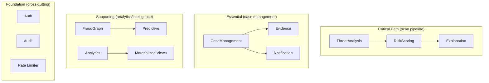

- **Critical path services**: ThreatAnalysis, RiskScoring — failure degrades scan quality
- **Essential services**: CaseManagement, Evidence, Notification — failure blocks case operations
- **Supporting services**: FraudGraph, Predictive, Analytics — failure degrades intelligence features
- **Foundation services**: Auth, Audit, Rate Limiter — failure blocks all operations (highest availability requirement)
