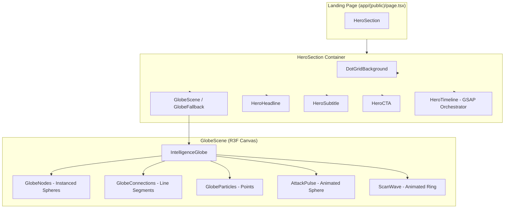
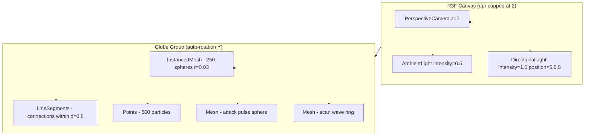
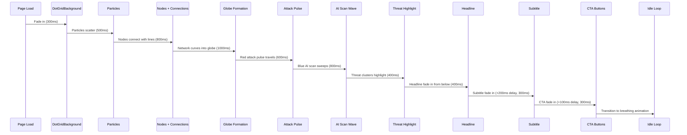
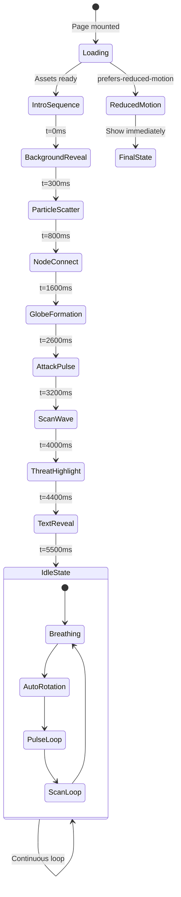

# Design Document: Hero Experience — CyberShield AI Landing Page

## Overview

The Hero Experience is the first visual and emotional touchpoint for visitors arriving at the CyberShield AI landing page. It occupies the full viewport (100vh) and communicates the platform's core value proposition — AI-powered cybercrime prevention — through an abstract 3D intelligence globe visualization, cinematic entrance animation timeline, and clear call-to-action hierarchy.

The visual language deliberately breaks from dark "hacker aesthetic" conventions. The hero uses a warm white background (#FAFAF9) with a subtle dot grid texture, soft gradients, and glassmorphism effects to convey trust, professionalism, and approachability. The 3D globe is an abstract network of nodes and connections that curves into a spherical shape — representing interconnected intelligence rather than a literal Earth model. Red threat nodes pulse with attack energy while a blue AI scan wave sweeps across the surface, visually demonstrating the platform's protective capability.

Performance and accessibility are first-class concerns: the globe is lazy-loaded, uses instanced rendering for 60fps performance, gracefully degrades to a static fallback on mobile/low-power devices, and respects prefers-reduced-motion preferences throughout.

## Architecture

### Component Hierarchy



### Three.js Scene Graph



### GSAP Timeline Sequence



### Animation State Machine



## Components and Interfaces

### Component 1: HeroSection

**Purpose**: Top-level container that arranges the hero layout — background, 3D globe, text overlay, and CTAs. Manages responsive breakpoint switching between globe and fallback.

**Interface**:
```typescript
interface HeroSectionProps {
  className?: string;
}

// Internal state
interface HeroState {
  isWebGLAvailable: boolean;
  isMobile: boolean;
  prefersReducedMotion: boolean;
  introComplete: boolean;
}
```

**Responsibilities**:
- Full viewport height container (100vh)
- Conditional rendering: GlobeScene vs GlobeFallback based on device capability
- Coordinates GSAP timeline trigger on mount
- Passes introComplete state to child components for staggered reveals

### Component 2: IntelligenceGlobe

**Purpose**: Core R3F component that renders the abstract 3D intelligence network globe. Manages auto-rotation, mouse parallax, and continuous idle animations.

**Interface**:
```typescript
interface IntelligenceGlobeProps {
  animationPhase: 'intro' | 'idle';
  introProgress: number; // 0-1, driven by GSAP
}

interface GlobeState {
  rotationY: number;
  breathScale: number;
  mouseOffset: { x: number; y: number };
}
```

**Responsibilities**:
- Groups all sub-components (nodes, connections, particles, effects)
- Auto-rotation at 0.1 rad/s on Y-axis
- Mouse parallax: camera offset up to 5° based on cursor position
- Breathing animation: scale oscillates 1.0 → 1.02 over 4s sinusoidal loop
- Performance monitoring: track frame time, reduce particles if > 20ms for 2s

### Component 3: GlobeNodes

**Purpose**: Renders 200-300 instanced sphere nodes positioned on a sphere surface. Handles node color differentiation (normal vs threat).

**Interface**:
```typescript
interface GlobeNodesProps {
  nodes: NodeData[];
  visible: boolean;
  formationProgress: number; // 0=scattered, 1=sphere
}

interface NodeData {
  id: string;
  position: [number, number, number]; // final sphere position
  scatteredPosition: [number, number, number]; // random initial position
  type: 'normal' | 'threat';
  opacity: number;
}
```

**Responsibilities**:
- InstancedMesh with single draw call for all 250 nodes
- Normal nodes: Electric Indigo (#4F46E5) at varying opacity (0.4-0.8)
- Threat nodes: Rose (#DC2626), 10-15 count
- Lerps between scattered and sphere positions during intro
- Node radius: 0.03 units, SphereGeometry(0.03, 8, 8)

### Component 4: GlobeConnections

**Purpose**: Renders line segments between nodes within a distance threshold, forming the network mesh.

**Interface**:
```typescript
interface GlobeConnectionsProps {
  nodes: NodeData[];
  maxDistance: number; // 0.8 units
  visible: boolean;
  connectionProgress: number; // 0=none, 1=all connected
}

interface ConnectionData {
  from: number; // node index
  to: number; // node index
  isThreatPath: boolean;
}
```

**Responsibilities**:
- Calculates connections between nodes within 0.8 distance threshold
- LineSegments geometry with BufferGeometry
- Material: MeshBasicMaterial, Electric Indigo, opacity 0.2
- Threat path connections (between threat nodes): slightly higher opacity 0.4
- Animated reveal during intro (connections draw in progressively)

### Component 5: GlobeParticles

**Purpose**: Ambient floating particle field around the globe for atmosphere and depth.

**Interface**:
```typescript
interface GlobeParticlesProps {
  count: number; // default 500, can reduce for performance
  visible: boolean;
}
```

**Responsibilities**:
- Points geometry with 500 randomly positioned particles in sphere volume (radius 4)
- PointsMaterial: size 0.02, Electric Indigo, opacity 0.3
- Slow random drift animation (Brownian motion, max velocity 0.001/frame)
- Reduces to 250 particles if performance degrades

### Component 6: AttackPulse

**Purpose**: A glowing red sphere that travels along a connection path between threat nodes, representing active cyber attacks.

**Interface**:
```typescript
interface AttackPulseProps {
  connections: ConnectionData[];
  threatNodes: NodeData[];
  active: boolean;
  loopInterval: number; // 3000ms
}

interface PulseState {
  currentPath: ConnectionData | null;
  progress: number; // 0-1 along path
  opacity: number;
}
```

**Responsibilities**:
- Selects a random threat-connected path every 3s
- Animates a small glowing sphere (radius 0.05) along the path
- Emissive material: Rose (#DC2626), emissiveIntensity 2.0
- Fades in at path start, fades out at path end
- One active pulse at a time

### Component 7: ScanWave

**Purpose**: A blue ring/plane that sweeps vertically across the globe, representing AI intelligence scanning.

**Interface**:
```typescript
interface ScanWaveProps {
  active: boolean;
  loopInterval: number; // 5000ms
}

interface ScanState {
  yPosition: number; // -3 to +3 (globe diameter)
  opacity: number;
}
```

**Responsibilities**:
- RingGeometry or TorusGeometry, radius matching globe at current Y slice
- Material: Electric Indigo (#4F46E5), opacity 0.3, emissive
- Sweeps from top (y=3) to bottom (y=-3) over 5s
- Nodes "light up" briefly as the wave passes them
- Smooth ease-in-out on sweep cycle

### Component 8: GlobeScene

**Purpose**: R3F Canvas wrapper that sets up camera, lighting, and performance configuration.

**Interface**:
```typescript
interface GlobeSceneProps {
  onReady: () => void;
  animationPhase: 'intro' | 'idle';
  introProgress: number;
}
```

**Responsibilities**:
- Canvas with dpr={[1, 2]} (capped at 2x device pixel ratio)
- PerspectiveCamera at position [0, 0, 7], fov 50
- AmbientLight intensity 0.5
- DirectionalLight intensity 1.0, position [5, 5, 5]
- Fog for depth (optional, soft fade at edges)
- Calls onReady when scene is initialized
- frameloop="demand" during intro (driven by GSAP), "always" during idle

### Component 9: HeroTimeline

**Purpose**: GSAP timeline orchestrator that sequences the entire hero intro animation, coordinating between Three.js globe phases and DOM element reveals.

**Interface**:
```typescript
interface HeroTimelineProps {
  containerRef: React.RefObject<HTMLDivElement>;
  onPhaseChange: (phase: TimelinePhase) => void;
  onComplete: () => void;
  disabled: boolean; // true when prefers-reduced-motion
}

type TimelinePhase = 
  | 'background'
  | 'particles'
  | 'connections'
  | 'formation'
  | 'attack'
  | 'scan'
  | 'threats'
  | 'headline'
  | 'subtitle'
  | 'cta'
  | 'idle';

interface TimelineConfig {
  phases: {
    background: { duration: 0.3; delay: 0 };
    particles: { duration: 0.5; delay: 0 };
    connections: { duration: 0.8; delay: 0 };
    formation: { duration: 1.0; delay: 0 };
    attack: { duration: 0.6; delay: 0 };
    scan: { duration: 0.8; delay: 0 };
    threats: { duration: 0.4; delay: 0 };
    headline: { duration: 0.4; delay: 0 };
    subtitle: { duration: 0.3; delay: 0.2 };
    cta: { duration: 0.3; delay: 0.1 };
  };
}
```

**Responsibilities**:
- Creates GSAP timeline on mount, kills on unmount
- Sequences phases in strict order with configured durations
- Communicates current phase to GlobeScene via onPhaseChange callback
- Handles prefers-reduced-motion: skips to final state immediately
- Total duration: ~5.5s from page load to idle state

### Component 10: HeroHeadline

**Purpose**: Renders the primary headline with Framer Motion entrance animation.

**Interface**:
```typescript
interface HeroHeadlineProps {
  visible: boolean;
  text?: string; // default: "Prevent Cybercrime Before It Happens."
}
```

**Responsibilities**:
- Renders as `<h1>` with proper semantic hierarchy
- Font: Inter 700, responsive size (48px mobile → 64px desktop)
- Color: slate-900 (dark text on white background)
- Framer Motion: opacity 0→1, translateY 20→0, duration 400ms, ease easeOut
- Triggers when `visible` becomes true (driven by timeline)

### Component 11: HeroSubtitle

**Purpose**: Renders the supporting description text with staggered Framer Motion entrance.

**Interface**:
```typescript
interface HeroSubtitleProps {
  visible: boolean;
  text?: string;
}
```

**Responsibilities**:
- Renders as `<p>` element
- Font: Inter 400, 18-20px, text-slate-600 (muted gray)
- Max width: 600px for readability
- Framer Motion: opacity 0→1, translateY 12→0, duration 300ms
- Staggered 200ms after headline (controlled by timeline)

### Component 12: HeroCTA

**Purpose**: Button group with glassmorphism styling and micro-interaction animations.

**Interface**:
```typescript
interface HeroCTAProps {
  visible: boolean;
  onPrimaryClick?: () => void;
  onSecondaryClick?: () => void;
}

interface CTAButtonConfig {
  label: string;
  variant: 'primary' | 'secondary';
  href?: string;
  onClick?: () => void;
}
```

**Responsibilities**:
- Primary button: "Launch Intelligence" — filled Electric Indigo (#4F46E5), white text
- Secondary button: "Explore Platform" — outlined, subtle border, transparent fill
- Both: rounded-xl (border-radius 12px), soft shadow
- Glassmorphism on primary: backdrop-blur-sm, slight white overlay
- Hover micro-interaction: translateY -2px + box-shadow increase (lift + glow)
- Framer Motion entrance: fade in 300ms, staggered 100ms after subtitle
- Keyboard accessible: proper focus rings, Enter/Space activation

### Component 13: DotGridBackground

**Purpose**: Renders the warm white background with subtle repeating dot pattern.

**Interface**:
```typescript
interface DotGridBackgroundProps {
  className?: string;
  dotSize?: number; // default 2px
  dotSpacing?: number; // default 24px
  dotOpacity?: number; // default 0.1
  fadeIn?: boolean;
}
```

**Responsibilities**:
- Base color: warm white (#FAFAF9)
- CSS radial-gradient for dot pattern (2px dots, 24px spacing, opacity 0.1)
- Optional soft radial gradient overlay (lighter center, slightly darker edges)
- Covers full container dimensions
- Fade in animation when fadeIn=true (first timeline phase)

### Component 14: GlobeFallback

**Purpose**: Static SVG/image shown when WebGL is unavailable, on mobile, or when reduced motion is preferred.

**Interface**:
```typescript
interface GlobeFallbackProps {
  className?: string;
}
```

**Responsibilities**:
- Static SVG illustration depicting the abstract globe concept
- Displays when: viewport < 768px OR WebGL unavailable OR prefers-reduced-motion
- Soft fade-in animation (CSS only)
- Maintains visual coherence with the 3D version (same color palette)
- aria-label for accessibility

## Data Models

### Globe Configuration

```typescript
interface GlobeConfig {
  // Geometry
  sphereRadius: 3;
  nodeCount: 250;
  threatNodeCount: 12;
  particleCount: 500;
  connectionMaxDistance: 0.8;
  
  // Node appearance
  nodeRadius: 0.03;
  nodeSegments: 8;
  normalNodeColor: '#4F46E5'; // Electric Indigo
  threatNodeColor: '#DC2626'; // Rose
  normalNodeOpacityRange: [0.4, 0.8];
  threatNodeOpacity: 0.9;
  
  // Connections
  connectionColor: '#4F46E5';
  connectionOpacity: 0.2;
  threatConnectionOpacity: 0.4;
  
  // Particles
  particleSize: 0.02;
  particleColor: '#4F46E5';
  particleOpacity: 0.3;
  particleSpreadRadius: 4;
  
  // Animation
  rotationSpeed: 0.1; // rad/s
  breathMin: 1.0;
  breathMax: 1.02;
  breathDuration: 4; // seconds
  attackPulseInterval: 3; // seconds
  scanWaveInterval: 5; // seconds
  mouseParallaxMax: 5; // degrees
  
  // Camera
  cameraPosition: [0, 0, 7];
  cameraFov: 50;
  
  // Performance
  maxDpr: 2;
  frameTimeBudget: 16; // ms (60fps)
  degradeThreshold: 20; // ms
  degradeDuration: 2; // seconds before downgrade
  reducedParticleCount: 250;
}
```

### Animation Timeline Configuration

```typescript
interface TimelinePhaseDef {
  id: TimelinePhase;
  duration: number; // seconds
  delay: number; // seconds relative to previous phase end
  easing: string; // GSAP easing string
}

const HERO_TIMELINE: TimelinePhaseDef[] = [
  { id: 'background', duration: 0.3, delay: 0, easing: 'power2.out' },
  { id: 'particles', duration: 0.5, delay: 0, easing: 'power2.out' },
  { id: 'connections', duration: 0.8, delay: 0, easing: 'power3.inOut' },
  { id: 'formation', duration: 1.0, delay: 0, easing: 'power3.inOut' },
  { id: 'attack', duration: 0.6, delay: 0, easing: 'power2.in' },
  { id: 'scan', duration: 0.8, delay: 0, easing: 'linear' },
  { id: 'threats', duration: 0.4, delay: 0, easing: 'power2.out' },
  { id: 'headline', duration: 0.4, delay: 0, easing: 'power2.out' },
  { id: 'subtitle', duration: 0.3, delay: 0.2, easing: 'power2.out' },
  { id: 'cta', duration: 0.3, delay: 0.1, easing: 'power2.out' },
];
```

### Node Generation

```typescript
interface SpherePointGenerator {
  // Fibonacci sphere distribution for even node placement
  generatePositions(count: number, radius: number): Vector3[];
  // Random scattered positions for intro state
  generateScatteredPositions(count: number, spread: number): Vector3[];
  // Assign threat nodes (random selection)
  assignThreatNodes(count: number, threatCount: number): boolean[];
}
```

## Algorithmic Pseudocode

### Globe Node Distribution (Fibonacci Sphere)

```typescript
function generateFibonacciSphere(count: number, radius: number): Vector3[] {
  const positions: Vector3[] = [];
  const goldenAngle = Math.PI * (3 - Math.sqrt(5)); // ~2.3999 radians

  for (let i = 0; i < count; i++) {
    // y goes from 1 to -1 (top to bottom)
    const y = 1 - (i / (count - 1)) * 2;
    // radius at current y level
    const radiusAtY = Math.sqrt(1 - y * y);
    // angle increases by golden angle each step
    const theta = goldenAngle * i;

    const x = Math.cos(theta) * radiusAtY;
    const z = Math.sin(theta) * radiusAtY;

    positions.push(new Vector3(x * radius, y * radius, z * radius));
  }
  return positions;
}
```

**Preconditions:**
- `count` ≥ 1 (at least one node)
- `radius` > 0

**Postconditions:**
- Returns exactly `count` positions
- All positions lie on sphere surface: |position| === radius (within float tolerance)
- Points are approximately evenly distributed (no clustering)

**Loop Invariants:**
- At iteration i, exactly i positions have been generated
- Each position satisfies x² + y² + z² ≈ radius²

### Connection Generation Algorithm

```typescript
function generateConnections(
  nodes: Vector3[],
  maxDistance: number
): ConnectionData[] {
  const connections: ConnectionData[] = [];

  for (let i = 0; i < nodes.length; i++) {
    for (let j = i + 1; j < nodes.length; j++) {
      const distance = nodes[i].distanceTo(nodes[j]);
      if (distance <= maxDistance) {
        connections.push({ from: i, to: j, isThreatPath: false });
      }
    }
  }
  return connections;
}
```

**Preconditions:**
- `nodes` array is non-empty
- `maxDistance` > 0
- All node positions are finite numbers

**Postconditions:**
- No duplicate connections (i < j ensures uniqueness)
- All connections satisfy: distance(nodes[from], nodes[to]) ≤ maxDistance
- Connection count is O(n²) worst case but bounded by spatial distribution

**Loop Invariants:**
- No connection (i, j) where i ≥ j exists
- All stored connections have verified distance ≤ maxDistance

### Attack Pulse Path Selection

```typescript
function selectAttackPath(
  connections: ConnectionData[],
  threatIndices: Set<number>
): ConnectionData | null {
  // Filter connections that touch at least one threat node
  const threatPaths = connections.filter(
    c => threatIndices.has(c.from) || threatIndices.has(c.to)
  );

  if (threatPaths.length === 0) return null;

  // Random selection with uniform distribution
  const index = Math.floor(Math.random() * threatPaths.length);
  return threatPaths[index];
}
```

**Preconditions:**
- `connections` array may be empty
- `threatIndices` contains valid node indices

**Postconditions:**
- Returns null if no threat-connected paths exist
- If non-null, returned connection involves at least one threat node
- Selection is uniformly random among valid paths

### Mouse Parallax Calculation

```typescript
function calculateParallaxOffset(
  mouseX: number, // normalized -1 to 1
  mouseY: number, // normalized -1 to 1
  maxAngleDeg: number // max rotation degrees
): { rotX: number; rotY: number } {
  const maxAngleRad = (maxAngleDeg * Math.PI) / 180;
  
  return {
    rotX: -mouseY * maxAngleRad, // invert Y for natural feel
    rotY: mouseX * maxAngleRad,
  };
}
```

**Preconditions:**
- mouseX and mouseY are in range [-1, 1]
- maxAngleDeg > 0

**Postconditions:**
- |rotX| ≤ maxAngleRad
- |rotY| ≤ maxAngleRad
- Mapping is linear and continuous

### Performance Degradation Logic

```typescript
function checkPerformance(
  frameTimes: number[], // recent frame times in ms
  threshold: number, // 20ms
  windowSize: number, // frames in 2 seconds at 60fps = 120
  currentParticleCount: number,
  reducedCount: number
): number {
  const recentFrames = frameTimes.slice(-windowSize);
  const avgFrameTime = recentFrames.reduce((a, b) => a + b, 0) / recentFrames.length;

  if (avgFrameTime > threshold && currentParticleCount > reducedCount) {
    return reducedCount; // degrade
  }
  return currentParticleCount; // maintain
}
```

**Preconditions:**
- `frameTimes` has at least `windowSize` entries for meaningful average
- `threshold` > 0
- `reducedCount` < `currentParticleCount`

**Postconditions:**
- Returns `reducedCount` only if average frame time exceeds threshold
- Never returns a value greater than `currentParticleCount`
- Degradation is one-way (no automatic recovery to prevent oscillation)

### Breathing Animation

```typescript
function calculateBreathScale(
  time: number, // elapsed time in seconds
  min: number, // 1.0
  max: number, // 1.02
  duration: number // 4 seconds per cycle
): number {
  const phase = (time % duration) / duration; // 0 to 1
  const sine = Math.sin(phase * Math.PI * 2); // -1 to 1
  const normalized = (sine + 1) / 2; // 0 to 1
  return min + normalized * (max - min);
}
```

**Preconditions:**
- `min` < `max`
- `duration` > 0
- `time` ≥ 0

**Postconditions:**
- Return value is always in range [min, max]
- Function is periodic with period `duration`
- Function is continuous and smooth (sinusoidal)

## Key Functions with Formal Specifications

### useGlobeAnimation Hook

```typescript
function useGlobeAnimation(config: GlobeConfig): {
  nodes: NodeData[];
  connections: ConnectionData[];
  phase: 'intro' | 'idle';
  introProgress: number;
  particleCount: number;
  breathScale: number;
  pulseState: PulseState;
  scanY: number;
}
```

**Preconditions:**
- Config object is fully populated with valid values
- Component is mounted within R3F Canvas context

**Postconditions:**
- `nodes` array has exactly `config.nodeCount` entries
- `connections` array contains only valid node index pairs
- `introProgress` is in range [0, 1]
- `breathScale` is in range [config.breathMin, config.breathMax]
- `scanY` is in range [-config.sphereRadius, config.sphereRadius]
- `particleCount` is either config.particleCount or config.reducedParticleCount

### useHeroTimeline Hook

```typescript
function useHeroTimeline(
  containerRef: React.RefObject<HTMLDivElement>,
  options: { disabled: boolean; onPhaseChange: (phase: TimelinePhase) => void; onComplete: () => void }
): {
  timeline: gsap.core.Timeline | null;
  currentPhase: TimelinePhase;
  isComplete: boolean;
}
```

**Preconditions:**
- containerRef points to a mounted DOM element
- GSAP is loaded and available

**Postconditions:**
- If disabled=true, timeline is null and all elements are in final visible state
- If disabled=false, timeline plays through all phases in order
- onPhaseChange is called exactly once per phase transition
- onComplete is called exactly once when timeline finishes
- Timeline is killed on component unmount (no memory leaks)

### useWebGLDetection Hook

```typescript
function useWebGLDetection(): {
  isWebGLAvailable: boolean;
  isLoading: boolean;
}
```

**Preconditions:**
- Called within a client component (useEffect available)

**Postconditions:**
- `isLoading` is true initially, then false after detection
- `isWebGLAvailable` is true if WebGL2 or WebGL1 context can be created
- Detection runs only once on mount

### useMouseParallax Hook

```typescript
function useMouseParallax(maxAngleDeg: number): {
  rotX: number;
  rotY: number;
}
```

**Preconditions:**
- `maxAngleDeg` > 0
- Called within a client component

**Postconditions:**
- rotX and rotY are in range [-maxAngleRad, maxAngleRad]
- Values update smoothly (lerped, not snapped) on mouse move
- Values reset to (0, 0) when mouse leaves viewport
- Uses requestAnimationFrame for smooth interpolation

## Example Usage

```typescript
// === Landing Page (app/(public)/page.tsx) ===
import { HeroSection } from '@/features/landing';

export default function LandingPage() {
  return (
    <main>
      <HeroSection />
      {/* Additional sections below the fold */}
    </main>
  );
}

// === HeroSection Usage ===
import dynamic from 'next/dynamic';
import { useReducedMotion } from '@/hooks/useReducedMotion';
import { useWebGLDetection } from '@/hooks/useWebGLDetection';
import { useMediaQuery } from '@/hooks/useMediaQuery';
import { DotGridBackground } from './DotGridBackground';
import { HeroHeadline } from './HeroHeadline';
import { HeroSubtitle } from './HeroSubtitle';
import { HeroCTA } from './HeroCTA';
import { GlobeFallback } from './GlobeFallback';
import { HeroTimeline } from '@/components/animations/HeroTimeline';

const GlobeScene = dynamic(
  () => import('@/components/three/GlobeScene').then(m => m.GlobeScene),
  { ssr: false, loading: () => <GlobeFallback /> }
);

export function HeroSection() {
  const containerRef = useRef<HTMLDivElement>(null);
  const { isWebGLAvailable } = useWebGLDetection();
  const isMobile = useMediaQuery('(max-width: 767px)');
  const prefersReducedMotion = useReducedMotion();
  const [phase, setPhase] = useState<TimelinePhase>('background');
  const [introComplete, setIntroComplete] = useState(prefersReducedMotion);

  const showGlobe = isWebGLAvailable && !isMobile && !prefersReducedMotion;

  return (
    <section ref={containerRef} className="relative h-screen w-full overflow-hidden">
      <DotGridBackground fadeIn={!prefersReducedMotion} />
      
      <div className="absolute inset-0 flex items-center justify-center">
        {showGlobe ? (
          <GlobeScene
            animationPhase={introComplete ? 'idle' : 'intro'}
            introProgress={/* driven by timeline */}
            onReady={() => {}}
          />
        ) : (
          <GlobeFallback />
        )}
      </div>

      <div className="relative z-10 flex flex-col items-center justify-center h-full text-center px-4">
        <HeroHeadline visible={phase >= 'headline' || prefersReducedMotion} />
        <HeroSubtitle visible={phase >= 'subtitle' || prefersReducedMotion} />
        <HeroCTA visible={phase >= 'cta' || prefersReducedMotion} />
      </div>

      <HeroTimeline
        containerRef={containerRef}
        onPhaseChange={setPhase}
        onComplete={() => setIntroComplete(true)}
        disabled={prefersReducedMotion}
      />
    </section>
  );
}
```

```typescript
// === Globe Configuration (lib/globe-config.ts) ===
import { GlobeConfig } from '@/types/globe';

export const GLOBE_CONFIG: GlobeConfig = {
  sphereRadius: 3,
  nodeCount: 250,
  threatNodeCount: 12,
  particleCount: 500,
  connectionMaxDistance: 0.8,
  nodeRadius: 0.03,
  nodeSegments: 8,
  normalNodeColor: '#4F46E5',
  threatNodeColor: '#DC2626',
  normalNodeOpacityRange: [0.4, 0.8],
  threatNodeOpacity: 0.9,
  connectionColor: '#4F46E5',
  connectionOpacity: 0.2,
  threatConnectionOpacity: 0.4,
  particleSize: 0.02,
  particleColor: '#4F46E5',
  particleOpacity: 0.3,
  particleSpreadRadius: 4,
  rotationSpeed: 0.1,
  breathMin: 1.0,
  breathMax: 1.02,
  breathDuration: 4,
  attackPulseInterval: 3,
  scanWaveInterval: 5,
  mouseParallaxMax: 5,
  cameraPosition: [0, 0, 7],
  cameraFov: 50,
  maxDpr: 2,
  frameTimeBudget: 16,
  degradeThreshold: 20,
  degradeDuration: 2,
  reducedParticleCount: 250,
};

// === useGlobeAnimation Hook (hooks/useGlobeAnimation.ts) ===
import { useFrame } from '@react-three/fiber';
import { useRef, useMemo } from 'react';
import { GLOBE_CONFIG } from '@/lib/globe-config';

export function useGlobeAnimation(config = GLOBE_CONFIG) {
  const timeRef = useRef(0);
  const frameTimesRef = useRef<number[]>([]);
  const [particleCount, setParticleCount] = useState(config.particleCount);

  const nodes = useMemo(() => generateFibonacciSphere(config.nodeCount, config.sphereRadius), []);
  const connections = useMemo(() => generateConnections(nodes, config.connectionMaxDistance), [nodes]);

  useFrame((state, delta) => {
    timeRef.current += delta;
    
    // Track frame time for performance
    frameTimesRef.current.push(delta * 1000);
    if (frameTimesRef.current.length > 120) {
      frameTimesRef.current.shift();
    }

    // Check performance degradation
    const newCount = checkPerformance(
      frameTimesRef.current,
      config.degradeThreshold,
      120,
      particleCount,
      config.reducedParticleCount
    );
    if (newCount !== particleCount) setParticleCount(newCount);
  });

  const breathScale = calculateBreathScale(
    timeRef.current, config.breathMin, config.breathMax, config.breathDuration
  );

  return { nodes, connections, particleCount, breathScale };
}
```

## Correctness Properties

The following properties must hold for any valid hero experience implementation:

### Property 1: Node Distribution Uniformity
∀ node ∈ globeNodes: |node.position| === config.sphereRadius ± 0.001

All nodes in their final (post-formation) positions must lie on the sphere surface within floating-point tolerance.

### Property 2: Connection Distance Bound
∀ connection ∈ connections: distance(nodes[connection.from], nodes[connection.to]) ≤ config.connectionMaxDistance

No connection may exist between nodes further apart than the configured maximum distance.

### Property 3: Connection Uniqueness
∀ (i, j) ∈ connections: i < j AND ¬∃ duplicate (i, j)

Each node pair has at most one connection, and connections are stored in canonical order.

### Property 4: Breathing Animation Bounds
∀ t ≥ 0: config.breathMin ≤ calculateBreathScale(t) ≤ config.breathMax

The breathing scale must never exceed the configured bounds regardless of elapsed time.

### Property 5: Parallax Angle Constraint
∀ mouseX ∈ [-1, 1], mouseY ∈ [-1, 1]: 
  |parallaxRotX| ≤ maxAngleRad AND |parallaxRotY| ≤ maxAngleRad

Mouse parallax must never rotate the camera beyond the configured maximum angle (5 degrees).

### Property 6: Timeline Phase Ordering
∀ transitions: phaseOrder.indexOf(currentPhase) ≤ phaseOrder.indexOf(nextPhase)

The GSAP timeline must progress through phases in strict sequential order. No phase can be skipped or revisited during the intro sequence.

### Property 7: Performance Degradation Monotonicity
∀ degradation events: newParticleCount ≤ currentParticleCount

Performance degradation is one-directional. Particle count can only decrease (never automatically increase) to prevent oscillation between quality levels.

### Property 8: Threat Node Count Invariant
∀ renders: count(nodes where type === 'threat') === config.threatNodeCount

The number of threat nodes must exactly match configuration. Threat assignment happens once at initialization and never changes.

### Property 9: Attack Pulse Validity
∀ activePulse: (threatIndices.has(pulse.path.from) OR threatIndices.has(pulse.path.to))

An attack pulse can only travel along a connection that involves at least one threat node.

### Property 10: Accessibility Completeness
∀ states (mobile, no-webgl, reduced-motion): 
  headline.visible AND subtitle.visible AND cta.interactive

Regardless of device capability or motion preferences, all text content and interactive elements must be visible and functional. Only the 3D globe visualization is optional.

### Property 11: Reduced Motion Compliance
WHEN prefers-reduced-motion === true:
  timeline.duration === 0 AND all elements at final state AND globe === static/hidden

When the user prefers reduced motion, no animations play. All content is shown in its final state immediately.

### Property 12: Frame Budget Compliance
∀ frames during idle: frameTime < config.frameTimeBudget (16ms) 
  OR degradation has been triggered

The system must either maintain 60fps or trigger performance degradation. It must not remain in a degraded state without taking action.

## Error Handling

### Error Scenario 1: WebGL Context Creation Failure

**Condition**: Browser does not support WebGL or GPU is blacklisted
**Response**: useWebGLDetection returns isWebGLAvailable=false
**Recovery**: HeroSection renders GlobeFallback (static SVG) instead of GlobeScene. No error thrown to user.

### Error Scenario 2: R3F Canvas Crash (Runtime Error)

**Condition**: Three.js throws during rendering (shader compilation, buffer overflow)
**Response**: React Error Boundary catches the error at GlobeScene level
**Recovery**: Error boundary renders GlobeFallback. Logs error to monitoring. Hero section continues functioning with text content.

### Error Scenario 3: GSAP Timeline Failure

**Condition**: GSAP fails to initialize or timeline errors during playback
**Response**: onError callback triggers fallback behavior
**Recovery**: All animated elements forced to their final visible state (opacity: 1, transform: none). User sees static hero without animation.

### Error Scenario 4: Dynamic Import Failure (Network)

**Condition**: GlobeScene chunk fails to load (network timeout, CDN error)
**Response**: Next.js dynamic() loading component renders GlobeFallback
**Recovery**: User sees fallback immediately. Optionally retry load once after 5s.

### Error Scenario 5: Performance Degradation Spiral

**Condition**: Frame time exceeds threshold even after particle reduction
**Response**: If still degraded after 5s at reduced particles, hide canvas entirely
**Recovery**: Replace with GlobeFallback. Log performance issue for analytics.

## Testing Strategy

### Unit Testing Approach

- Test `generateFibonacciSphere`: verify node count, sphere surface constraint, distribution uniformity
- Test `generateConnections`: verify distance threshold, uniqueness, index bounds
- Test `selectAttackPath`: verify threat node involvement, null case, uniform distribution
- Test `calculateBreathScale`: verify bounds, periodicity, continuity
- Test `calculateParallaxOffset`: verify angle bounds, zero-crossing, linearity
- Test `checkPerformance`: verify threshold logic, monotonicity, window sizing
- Test `HERO_TIMELINE` config: verify phase ordering, total duration, no negative delays

### Property-Based Testing Approach

**Property Test Library**: fast-check

- Property: Fibonacci sphere positions all lie on sphere surface (within tolerance)
- Property: Connection generation produces no connections exceeding maxDistance
- Property: Breathing animation output always within [min, max] for arbitrary time values
- Property: Parallax offset always within [-maxAngle, maxAngle] for any mouse position
- Property: Performance check never increases particle count
- Property: Timeline phases maintain strict ordering for any configuration

### Integration Testing Approach

- Mount HeroSection with mocked WebGL: verify GlobeScene renders
- Mount HeroSection without WebGL: verify GlobeFallback renders
- Mount HeroSection with prefers-reduced-motion: verify immediate final state
- Mount HeroSection on mobile viewport: verify fallback renders
- Verify GSAP timeline plays through all phases and calls onComplete
- Verify R3F canvas initializes with correct camera/light configuration
- Verify dynamic import lazy-loads GlobeScene chunk

## Performance Considerations

### Bundle Size Strategy
- GlobeScene loaded via `next/dynamic` with `ssr: false` — excluded from initial JS bundle
- Three.js tree-shaking: import only used modules (not the entire library)
- Estimated chunk sizes: Three.js core (~150KB gzip), R3F (~30KB gzip), Globe code (~15KB gzip)
- Total hero-specific JS: ~195KB gzip, loaded after initial paint

### Rendering Performance
- InstancedMesh for all 250 nodes: 1 draw call instead of 250
- Points geometry for particles: 1 draw call for 500 particles
- BufferGeometry for connections: 1 draw call for all line segments
- Total draw calls: ~5-6 (canvas, nodes, connections, particles, pulse, wave)
- Triangle budget: ~50K max (nodes: 250×128=32K, pulse: 512, wave: 256, particles: 0)
- Device pixel ratio capped at 2 (prevents 3x rendering on high-DPI mobile)

### Performance Monitoring
- Track frame times via useFrame delta
- Rolling window of 120 frames (2s at 60fps)
- If average > 20ms: reduce particle count from 500 to 250
- If still degraded after 5s: hide canvas, show fallback
- No automatic quality recovery (prevents oscillation)

### Initial Load Optimization
- Critical CSS (background, text) inlined in SSR
- Globe chunk prefetched with `<link rel="prefetch">`
- GSAP loaded asynchronously (not blocking render)
- Fallback shown during globe load (no layout shift)
- LCP target: headline text visible within 1.5s

## Security Considerations

- No user input processed in hero section (no injection vectors)
- External resources: none (all assets self-hosted)
- Canvas element: sandboxed, no cross-origin data access
- Dynamic import paths are static strings (no user-controlled paths)
- GSAP/Three.js loaded from npm packages, version-pinned

## Dependencies

### Runtime Dependencies
| Package | Purpose | Version |
|---------|---------|---------|
| three | 3D rendering engine | ^0.162.0 |
| @react-three/fiber | React renderer for Three.js | ^8.15.0 |
| @react-three/drei | R3F helpers and abstractions | ^9.96.0 |
| gsap | Animation timeline engine | ^3.12.0 |
| framer-motion | React animation library | ^11.0.0 |

### Development Dependencies
| Package | Purpose | Version |
|---------|---------|---------|
| @types/three | TypeScript types for Three.js | ^0.162.0 |
| fast-check | Property-based testing | ^3.15.0 |
| @testing-library/react | Component testing | ^14.0.0 |

### Internal Dependencies
| Module | Purpose |
|--------|---------|
| @/lib/globe-config | Globe configuration constants |
| @/hooks/useReducedMotion | Detect prefers-reduced-motion |
| @/hooks/useMediaQuery | Responsive breakpoint detection |
| @/hooks/useGlobeAnimation | Globe state and animation management |

## File Structure

```
src/
├── app/
│   └── (public)/
│       └── page.tsx                  # Landing page (renders HeroSection)
├── components/
│   ├── three/
│   │   ├── IntelligenceGlobe.tsx    # R3F globe component (groups sub-components)
│   │   ├── GlobeNodes.tsx           # InstancedMesh sphere nodes
│   │   ├── GlobeConnections.tsx     # LineSegments connections
│   │   ├── GlobeParticles.tsx       # Points ambient particles
│   │   ├── AttackPulse.tsx          # Animated red pulse mesh
│   │   ├── ScanWave.tsx             # Animated blue scan ring
│   │   └── GlobeScene.tsx           # Canvas + camera + lights wrapper
│   └── animations/
│       └── HeroTimeline.tsx         # GSAP timeline orchestrator
├── features/
│   └── landing/
│       ├── components/
│       │   ├── HeroSection.tsx      # Main hero container (100vh)
│       │   ├── HeroHeadline.tsx     # Animated h1 headline
│       │   ├── HeroSubtitle.tsx     # Animated subtitle paragraph
│       │   ├── HeroCTA.tsx          # Button group with glassmorphism
│       │   ├── DotGridBackground.tsx # Dot grid pattern background
│       │   └── GlobeFallback.tsx    # Static SVG fallback
│       └── index.ts                 # Barrel export
├── hooks/
│   ├── useGlobeAnimation.ts        # Globe state/animation management
│   ├── useMouseParallax.ts         # Mouse-based camera offset
│   ├── useWebGLDetection.ts        # WebGL availability check
│   └── useReducedMotion.ts         # prefers-reduced-motion detection
├── lib/
│   └── globe-config.ts             # Globe constants and configuration
└── types/
    └── globe.ts                     # Globe-related TypeScript interfaces
```
