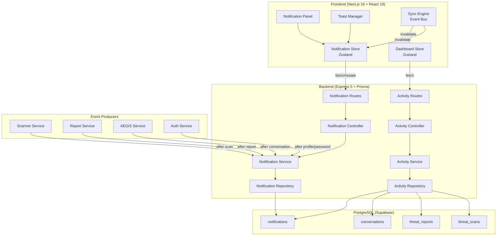
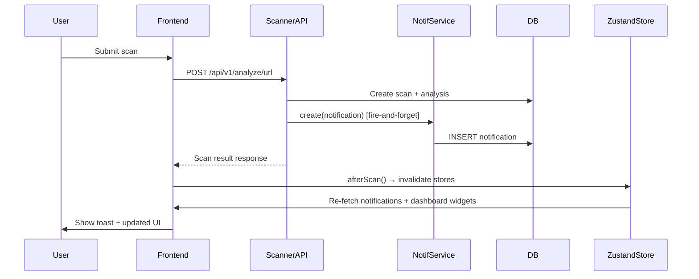

# Design Document: Real-Time Activity & Notifications

## Overview

This design covers the backend notification module, activity timeline aggregation, real-time dashboard synchronization, and frontend notification panel/toast system for CyberShield AI. The system auto-generates notifications on scan completion, report submission, AEGIS conversations, and profile changes. It exposes a full CRUD API, an aggregated activity timeline, and uses a Zustand-based event bus for real-time UI sync without React Query.

**Key design decisions:**
- **No WebSocket/SSE** — given the app's request-response nature and single-user dashboard, real-time sync is achieved via Zustand event-driven invalidation triggered after mutations, with optional background polling as a fallback.
- **Reuse existing Notification model** — extend with an optional `metadata` JSON column for structured activity context.
- **Notification creation is fire-and-forget** — failures in notification creation never block the parent operation (scan, report).
- **Activity timeline is a read-time aggregation** — no separate activity table; the timeline queries scans, reports, conversations, and notifications.

## Architecture

### High-Level System Architecture



### Backend Module Structure

```
src/modules/notifications/
├── index.ts                  # barrel export
├── notification.controller.ts
├── notification.service.ts
├── notification.repository.ts
├── notification.routes.ts
├── notification.validator.ts
└── notification.types.ts

src/modules/activity/
├── index.ts
├── activity.controller.ts
├── activity.service.ts
├── activity.repository.ts
├── activity.routes.ts
└── activity.validator.ts
```

### Frontend Module Structure

```
src/store/notifications.ts        # Enhanced Zustand store (server-backed)
src/store/dashboard.ts            # Dashboard sync store
src/store/toast.ts                # Toast queue store
src/services/api/notifications.ts # Notification API client
src/services/api/activity.ts      # Activity API client
src/components/notifications/
├── NotificationPanel.tsx         # Slide-out panel
├── NotificationItem.tsx          # Single notification row
├── NotificationBadge.tsx         # Bell icon + count badge
└── NotificationSkeleton.tsx      # Loading placeholder
src/components/toast/
├── ToastContainer.tsx            # Manages toast stack
└── ToastItem.tsx                 # Individual toast
src/hooks/useDashboardSync.ts     # Mutation → invalidation hook
```

## Components and Interfaces

### Backend: Notification Service

```typescript
// notification.service.ts
interface CreateNotificationInput {
  userId: string;
  type: NotificationType;
  title: string;
  message: string;
  severity: NotificationSeverity;
  actionUrl?: string;
  relatedId?: string;
  metadata?: Record<string, unknown>;
}

interface NotificationListParams {
  userId: string;
  page: number;
  limit: number;
}

interface NotificationListResult {
  items: NotificationDTO[];
  total: number;
  page: number;
  limit: number;
}

interface NotificationDTO {
  id: string;
  type: string;
  title: string;
  message: string;
  severity: string;
  isRead: boolean;
  actionUrl: string | null;
  relatedId: string | null;
  metadata: Record<string, unknown> | null;
  createdAt: string;
  readAt: string | null;
}

export const notificationService = {
  create(input: CreateNotificationInput): Promise<NotificationDTO>;
  list(params: NotificationListParams): Promise<NotificationListResult>;
  markAsRead(id: string, userId: string): Promise<NotificationDTO>;
  markAllAsRead(userId: string): Promise<{ count: number }>;
  delete(id: string, userId: string): Promise<void>;
  getUnreadCount(userId: string): Promise<number>;
};
```

### Backend: Activity Service

```typescript
// activity.service.ts
type ActivityType = "scan" | "report" | "conversation" | "profile";

interface ActivityEntry {
  id: string;
  type: ActivityType;
  label: string;
  description: string;
  severity: string;
  timestamp: string;
  actionUrl?: string;
  relatedId?: string;
}

interface ActivityListParams {
  userId: string;
  page: number;
  limit: number;
  type?: ActivityType;
}

interface ActivityListResult {
  items: ActivityEntry[];
  total: number;
  page: number;
  limit: number;
}

export const activityService = {
  getTimeline(params: ActivityListParams): Promise<ActivityListResult>;
};
```

### Backend: Notification Event Emitter (Integration Pattern)

Rather than tightly coupling producers to the notification service, producers call `notificationService.create()` directly after their primary operation succeeds. This is simple, explicit, and avoids event bus complexity for a single-backend system.

```typescript
// In scanner.service.ts (after scan completes):
import { notificationService } from "../notifications/notification.service.js";

// Fire-and-forget: wrap in try-catch, never block the scan response
try {
  await notificationService.create({
    userId: input.userId,
    type: riskLevel === "HIGH" || riskLevel === "CRITICAL" ? "THREAT_ALERT" : "SCAN_COMPLETE",
    title: `${input.scanType} Scan Complete`,
    message: `Risk: ${riskLevel} (score: ${riskScore})`,
    severity: riskLevel === "HIGH" || riskLevel === "CRITICAL" ? "CRITICAL" : "INFO",
    actionUrl: `/dashboard/scan/${scan.id}`,
    relatedId: scan.id,
  });
} catch { /* logged internally, never blocks parent */ }
```

### Frontend: Enhanced Notification Store (Zustand)

```typescript
// store/notifications.ts — server-backed version
interface ServerNotification {
  id: string;
  type: string;
  title: string;
  message: string;
  severity: string;
  isRead: boolean;
  actionUrl: string | null;
  createdAt: string;
  readAt: string | null;
}

interface NotificationState {
  notifications: ServerNotification[];
  unreadCount: number;
  isLoading: boolean;
  error: string | null;
  page: number;
  hasMore: boolean;

  // Actions
  fetchNotifications: (reset?: boolean) => Promise<void>;
  loadMore: () => Promise<void>;
  markAsRead: (id: string) => Promise<void>;
  markAllAsRead: () => Promise<void>;
  deleteNotification: (id: string) => Promise<void>;
  invalidate: () => void; // triggers re-fetch
}
```

### Frontend: Toast Store (Zustand)

```typescript
// store/toast.ts
interface Toast {
  id: string;
  type: "success" | "error" | "warning" | "info";
  title: string;
  message?: string;
  duration?: number; // default 5000ms
}

interface ToastState {
  toasts: Toast[];
  addToast: (toast: Omit<Toast, "id">) => void;
  removeToast: (id: string) => void;
}
```

### Frontend: Dashboard Sync Hook

```typescript
// hooks/useDashboardSync.ts
// Called after any mutation completes — invalidates relevant stores
function useDashboardSync() {
  const invalidateNotifications = useNotificationStore((s) => s.invalidate);
  const invalidateDashboard = useDashboardStore((s) => s.invalidate);
  const addToast = useToastStore((s) => s.addToast);

  return {
    afterScan: (result: ScanResult) => {
      invalidateNotifications();
      invalidateDashboard(["threatStatus", "recentActivity", "timeline", "securityScore", "recentAnalysis", "notifications"]);
      addToast({ type: result.riskLevel === "high" ? "warning" : "success", title: "Scan Complete", message: result.summary });
    },
    afterReport: () => {
      invalidateNotifications();
      invalidateDashboard(["recentActivity", "notifications"]);
      addToast({ type: "success", title: "Report Submitted" });
    },
    afterConversation: () => {
      invalidateNotifications();
      invalidateDashboard(["recentActivity", "notifications"]);
      addToast({ type: "info", title: "Conversation Started" });
    },
    afterProfileUpdate: () => {
      invalidateNotifications();
      addToast({ type: "success", title: "Profile Updated" });
    },
  };
}
```

## Data Models

### Prisma Schema Extension

The existing `Notification` model is preserved. A single optional `metadata` JSON column is added:

```prisma
model Notification {
  id        String               @id @default(uuid())
  userId    String
  type      NotificationType
  title     String
  message   String
  severity  NotificationSeverity @default(INFO)
  isRead    Boolean              @default(false)
  actionUrl String?
  relatedId String?
  metadata  Json?                // NEW — optional structured context
  createdAt DateTime             @default(now())
  readAt    DateTime?

  user User @relation(fields: [userId], references: [id], onDelete: Cascade)

  @@index([userId, isRead, createdAt(sort: Desc)])
  @@map("notifications")
}
```

The `metadata` field stores optional context such as:
- `{ scanType: "URL", riskScore: 85 }` for scan notifications
- `{ reportNumber: "RPT-001" }` for report notifications
- `{ conversationTitle: "Phishing Help" }` for AEGIS notifications
- `{ changedFields: ["name", "phone"] }` for profile change notifications

### Activity Timeline Aggregation Query

The activity timeline does not have its own table. It aggregates across existing tables at query time:

```sql
-- Pseudo-query (implemented via Prisma)
SELECT id, 'scan' as type, scan_type || ' Scan' as label, created_at
FROM threat_scans WHERE user_id = $1
UNION ALL
SELECT id, 'report' as type, 'Report #' || report_number as label, created_at
FROM threat_reports WHERE user_id = $1
UNION ALL
SELECT id, 'conversation' as type, 'AEGIS: ' || title as label, created_at
FROM conversations WHERE user_id = $1
ORDER BY created_at DESC
LIMIT $2 OFFSET $3
```

In Prisma, this is implemented as parallel queries merged and sorted in application code.

### API Endpoint Designs

| Method | Endpoint | Auth | Description |
|--------|----------|------|-------------|
| GET | `/api/v1/notifications` | JWT | List user's notifications (paginated) |
| PATCH | `/api/v1/notifications/:id/read` | JWT | Mark single notification as read |
| PATCH | `/api/v1/notifications/read-all` | JWT | Mark all notifications as read |
| DELETE | `/api/v1/notifications/:id` | JWT | Delete a notification |
| GET | `/api/v1/activity` | JWT | Activity timeline (paginated, filterable) |

#### GET /api/v1/notifications

**Query Parameters:**
```typescript
{
  page?: number;   // default 1
  limit?: number;  // default 20, max 50
}
```

**Response (200):**
```json
{
  "success": true,
  "data": {
    "items": [
      {
        "id": "uuid",
        "type": "threat_alert",
        "title": "URL Scan Complete",
        "message": "Risk: CRITICAL (score: 92)",
        "severity": "critical",
        "isRead": false,
        "actionUrl": "/dashboard/scan/uuid",
        "relatedId": "scan-uuid",
        "metadata": { "scanType": "URL", "riskScore": 92 },
        "createdAt": "2025-01-15T10:30:00.000Z",
        "readAt": null
      }
    ],
    "total": 45,
    "page": 1,
    "limit": 20
  },
  "meta": { "total": 45, "page": 1, "limit": 20 }
}
```

#### PATCH /api/v1/notifications/:id/read

**Response (200):**
```json
{
  "success": true,
  "data": { "id": "uuid", "isRead": true, "readAt": "2025-01-15T11:00:00.000Z" }
}
```

#### PATCH /api/v1/notifications/read-all

**Response (200):**
```json
{
  "success": true,
  "data": { "count": 12 }
}
```

#### DELETE /api/v1/notifications/:id

**Response (200):**
```json
{
  "success": true,
  "data": null
}
```

#### GET /api/v1/activity

**Query Parameters:**
```typescript
{
  page?: number;   // default 1
  limit?: number;  // default 20, max 50
  type?: "scan" | "report" | "conversation" | "profile";
}
```

**Response (200):**
```json
{
  "success": true,
  "data": {
    "items": [
      {
        "id": "uuid",
        "type": "scan",
        "label": "High-risk phishing URL detected",
        "description": "URL scan completed with risk score 85",
        "severity": "critical",
        "timestamp": "2025-01-15T10:30:00.000Z",
        "actionUrl": "/dashboard/scan/uuid",
        "relatedId": "scan-uuid"
      }
    ],
    "total": 120,
    "page": 1,
    "limit": 20
  },
  "meta": { "total": 120, "page": 1, "limit": 20 }
}
```

### Zod Validation Schemas

```typescript
// notification.validator.ts
import { z } from "zod";

export const listNotificationsSchema = z.object({
  page: z.coerce.number().int().min(1).default(1),
  limit: z.coerce.number().int().min(1).max(50).default(20),
});

export const notificationIdSchema = z.object({
  id: z.string().uuid(),
});

// activity.validator.ts
export const listActivitySchema = z.object({
  page: z.coerce.number().int().min(1).default(1),
  limit: z.coerce.number().int().min(1).max(50).default(20),
  type: z.enum(["scan", "report", "conversation", "profile"]).optional(),
});
```

### Data Flow: Scan → Notification → UI Update




## Correctness Properties

*A property is a characteristic or behavior that should hold true across all valid executions of a system — essentially, a formal statement about what the system should do. Properties serve as the bridge between human-readable specifications and machine-verifiable correctness guarantees.*

### Property 1: Scan notification type and severity correctness

*For any* completed threat scan, the notification type SHALL be THREAT_ALERT with severity CRITICAL if the risk level is HIGH or CRITICAL, and SCAN_COMPLETE with severity INFO if the risk level is SAFE, LOW, or MEDIUM. In all cases, the title SHALL contain the scan type, the message SHALL contain the risk level and score, the relatedId SHALL equal the scan ID, and the actionUrl SHALL match the scan detail path pattern.

**Validates: Requirements 1.1, 1.2, 1.3**

### Property 2: Report notification correctness

*For any* submitted threat report with a report number, the notification created SHALL have type REPORT_UPDATE, severity INFO, and a message containing the report number string.

**Validates: Requirements 2.1**

### Property 3: Conversation notification correctness

*For any* newly created AEGIS conversation with a title, the notification created SHALL have type SYSTEM, severity INFO, and a message containing the conversation title.

**Validates: Requirements 2.2**

### Property 4: Profile update notification correctness

*For any* profile update with a non-empty set of changed fields, the notification created SHALL have type SYSTEM, severity INFO, and a message that mentions each changed field.

**Validates: Requirements 2.3**

### Property 5: Notification list pagination and ordering

*For any* set of notifications belonging to a user and any valid page/limit parameters, the returned notification list SHALL be ordered by createdAt descending, SHALL contain at most `limit` items, SHALL correspond to the correct offset slice, and SHALL include accurate total count and page metadata.

**Validates: Requirements 3.2, 3.3**

### Property 6: Mark-as-read idempotence

*For any* notification (read or unread), calling mark-as-read SHALL result in isRead=true and readAt set to a timestamp. Calling mark-as-read again on the same notification SHALL return the same state without modification (idempotent).

**Validates: Requirements 4.2, 4.4**

### Property 7: Mark-all-as-read correctness

*For any* set of notifications with a mix of read and unread items, calling mark-all-as-read SHALL set isRead=true and readAt for all previously-unread notifications, and SHALL return a count equal to the number of notifications that were unread before the operation.

**Validates: Requirements 5.2, 5.3**

### Property 8: Delete removes notification from retrieval

*For any* notification belonging to a user, after deletion, that notification SHALL no longer appear in any subsequent list query for that user.

**Validates: Requirements 6.2**

### Property 9: Activity timeline ordering and filtering

*For any* set of user activities (scans, reports, conversations) and any valid type filter, the activity timeline SHALL return only entries matching the filter (if specified), sorted by timestamp descending, with correct pagination metadata.

**Validates: Requirements 7.2, 7.4, 7.5**

### Property 10: Activity label correctness

*For any* activity entry, the label SHALL be a non-empty human-readable string that contains identifying information: scan type for scans, report number for reports, and conversation title for conversations.

**Validates: Requirements 7.3**

### Property 11: Unread badge visibility invariant

*For any* unread count value, the notification badge SHALL be visible if and only if the count is greater than zero.

**Validates: Requirements 9.2**

### Property 12: Notification grouping by read status

*For any* list of notifications displayed in the panel, all unread notifications SHALL appear before all read notifications.

**Validates: Requirements 9.3**

### Property 13: Toast stacking without overlap

*For any* number of simultaneously active toasts, each toast SHALL be rendered at a unique vertical position with no overlapping content area.

**Validates: Requirements 10.4**

### Property 14: Optimistic update rollback on failure

*For any* optimistic UI update (mark-as-read or delete), if the server responds with an error, the UI state SHALL revert to the exact state before the optimistic update was applied, and an error toast SHALL be displayed.

**Validates: Requirements 11.3**

### Property 15: Notification creation failure isolation

*For any* parent operation (scan, report submission, conversation creation) that triggers notification creation, if the notification creation fails (database error), the parent operation SHALL still complete successfully and return its normal response.

**Validates: Requirements 12.3**

## Error Handling

### Backend Error Strategy

| Scenario | Handling | HTTP Status | User Impact |
|----------|----------|-------------|-------------|
| Invalid JWT / missing token | `authenticate` middleware rejects | 401 | Redirect to login |
| Notification not found | `NotFoundError` thrown | 404 | Error message in response |
| Notification belongs to another user | Same as not found (security) | 404 | No info leakage |
| Validation error (bad page/limit) | Zod validation middleware | 400 | Field-level errors |
| DB unavailable during notification creation | Catch, log, continue parent op | N/A (fire-and-forget) | None — parent succeeds |
| DB unavailable during notification query | Express error handler | 500 | Retry option in UI |
| Unexpected server error | Global `errorHandler` middleware | 500 | Generic error message |

### Backend Implementation Pattern

```typescript
// Notification creation (fire-and-forget in producers)
async function createNotificationSafe(input: CreateNotificationInput): Promise<void> {
  try {
    await notificationService.create(input);
  } catch (error) {
    console.error("[NotificationService] Failed to create notification:", error);
    // Never rethrow — parent operation continues
  }
}

// Notification queries (normal error propagation)
async markAsRead(id: string, userId: string) {
  const notification = await this.repository.findByIdAndUser(id, userId);
  if (!notification) throw new NotFoundError("Notification not found");
  // ...
}
```

### Frontend Error Strategy

| Scenario | Handling | User Experience |
|----------|----------|-----------------|
| Network timeout | Catch in store action, set error state | "Failed to load. Tap to retry" |
| 401 response | Intercept, trigger token refresh, retry | Seamless (handled by auth interceptor) |
| 404 on mark-as-read | Rollback optimistic update | Error toast + reverted state |
| 500 on delete | Rollback optimistic update | Error toast + item reappears |
| Stale data after mutation | Store invalidation triggers re-fetch | Fresh data loads automatically |

### Frontend Implementation Pattern

```typescript
// Optimistic update with rollback
markAsRead: async (id: string) => {
  const prev = get().notifications;
  // Optimistic: update immediately
  set((state) => ({
    notifications: state.notifications.map((n) =>
      n.id === id ? { ...n, isRead: true, readAt: new Date().toISOString() } : n
    ),
    unreadCount: Math.max(0, state.unreadCount - 1),
  }));
  try {
    await notificationsApi.markAsRead(id);
  } catch (error) {
    // Rollback on failure
    set({ notifications: prev, unreadCount: prev.filter((n) => !n.isRead).length });
    useToastStore.getState().addToast({ type: "error", title: "Failed to update notification" });
  }
}
```

## Testing Strategy

### Property-Based Testing

Property-based tests using **fast-check** (TypeScript PBT library) are the primary correctness mechanism for this feature. Each property test runs a minimum of **100 iterations** with randomly generated inputs.

**Library:** `fast-check` (npm package)
**Minimum iterations:** 100 per property

Property tests cover:
- Notification creation logic (type/severity mapping from risk level)
- Pagination logic (ordering, slicing, metadata accuracy)
- Idempotence of mark-as-read
- Mark-all-as-read count correctness
- Activity timeline aggregation, sorting, and filtering
- Activity label generation
- Optimistic update rollback
- Failure isolation

Each property test is tagged with:
```typescript
// Feature: realtime-activity-notifications, Property 1: Scan notification type and severity correctness
```

### Unit Tests (Example-Based)

Unit tests complement properties for specific scenarios:
- Password change notification (exact message format)
- Auth failure responses (401 with specific error codes)
- Non-existent notification returns 404
- Empty notification list returns empty array with count 0
- Toast auto-dismiss after 5 seconds
- Dashboard sync triggers correct store invalidations

### Integration Tests

Integration tests verify wiring and cross-module behavior:
- Full scan → notification creation flow (end-to-end)
- Authentication middleware blocks unauthenticated requests
- Notification API routes are correctly mounted
- Activity endpoint aggregates from all source tables
- Prisma migration preserves existing data

### Test File Organization

```
backend/
├── tests/
│   ├── properties/
│   │   ├── notification-creation.property.test.ts
│   │   ├── notification-pagination.property.test.ts
│   │   ├── notification-mutations.property.test.ts
│   │   ├── activity-timeline.property.test.ts
│   │   └── failure-isolation.property.test.ts
│   ├── unit/
│   │   ├── notification.service.test.ts
│   │   └── activity.service.test.ts
│   └── integration/
│       ├── notification.routes.test.ts
│       └── activity.routes.test.ts
frontend/
├── tests/
│   ├── properties/
│   │   ├── notification-store.property.test.ts
│   │   └── toast-stacking.property.test.ts
│   └── unit/
│       ├── NotificationPanel.test.tsx
│       ├── NotificationBadge.test.tsx
│       └── useDashboardSync.test.ts
```
